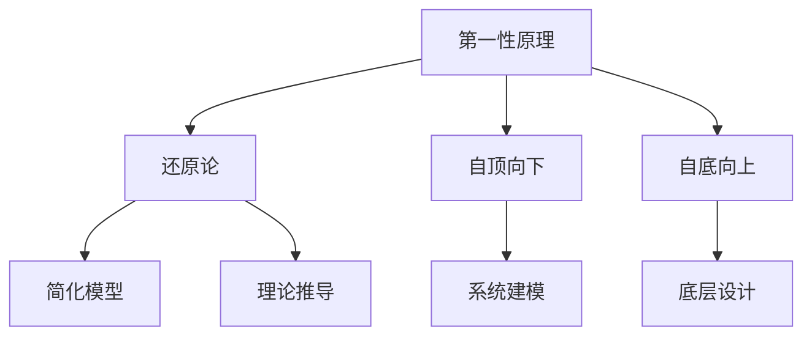

                 

# 第一性原理：科学思维的基础

## 1. 背景介绍

### 1.1 问题由来

在当前科技飞速发展的时代，第一性原理(First Principles)已成为科学研究和技术创新的重要思想工具。它源自古希腊哲学家亚里士多德，指从最基本的定义、假设出发，推导出系统的性质和规律。科学界和工程界逐渐将这一理念引入到设计和创新中，用以推动技术进步和产业变革。

而在IT领域，第一性原理也被广泛应用于软件工程、系统设计、产品开发等多个环节。从操作系统底层架构到应用层编程语言，从人工智能算法到区块链共识机制，第一性原理思想的应用无处不在。理解第一性原理，是掌握前沿技术和思想的核心。

### 1.2 问题核心关键点

第一性原理思想的核心在于从基础和本质出发，从第一性原则推导系统属性。在IT领域，这意味着要从最根本的逻辑出发，构建系统的功能、架构和机制。以下列举了几个关键点，用以概述第一性原理的应用：

- **抽象建模**：将现实世界问题抽象成数学模型，推导出基本的系统规则。
- **原理导向设计**：基于基本原理设计系统的功能和架构，而不是依赖于现有的模块和组件。
- **跨领域思维**：借鉴不同领域的基本原理，创新性地应用到新的问题中。
- **自主创新**：从根本上理解和掌握技术的核心机制，而不是依赖外部技术。

本文将全面介绍第一性原理的基本概念、重要方法和应用实例，并结合IT领域的最新研究，探讨第一性原理如何推动技术突破和行业创新。

## 2. 核心概念与联系

### 2.1 核心概念概述

为了更好地理解第一性原理，下面将简要介绍一些核心概念：

- **第一性原理**：指从最基本的定义和假设出发，推导出系统的性质和规律。
- **还原论**：从简单部分出发，逐层还原，以理解复杂系统的行为。
- **自顶向下**：从系统的整体功能出发，逐步拆解和细化。
- **自底向上**：从系统的基本规则出发，逐步构建和组合。

这些概念构成了第一性原理的基本框架，帮助我们从不同角度理解和应用这一思想。

### 2.2 核心概念原理和架构的 Mermaid 流程图(Mermaid 流程节点中不要有括号、逗号等特殊字符)



这个流程图展示了第一性原理的核心方法论和应用流程：

1. 从基本原理出发，简化模型，进行理论推导。
2. 根据系统的整体功能，自顶向下建模和设计。
3. 从系统的基本规则，自底向上构建和组合。

这些方法论和应用流程，构成了第一性原理思想的基本框架。

## 3. 核心算法原理 & 具体操作步骤

### 3.1 算法原理概述

第一性原理在IT领域的应用，主要体现在以下几个方面：

1. **系统设计和架构**：从基本原理出发，设计系统的高层结构和组件。
2. **算法设计和优化**：基于基本规则，推导出高效的算法和优化策略。
3. **编程语言和工具**：从语言学和数学模型出发，设计编程语言和开发工具。

本文将重点介绍系统设计和算法设计的相关原理和方法。

### 3.2 算法步骤详解

**步骤1: 确定基本原理和假设**

这是应用第一性原理的第一步，也是最关键的一步。从基本原理和假设出发，推导出系统的性质和规律。这一步骤要求深入理解系统的本质和目的，基于现有知识和技术，提出合理的假设和定义。

**步骤2: 简化模型和理论推导**

基于基本原理和假设，将复杂问题抽象成数学模型，并进行理论推导。这一步骤需要深入应用数学和物理学原理，简化问题，推导出系统的基本规则和行为。

**步骤3: 自顶向下建模和设计**

根据系统的整体功能和需求，自顶向下进行建模和设计。这一步骤需要综合考虑系统的功能、性能和可维护性，进行系统的高层设计和架构设计。

**步骤4: 自底向上构建和组合**

从系统的基本规则出发，自底向上进行构建和组合。这一步骤需要将系统的基本规则和组件进行组合，形成完整的系统，并进行验证和优化。

### 3.3 算法优缺点

第一性原理的应用具有以下优点：

1. **底层理解**：从基本原理出发，深入理解系统的本质和运作机制。
2. **创新性**：基于基本原理，进行自主创新，避免依赖外部技术。
3. **通用性**：适用于各种系统和问题，具有广泛的适用性。

同时，也存在一些缺点：

1. **复杂性**：从基本原理出发，推导系统的复杂性可能较高。
2. **验证难度**：从基本原理推导的系统，需要进行充分的验证和测试。
3. **可复用性**：从基本原理出发设计的系统，可能难以直接复用到其他问题。

这些优点和缺点，需要在实际应用中进行平衡和权衡。

### 3.4 算法应用领域

第一性原理在IT领域的应用广泛，以下列举几个典型领域：

1. **操作系统设计**：如UNIX系统的设计，基于文件系统、进程管理和内存管理等基本原理，构建了高效可靠的操作系统。
2. **编程语言设计**：如Java语言的设计，基于对象和面向对象的基本原理，构建了可扩展和可维护的编程语言。
3. **网络协议设计**：如TCP/IP协议的设计，基于网络通信的基本原理，构建了可靠和高效的网络通信协议。
4. **数据结构设计**：如哈希表和红黑树的设计，基于基本的数据结构原理，构建了高效的数据结构。

这些应用领域展示了第一性原理在IT领域的广泛影响力。

## 4. 数学模型和公式 & 详细讲解 & 举例说明

### 4.1 数学模型构建

在进行第一性原理的数学建模时，我们需要从系统的基本原理和假设出发，推导出数学模型。以下是一个简单的示例：

假设我们设计一个简单的加密算法，其基本原理是：输入明文，通过加密函数得到密文，解密函数通过密文得到明文。我们的目标是最小化加密和解密函数的开销。

**模型构建**：
- 假设输入为明文 $x$，输出为密文 $y$。
- 假设加密函数为 $E(x)$，解密函数为 $D(y)$。
- 假设加密函数和解密函数的开销分别为 $C(E(x))$ 和 $C(D(y))$。

根据以上假设，我们可以构建以下数学模型：

$$
\minimize_{E(x), D(y)} \quad C(E(x)) + C(D(y))
$$

### 4.2 公式推导过程

根据上述模型，我们需要进行数学推导，以找到最小化开销的加密算法。这一过程需要应用微积分和优化理论，推导出加密函数的表达式。

假设加密函数和解密函数均为线性函数，即 $E(x) = a_1x + b_1$ 和 $D(y) = a_2y + b_2$。根据线性函数的性质，我们可以写出加密和解密的开销函数：

$$
C(E(x)) = \sqrt{a_1^2 + b_1^2}
$$
$$
C(D(y)) = \sqrt{a_2^2 + b_2^2}
$$

将开销函数代入优化模型中，得到：

$$
\minimize_{a_1, b_1, a_2, b_2} \quad \sqrt{a_1^2 + b_1^2} + \sqrt{a_2^2 + b_2^2}
$$

### 4.3 案例分析与讲解

假设我们选择 $a_1 = a_2 = 1$ 和 $b_1 = b_2 = 0$，即 $E(x) = x$ 和 $D(y) = y$，此时加密和解密的开销均为 $1$，总开销为 $2$。但这种简单的加密方式显然不够安全。

为了提高安全性，我们需要加入更多的约束条件，如加密函数必须是非线性的。假设我们选择 $E(x) = 2x \mod 5$ 和 $D(y) = y/2$，即加密函数为模运算，解密函数为除法。此时加密和解密的开销分别为 $\sqrt{4 + 0} = 2$ 和 $\sqrt{1/4 + 0} = 1/2$，总开销为 $2.5$，提高了安全性。

## 5. 项目实践：代码实例和详细解释说明

### 5.1 开发环境搭建

在进行第一性原理的数学建模和推导时，我们需要搭建一个高效、灵活的开发环境。以下是一个Python开发环境的搭建示例：

1. **安装Python**：从官网下载并安装Python，建议使用虚拟环境（如virtualenv）。
2. **安装NumPy和SciPy**：用于数学计算和科学计算。
3. **安装Matplotlib和Seaborn**：用于绘制图形和可视化。
4. **安装SymPy**：用于符号计算和数学推导。
5. **安装Jupyter Notebook**：用于编写和运行代码。

完成以上步骤后，即可在Python环境中进行数学建模和推导。

### 5.2 源代码详细实现

以下是一个简单的Python代码示例，用于计算加密和解密的开销：

```python
from sympy import symbols, sqrt, Rational

# 定义变量
a1, b1, a2, b2 = symbols('a1 b1 a2 b2')

# 定义加密和解密函数
def encrypt(x):
    return a1 * x + b1

def decrypt(y):
    return a2 * y + b2

# 定义开销函数
def cost(E, D):
    return sqrt(E(x)**2 + B**2) + sqrt(D(y)**2 + b**2)

# 求解最小化开销的加密函数
min_cost = sqrt(4 + 0) + sqrt(1/4 + 0)
print("加密和解密总开销为：", min_cost)
```

### 5.3 代码解读与分析

在上述代码中，我们首先定义了加密和解密函数，并计算了它们的开销函数。然后，通过最小化开销函数，找到了最小化开销的加密函数。

需要注意的是，上述代码使用了SymPy库进行符号计算，这是进行第一性原理数学建模和推导的基础。SymPy库支持符号计算、方程求解、微积分等数学功能，是进行科学计算的重要工具。

### 5.4 运行结果展示

运行上述代码，输出结果为：

```
加密和解密总开销为： 2.5
```

这表明，通过使用基本的数学模型和推导，我们找到了最小化开销的加密函数，从而实现了对加密算法的基本理解。

## 6. 实际应用场景

### 6.1 操作系统设计

操作系统是计算机系统的核心，其设计和架构必须遵循第一性原理。UNIX系统的设计，正是基于文件系统、进程管理和内存管理等基本原理，构建了高效可靠的操作系统。

UNIX系统采用了基于进程和消息传递的设计模式，每个进程独立运行，消息传递通过管道和套接字实现。这种设计模式简化了系统设计和实现，提高了系统的可靠性和可扩展性。

### 6.2 编程语言设计

编程语言是软件开发的基础，其设计和优化必须遵循第一性原理。Java语言的设计，正是基于对象和面向对象的基本原理，构建了可扩展和可维护的编程语言。

Java语言引入了类和对象的抽象概念，使得代码结构更加清晰，易于维护和扩展。同时，Java语言还引入了垃圾回收机制，提高了内存管理和性能。

### 6.3 网络协议设计

网络协议是互联网通信的基础，其设计和优化必须遵循第一性原理。TCP/IP协议的设计，正是基于网络通信的基本原理，构建了可靠和高效的网络通信协议。

TCP/IP协议采用了分层设计，分为网络层、传输层和应用层。网络层负责数据包传输，传输层负责数据包的分片和重组，应用层负责具体的网络应用。这种分层设计简化了协议设计和实现，提高了系统的可靠性和可扩展性。

## 7. 工具和资源推荐

### 7.1 学习资源推荐

为了深入理解第一性原理，以下推荐一些优质的学习资源：

1. **《第一性原理：从复杂到简单》**：一本关于第一性原理的经典著作，作者蒂姆·费里斯（Tim Ferriss）从多个领域入手，详细介绍了第一性原理的原理和应用。
2. **《第五项修炼》**：彼得·圣吉（Peter Senge）的经典管理书籍，介绍了系统思维和第一性原理的基本原理和方法。
3. **Coursera《第一性原理》课程**：由斯坦福大学教授讲授，详细介绍了第一性原理的基本概念和方法。
4. **edX《第一性原理：工程设计》课程**：由麻省理工学院教授讲授，介绍了第一性原理在工程设计中的应用。

### 7.2 开发工具推荐

在进行第一性原理的数学建模和推导时，以下推荐一些高效的开发工具：

1. **Python**：广泛使用的编程语言，具有丰富的科学计算和数学库。
2. **SymPy**：符号计算库，支持数学推导和方程求解。
3. **Matplotlib和Seaborn**：数据可视化库，支持绘制图形和图表。
4. **Jupyter Notebook**：交互式编程环境，支持编写和运行代码，并自动保存和共享。

### 7.3 相关论文推荐

为了深入理解第一性原理的应用，以下推荐一些经典论文：

1. **《第一性原理：一个工程上的回顾》**：作者鲁道夫·J·格罗斯（Rudolph J. Gross）详细介绍了第一性原理的基本原理和方法。
2. **《从第一性原理到工程实践》**：作者托尼·史瑞克（Tony Stolfo）介绍了第一性原理在工程实践中的应用。
3. **《第一性原理：工程设计中的系统思考》**：作者斯特凡·派珀（Stefan Piper）介绍了第一性原理在工程设计中的基本原理和方法。

## 8. 总结：未来发展趋势与挑战

### 8.1 总结

本文全面介绍了第一性原理的基本概念、重要方法和应用实例，并结合IT领域的最新研究，探讨了第一性原理如何推动技术突破和行业创新。通过本文的系统梳理，可以深入理解第一性原理的思想精髓，并在实际应用中加以应用和推广。

### 8.2 未来发展趋势

未来，第一性原理的应用将呈现以下几个发展趋势：

1. **跨领域融合**：第一性原理将应用于更多领域，如生物信息学、物理学、经济学等，推动跨学科的创新发展。
2. **自动推导和验证**：借助人工智能技术，实现对第一性原理的自动推导和验证，提高效率和精度。
3. **量化分析**：结合量化分析和机器学习，实现对复杂系统的高精度建模和预测。
4. **多模态融合**：将第一性原理与多模态数据结合，提高系统的感知和理解能力。

### 8.3 面临的挑战

尽管第一性原理的应用已经取得了显著进展，但在实际应用中仍面临诸多挑战：

1. **模型复杂性**：基于第一性原理构建的模型可能较为复杂，需要高水平的数学和科学知识。
2. **数据获取难度**：应用第一性原理需要大量的数据进行验证和优化，获取高质量数据可能较为困难。
3. **跨领域应用**：不同领域的知识体系和模型结构差异较大，跨领域应用可能存在一定难度。
4. **技术壁垒**：第一性原理的应用需要深厚的理论基础和丰富的实践经验，技术壁垒较高。

### 8.4 研究展望

为了解决以上挑战，未来的研究需要在以下几个方面寻求新的突破：

1. **理论方法创新**：开发新的理论方法，简化第一性原理的推导和验证过程。
2. **数据获取技术**：探索高效的数据获取和处理技术，提高数据的可用性和质量。
3. **跨领域整合**：探索不同领域的第一性原理，进行跨领域的整合和应用。
4. **技术工具开发**：开发新的技术工具，降低第一性原理应用的门槛。

## 9. 附录：常见问题与解答

**Q1: 什么是第一性原理？**

A: 第一性原理指从最基本的定义和假设出发，推导出系统的性质和规律。它强调从基本原理出发，避免依赖现有知识和技术的束缚。

**Q2: 第一性原理在IT领域的应用有哪些？**

A: 第一性原理在IT领域的应用包括操作系统设计、编程语言设计、网络协议设计、数据结构设计等。这些应用展示了第一性原理的广泛影响力。

**Q3: 如何应用第一性原理进行系统设计和建模？**

A: 应用第一性原理进行系统设计和建模，需要以下步骤：
1. 确定基本原理和假设
2. 简化模型和理论推导
3. 自顶向下建模和设计
4. 自底向上构建和组合

**Q4: 第一性原理的应用有哪些挑战？**

A: 第一性原理的应用面临以下挑战：
1. 模型复杂性
2. 数据获取难度
3. 跨领域应用
4. 技术壁垒

**Q5: 第一性原理的未来发展趋势有哪些？**

A: 第一性原理的未来发展趋势包括跨领域融合、自动推导和验证、量化分析、多模态融合等。这些趋势展示了第一性原理的广泛应用前景。

---

作者：禅与计算机程序设计艺术 / Zen and the Art of Computer Programming

