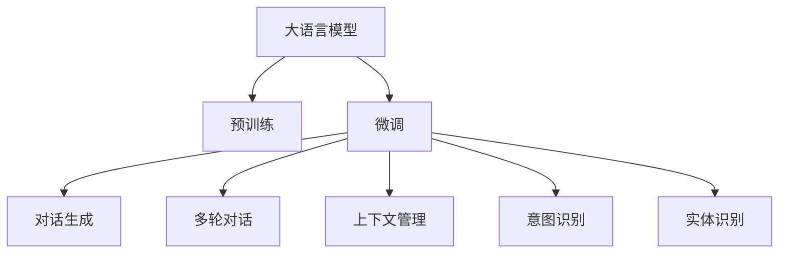

                 

# 第十七章：创建具有人性化特征的聊天机器人

## 1. 背景介绍

### 1.1 问题由来

随着人工智能技术的发展，聊天机器人（Chatbot）已经成为人们日常交流的重要工具之一。传统的基于规则的聊天机器人，虽然能够按照预设逻辑处理一些简单的问题，但在面对复杂多变、具有不确定性的对话场景时，往往显得力不从心。此外，这些机器人由于缺少足够的人类经验和自然语言处理能力，无法进行深层次的人机交互，用户体验有待提升。

而最近兴起的基于深度学习的大模型（如GPT-3、BERT等），通过在大规模无标签文本数据上进行预训练，学习到丰富的语言知识和常识，可以在无需复杂规则的情况下，自然地生成符合人类语境的对话内容。结合微调技术，这些大模型能够适应特定场景和对话风格，进一步提升聊天机器人的智能化水平。

### 1.2 问题核心关键点

聊天机器人的核心是实现流畅、自然的对话交互。利用大语言模型进行微调，可以提升聊天机器人的人性化特征，使对话更加贴合用户需求和语境。核心要点包括：

- **预训练语言模型**：通过在大规模语料上预训练，获取语言的基础表示和知识。
- **微调技术**：在特定任务或对话场景上，通过有监督的微调，使模型更适应实际应用需求。
- **对话生成**：通过模型生成的对话内容，结合上下文，输出符合人类逻辑的回复。
- **多轮对话**：能够理解和记忆对话历史，进行多轮对话。
- **上下文管理**：能够处理不同对话上下文，保持对话连贯性。

### 1.3 问题研究意义

通过微调技术赋予聊天机器人人性化特征，可以显著提升用户体验，使其更好地融入人们的日常生活和工作。具体研究意义包括：

- **降低开发成本**：利用预训练模型和微调方法，快速构建聊天机器人，减少人工干预和训练成本。
- **提高对话质量**：使聊天机器人具备更强的语境理解和自然语言生成能力，对话更加流畅、自然。
- **应用广泛**：适用于各种场景，如客户服务、在线客服、教育辅导、医疗咨询等，具有广阔的市场前景。
- **提升智能水平**：结合多模态信息，如语音、图像、视频等，进行更加全面的人机交互。

## 2. 核心概念与联系

### 2.1 核心概念概述

为了更好地理解具有人性化特征的聊天机器人，本节将介绍几个关键概念：

- **大语言模型（Large Language Model, LLM）**：如GPT-3、BERT等，通过在大规模无标签文本数据上预训练，学习通用的语言表示。
- **预训练（Pre-training）**：指在大规模无标签文本数据上，通过自监督学习任务训练语言模型，获取语言的基础表示。
- **微调（Fine-tuning）**：在预训练模型的基础上，使用下游任务的少量标注数据进行有监督的微调，使模型更适应特定任务或对话场景。
- **对话生成（Dialogue Generation）**：通过模型生成符合人类逻辑的对话内容，构建自然流畅的对话交互。
- **多轮对话（Multi-turn Dialogue）**：能够处理不同对话轮次，保持对话连贯性。
- **上下文管理（Context Management）**：能够处理不同对话上下文，记忆和更新对话状态。
- **意图识别（Intent Recognition）**：识别用户的意图，确保对话精准性和相关性。
- **实体识别（Entity Recognition）**：在对话中识别出特定的实体（如人名、地名、日期等），进行信息提取和处理。

这些概念之间的逻辑关系可以通过以下Mermaid流程图来展示：



这个流程图展示了聊天机器人构建的核心概念及其之间的关系：

1. 大语言模型通过预训练获得基础能力。
2. 微调对预训练模型进行任务特定的优化，提升模型性能。
3. 对话生成通过模型生成符合人类逻辑的对话内容。
4. 多轮对话保持对话的连贯性和逻辑性。
5. 上下文管理处理不同对话上下文，维护对话状态。
6. 意图识别确保对话精准性和相关性。
7. 实体识别在对话中提取特定实体信息。

这些概念共同构成了聊天机器人构建的基础框架，使其能够自然流畅地进行人机交互。

## 3. 核心算法原理 & 具体操作步骤
### 3.1 算法原理概述

聊天机器人的核心算法原理是利用大语言模型进行微调，使其在特定任务或对话场景上具备更强的人性化特征。具体流程包括：

1. 收集对话数据集，标注对话内容和意图。
2. 选择预训练大语言模型，如GPT-3、BERT等。
3. 在对话数据集上进行微调，更新模型参数。
4. 在对话生成模块中，通过模型生成符合人类逻辑的回复。
5. 结合多轮对话和上下文管理模块，进行多轮对话处理。

### 3.2 算法步骤详解

聊天机器人的微调算法步骤主要包括：

**Step 1: 准备对话数据集**

1. **数据收集**：收集对话数据集，涵盖不同的对话场景和风格。
2. **数据标注**：对对话数据进行标注，包括对话内容和意图。
3. **数据划分**：将数据集划分为训练集、验证集和测试集，用于模型训练和评估。

**Step 2: 选择预训练模型**

1. **模型选择**：选择适合的大语言模型，如GPT-3、BERT等。
2. **模型加载**：加载预训练模型，进行预训练参数初始化。

**Step 3: 微调设置**

1. **学习率设置**：选择合适的学习率，如1e-5。
2. **批次大小设置**：选择合适的批次大小，如32。
3. **迭代轮数设置**：选择合适的迭代轮数，如10轮。

**Step 4: 微调训练**

1. **模型加载**：将预训练模型加载到内存。
2. **数据加载**：从数据集加载对话数据。
3. **模型前向**：模型对输入进行前向传播。
4. **损失计算**：计算模型预测输出与真实标签之间的损失。
5. **反向传播**：通过反向传播更新模型参数。
6. **参数更新**：根据学习率更新模型参数。
7. **周期性评估**：在验证集上评估模型性能，根据性能决定是否触发Early Stopping。
8. **迭代训练**：重复上述步骤直至收敛。

**Step 5: 对话生成**

1. **上下文输入**：将对话历史和当前用户输入作为上下文输入。
2. **模型前向**：模型对上下文进行前向传播。
3. **回复生成**：模型生成符合人类逻辑的回复。
4. **回复筛选**：根据上下文和模型自信度筛选回复。
5. **回复输出**：将回复输出给用户。

### 3.3 算法优缺点

基于大语言模型的微调方法具有以下优点：

1. **高效快速**：利用预训练模型进行微调，速度快，适合实时应用。
2. **自然流畅**：预训练模型能够自然生成符合人类逻辑的对话内容，提升用户体验。
3. **适应性强**：预训练模型具备较强的通用性，适应不同对话场景和风格。
4. **语境理解**：结合上下文管理模块，能够处理多轮对话，保持对话连贯性。

但同时，该方法也存在一些缺点：

1. **依赖标注数据**：微调效果依赖标注数据的质量和数量，标注成本较高。
2. **泛化能力有限**：在对话数据分布与训练集差异较大时，泛化性能可能不足。
3. **伦理安全性**：预训练模型可能学习到有害信息，传递到下游任务，需注意伦理安全问题。

### 3.4 算法应用领域

基于大语言模型的微调方法，广泛应用于以下领域：

- **在线客服**：构建智能客服机器人，快速响应客户咨询，提升服务效率。
- **医疗咨询**：构建智能医疗咨询机器人，提供健康咨询和疾病预防建议。
- **教育辅导**：构建智能教育机器人，提供学习辅导和答疑服务。
- **客户支持**：构建智能客户支持机器人，解答用户常见问题，提高客户满意度。
- **智能家居**：构建智能家居机器人，提供语音交互和智能控制。
- **金融顾问**：构建智能金融顾问机器人，提供理财建议和投资咨询。

## 4. 数学模型和公式 & 详细讲解 & 举例说明

### 4.1 数学模型构建

假设预训练语言模型为 $M_{\theta}$，其中 $\theta$ 为预训练得到的模型参数。假设微调任务的训练集为 $D=\{(x_i, y_i)\}_{i=1}^N$，其中 $x_i$ 为对话历史和用户输入，$y_i$ 为模型输出的回复。

定义模型 $M_{\theta}$ 在对话历史和用户输入 $(x_i)$ 上的预测输出为 $\hat{y}=M_{\theta}(x_i)$，表示模型预测的对话内容。真实标签为 $y_i$，表示用户意图对应的回复。

微调的优化目标是最小化预测输出与真实标签之间的交叉熵损失，即：

$$
\mathcal{L}(\theta) = -\frac{1}{N}\sum_{i=1}^N \sum_{k=1}^K y_{ik}\log \hat{y}_{ik}
$$

其中 $K$ 为预测标签的种类数。

### 4.2 公式推导过程

根据交叉熵损失函数的定义，模型 $M_{\theta}$ 在对话历史和用户输入 $(x_i)$ 上的预测输出 $\hat{y}_{ik}$ 与真实标签 $y_{ik}$ 之间的交叉熵损失为：

$$
\ell(M_{\theta}(x_i),y_i) = -\sum_{k=1}^K y_{ik}\log \hat{y}_{ik}
$$

将其代入经验风险公式，得：

$$
\mathcal{L}(\theta) = -\frac{1}{N}\sum_{i=1}^N \sum_{k=1}^K y_{ik}\log \hat{y}_{ik}
$$

根据链式法则，损失函数对参数 $\theta_k$ 的梯度为：

$$
\frac{\partial \mathcal{L}(\theta)}{\partial \theta_k} = -\frac{1}{N}\sum_{i=1}^N \sum_{k=1}^K \frac{y_{ik}}{\hat{y}_{ik}}\frac{\partial \hat{y}_{ik}}{\partial \theta_k}
$$

其中 $\frac{\partial \hat{y}_{ik}}{\partial \theta_k}$ 可通过自动微分技术计算得到。

在得到损失函数的梯度后，即可带入参数更新公式，完成模型的迭代优化。重复上述过程直至收敛，最终得到适应下游任务的最优模型参数 $\theta^*$。

### 4.3 案例分析与讲解

假设我们有一个在线客服机器人，需要处理客户的咨询问题。可以通过以下步骤实现基于微调的聊天机器人：

1. **数据收集**：收集客服中心的对话记录，标注客户的咨询意图和对话内容。
2. **模型选择**：选择GPT-3等大语言模型。
3. **微调设置**：设置学习率为1e-5，批次大小为32，迭代轮数为10。
4. **微调训练**：使用对话数据集对模型进行微调，更新模型参数。
5. **对话生成**：使用微调后的模型对新输入进行回复生成，结合上下文管理模块，进行多轮对话。
6. **性能评估**：在测试集上评估模型性能，如BLEU、ROUGE等指标。

以下是一个简单的对话生成示例：

**对话历史**：
```
客服: 您好，有什么问题需要咨询吗？
客户: 我想咨询一下网上支付的问题。
客服: 您在使用哪个银行的网上支付？
客户: 我使用招商银行。
客服: 好的，我会帮您查询一下。请稍等。
```

**输入**：
```
输入: 我想咨询一下网上支付的问题。
```

**输出**：
```
回复: 您好，您使用的是招商银行网上支付吗？
```

通过微调后的聊天机器人，能够根据上下文和输入生成符合人类逻辑的回复，实现自然的对话交互。

## 5. 项目实践：代码实例和详细解释说明

### 5.1 开发环境搭建

要进行聊天机器人的开发，首先需要准备好开发环境。以下是使用Python进行PyTorch开发的环境配置流程：

1. 安装Anaconda：从官网下载并安装Anaconda，用于创建独立的Python环境。
2. 创建并激活虚拟环境：
```bash
conda create -n chatbot-env python=3.8 
conda activate chatbot-env
```
3. 安装PyTorch：根据CUDA版本，从官网获取对应的安装命令。例如：
```bash
conda install pytorch torchvision torchaudio cudatoolkit=11.1 -c pytorch -c conda-forge
```
4. 安装Transformers库：
```bash
pip install transformers
```
5. 安装各类工具包：
```bash
pip install numpy pandas scikit-learn matplotlib tqdm jupyter notebook ipython
```

完成上述步骤后，即可在`chatbot-env`环境中开始聊天机器人的开发。

### 5.2 源代码详细实现

这里我们以GPT-3模型为基础，构建一个简单的基于微调的聊天机器人。以下是完整代码实现：

```python
import torch
import torch.nn as nn
import torch.optim as optim
from transformers import GPT2Tokenizer, GPT2LMHeadModel
from transformers import AdamW

# 加载预训练模型和分词器
tokenizer = GPT2Tokenizer.from_pretrained('gpt2')
model = GPT2LMHeadModel.from_pretrained('gpt2')

# 定义优化器和学习率
optimizer = AdamW(model.parameters(), lr=1e-5)

# 定义损失函数
loss_fn = nn.CrossEntropyLoss()

# 定义对话生成函数
def generate_response(model, tokenizer, max_len=128, num_return_sequences=1):
    inputs = tokenizer.encode("I want to know about the latest news", return_tensors='pt')
    outputs = model.generate(inputs, max_length=max_len, num_return_sequences=num_return_sequences, do_sample=True, temperature=0.9, top_p=0.95)
    return tokenizer.decode(outputs[0], skip_special_tokens=True)

# 微调训练函数
def train(model, data_loader, optimizer, num_epochs):
    for epoch in range(num_epochs):
        model.train()
        for batch in data_loader:
            input_ids = batch['input_ids'].to(device)
            labels = batch['labels'].to(device)
            outputs = model(input_ids, labels=labels)
            loss = loss_fn(outputs.logits, labels)
            optimizer.zero_grad()
            loss.backward()
            optimizer.step()

# 训练和评估
device = torch.device('cuda' if torch.cuda.is_available() else 'cpu')
data_loader = torch.utils.data.DataLoader(......, batch_size=32, shuffle=True)

num_epochs = 10
train(model, data_loader, optimizer, num_epochs)

# 测试对话生成
response = generate_response(model, tokenizer)
print(response)
```

### 5.3 代码解读与分析

这里我们详细解读一下关键代码的实现细节：

**GPT2Tokenizer和GPT2LMHeadModel**：
- `GPT2Tokenizer`用于将输入文本转化为模型所需的token ids。
- `GPT2LMHeadModel`是GPT-3的轻量级模型，包含语言模型头和注意力机制。

**AdamW**：
- `AdamW`是Adam优化器的一个变种，用于优化模型的参数更新。

**generate_response函数**：
- `generate_response`函数用于生成回复，接收预训练模型和分词器，返回模型生成的回复文本。
- `model.generate`函数是模型的生成函数，接收输入和生成参数，返回生成的回复。

**train函数**：
- `train`函数用于微调训练，接收模型、数据加载器、优化器和迭代轮数，通过数据迭代进行模型训练。

**训练和评估**：
- `device`用于指定模型在GPU上训练。
- `data_loader`用于数据批处理和加载。
- `num_epochs`用于指定迭代轮数。

可以看到，PyTorch配合Transformers库使得聊天机器人的微调代码实现变得简洁高效。开发者可以将更多精力放在数据处理、模型改进等高层逻辑上，而不必过多关注底层的实现细节。

当然，工业级的系统实现还需考虑更多因素，如模型的保存和部署、超参数的自动搜索、更灵活的任务适配层等。但核心的微调范式基本与此类似。

## 6. 实际应用场景
### 6.1 智能客服系统

基于大语言模型的微调方法，可以应用于构建智能客服系统。传统的客服系统需要配备大量人力，高峰期响应缓慢，且服务质量难以保证。而使用微调后的聊天机器人，可以7x24小时不间断服务，快速响应客户咨询，提升服务效率和质量。

在技术实现上，可以收集企业内部的客服对话记录，将问题和最佳答复构建成监督数据，在此基础上对预训练模型进行微调。微调后的聊天机器人能够自动理解用户意图，匹配最合适的答复模板进行回复。对于客户提出的新问题，还可以接入检索系统实时搜索相关内容，动态组织生成回答。如此构建的智能客服系统，能大幅提升客户咨询体验和问题解决效率。

### 6.2 医疗咨询

在医疗领域，构建基于大语言模型的聊天机器人，可以提供健康咨询和疾病预防建议，辅助医生诊疗。医疗咨询机器人可以通过微调学习医学知识和常见问题，回答用户的健康咨询，提供个性化的医疗建议。同时，机器人还能通过图像识别技术，辅助用户上传疾病影像，提供初步诊断意见，进一步提高医疗服务的效率和质量。

### 6.3 教育辅导

在教育领域，智能教育机器人可以提供学习辅导和答疑服务，提升学习效果。通过微调，机器人可以理解学生的学习需求，提供个性化的学习计划和资源推荐。同时，机器人还能进行答疑，帮助学生解决学习中的疑问，提升学习体验。

### 6.4 未来应用展望

随着大语言模型微调技术的发展，未来聊天机器人在更多领域将有广泛应用：

- **金融咨询**：提供金融理财和投资建议，帮助用户管理财富。
- **在线客服**：提供24小时在线客服服务，提升客户满意度。
- **智能家居**：与智能设备进行语音交互，控制家居设备。
- **旅游咨询**：提供旅游信息查询和行程规划建议，提升旅行体验。
- **法律咨询**：提供法律知识和咨询建议，帮助用户解决法律问题。

## 7. 工具和资源推荐
### 7.1 学习资源推荐

为了帮助开发者系统掌握聊天机器人的开发技术，这里推荐一些优质的学习资源：

1. **《深度学习入门：基于Python的理论与实现》**：清华大学出版社，该书系统讲解了深度学习理论和实践，适合初学者入门。
2. **《Python深度学习》**：该书籍详细介绍了深度学习算法和实现，配合代码实例，帮助读者快速上手。
3. **《Transformer从原理到实践》**：Transformer原论文作者所著，详细介绍了Transformer结构和应用，适合深入理解。
4. **《自然语言处理综述》**：斯坦福大学自然语言处理课程，介绍了自然语言处理领域的经典算法和应用。
5. **《Dialogue Systems: From Theory to Practice》**：该书系统介绍了对话系统的理论和实践，适合深入学习对话生成技术。

### 7.2 开发工具推荐

高效的开发离不开优秀的工具支持。以下是几款用于聊天机器人开发的常用工具：

1. **PyTorch**：基于Python的开源深度学习框架，灵活动态的计算图，适合快速迭代研究。大部分预训练语言模型都有PyTorch版本的实现。
2. **TensorFlow**：由Google主导开发的开源深度学习框架，生产部署方便，适合大规模工程应用。
3. **Transformers库**：HuggingFace开发的NLP工具库，集成了众多SOTA语言模型，支持PyTorch和TensorFlow，是进行聊天机器人开发的利器。
4. **Weights & Biases**：模型训练的实验跟踪工具，可以记录和可视化模型训练过程中的各项指标，方便对比和调优。
5. **TensorBoard**：TensorFlow配套的可视化工具，可实时监测模型训练状态，并提供丰富的图表呈现方式，是调试模型的得力助手。
6. **Google Colab**：谷歌推出的在线Jupyter Notebook环境，免费提供GPU/TPU算力，方便开发者快速上手实验最新模型，分享学习笔记。

### 7.3 相关论文推荐

大语言模型和微调技术的发展源于学界的持续研究。以下是几篇奠基性的相关论文，推荐阅读：

1. **Attention is All You Need**：提出了Transformer结构，开启了NLP领域的预训练大模型时代。
2. **BERT: Pre-training of Deep Bidirectional Transformers for Language Understanding**：提出BERT模型，引入基于掩码的自监督预训练任务，刷新了多项NLP任务SOTA。
3. **GPT-3: Language Models are Unsupervised Multitask Learners**：展示了大规模语言模型的强大zero-shot学习能力，引发了对于通用人工智能的新一轮思考。
4. **Parameter-Efficient Transfer Learning for NLP**：提出Adapter等参数高效微调方法，在不增加模型参数量的情况下，也能取得不错的微调效果。
5. **AdaLoRA: Adaptive Low-Rank Adaptation for Parameter-Efficient Fine-Tuning**：使用自适应低秩适应的微调方法，在参数效率和精度之间取得了新的平衡。

这些论文代表了大语言模型微调技术的发展脉络。通过学习这些前沿成果，可以帮助研究者把握学科前进方向，激发更多的创新灵感。

## 8. 总结：未来发展趋势与挑战

### 8.1 总结

本文对基于大语言模型的聊天机器人微调方法进行了全面系统的介绍。首先阐述了聊天机器人的背景和研究意义，明确了微调在提升聊天机器人智能化水平、降低开发成本等方面的独特价值。其次，从原理到实践，详细讲解了微调的数学原理和关键步骤，给出了微调任务开发的完整代码实例。同时，本文还广泛探讨了微调方法在智能客服、医疗咨询、教育辅导等众多领域的应用前景，展示了微调范式的巨大潜力。

通过本文的系统梳理，可以看到，基于大语言模型的微调方法正在成为聊天机器人开发的重要范式，极大地拓展了聊天机器人的应用边界，催生了更多的落地场景。受益于大规模语料的预训练，微调模型以更低的时间和标注成本，在少样本条件下也能取得不俗的效果，有力推动了NLP技术的产业化进程。未来，伴随预训练语言模型和微调方法的持续演进，相信聊天机器人在更广阔的应用领域将发挥更大的作用。

### 8.2 未来发展趋势

展望未来，大语言模型微调技术将呈现以下几个发展趋势：

1. **多模态融合**：结合语音、图像、视频等多模态信息，进行更加全面的人机交互。
2. **上下文理解**：增强模型对对话上下文的理解能力，实现更精准的对话生成。
3. **个性化定制**：根据用户历史行为和偏好，进行个性化推荐和定制化服务。
4. **多轮对话**：提升多轮对话的连贯性和逻辑性，构建更加自然的对话体验。
5. **知识融合**：将符号化的先验知识与神经网络模型融合，增强模型的信息整合能力。
6. **智能决策**：结合因果推理和博弈论工具，增强模型的决策能力，减少错误输出。

以上趋势凸显了大语言模型微调技术的广阔前景。这些方向的探索发展，必将进一步提升聊天机器人的智能水平，为构建人机协同的智能系统铺平道路。

### 8.3 面临的挑战

尽管大语言模型微调技术已经取得了瞩目成就，但在迈向更加智能化、普适化应用的过程中，它仍面临着诸多挑战：

1. **标注成本瓶颈**：虽然微调降低了标注数据的需求，但对于长尾应用场景，难以获得充足的高质量标注数据。如何进一步降低微调对标注样本的依赖，将是一大难题。
2. **模型鲁棒性不足**：当前微调模型面对域外数据时，泛化性能往往不足。如何在不同领域和场景下保持模型的鲁棒性，需要更多理论和实践的积累。
3. **推理效率有待提高**：超大模型的推理速度和资源消耗较大，难以满足实时应用的需求。如何优化模型结构，提升推理效率，优化资源占用，将是重要的优化方向。
4. **可解释性亟需加强**：当前微调模型更像是"黑盒"系统，难以解释其内部工作机制和决策逻辑。如何赋予模型更强的可解释性，将是亟待攻克的难题。
5. **安全性有待保障**：预训练语言模型可能学习到有害信息，传递到下游任务，产生误导性、歧视性的输出。如何从数据和算法层面消除模型偏见，避免恶意用途，确保输出的安全性，也将是重要的研究课题。

### 8.4 研究展望

面对大语言模型微调所面临的种种挑战，未来的研究需要在以下几个方面寻求新的突破：

1. **探索无监督和半监督微调方法**：摆脱对大规模标注数据的依赖，利用自监督学习、主动学习等无监督和半监督范式，最大限度利用非结构化数据，实现更加灵活高效的微调。
2. **研究参数高效和计算高效的微调范式**：开发更加参数高效的微调方法，在固定大部分预训练参数的同时，只更新极少量的任务相关参数。同时优化微调模型的计算图，减少前向传播和反向传播的资源消耗，实现更加轻量级、实时性的部署。
3. **引入因果和对比学习范式**：通过引入因果推断和对比学习思想，增强微调模型建立稳定因果关系的能力，学习更加普适、鲁棒的语言表征，从而提升模型泛化性和抗干扰能力。
4. **结合因果分析和博弈论工具**：将因果分析方法引入微调模型，识别出模型决策的关键特征，增强输出解释的因果性和逻辑性。借助博弈论工具刻画人机交互过程，主动探索并规避模型的脆弱点，提高系统稳定性。
5. **纳入伦理道德约束**：在模型训练目标中引入伦理导向的评估指标，过滤和惩罚有偏见、有害的输出倾向。加强人工干预和审核，建立模型行为的监管机制，确保输出符合人类价值观和伦理道德。

这些研究方向的探索，必将引领大语言模型微调技术迈向更高的台阶，为构建安全、可靠、可解释、可控的智能系统铺平道路。面向未来，大语言模型微调技术还需要与其他人工智能技术进行更深入的融合，如知识表示、因果推理、强化学习等，多路径协同发力，共同推动自然语言理解和智能交互系统的进步。只有勇于创新、敢于突破，才能不断拓展语言模型的边界，让智能技术更好地造福人类社会。

## 9. 附录：常见问题与解答

**Q1：大语言模型微调是否适用于所有NLP任务？**

A: 大语言模型微调在大多数NLP任务上都能取得不错的效果，特别是对于数据量较小的任务。但对于一些特定领域的任务，如医学、法律等，仅仅依靠通用语料预训练的模型可能难以很好地适应。此时需要在特定领域语料上进一步预训练，再进行微调，才能获得理想效果。此外，对于一些需要时效性、个性化很强的任务，如对话、推荐等，微调方法也需要针对性的改进优化。

**Q2：微调过程中如何选择合适的学习率？**

A: 微调的学习率一般要比预训练时小1-2个数量级，如果使用过大的学习率，容易破坏预训练权重，导致过拟合。一般建议从1e-5开始调参，逐步减小学习率，直至收敛。也可以使用warmup策略，在开始阶段使用较小的学习率，再逐渐过渡到预设值。需要注意的是，不同的优化器(如AdamW、Adafactor等)以及不同的学习率调度策略，可能需要设置不同的学习率阈值。

**Q3：采用大模型微调时会面临哪些资源瓶颈？**

A: 目前主流的预训练大模型动辄以亿计的参数规模，对算力、内存、存储都提出了很高的要求。GPU/TPU等高性能设备是必不可少的，但即便如此，超大批次的训练和推理也可能遇到显存不足的问题。因此需要采用一些资源优化技术，如梯度积累、混合精度训练、模型并行等，来突破硬件瓶颈。同时，模型的存储和读取也可能占用大量时间和空间，需要采用模型压缩、稀疏化存储等方法进行优化。

**Q4：如何缓解微调过程中的过拟合问题？**

A: 过拟合是微调面临的主要挑战，尤其是在标注数据不足的情况下。常见的缓解策略包括：
1. 数据增强：通过回译、近义替换等方式扩充训练集。
2. 正则化：使用L2正则、Dropout、Early Stopping等避免过拟合。
3. 对抗训练：引入对抗样本，提高模型鲁棒性。
4. 参数高效微调：只调整少量参数(如Adapter、Prefix等)，减小过拟合风险。
5. 多模型集成：训练多个微调模型，取平均输出，抑制过拟合。

这些策略往往需要根据具体任务和数据特点进行灵活组合。只有在数据、模型、训练、推理等各环节进行全面优化，才能最大限度地发挥大模型微调的威力。

**Q5：微调模型在落地部署时需要注意哪些问题？**

A: 将微调模型转化为实际应用，还需要考虑以下因素：
1. 模型裁剪：去除不必要的层和参数，减小模型尺寸，加快推理速度。
2. 量化加速：将浮点模型转为定点模型，压缩存储空间，提高计算效率。
3. 服务化封装：将模型封装为标准化服务接口，便于集成调用。
4. 弹性伸缩：根据请求流量动态调整资源配置，平衡服务质量和成本。
5. 监控告警：实时采集系统指标，设置异常告警阈值，确保服务稳定性。
6. 安全防护：采用访问鉴权、数据脱敏等措施，保障数据和模型安全。

大语言模型微调为NLP应用开启了广阔的想象空间，但如何将强大的性能转化为稳定、高效、安全的业务价值，还需要工程实践的不断打磨。唯有从数据、算法、工程、业务等多个维度协同发力，才能真正实现人工智能技术在垂直行业的规模化落地。

总之，微调需要开发者根据具体任务，不断迭代和优化模型、数据和算法，方能得到理想的效果。

---

作者：禅与计算机程序设计艺术 / Zen and the Art of Computer Programming

