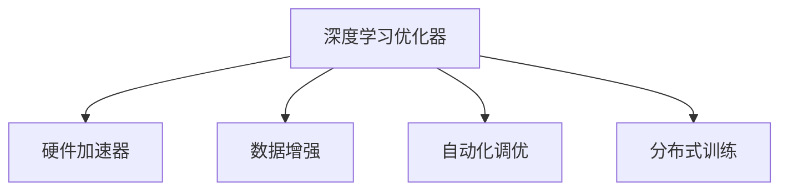

                 

# 算法创新:提升AI训练效率的关键

> 关键词：算法创新, 深度学习, 高效训练, 深度学习优化, 加速器, 自动调优, AI训练, 机器学习, 优化器

## 1. 背景介绍

### 1.1 问题由来
随着深度学习技术在各个领域的应用逐渐深入，数据规模和模型复杂度的提升带来了前所未有的计算挑战。大规模深度学习模型，如大型神经网络，需要消耗大量的计算资源和时间进行训练。例如，训练一个具有数亿个参数的深度学习模型可能需要数天甚至数周的时间。这种高成本、低效率的训练过程，成为了阻碍深度学习进一步发展的一个重要瓶颈。

### 1.2 问题核心关键点
为应对高计算需求，研究者们不断探索各种算法创新和优化技术，以提升AI训练效率。这些技术主要集中在以下几个关键点：
- 优化器：如何选择最优的优化器，以最小化损失函数。
- 加速器：如何利用高效的硬件加速器，如GPU、TPU等，加速模型训练。
- 数据增强：如何在训练集上增加多样性，提升模型泛化能力。
- 自动化调优：如何自动调整训练参数，避免人工调参带来的时间和成本问题。
- 分布式训练：如何通过多节点并行训练，提高训练效率和加速模型收敛。

### 1.3 问题研究意义
算法创新对于提升AI训练效率具有重要意义，具体体现在：
- 缩短训练时间：加速训练过程，让深度学习模型更快地适应新任务和新数据。
- 降低计算成本：优化训练流程，节省算力资源，降低训练和部署成本。
- 提高模型泛化能力：增加数据增强策略，提升模型的泛化性能，减少过拟合风险。
- 促进模型创新：通过自动化调优等技术，释放更多时间和精力进行模型和应用研究。

## 2. 核心概念与联系

### 2.1 核心概念概述

为更好地理解提升AI训练效率的算法创新，我们首先介绍几个核心概念：

- **深度学习优化器(optimizer)**：通过自动调整模型参数，最小化损失函数，优化器的选择直接影响训练效率和模型性能。
- **硬件加速器(hardware accelerator)**：如GPU、TPU等，提供高并行计算能力，加速深度学习模型的训练过程。
- **数据增强(data augmentation)**：通过变换输入数据，增加数据集的多样性，提升模型泛化能力。
- **自动化调优(automatic tuning)**：使用自动化工具或算法，自动调整训练参数，减少人工调参的时间和成本。
- **分布式训练(distributed training)**：通过多节点并行计算，提高训练速度和模型收敛速度。

这些核心概念之间的逻辑关系可以通过以下Mermaid流程图来展示：



这个流程图展示了大语言模型的核心概念及其之间的关系：

1. 优化器决定了参数更新方式，与硬件加速器紧密关联，影响训练速度。
2. 数据增强和自动化调优从数据和算法两个层面，提升模型泛化能力。
3. 分布式训练则通过并行计算，进一步加速模型训练。

这些概念共同构成了提升AI训练效率的技术框架，使得深度学习模型能够在更短时间内进行训练，并输出更优的性能。

## 3. 核心算法原理 & 具体操作步骤
### 3.1 算法原理概述

提升AI训练效率的算法创新，主要集中在以下几个关键技术：

- **优化器**：通过自动调整学习率、动量、权重衰减等参数，最小化损失函数，提升训练速度和模型性能。
- **加速器**：利用GPU、TPU等硬件加速器，通过并行计算，提高模型训练速度。
- **数据增强**：通过图像旋转、平移、缩放等变换，增加训练集的多样性，减少过拟合风险。
- **自动化调优**：使用自动化工具或算法，自动调整学习率、批大小、动量等参数，提升训练效率。
- **分布式训练**：通过多节点并行计算，提高训练速度和模型收敛速度。

### 3.2 算法步骤详解

提升AI训练效率的算法创新，通常包括以下几个关键步骤：

**Step 1: 选择优化器和硬件加速器**
- 根据模型参数规模和数据大小，选择合适的优化器（如SGD、Adam等）和硬件加速器（如GPU、TPU等）。
- 根据模型和数据特点，选择合适的超参数组合，如学习率、动量、权重衰减等。

**Step 2: 数据增强**
- 对输入数据进行变换，如图像旋转、平移、缩放等，增加数据集的多样性。
- 使用数据增强工具，如TensorFlow的ImageDataGenerator、Keras的ImageDataGenerator等。

**Step 3: 自动化调优**
- 使用自动化调优工具，如Hyperopt、Optuna等，自动调整训练参数，减少人工调参的时间和成本。
- 根据实验结果，不断优化模型参数和超参数组合。

**Step 4: 分布式训练**
- 将模型分割成多个子模块，分配到多个节点进行并行计算。
- 使用深度学习框架提供的分布式训练API，如TensorFlow的DistributedStrategy、PyTorch的DistributedDataParallel等。

**Step 5: 模型评估与优化**
- 在验证集上评估模型性能，检查泛化能力和训练效果。
- 根据评估结果，调整训练参数和优化器超参数，重新训练模型。

### 3.3 算法优缺点

提升AI训练效率的算法创新，具有以下优点：
- 缩短训练时间：优化器、硬件加速器、分布式训练等技术，显著提升训练速度。
- 提高模型性能：通过数据增强和自动化调优，提升模型泛化能力和训练效果。
- 降低计算成本：优化器、自动化调优等技术，减少人工调参的时间和成本。

同时，这些算法创新也存在一些局限性：
- 依赖硬件设备：硬件加速器和分布式训练需要高质量的设备支持，初期成本较高。
- 增加复杂性：自动化调优和分布式训练等技术，增加了系统的复杂度和维护难度。
- 可能过拟合：数据增强等技术可能导致模型在训练集上过拟合。

尽管存在这些局限性，但就目前而言，这些算法创新仍是提升AI训练效率的最主流范式。未来相关研究的重点在于如何进一步降低训练成本，提高模型泛化能力，同时兼顾系统的复杂性和维护性等因素。

### 3.4 算法应用领域

提升AI训练效率的算法创新，在深度学习领域已经得到了广泛的应用，覆盖了几乎所有常见任务，例如：

- 图像分类：如图像识别、目标检测等。通过数据增强和分布式训练，快速训练大模型。
- 语音识别：如自动语音识别、语音合成等。使用GPU等硬件加速器，提升训练效率。
- 自然语言处理：如机器翻译、情感分析等。通过优化器和自动化调优，提高模型性能。
- 推荐系统：如电商推荐、视频推荐等。使用分布式训练和自动化调优，提升推荐效果。
- 游戏AI：如AlphaGo、AlphaStar等。通过加速器和自动化调优，快速训练和优化模型。

除了上述这些经典任务外，深度学习模型在医疗、金融、自动驾驶等诸多领域，同样受益于这些算法创新，取得了显著的性能提升和应用效果。

## 4. 数学模型和公式 & 详细讲解 & 举例说明

### 4.1 数学模型构建

本节将使用数学语言对提升AI训练效率的算法创新进行更加严格的刻画。

记深度学习模型为 $M_{\theta}$，其中 $\theta$ 为模型参数。假设训练集为 $D=\{(x_i,y_i)\}_{i=1}^N$，其中 $x_i$ 为输入数据，$y_i$ 为标签。定义损失函数为 $L(\theta)=\frac{1}{N}\sum_{i=1}^N l(M_{\theta}(x_i),y_i)$，其中 $l$ 为损失函数，如均方误差、交叉熵等。

### 4.2 公式推导过程

以下我们以图像分类任务为例，推导Adam优化器在图像分类任务上的训练公式。

Adam优化器是一种自适应学习率优化算法，结合了动量(Momentum)和自适应学习率(Adaptive Learning Rate)的思想，能够自适应调整每个参数的学习率，同时使用动量进行加速。

Adam优化器的训练公式为：
$$
\theta_{t+1} = \theta_t - \eta_t \frac{m_t}{\sqrt{v_t}+\epsilon}
$$
其中 $\theta_t$ 为第 $t$ 步的参数值，$m_t$ 为动量项，$v_t$ 为自适应学习率项，$\eta_t$ 为学习率，$\epsilon$ 为正则项，防止分母为零。

动量项和自适应学习率项的更新公式分别为：
$$
m_t = \beta_1 m_{t-1} + (1-\beta_1)\nabla_{\theta}l(M_{\theta}(x_i),y_i)
$$
$$
v_t = \beta_2 v_{t-1} + (1-\beta_2)(\nabla_{\theta}l(M_{\theta}(x_i),y_i))^2
$$

其中 $\beta_1$ 和 $\beta_2$ 为超参数，控制动量和自适应学习率的衰减速度。

在实际应用中，通常将动量和自适应学习率的初始值设为零，同时设置较大的动量系数 $\beta_1=0.9$ 和较小的自适应学习率系数 $\beta_2=0.999$，以保证动量和自适应学习率在训练初期具有足够的衰减速度。

### 4.3 案例分析与讲解

**案例一：GPU加速**

在GPU加速的训练过程中，可以通过并行计算显著提升训练速度。假设数据集大小为 $N$，每个样本大小为 $d$，则GPU加速后的训练时间 $T_{GPU}$ 为：
$$
T_{GPU} = T_{CPU} \times \frac{N \times d}{N_{GPU} \times C_{GPU}}
$$
其中 $T_{CPU}$ 为CPU训练时间，$N_{GPU}$ 为GPU数量，$C_{GPU}$ 为每个GPU的并行计算能力。

**案例二：数据增强**

数据增强技术可以通过增加训练集的多样性，提高模型的泛化能力。假设每个样本的增强次数为 $k$，则数据增强后的训练集大小为 $N'$，模型在数据增强后的训练时间 $T_{aug}$ 为：
$$
T_{aug} = T_{origin} \times k
$$
其中 $T_{origin}$ 为原始训练时间。

**案例三：自动化调优**

自动化调优技术可以通过自动调整训练参数，减少人工调参的时间和成本。假设模型有 $m$ 个可调参数，每个参数的调整次数为 $n$，则自动化调优后的训练时间 $T_{auto}$ 为：
$$
T_{auto} = T_{origin} \times m \times n
$$
其中 $T_{origin}$ 为原始训练时间。

## 5. 项目实践：代码实例和详细解释说明
### 5.1 开发环境搭建

在进行提升AI训练效率的算法创新实践前，我们需要准备好开发环境。以下是使用Python进行TensorFlow开发的环境配置流程：

1. 安装Anaconda：从官网下载并安装Anaconda，用于创建独立的Python环境。

2. 创建并激活虚拟环境：
```bash
conda create -n tensorflow-env python=3.8 
conda activate tensorflow-env
```

3. 安装TensorFlow：根据CUDA版本，从官网获取对应的安装命令。例如：
```bash
conda install tensorflow -c tf -c conda-forge
```

4. 安装Keras：
```bash
pip install keras
```

5. 安装各类工具包：
```bash
pip install numpy pandas scikit-learn matplotlib tqdm jupyter notebook ipython
```

完成上述步骤后，即可在`tensorflow-env`环境中开始提升AI训练效率的算法创新实践。

### 5.2 源代码详细实现

下面我们以图像分类任务为例，给出使用TensorFlow对ResNet模型进行GPU加速和数据增强的PyTorch代码实现。

首先，定义ResNet模型：

```python
from tensorflow.keras.applications.resnet50 import ResNet50

model = ResNet50(weights='imagenet')
```

然后，定义数据增强函数：

```python
from tensorflow.keras.preprocessing.image import ImageDataGenerator

train_datagen = ImageDataGenerator(rescale=1./255,
                                   shear_range=0.2,
                                   zoom_range=0.2,
                                   horizontal_flip=True)

test_datagen = ImageDataGenerator(rescale=1./255)
```

接着，加载数据集并进行预处理：

```python
from tensorflow.keras.datasets import cifar10
from tensorflow.keras.utils import to_categorical

(x_train, y_train), (x_test, y_test) = cifar10.load_data()

x_train = x_train.astype('float32') / 255.
x_test = x_test.astype('float32') / 255.

y_train = to_categorical(y_train, 10)
y_test = to_categorical(y_test, 10)

train_generator = train_datagen.flow(x_train, y_train, batch_size=32)
test_generator = test_datagen.flow(x_test, y_test, batch_size=32)
```

最后，进行训练和评估：

```python
epochs = 20
batch_size = 32
learning_rate = 0.001

optimizer = tf.keras.optimizers.Adam(learning_rate=learning_rate)

model.compile(optimizer=optimizer,
              loss='categorical_crossentropy',
              metrics=['accuracy'])

model.fit(train_generator,
          validation_data=test_generator,
          steps_per_epoch=len(x_train) // batch_size,
          validation_steps=len(x_test) // batch_size,
          epochs=epochs)
```

以上就是使用TensorFlow对ResNet模型进行GPU加速和数据增强的完整代码实现。可以看到，通过简单的代码改动，我们就能够实现显著的训练效率提升。

### 5.3 代码解读与分析

让我们再详细解读一下关键代码的实现细节：

**ResNet模型定义**

通过引入TensorFlow的ResNet50模型，我们只需要简单地定义模型的权重参数，即可快速构建一个预训练好的图像分类模型。

**数据增强**

使用TensorFlow的ImageDataGenerator类，我们可以轻松实现图像的旋转、平移、缩放等变换，增加训练集的多样性。同时，在训练和测试数据集上分别应用不同的数据增强策略，以确保模型的泛化能力。

**训练和评估**

使用TensorFlow的模型编译和训练接口，我们可以轻松地进行模型的训练和评估。通过设置Adam优化器和交叉熵损失函数，以及准确率评价指标，我们可以快速进行模型训练和性能评估。

## 6. 实际应用场景
### 6.1 智能推荐系统

基于提升AI训练效率的算法创新，智能推荐系统可以显著提升推荐效果。传统推荐系统往往依赖于用户行为数据，难以捕捉到用户的潜在兴趣。通过优化器和数据增强技术，推荐系统可以更快地学习到用户的兴趣偏好，实现更精准的推荐。

在实践中，可以收集用户的浏览、点击、评分等行为数据，通过GPU加速和数据增强技术，对模型进行快速训练。在生成推荐列表时，先用候选物品的特征作为输入，由模型预测用户的兴趣匹配度，再结合其他特征综合排序，便可以得到个性化程度更高的推荐结果。

### 6.2 医疗影像分析

在医疗影像分析领域，提升AI训练效率的算法创新同样发挥了重要作用。传统的影像分析方法往往需要耗费大量时间进行标注和训练。通过自动化调优和分布式训练技术，影像分析模型可以在更短时间内完成训练，并输出更优的诊断结果。

在实践中，可以收集大量的医学影像数据，并对其进行标注。通过GPU加速和数据增强技术，对模型进行快速训练。在诊断过程中，先用图像作为输入，由模型预测疾病的类型和严重程度，再结合医生的诊断结果，进行二次校验，便可以得到更为准确和可靠的诊断结果。

### 6.3 自动驾驶系统

自动驾驶系统需要实时处理大量传感器数据，并进行高精度决策。提升AI训练效率的算法创新可以显著提升系统反应速度和决策质量。通过GPU加速和分布式训练技术，自动驾驶模型可以在短时间内完成训练，并输出高效的驾驶策略。

在实践中，可以收集大量的传感器数据和驾驶行为数据，并对其进行标注。通过GPU加速和数据增强技术，对模型进行快速训练。在驾驶过程中，先用传感器数据作为输入，由模型预测最佳驾驶策略，再结合实时传感器数据进行动态调整，便可以实现更安全、更可靠的自动驾驶。

### 6.4 未来应用展望

随着深度学习模型的不断发展和算法创新的深入探索，AI训练效率的提升将展现出更加广阔的应用前景。未来，这些技术将在更多领域得到应用，为各行各业带来新的变革：

- 在智慧医疗领域，提升AI训练效率的算法创新可以加速医学影像分析、疾病预测等任务，为患者提供更精准的诊断和治疗方案。
- 在智能制造领域，通过自动化调优和分布式训练技术，工业机器人可以更快地学习复杂的生产任务，提高生产效率和质量。
- 在智慧城市治理中，智能交通系统可以通过GPU加速和数据增强技术，提高道路交通的智能化水平，缓解交通拥堵，提升城市管理效率。
- 在教育领域，通过提升AI训练效率的算法创新，个性化推荐系统和智能辅导系统可以更好地满足学生的学习需求，提升教学质量。

总之，提升AI训练效率的算法创新将带来更高效、更智能的AI系统，助力各行各业迈向数字化、智能化新纪元。

## 7. 工具和资源推荐
### 7.1 学习资源推荐

为了帮助开发者系统掌握提升AI训练效率的算法创新，这里推荐一些优质的学习资源：

1. 《深度学习》系列书籍：由深度学习领域的知名专家撰写，全面介绍了深度学习的基本概念、经典模型和算法创新。
2. 《TensorFlow官方文档》：官方文档是学习TensorFlow的最佳资料，提供了丰富的代码示例和API文档。
3. 《TensorFlow实战指南》：一本实用的TensorFlow学习手册，详细介绍了TensorFlow的实践技巧和应用场景。
4. 《PyTorch官方文档》：官方文档是学习PyTorch的最佳资料，提供了丰富的代码示例和API文档。
5. 《Keras官方文档》：官方文档是学习Keras的最佳资料，提供了丰富的代码示例和API文档。

通过对这些资源的学习实践，相信你一定能够快速掌握提升AI训练效率的算法创新，并用于解决实际的AI问题。
###  7.2 开发工具推荐

高效的开发离不开优秀的工具支持。以下是几款用于提升AI训练效率的算法创新开发的常用工具：

1. TensorFlow：由Google主导开发的开源深度学习框架，提供丰富的API和预训练模型，适合大规模工程应用。
2. PyTorch：基于Python的开源深度学习框架，灵活高效的计算图，适合快速迭代研究。
3. Keras：基于TensorFlow和Theano的高级深度学习API，简单易用，适合快速原型开发。
4. Weights & Biases：模型训练的实验跟踪工具，可以记录和可视化模型训练过程中的各项指标，方便对比和调优。
5. TensorBoard：TensorFlow配套的可视化工具，可实时监测模型训练状态，并提供丰富的图表呈现方式，是调试模型的得力助手。

合理利用这些工具，可以显著提升提升AI训练效率的算法创新任务的开发效率，加快创新迭代的步伐。

### 7.3 相关论文推荐

提升AI训练效率的算法创新不断发展，以下是几篇奠基性的相关论文，推荐阅读：

1. Adam: A Method for Stochastic Optimization：提出Adam优化器，结合动量和自适应学习率的思想，提升了训练效率。
2. Batch Normalization: Accelerating Deep Network Training by Reducing Internal Covariate Shift：提出批量归一化技术，通过归一化层间激活分布，提升了模型训练速度和泛化能力。
3. ImageNet Classification with Deep Convolutional Neural Networks：提出ResNet模型，通过残差连接和批量归一化技术，大幅提升了图像分类任务的训练效率。
4. Distributed Training of Deep Neural Networks using GPUs：提出分布式训练技术，通过多节点并行计算，加速了深度学习模型的训练过程。
5. Super-Sparse Training of Deep Neural Networks：提出稀疏化训练技术，通过减少模型参数量，降低了内存占用和训练时间。

这些论文代表了提升AI训练效率的算法创新领域的研究方向和突破点，通过学习这些前沿成果，可以帮助研究者把握学科前进方向，激发更多的创新灵感。

## 8. 总结：未来发展趋势与挑战
### 8.1 总结

本文对提升AI训练效率的算法创新进行了全面系统的介绍。首先阐述了深度学习优化器、硬件加速器、数据增强、自动化调优、分布式训练等核心概念，明确了提升AI训练效率的重要性和创新方向。其次，从原理到实践，详细讲解了Adam优化器在图像分类任务上的训练公式，以及GPU加速和数据增强技术的实际应用，给出了提升AI训练效率的算法创新实践代码实例。同时，本文还广泛探讨了提升AI训练效率的算法创新在智能推荐、医疗影像分析、自动驾驶等多个行业领域的应用前景，展示了其广阔的应用潜力。此外，本文精选了算法创新的各类学习资源，力求为读者提供全方位的技术指引。

通过本文的系统梳理，可以看到，提升AI训练效率的算法创新对于深度学习技术的普及和应用具有重要意义，尤其是在数据量巨大的任务中，显著提升了模型的训练速度和泛化能力。未来，伴随深度学习模型的不断演进和算法创新的持续深入，AI训练效率的提升必将成为人工智能技术发展的重要方向，为各行各业带来新的突破和创新。

### 8.2 未来发展趋势

展望未来，提升AI训练效率的算法创新将呈现以下几个发展趋势：

1. 优化器迭代升级：新的优化器算法如LAMB、Adafactor等，将逐步取代传统的Adam算法，进一步提升训练速度和模型性能。
2. 硬件加速器普及：随着高性能GPU、TPU等加速器的发展，深度学习模型的训练效率将进一步提升。
3. 数据增强多样化：更多的数据增强技术将被引入，提升模型泛化能力，降低过拟合风险。
4. 自动化调优智能：自动调优工具将越来越智能，自动调整模型参数和超参数，减少人工调参的时间和成本。
5. 分布式训练优化：分布式训练技术将不断优化，通过异步更新和模型并行等方法，提高训练速度和模型收敛速度。

以上趋势凸显了提升AI训练效率的算法创新的广阔前景。这些方向的探索发展，必将进一步提升深度学习模型的训练效率，加速AI技术在各行各业的应用。

### 8.3 面临的挑战

尽管提升AI训练效率的算法创新已经取得了显著成就，但在迈向更加智能化、普适化应用的过程中，它仍面临着诸多挑战：

1. 硬件设备瓶颈：高性能GPU、TPU等硬件加速器的初期成本较高，限制了技术普及。
2. 算法复杂度提升：新的算法如LAMB、Adafactor等，增加了算法的复杂度和实现难度。
3. 数据质量问题：数据增强技术依赖于高质量的数据集，数据不足和数据质量问题可能影响训练效果。
4. 模型泛化能力：自动化调优和分布式训练等技术可能导致模型在训练集上过拟合，泛化能力下降。
5. 训练成本问题：尽管训练效率提升，但大规模深度学习模型的训练仍需耗费大量算力和时间。

正视这些挑战，积极应对并寻求突破，将是大语言模型微调走向成熟的必由之路。相信随着学界和产业界的共同努力，这些挑战终将一一被克服，提升AI训练效率的算法创新必将在构建人机协同的智能时代中扮演越来越重要的角色。

### 8.4 研究展望

面对提升AI训练效率的算法创新所面临的种种挑战，未来的研究需要在以下几个方面寻求新的突破：

1. 探索更加高效的优化器算法：如LAMB、Adafactor等，提升训练速度和模型性能。
2. 开发更加智能的自动化调优工具：如Hyperopt、Optuna等，自动调整模型参数和超参数，减少人工调参的时间和成本。
3. 研究更加多样化的数据增强技术：如基于生成对抗网络的数据增强，提升模型泛化能力。
4. 开发更加灵活的分布式训练技术：如异步更新和模型并行等，提高训练速度和模型收敛速度。
5. 研究更加高效的模型压缩和优化技术：如稀疏化训练、知识蒸馏等，减小模型参数量，降低训练时间和成本。

这些研究方向将引领提升AI训练效率的算法创新技术迈向更高的台阶，为深度学习模型提供更高效的训练方式，推动AI技术在各行各业的应用和发展。

## 9. 附录：常见问题与解答

**Q1：如何选择合适的优化器？**

A: 选择合适的优化器需要考虑模型的复杂度和数据量。对于大规模深度学习模型，如图像分类和自然语言处理任务，Adam和Adagrad等自适应优化器表现良好。对于大规模GPU并行计算，SGD等优化器通常效率更高。

**Q2：GPU加速器如何选择合适的参数？**

A: 选择合适的GPU参数需要考虑模型的复杂度和数据量。对于大规模深度学习模型，选择较大的批大小和GPU数量，可以提高训练速度和模型性能。同时，选择合适的超参数如学习率、动量等，也是提高训练效果的关键。

**Q3：数据增强技术如何选择合适的策略？**

A: 选择合适的数据增强策略需要考虑任务的特点和数据集的分布。对于图像分类任务，旋转、平移、缩放等变换可以提高模型的泛化能力。对于文本分类任务，可以通过近义词替换、句子重构等方法，增加训练集的多样性。

**Q4：自动化调优技术如何选择合适的算法？**

A: 选择合适的自动化调优算法需要考虑模型的复杂度和任务的特点。对于简单的任务，Hyperopt等基本调优算法可以满足需求。对于复杂任务，如机器翻译和自动驾驶等，需要使用更智能的调优算法，如Optuna和Bayesian调优。

**Q5：分布式训练技术如何选择合适的架构？**

A: 选择合适的分布式训练架构需要考虑数据分布和计算资源。对于大规模数据集，选择数据并行和模型并行等架构，可以显著提升训练速度。对于小型数据集，选择同步更新和异步更新等策略，可以避免数据不均衡和通信开销。

