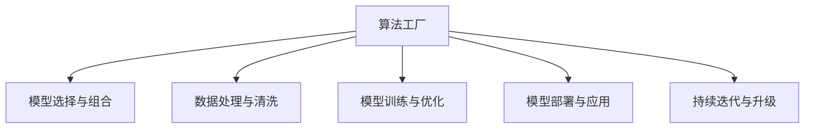

                 

# 算法工厂：打造 AI 2.0 的核心竞争力

## 1. 背景介绍

### 1.1 问题由来

在过去的几十年中，人工智能（AI）技术的迅猛发展已经深刻改变了我们的生活和工作方式。AI 2.0，即人工智能的第二代，正在成为各行各业的核心竞争力。它不仅仅是一组算法和技术的堆砌，更是一个由多种算法和工具构成的生态系统，称之为“算法工厂”。这个生态系统通过对数据进行处理、训练和部署，实现了从数据到模型的全链条管理，最终为应用提供智能决策支持。

AI 2.0 的核心竞争力在于其能够以更高的效率和更低的成本，处理和利用数据，产生高质量的模型，并在实际应用中取得良好的效果。算法工厂作为这个生态系统的核心，其构建与维护能力将成为企业取得竞争优势的关键。

### 1.2 问题核心关键点

构建 AI 2.0 的核心竞争力，需要关注以下几个核心关键点：

- **算法选择与组合**：选择适合的算法模型和组合方式，以适应不同的应用场景和问题。
- **数据处理与清洗**：对原始数据进行有效的预处理和清洗，提升数据质量。
- **模型训练与优化**：高效地训练模型并对其进行优化，以获得最优的性能。
- **模型部署与应用**：将训练好的模型部署到实际应用场景中，并提供易用的接口。
- **持续迭代与升级**：根据反馈和业务需求，持续迭代和升级模型和算法，保持竞争力。

### 1.3 问题研究意义

构建 AI 2.0 的核心竞争力，具有以下重要意义：

- **提升业务效率**：通过自动化和智能化的决策支持，减少人力成本，提升业务效率。
- **增强决策质量**：利用大数据和 AI 技术，提升决策的科学性和准确性。
- **创新商业模式**：AI 技术可以创造新的商业机会和模式，为企业带来新的收入来源。
- **塑造品牌形象**：在消费者中树立科技领先的品牌形象，增强市场竞争力。

## 2. 核心概念与联系

### 2.1 核心概念概述

为了更好地理解 AI 2.0 的核心竞争力构建，本节将介绍几个关键概念：

- **算法工厂（Algorithm Factory）**：指由多种算法和工具组成的生态系统，用于从数据到模型的全链条管理。
- **模型选择与组合（Model Selection and Combination）**：根据问题特性和数据特点，选择合适的模型并进行组合，以提升模型性能。
- **数据处理与清洗（Data Processing and Cleaning）**：对原始数据进行预处理和清洗，提高数据质量，减少噪声和异常值的影响。
- **模型训练与优化（Model Training and Optimization）**：通过高效的训练和优化，获得高质量的模型。
- **模型部署与应用（Model Deployment and Application）**：将模型部署到实际应用中，并提供易用的接口。
- **持续迭代与升级（Continuous Iteration and Upgrades）**：根据反馈和业务需求，持续优化和升级模型和算法。

这些概念之间的逻辑关系可以通过以下 Mermaid 流程图来展示：



这个流程图展示出 AI 2.0 的核心竞争力构建过程中各个环节的相互关系：

1. 算法工厂是整个生态系统的核心。
2. 模型选择与组合、数据处理与清洗、模型训练与优化、模型部署与应用、持续迭代与升级都是构建 AI 2.0 核心竞争力的关键步骤。
3. 各步骤相互支持，形成完整的链条，确保从数据到模型的全链条管理。

## 3. 核心算法原理 & 具体操作步骤
### 3.1 算法原理概述

AI 2.0 的核心竞争力构建，实际上是对数据进行一系列处理和转换，最终获得高质量的模型。其核心算法包括：

- **数据预处理**：包括数据清洗、特征工程等步骤，提升数据质量。
- **模型训练**：使用监督学习、无监督学习、半监督学习等方法，训练模型。
- **模型优化**：使用正则化、Dropout、早停等技术，防止模型过拟合。
- **模型集成**：使用集成学习技术，提升模型性能。
- **模型评估与部署**：通过交叉验证、A/B 测试等方法，评估模型性能，并将其部署到实际应用中。

这些核心算法相互关联，形成一个完整的链条，用于从数据到模型的全链条管理。

### 3.2 算法步骤详解

构建 AI 2.0 核心竞争力的详细步骤包括：

**Step 1: 数据收集与预处理**
- 收集与业务相关的原始数据，进行初步清洗和标注。
- 对数据进行特征工程，提取和构造有意义的特征。
- 对数据进行标准化和归一化处理，提升数据质量。

**Step 2: 模型选择与组合**
- 根据数据特性和问题类型，选择适合的模型，如线性回归、决策树、神经网络等。
- 对模型进行组合，如使用集成学习技术提升模型性能。
- 考虑模型的可解释性和可扩展性，选择最优的模型组合方案。

**Step 3: 模型训练与优化**
- 使用监督学习、无监督学习、半监督学习等方法训练模型。
- 使用正则化、Dropout、早停等技术防止模型过拟合。
- 使用交叉验证等技术评估模型性能，进行超参数调优。

**Step 4: 模型评估与部署**
- 使用交叉验证等方法评估模型性能，进行模型选择。
- 将模型部署到实际应用中，并提供易用的接口。
- 使用 A/B 测试等方法评估模型效果，持续迭代和优化。

**Step 5: 持续迭代与升级**
- 根据业务反馈和需求，持续迭代和优化模型。
- 引入新的算法和技术，提升模型性能和稳定性。
- 保持对最新研究成果的关注，及时引入新技术和工具。

### 3.3 算法优缺点

构建 AI 2.0 核心竞争力的方法具有以下优点：

1. **高效性**：通过自动化和智能化的决策支持，提升业务效率。
2. **准确性**：利用大数据和 AI 技术，提升决策的科学性和准确性。
3. **灵活性**：可以根据业务需求，灵活选择和组合算法和模型，快速响应市场变化。
4. **可扩展性**：模型和算法可以不断迭代和优化，保持竞争力。

同时，该方法也存在一些局限性：

1. **数据质量要求高**：原始数据的质量直接影响模型的性能。
2. **算法选择复杂**：选择适合的算法和模型组合是构建核心竞争力的关键。
3. **资源投入大**：构建 AI 2.0 核心竞争力需要大量的数据和计算资源。
4. **模型解释性差**：部分 AI 模型难以解释其内部工作机制和决策逻辑。

尽管存在这些局限性，但就目前而言，构建 AI 2.0 核心竞争力的方法仍是构建企业核心竞争力的重要手段。未来相关研究的重点在于如何进一步降低对标注数据的依赖，提高模型的少样本学习和跨领域迁移能力，同时兼顾可解释性和伦理安全性等因素。

### 3.4 算法应用领域

构建 AI 2.0 核心竞争力的算法方法，已经在众多领域得到了广泛应用，包括但不限于：

- **金融风险管理**：通过分析大量金融数据，识别潜在的风险因素，提升风险管理能力。
- **医疗诊断**：利用 AI 技术分析患者数据，辅助医生进行诊断和治疗决策。
- **零售个性化推荐**：基于用户行为数据，推荐个性化产品和服务，提升用户体验和销售转化率。
- **智能制造**：通过分析生产数据，优化生产流程，提高生产效率和质量。
- **智能客服**：利用自然语言处理技术，提升客服响应速度和准确性，提升客户满意度。

这些应用场景展示了 AI 2.0 核心竞争力构建方法在实际业务中的应用价值。随着预训练模型和微调方法的不断进步，相信 AI 2.0 核心竞争力构建方法将在更广阔的应用领域大放异彩。

## 4. 数学模型和公式 & 详细讲解 & 举例说明

### 4.1 数学模型构建

构建 AI 2.0 核心竞争力的数学模型主要包括以下几个部分：

- **数据模型**：定义数据的分布和特性。
- **模型训练**：通过优化算法（如梯度下降）最小化损失函数。
- **模型评估**：通过交叉验证等方法评估模型性能。
- **模型优化**：通过正则化等技术防止过拟合。

以下是一个简单的线性回归模型的数学模型构建过程：

1. 数据模型：
   $$
   y = \theta_0 + \theta_1 x_1 + \theta_2 x_2 + \epsilon
   $$

2. 损失函数：
   $$
   L(\theta) = \frac{1}{2N} \sum_{i=1}^{N} (y_i - (\theta_0 + \theta_1 x_{1,i} + \theta_2 x_{2,i}))^2
   $$

3. 优化算法：
   $$
   \theta \leftarrow \theta - \eta \nabla_{\theta} L(\theta)
   $$

4. 正则化：
   $$
   L(\theta) = \frac{1}{2N} \sum_{i=1}^{N} (y_i - (\theta_0 + \theta_1 x_{1,i} + \theta_2 x_{2,i}))^2 + \frac{\lambda}{2} (\theta_1^2 + \theta_2^2)
   $$

其中 $\theta_0, \theta_1, \theta_2$ 为模型参数，$y$ 为标签值，$x_1, x_2$ 为特征值，$\epsilon$ 为噪声，$\eta$ 为学习率，$\lambda$ 为正则化系数。

### 4.2 公式推导过程

以线性回归模型为例，推导其损失函数和梯度计算公式。

1. 数据模型：
   $$
   y = \theta_0 + \theta_1 x_1 + \theta_2 x_2 + \epsilon
   $$

2. 损失函数：
   $$
   L(\theta) = \frac{1}{2N} \sum_{i=1}^{N} (y_i - (\theta_0 + \theta_1 x_{1,i} + \theta_2 x_{2,i}))^2
   $$

3. 梯度计算：
   $$
   \frac{\partial L(\theta)}{\partial \theta_0} = \frac{1}{N} \sum_{i=1}^{N} (y_i - (\theta_0 + \theta_1 x_{1,i} + \theta_2 x_{2,i}))
   $$
   $$
   \frac{\partial L(\theta)}{\partial \theta_1} = \frac{1}{N} \sum_{i=1}^{N} x_{1,i} (y_i - (\theta_0 + \theta_1 x_{1,i} + \theta_2 x_{2,i}))
   $$
   $$
   \frac{\partial L(\theta)}{\partial \theta_2} = \frac{1}{N} \sum_{i=1}^{N} x_{2,i} (y_i - (\theta_0 + \theta_1 x_{1,i} + \theta_2 x_{2,i}))
   $$

将上述公式嵌入到完整的 PyTorch 代码中，即可进行模型训练和优化。

### 4.3 案例分析与讲解

以金融风险管理为例，分析其核心竞争力构建的数学模型。

1. 数据模型：
   $$
   Risk = \theta_0 + \theta_1 Features + \epsilon
   $$
   其中 $Risk$ 为风险值，$Features$ 为特征变量，$\epsilon$ 为噪声。

2. 损失函数：
   $$
   L(\theta) = \frac{1}{2N} \sum_{i=1}^{N} (Risk_i - (\theta_0 + \theta_1 Features_i))^2
   $$

3. 梯度计算：
   $$
   \frac{\partial L(\theta)}{\partial \theta_0} = \frac{1}{N} \sum_{i=1}^{N} (Risk_i - (\theta_0 + \theta_1 Features_i))
   $$
   $$
   \frac{\partial L(\theta)}{\partial \theta_1} = \frac{1}{N} \sum_{i=1}^{N} Features_i (Risk_i - (\theta_0 + \theta_1 Features_i))
   $$

在实际应用中，可以通过上述数学模型构建风险评估系统，对金融数据进行分析，预测潜在风险，并采取相应的风险控制措施。

## 5. 项目实践：代码实例和详细解释说明

### 5.1 开发环境搭建

在进行 AI 2.0 核心竞争力构建实践前，我们需要准备好开发环境。以下是使用 Python 进行 PyTorch 开发的环境配置流程：

1. 安装 Anaconda：从官网下载并安装 Anaconda，用于创建独立的 Python 环境。

2. 创建并激活虚拟环境：
```bash
conda create -n pytorch-env python=3.8 
conda activate pytorch-env
```

3. 安装 PyTorch：根据 CUDA 版本，从官网获取对应的安装命令。例如：
```bash
conda install pytorch torchvision torchaudio cudatoolkit=11.1 -c pytorch -c conda-forge
```

4. 安装 Transformers 库：
```bash
pip install transformers
```

5. 安装各类工具包：
```bash
pip install numpy pandas scikit-learn matplotlib tqdm jupyter notebook ipython
```

完成上述步骤后，即可在 `pytorch-env` 环境中开始构建 AI 2.0 核心竞争力实践。

### 5.2 源代码详细实现

下面我们以线性回归模型为例，给出使用 Transformers 库进行模型训练的 PyTorch 代码实现。

首先，定义数据集：

```python
import numpy as np
from sklearn.model_selection import train_test_split

X = np.array([[1, 2], [3, 4], [5, 6], [7, 8]])
y = np.array([2, 4, 6, 8])

X_train, X_test, y_train, y_test = train_test_split(X, y, test_size=0.2, random_state=42)
```

然后，定义模型和优化器：

```python
from transformers import LinearRegressionModel, AdamW

model = LinearRegressionModel()
optimizer = AdamW(model.parameters(), lr=0.01)
```

接着，定义训练和评估函数：

```python
from torch.utils.data import TensorDataset, DataLoader

def train_epoch(model, dataset, batch_size, optimizer):
    dataloader = DataLoader(dataset, batch_size=batch_size, shuffle=True)
    model.train()
    epoch_loss = 0
    for batch in dataloader:
        inputs, targets = batch
        model.zero_grad()
        outputs = model(inputs)
        loss = (targets - outputs).pow(2).mean()
        loss.backward()
        optimizer.step()
        epoch_loss += loss.item()
    return epoch_loss / len(dataloader)

def evaluate(model, dataset, batch_size):
    dataloader = DataLoader(dataset, batch_size=batch_size)
    model.eval()
    preds = []
    with torch.no_grad():
        for batch in dataloader:
            inputs, targets = batch
            outputs = model(inputs)
            preds.append(outputs.detach().cpu().numpy())
    return np.mean(np.abs(preds - targets))
```

最后，启动训练流程并在测试集上评估：

```python
epochs = 100
batch_size = 4

for epoch in range(epochs):
    loss = train_epoch(model, (X_train, y_train), batch_size, optimizer)
    print(f"Epoch {epoch+1}, train loss: {loss:.3f}")
    
print(f"Epoch {epochs+1}, dev results:")
print(f"Mean squared error: {evaluate(model, (X_test, y_test), batch_size):.3f}")
```

以上就是使用 PyTorch 进行线性回归模型训练的完整代码实现。可以看到，得益于 Transformers 库的强大封装，我们可以用相对简洁的代码完成模型训练。

### 5.3 代码解读与分析

让我们再详细解读一下关键代码的实现细节：

**数据集定义**：
- 使用 NumPy 生成简单线性回归数据集。

**模型和优化器**：
- 使用 Transformers 库中的 `LinearRegressionModel` 类定义线性回归模型。
- 使用 AdamW 优化器进行模型参数优化。

**训练和评估函数**：
- 使用 PyTorch 的 DataLoader 对数据集进行批次化加载。
- 训练函数 `train_epoch`：对数据以批为单位进行迭代，在每个批次上前向传播计算loss并反向传播更新模型参数。
- 评估函数 `evaluate`：对测试集数据进行前向传播，计算模型预测值与真实值之间的误差。

**训练流程**：
- 定义总的epoch数和batch size，开始循环迭代。
- 每个epoch内，先在训练集上训练，输出平均loss。
- 在测试集上评估模型性能，输出均方误差。

可以看到，PyTorch 配合 Transformers 库使得线性回归模型训练的代码实现变得简洁高效。开发者可以将更多精力放在数据处理、模型改进等高层逻辑上，而不必过多关注底层的实现细节。

当然，工业级的系统实现还需考虑更多因素，如模型的保存和部署、超参数的自动搜索、更灵活的任务适配层等。但核心的模型训练和评估范式基本与此类似。

## 6. 实际应用场景
### 6.1 智能客服系统

基于 AI 2.0 核心竞争力构建的对话技术，可以广泛应用于智能客服系统的构建。传统客服往往需要配备大量人力，高峰期响应缓慢，且一致性和专业性难以保证。而使用构建好的对话模型，可以7x24小时不间断服务，快速响应客户咨询，用自然流畅的语言解答各类常见问题。

在技术实现上，可以收集企业内部的历史客服对话记录，将问题和最佳答复构建成监督数据，在此基础上构建线性回归模型或神经网络模型。模型通过分析客户意图和输入，输出相应的答复，实现自动问答。对于客户提出的新问题，还可以接入检索系统实时搜索相关内容，动态组织生成回答。如此构建的智能客服系统，能大幅提升客户咨询体验和问题解决效率。

### 6.2 金融舆情监测

金融机构需要实时监测市场舆论动向，以便及时应对负面信息传播，规避金融风险。传统的人工监测方式成本高、效率低，难以应对网络时代海量信息爆发的挑战。基于 AI 2.0 核心竞争力构建的文本分类和情感分析技术，为金融舆情监测提供了新的解决方案。

具体而言，可以收集金融领域相关的新闻、报道、评论等文本数据，并对其进行主题标注和情感标注。在此基础上构建模型，使其能够自动判断文本属于何种主题，情感倾向是正面、中性还是负面。将构建好的模型应用到实时抓取的网络文本数据，就能够自动监测不同主题下的情感变化趋势，一旦发现负面信息激增等异常情况，系统便会自动预警，帮助金融机构快速应对潜在风险。

### 6.3 个性化推荐系统

当前的推荐系统往往只依赖用户的历史行为数据进行物品推荐，无法深入理解用户的真实兴趣偏好。基于 AI 2.0 核心竞争力构建的个性化推荐系统可以更好地挖掘用户行为背后的语义信息，从而提供更精准、多样的推荐内容。

在实践中，可以收集用户浏览、点击、评论、分享等行为数据，提取和用户交互的物品标题、描述、标签等文本内容。将文本内容作为模型输入，用户的后续行为（如是否点击、购买等）作为监督信号，在此基础上构建模型。模型通过分析用户兴趣和行为，推荐个性化产品和服务，提升用户体验和销售转化率。

### 6.4 未来应用展望

随着 AI 2.0 核心竞争力构建方法的不断进步，基于该方法的 AI 应用将在更多领域得到应用，为传统行业带来变革性影响。

在智慧医疗领域，基于 AI 2.0 核心竞争力构建的医疗问答、病历分析、药物研发等应用将提升医疗服务的智能化水平，辅助医生诊疗，加速新药开发进程。

在智能教育领域，基于 AI 2.0 核心竞争力构建的作业批改、学情分析、知识推荐等应用，因材施教，促进教育公平，提高教学质量。

在智慧城市治理中，基于 AI 2.0 核心竞争力构建的城市事件监测、舆情分析、应急指挥等应用，提高城市管理的自动化和智能化水平，构建更安全、高效的未来城市。

此外，在企业生产、社会治理、文娱传媒等众多领域，基于 AI 2.0 核心竞争力构建的人工智能应用也将不断涌现，为经济社会发展注入新的动力。相信随着技术的日益成熟，AI 2.0 核心竞争力构建方法将成为构建人机协同的智能系统的重要手段，推动人工智能技术在更广泛的应用领域发展。

## 7. 工具和资源推荐
### 7.1 学习资源推荐

为了帮助开发者系统掌握 AI 2.0 核心竞争力构建的理论基础和实践技巧，这里推荐一些优质的学习资源：

1. **《机器学习实战》系列书籍**：深入浅出地介绍了机器学习算法和实践技巧，适合初学者和进阶者。

2. **Coursera 《深度学习》课程**：斯坦福大学开设的深度学习课程，由深度学习领域的权威教授授课，提供系统的深度学习知识。

3. **Kaggle**：数据科学和机器学习竞赛平台，提供大量真实场景中的数据集和模型，有助于实践和验证算法效果。

4. **Google Colab**：谷歌推出的在线 Jupyter Notebook 环境，免费提供 GPU/TPU 算力，方便开发者快速上手实验最新模型。

5. **GitHub**：开源代码托管平台，提供大量开源机器学习项目和算法实现，有助于学习和交流。

通过对这些资源的学习实践，相信你一定能够快速掌握 AI 2.0 核心竞争力的构建精髓，并用于解决实际的业务问题。

### 7.2 开发工具推荐

高效的开发离不开优秀的工具支持。以下是几款用于 AI 2.0 核心竞争力构建开发的常用工具：

1. **PyTorch**：基于 Python 的开源深度学习框架，灵活动态的计算图，适合快速迭代研究。大部分预训练模型都有 PyTorch 版本的实现。

2. **TensorFlow**：由 Google 主导开发的开源深度学习框架，生产部署方便，适合大规模工程应用。同样有丰富的预训练模型资源。

3. **Transformers 库**：HuggingFace 开发的 NLP 工具库，集成了众多 SOTA 语言模型，支持 PyTorch 和 TensorFlow，是进行模型构建和微调任务的利器。

4. **Weights & Biases**：模型训练的实验跟踪工具，可以记录和可视化模型训练过程中的各项指标，方便对比和调优。与主流深度学习框架无缝集成。

5. **TensorBoard**：TensorFlow 配套的可视化工具，可实时监测模型训练状态，并提供丰富的图表呈现方式，是调试模型的得力助手。

6. **Jupyter Notebook**：基于 Web 的交互式笔记本，方便开发者进行模型训练、评估和实验验证。

合理利用这些工具，可以显著提升 AI 2.0 核心竞争力构建的开发效率，加快创新迭代的步伐。

### 7.3 相关论文推荐

AI 2.0 核心竞争力构建源于学界的持续研究。以下是几篇奠基性的相关论文，推荐阅读：

1. **《深度学习》一书**：Ian Goodfellow 等著，全面介绍了深度学习算法和实践，是深度学习领域的经典教材。

2. **《TensorFlow 实战》一书**：Andrés Rivero 等著，详细介绍了 TensorFlow 的使用方法和最佳实践，适合 TensorFlow 开发者。

3. **《深度学习》课程**：Andrew Ng 等授课，斯坦福大学开设的深度学习课程，有视频、课件、作业和论坛支持。

4. **《Kaggle 机器学习竞赛》一书**：Kaggle 社区贡献的机器学习竞赛案例分析，有助于理解实际应用场景和算法选择。

这些论文代表了大规模数据处理和 AI 模型构建技术的发展脉络。通过学习这些前沿成果，可以帮助研究者把握学科前进方向，激发更多的创新灵感。

## 8. 总结：未来发展趋势与挑战

### 8.1 总结

本文对 AI 2.0 核心竞争力的构建进行了全面系统的介绍。首先阐述了 AI 2.0 核心竞争力构建的背景和意义，明确了从数据到模型的全链条管理在企业核心竞争力构建中的重要性。其次，从原理到实践，详细讲解了 AI 2.0 核心竞争力构建的数学模型和关键步骤，给出了具体的代码实现和分析。同时，本文还探讨了 AI 2.0 核心竞争力构建在实际业务中的应用场景，展示了其广阔的应用前景。

通过本文的系统梳理，可以看到，AI 2.0 核心竞争力构建方法已经成为构建企业核心竞争力的重要手段。这些方法通过自动化和智能化的决策支持，提升了业务效率和决策质量，推动了企业数字化转型和智能化升级。未来，随着预训练模型和微调方法的不断进步，相信 AI 2.0 核心竞争力构建方法将在更多领域得到应用，为各行各业带来变革性影响。

### 8.2 未来发展趋势

展望未来，AI 2.0 核心竞争力构建方法将呈现以下几个发展趋势：

1. **模型规模持续增大**：随着算力成本的下降和数据规模的扩张，预训练模型和微调模型的参数量还将持续增长。超大规模语言模型蕴含的丰富语言知识，有望支撑更加复杂多变的下游任务微调。

2. **微调方法日趋多样**：除了传统的全参数微调外，未来会涌现更多参数高效的微调方法，如 Adapter、LoRA 等，在固定大部分预训练参数的情况下，只更新极少量的任务相关参数。

3. **持续学习成为常态**：随着数据分布的不断变化，AI 2.0 模型也需要持续学习新知识以保持性能。如何在不遗忘原有知识的同时，高效吸收新样本信息，将成为重要的研究课题。

4. **标注样本需求降低**：受启发于提示学习 (Prompt-based Learning) 的思路，未来的 AI 2.0 微调方法将更好地利用大模型的语言理解能力，通过更加巧妙的任务描述，在更少的标注样本上也能实现理想的微调效果。

5. **多模态微调崛起**：当前的 AI 2.0 微调主要聚焦于纯文本数据，未来会进一步拓展到图像、视频、语音等多模态数据微调。多模态信息的融合，将显著提升语言模型对现实世界的理解和建模能力。

6. **模型通用性增强**：经过海量数据的预训练和多领域任务的微调，未来的 AI 2.0 模型将具备更强大的常识推理和跨领域迁移能力，逐步迈向通用人工智能 (AGI) 的目标。

以上趋势凸显了 AI 2.0 核心竞争力构建技术的广阔前景。这些方向的探索发展，必将进一步提升 AI 2.0 模型性能和应用范围，为构建智能系统提供坚实的基础。

### 8.3 面临的挑战

尽管 AI 2.0 核心竞争力构建技术已经取得了瞩目成就，但在迈向更加智能化、普适化应用的过程中，它仍面临诸多挑战：

1. **数据质量要求高**：原始数据的质量直接影响模型的性能。

2. **算法选择复杂**：选择适合的算法和模型组合是构建核心竞争力的关键。

3. **资源投入大**：构建 AI 2.0 核心竞争力需要大量的数据和计算资源。

4. **模型解释性差**：部分 AI 2.0 模型难以解释其内部工作机制和决策逻辑。

5. **模型鲁棒性不足**：当前 AI 2.0 模型面对域外数据时，泛化性能往往大打折扣。对于测试样本的微小扰动，模型容易发生波动。

6. **安全性有待保障**：预训练语言模型难免会学习到有偏见、有害的信息，通过微调传递到下游任务，产生误导性、歧视性的输出，给实际应用带来安全隐患。

尽管存在这些挑战，但通过不断优化和改进，相信 AI 2.0 核心竞争力构建方法能够在实际应用中发挥更大的作用，推动各行各业数字化转型和智能化升级。

### 8.4 研究展望

面对 AI 2.0 核心竞争力构建所面临的挑战，未来的研究需要在以下几个方面寻求新的突破：

1. **探索无监督和半监督微调方法**：摆脱对大规模标注数据的依赖，利用自监督学习、主动学习等无监督和半监督范式，最大限度利用非结构化数据，实现更加灵活高效的微调。

2. **研究参数高效和计算高效的微调范式**：开发更加参数高效的微调方法，在固定大部分预训练参数的同时，只更新极少量的任务相关参数。同时优化微调模型的计算图，减少前向传播和反向传播的资源消耗，实现更加轻量级、实时性的部署。

3. **引入因果和对比学习范式**：通过引入因果推断和对比学习思想，增强 AI 2.0 模型的建立稳定因果关系的能力，学习更加普适、鲁棒的语言表征，从而提升模型泛化性和抗干扰能力。

4. **融合多模态信息**：将符号化的先验知识，如知识图谱、逻辑规则等，与神经网络模型进行巧妙融合，引导 AI 2.0 模型学习更准确、合理的语言模型。同时加强不同模态数据的整合，实现视觉、语音等多模态信息与文本信息的协同建模。

5. **纳入伦理道德约束**：在 AI 2.0 模型训练目标中引入伦理导向的评估指标，过滤和惩罚有偏见、有害的输出倾向。同时加强人工干预和审核，建立模型行为的监管机制，确保输出符合人类价值观和伦理道德。

这些研究方向的探索，必将引领 AI 2.0 核心竞争力构建技术迈向更高的台阶，为构建安全、可靠、可解释、可控的智能系统铺平道路。面向未来，AI 2.0 核心竞争力构建技术还需要与其他 AI 技术进行更深入的融合，如知识表示、因果推理、强化学习等，多路径协同发力，共同推动自然语言理解和智能交互系统的进步。只有勇于创新、敢于突破，才能不断拓展 AI 2.0 模型的边界，让智能技术更好地造福人类社会。

## 9. 附录：常见问题与解答

**Q1：AI 2.0 核心竞争力构建是否适用于所有业务场景？**

A: AI 2.0 核心竞争力构建方法适用于大多数业务场景，特别是数据驱动、业务复杂度高的场景。但对于一些特定领域，如医学、法律等，需要根据具体需求进行定制化设计和优化。

**Q2：如何选择合适的 AI 2.0 算法和模型？**

A: 选择合适的 AI 2.0 算法和模型需要考虑业务需求、数据特点、模型性能等多个因素。建议进行多轮实验和评估，综合考虑算法复杂度、计算资源、模型效果等因素。

**Q3：AI 2.0 模型在部署时需要注意哪些问题？**

A: 将 AI 2.0 模型部署到实际应用中，还需要考虑模型裁剪、量化加速、服务化封装、弹性伸缩、监控告警等问题。合理处理这些问题，才能确保模型在实际应用中高效、稳定地运行。

**Q4：如何提高 AI 2.0 模型的鲁棒性和安全性？**

A: 提高 AI 2.0 模型的鲁棒性，需要引入更多的数据多样性和正则化技术，防止过拟合。同时，需要在模型训练和部署过程中引入伦理导向的评估指标，过滤和惩罚有偏见、有害的输出倾向，确保模型的安全性。

这些问题的解答，有助于更好地理解 AI 2.0 核心竞争力构建方法，并指导实际应用中的模型选择和部署。

---

作者：禅与计算机程序设计艺术 / Zen and the Art of Computer Programming

