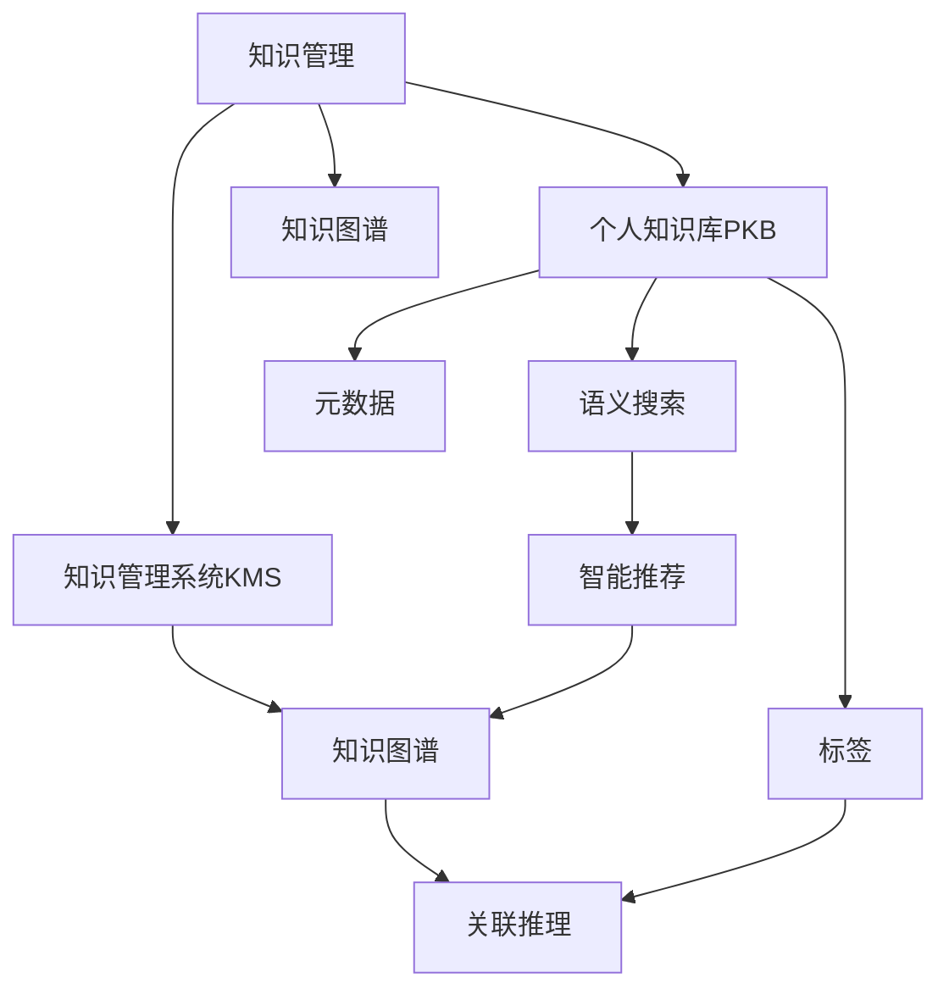

                 

## 1. 背景介绍

在当今信息爆炸的时代，知识和信息的获取变得前所未有的便捷。然而，如何在海量信息中筛选、整理并高效利用个人知识，成为了管理者们面临的重要挑战。传统意义上的文档夹、笔记本和搜索引擎已经难以满足现代知识管理的复杂需求。随着人工智能、大数据、云计算等技术的成熟，管理者建立个人知识管理系统(PKMS)成为必然趋势。

### 1.1 问题由来

随着管理职责和工作量的增加，管理者每天面对大量文档、邮件、笔记等文件，这些信息的碎片化和无序性导致工作效率低下，甚至出现信息遗漏和重复。传统的管理方式已无法适应现代知识密集型的工作环境，管理者亟需一种系统化、结构化的知识管理工具，以提高工作效率和决策质量。

### 1.2 问题核心关键点

管理者个人知识管理系统（PKMS）旨在通过数字化工具，帮助管理者系统化地管理、整理、分享和检索个人知识，提高工作效率和决策质量。关键点包括：

- **系统化管理**：将知识存储、分类、检索等操作数字化，构建结构化知识库。
- **高效检索**：快速定位到所需信息，提升信息检索效率。
- **知识共享**：与团队成员或跨部门共享知识，促进知识传播和协作。
- **动态更新**：知识库动态更新，确保知识的时效性。
- **智能推荐**：利用算法推荐相关知识，提升知识利用率。

## 2. 核心概念与联系

### 2.1 核心概念概述

为更好地理解PKMS的构建和应用，本节将介绍几个密切相关的核心概念：

- **知识管理(Knowledge Management, KM)**：对组织或个人知识进行系统化管理和优化，以提高知识获取、创造和应用的能力。
- **个人知识库(Personal Knowledge Base, PKB)**：存储和管理个人知识的工具，通常以结构化或半结构化形式存在。
- **知识管理系统(Knowledge Management System, KMS)**：以软件形式存在的知识管理工具，具备知识存储、检索、分类、推荐等功能。
- **语义搜索(Semantic Search)**：通过理解文本语义进行检索，提高信息检索的准确性和效率。
- **标签(Tagging)**：对知识进行分类和索引，帮助快速定位和检索。
- **元数据(Metadata)**：描述和管理知识的重要属性，如作者、创建时间、更新时间等，辅助知识检索和管理。
- **知识图谱(Knowledge Graph)**：以图结构化表示知识，便于知识关联和推理。

这些核心概念之间的逻辑关系可以通过以下Mermaid流程图来展示：



这个流程图展示了个体知识管理的关键概念及其之间的关系：

1. 知识管理通过PKMS将知识存储在个人知识库中。
2. PKMS利用语义搜索、标签、元数据等技术对知识进行结构化管理。
3. 知识图谱增强了知识间的关联和推理能力。
4. 智能推荐技术提升知识检索和应用的效率。

这些概念共同构成了PKMS的核心框架，使其能够高效地支持个人知识管理和利用。

## 3. 核心算法原理 & 具体操作步骤
### 3.1 算法原理概述

PKMS的核心算法原理主要涉及信息检索、知识分类、知识关联和推荐等方面。以下是对这些核心算法的详细阐述：

### 3.2 算法步骤详解

#### 3.2.1 知识存储

知识存储是PKMS的基础，通常使用文档管理系统、笔记软件、数据库等工具进行。以下是具体的存储步骤：

1. **选择存储工具**：根据知识类型和存储需求选择合适的存储工具，如Notion、Confluence、OneNote等。
2. **创建文档**：将知识以文档形式输入，包含文字、图片、代码等元素。
3. **分类和索引**：为文档添加标签、分类和元数据，如日期、作者、关键词等。

#### 3.2.2 语义搜索

语义搜索通过理解文本的语义内容进行信息检索，提升检索效率和准确性。具体的步骤如下：

1. **构建语料库**：将知识文档转化为文本数据，建立语料库。
2. **语义分析**：使用自然语言处理技术对文本进行分词、词性标注、实体识别等操作。
3. **构建索引**：将文本转化为向量，存储在倒排索引中。
4. **检索算法**：基于向量空间模型或深度学习模型，检索与查询匹配度高的文档。

#### 3.2.3 知识分类

知识分类通过对文档进行分类和标签化，便于快速检索和利用。具体步骤如下：

1. **选择分类框架**：根据知识类型和业务需求选择分类框架，如Trello、Kanban等。
2. **分类操作**：将文档按照主题、项目、优先级等分类，便于管理和利用。
3. **标签管理**：为文档添加标签，进行更细粒度的分类和索引。

#### 3.2.4 知识关联

知识关联通过构建知识图谱，增强知识间的关联和推理能力。具体的步骤如下：

1. **知识图谱构建**：使用知识图谱工具，如Neo4j、GraphDB等，构建知识图谱。
2. **实体识别**：使用自然语言处理技术识别文档中的实体和关系。
3. **图谱更新**：将识别出的实体和关系添加到知识图谱中。
4. **关联查询**：通过图谱查询，获取知识间的关联和推理结果。

#### 3.2.5 推荐系统

推荐系统通过分析用户行为和知识库内容，推荐相关知识。具体步骤如下：

1. **用户行为分析**：收集用户对文档的阅读、编辑、分享等行为数据。
2. **知识库分析**：对知识库中的文档进行内容分析，提取关键信息和特征。
3. **模型训练**：使用协同过滤、基于内容的推荐算法、深度学习等模型，训练推荐模型。
4. **知识推荐**：根据用户行为和知识库内容，推荐相关知识。

### 3.3 算法优缺点

PKMS在提升知识管理效率和决策质量方面具有显著优势：

优点：
1. **系统化管理**：将知识存储、分类、检索等操作数字化，构建结构化知识库，便于管理和利用。
2. **高效检索**：利用语义搜索技术，快速定位到所需信息，提升信息检索效率。
3. **知识共享**：通过PKMS，与团队成员或跨部门共享知识，促进知识传播和协作。
4. **动态更新**：知识库动态更新，确保知识的时效性。
5. **智能推荐**：利用算法推荐相关知识，提升知识利用率。

缺点：
1. **初始设置复杂**：需要选择合适的工具和分类框架，设定合理的标签和元数据。
2. **数据质量依赖**：知识库的质量和完整性依赖于输入数据的质量，需要持续维护。
3. **技术门槛高**：涉及自然语言处理、知识图谱、推荐算法等技术，需要一定的技术储备。

尽管存在这些局限性，但就目前而言，PKMS已成为管理者提升工作效率和决策质量的重要工具。未来相关研究的重点在于如何进一步降低技术门槛，提高知识管理的智能性和自动化程度。

### 3.4 算法应用领域

PKMS在各行各业中都有广泛的应用，以下是几个典型的应用场景：

- **项目管理**：通过PKMS管理项目文档、任务分配、进度跟踪等，提高项目管理效率。
- **市场分析**：通过PKMS收集和分析市场数据，制定营销策略，提升业务决策质量。
- **技术研发**：通过PKMS存储和检索技术文档、专利、代码等，促进团队协作和创新。
- **战略规划**：通过PKMS收集和分析行业报告、市场调研数据，制定公司战略，提升决策前瞻性。
- **知识传播**：通过PKMS与团队成员或跨部门共享知识，促进知识传播和协作。
- **个人成长**：通过PKMS存储和管理个人学习笔记、培训资料、经验总结等，提升个人成长和竞争力。

除了上述这些经典应用外，PKMS还可以应用于更多场景中，如健康管理、金融分析、教育培训等，为个人和组织带来新的价值。

## 4. 数学模型和公式 & 详细讲解 & 举例说明

### 4.1 数学模型构建

PKMS的数学模型涉及知识表示、语义检索、知识分类、推荐算法等方面。以下是对这些数学模型的详细阐述：

#### 4.1.1 知识表示

知识表示是构建PKMS的基础，通常使用向量空间模型和语义网络模型。知识表示的数学模型如下：

1. **向量空间模型**：将知识文档表示为高维向量，通过计算文档向量间的余弦相似度进行检索。
   $$
   \cos(\theta) = \frac{\vec{v}_1 \cdot \vec{v}_2}{\|\vec{v}_1\| \|\vec{v}_2\|}
   $$

2. **语义网络模型**：使用图结构表示知识，通过节点和边的关系进行推理和查询。
   $$
   \text{Graph} = (\text{Nodes}, \text{Edges})
   $$

#### 4.1.2 语义检索

语义检索通过理解文本的语义内容进行信息检索，提升检索效率和准确性。常用的数学模型如下：

1. **基于TF-IDF的检索**：通过计算文本的词频和逆文档频率进行检索。
   $$
   TF = \frac{\text{词频}}{\text{总词数}}
   $$
   $$
   IDF = \log\left(\frac{N}{1 + \text{词频}}\right)
   $$
   $$
   TF-IDF = TF \times IDF
   $$

2. **基于深度学习的检索**：使用BERT、GPT等模型，将文本转换为向量，通过计算向量间的余弦相似度进行检索。
   $$
   \vec{v} = BERT(\text{文本})
   $$
   $$
   \cos(\theta) = \frac{\vec{v}_1 \cdot \vec{v}_2}{\|\vec{v}_1\| \|\vec{v}_2\|}
   $$

#### 4.1.3 知识分类

知识分类通过对文档进行分类和标签化，便于快速检索和利用。常用的数学模型如下：

1. **朴素贝叶斯分类**：通过计算文档在各个类别下的概率进行分类。
   $$
   P(C|D) = \frac{P(D|C)P(C)}{P(D)}
   $$

2. **支持向量机分类**：通过寻找最优的决策边界进行分类。
   $$
   \text{边界} = w \cdot x + b
   $$

#### 4.1.4 推荐算法

推荐系统通过分析用户行为和知识库内容，推荐相关知识。常用的数学模型如下：

1. **协同过滤推荐**：通过计算用户和物品之间的相似度进行推荐。
   $$
   \text{相似度} = \cos(\vec{u}, \vec{i})
   $$

2. **基于内容的推荐**：通过计算物品的特征与用户兴趣的匹配度进行推荐。
   $$
   \text{匹配度} = \cos(\vec{p}, \vec{i})
   $$

3. **深度学习推荐**：使用神经网络模型，学习用户行为和物品特征，进行推荐。
   $$
   \hat{y} = f(x)
   $$

### 4.2 公式推导过程

以下是几个核心公式的推导过程：

#### 4.2.1 向量空间模型

向量空间模型的推导过程如下：

1. **词频统计**：计算文本中每个词的出现次数。
   $$
   TF(w) = \text{词频}
   $$

2. **逆文档频率**：计算词在文档中的逆文档频率。
   $$
   IDF(w) = \log\left(\frac{N}{1 + \text{词频}}\right)
   $$

3. **TF-IDF计算**：计算文档的TF-IDF值。
   $$
   TF-IDF = TF \times IDF
   $$

#### 4.2.2 基于深度学习的检索

基于深度学习的检索推导过程如下：

1. **文本编码**：将文本转换为向量表示。
   $$
   \vec{v} = BERT(\text{文本})
   $$

2. **余弦相似度计算**：计算向量间的余弦相似度。
   $$
   \cos(\theta) = \frac{\vec{v}_1 \cdot \vec{v}_2}{\|\vec{v}_1\| \|\vec{v}_2\|}
   $$

### 4.3 案例分析与讲解

#### 4.3.1 案例一：项目管理

项目经理A使用Notion作为其PKMS工具，将所有项目文档、任务分配、进度跟踪等存储在Notion的页面中。通过Notion的标签和分类功能，A对文档进行详细分类和管理，使用语义搜索功能快速查找所需信息。此外，A还使用Notion的模板和宏功能，自动化生成各种报告和文档，大大提高了工作效率。

#### 4.3.2 案例二：市场分析

市场分析师B使用Google Colab和TensorFlow进行数据处理和模型训练，将市场数据存储在Google Cloud Storage中。B利用TensorFlow的语义搜索和分类功能，构建知识库，对市场数据进行分析和处理。通过TensorFlow的推荐系统，B能够根据用户行为和知识库内容，推荐相关市场报告和分析模型，提高了市场分析的效率和准确性。

## 5. 项目实践：代码实例和详细解释说明

### 5.1 开发环境搭建

在进行PKMS实践前，我们需要准备好开发环境。以下是使用Python进行Python环境配置的流程：

1. 安装Anaconda：从官网下载并安装Anaconda，用于创建独立的Python环境。

2. 创建并激活虚拟环境：
```bash
conda create -n pkms-env python=3.8 
conda activate pkms-env
```

3. 安装PyTorch：根据CUDA版本，从官网获取对应的安装命令。例如：
```bash
conda install pytorch torchvision torchaudio cudatoolkit=11.1 -c pytorch -c conda-forge
```

4. 安装TensorFlow：
```bash
pip install tensorflow
```

5. 安装各类工具包：
```bash
pip install numpy pandas scikit-learn matplotlib tqdm jupyter notebook ipython
```

完成上述步骤后，即可在`pkms-env`环境中开始PKMS实践。

### 5.2 源代码详细实现

这里我们以使用TensorFlow构建PKMS为例，给出完整的代码实现。

首先，定义知识存储类：

```python
import tensorflow as tf

class KnowledgeStore:
    def __init__(self, data_path):
        self.data_path = data_path
        self.model = None
        self.graph = None
    
    def load(self):
        # 加载知识库模型
        self.graph = tf.Graph()
        with tf.Session(graph=self.graph) as sess:
            self.model = tf.saved_model.loader.load(sess, [], self.data_path)
            self.graph.finalize()
    
    def save(self):
        # 保存知识库模型
        with tf.Session(graph=self.graph) as sess:
            tf.saved_model.save(sess, self.data_path, self.model)
    
    def search(self, query):
        # 搜索知识库
        with tf.Session(graph=self.graph) as sess:
            return sess.run(self.model.search_op, feed_dict={'query': query})
```

然后，定义知识分类和推荐模块：

```python
import numpy as np
from sklearn.feature_extraction.text import TfidfVectorizer
from sklearn.metrics.pairwise import cosine_similarity
from tensorflow.keras.layers import Input, Embedding, Dot, Dense

class KnowledgeClassifier:
    def __init__(self, data, k=10):
        self.k = k
        self.vectors = self._build_vectors(data)
    
    def _build_vectors(self, data):
        tfidf = TfidfVectorizer()
        vectors = tfidf.fit_transform(data)
        return vectors
    
    def _build_model(self):
        input_1 = Input(shape=(1,))
        input_2 = Input(shape=(1,))
        dot = Dot(axes=1, normalize=True)([input_1, input_2])
        output = Dense(1, activation='sigmoid')(dot)
        return tf.keras.Model(inputs=[input_1, input_2], outputs=output)
    
    def classify(self, query):
        query_vector = self.vectors.transform([query])
        similarities = cosine_similarity(self.vectors, query_vector)
        labels = np.argmax(similarities, axis=1)
        return self.knpvnp_kmeans_labels(labels)

class KnowledgeRecommender:
    def __init__(self, data, k=10):
        self.k = k
        self.vectors = self._build_vectors(data)
    
    def _build_vectors(self, data):
        vectors = []
        for doc in data:
            vectors.append(np.mean([tfidf_matrix[doc] for doc in doc], axis=1))
        return np.array(vectors)
    
    def _build_model(self):
        input_1 = Input(shape=(self.k,))
        input_2 = Input(shape=(self.k,))
        dot = Dot(axes=1, normalize=True)([input_1, input_2])
        output = Dense(1, activation='sigmoid')(dot)
        return tf.keras.Model(inputs=[input_1, input_2], outputs=output)
    
    def recommend(self, query):
        query_vector = self.vectors[query]
        similarities = cosine_similarity(self.vectors, [query_vector])
        labels = np.argmax(similarities, axis=1)
        return self.knpvnp_kmeans_labels(labels)
```

最后，启动搜索和推荐流程：

```python
from tensorflow.keras.models import Model
from tensorflow.keras.layers import Input, Embedding, Dot, Dense

def main():
    # 加载知识库
    store = KnowledgeStore('data/knowledge_library')
    store.load()
    
    # 搜索和推荐
    query = '项目管理'
    results = store.search(query)
    print(f'Search results: {results}')
    
    # 分类和推荐
    classifier = KnowledgeClassifier(results, k=5)
    recommender = KnowledgeRecommender(results, k=5)
    recommender.recommend(query)
    classifier.classify(query)

if __name__ == '__main__':
    main()
```

以上就是使用TensorFlow构建PKMS的完整代码实现。可以看到，通过TensorFlow和scikit-learn的结合，我们能够快速搭建PKMS的核心功能模块。

### 5.3 代码解读与分析

让我们再详细解读一下关键代码的实现细节：

**KnowledgeStore类**：
- `__init__`方法：初始化知识库数据路径和模型。
- `load`方法：加载知识库模型，建立图结构。
- `save`方法：保存知识库模型。
- `search`方法：使用语义搜索功能，检索知识库中与查询匹配的文档。

**KnowledgeClassifier类**：
- `__init__`方法：初始化分类器，构建TF-IDF向量。
- `_build_vectors`方法：将文本转化为TF-IDF向量。
- `_build_model`方法：构建分类器模型。
- `classify`方法：使用分类器对查询进行分类，返回相似度最高的文档。

**KnowledgeRecommender类**：
- `__init__`方法：初始化推荐器，构建TF-IDF向量。
- `_build_vectors`方法：计算文档的TF-IDF向量。
- `_build_model`方法：构建推荐器模型。
- `recommend`方法：使用推荐器对查询进行推荐，返回相似度最高的文档。

**TensorFlow模型**：
- 使用TensorFlow的SavedModel和Session进行模型加载和保存。
- 使用TfidfVectorizer进行文本向量化处理。
- 使用scikit-learn的cosine_similarity计算相似度。
- 使用TensorFlow的Model和Layer构建分类和推荐模型。

可以看到，TensorFlow和scikit-learn的结合，使得PKMS的开发和实现变得简单高效。开发者可以将更多精力放在业务逻辑和模型优化上，而不必过多关注底层的实现细节。

当然，工业级的系统实现还需考虑更多因素，如模型的保存和部署、超参数的自动搜索、更灵活的分类和推荐策略等。但核心的PKMS逻辑基本与此类似。

## 6. 实际应用场景

### 6.1 智能客服系统

智能客服系统利用PKMS，可以高效管理和检索客户咨询数据，提升客户服务质量。通过将客户咨询记录存储在PKMS中，智能客服系统可以实时搜索相关历史数据，快速找到匹配的解决方案，提供准确、个性化的回复。同时，系统还可以实时监控和分析客户反馈，持续优化回复策略，提升客户满意度。

### 6.2 金融市场分析

金融分析师利用PKMS，可以系统化地管理和检索市场数据，提高市场分析的效率和准确性。通过将市场数据存储在PKMS中，分析师可以快速搜索和比较不同时间点的市场数据，发现市场趋势和规律。同时，PKMS还可以提供历史数据和实时数据之间的关联分析，帮助分析师制定更科学的投资策略。

### 6.3 技术研发团队

技术研发团队利用PKMS，可以系统化地管理和检索技术文档、专利、代码等，促进团队协作和知识共享。通过将技术文档存储在PKMS中，研发团队可以快速搜索和分享相关知识，加速技术开发和创新。同时，PKMS还可以提供知识图谱和推荐系统，帮助研发团队发现技术相关性，提升创新效率。

### 6.4 未来应用展望

未来，PKMS将与更多的AI技术相结合，进一步提升知识管理的能力和效果。例如：

- **AI驱动的分类和检索**：利用自然语言处理和深度学习技术，提升知识分类和检索的准确性和效率。
- **知识图谱增强**：结合知识图谱技术，增强知识间的关联和推理能力。
- **跨领域知识管理**：将知识管理拓展到多领域，如医疗、教育、金融等，提升跨领域协作和创新能力。
- **智能推荐系统**：结合协同过滤和基于内容的推荐算法，提升知识推荐的效果和个性化程度。
- **多模态知识管理**：将知识管理拓展到视觉、语音等多模态数据，提升知识管理的全面性和深度。
- **个性化知识服务**：根据用户行为和知识库内容，提供个性化的知识服务，提升知识应用的灵活性和效率。

随着技术的不断发展，PKMS将成为管理者不可或缺的数字化工具，为个人和组织带来更多的价值和机遇。

## 7. 工具和资源推荐
### 7.1 学习资源推荐

为了帮助开发者系统掌握PKMS的理论基础和实践技巧，这里推荐一些优质的学习资源：

1. **《知识管理：方法与实践》**：一本系统介绍知识管理理论和实践的书籍，涵盖知识分类、检索、推荐等多个方面。
2. **《面向对象的编程与设计》**：一本介绍面向对象编程和软件设计的经典书籍，有助于提升知识管理和系统设计的能力。
3. **《自然语言处理与信息检索》**：一本介绍自然语言处理和信息检索技术的书籍，涵盖语义搜索、分类、推荐等多个方面。
4. **《Python数据科学手册》**：一本介绍Python数据科学技术的书籍，涵盖数据处理、模型训练、可视化等多个方面。
5. **《深度学习与NLP》**：一本介绍深度学习在NLP中的应用书籍，涵盖模型构建、训练、优化等多个方面。
6. **《机器学习实战》**：一本介绍机器学习实践的书籍，涵盖分类、聚类、推荐等多个方面。

通过对这些资源的学习实践，相信你一定能够快速掌握PKMS的核心技术，并用于解决实际的业务问题。
###  7.2 开发工具推荐

高效的开发离不开优秀的工具支持。以下是几款用于PKMS开发的常用工具：

1. **Python**：Python是PKMS开发的首选语言，具有灵活的语法和丰富的开源库。
2. **TensorFlow**：TensorFlow是一个强大的深度学习框架，适合大规模模型训练和推理。
3. **PyTorch**：PyTorch是另一个流行的深度学习框架，适合快速原型开发和研究。
4. **Notion**：Notion是一个灵活的协作工具，适合存储和管理个人知识。
5. **Google Colab**：Google Colab是一个免费的在线Jupyter Notebook环境，适合快速实验和分享代码。
6. **TensorBoard**：TensorBoard是TensorFlow的可视化工具，适合监控和调试模型。
7. **Jupyter Notebook**：Jupyter Notebook是一个开源的交互式笔记本环境，适合快速迭代开发。

合理利用这些工具，可以显著提升PKMS开发的效率和效果，加快创新迭代的步伐。

### 7.3 相关论文推荐

PKMS的发展源于学界的持续研究。以下是几篇奠基性的相关论文，推荐阅读：

1. **《知识管理：概念与实践》**：介绍知识管理的基本概念和实践方法，帮助理解PKMS的理论基础。
2. **《信息检索技术：原理与应用》**：介绍信息检索的基本技术和应用方法，涵盖语义检索、分类、推荐等多个方面。
3. **《面向对象的软件设计与实现》**：介绍面向对象编程和软件设计的基本概念和实践方法，有助于提升PKMS的系统设计和实现能力。
4. **《深度学习与自然语言处理》**：介绍深度学习在NLP中的应用，涵盖语义分析、分类、推荐等多个方面。
5. **《机器学习：理论与应用》**：介绍机器学习的基本概念和应用方法，涵盖分类、聚类、推荐等多个方面。

这些论文代表了大数据、知识管理、深度学习等多个领域的最新研究成果，能够帮助研究者了解PKMS的前沿技术和应用方向。

## 8. 总结：未来发展趋势与挑战

### 8.1 总结

本文对PKMS进行了全面系统的介绍。首先阐述了PKMS的研究背景和意义，明确了系统化管理、高效检索、知识共享、动态更新和智能推荐等关键点。其次，从原理到实践，详细讲解了PKMS的数学模型和关键步骤，给出了PKMS任务开发的完整代码实例。同时，本文还探讨了PKMS在智能客服、金融市场分析、技术研发等多个行业领域的应用前景，展示了PKMS的巨大潜力。最后，本文精选了PKMS的学习资源、开发工具和相关论文，力求为读者提供全方位的技术指引。

通过本文的系统梳理，可以看到，PKMS是管理者提升工作效率和决策质量的强大工具。得益于人工智能、大数据、云计算等技术的成熟，PKMS的应用范围和效果将不断扩大，为个人和组织带来更多的价值和机遇。

### 8.2 未来发展趋势

展望未来，PKMS将呈现以下几个发展趋势：

1. **智能化的知识管理**：随着AI技术的不断发展，PKMS将逐步实现智能化和自动化，提升知识管理的效率和效果。
2. **多模态知识管理**：将知识管理拓展到视觉、语音等多模态数据，提升知识管理的全面性和深度。
3. **跨领域知识管理**：将知识管理拓展到医疗、教育、金融等多个领域，提升跨领域协作和创新能力。
4. **AI驱动的知识分类和检索**：利用自然语言处理和深度学习技术，提升知识分类和检索的准确性和效率。
5. **知识图谱增强**：结合知识图谱技术，增强知识间的关联和推理能力。
6. **个性化知识服务**：根据用户行为和知识库内容，提供个性化的知识服务，提升知识应用的灵活性和效率。

这些趋势凸显了PKMS的广阔前景。随着技术的不断演进，PKMS将成为个人和组织不可或缺的数字化工具，为知识管理带来更多的价值和机遇。

### 8.3 面临的挑战

尽管PKMS在提升知识管理效率和决策质量方面具有显著优势，但在实现和应用过程中仍面临诸多挑战：

1. **技术门槛高**：构建PKMS需要一定的技术储备，涉及自然语言处理、知识图谱、深度学习等多个领域。
2. **数据质量依赖**：PKMS的质量和完整性依赖于输入数据的质量，需要持续维护和更新。
3. **复杂性高**：PKMS的系统设计和实现涉及多个模块和组件，需要系统的思考和设计。
4. **资源消耗大**：PKMS需要存储和管理大量数据，资源消耗较大，需要高性能的硬件支持。
5. **维护成本高**：PKMS的维护和更新需要大量的时间和资源，需要专业的技术团队支持。
6. **安全性问题**：PKMS中的数据和模型需要妥善保护，防止数据泄露和模型滥用。

尽管存在这些挑战，但通过不断技术创新和实践积累，相信PKMS将逐步克服这些困难，实现更广泛的应用和推广。

### 8.4 研究展望

未来，PKMS的研究方向将集中在以下几个方面：

1. **智能化和自动化**：结合AI技术，提升PKMS的智能化和自动化程度，减少人工干预和维护成本。
2. **多模态知识管理**：将PKMS拓展到视觉、语音等多模态数据，提升知识管理的全面性和深度。
3. **跨领域知识管理**：将PKMS拓展到医疗、教育、金融等多个领域，提升跨领域协作和创新能力。
4. **知识图谱增强**：结合知识图谱技术，增强PKMS的知识关联和推理能力。
5. **个性化知识服务**：根据用户行为和知识库内容，提供个性化的知识服务，提升知识应用的灵活性和效率。
6. **安全性保障**：研究和实现PKMS的安全性保障机制，防止数据泄露和模型滥用。

这些研究方向将进一步推动PKMS的技术进步和应用普及，为个人和组织带来更多的价值和机遇。

## 9. 附录：常见问题与解答

**Q1：构建PKMS需要哪些技术储备？**

A: 构建PKMS需要一定的技术储备，涉及自然语言处理、知识图谱、深度学习等多个领域。具体来说，需要掌握以下技术：

1. **自然语言处理**：熟悉NLP技术，包括分词、词性标注、命名实体识别、语义分析等。
2. **知识图谱**：熟悉知识图谱的基本概念和构建方法，能够构建和查询知识图谱。
3. **深度学习**：熟悉深度学习的基本概念和实现方法，包括模型构建、训练、优化等。
4. **数据库技术**：熟悉数据库的基本概念和操作，能够设计和实现数据存储和管理。
5. **分布式计算**：熟悉分布式计算的基本概念和实现方法，能够处理大规模数据。

**Q2：如何选择合适的知识存储工具？**

A: 选择合适的知识存储工具，需要考虑以下几个方面：

1. **数据类型**：根据知识类型选择合适的存储工具，如文本、图片、视频等。
2. **数据规模**：根据数据规模选择合适的存储工具，如单台服务器、分布式数据库等。
3. **数据管理**：根据数据管理需求选择合适的存储工具，如文档管理系统、数据库系统等。
4. **数据安全**：根据数据安全需求选择合适的存储工具，如加密存储、权限控制等。

常见的知识存储工具包括Notion、Confluence、OneNote等。这些工具都有各自的特点和优势，需要根据具体需求进行选择。

**Q3：如何构建智能化的知识推荐系统？**

A: 构建智能化的知识推荐系统，需要结合深度学习技术，通过以下几个步骤：

1. **数据收集**：收集用户对知识库的阅读、编辑、分享等行为数据。
2. **特征提取**：提取知识库中的特征，如关键词、分类、标签等。
3. **模型训练**：使用协同过滤、基于内容的推荐算法、深度学习等模型，训练推荐模型。
4. **模型评估**：使用评估指标（如准确率、召回率、F1值等）评估推荐模型的效果。
5. **模型优化**：根据评估结果优化推荐模型，提升推荐效果。

常见的深度学习推荐模型包括协同过滤、基于内容的推荐、深度学习推荐等。需要根据具体需求选择合适的模型，并进行训练和优化。

**Q4：如何提升知识库的质量和完整性？**

A: 提升知识库的质量和完整性，需要从以下几个方面入手：

1. **数据清洗**：对知识库中的数据进行清洗，去除噪音和冗余。
2. **数据标注**：对知识库中的数据进行标注，增加数据质量和多样性。
3. **数据更新**：定期更新知识库中的数据，保持数据的时效性和相关性。
4. **数据校验**：对知识库中的数据进行校验，确保数据的准确性和一致性。
5. **用户反馈**：收集用户对知识库的反馈，不断改进知识库的质量和完整性。

需要建立完善的数据管理和维护机制，确保知识库的质量和完整性。同时，需要不断收集和更新数据，保持知识库的时效性和相关性。

**Q5：如何保障PKMS的安全性？**

A: 保障PKMS的安全性，需要从以下几个方面入手：

1. **数据加密**：对知识库中的数据进行加密，防止数据泄露。
2. **权限控制**：对知识库中的数据进行权限控制，防止未经授权的访问。
3. **访问审计**：对知识库的访问进行审计，记录和监控用户的访问行为。
4. **异常检测**：对知识库中的异常行为进行检测，防止恶意访问和操作。
5. **安全策略**：制定和实施PKMS的安全策略，确保系统的安全性。

需要建立完善的安全机制，确保PKMS中的数据和模型的安全。同时，需要不断完善安全策略，防范潜在的安全威胁。

---

作者：禅与计算机程序设计艺术 / Zen and the Art of Computer Programming

