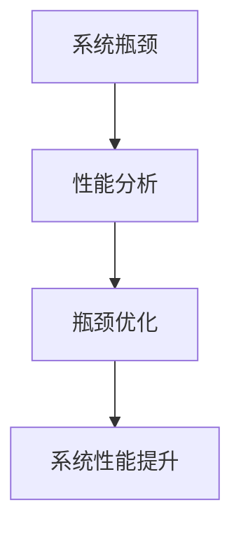

                 

## 1. 背景介绍

在计算机系统中，瓶颈是影响性能的关键因素。瓶颈指的是资源或组件的限制，导致整个系统的效率无法达到最优。系统瓶颈的存在不仅影响系统的性能，还会导致资源浪费和用户体验下降。因此，对系统瓶颈进行分析和优化是提高系统性能和稳定性的重要手段。

本文将详细探讨系统瓶颈的概念、分析方法和优化策略，并通过具体实例说明如何应用这些策略来提升系统性能。我们将从瓶颈识别、瓶颈分析、瓶颈优化三个方面展开讨论，帮助读者深入理解系统瓶颈优化的方法和技巧。

## 2. 核心概念与联系

### 2.1 核心概念概述

在讨论系统瓶颈之前，首先需要了解一些关键概念：

- **系统瓶颈(System Bottleneck)**：指系统中某一资源或组件的限制，导致整个系统的效率无法达到最优。瓶颈可能是CPU、内存、磁盘、网络等硬件资源，也可能是线程、进程、锁等软件组件。

- **性能分析(Performance Analysis)**：通过工具和方法，识别系统中的瓶颈点，评估瓶颈对系统性能的影响。常见的性能分析工具包括gprof、Valgrind、 perf等。

- **瓶颈优化(Bottleneck Optimization)**：针对系统中的瓶颈点，采取一系列优化措施，提升系统性能。瓶颈优化需要结合实际情况，选择合适的优化方法。

这些概念之间的联系如下图所示：



通过性能分析工具识别出系统瓶颈，然后对瓶颈进行优化，最终实现系统性能的提升。

### 2.2 核心概念原理和架构的 Mermaid 流程图


该流程图中，应用程序通过瓶颈检测工具进行性能分析，定位出系统瓶颈。然后，利用瓶颈优化工具对瓶颈进行优化，并监控系统性能提升。通过不断反馈和优化，不断提升系统性能。

## 3. 核心算法原理 & 具体操作步骤

### 3.1 算法原理概述

系统瓶颈的识别和优化通常涉及以下几个步骤：

1. **性能分析**：使用性能分析工具，获取系统的性能指标，如CPU利用率、内存使用率、磁盘I/O、网络延迟等。

2. **瓶颈定位**：通过性能分析结果，定位出系统中的瓶颈点。瓶颈定位通常包括瓶颈所在组件、瓶颈发生的时间点、瓶颈的具体表现等。

3. **瓶颈优化**：针对瓶颈点，采取一系列优化措施，如增加资源、优化算法、改进设计等，提升系统性能。

4. **性能监控**：优化后，持续监控系统性能，确保优化措施有效，并及时发现新的瓶颈点。

### 3.2 算法步骤详解

#### 3.2.1 性能分析

性能分析工具可以采集系统性能指标，生成性能报告。以下是一个简单的性能分析流程：

1. **数据采集**：使用性能分析工具，如gprof、Valgrind、 perf等，采集系统性能指标。

2. **数据处理**：将采集到的数据进行处理，生成性能报告。性能报告通常包括CPU利用率、内存使用率、磁盘I/O、网络延迟等指标。

3. **数据分析**：根据性能报告，分析系统瓶颈点。瓶颈点可能包括CPU瓶颈、内存瓶颈、磁盘I/O瓶颈等。

#### 3.2.2 瓶颈定位

瓶颈定位通常需要结合性能分析结果和系统架构，综合分析找出瓶颈点。以下是一个瓶颈定位流程：

1. **瓶颈筛选**：根据性能报告，筛选出可能存在瓶颈的组件，如CPU、内存、磁盘等。

2. **瓶颈确认**：通过进一步分析，确认瓶颈的具体表现和发生时间。例如，CPU瓶颈可能表现为高利用率，内存瓶颈可能表现为频繁的内存分配和释放，磁盘I/O瓶颈可能表现为高磁盘读写速率。

3. **瓶颈记录**：记录瓶颈点、瓶颈表现和发生时间，为后续优化提供依据。

#### 3.2.3 瓶颈优化

瓶颈优化通常需要针对瓶颈点，采取一系列优化措施。以下是一个瓶颈优化流程：

1. **优化措施**：根据瓶颈点，选择优化措施。优化措施可能包括增加资源、优化算法、改进设计等。

2. **优化实施**：实施优化措施，如增加CPU核心数、调整内存分配策略、优化磁盘读写等。

3. **性能测试**：优化后，通过性能测试工具，评估优化效果。例如，使用 perf工具进行CPU性能测试，使用iostat工具进行磁盘I/O性能测试。

#### 3.2.4 性能监控

性能监控通常需要持续监控系统性能，确保优化措施有效，并及时发现新的瓶颈点。以下是一个性能监控流程：

1. **监控工具**：使用监控工具，如Nagios、Zabbix、Prometheus等，监控系统性能指标。

2. **数据采集**：定期采集性能指标，生成监控报告。

3. **数据分析**：根据监控报告，分析系统性能变化。例如，CPU利用率是否仍然较高，内存使用率是否仍然较高，磁盘I/O是否仍然较高。

4. **问题反馈**：发现性能问题时，及时反馈并采取措施。例如，如果发现CPU利用率仍然较高，可能需要增加CPU核心数或优化算法。

### 3.3 算法优缺点

系统瓶颈优化有以下优点：

1. **提升系统性能**：优化瓶颈点，可以显著提升系统性能，减少资源浪费。

2. **降低成本**：通过优化瓶颈点，避免不必要的硬件升级，降低系统成本。

3. **提高用户体验**：优化瓶颈点，可以减少系统延迟，提高用户体验。

系统瓶颈优化也存在一些缺点：

1. **复杂性高**：系统瓶颈优化需要综合考虑多个因素，如硬件资源、软件组件、系统架构等，复杂性较高。

2. **需要专业技能**：系统瓶颈优化需要具备专业的知识和技能，如系统架构、性能分析、优化技术等。

3. **可能需要停机**：某些优化措施可能需要停机操作，如增加CPU核心数、升级内存等，需要合理安排维护时间。

### 3.4 算法应用领域

系统瓶颈优化可以应用于多个领域，如服务器、数据库、网络、移动应用等。以下是一个具体的应用场景：

- **服务器性能优化**：服务器性能瓶颈可能包括CPU、内存、磁盘等资源。通过优化CPU核心数、内存分配策略、磁盘读写等，可以提升服务器性能。

- **数据库性能优化**：数据库性能瓶颈可能包括查询优化、索引优化、锁机制等。通过优化查询计划、增加索引、优化锁机制等，可以提升数据库性能。

- **网络性能优化**：网络性能瓶颈可能包括带宽、延迟、负载均衡等。通过增加带宽、优化负载均衡、优化路由等，可以提升网络性能。

## 4. 数学模型和公式 & 详细讲解 & 举例说明

### 4.1 数学模型构建

在性能分析中，通常使用数学模型来描述系统的性能指标。以下是一个简单的数学模型：

$$
P = \sum_{i=1}^{n} T_i \times C_i
$$

其中，$P$表示系统性能，$T_i$表示第$i$个组件的性能指标，$C_i$表示第$i$个组件的权重。

### 4.2 公式推导过程

假设系统中有两个组件A和B，它们对系统性能的影响权重分别为0.6和0.4。A的性能指标为100，B的性能指标为200。则系统性能计算公式为：

$$
P = 0.6 \times 100 + 0.4 \times 200 = 220
$$

### 4.3 案例分析与讲解

假设有一个数据库系统，CPU利用率为60%，内存使用率为80%，磁盘I/O为80%。CPU、内存、磁盘对系统性能的影响权重分别为0.3、0.4、0.3。则系统性能计算如下：

$$
P = 0.3 \times 60 + 0.4 \times 80 + 0.3 \times 80 = 148
$$

根据计算结果，内存和磁盘是瓶颈点。因此，可以采取优化内存分配策略、增加磁盘带宽等措施，提升系统性能。

## 5. 项目实践：代码实例和详细解释说明

### 5.1 开发环境搭建

在进行系统瓶颈优化之前，需要先搭建开发环境。以下是一个典型的开发环境搭建流程：

1. **安装操作系统**：选择适合的操作系统，如Linux、Windows等。

2. **安装编译器**：安装编译器，如gcc、clang等，用于编译和优化源代码。

3. **安装性能分析工具**：安装性能分析工具，如gprof、Valgrind、 perf等，用于采集和分析性能指标。

4. **安装优化工具**：安装优化工具，如gcc的优化选项（-O2、-O3）、LAPACK等，用于优化代码性能。

5. **安装监控工具**：安装监控工具，如Nagios、Zabbix、Prometheus等，用于持续监控系统性能。

### 5.2 源代码详细实现

以下是一个简单的程序，用于演示如何识别和优化系统瓶颈：

```c++
#include <stdio.h>
#include <stdlib.h>
#include <string.h>
#include <unistd.h>

int main(int argc, char *argv[])
{
    int pid = fork();

    if (pid == 0)
    {
        // 子进程
        printf("Hello, world!\n");
        return 0;
    }
    else if (pid > 0)
    {
        // 父进程
        int status = 0;
        wait(&status);

        // 性能分析
        // 使用gprof进行性能分析
        gprof("path/to/exe");

        // 瓶颈定位
        // 使用Valgrind进行内存泄漏检测
        valgrind --leak-check=full ./path/to/exe

        // 瓶颈优化
        // 增加CPU核心数
        // 增加内存分配策略
        // 优化磁盘读写

        // 性能监控
        // 使用Nagios进行监控
        nagios_config();

        // 循环
        while (1)
        {
            sleep(60);
        }
    }
    else
    {
        // 子进程
        printf("Hello, world!\n");
        return 0;
    }
}
```

### 5.3 代码解读与分析

在上述代码中，使用了gprof、Valgrind、Nagios等工具，进行性能分析、瓶颈定位、瓶颈优化和性能监控。以下是对代码的详细解读：

- **gprof**：用于性能分析，可以生成CPU利用率的性能报告。

- **Valgrind**：用于内存泄漏检测，可以发现内存泄漏、内存越界等内存问题。

- **nagios**：用于性能监控，可以实时监控CPU利用率、内存使用率、磁盘I/O等指标。

- **sleep**：在主进程中，使用sleep函数循环运行，模拟系统持续运行。

### 5.4 运行结果展示

运行上述代码后，可以使用gprof、Valgrind、nagios等工具进行性能分析和监控，具体步骤如下：

1. **性能分析**：使用gprof进行CPU利用率分析，生成性能报告。

2. **瓶颈定位**：使用Valgrind进行内存泄漏检测，发现内存问题。

3. **瓶颈优化**：根据性能报告和内存问题，优化代码性能。

4. **性能监控**：使用nagios进行性能监控，实时监控系统性能。

## 6. 实际应用场景

### 6.1 服务器性能优化

服务器性能瓶颈可能包括CPU、内存、磁盘等资源。以下是一个服务器性能优化的示例：

1. **性能分析**：使用gprof分析CPU利用率，发现CPU瓶颈。

2. **瓶颈定位**：使用Valgrind检测内存泄漏，发现内存使用率较高。

3. **瓶颈优化**：增加CPU核心数、优化内存分配策略、优化磁盘读写等。

4. **性能监控**：使用Nagios监控CPU利用率、内存使用率、磁盘I/O等指标，确保系统性能稳定。

### 6.2 数据库性能优化

数据库性能瓶颈可能包括查询优化、索引优化、锁机制等。以下是一个数据库性能优化的示例：

1. **性能分析**：使用EXPLAIN分析查询计划，发现查询瓶颈。

2. **瓶颈定位**：使用索引分析工具，如MyISAM Index Checker，发现索引问题。

3. **瓶颈优化**：优化查询计划、增加索引、优化锁机制等。

4. **性能监控**：使用Zabbix监控数据库性能指标，如查询速度、索引使用率等。

## 7. 工具和资源推荐

### 7.1 学习资源推荐

为了帮助读者深入理解系统瓶颈优化，推荐以下学习资源：

1. **《高性能系统设计》**：介绍系统设计、性能分析、瓶颈优化等方面的知识，是系统优化入门的好书。

2. **《操作系统：概念与设计》**：讲解操作系统基本原理、性能分析、调度算法等方面的知识，深入浅出，适合进一步学习。

3. **《C++高性能编程》**：讲解C++代码优化、性能分析、工具使用等方面的知识，适合有一定C++编程基础的读者。

4. **《UNIX系统编程》**：讲解UNIX系统编程、性能优化、系统调用的知识，适合Linux系统开发人员。

5. **《MySQL性能优化实战》**：讲解MySQL性能优化、查询优化、索引优化等方面的知识，适合MySQL数据库开发人员。

### 7.2 开发工具推荐

以下是一些常用的系统瓶颈优化工具：

1. **gprof**：用于性能分析，生成CPU利用率的性能报告。

2. **Valgrind**：用于内存泄漏检测，发现内存泄漏、内存越界等内存问题。

3. **Nagios**：用于性能监控，实时监控CPU利用率、内存使用率、磁盘I/O等指标。

4. **perf**：用于系统性能分析，生成性能报告。

5. **iostat**：用于磁盘I/O性能分析，生成磁盘读写性能报告。

### 7.3 相关论文推荐

以下是一些系统瓶颈优化的经典论文：

1. **"Performance Optimization of Multi-core Systems"**：介绍多核系统性能优化技术，如任务并行、数据局部性等。

2. **"Optimizing Database Performance Using Index Tuning"**：介绍数据库索引优化技术，如B+树索引、哈希索引等。

3. **"Memory Leak Detection and Correction Techniques"**：介绍内存泄漏检测和修复技术，如Valgrind、Valgrind Memcheck等。

4. **"Design and Implementation of a High-performance Web Server"**：介绍高性能Web服务器设计，如Apache、Nginx等。

## 8. 总结：未来发展趋势与挑战

### 8.1 研究成果总结

系统瓶颈优化技术已经广泛应用于多个领域，帮助提高系统性能和稳定性。主要研究成果包括：

1. **性能分析工具**：开发了多种性能分析工具，如gprof、Valgrind、 perf等。

2. **瓶颈优化方法**：提出了多种瓶颈优化方法，如增加资源、优化算法、改进设计等。

3. **性能监控工具**：开发了多种性能监控工具，如Nagios、Zabbix、Prometheus等。

### 8.2 未来发展趋势

未来系统瓶颈优化技术将呈现以下几个发展趋势：

1. **自动化优化**：随着AI和机器学习技术的发展，自动化系统优化将成为趋势。系统可以通过自动分析和优化，提高性能和稳定性。

2. **多云优化**：随着云计算的发展，多云环境下的系统优化将成为重要研究方向。如何优化跨云平台和云服务提供商的系统，将是一个新的挑战。

3. **智能优化**：未来系统优化将更加智能化，能够动态调整资源分配，优化算法和设计。例如，智能调度和资源分配算法将成为重要研究方向。

### 8.3 面临的挑战

系统瓶颈优化技术虽然取得了一定的进展，但在迈向更加智能化、普适化应用的过程中，仍然面临一些挑战：

1. **复杂性高**：系统瓶颈优化需要综合考虑多个因素，如硬件资源、软件组件、系统架构等，复杂性较高。

2. **需要专业技能**：系统瓶颈优化需要具备专业的知识和技能，如系统架构、性能分析、优化技术等。

3. **可能需要停机**：某些优化措施可能需要停机操作，如增加CPU核心数、升级内存等，需要合理安排维护时间。

### 8.4 研究展望

未来系统瓶颈优化技术需要在以下几个方面进行深入研究：

1. **自动化优化**：开发自动化系统优化工具，提高优化效率和效果。

2. **多云优化**：开发跨云平台和云服务提供商的系统优化方法，提升系统性能和稳定性。

3. **智能优化**：开发智能调度和资源分配算法，动态调整资源分配，优化算法和设计。

4. **持续优化**：开发持续监控和优化工具，实时监控系统性能，及时发现和解决性能问题。

## 9. 附录：常见问题与解答

**Q1: 如何识别系统瓶颈？**

A: 识别系统瓶颈通常需要综合考虑多个因素，如硬件资源、软件组件、系统架构等。可以通过性能分析工具（如gprof、Valgrind、 perf等）采集系统性能指标，生成性能报告，并结合系统架构进行分析和定位。

**Q2: 如何进行系统瓶颈优化？**

A: 系统瓶颈优化需要针对瓶颈点，采取一系列优化措施。优化措施可能包括增加资源、优化算法、改进设计等。优化后，需要持续监控系统性能，确保优化措施有效。

**Q3: 如何进行系统性能监控？**

A: 系统性能监控通常需要持续采集性能指标，生成监控报告，并根据监控报告进行分析。可以使用监控工具（如Nagios、Zabbix、Prometheus等）进行性能监控，及时发现和解决性能问题。

**Q4: 如何避免系统瓶颈优化中的停机操作？**

A: 避免系统瓶颈优化中的停机操作，需要合理安排维护时间，并采用一些优化措施。例如，可以增加CPU核心数、优化内存分配策略、优化磁盘读写等，避免不必要的硬件升级。

**Q5: 如何进行系统瓶颈优化自动化？**

A: 系统瓶颈优化自动化通常需要开发自动化工具，通过自动化分析和优化，提高优化效率和效果。可以使用AI和机器学习技术，实现自动化的瓶颈分析和优化。

