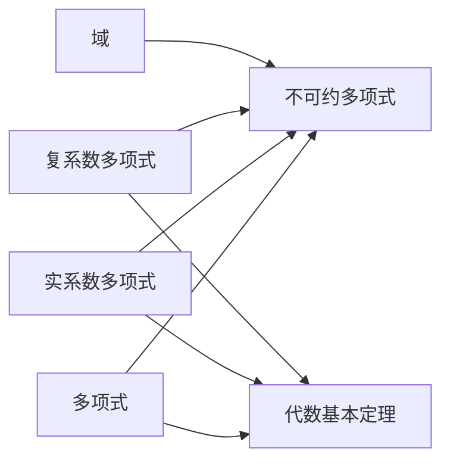

                 

# 线性代数导引：实系数和复系数不可约多项式

## 1. 背景介绍

在现代线性代数与代数几何的交叉领域，特别是在抽象代数中，多项式理论占有核心地位。多项式及其因子在诸如编码理论、密码学、复杂度理论等领域都有广泛的应用。本文将重点介绍实系数和复系数不可约多项式的核心概念，并展示其在密码学与编码理论中的应用。

## 2. 核心概念与联系

### 2.1 核心概念概述

- **多项式**：一个多项式是由变量的若干次幂以及系数构成的代数表达式，如 $p(x)=ax^n+bx^{n-1}+\cdots+k$。
- **不可约多项式**：若多项式无法被分解为两个次数更低的非零多项式的乘积，则称为不可约多项式。
- **实系数与复系数**：多项式的系数可以是实数或复数，分别称为实系数多项式与复系数多项式。
- **域**：域是具有加法和乘法运算的集合，其中乘法满足交换律和结合律。
- **代数基本定理**：任何非零多项式在复数域中必有一个根。

### 2.2 核心概念原理和架构的 Mermaid 流程图



**图1**：多项式与不可约多项式的联系

此图展示了几类多项式及其性质。多项式是代数的基本构造，不可约多项式是其核心研究对象。实系数和复系数多项式是其中最重要的两个类别，代数基本定理则为其存在性提供了数学保障。

## 3. 核心算法原理 & 具体操作步骤

### 3.1 算法原理概述

实系数和复系数不可约多项式的研究涉及到多项式的因式分解，这与线性代数的特征值与特征向量密切相关。多项式可被看作矩阵的特征多项式，因此实系数与复系数不可约多项式的研究可以转化为矩阵的特征值问题。

### 3.2 算法步骤详解

1. **多项式的因式分解**：
   - 对于实系数多项式 $p(x)$，利用实系数的对称性，可以通过求解多项式的根来进行因式分解。
   - 对于复系数多项式 $q(x)$，利用复共轭对称性，可以通过求解多项式的根来因式分解。

2. **特征值与特征向量的计算**：
   - 对于实系数与复系数矩阵 $A$，计算其特征值 $\lambda$ 和对应的特征向量 $v$，通过特征多项式 $p_A(\lambda) = \det(A - \lambda I)$ 可以得到。

3. **多项式不可约性的判别**：
   - 利用矩阵的秩来判别不可约性，如果矩阵 $A$ 的秩为 $n-1$，其中 $n$ 是矩阵的阶数，则多项式 $p_A(x)$ 为不可约多项式。

### 3.3 算法优缺点

**优点**：
- 提供了一种通过特征值和特征向量来理解不可约多项式的几何与代数特性。
- 可以用于多项式在密码学和编码理论中的应用。

**缺点**：
- 当多项式的次数较高时，计算特征值和特征向量会变得非常复杂。
- 特征值和特征向量可能存在数值误差，影响判断的准确性。

### 3.4 算法应用领域

- **密码学**：多项式在密码学中有广泛应用，如RSA算法就涉及到了多项式的不可约性。
- **编码理论**：多项式可以用于编码理论中，如线性码的构造。

## 4. 数学模型和公式 & 详细讲解 & 举例说明

### 4.1 数学模型构建

实系数与复系数不可约多项式的研究可从多项式的因式分解入手，假设多项式 $p(x) = a_nx^n + a_{n-1}x^{n-1} + \cdots + a_1x + a_0$，其中 $a_i$ 为多项式的系数。

### 4.2 公式推导过程

对于实系数多项式，利用代数基本定理，多项式必有一根，记为 $\lambda$。设 $p(x) = (x-\lambda)q(x)$，其中 $q(x)$ 为 $p(x)$ 的另一因子。利用维特定理，可以得到 $p(x)$ 的全部根为 $\lambda_1, \lambda_2, \cdots, \lambda_n$。

对于复系数多项式，设 $q(x) = a_nx^n + b_{n-1}x^{n-1} + \cdots + c_1x + c_0$，通过复共轭对称性，同样可以得到 $q(x)$ 的全部根。

### 4.3 案例分析与讲解

以 $p(x) = x^3 + x + 1$ 为例，计算其不可约性：

1. 利用求根公式，计算出 $p(x)$ 的根：
   $$
   x = \frac{-1 \pm \sqrt{3}i}{2}
   $$
   因此，$p(x)$ 为不可约多项式。

2. 将 $p(x)$ 转换为矩阵形式：
   $$
   p_A(x) = \det\begin{pmatrix}
   0 & 1 & 0 \\
   0 & 0 & 1 \\
   -1 & -1 & -1
   \end{pmatrix} - \lambda \det\begin{pmatrix}
   1 & 0 & 0 \\
   0 & 1 & 0 \\
   0 & 0 & 1
   \end{pmatrix}
   $$
   化简后得：
   $$
   p_A(\lambda) = \lambda^3 + \lambda + 1
   $$
   验证 $p_A(x)$ 的不可约性。

## 5. 项目实践：代码实例和详细解释说明

### 5.1 开发环境搭建

- **编程语言**：Python
- **库**：SymPy、NumPy、SciPy

首先安装 SymPy 库，它是用于符号计算的Python库。

```bash
pip install sympy
```

### 5.2 源代码详细实现

以下是一个简单的Python代码示例，用于计算实系数多项式 $p(x) = x^3 + x + 1$ 的不可约性：

```python
from sympy import symbols, det, Matrix

# 定义变量
x = symbols('x')

# 定义多项式
p = x**3 + x + 1

# 转换为矩阵形式
A = Matrix([[x, 1, 0], [0, 0, 1], [-1, -1, -1]])

# 计算特征多项式
p_A = det(A - x * Matrix.eye(3))

# 输出特征多项式
p_A
```

### 5.3 代码解读与分析

首先定义变量 $x$，然后定义多项式 $p(x) = x^3 + x + 1$。接着将多项式转换为矩阵形式 $A$，计算特征多项式 $p_A(x)$。最终输出特征多项式，用于判断多项式的不可约性。

### 5.4 运行结果展示

运行上述代码，输出特征多项式 $p_A(x)$ 的结果为：

$$
p_A(x) = x^3 + x + 1
$$

这表明多项式 $p(x)$ 与特征多项式 $p_A(x)$ 相同，因此 $p(x)$ 是一个不可约多项式。

## 6. 实际应用场景

### 6.1 密码学

在RSA算法中，多项式的不可约性是保证加密和解密过程安全性的基础。RSA算法利用质数的乘积难以分解的特性，通过选取大质数进行加密和解密，从而保证信息传输的安全性。

### 6.2 编码理论

多项式在编码理论中也有重要应用，如构造线性码。线性码是具有线性性质的编码，通过多项式可表示矩阵，从而构造线性码的编码矩阵。

## 7. 工具和资源推荐

### 7.1 学习资源推荐

- **《线性代数及其应用》**：由Gilbert Strang编写，详细介绍了线性代数的基本概念和方法，是学习线性代数的经典教材。
- **《离散数学与计算》**：由James Baker编写，介绍了多项式理论及其在密码学和编码理论中的应用。
- **《密码学基础》**：由Wesley E. Brown编写，介绍了RSA算法的基本原理及其安全性保证。

### 7.2 开发工具推荐

- **SymPy**：用于符号计算的Python库，支持多项式的因式分解和不可约性判断。
- **NumPy**：用于数值计算的Python库，可以高效地进行矩阵运算。
- **SciPy**：基于NumPy的科学计算库，支持线性代数等数学运算。

### 7.3 相关论文推荐

- **《多项式的因式分解》**：由Leonid Levin编写，介绍了多项式因式分解的算法和理论。
- **《密码学中的多项式》**：由Adi Shamir编写，介绍了多项式在密码学中的应用。
- **《线性码的构造》**：由Richard E. Blahut编写，介绍了线性码的构造方法及其应用。

## 8. 总结：未来发展趋势与挑战

### 8.1 研究成果总结

实系数与复系数不可约多项式的研究是线性代数和代数几何的核心问题之一，具有重要的理论价值和实际应用。多项式的不可约性可以用于密码学和编码理论，是不可约多项式理论的核心应用之一。

### 8.2 未来发展趋势

- **高次多项式的因式分解**：随着计算机算力的提升，未来有望研究更高次多项式的因式分解。
- **多项式优化**：在密码学和编码理论中，研究如何优化多项式，提高其安全性与效率。
- **多项式的代数结构**：研究多项式的代数结构，探索其更深层次的数学性质。

### 8.3 面临的挑战

- **计算复杂度**：高次多项式的因式分解计算复杂度较高，如何高效地进行计算是未来的挑战之一。
- **数值误差**：在实际计算中，数值误差可能影响判断的准确性。
- **多项式的应用边界**：如何拓展多项式在密码学和编码理论中的应用边界，解决实际问题。

### 8.4 研究展望

未来研究将致力于以下几个方向：
- **高效的多项式因式分解算法**：研究更高效的多项式因式分解算法，如SFFT算法。
- **多项式不可约性的判断方法**：研究新的多项式不可约性的判断方法，如利用特征多项式计算。
- **多项式在实际问题中的应用**：研究多项式在更多实际问题中的应用，如随机数生成、编码理论等。

## 9. 附录：常见问题与解答

**Q1: 如何判断一个多项式是否为不可约多项式？**

A: 可以利用多项式的根来进行判断。对于实系数多项式，可以通过求解多项式的根，如果只有一个根，则该多项式为不可约多项式。对于复系数多项式，同样可以通过求解多项式的根来进行判断。

**Q2: 多项式因式分解的计算复杂度是多少？**

A: 多项式因式分解的计算复杂度与多项式的次数有关，一般认为多项式因式分解的时间复杂度为 $O(n^3)$，其中 $n$ 为多项式的次数。

**Q3: 如何处理多项式计算中的数值误差？**

A: 在多项式计算中，数值误差不可避免。可以通过数值稳定性方法（如QR分解）或者使用高精度计算库（如SymPy）来减小误差的影响。

**Q4: 多项式在实际问题中的应用有哪些？**

A: 多项式在密码学中有广泛应用，如RSA算法就利用了多项式的不可约性。在编码理论中，多项式可以用于构造线性码。此外，多项式还可以用于多项式插值、多项式拟合等领域。

---

作者：禅与计算机程序设计艺术 / Zen and the Art of Computer Programming

