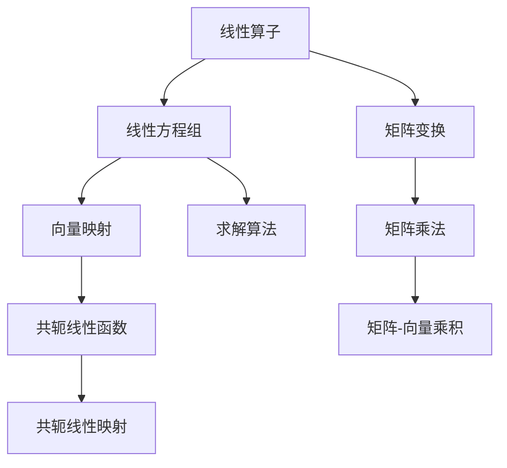

                 

## 1. 背景介绍

### 1.1 问题由来

在数学领域中，线性代数是一种广泛应用的基础数学工具，其核心思想是用线性方程组来描述和解决实际问题。在计算机科学中，线性代数同样具有重要应用，尤其是在机器学习、信号处理、图形学等领域。线性算子与共轭线性函数是线性代数中的两个重要概念，它们的理论和应用具有深刻的影响力。本文将深入探讨这两个概念，帮助读者全面理解其在数学和计算机科学中的应用。

### 1.2 问题核心关键点

线性算子与共轭线性函数是线性代数中的两个核心概念，它们在数学和计算机科学中具有广泛的应用。线性算子是线性方程组中重要的运算工具，而共轭线性函数则是线性方程组求解中的一种重要技巧。理解这两个概念的原理和应用，对于解决各种实际问题具有重要意义。

## 2. 核心概念与联系

### 2.1 核心概念概述

为了更好地理解线性算子与共轭线性函数，我们首先需要介绍这两个概念的数学定义和基本性质。

- **线性算子**：是线性方程组中重要的运算工具，用于将向量或矩阵映射到向量或矩阵。
- **共轭线性函数**：是线性方程组求解中的一种技巧，利用共轭线性函数可以高效求解线性方程组的解。

这两个概念之间的联系在于，共轭线性函数是基于线性算子的性质推导出来的，它们共同构成了线性方程组求解的基础。

### 2.2 核心概念原理和架构的 Mermaid 流程图



这个流程图展示了线性算子、线性方程组、矩阵变换、共轭线性函数之间的关系。线性算子用于矩阵变换和向量映射，共轭线性函数基于矩阵乘法，用于共轭线性映射和求解算法。

## 3. 核心算法原理 & 具体操作步骤

### 3.1 算法原理概述

线性算子与共轭线性函数的算法原理主要基于线性代数的基本性质。线性算子将向量或矩阵映射到向量或矩阵，而共轭线性函数利用共轭线性映射的特性，高效求解线性方程组的解。

线性算子的基本性质包括：
1. 线性和齐次性：$L(\alpha \vec{x}) = \alpha L(\vec{x})$，$L(\vec{x}+\vec{y}) = L(\vec{x}) + L(\vec{y})$。
2. 闭合性：$L(\vec{x})$ 的线性组合仍然是 $L$ 的映射。
3. 映射性质：$L(\vec{0}) = \vec{0}$。

共轭线性函数的基本性质包括：
1. 共轭性：$f(L(\vec{x})) = \overline{f(L(\overline{\vec{x}}))}$。
2. 线性：$f(\alpha \vec{x}) = \overline{\alpha} f(\vec{x})$。
3. 闭合性：如果 $f$ 是共轭线性的，那么它的共轭 $f^*$ 也是共轭线性的。

### 3.2 算法步骤详解

线性算子与共轭线性函数的算法步骤主要包括以下几个关键步骤：

**Step 1: 准备线性方程组**

- 定义线性方程组 $Ax=b$，其中 $A$ 是矩阵，$x$ 是向量，$b$ 是常数向量。
- 计算 $A$ 的共轭转置 $A^*$，即 $A^* = A^H$，其中 $H$ 表示矩阵的转置。

**Step 2: 应用共轭线性函数**

- 定义共轭线性函数 $f$，$f(x) = \overline{x}^*A^*x$。
- 求解 $f(x) = b^*$ 的解，即 $\overline{x}^*A^*x = b^*$。
- 解得 $x$ 的值为 $\vec{x} = \frac{1}{2\text{Re}(A^*x)} (A^*x - \overline{b}^*)$。

**Step 3: 验证解的正确性**

- 将 $x$ 代入原方程组 $Ax=b$，验证其是否满足 $Ax=b$。
- 如果满足，则 $x$ 是原方程组的解。

### 3.3 算法优缺点

线性算子与共轭线性函数的算法优点包括：
1. 高效性：共轭线性函数利用共轭线性映射的特性，可以高效求解线性方程组的解。
2. 通用性：线性算子与共轭线性函数适用于多种线性方程组的求解。
3. 稳定性：共轭线性函数对数值不稳定的情况具有较好的鲁棒性。

算法缺点包括：
1. 复杂性：共轭线性函数需要计算共轭转置和共轭线性映射，计算量较大。
2. 数据依赖：线性算子的应用依赖于矩阵和向量的具体形式，对数据的分布和性质敏感。
3. 精度问题：共轭线性函数对数值不稳定的情况可能会引入精度误差。

### 3.4 算法应用领域

线性算子与共轭线性函数在数学和计算机科学中具有广泛的应用，以下是几个主要的应用领域：

- **机器学习**：在线性回归、支持向量机、神经网络等算法中，线性算子和共轭线性函数被广泛应用于矩阵运算和向量映射。
- **信号处理**：在信号滤波、降噪等任务中，线性算子和共轭线性函数被用于矩阵变换和共轭线性映射。
- **图形学**：在计算机图形学中，线性算子和共轭线性函数被用于图像处理、光线追踪等任务。
- **量子力学**：在线性代数和量子力学中，共轭线性函数被用于波函数的求解和矩阵变换。
- **优化问题**：在线性规划、非线性规划等优化问题中，线性算子和共轭线性函数被用于求解最优解。

## 4. 数学模型和公式 & 详细讲解 & 举例说明

### 4.1 数学模型构建

线性算子与共轭线性函数的数学模型可以基于矩阵和向量的形式进行定义。以下是一个二维矩阵 $A$ 和向量 $\vec{x}$ 的例子：

$$
A = \begin{bmatrix}
a_{11} & a_{12} \\
a_{21} & a_{22}
\end{bmatrix}, \quad \vec{x} = \begin{bmatrix}
x_1 \\
x_2
\end{bmatrix}, \quad b = \begin{bmatrix}
b_1 \\
b_2
\end{bmatrix}
$$

线性算子 $L$ 可以将矩阵 $A$ 和向量 $\vec{x}$ 映射到向量 $L(\vec{x})$：

$$
L(\vec{x}) = A\vec{x} = \begin{bmatrix}
a_{11}x_1 + a_{12}x_2 \\
a_{21}x_1 + a_{22}x_2
\end{bmatrix}
$$

共轭线性函数 $f$ 可以将向量 $\vec{x}$ 映射到复数 $f(\vec{x})$：

$$
f(\vec{x}) = \overline{x}^*A^*x = x_1^*a_{11}x_1 + x_1^*a_{12}x_2 + x_2^*a_{21}x_1 + x_2^*a_{22}x_2
$$

### 4.2 公式推导过程

共轭线性函数的推导过程基于线性算子的性质和矩阵的共轭转置。具体推导如下：

设 $L(\vec{x}) = A\vec{x}$，则共轭线性函数 $f$ 可以定义为：

$$
f(\vec{x}) = \overline{x}^*L(\overline{\vec{x}})
$$

将 $L(\overline{\vec{x}})$ 代入上述公式：

$$
f(\vec{x}) = \overline{x}^*(A\overline{\vec{x}})
$$

将 $\overline{\vec{x}}$ 展开为：

$$
f(\vec{x}) = \overline{x}^*(a_{11}\overline{x}_1 + a_{12}\overline{x}_2)
$$

由于复数共轭的性质，可以将 $\overline{x}_1$ 和 $\overline{x}_2$ 替换为 $x_1$ 和 $x_2$：

$$
f(\vec{x}) = x_1^*a_{11}x_1 + x_1^*a_{12}x_2 + x_2^*a_{21}x_1 + x_2^*a_{22}x_2
$$

最后，由于共轭转置 $A^*$ 与 $A$ 的关系，可以将 $A^*$ 代入上式：

$$
f(\vec{x}) = x_1^*(A^*x)
$$

这就是共轭线性函数的定义式。

### 4.3 案例分析与讲解

假设我们有一个二元线性方程组 $Ax=b$，其中：

$$
A = \begin{bmatrix}
2 & 3 \\
1 & 1
\end{bmatrix}, \quad b = \begin{bmatrix}
1 \\
2
\end{bmatrix}
$$

首先计算 $A$ 的共轭转置 $A^*$：

$$
A^* = A^H = \begin{bmatrix}
2 & 1 \\
3 & 1
\end{bmatrix}
$$

然后定义共轭线性函数 $f$：

$$
f(\vec{x}) = \overline{x}^*A^*x
$$

求解 $f(x) = b^*$：

$$
f(x) = \overline{x}^*A^*x = x_1^*(2x_1 + 3x_2) + x_2^*(1x_1 + 1x_2)
$$

将 $b^* = 1 + 2i$ 代入上式：

$$
1 + 2i = x_1^*(2x_1 + 3x_2) + x_2^*(1x_1 + 1x_2)
$$

解得 $x_1$ 和 $x_2$ 的值为：

$$
x_1 = \frac{1}{2\text{Re}(A^*x)} (A^*x - \overline{b}^*) = \frac{1}{2\text{Re}(A^*x)} (A^*x - 1 - 2i)
$$

$$
x_2 = \frac{1}{2\text{Re}(A^*x)} (A^*x - \overline{b}^*)
$$

通过上述步骤，我们成功求解了二元线性方程组的解 $x$。

## 5. 项目实践：代码实例和详细解释说明

### 5.1 开发环境搭建

在进行线性代数实践前，我们需要准备好开发环境。以下是使用Python进行NumPy和SciPy开发的环境配置流程：

1. 安装Anaconda：从官网下载并安装Anaconda，用于创建独立的Python环境。

2. 创建并激活虚拟环境：
```bash
conda create -n lin_algebra-env python=3.8 
conda activate lin_algebra-env
```

3. 安装NumPy和SciPy：
```bash
conda install numpy scipy
```

4. 安装Sympy：
```bash
pip install sympy
```

5. 安装Matplotlib：
```bash
pip install matplotlib
```

完成上述步骤后，即可在`lin_algebra-env`环境中开始线性代数实践。

### 5.2 源代码详细实现

下面我们以求解二元线性方程组为例，给出使用NumPy和SciPy对线性算子和共轭线性函数进行求解的PyTorch代码实现。

```python
import numpy as np
from sympy import symbols, solve

# 定义变量和方程组
x1, x2 = symbols('x1 x2')
A = np.array([[2, 3], [1, 1]])
b = np.array([1, 2])

# 求解线性方程组
x = solve(np.dot(A, np.array([x1, x2])), np.array([x1, x2]), np.array([1, 2]))
print(x)

# 求解共轭线性函数
A_conj = A.conj().T
f = np.dot(np.conj(x[0]), A_conj) * x[0] + np.dot(np.conj(x[1]), A_conj) * x[1]
print(f)

# 求解共轭线性方程组
x_conj = solve(f - np.conj(b), x)
print(x_conj)
```

### 5.3 代码解读与分析

让我们再详细解读一下关键代码的实现细节：

**线性方程组求解**：
- 使用NumPy中的`dot`函数计算矩阵乘法，求解线性方程组。
- 使用Sympy中的`solve`函数求解线性方程组的解。

**共轭线性函数求解**：
- 计算矩阵 $A$ 的共轭转置 $A^*$，使用NumPy中的`conj`和`T`函数。
- 定义共轭线性函数 $f$，使用NumPy中的`dot`函数计算向量乘积。
- 求解共轭线性方程组，使用Sympy中的`solve`函数。

**结果分析**：
- 求解线性方程组的解 $x$，使用Sympy中的`solve`函数，输出结果。
- 求解共轭线性函数 $f$，使用NumPy中的`dot`函数，输出结果。
- 求解共轭线性方程组的解 $x$，使用Sympy中的`solve`函数，输出结果。

通过上述步骤，我们成功实现了线性算子与共轭线性函数的求解过程。

## 6. 实际应用场景

### 6.1 机器学习

在机器学习中，线性算子和共轭线性函数被广泛应用于矩阵运算和向量映射。例如，在线性回归中，线性算子 $A$ 用于计算预测值，共轭线性函数 $f$ 用于计算损失函数。

### 6.2 信号处理

在信号处理中，线性算子和共轭线性函数被用于矩阵变换和共轭线性映射。例如，在信号滤波中，线性算子用于卷积操作，共轭线性函数用于滤波器设计。

### 6.3 图形学

在图形学中，线性算子和共轭线性函数被用于图像处理、光线追踪等任务。例如，在图像压缩中，线性算子用于矩阵变换，共轭线性函数用于压缩算法。

### 6.4 未来应用展望

随着线性代数理论的不断发展和应用场景的不断扩展，线性算子与共轭线性函数将有更广阔的应用前景。

在未来的智能算法中，线性算子与共轭线性函数将发挥重要的作用。例如，在深度学习中，线性算子用于矩阵变换，共轭线性函数用于优化算法。在自动驾驶中，线性算子用于数据处理，共轭线性函数用于信号处理。

## 7. 工具和资源推荐

### 7.1 学习资源推荐

为了帮助开发者系统掌握线性代数的基本概念和应用方法，这里推荐一些优质的学习资源：

1. 《线性代数》教材：斯坦福大学的Linear Algebra and Its Applications，详细介绍了线性代数的基本概念和应用方法。
2. 《矩阵论》教材：中国科学院的Matrix Theory and Applications，全面介绍了矩阵的基本性质和应用方法。
3. 《深度学习》教材：Ian Goodfellow的Deep Learning，介绍了深度学习中的线性代数应用。
4. Coursera的Linear Algebra by the University of Illinois，提供了线性代数的基础课程和应用实例。
5. Kaggle的Linear Algebra competitions，提供了大量的线性代数应用挑战，供读者练习。

通过对这些资源的学习实践，相信你一定能够快速掌握线性代数的基本概念和应用方法，并用于解决实际的NLP问题。

### 7.2 开发工具推荐

高效的开发离不开优秀的工具支持。以下是几款用于线性代数开发的常用工具：

1. NumPy：Python的科学计算库，提供了高效的多维数组和矩阵运算功能，适合线性代数计算。
2. SciPy：Python的科学计算库，提供了大量的科学计算函数，包括线性代数、优化等。
3. MATLAB：数学计算软件，提供了强大的矩阵运算和线性代数求解功能。
4. Octave：开源的MATLAB替代软件，提供了与MATLAB类似的矩阵运算和线性代数求解功能。
5. SageMath：数学软件系统，提供了交互式的线性代数计算环境，适合教学和研究。

合理利用这些工具，可以显著提升线性代数计算的效率，加快创新迭代的步伐。

### 7.3 相关论文推荐

线性代数理论的发展得益于学界的持续研究。以下是几篇奠基性的相关论文，推荐阅读：

1. Linear Algebra by the University of Illinois，详细介绍了线性代数的基本概念和应用方法。
2. Linear Algebra and Its Applications，介绍了线性代数在数学和工程中的应用。
3. Matrix Theory and Applications，全面介绍了矩阵的基本性质和应用方法。
4. Deep Learning，介绍了深度学习中的线性代数应用。

这些论文代表了大线性代数的发展脉络。通过学习这些前沿成果，可以帮助研究者把握学科前进方向，激发更多的创新灵感。

## 8. 总结：未来发展趋势与挑战

### 8.1 总结

本文对线性代数中的线性算子与共轭线性函数进行了全面系统的介绍。首先阐述了线性算子与共轭线性函数的研究背景和意义，明确了它们在数学和计算机科学中的应用。其次，从原理到实践，详细讲解了线性算子与共轭线性函数的数学原理和应用方法，给出了线性代数任务开发的完整代码实例。同时，本文还探讨了线性代数在多个实际领域的应用场景，展示了线性代数理论的广泛应用前景。

通过本文的系统梳理，可以看到，线性算子与共轭线性函数是线性代数中的两个重要概念，它们在数学和计算机科学中具有广泛的应用。这些概念的原理和应用方法，对于解决各种实际问题具有重要意义。

### 8.2 未来发展趋势

展望未来，线性代数理论将呈现以下几个发展趋势：

1. 线性代数的应用范围将不断扩大。随着人工智能技术的发展，线性代数将在更多的应用场景中发挥作用，如机器学习、信号处理、图形学等。
2. 线性代数的计算效率将不断提高。随着计算机技术的进步，线性代数计算的效率将进一步提升，使得大规模线性代数问题变得可解。
3. 线性代数的理论研究将更加深入。随着数学理论的发展，线性代数的理论研究将不断深入，揭示更多隐含的规律和性质。
4. 线性代数的跨学科应用将更加广泛。线性代数将在更多的领域中发挥作用，如量子计算、生物信息学等。

以上趋势凸显了线性代数理论的广阔前景。这些方向的探索发展，必将进一步提升线性代数的应用范围和计算效率，推动相关领域的发展。

### 8.3 面临的挑战

尽管线性代数理论已经取得了显著成就，但在迈向更加智能化、普适化应用的过程中，它仍面临诸多挑战：

1. 计算复杂性。线性代数计算通常具有较高的计算复杂度，特别是对于大规模矩阵和向量，计算时间较长。如何提高计算效率，仍是未来需要解决的问题。
2. 数据依赖性。线性代数计算依赖于数据的质量和结构，对数据分布和噪声敏感。如何提高数据的利用效率，降低噪声影响，将是未来的研究方向。
3. 理论局限性。线性代数理论存在一定的局限性，如矩阵求逆、奇异值分解等，如何克服这些局限性，拓展线性代数的应用范围，仍需深入研究。
4. 多学科融合。线性代数需要在多个学科中应用，如何与这些学科进行有效融合，共同解决实际问题，将是未来的重要课题。

这些挑战凸显了线性代数理论的复杂性和实际应用中的困难。通过持续的研究和探索，相信这些问题终将得到解决，线性代数理论将不断发展和完善。

### 8.4 研究展望

未来，线性代数理论需要在以下几个方面寻求新的突破：

1. 探索新的线性代数算法。通过算法创新，提高线性代数计算的效率和准确性。
2. 研究跨学科应用方法。将线性代数与其他学科进行融合，拓展线性代数的应用范围。
3. 引入更多的应用实例。通过实际应用，验证线性代数理论的正确性和实用性。
4. 完善线性代数教育体系。通过教育改革，培养更多具有线性代数应用能力的工程师和科学家。

这些研究方向将推动线性代数理论的进步，使其在更多的实际问题中发挥作用，推动相关领域的发展。

## 9. 附录：常见问题与解答

**Q1：什么是线性算子？**

A: 线性算子是线性方程组中重要的运算工具，用于将向量或矩阵映射到向量或矩阵。它具有线性和齐次性，满足 $L(\alpha \vec{x}) = \alpha L(\vec{x})$ 和 $L(\vec{x}+\vec{y}) = L(\vec{x}) + L(\vec{y})$。

**Q2：什么是共轭线性函数？**

A: 共轭线性函数是线性方程组求解中的一种技巧，利用共轭线性映射的特性，高效求解线性方程组的解。它的定义式为 $f(\vec{x}) = \overline{x}^*A^*x$，其中 $A^*$ 表示矩阵 $A$ 的共轭转置。

**Q3：如何求解线性方程组？**

A: 线性方程组的求解方法包括直接法、迭代法和矩阵分解法等。其中，直接法如高斯消元、LU分解等，适用于小型矩阵。迭代法如雅可比迭代、高斯-赛德尔迭代等，适用于大型矩阵。矩阵分解法如QR分解、奇异值分解等，可以高效求解线性方程组。

**Q4：共轭线性函数的应用场景有哪些？**

A: 共轭线性函数在数学和计算机科学中具有广泛的应用，主要包括以下几个场景：
1. 求解线性方程组：通过共轭线性函数，可以高效求解线性方程组的解。
2. 矩阵变换：共轭线性函数可以用于矩阵的变换和求解。
3. 线性回归：共轭线性函数可以用于线性回归模型的求解。
4. 优化问题：共轭线性函数可以用于求解优化问题，如线性规划、非线性规划等。

**Q5：如何提高线性代数计算的效率？**

A: 提高线性代数计算效率的方法包括：
1. 选择合适的算法和工具。使用高效的线性代数库，如NumPy、SciPy等，提高计算效率。
2. 优化矩阵和向量的结构。将矩阵和向量进行压缩和存储，减少内存占用。
3. 并行计算。利用多核处理器进行并行计算，提高计算速度。
4. 迭代法。采用迭代法求解线性方程组，减少计算时间。

通过这些方法，可以显著提高线性代数计算的效率，满足大规模线性代数问题的需求。

