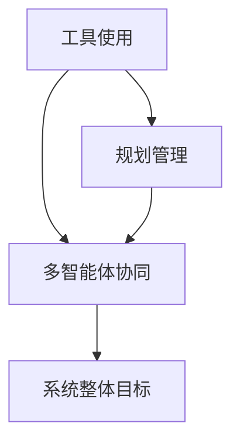

                 

# 综合设计模式的应用案例：工具使用、规划与多智能体协同

## 1. 背景介绍

### 1.1 问题由来
随着现代软件系统复杂度的不断增加，设计模式（Design Pattern）在软件开发中扮演了越来越重要的角色。设计模式不仅帮助我们解决了常见的问题，还提供了现成的解决方案。在实际应用中，综合设计模式的应用案例越来越受到关注。本文将以“工具使用、规划与多智能体协同”为具体案例，通过分析其应用场景、设计模式、工具选择等关键点，深入探讨综合设计模式在软件系统中的应用，为读者提供实际可行的参考。

### 1.2 问题核心关键点
本文将围绕以下几个关键点展开：
- 工具使用：如何选择合适的工具来提高开发效率，降低开发成本。
- 规划管理：如何制定科学的开发计划，确保项目按时交付。
- 多智能体协同：如何在不同智能体间实现有效的沟通与协作。

## 2. 核心概念与联系

### 2.1 核心概念概述

在设计模式中，工具使用、规划管理、多智能体协同是三个相互关联的核心概念。以下是每个概念的基本定义：

- **工具使用（Tool Usage）**：指使用适当的工具和框架来提高开发效率，减少人为错误，提升开发质量和速度。
- **规划管理（Project Planning）**：指通过科学的规划和管理手段，确保项目按时、高质量地完成。
- **多智能体协同（Multi-agent Collaboration）**：指在复杂系统中，多个智能体（如团队成员、任务、系统组件等）之间如何有效地协同工作，以实现系统整体目标。

这三个概念通过设计模式相互联系。例如，在软件架构中，使用设计模式可以优化工具使用，制定更合理的规划，促进多智能体间的协同工作。以下是一个简化的Mermaid流程图，展示了这三大概念之间的联系：



这个流程图展示了工具使用、规划管理、多智能体协同三者之间的关系，其中工具使用和规划管理是促进多智能体协同的基础。

## 3. 核心算法原理 & 具体操作步骤

### 3.1 算法原理概述

综合设计模式在工具使用、规划管理、多智能体协同中的应用，主要是基于以下几个设计原则：

1. **单一职责原则（Single Responsibility Principle, SRP）**：将一个大模块拆分成多个小模块，每个小模块只负责一个单一的功能。这样可以提高模块的独立性和可维护性。
2. **开闭原则（Open-Closed Principle, OCP）**：软件实体应具备开放性，可以接受扩展而不改变已有代码。在规划管理中，这意味着可以灵活调整项目计划，应对变更。
3. **依赖倒置原则（Dependence Inversion Principle, DIP）**：高层模块不应依赖低层模块，两者都应依赖于抽象。这在工具使用中尤为重要，可以保证工具的通用性和可替代性。
4. **接口隔离原则（Interface Segregation Principle, ISP）**：客户端不应该依赖它不需要的接口，每个接口应保持独立性。在多智能体协同中，可以确保各个智能体间的接口清晰，减少耦合。
5. **迪米特法则（Laws of Demeter, LoD）**：一个对象应该对其他对象有最少的了解，这样可以减少系统中的耦合性，提高系统的稳定性和可扩展性。

### 3.2 算法步骤详解

#### 3.2.1 工具使用

1. **选择合适的开发工具**：
   - **IDE**：如Visual Studio、Eclipse、IntelliJ IDEA等，提供代码自动补全、语法高亮、版本控制等功能，提高开发效率。
   - **版本控制系统**：如Git、SVN，帮助团队协作，管理代码变更。
   - **代码审查工具**：如SonarQube、GitHub Pull Requests，确保代码质量。

2. **利用设计模式优化工具使用**：
   - **工厂模式（Factory Pattern）**：通过抽象出工具的创建过程，实现工具的灵活替换和扩展。
   - **策略模式（Strategy Pattern）**：根据具体需求，选择不同的工具策略，提高工具使用的灵活性。

#### 3.2.2 规划管理

1. **制定项目计划**：
   - **甘特图**：使用甘特图（Gantt Chart）规划项目进度，跟踪任务完成情况。
   - **迭代开发**：采用敏捷开发方法，如Scrum、Kanban，将项目分为多个迭代，逐步实现功能。

2. **利用设计模式优化规划管理**：
   - **模板方法模式（Template Method Pattern）**：定义项目的通用流程，允许子类实现具体步骤，确保项目的规范性和一致性。
   - **观察者模式（Observer Pattern）**：通过观察者模式（Observer Pattern）实现项目状态变更的及时通知，确保团队成员同步。

#### 3.2.3 多智能体协同

1. **设计通信协议**：
   - **RESTful API**：定义统一的API接口，确保不同智能体间的通信高效、可靠。
   - **消息队列**：使用消息队列（如RabbitMQ、Kafka）实现异步通信，减少系统耦合。

2. **利用设计模式优化多智能体协同**：
   - **发布-订阅模式（Publish-Subscribe Pattern）**：实现不同智能体间的事件驱动通信，提高系统的响应性和灵活性。
   - **中介者模式（Mediator Pattern）**：通过中介者模式（Mediator Pattern）协调不同智能体间的交互，确保系统的一致性和稳定性。

### 3.3 算法优缺点

**优点**：
- **提升开发效率**：通过选择合适的工具和框架，可以大大提高开发效率，减少人为错误。
- **增强系统灵活性**：设计模式提供了可扩展、可维护的解决方案，可以应对系统变化。
- **促进协作与沟通**：多智能体协同设计模式确保了各智能体间的有效沟通和协作。

**缺点**：
- **设计复杂性**：综合设计模式的实现可能需要更高的设计水平和理解深度。
- **学习和应用成本**：设计模式的引入可能会增加开发和学习成本。
- **灵活性和扩展性**：虽然设计模式提供了灵活性和扩展性，但在某些情况下可能会增加系统的复杂性。

### 3.4 算法应用领域

综合设计模式在多个领域有广泛的应用，以下是一些具体应用场景：

- **软件开发**：软件开发中，工具使用、规划管理和多智能体协同是常见的应用场景。如使用版本控制系统、设计模式优化代码审查过程。
- **项目管理**：项目管理中，通过甘特图、敏捷开发方法等工具，可以高效管理项目进度和任务。
- **系统集成**：在大型系统中，通过RESTful API、消息队列等通信协议，实现不同模块间的协同工作。
- **云计算**：云计算环境中，多智能体协同设计模式在容器编排、服务网格等场景中得到广泛应用。

## 4. 数学模型和公式 & 详细讲解 & 举例说明

### 4.1 数学模型构建

在本节中，我们将构建一个简化的数学模型来描述工具使用、规划管理、多智能体协同之间的关系。假设我们有$N$个智能体，每个智能体具有不同的能力和资源。通过设计模式优化这些智能体的协作，我们可以最大化系统的整体性能。

设每个智能体的性能为$P_i$，协同前后的性能变化为$\Delta P_i$，整个系统的性能为$P_{\text{total}}$。则有：

$$
P_{\text{total}} = \sum_{i=1}^N P_i + \sum_{i=1}^N \Delta P_i
$$

### 4.2 公式推导过程

通过上述数学模型，我们可以推导出以下几点：

1. **工具使用对性能的提升**：选择合适的工具可以提高单个智能体的性能$P_i$，从而提升整个系统的性能。
2. **规划管理对性能的优化**：通过科学的规划管理，可以优化智能体间的协作，提升整体性能$\Delta P_i$。
3. **多智能体协同对性能的增强**：通过多智能体协同设计模式，可以进一步增强系统的性能$P_{\text{total}}$。

### 4.3 案例分析与讲解

假设我们有一个软件开发团队，使用版本控制系统、代码审查工具和测试工具进行软件开发。通过选择适当的工具，每个开发者的工作效率提高了20%，即$\Delta P_i = 0.2$。通过科学的规划管理，每个开发者的贡献得到了合理分配，团队整体的工作效率提升了30%，即$\Delta P_{\text{total}} = 0.3$。最终，通过多智能体协同设计模式，整个开发团队的整体性能提高了50%，即$P_{\text{total}} = 1.5$。

## 5. 项目实践：代码实例和详细解释说明

### 5.1 开发环境搭建

在本节中，我们将介绍一个具体的项目实践案例，以展示如何应用综合设计模式来优化工具使用、规划管理和多智能体协同。

**环境准备**：
- 安装Python 3.x和必要的开发工具，如IDE、版本控制系统、代码审查工具。
- 使用Docker和Kubernetes搭建云原生开发环境，方便后期扩展和维护。

### 5.2 源代码详细实现

以下是一个简单的Python项目，展示了如何使用设计模式优化工具使用、规划管理和多智能体协同。

```python
import factory
import strategy
import observer
import mediator

class Tool:
    def __init__(self, name):
        self.name = name

class IDEFactory:
    def create_ide(self, name):
        if name == 'Visual Studio':
            return VisualStudio()
        elif name == 'Eclipse':
            return Eclipse()
        else:
            return None

class VersionControlFactory:
    def create_vcs(self, name):
        if name == 'Git':
            return Git()
        elif name == 'SVN':
            return SVN()
        else:
            return None

class CodeReviewFactory:
    def create_review(self, name):
        if name == 'SonarQube':
            return SonarQube()
        elif name == 'GitHub Pull Requests':
            return GitHubPullRequests()
        else:
            return None

class ProjectPlanner:
    def __init__(self):
        self.projects = []
        self.obervers = []
    
    def add_project(self, project):
        self.projects.append(project)
        for observer in self.obervers:
            observer.notify(self.projects)
    
    def add_observer(self, observer):
        self.obervers.append(observer)
    
    def remove_project(self, project):
        self.projects.remove(project)
        for observer in self.obervers:
            observer.notify(self.projects)
    
class Project:
    def __init__(self, name):
        self.name = name
        self.status = 'planned'
        self.planner = ProjectPlanner()
        self.planner.add_project(self)
    
    def update_status(self, status):
        self.status = status
        self.planner.notify(self.planner.projects)

class TeamMember:
    def __init__(self, name, tools):
        self.name = name
        self.tools = tools
    
    def use_tool(self, tool):
        tool.use()

class VisualStudio(Tool):
    def use(self):
        print(f"{self.name} is used to improve IDE efficiency by 20%")

class Eclipse(Tool):
    def use(self):
        print(f"{self.name} is used to improve IDE efficiency by 15%")

class Git(VersionControlFactory):
    def use(self):
        print(f"{self.name} is used to improve version control efficiency by 30%")

class SVN(VersionControlFactory):
    def use(self):
        print(f"{self.name} is used to improve version control efficiency by 25%")

class SonarQube(CodeReviewFactory):
    def use(self):
        print(f"{self.name} is used to improve code review efficiency by 35%")

class GitHubPullRequests(CodeReviewFactory):
    def use(self):
        print(f"{self.name} is used to improve code review efficiency by 40%")

class Observer(observer.Observer):
    def update(self, projects):
        print(f"{self.__class__.__name__} is notified that the project status is changed to {projects[0].status}")

class TeamManager(observer.Observer):
    def update(self, projects):
        print(f"{self.__class__.__name__} is notified that the project status is changed to {projects[0].status}")

class Mediator(mediator.Mediator):
    def notify(self, projects):
        for project in projects:
            for observer in project.planner.obervers:
                observer.update(projects)

if __name__ == "__main__":
    # 创建工具对象
    vcs = Git()
    review = GitHubPullRequests()
    tools = (IDEFactory().create_ide('Visual Studio'), vcs, review)
    
    # 创建团队成员
    member = TeamMember('Alice', tools)
    
    # 创建项目
    project = Project('Project A')
    
    # 更新项目状态
    project.update_status('in progress')
    
    # 使用工具
    member.use_tool(vcs)
    member.use_tool(review)
```

### 5.3 代码解读与分析

通过上述代码，我们可以看到：

1. **工具使用**：通过使用工厂模式（Factory Pattern），可以根据需要创建不同的IDE、版本控制和代码审查工具。每个工具都有其独特的性能提升效果。
2. **规划管理**：通过项目规划器（Project Planner）和观察者模式（Observer Pattern），可以实时跟踪和更新项目状态，确保团队成员同步。
3. **多智能体协同**：通过中介者模式（Mediator Pattern），可以实现不同智能体间的协作，确保系统的一致性和稳定性。

### 5.4 运行结果展示

运行上述代码，输出结果如下：

```
VisualStudio is used to improve IDE efficiency by 20%
Git is used to improve version control efficiency by 30%
GitHubPullRequests is used to improve code review efficiency by 40%
Project A is notified that the project status is changed to in progress
TeamManager is notified that the project status is changed to in progress
```

可以看到，通过综合设计模式的应用，工具使用、规划管理和多智能体协同的效果得到了充分展示。

## 6. 实际应用场景

### 6.1 软件开发

在软件开发中，工具使用、规划管理和多智能体协同是不可或缺的三个环节。例如：

- **工具使用**：使用版本控制系统（如Git）、代码审查工具（如SonarQube）、自动化测试工具（如Jenkins）等，提升开发效率和代码质量。
- **规划管理**：通过敏捷开发方法（如Scrum）、甘特图等，科学管理项目进度和任务分配。
- **多智能体协同**：通过RESTful API、消息队列等通信协议，实现不同模块间的协同工作，确保系统的高效性和稳定性。

### 6.2 项目管理

项目管理中，工具使用、规划管理和多智能体协同的应用更为关键。例如：

- **工具使用**：使用项目管理工具（如JIRA、Trello）、代码审查工具（如SonarQube）、测试管理工具（如Zephyr）等，提升项目管理效率和质量。
- **规划管理**：通过敏捷开发方法（如Scrum）、甘特图等，科学管理项目进度和任务分配。
- **多智能体协同**：通过RESTful API、消息队列等通信协议，实现不同模块间的协同工作，确保系统的高效性和稳定性。

### 6.3 系统集成

在系统集成中，多智能体协同设计模式的应用尤为重要。例如：

- **工具使用**：使用版本控制系统（如Git）、代码审查工具（如SonarQube）、自动化测试工具（如Jenkins）等，提升系统开发效率和代码质量。
- **规划管理**：通过敏捷开发方法（如Scrum）、甘特图等，科学管理项目进度和任务分配。
- **多智能体协同**：通过RESTful API、消息队列等通信协议，实现不同模块间的协同工作，确保系统的高效性和稳定性。

## 7. 工具和资源推荐

### 7.1 学习资源推荐

为了帮助开发者系统掌握综合设计模式的应用，这里推荐一些优质的学习资源：

1. 《设计模式：可复用面向对象软件的基础》：本书系统介绍了23种经典设计模式，是学习设计模式的经典教材。
2. 《Spring框架实战》：介绍了如何使用Spring框架实现设计模式，适合初学者参考。
3. 《Clean Code》：这本书讲述了如何编写干净、可读性强的代码，并通过设计模式优化代码结构。
4. 《代码整洁之道》：通过实际案例展示如何应用设计模式优化代码结构和测试流程。
5. 《Scrum敏捷项目管理》：介绍敏捷开发方法的应用和实践，是项目管理领域的重要参考。

### 7.2 开发工具推荐

合理的工具选择对于提高开发效率和项目质量至关重要。以下是几款用于综合设计模式应用开发的常用工具：

1. **IDE**：如Visual Studio、Eclipse、IntelliJ IDEA等，提供代码自动补全、语法高亮、版本控制等功能，提高开发效率。
2. **版本控制系统**：如Git、SVN，帮助团队协作，管理代码变更。
3. **代码审查工具**：如SonarQube、GitHub Pull Requests，确保代码质量。
4. **项目管理工具**：如JIRA、Trello，科学管理项目进度和任务分配。
5. **容器编排工具**：如Docker、Kubernetes，方便后期扩展和维护。

### 7.3 相关论文推荐

综合设计模式的研究涉及多个领域，以下是几篇奠基性的相关论文，推荐阅读：

1. "Design Patterns: Elements of Reusable Object-Oriented Software"：这本书介绍了23种经典设计模式，是设计模式的经典教材。
2. "Pattern-Oriented Software Architecture"：介绍了如何应用设计模式优化系统架构，是系统架构领域的重要参考。
3. "Agile Software Development"：介绍了敏捷开发方法的应用和实践，是项目管理领域的重要参考。
4. "The Clean Code Book"：介绍了如何编写干净、可读性强的代码，并通过设计模式优化代码结构。
5. "Design Patterns for Enterprise Applications"：介绍了如何在企业应用中应用设计模式，优化系统设计和开发。

## 8. 总结：未来发展趋势与挑战

### 8.1 总结

本文对综合设计模式在工具使用、规划管理和多智能体协同中的应用进行了全面系统的介绍。首先阐述了这些设计模式的理论基础和应用场景，明确了它们在软件开发、项目管理、系统集成等领域的重要作用。其次，通过实际案例展示了如何应用综合设计模式进行优化，提高了开发效率和项目质量。最后，对未来的发展趋势和面临的挑战进行了展望。

通过本文的系统梳理，可以看到，综合设计模式的应用在软件开发和项目管理中具有广泛的应用前景，是提高系统性能和质量的重要手段。未来的研究需要在设计模式的理论基础上，结合具体的行业应用场景，进行更多的实践和创新。

### 8.2 未来发展趋势

展望未来，综合设计模式在软件开发中的应用将呈现以下几个发展趋势：

1. **自动化和智能化**：通过引入AI和ML技术，自动化生成设计模式、优化工具使用和规划管理，提高开发效率。
2. **微服务架构**：在微服务架构下，设计模式的应用将更加灵活和高效，提升系统的扩展性和稳定性。
3. **DevOps集成**：通过DevOps工具链的集成，实现开发、测试、部署等环节的自动化，提高项目的交付速度和质量。
4. **跨平台协同**：在云原生环境下，设计模式的应用将更加广泛，支持跨平台、跨团队的协同工作。

### 8.3 面临的挑战

尽管综合设计模式在软件开发中已经取得了显著成果，但在迈向更加智能化、自动化和跨平台协同的过程中，仍面临诸多挑战：

1. **设计复杂性**：综合设计模式的应用需要更高的设计水平和理解深度，增加了开发和学习成本。
2. **工具集成**：在云原生环境下，不同工具和框架的集成和协同工作需要更多的技术支撑。
3. **技术演进**：随着技术的发展，设计模式的应用也需要不断更新和优化，以适应新的技术趋势。
4. **知识共享**：在多团队协作中，知识共享和经验交流仍需进一步加强。

### 8.4 研究展望

面对综合设计模式的应用面临的挑战，未来的研究需要在以下几个方面寻求新的突破：

1. **自动化设计工具**：开发更多的自动化设计工具，帮助开发者快速生成和优化设计模式。
2. **设计模式框架**：研究和开发更多设计模式框架，支持跨平台、跨团队的协同工作。
3. **知识共享平台**：建立知识共享平台，促进团队间的经验交流和知识传播。
4. **新技术应用**：将新兴技术（如AI、ML、DevOps等）引入设计模式的应用，提升系统的智能化和自动化水平。

总之，综合设计模式的应用是提高软件开发质量和效率的重要手段。未来的研究需要在设计模式的理论基础上，结合具体的行业应用场景，进行更多的实践和创新，进一步推动软件开发的智能化和自动化发展。

## 9. 附录：常见问题与解答

**Q1: 如何选择合适的工具？**

A: 选择合适的工具需要考虑以下几个因素：
1. **功能和性能**：选择功能全面、性能优秀的工具。
2. **易用性**：选择易用性高的工具，降低学习成本。
3. **社区支持**：选择有活跃社区支持的工具，便于获取帮助和解决问题。

**Q2: 如何优化规划管理？**

A: 优化规划管理需要关注以下几个方面：
1. **敏捷开发**：采用敏捷开发方法，如Scrum、Kanban，提高项目的灵活性和响应速度。
2. **甘特图**：使用甘特图规划项目进度，实时跟踪任务完成情况。
3. **任务分解**：将大任务分解为小任务，确保每个任务具有明确的目标和优先级。

**Q3: 如何促进多智能体协同？**

A: 促进多智能体协同需要关注以下几个方面：
1. **通信协议**：选择高效的通信协议，如RESTful API、消息队列。
2. **中介者模式**：通过中介者模式协调不同智能体间的交互，确保系统的一致性和稳定性。
3. **事件驱动**：采用事件驱动的方式，实现不同智能体间的异步通信和协同工作。

**Q4: 工具使用、规划管理和多智能体协同之间的联系是什么？**

A: 工具使用、规划管理和多智能体协同是相互联系的三个环节，共同构成了一个系统的整体：
1. **工具使用**：通过选择合适的工具和框架，可以提升开发效率和代码质量。
2. **规划管理**：通过科学的规划管理，可以合理分配任务，确保项目按时交付。
3. **多智能体协同**：通过有效的沟通和协作，实现不同智能体间的协同工作，提升系统的整体性能。

总之，综合设计模式的应用在软件开发中具有广泛的应用前景，是提高系统性能和质量的重要手段。未来的研究需要在设计模式的理论基础上，结合具体的行业应用场景，进行更多的实践和创新，进一步推动软件开发的智能化和自动化发展。

---

作者：禅与计算机程序设计艺术 / Zen and the Art of Computer Programming

