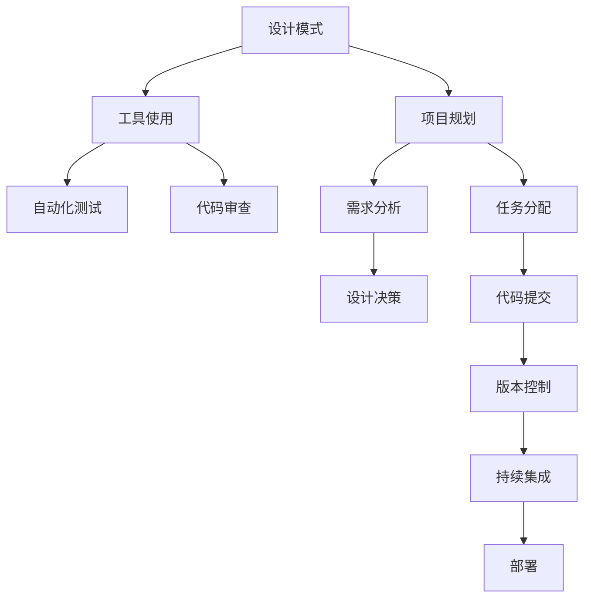

                 

# 综合设计模式：反思、工具使用与规划的结合

> 关键词：设计模式, 综合设计, 工具使用, 软件开发, 项目规划, 软件开发管理

## 1. 背景介绍

### 1.1 问题由来
随着软件工程的不断演进，软件系统的复杂性也在日益增加。如何高效、灵活地管理和构建这些系统，成为了软件开发领域的重要课题。设计模式作为一种成熟的解决方案，被广泛应用于提升软件系统的质量和可维护性。然而，尽管设计模式在提升代码可复用性和架构设计上提供了诸多益处，但实际应用中仍然存在一些问题。这些问题主要包括设计模式选择不当、应用不充分、缺乏有效工具支持等。

### 1.2 问题核心关键点
本文将围绕设计模式的综合应用、工具使用和项目规划的结合，探讨如何更有效地进行软件系统的设计和构建。我们将详细分析设计模式的应用场景、工具支持的现状，并提出一些实际可行的项目规划策略，帮助开发团队高效构建复杂软件系统。

## 2. 核心概念与联系

### 2.1 核心概念概述

设计模式是一套被广泛认可的代码结构和交互原则，旨在解决特定的问题和场景，提升软件系统的设计和开发效率。常见的设计模式包括单例模式、观察者模式、策略模式等。

工具使用则是指在软件开发过程中，利用各种自动化、协作和分析工具，提高开发效率和代码质量。常见的工具包括版本控制系统(Git)、代码质量检查工具(如SonarQube)、持续集成和持续部署(CI/CD)平台等。

项目规划是指在软件开发项目开始前，对项目的目标、范围、进度、资源等进行详细的定义和规划，以确保项目能够顺利进行并达到预期目标。

设计模式、工具使用和项目规划三者之间相互依赖，共同构成了软件系统构建的核心框架。设计模式提供了解决问题的方法，工具使用提供了实现这些方法的辅助手段，项目规划则保证了整个系统构建过程的有序进行。

### 2.2 核心概念原理和架构的 Mermaid 流程图(Mermaid 流程节点中不要有括号、逗号等特殊字符)


这个流程图展示了设计模式、工具使用和项目规划之间的关系：设计模式为工具使用和项目规划提供指导原则，工具使用为设计模式的实现提供支持，项目规划则为整个系统的构建提供宏观指导。

## 3. 核心算法原理 & 具体操作步骤

### 3.1 算法原理概述

设计模式的综合应用，涉及对设计模式的理解和选择，以及如何将其应用于实际的软件系统构建中。常用的设计模式包括但不限于：

- **单例模式(Singleton Pattern)**：确保一个类只有一个实例，并提供全局访问点。适用于管理资源、缓存等场景。
- **观察者模式(Observer Pattern)**：定义对象间一对多的依赖关系，当一个对象的状态发生改变时，所有依赖它的对象都会得到通知并自动更新。适用于事件驱动、数据同步等场景。
- **策略模式(Strategy Pattern)**：定义一系列算法，将它们封装起来，并使它们可以相互替换。适用于算法复用、策略选择等场景。

工具使用的核心在于提升开发效率和代码质量。常见的工具包括：

- **版本控制系统**：如Git，用于管理代码的版本和变更，提供协作开发的平台。
- **代码质量检查工具**：如SonarQube，用于检测代码中的潜在问题，提升代码质量和可维护性。
- **持续集成和持续部署**：如Jenkins、GitLab CI/CD，用于自动化构建、测试和部署，提高发布效率和稳定性。

项目规划的核心在于确保项目的顺利进行。常见的规划工具包括：

- **需求分析工具**：如JIRA、Trello，用于定义项目需求、任务和进度。
- **任务管理工具**：如Asana、Monday.com，用于任务分配和进度跟踪。
- **计划和调度工具**：如MS Project、Gantt charts，用于项目计划的制定和调整。

### 3.2 算法步骤详解

设计模式的综合应用主要包括以下几个关键步骤：

**Step 1: 需求分析**
- 确定项目的核心需求和功能，明确设计模式的应用场景。
- 分析现有系统的架构和组件，确定设计模式的选择和应用方式。

**Step 2: 设计决策**
- 选择合适的设计模式，并制定具体实现方案。
- 设计模式的实现应考虑到性能、可扩展性、可维护性等综合因素。

**Step 3: 工具集成**
- 选择合适的工具，并根据设计模式的需求进行集成。
- 利用工具提高开发效率和代码质量，如自动化测试、代码审查等。

**Step 4: 项目规划**
- 制定详细的项目计划，包括需求、任务、进度、资源等。
- 根据项目计划进行任务分配和管理，确保项目按时交付。

**Step 5: 实施和验证**
- 按照计划进行开发和部署，并定期进行代码审查和测试。
- 验证设计模式的正确性和效果，及时调整和优化。

### 3.3 算法优缺点

综合应用设计模式、工具使用和项目规划有以下优点：

- **提升代码可复用性**：设计模式提供了一组通用的解决方案，可用于解决常见问题，提升代码的可复用性。
- **提高开发效率**：工具使用自动化了大部分重复性工作，如版本控制、代码审查、测试等，节省了开发时间。
- **确保项目进度**：项目规划提供了详细的任务和时间管理，确保项目按时交付。

然而，这些方法也存在一些局限性：

- **设计模式选择困难**：设计模式种类繁多，选择合适的设计模式需要一定的经验和判断。
- **工具依赖性强**：选择合适的工具需要一定的技术和资源投入，可能存在学习和维护成本。
- **项目规划复杂**：项目规划需要考虑多方面的因素，制定详细的计划可能较为复杂。

### 3.4 算法应用领域

设计模式、工具使用和项目规划的应用领域广泛，包括但不限于：

- **软件开发**：广泛应用于前端、后端、移动端等各类软件开发项目。
- **数据分析**：如数据清洗、数据挖掘、数据可视化等，提升数据分析效率和质量。
- **项目管理**：如敏捷开发、Scrum、Kanban等项目管理方法，确保项目按时交付。
- **系统架构设计**：通过设计模式提升系统架构的稳定性和可扩展性，如微服务架构、事件驱动架构等。

## 4. 数学模型和公式 & 详细讲解 & 举例说明（备注：数学公式请使用latex格式，latex嵌入文中独立段落使用 $$，段落内使用 $)
### 4.1 数学模型构建

在软件系统中，设计模式、工具使用和项目规划的结合可以视为一种多目标优化问题。假设有n种设计模式、m种工具和k种项目规划方法，每个设计模式、工具和规划方法都有其特定的评分指标，如可复用性、开发效率、项目进度等。

我们可以构建一个多目标优化模型，其目标函数为：

$$
f(x,y,z) = \sum_{i=1}^{n} f_i(x) + \sum_{j=1}^{m} f_j(y) + \sum_{k=1}^{k} f_k(z)
$$

其中，$x$、$y$、$z$分别表示设计模式、工具使用和项目规划的决策变量，$f_i(x)$、$f_j(y)$、$f_k(z)$表示每种决策变量的评分函数。

### 4.2 公式推导过程

为了求解上述多目标优化问题，可以采用以下两种常见方法：

**方法一：加权最小化法**
将多目标函数转换为单目标函数，通过加权系数$\alpha_i$、$\beta_j$、$\gamma_k$对每个目标进行加权，最终得到一个单目标函数：

$$
F(x,y,z) = \alpha_1 f_1(x) + \beta_1 f_1(y) + \gamma_1 f_1(z)
$$

采用常见的优化算法，如遗传算法、粒子群优化等，对上述单目标函数进行求解，得到最优的决策变量。

**方法二：线性规划法**
将多目标函数转换为线性规划问题，通过引入虚拟变量$u_i$、$v_j$、$w_k$，将目标函数线性化，最终得到线性规划模型：

$$
\min \sum_{i=1}^{n} u_i f_i(x) + \sum_{j=1}^{m} v_j f_j(y) + \sum_{k=1}^{k} w_k f_k(z)
$$

$$
\text{subject to } u_i \geq 0, v_j \geq 0, w_k \geq 0
$$

采用线性规划算法，如单纯形法、内点法等，求解上述线性规划问题，得到最优的决策变量。

### 4.3 案例分析与讲解

以下以一个简单的软件开发项目为例，说明设计模式、工具使用和项目规划的综合应用。

**项目需求**：开发一个电商系统，包括商品管理、订单处理、用户管理等功能。

**设计模式选择**：
- 使用**单例模式**管理商品信息，确保一个商品只有一个实例。
- 使用**观察者模式**通知订单状态变化，及时更新订单信息。
- 使用**策略模式**设计不同的订单处理策略，如物流、支付等。

**工具集成**：
- **版本控制**：使用Git进行代码管理，确保团队协作和代码历史记录。
- **代码质量检查**：使用SonarQube进行代码审查，提升代码质量和可维护性。
- **持续集成**：使用Jenkins进行自动化构建和测试，确保发布稳定性。

**项目规划**：
- **需求分析**：使用JIRA定义项目需求和任务，明确项目目标和功能。
- **任务管理**：使用Asana分配任务和进度，确保项目按时交付。
- **计划和调度**：使用Gantt charts制定项目计划，跟踪项目进度和资源使用。

## 5. 项目实践：代码实例和详细解释说明
### 5.1 开发环境搭建

在进行设计模式、工具使用和项目规划的实践前，我们需要准备好开发环境。以下是使用Python进行版本控制和持续集成的环境配置流程：

1. 安装Anaconda：从官网下载并安装Anaconda，用于创建独立的Python环境。

2. 创建并激活虚拟环境：
```bash
conda create -n dev-env python=3.8
conda activate dev-env
```

3. 安装Git：
```bash
sudo apt-get install git
```

4. 安装Jenkins：
```bash
sudo apt-get install jenkins
```

5. 安装SonarQube：
```bash
sudo apt-get install sonarqube
```

6. 安装JIRA：
```bash
sudo apt-get install jira
```

7. 安装Asana：
```bash
sudo apt-get install asana
```

完成上述步骤后，即可在`dev-env`环境中开始设计模式、工具使用和项目规划的实践。

### 5.2 源代码详细实现

下面我们以电商系统开发为例，给出使用Python实现单例模式、观察者模式和策略模式的代码实现。

**单例模式**：

```python
import threading

class Singleton:
    _instance = None
    _lock = threading.Lock()
    
    def __new__(cls, *args, **kwargs):
        if cls._instance is None:
            with cls._lock:
                if cls._instance is None:
                    cls._instance = super(Singleton, cls).__new__(cls, *args, **kwargs)
        return cls._instance
```

**观察者模式**：

```python
class Subject:
    def __init__(self):
        self._observers = []
    
    def attach(self, observer):
        self._observers.append(observer)
    
    def detach(self, observer):
        self._observers.remove(observer)
    
    def notify(self):
        for observer in self._observers:
            observer.update()

class Observer:
    def update(self, subject):
        print(f"Received update from subject {subject}")

# 使用示例
subject = Subject()
observer1 = Observer()
observer2 = Observer()
subject.attach(observer1)
subject.attach(observer2)
subject.notify()
```

**策略模式**：

```python
class Strategy:
    def __init__(self):
        pass
    
    def execute(self):
        pass

class ConcreteStrategyA(Strategy):
    def execute(self):
        print("Executing strategy A")

class ConcreteStrategyB(Strategy):
    def execute(self):
        print("Executing strategy B")

# 使用示例
strategy_a = ConcreteStrategyA()
strategy_a.execute()
strategy_b = ConcreteStrategyB()
strategy_b.execute()
```

### 5.3 代码解读与分析

让我们再详细解读一下关键代码的实现细节：

**单例模式**：
- `Singleton`类使用`__new__`方法实现了单例模式。通过使用`_instance`和`_lock`变量，确保只有一个实例被创建。

**观察者模式**：
- `Subject`类维护了所有观察者的列表，`notify`方法遍历列表，调用所有观察者的`update`方法，实现通知功能。
- `Observer`类实现了观察者接口，`update`方法接收主题对象，实现更新逻辑。

**策略模式**：
- `Strategy`类定义了策略接口，`execute`方法为抽象方法。
- `ConcreteStrategyA`和`ConcreteStrategyB`类分别实现了具体的策略，实现了`execute`方法。

## 6. 实际应用场景
### 6.1 软件开发

设计模式、工具使用和项目规划在软件开发中的应用非常广泛。通过综合应用这些方法，开发团队可以更高效、灵活地管理和构建复杂的软件系统。例如，在开发大型电子商务平台时，设计模式可以提升系统的稳定性和可扩展性，工具可以自动化任务，确保代码质量和发布效率，项目规划可以确保项目按时交付。

### 6.2 数据分析

在数据分析领域，设计模式、工具使用和项目规划同样不可或缺。例如，使用单例模式管理数据连接池，提升数据库访问性能；使用观察者模式实时监控数据更新，确保数据一致性；使用策略模式设计不同的数据处理策略，提升数据分析的灵活性。

### 6.3 项目管理

项目管理是设计模式、工具使用和项目规划的综合应用，通过这些方法可以确保项目的顺利进行。例如，使用需求分析工具定义项目需求，使用任务管理工具分配和跟踪任务进度，使用计划和调度工具制定和调整项目计划，确保项目按时交付。

### 6.4 未来应用展望

随着软件开发技术和方法的不断发展，设计模式、工具使用和项目规划的应用领域将更加广泛。未来，这些方法将在更多领域得到应用，如智能制造、智慧城市、金融科技等。

## 7. 工具和资源推荐
### 7.1 学习资源推荐

为了帮助开发者系统掌握设计模式、工具使用和项目规划的理论基础和实践技巧，这里推荐一些优质的学习资源：

1. 《Design Patterns: Elements of Reusable Object-Oriented Software》书籍：这是一本经典的关于设计模式的书籍，系统介绍了23种常用的设计模式。

2. 《Clean Code: A Handbook of Agile Software Craftsmanship》书籍：介绍了如何编写清晰、可维护的代码，提升代码质量和开发效率。

3. 《Effective Python: 59 Specific Ways to Write Better Python》书籍：介绍了Python编程的最佳实践，提升Python编程能力。

4. 《Learning Git Branching》书籍：介绍了Git版本控制的基本概念和操作，帮助开发者掌握版本控制技巧。

5. 《Continuous Integration: Distributed Systems Design and Implementation》书籍：介绍了持续集成和持续部署的基本概念和实践，提升持续集成能力。

6. 《Agile Estimating and Planning》书籍：介绍了敏捷开发中的估算和规划方法，提升项目管理能力。

通过对这些资源的学习实践，相信你一定能够快速掌握设计模式、工具使用和项目规划的精髓，并用于解决实际的开发问题。

### 7.2 开发工具推荐

高效的开发离不开优秀的工具支持。以下是几款用于设计模式、工具使用和项目规划开发的常用工具：

1. Python：灵活的动态语言，适合设计模式的实现和工具的开发。

2. Java：面向对象的语言，适合企业级应用程序的开发，工具库丰富。

3. C++：高效的语言，适合系统级应用程序的开发，工具链完善。

4. Git：流行的版本控制系统，提供协作开发的平台。

5. SonarQube：代码质量检查工具，提供自动化代码审查和质量分析。

6. Jenkins：流行的持续集成和持续部署平台，支持多种工具集成。

7. JIRA：项目管理工具，支持需求管理、任务分配和进度跟踪。

8. Asana：任务管理工具，支持任务分配和进度跟踪。

9. Gantt charts：计划和调度工具，支持项目计划的制定和调整。

合理利用这些工具，可以显著提升设计模式、工具使用和项目规划的开发效率，加快创新迭代的步伐。

### 7.3 相关论文推荐

设计模式、工具使用和项目规划的发展源于学界的持续研究。以下是几篇奠基性的相关论文，推荐阅读：

1. "The Gang of Four"（《设计模式：可复用面向对象软件的基础》）：该书介绍了23种常用的设计模式，被誉为设计模式的圣经。

2. "Software Architecture in Practice"（《软件架构实践》）：该书介绍了软件架构的基本概念和设计原则，帮助开发者提升架构设计能力。

3. "Continuous Integration: Principles, Modeling, and Implementation"（《持续集成：原则、建模和实现》）：该书介绍了持续集成和持续部署的基本概念和实践，帮助开发者提升持续集成能力。

4. "Project Management for Systematic Software Engineering"（《系统软件开发工程项目管理》）：该书介绍了项目管理的基本概念和实践，帮助开发者提升项目管理能力。

这些论文代表了大语言模型微调技术的发展脉络。通过学习这些前沿成果，可以帮助研究者把握学科前进方向，激发更多的创新灵感。

## 8. 总结：未来发展趋势与挑战

### 8.1 总结

本文对设计模式、工具使用和项目规划的综合应用进行了全面系统的介绍。首先阐述了设计模式、工具使用和项目规划的研究背景和意义，明确了综合应用这些方法的独特价值。其次，从原理到实践，详细讲解了设计模式的应用场景、工具支持的现状，并提出一些实际可行的项目规划策略，帮助开发团队高效构建复杂软件系统。

通过本文的系统梳理，可以看到，设计模式、工具使用和项目规划在软件系统构建中扮演了重要角色，极大地提升了开发效率和系统质量。未来，伴随这些方法的不断演进，软件开发技术必将迎来新的变革，带来更多的创新和应用可能。

### 8.2 未来发展趋势

展望未来，设计模式、工具使用和项目规划将呈现以下几个发展趋势：

1. 设计模式更加灵活多样。随着软件开发场景的不断变化，新的设计模式将不断涌现，提升设计模式的适应性和可复用性。

2. 工具支持更加智能化。未来的工具将具备更多的智能化功能，如自动化重构、智能提示、智能代码审查等，提升开发效率和代码质量。

3. 项目规划更加敏捷灵活。敏捷开发方法将继续发展和完善，适应快速变化的市场需求。

4. 设计模式、工具使用和项目规划的融合将更加深入。通过更好的融合，设计模式可以更好地利用工具和项目规划的支持，提升设计和构建效率。

5. 设计模式和工具的生态系统将更加丰富。更多的开源工具和框架将涌现，为开发者提供更多选择和支持。

以上趋势凸显了设计模式、工具使用和项目规划的综合应用的广阔前景。这些方向的探索发展，必将进一步提升软件系统的性能和应用范围，为软件开发的持续创新和进步铺平道路。

### 8.3 面临的挑战

尽管设计模式、工具使用和项目规划在提升软件系统设计和构建上取得了显著成效，但在迈向更加智能化、普适化应用的过程中，它们仍面临着诸多挑战：

1. 设计模式的选择和应用复杂。设计模式种类繁多，选择合适的模式需要丰富的经验和判断，应用不当可能导致系统性能下降。

2. 工具的学习和维护成本高。选择工具需要一定的技术和资源投入，学习成本较高。

3. 项目规划的复杂度高。制定详细的项目计划需要考虑多方面的因素，制定计划较为复杂。

4. 系统规模和复杂性增加。随着系统规模和复杂性的增加，设计和构建的难度也在增加，需要更多的资源和时间投入。

5. 技术快速迭代带来的挑战。软件开发技术在快速迭代，需要不断学习新技术和新工具，保持竞争力。

### 8.4 研究展望

面对设计模式、工具使用和项目规划所面临的种种挑战，未来的研究需要在以下几个方面寻求新的突破：

1. 探索新的设计模式和工具。开发更加灵活多样、智能化和高效的设计模式和工具，提升开发效率和系统质量。

2. 研究设计模式和工具的集成应用。通过更好的集成和融合，提升设计模式、工具使用和项目规划的综合应用效果。

3. 引入更多新兴技术。如区块链、物联网、人工智能等新兴技术，提升系统的智能化和自动化水平。

4. 持续优化和改进。不断优化和改进设计模式、工具使用和项目规划的方法和工具，提升其适用性和实用性。

这些研究方向的探索，必将引领设计模式、工具使用和项目规划技术迈向更高的台阶，为软件开发技术的持续创新和进步提供更多可能。

## 9. 附录：常见问题与解答

**Q1：设计模式和工具使用相结合有什么优势？**

A: 设计模式和工具使用相结合可以大幅提升软件开发效率和系统质量。设计模式提供了通用的解决方案，提升代码可复用性和系统稳定性；工具使用自动化了大部分重复性工作，提高开发效率和代码质量。两者结合，可以形成更加高效、灵活和稳定的软件开发体系。

**Q2：如何选择和使用设计模式？**

A: 选择设计模式需要根据具体的场景和需求进行综合考虑。常见的选择方法包括：
1. 评估现有系统的架构和组件，确定设计模式的选择和应用方式。
2. 根据问题特点选择合适的设计模式，如单例模式管理资源、观察者模式实现数据同步等。

**Q3：如何使用持续集成和持续部署(CI/CD)工具？**

A: 使用CI/CD工具可以自动化软件开发过程中的构建、测试和部署，提升发布效率和系统稳定性。常见的使用步骤包括：
1. 安装和配置CI/CD工具，如Jenkins、GitLab CI/CD等。
2. 编写自动化测试脚本，检测代码质量和功能。
3. 配置持续集成和持续部署流程，确保每次提交都进行自动化测试和部署。

**Q4：如何制定和调整项目计划？**

A: 制定项目计划需要考虑多方面的因素，如需求、任务、进度、资源等。常见的方法包括：
1. 使用需求分析工具，如JIRA、Trello等，定义项目需求和任务。
2. 使用任务管理工具，如Asana、Monday.com等，分配任务和跟踪进度。
3. 使用计划和调度工具，如Gantt charts、MS Project等，制定和调整项目计划。

通过系统掌握设计模式、工具使用和项目规划的原理和应用方法，相信你可以更高效地构建复杂的软件系统，提升开发效率和系统质量。总之一句话，要善于结合这些方法和工具，形成一种综合、灵活和高效的软件开发体系，以应对日益复杂的软件开发需求。

