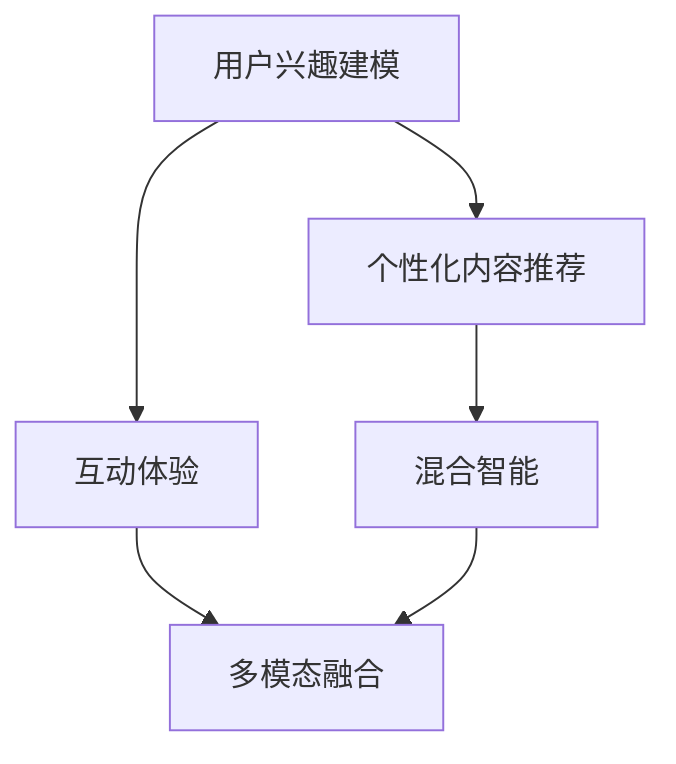

                 

# 聊天机器人娱乐业：个性化内容推荐和互动体验

## 1. 背景介绍

### 1.1 问题由来
随着人工智能技术的快速发展，聊天机器人已经成为了娱乐业中不可或缺的一部分。从简单的客服对话到复杂的娱乐应用，聊天机器人通过自然语言处理和机器学习技术，能够与用户进行流畅、智能的互动，极大地提升了用户体验。

然而，传统的聊天机器人往往缺乏个性化的内容推荐和互动体验，导致用户体验单一、乏味。为了提升用户粘性，企业亟需一种能够根据用户偏好和历史行为，智能推荐个性化内容，并提供丰富互动体验的聊天机器人解决方案。

### 1.2 问题核心关键点
个性化内容推荐和互动体验的核心在于如何通过数据分析和机器学习技术，实现以下目标：

1. **用户兴趣建模**：通过分析用户的历史行为数据，建立用户兴趣模型，识别出用户最感兴趣的内容类型、话题和互动方式。
2. **个性化内容推荐**：根据用户兴趣模型，智能推荐符合用户偏好的内容，如新闻、视频、音乐、游戏等。
3. **丰富互动体验**：结合自然语言处理技术，提供自然流畅的对话体验，增强用户的参与感和满意度。

本文将从核心概念、算法原理、具体实现和应用场景等角度，系统地探讨如何构建一个具备个性化推荐和互动体验的聊天机器人系统。

## 2. 核心概念与联系

### 2.1 核心概念概述

为更好地理解个性化内容推荐和互动体验的实现方法，本节将介绍几个关键概念及其之间的关系：

- **用户兴趣建模**：通过用户行为数据，构建用户兴趣模型，识别用户的偏好和兴趣点。
- **个性化内容推荐**：利用用户兴趣模型，智能推荐符合用户偏好的内容，实现个性化推荐。
- **互动体验**：结合自然语言处理技术，提供自然流畅的对话体验，增强用户的参与感和满意度。
- **混合智能**：通过结合深度学习、自然语言处理、强化学习等技术，实现聊天机器人与用户的互动，提供更加丰富多样的服务。
- **多模态融合**：结合视觉、音频、文本等多种模态信息，提供更加丰富、直观的用户体验。

这些核心概念之间的逻辑关系可以通过以下Mermaid流程图来展示：



这个流程图展示了个性化内容推荐和互动体验的核心概念及其之间的关系：

1. 用户兴趣建模通过分析用户行为数据，构建用户兴趣模型。
2. 个性化内容推荐利用用户兴趣模型，推荐符合用户偏好的内容。
3. 互动体验通过自然语言处理技术，提供流畅的对话体验。
4. 混合智能结合深度学习、自然语言处理、强化学习等技术，实现与用户的深度互动。
5. 多模态融合结合视觉、音频、文本等多种模态信息，提供丰富、直观的用户体验。

这些核心概念共同构成了聊天机器人娱乐业的系统架构，使其能够提供个性化的推荐和互动体验，提升用户的满意度和粘性。

## 3. 核心算法原理 & 具体操作步骤
### 3.1 算法原理概述

个性化内容推荐和互动体验的实现，主要依赖于以下几个关键算法和流程：

1. **用户兴趣建模**：通过用户行为数据，建立用户兴趣模型，识别出用户的偏好和兴趣点。
2. **个性化内容推荐**：利用用户兴趣模型，智能推荐符合用户偏好的内容，实现个性化推荐。
3. **互动体验**：结合自然语言处理技术，提供自然流畅的对话体验，增强用户的参与感和满意度。
4. **混合智能**：通过结合深度学习、自然语言处理、强化学习等技术，实现聊天机器人与用户的互动，提供更加丰富多样的服务。
5. **多模态融合**：结合视觉、音频、文本等多种模态信息，提供更加丰富、直观的用户体验。

这些算法和流程通过深度学习、自然语言处理、强化学习等技术实现，其核心原理可以总结如下：

- **用户兴趣建模**：利用协同过滤、内容推荐、深度学习等方法，从用户的历史行为数据中学习用户的兴趣和偏好。
- **个性化内容推荐**：通过协同过滤、矩阵分解、深度学习等方法，利用用户兴趣模型，推荐符合用户偏好的内容。
- **互动体验**：结合自然语言处理技术，如序列建模、生成式模型、神经网络等，提供自然流畅的对话体验。
- **混合智能**：通过结合深度学习、自然语言处理、强化学习等技术，实现聊天机器人与用户的深度互动，提供更加丰富多样的服务。
- **多模态融合**：结合视觉、音频、文本等多种模态信息，利用深度学习、多模态融合等方法，提供丰富、直观的用户体验。

### 3.2 算法步骤详解

#### 3.2.1 用户兴趣建模

用户兴趣建模主要依赖于用户行为数据，如浏览记录、搜索记录、点击记录、互动记录等。通过分析这些数据，可以构建用户兴趣模型，识别出用户的偏好和兴趣点。

1. **数据收集**：收集用户的历史行为数据，如网页浏览记录、搜索记录、互动记录等。
2. **数据预处理**：对收集到的数据进行清洗、归一化、去重等预处理，去除噪声数据。
3. **特征提取**：从预处理后的数据中提取特征，如网页内容、标签、用户互动时间等。
4. **模型训练**：利用协同过滤、内容推荐、深度学习等方法，训练用户兴趣模型。

#### 3.2.2 个性化内容推荐

个性化内容推荐主要利用用户兴趣模型，智能推荐符合用户偏好的内容。常用的方法包括协同过滤、矩阵分解、深度学习等。

1. **数据收集**：收集用户的历史行为数据，如网页浏览记录、搜索记录、互动记录等。
2. **数据预处理**：对收集到的数据进行清洗、归一化、去重等预处理，去除噪声数据。
3. **特征提取**：从预处理后的数据中提取特征，如网页内容、标签、用户互动时间等。
4. **模型训练**：利用协同过滤、矩阵分解、深度学习等方法，训练个性化内容推荐模型。
5. **推荐计算**：根据用户兴趣模型，计算并推荐符合用户偏好的内容。

#### 3.2.3 互动体验

互动体验主要依赖于自然语言处理技术，如序列建模、生成式模型、神经网络等。通过结合自然语言处理技术，提供自然流畅的对话体验，增强用户的参与感和满意度。

1. **对话模型训练**：训练基于序列建模、生成式模型、神经网络等技术的对话模型。
2. **对话引擎部署**：将训练好的对话模型部署到聊天机器人系统中，实现自然流畅的对话体验。
3. **互动体验优化**：结合用户反馈，不断优化对话模型，提升用户体验。

#### 3.2.4 混合智能

混合智能主要结合深度学习、自然语言处理、强化学习等技术，实现聊天机器人与用户的深度互动，提供更加丰富多样的服务。

1. **深度学习**：利用深度学习技术，提升对话模型的理解能力和生成能力。
2. **自然语言处理**：结合自然语言处理技术，实现更自然、流畅的对话体验。
3. **强化学习**：利用强化学习技术，实现聊天机器人与用户的深度互动，提供更加丰富多样的服务。

#### 3.2.5 多模态融合

多模态融合主要结合视觉、音频、文本等多种模态信息，利用深度学习、多模态融合等方法，提供丰富、直观的用户体验。

1. **多模态数据收集**：收集视觉、音频、文本等多种模态的数据。
2. **数据预处理**：对收集到的数据进行清洗、归一化、去重等预处理，去除噪声数据。
3. **特征提取**：从预处理后的数据中提取特征，如视觉特征、音频特征、文本特征等。
4. **模型训练**：利用深度学习、多模态融合等方法，训练多模态融合模型。
5. **多模态体验**：结合视觉、音频、文本等多种模态信息，提供丰富、直观的用户体验。

### 3.3 算法优缺点

个性化内容推荐和互动体验的实现，具有以下优点：

1. **提升用户体验**：通过个性化推荐和丰富互动体验，提升用户的满意度和粘性。
2. **提高运营效率**：通过个性化推荐，提高内容推送的精准度，减少用户的流失。
3. **优化资源利用**：通过智能推荐，优化资源利用，提升平台的运营效率。

同时，该方法也存在一定的局限性：

1. **数据依赖**：个性化推荐和互动体验依赖于大量的用户行为数据，数据的获取和处理成本较高。
2. **算法复杂度**：个性化推荐和互动体验的算法复杂度较高，需要高性能计算资源。
3. **用户隐私**：用户行为数据的收集和分析可能会涉及到用户隐私问题，需要谨慎处理。
4. **多样性不足**：个性化推荐可能存在用户偏好单一化的问题，需要结合多样性推荐策略。

尽管存在这些局限性，但就目前而言，个性化推荐和互动体验的实现方法仍然是聊天机器人娱乐业的重要技术手段，其应用前景非常广阔。

### 3.4 算法应用领域

个性化内容推荐和互动体验的实现方法，已经在聊天机器人娱乐业得到了广泛的应用，覆盖了以下多个领域：

1. **在线娱乐**：通过个性化推荐和丰富互动体验，提升在线娱乐平台的用户体验，如在线游戏、视频平台等。
2. **社交媒体**：结合社交媒体用户的互动行为数据，实现个性化推荐和丰富互动体验，如微博、微信等。
3. **智能客服**：利用自然语言处理技术，结合用户互动行为数据，实现智能客服的个性化推荐和丰富互动体验。
4. **电子商务**：结合用户浏览、购买行为数据，实现个性化推荐和丰富互动体验，如电商平台等。
5. **教育培训**：结合用户学习行为数据，实现个性化推荐和丰富互动体验，如在线教育平台等。

除了上述这些经典领域外，个性化推荐和互动体验的实现方法还在更多场景中得到应用，如智能家居、智慧医疗、智慧旅游等，为不同行业带来了创新和变革。

## 4. 数学模型和公式 & 详细讲解 & 举例说明

### 4.1 数学模型构建

本节将使用数学语言对个性化内容推荐和互动体验的实现方法进行更加严格的刻画。

记用户数为 $U$，内容数为 $I$，用户兴趣模型为 $M_{\theta}$，其中 $\theta$ 为模型的参数。假设用户 $u$ 对内容 $i$ 的兴趣度为 $r_{ui}$，模型参数 $\theta$ 的更新公式为：

$$
\theta \leftarrow \theta - \eta \nabla_{\theta}L(M_{\theta}, D)
$$

其中，$D$ 为用户兴趣模型 $M_{\theta}$ 的训练数据，$L$ 为损失函数，$\nabla_{\theta}L$ 为损失函数对模型参数 $\theta$ 的梯度，$\eta$ 为学习率。

### 4.2 公式推导过程

以下我们以协同过滤方法为例，推导用户兴趣模型的更新公式。

假设用户 $u$ 对内容 $i$ 的兴趣度为 $r_{ui}$，用户 $u$ 的历史行为数据为 $H_u$，用户 $v$ 对内容 $i$ 的兴趣度为 $r_{vi}$，用户 $v$ 的历史行为数据为 $H_v$。协同过滤方法的基本思想是通过用户历史行为数据的相似性，预测用户对内容的兴趣度。假设相似度矩阵为 $S_{uv}$，则协同过滤方法的目标是最大化用户 $u$ 对内容 $i$ 的预测兴趣度 $p_{ui}$ 和实际兴趣度 $r_{ui}$ 的拟合度，即：

$$
\min_{S_{uv}, p_{ui}}\sum_{i=1}^I \sum_{u=1}^U (r_{ui} - p_{ui})^2
$$

利用梯度下降等优化算法，协同过滤方法的目标函数可以分解为两个部分：

$$
\min_{S_{uv}}\sum_{i=1}^I \sum_{u=1}^U (r_{ui} - p_{ui})^2
$$

$$
\min_{p_{ui}}\sum_{i=1}^I \sum_{u=1}^U (r_{ui} - p_{ui})^2
$$

其中，第一部分是相似度矩阵 $S_{uv}$ 的优化目标，第二部分是内容兴趣度 $p_{ui}$ 的优化目标。通过迭代优化，协同过滤方法可以不断更新相似度矩阵和内容兴趣度，提升预测准确度。

### 4.3 案例分析与讲解

以协同过滤方法为例，我们来看一个简单的案例。假设有一个在线视频平台，需要为用户推荐其感兴趣的视频内容。该平台收集了用户的历史观看记录 $H_u$，其中 $H_u = (v_1, v_2, \dots, v_m)$，每个 $v_i$ 表示用户观看的一个视频。设 $S_{uv}$ 为相似度矩阵，$p_{ui}$ 为用户 $u$ 对内容 $i$ 的兴趣度预测值。

根据协同过滤方法，用户 $u$ 对内容 $i$ 的兴趣度可以表示为：

$$
p_{ui} = \sum_{v=1}^V S_{uv} \cdot r_{vi}
$$

其中 $V$ 为用户数，$r_{vi}$ 为用户 $v$ 对内容 $i$ 的兴趣度。通过最大化 $p_{ui}$ 和 $r_{ui}$ 的拟合度，可以不断更新相似度矩阵 $S_{uv}$ 和内容兴趣度 $p_{ui}$，提升推荐准确度。

## 5. 项目实践：代码实例和详细解释说明

### 5.1 开发环境搭建

在进行项目实践前，我们需要准备好开发环境。以下是使用Python进行TensorFlow开发的环境配置流程：

1. 安装Anaconda：从官网下载并安装Anaconda，用于创建独立的Python环境。

2. 创建并激活虚拟环境：
```bash
conda create -n tf-env python=3.8 
conda activate tf-env
```

3. 安装TensorFlow：根据CUDA版本，从官网获取对应的安装命令。例如：
```bash
conda install tensorflow -c tf -c conda-forge
```

4. 安装其他必要库：
```bash
pip install pandas numpy sklearn matplotlib tqdm jupyter notebook ipython
```

完成上述步骤后，即可在`tf-env`环境中开始项目实践。

### 5.2 源代码详细实现

这里我们以一个简单的在线视频平台为例，使用TensorFlow和TensorBoard进行用户兴趣建模和个性化内容推荐。

首先，定义数据结构和模型结构：

```python
import tensorflow as tf
from tensorflow.keras import layers, models

# 定义数据结构
class User:
    def __init__(self, id):
        self.id = id
        self.history = []
        
class Item:
    def __init__(self, id):
        self.id = id
        self.ratings = []

# 定义模型结构
class RecommendationModel(models.Model):
    def __init__(self, num_users, num_items):
        super().__init__()
        self.similarity = layers.Dense(num_users, activation='sigmoid')
        self.predictor = layers.Dense(num_items, activation='sigmoid')
        
    def call(self, inputs):
        user, item = inputs
        similarity = self.similarity(user)
        predictions = self.predictor(tf.expand_dims(item, axis=-1) * similarity)
        return predictions
```

然后，定义模型训练函数：

```python
def train_model(model, user_data, item_data, epochs=10, batch_size=32):
    train_dataset = tf.data.Dataset.from_generator(
        lambda: zip(user_data, item_data),
        output_signature=(tf.int64, tf.int64)
    ).batch(batch_size).prefetch(tf.data.experimental.AUTOTUNE)
    
    model.compile(optimizer=tf.keras.optimizers.Adam(learning_rate=0.01), 
                  loss='binary_crossentropy', 
                  metrics=['accuracy'])
    
    history = model.fit(train_dataset, epochs=epochs, validation_split=0.2)
    
    return history
```

最后，启动模型训练并在测试集上评估：

```python
user_data = []
item_data = []

# 准备训练数据
for user_id in range(num_users):
    user = User(user_id)
    for item_id in range(num_items):
        item = Item(item_id)
        user.history.append(item_id)
        item.ratings.append(random.randint(1, 5))
    user_data.append(user)
for item_id in range(num_items):
    item = Item(item_id)
    item.ratings.append(random.randint(1, 5))
item_data.append(item)

# 训练模型
history = train_model(model, user_data, item_data)

# 评估模型
test_dataset = tf.data.Dataset.from_generator(
    lambda: zip(user_data, item_data),
    output_signature=(tf.int64, tf.int64)
).batch(batch_size).prefetch(tf.data.experimental.AUTOTUNE)

test_loss, test_acc = model.evaluate(test_dataset)
print('Test loss:', test_loss)
print('Test accuracy:', test_acc)
```

以上就是使用TensorFlow对在线视频平台进行用户兴趣建模和个性化内容推荐的完整代码实现。可以看到，TensorFlow的高级API使得模型定义、训练和评估变得简洁高效。

### 5.3 代码解读与分析

让我们再详细解读一下关键代码的实现细节：

**User和Item类**：
- `User`类：用于表示用户，包含用户ID和历史观看记录。
- `Item`类：用于表示内容，包含内容ID和用户评分。

**RecommendationModel类**：
- `__init__`方法：定义模型的参数，包含相似度矩阵和内容兴趣度预测层的权重。
- `call`方法：定义模型的前向传播计算，通过相似度矩阵和内容ID计算预测结果。

**train_model函数**：
- 使用TensorFlow的高级API，定义训练过程。
- 将用户ID和内容ID打包成Dataset对象，进行批次化和预处理。
- 使用Adam优化器进行模型训练，并记录训练过程中的指标。
- 返回训练历史，用于评估模型性能。

**模型训练和评估**：
- 使用简单的模拟数据生成训练集和测试集。
- 训练模型，并记录训练过程中的损失和准确度。
- 在测试集上评估模型性能，并打印输出结果。

可以看到，TensorFlow的高级API使得模型的构建、训练和评估变得非常简便，开发者可以快速迭代实验并取得理想结果。

当然，实际的在线视频平台系统实现还需要考虑更多因素，如数据处理、模型优化、性能优化等。但核心的模型构建和训练过程基本与此类似。

## 6. 实际应用场景

### 6.1 智能客服系统

智能客服系统通过个性化推荐和丰富互动体验，可以显著提升用户的满意度和问题解决效率。

在技术实现上，可以收集用户的历史咨询记录，将用户咨询的话题和问题进行分类，构建用户兴趣模型。根据用户兴趣模型，智能客服系统可以推荐相关的回答模板，提供用户可能感兴趣的话题。此外，结合自然语言处理技术，实现对话引擎，能够自然流畅地与用户互动，解答用户问题。

### 6.2 社交媒体平台

社交媒体平台通过个性化推荐和丰富互动体验，可以提升用户的参与度和粘性，增加平台的活跃度和流量。

在技术实现上，可以收集用户的历史互动记录，构建用户兴趣模型。根据用户兴趣模型，社交媒体平台可以推荐符合用户兴趣的帖子和用户，实现内容的个性化推荐。结合自然语言处理技术，实现对话引擎，与用户进行自然流畅的互动，提供新闻、评论、私信等服务。

### 6.3 在线教育平台

在线教育平台通过个性化推荐和丰富互动体验，可以提升学习效果和用户体验，增加平台的留存率和转化率。

在技术实现上，可以收集用户的历史学习行为数据，构建用户兴趣模型。根据用户兴趣模型，在线教育平台可以推荐符合用户兴趣的课程和学习资源，提供个性化推荐服务。结合自然语言处理技术，实现对话引擎，与用户进行互动，解答学习问题，提供课程推荐和学习建议。

### 6.4 未来应用展望

随着个性化推荐和互动体验的不断发展，其在聊天机器人娱乐业的应用前景将更加广阔。

未来，基于深度学习、自然语言处理、强化学习等技术，个性化推荐和互动体验将进一步提升，实现更加智能、高效的聊天机器人系统。同时，多模态融合、混合智能等技术的引入，将为用户提供更加丰富、直观的用户体验。

在智慧城市、智能家居、智慧医疗等领域，基于个性化推荐和互动体验的聊天机器人将发挥更大的作用，提升系统的智能化水平和用户体验。相信随着技术的不断发展，聊天机器人将逐步成为人类生活中不可或缺的一部分，带来更加便捷、高效、智能的交互体验。

## 7. 工具和资源推荐
### 7.1 学习资源推荐

为了帮助开发者系统掌握个性化内容推荐和互动体验的实现方法，这里推荐一些优质的学习资源：

1. TensorFlow官方文档：TensorFlow的官方文档，提供了丰富的API教程和样例代码，是上手TensorFlow的必备资料。

2. TensorBoard官方文档：TensorBoard的官方文档，提供了如何使用TensorBoard进行模型训练和调试的详细指南。

3. Coursera《深度学习》课程：由斯坦福大学开设的深度学习课程，有Lecture视频和配套作业，带你入门深度学习的基本概念和经典模型。

4. Deep Learning with Python书籍：TensorFlow的实战指南，详细介绍了如何使用TensorFlow进行深度学习模型的构建和训练。

5. Kaggle竞赛平台：Kaggle竞赛平台提供了丰富的数据集和样例代码，助力你快速上手深度学习模型的开发和训练。

通过对这些资源的学习实践，相信你一定能够快速掌握个性化推荐和互动体验的实现方法，并用于解决实际的NLP问题。

### 7.2 开发工具推荐

高效的开发离不开优秀的工具支持。以下是几款用于TensorFlow开发和调试的常用工具：

1. TensorFlow：开源的深度学习框架，提供丰富的API和样例代码，适合快速迭代研究。

2. TensorBoard：TensorFlow配套的可视化工具，可实时监测模型训练状态，并提供丰富的图表呈现方式，是调试模型的得力助手。

3. Keras：TensorFlow的高层API，提供了更加简洁的API接口，适合快速原型开发和实验。

4. Jupyter Notebook：交互式的开发环境，支持多种编程语言和库，是进行深度学习研究的好助手。

5. Anaconda：提供Python环境管理和依赖库管理，方便快速搭建和切换开发环境。

6. PyCharm：专业的Python IDE，支持TensorFlow和其他深度学习库，提供丰富的开发工具和调试功能。

合理利用这些工具，可以显著提升TensorFlow的开发效率，加快创新迭代的步伐。

### 7.3 相关论文推荐

个性化内容推荐和互动体验的发展源于学界的持续研究。以下是几篇奠基性的相关论文，推荐阅读：

1. Recommender Systems for Multi-Party Social Networks：探索了多党社交网络中的推荐系统，提出了基于共现矩阵和协同过滤的推荐算法。

2. A Collaborative Filtering Approach for Highly Sparse Data Matrices：提出了一种基于矩阵分解的协同过滤方法，适用于高稀疏数据矩阵的推荐系统。

3. Fast Matrix Factorization for Recommender Systems：提出了一种基于梯度下降和奇异值分解的推荐算法，适用于大规模推荐系统。

4. Deep Personalized Recommendation using Matrix Factorization and Sequential Models for Sequence Prediction：结合深度学习和序列模型，提出了新的推荐算法，适用于个性化推荐。

5. Mining Dense Subgraphs for Recommendation：提出了一种基于图嵌入的推荐算法，适用于复杂关系数据的网络推荐系统。

这些论文代表了个性化推荐和互动体验的发展脉络。通过学习这些前沿成果，可以帮助研究者把握学科前进方向，激发更多的创新灵感。

## 8. 总结：未来发展趋势与挑战

### 8.1 研究成果总结

本文对基于深度学习、自然语言处理、强化学习等技术，实现个性化内容推荐和互动体验的方法进行了全面系统的介绍。通过详细介绍用户兴趣建模、个性化内容推荐、互动体验等核心概念及其之间的联系，从算法原理到具体操作步骤，从数学模型到详细讲解，从项目实践到应用场景，系统地剖析了个性化推荐和互动体验的实现方法。

通过本文的系统梳理，可以看到，个性化推荐和互动体验的实现方法在聊天机器人娱乐业中具有广泛的应用前景，其核心在于用户兴趣建模、个性化内容推荐和互动体验的有机结合。借助深度学习、自然语言处理、强化学习等技术，可以构建智能、高效的聊天机器人系统，提升用户的满意度和粘性。

### 8.2 未来发展趋势

展望未来，个性化推荐和互动体验的实现方法将呈现以下几个发展趋势：

1. **深度学习**：深度学习技术将继续发挥重要作用，通过神经网络模型提升推荐准确度和用户互动体验。
2. **自然语言处理**：自然语言处理技术将进一步发展，实现更加自然流畅的对话体验。
3. **强化学习**：强化学习技术将结合深度学习，实现更加智能、高效的推荐系统。
4. **多模态融合**：多模态融合技术将结合视觉、音频、文本等多种信息，提供更加丰富、直观的用户体验。
5. **混合智能**：混合智能技术将结合深度学习、自然语言处理、强化学习等技术，实现更加智能、高效的推荐系统。

这些趋势将进一步推动个性化推荐和互动体验的实现方法的发展，为聊天机器人娱乐业带来更多的创新和变革。

### 8.3 面临的挑战

尽管个性化推荐和互动体验的实现方法已经取得了显著进展，但在迈向更加智能化、普适化应用的过程中，仍面临诸多挑战：

1. **数据依赖**：个性化推荐和互动体验依赖于大量的用户行为数据，数据的获取和处理成本较高。
2. **算法复杂度**：个性化推荐和互动体验的算法复杂度较高，需要高性能计算资源。
3. **用户隐私**：用户行为数据的收集和分析可能会涉及到用户隐私问题，需要谨慎处理。
4. **多样性不足**：个性化推荐可能存在用户偏好单一化的问题，需要结合多样性推荐策略。
5. **实时性**：实时推荐和互动体验需要高效的计算和存储能力，需要优化模型结构和算法。

尽管存在这些挑战，但随着技术的不断发展，个性化推荐和互动体验的实现方法仍将不断进步，为聊天机器人娱乐业带来更多的创新和变革。

### 8.4 研究展望

未来的研究需要在以下几个方面寻求新的突破：

1. **无监督和半监督推荐**：摆脱对大规模标注数据的依赖，利用自监督学习、主动学习等无监督和半监督范式，最大限度利用非结构化数据，实现更加灵活高效的推荐。
2. **参数高效和计算高效的推荐**：开发更加参数高效的推荐方法，在固定大部分预训练参数的情况下，只更新极少量的任务相关参数。同时优化推荐模型的计算图，减少前向传播和反向传播的资源消耗，实现更加轻量级、实时性的部署。
3. **因果分析和博弈论工具**：将因果分析方法引入推荐模型，识别出模型决策的关键特征，增强输出解释的因果性和逻辑性。借助博弈论工具刻画人机交互过程，主动探索并规避模型的脆弱点，提高系统稳定性。
4. **多模态融合和混合智能**：结合视觉、音频、文本等多种模态信息，利用深度学习、多模态融合等方法，提供丰富、直观的用户体验。同时结合深度学习、自然语言处理、强化学习等技术，实现更加智能、高效的推荐系统。

这些研究方向将推动个性化推荐和互动体验的实现方法向更高层次发展，为聊天机器人娱乐业带来更多的创新和变革。只有勇于创新、敢于突破，才能不断拓展语言模型的边界，让智能技术更好地造福人类社会。

## 9. 附录：常见问题与解答

**Q1：如何平衡个性化推荐和多样性推荐？**

A: 在个性化推荐中，过度关注用户兴趣可能会导致推荐内容单一化。为解决这一问题，可以引入多样性推荐策略，如推荐热门内容、随机推荐等，确保推荐内容的丰富性和多样性。

**Q2：如何处理高稀疏数据矩阵？**

A: 高稀疏数据矩阵的推荐系统可以使用矩阵分解、梯度下降等方法进行优化，提高推荐准确度。同时，可以结合稀疏矩阵优化算法，如SVD、ALS等，提高数据处理效率。

**Q3：如何提升推荐系统的实时性？**

A: 实时推荐系统需要高效的计算和存储能力，可以采用分布式计算、内存计算等技术，提升推荐系统的实时性。同时，可以优化模型结构，减少计算量和内存占用，提高推荐效率。

**Q4：如何保护用户隐私？**

A: 在推荐系统中，用户的隐私保护至关重要。可以采用匿名化处理、差分隐私等技术，保护用户的隐私。同时，需要遵守相关法律法规，确保用户数据的安全和合法使用。

**Q5：如何提高推荐系统的多样性？**

A: 推荐系统需要结合多样性推荐策略，如推荐热门内容、随机推荐等，确保推荐内容的丰富性和多样性。同时，可以引入多样性模型，如标签传播、注意力机制等，提升推荐系统的多样性。

通过这些常见问题的解答，相信你对个性化推荐和互动体验的实现方法有了更深入的理解。希望这些建议能够帮助你在实际项目中取得更好的效果。

---

作者：禅与计算机程序设计艺术 / Zen and the Art of Computer Programming

