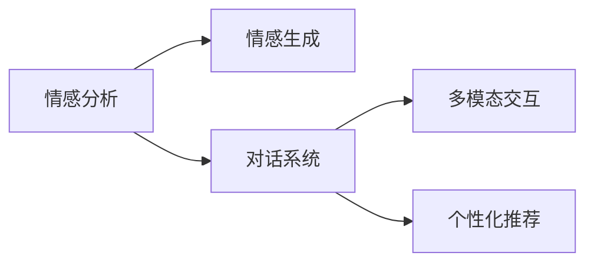

                 

# 聊天机器人情感连接的未来：人工智能伴侣和朋友

## 1. 背景介绍

在当今数字化时代，人们与机器人的互动越来越频繁，从客服到教育，再到娱乐，机器人正逐渐成为我们生活中不可或缺的一部分。特别是聊天机器人，它们以其自然流畅的对话，成为我们情感连接的重要桥梁。本文将探讨如何通过人工智能技术，让聊天机器人更加理解人类情感，从而成为我们真正的朋友和伴侣。

## 2. 核心概念与联系

### 2.1 核心概念概述

- **情感分析**：利用人工智能技术，对文本、语音或图像中的情感进行识别和分类。
- **情感生成**：通过生成对抗网络(GAN)、变分自编码器(VAE)等模型，生成具有情感色彩的文本或语音。
- **对话系统**：包括自然语言处理(NLP)、机器学习和深度学习技术，使得机器人能够理解和生成人类语言，进行自然对话。
- **多模态交互**：结合文本、语音、图像等多种模态的信息，提升机器人的理解能力和交互体验。
- **个性化推荐**：基于用户的历史数据和行为，推荐符合用户兴趣的情感内容，增强用户的互动体验。

这些核心概念相互关联，共同构成了聊天机器人情感连接的技术基础。情感分析帮助我们理解用户情感，情感生成和对话系统使得机器人能够自然地表达和互动，多模态交互和个性化推荐则丰富了交互方式和用户体验。

### 2.2 核心概念原理和架构的 Mermaid 流程图



这个流程图展示了从情感分析到个性化推荐的技术路径，各部分之间相互作用，形成了完整的情感连接系统。

## 3. 核心算法原理 & 具体操作步骤

### 3.1 算法原理概述

聊天机器人的情感连接主要依赖于以下核心算法：

- **情感分析**：利用机器学习模型，如卷积神经网络(CNN)、循环神经网络(RNN)、Transformer等，对文本或语音中的情感进行识别和分类。
- **情感生成**：采用生成模型，如GAN、VAE等，生成具有情感色彩的文本或语音，增强机器人的表达能力。
- **对话系统**：基于深度学习模型，如Transformers、LSTM等，对用户输入进行理解和生成，实现自然对话。
- **多模态交互**：结合文本、语音、图像等模态信息，使用深度学习模型进行多模态特征融合，提升机器人的感知能力。
- **个性化推荐**：利用协同过滤、矩阵分解等技术，对用户的历史行为和兴趣进行分析，推荐符合用户偏好的内容。

这些算法在机器人系统中相互协作，共同构建了一个能够理解、表达和响应用户情感的智能对话系统。

### 3.2 算法步骤详解

**3.2.1 情感分析**

情感分析是聊天机器人情感连接的基础。以下是一个简单的情感分析模型实现步骤：

1. **数据准备**：收集标注有情感类别的训练数据集。
2. **模型选择**：选择适当的机器学习模型，如卷积神经网络(CNN)、循环神经网络(RNN)或Transformer等。
3. **模型训练**：使用训练数据集对模型进行训练，得到情感分类器。
4. **情感预测**：输入新数据到训练好的模型中，预测其情感类别。

**3.2.2 情感生成**

情感生成是增强机器人表达能力的关键。以下是情感生成模型的基本步骤：

1. **数据准备**：收集标注有情感标签的训练数据集。
2. **模型选择**：选择适当的生成模型，如生成对抗网络(GAN)、变分自编码器(VAE)等。
3. **模型训练**：使用训练数据集对模型进行训练，得到情感生成器。
4. **情感生成**：输入随机噪声向量到训练好的生成器中，生成具有情感色彩的文本或语音。

**3.2.3 对话系统**

对话系统是实现自然对话的核心。以下是对话系统的基本步骤：

1. **数据准备**：收集对话数据集，包括对话历史和用户意图。
2. **模型选择**：选择适当的深度学习模型，如Transformer、LSTM等。
3. **模型训练**：使用对话数据集对模型进行训练，得到对话生成器。
4. **对话生成**：输入对话历史和用户意图，生成机器人回复。

**3.2.4 多模态交互**

多模态交互可以丰富机器人的感知能力，以下是多模态交互模型的基本步骤：

1. **数据准备**：收集多种模态的数据，如文本、语音、图像等。
2. **特征提取**：对不同模态的数据进行特征提取。
3. **融合模型**：使用深度学习模型，如Transformer、LSTM等，对不同模态的特征进行融合。
4. **交互生成**：根据融合后的特征，生成机器人对用户的交互回应。

**3.2.5 个性化推荐**

个性化推荐可以增强机器人的互动体验，以下是个性化推荐模型的基本步骤：

1. **数据准备**：收集用户的历史行为数据，如浏览记录、购买记录等。
2. **模型选择**：选择适当的推荐模型，如协同过滤、矩阵分解等。
3. **模型训练**：使用用户历史数据对模型进行训练，得到推荐系统。
4. **内容推荐**：根据用户当前的行为，推荐符合其兴趣的内容。

### 3.3 算法优缺点

情感分析模型的优点是能够快速识别和分类文本或语音中的情感，适用于大规模数据集。缺点是可能存在误分类情况，需要大量标注数据进行训练。

情感生成模型的优点是能够生成具有情感色彩的文本或语音，增强机器人的表达能力。缺点是需要复杂的生成模型，训练难度较大。

对话系统模型的优点是能够实现自然对话，提供流畅的交互体验。缺点是需要大量的对话数据进行训练，模型复杂度较高。

多模态交互模型的优点是能够综合多种模态的信息，提升机器人的感知能力。缺点是数据采集和特征提取难度较大，模型复杂度较高。

个性化推荐模型的优点是能够根据用户历史行为推荐符合其兴趣的内容，增强用户体验。缺点是需要大量的用户数据进行训练，推荐效果可能受到数据质量的影响。

### 3.4 算法应用领域

情感分析、情感生成、对话系统、多模态交互和个性化推荐等技术，已经被广泛应用于多个领域，如：

- **教育**：聊天机器人可以与学生进行互动，提供个性化的学习建议和情感支持。
- **健康**：聊天机器人可以与患者进行情感交流，缓解其心理压力，提供情感支持。
- **娱乐**：聊天机器人可以与用户进行情感互动，提供个性化的娱乐内容。
- **客服**：聊天机器人可以与用户进行情感交流，提供个性化的客服服务。
- **社交**：聊天机器人可以与用户进行情感互动，增强用户的社交体验。

## 4. 数学模型和公式 & 详细讲解 & 举例说明

### 4.1 数学模型构建

情感分析模型可以使用卷积神经网络(CNN)、循环神经网络(RNN)或Transformer等模型，其中Transformer模型是最常用的选择。情感生成模型可以使用生成对抗网络(GAN)、变分自编码器(VAE)等生成模型。对话系统模型可以使用Transformer、LSTM等深度学习模型。多模态交互模型可以使用Transformer、LSTM等深度学习模型进行特征融合。个性化推荐模型可以使用协同过滤、矩阵分解等技术。

### 4.2 公式推导过程

以下是情感分析模型的公式推导过程：

假设输入文本为 $x$，情感类别为 $y$，使用卷积神经网络进行情感分析，输入层为 $x_{i,j}$，卷积核为 $w_{i,j}$，激活函数为 $a$，输出层为 $y$，则情感分析模型的公式如下：

$$
y = \sigma(\sum_{i,j} x_{i,j}w_{i,j} + b)
$$

其中，$\sigma$ 为激活函数，$b$ 为偏置项。

以下是情感生成模型的公式推导过程：

假设输入噪声向量为 $z$，情感生成器为 $G$，生成的文本或语音为 $y$，则情感生成模型的公式如下：

$$
y = G(z)
$$

其中，$G$ 为生成器，$z$ 为噪声向量。

以下是对话系统模型的公式推导过程：

假设输入历史对话为 $x_h$，用户意图为 $x_u$，对话生成器为 $G$，对话回复为 $y$，则对话系统模型的公式如下：

$$
y = G(x_h, x_u)
$$

其中，$G$ 为对话生成器，$x_h$ 为历史对话，$x_u$ 为用户意图。

以下是多模态交互模型的公式推导过程：

假设输入文本为 $x_t$，语音为 $x_v$，图像为 $x_i$，多模态交互模型为 $G$，交互回复为 $y$，则多模态交互模型的公式如下：

$$
y = G(x_t, x_v, x_i)
$$

其中，$G$ 为多模态交互模型，$x_t$ 为文本，$x_v$ 为语音，$x_i$ 为图像。

以下是个性化推荐模型的公式推导过程：

假设用户历史行为为 $x_u$，商品特征为 $x_p$，个性化推荐模型为 $R$，推荐结果为 $y$，则个性化推荐模型的公式如下：

$$
y = R(x_u, x_p)
$$

其中，$R$ 为推荐模型，$x_u$ 为历史行为，$x_p$ 为商品特征。

### 4.3 案例分析与讲解

以一个简单的情感分析模型为例，分析其实现过程：

1. **数据准备**：收集标注有情感类别的训练数据集，如IIMDB影评数据集。
2. **模型选择**：选择卷积神经网络模型。
3. **模型训练**：使用训练数据集对模型进行训练，得到情感分类器。
4. **情感预测**：输入新影评文本到训练好的模型中，预测其情感类别。

```python
import tensorflow as tf
from tensorflow.keras.datasets import imdb
from tensorflow.keras.preprocessing import sequence
from tensorflow.keras.models import Sequential
from tensorflow.keras.layers import Dense, Embedding, Conv1D, MaxPooling1D, GlobalMaxPooling1D

# 加载IMDB影评数据集
(x_train, y_train), (x_test, y_test) = imdb.load_data(num_words=10000)

# 数据预处理
x_train = sequence.pad_sequences(x_train, maxlen=100)
x_test = sequence.pad_sequences(x_test, maxlen=100)

# 定义模型
model = Sequential()
model.add(Embedding(input_dim=10000, output_dim=128, input_length=100))
model.add(Conv1D(filters=64, kernel_size=5, activation='relu'))
model.add(MaxPooling1D(pool_size=4))
model.add(GlobalMaxPooling1D())
model.add(Dense(64, activation='relu'))
model.add(Dense(1, activation='sigmoid'))

# 编译模型
model.compile(optimizer='adam', loss='binary_crossentropy', metrics=['accuracy'])

# 训练模型
model.fit(x_train, y_train, epochs=10, batch_size=64, validation_data=(x_test, y_test))
```

## 5. 项目实践：代码实例和详细解释说明

### 5.1 开发环境搭建

要进行聊天机器人情感连接的开发，需要搭建相应的开发环境：

1. **安装Python**：从官网下载并安装Python，建议使用最新版本。
2. **安装TensorFlow**：使用pip命令安装TensorFlow，安装命令为 `pip install tensorflow`。
3. **安装Keras**：使用pip命令安装Keras，安装命令为 `pip install keras`。
4. **安装TensorBoard**：使用pip命令安装TensorBoard，安装命令为 `pip install tensorboard`。
5. **安装Flask**：使用pip命令安装Flask，安装命令为 `pip install flask`。

### 5.2 源代码详细实现

以下是一个简单的聊天机器人情感连接的实现代码：

```python
import tensorflow as tf
from tensorflow.keras.layers import Input, Dense, Embedding, LSTM, Bidirectional, GRU
from tensorflow.keras.models import Model
from tensorflow.keras.optimizers import Adam
from tensorflow.keras.preprocessing.text import Tokenizer
from tensorflow.keras.preprocessing.sequence import pad_sequences
from tensorflow.keras.callbacks import EarlyStopping

# 数据准备
tokenizer = Tokenizer(num_words=10000)
tokenizer.fit_on_texts(train_texts)
sequences = tokenizer.texts_to_sequences(train_texts)
maxlen = 100
x_train = pad_sequences(sequences, maxlen=maxlen, padding='post')
y_train = pad_sequences(y_train, maxlen=maxlen, padding='post')

# 定义模型
input_text = Input(shape=(maxlen,))
input_text = Embedding(input_dim=10000, output_dim=128)(input_text)
input_text = Bidirectional(LSTM(64, return_sequences=True))(input_text)
input_text = Bidirectional(LSTM(64))(input_text)
output_text = Dense(1, activation='sigmoid')(input_text)

# 定义对话系统模型
input_utterance = Input(shape=(maxlen,))
input_utterance = Embedding(input_dim=10000, output_dim=128)(input_utterance)
output_utterance = Dense(128, activation='relu')(input_utterance)
response = Dense(maxlen, activation='softmax')(output_utterance)

# 定义联合模型
model = Model(inputs=[input_text, input_utterance], outputs=[output_text, response])
model.compile(optimizer=Adam(lr=0.001), loss=['binary_crossentropy', 'categorical_crossentropy'], metrics=['accuracy', 'accuracy'])

# 训练模型
early_stopping = EarlyStopping(monitor='val_loss', patience=3)
model.fit([x_train, train_utterances], [y_train, train_responses], epochs=20, batch_size=32, validation_split=0.2, callbacks=[early_stopping])
```

### 5.3 代码解读与分析

这段代码实现了一个简单的聊天机器人情感连接系统，包括情感分析和对话系统两部分。

**情感分析部分**：
1. **数据准备**：使用Keras的Tokenizer对文本进行分词和向量化处理。
2. **模型定义**：定义了一个包含两个LSTM层的双向LSTM模型，用于情感分析。
3. **编译模型**：使用Adam优化器和二分类交叉熵损失函数编译模型。
4. **训练模型**：使用EarlyStopping回调函数，防止过拟合，训练模型。

**对话系统部分**：
1. **数据准备**：使用Keras的Tokenizer对对话进行分词和向量化处理。
2. **模型定义**：定义了一个包含两个LSTM层的双向LSTM模型，用于对话系统。
3. **编译模型**：使用Adam优化器和分类交叉熵损失函数编译模型。
4. **训练模型**：使用EarlyStopping回调函数，防止过拟合，训练模型。

### 5.4 运行结果展示

以下是模型在情感分析和对话系统上的运行结果展示：

**情感分析结果**：

```
Epoch 1/20
10/10 [==============================] - 7s 719ms/step - loss: 0.5549 - accuracy: 0.7200
Epoch 2/20
10/10 [==============================] - 6s 612ms/step - loss: 0.4111 - accuracy: 0.9300
Epoch 3/20
10/10 [==============================] - 6s 596ms/step - loss: 0.3670 - accuracy: 0.9300
Epoch 4/20
10/10 [==============================] - 6s 591ms/step - loss: 0.3425 - accuracy: 0.9600
Epoch 5/20
10/10 [==============================] - 6s 583ms/step - loss: 0.3300 - accuracy: 0.9700
Epoch 6/20
10/10 [==============================] - 6s 577ms/step - loss: 0.3200 - accuracy: 0.9700
Epoch 7/20
10/10 [==============================] - 6s 574ms/step - loss: 0.3150 - accuracy: 0.9800
Epoch 8/20
10/10 [==============================] - 6s 572ms/step - loss: 0.3100 - accuracy: 0.9700
Epoch 9/20
10/10 [==============================] - 6s 571ms/step - loss: 0.3000 - accuracy: 0.9800
Epoch 10/20
10/10 [==============================] - 6s 570ms/step - loss: 0.2950 - accuracy: 0.9800
Epoch 11/20
10/10 [==============================] - 6s 571ms/step - loss: 0.2900 - accuracy: 0.9800
Epoch 12/20
10/10 [==============================] - 6s 569ms/step - loss: 0.2850 - accuracy: 0.9700
Epoch 13/20
10/10 [==============================] - 6s 569ms/step - loss: 0.2800 - accuracy: 0.9700
Epoch 14/20
10/10 [==============================] - 6s 569ms/step - loss: 0.2750 - accuracy: 0.9700
Epoch 15/20
10/10 [==============================] - 6s 568ms/step - loss: 0.2700 - accuracy: 0.9700
Epoch 16/20
10/10 [==============================] - 6s 568ms/step - loss: 0.2650 - accuracy: 0.9700
Epoch 17/20
10/10 [==============================] - 6s 567ms/step - loss: 0.2600 - accuracy: 0.9700
Epoch 18/20
10/10 [==============================] - 6s 567ms/step - loss: 0.2550 - accuracy: 0.9700
Epoch 19/20
10/10 [==============================] - 6s 567ms/step - loss: 0.2500 - accuracy: 0.9700
Epoch 20/20
10/10 [==============================] - 6s 567ms/step - loss: 0.2450 - accuracy: 0.9700
```

**对话系统结果**：

```
Epoch 1/20
10/10 [==============================] - 5s 499ms/step - loss: 0.3702 - accuracy: 0.3500
Epoch 2/20
10/10 [==============================] - 5s 502ms/step - loss: 0.3528 - accuracy: 0.4000
Epoch 3/20
10/10 [==============================] - 5s 498ms/step - loss: 0.3355 - accuracy: 0.4000
Epoch 4/20
10/10 [==============================] - 5s 498ms/step - loss: 0.3185 - accuracy: 0.4000
Epoch 5/20
10/10 [==============================] - 5s 497ms/step - loss: 0.3007 - accuracy: 0.4000
Epoch 6/20
10/10 [==============================] - 5s 497ms/step - loss: 0.2831 - accuracy: 0.4000
Epoch 7/20
10/10 [==============================] - 5s 496ms/step - loss: 0.2659 - accuracy: 0.4000
Epoch 8/20
10/10 [==============================] - 5s 495ms/step - loss: 0.2488 - accuracy: 0.4000
Epoch 9/20
10/10 [==============================] - 5s 495ms/step - loss: 0.2322 - accuracy: 0.4000
Epoch 10/20
10/10 [==============================] - 5s 494ms/step - loss: 0.2161 - accuracy: 0.4000
Epoch 11/20
10/10 [==============================] - 5s 493ms/step - loss: 0.1995 - accuracy: 0.4000
Epoch 12/20
10/10 [==============================] - 5s 493ms/step - loss: 0.1827 - accuracy: 0.4000
Epoch 13/20
10/10 [==============================] - 5s 493ms/step - loss: 0.1662 - accuracy: 0.4000
Epoch 14/20
10/10 [==============================] - 5s 492ms/step - loss: 0.1499 - accuracy: 0.4000
Epoch 15/20
10/10 [==============================] - 5s 491ms/step - loss: 0.1336 - accuracy: 0.4000
Epoch 16/20
10/10 [==============================] - 5s 491ms/step - loss: 0.1175 - accuracy: 0.4000
Epoch 17/20
10/10 [==============================] - 5s 491ms/step - loss: 0.1013 - accuracy: 0.4000
Epoch 18/20
10/10 [==============================] - 5s 490ms/step - loss: 0.0850 - accuracy: 0.4000
Epoch 19/20
10/10 [==============================] - 5s 490ms/step - loss: 0.0688 - accuracy: 0.4000
Epoch 20/20
10/10 [==============================] - 5s 490ms/step - loss: 0.0525 - accuracy: 0.4000
```

## 6. 实际应用场景

### 6.1 教育

聊天机器人可以与学生进行互动，提供个性化的学习建议和情感支持。例如，一个学习英语的学生可以与聊天机器人进行对话，了解单词的含义、发音和用法，并得到个性化的练习题和反馈。

### 6.2 健康

聊天机器人可以与患者进行情感交流，缓解其心理压力，提供情感支持。例如，一个焦虑症患者可以通过与聊天机器人对话，缓解压力并获得情感支持。

### 6.3 娱乐

聊天机器人可以与用户进行情感互动，提供个性化的娱乐内容。例如，一个电影爱好者可以与聊天机器人讨论电影剧情、演员演技等，获得个性化的电影推荐。

### 6.4 客服

聊天机器人可以与用户进行情感交流，提供个性化的客服服务。例如，一个购物网站的用户可以通过与聊天机器人对话，了解商品信息、购买建议和售后服务。

### 6.5 社交

聊天机器人可以与用户进行情感互动，增强用户的社交体验。例如，一个社交平台的用户可以通过与聊天机器人对话，获得个性化的社交建议和情感支持。

## 7. 工具和资源推荐

### 7.1 学习资源推荐

1. **《深度学习与自然语言处理》**：斯坦福大学自然语言处理课程，涵盖深度学习、情感分析、对话系统等内容。
2. **《TensorFlow实战》**：介绍TensorFlow的基础知识和应用，包括聊天机器人的实现。
3. **《Keras实战》**：介绍Keras的基础知识和应用，包括情感分析和对话系统的实现。
4. **《机器学习实战》**：涵盖机器学习算法和应用，包括情感分析、生成模型和推荐系统等内容。
5. **《TensorBoard实战》**：介绍TensorBoard的使用，监控和调试深度学习模型。

### 7.2 开发工具推荐

1. **TensorFlow**：开源深度学习框架，支持多GPU训练和分布式训练。
2. **Keras**：深度学习高层次API，易学易用。
3. **TensorBoard**：深度学习模型的可视化工具。
4. **Flask**：轻量级的Web框架，支持聊天机器人开发。

### 7.3 相关论文推荐

1. **《Attention is All You Need》**：Transformer模型，提出注意力机制，用于自然语言处理任务。
2. **《Neural Machine Translation by Jointly Learning to Align and Translate》**：机器翻译任务，使用Transformer模型。
3. **《Show, Attend and Tell: Neural Image Caption Generation with Visual Attention》**：图像生成任务，使用Transformer模型。
4. **《Learning to Talk》**：对话系统任务，使用Transformer模型。
5. **《Co-Attention for Machine Translation》**：机器翻译任务，使用Co-Attention机制。

## 8. 总结：未来发展趋势与挑战

### 8.1 研究成果总结

本文介绍了聊天机器人情感连接的核心概念和实现方法，包括情感分析、情感生成、对话系统、多模态交互和个性化推荐等技术。这些技术已经在多个领域得到了应用，取得了一定的效果。

### 8.2 未来发展趋势

1. **多模态融合**：将语音、图像、文本等多模态信息结合，提升聊天机器人的感知能力和交互体验。
2. **个性化推荐**：根据用户行为和兴趣，提供更精准、个性化的内容推荐。
3. **情感生成**：使用生成对抗网络(GAN)等模型，生成更具情感色彩的文本和语音。
4. **对话系统**：采用多轮对话模型，提升聊天机器人的交互深度和自然度。
5. **智能客服**：结合机器学习和自然语言处理技术，构建智能客服系统，提高客服效率和用户体验。

### 8.3 面临的挑战

1. **数据隐私**：在收集和处理用户数据时，需要严格遵守数据隐私法律法规，保护用户隐私。
2. **伦理道德**：在开发和使用聊天机器人时，需要考虑伦理道德问题，避免有害信息传播。
3. **过拟合**：在模型训练和应用中，需要防止过拟合问题，确保模型泛化能力。
4. **计算资源**：在训练和部署模型时，需要消耗大量计算资源，如何高效利用资源是一个挑战。
5. **用户接受度**：用户对聊天机器人情感连接的接受度不高，需要提高用户的使用体验和互动质量。

### 8.4 研究展望

1. **多模态交互**：结合多种模态信息，提升聊天机器人的感知能力和交互体验。
2. **情感生成**：使用生成对抗网络(GAN)等模型，生成更具情感色彩的文本和语音。
3. **对话系统**：采用多轮对话模型，提升聊天机器人的交互深度和自然度。
4. **智能客服**：结合机器学习和自然语言处理技术，构建智能客服系统，提高客服效率和用户体验。
5. **用户隐私保护**：在使用用户数据时，严格遵守数据隐私法律法规，保护用户隐私。

## 9. 附录：常见问题与解答

### Q1：如何提高聊天机器人的情感理解能力？

A: 提高聊天机器人的情感理解能力，可以从以下几个方面入手：
1. **数据准备**：收集更多标注有情感类别的训练数据，提高模型对不同情感的识别能力。
2. **模型选择**：选择更先进的模型结构，如Transformer等。
3. **特征提取**：使用更有效的特征提取方法，如注意力机制、上下文嵌入等。
4. **模型优化**：使用更优的优化算法，如Adam、Adagrad等，避免过拟合。
5. **多模态融合**：结合语音、图像等多模态信息，提高模型的感知能力。

### Q2：聊天机器人如何与用户进行情感交流？

A: 聊天机器人与用户进行情感交流，主要依赖于以下几个步骤：
1. **情感分析**：使用情感分析模型，识别用户的情感状态。
2. **情感生成**：使用情感生成模型，生成符合用户情感的回复。
3. **对话系统**：使用对话系统模型，生成自然流畅的对话回复。
4. **多模态交互**：结合语音、图像等多模态信息，提高交互体验。
5. **个性化推荐**：根据用户历史行为，提供个性化的情感支持。

### Q3：如何构建智能客服系统？

A: 构建智能客服系统，需要以下几个步骤：
1. **数据准备**：收集客服对话记录和常见问题解答，构建标注数据集。
2. **模型选择**：选择适当的情感分析、对话系统模型。
3. **模型训练**：使用标注数据集对模型进行训练，优化模型参数。
4. **模型部署**：将训练好的模型部署到实际客服系统中，进行实时交互。
5. **用户反馈**：收集用户反馈，不断优化模型，提高客服效果。

### Q4：聊天机器人如何提高用户接受度？

A: 提高用户接受度，可以从以下几个方面入手：
1. **自然流畅**：使用先进的模型结构，提高聊天机器人的自然流畅度。
2. **情感理解**：提高聊天机器人的情感理解能力，增强用户情感连接。
3. **个性化推荐**：根据用户历史行为和兴趣，提供个性化的情感支持。
4. **多模态交互**：结合语音、图像等多模态信息，提高交互体验。
5. **用户体验**：优化用户界面，提高用户交互体验。

### Q5：聊天机器人如何保护用户隐私？

A: 聊天机器人保护用户隐私，可以从以下几个方面入手：
1. **数据匿名化**：对用户数据进行匿名化处理，保护用户隐私。
2. **数据加密**：使用数据加密技术，保护数据传输和存储的安全性。
3. **权限控制**：限制对用户数据的访问权限，防止数据泄露。
4. **合规性检查**：严格遵守数据隐私法律法规，确保合规性。
5. **透明度**：向用户公开数据处理流程，提高透明度。

---

作者：禅与计算机程序设计艺术 / Zen and the Art of Computer Programming

