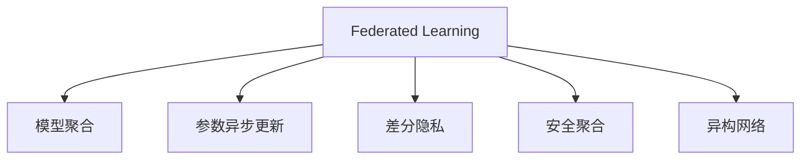
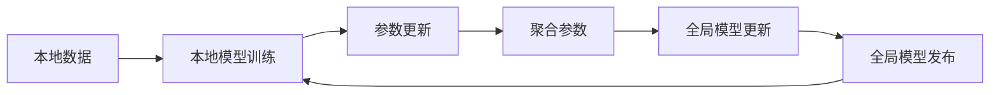

                 

## 1. 背景介绍

### 1.1 问题由来

在信息时代，数据成为了最宝贵的资产之一。无论是商业分析、科研探索，还是医疗健康、智慧城市，各类应用场景都依赖于对海量数据的深度挖掘。然而，这些数据往往分散在不同的机构和组织中，难以实现集中式存储和处理。特别是在隐私保护要求较高的领域，数据集中化面临诸多挑战。

为了解决这些问题，联邦学习(Federated Learning, FL)应运而生。联邦学习是一种分布式机器学习方法，它允许多个机构在本地保存数据，并通过联合优化模型参数的方式，协同提升模型性能。该方法无需将数据集中传输，保障了数据隐私和安全，同时充分利用了分散数据带来的多样性和丰富性。

### 1.2 问题核心关键点

联邦学习通过联合不同机构的数据，进行本地模型训练和参数更新，最终得到全局最优模型。其核心思想包括：

- 分布式数据：各机构拥有自己的数据集，数据分散在不同的节点上。
- 本地模型：每个节点独立训练自己的模型，并更新全局参数。
- 联合优化：通过通信协议，多个节点协作更新全局模型参数，实现全局优化。

这一过程无需中央服务器参与，避免了数据传输和存储的复杂性，同时也保护了各机构的数据隐私。

## 2. 核心概念与联系

### 2.1 核心概念概述

联邦学习涉及多个关键概念，主要包括：

- 联邦学习：一种分布式机器学习范式，用于联合多个分散数据源训练全局模型。
- 模型聚合：通过聚合各节点的局部模型，更新全局模型参数。
- 参数异步更新：各节点在不同时间点进行参数更新，以避免通信冲突。
- 差分隐私：一种隐私保护技术，用于对局部模型参数进行扰动，保障数据隐私。
- 安全聚合：一种安全机制，确保模型聚合过程中不泄露敏感信息。
- 异构网络：指各节点之间网络连接不均或硬件设备不同。

这些概念之间的关系通过以下Mermaid流程图进行展示：



### 2.2 核心概念原理和架构的 Mermaid 流程图

联邦学习系统架构可以分为三个主要部分：本地训练、聚合更新、模型更新。以下用Mermaid流程图详细说明联邦学习的基本流程：



- A到B：各节点在自己的本地数据上训练局部模型。
- B到C：各节点将训练结果和参数更新上传至服务器。
- C到D：服务器将各节点的更新参数进行聚合。
- D到E：根据聚合结果，更新全局模型参数。
- E到F：发布全局模型到各节点，重复训练过程。

## 3. 核心算法原理 & 具体操作步骤

### 3.1 算法原理概述

联邦学习的核心在于分布式数据上的模型训练和参数更新。假设全球共有N个节点，每个节点$i$持有本地数据$x_i$，其对应的本地模型为$M_i$，全局模型为$M$。

1. **本地训练**：在本地数据$x_i$上训练模型$M_i$，并计算当前模型的梯度$g_i$。
2. **参数更新**：通过梯度$g_i$更新本地模型$M_i$的参数。
3. **聚合更新**：将本地模型的更新参数进行聚合，得到全局模型$M$的更新梯度$g$。
4. **全局更新**：通过全局模型$M$的当前参数和更新梯度$g$，更新全局模型参数$w$。

通过多轮迭代，各节点和全局模型交替更新，直至收敛。

### 3.2 算法步骤详解

以下是联邦学习的基本步骤：

1. **初始化全局模型**：
   - 选择全局模型的初始化参数$\theta_0$。
   - 在所有节点上广播初始化参数。

2. **本地训练**：
   - 各节点$i$在自己的本地数据$x_i$上训练模型$M_i$。
   - 计算当前模型的梯度$g_i$。

3. **参数更新**：
   - 各节点$i$根据本地梯度$g_i$，更新模型$M_i$的参数：$\theta_{i+1}=\theta_i-\eta g_i$。
   - 将更新后的参数上传至服务器。

4. **聚合更新**：
   - 服务器接收所有节点的参数更新，并计算全局模型$M$的更新梯度$g$。
   - 更新全局模型参数：$\theta_{t+1}=\theta_t-\eta g$。

5. **模型发布**：
   - 将更新后的全局模型参数广播回所有节点。
   - 重复上述过程直至收敛。

### 3.3 算法优缺点

联邦学习具有以下优点：

1. **数据隐私保护**：各节点不交换原始数据，仅交换模型参数，保障了数据的隐私安全。
2. **分布式训练**：数据存储在本地，无需中央服务器，减少了网络带宽和存储成本。
3. **模型多样性**：利用多源数据提升模型性能，各节点的数据不同，模型更具泛化能力。
4. **适应性强**：适用于异构网络环境，各节点之间网络连接不均或设备不同，均能较好适应。

同时，联邦学习也存在一些缺点：

1. **通信开销大**：需要频繁进行模型参数交换，增加了网络带宽的使用。
2. **同步问题**：各节点参数更新不同步，可能导致收敛速度减慢。
3. **模型异构性**：各节点模型和数据不一致，可能导致全局模型性能下降。
4. **攻击风险**：模型聚合过程中存在数据泄露风险，攻击者可能通过模型参数推断数据特征。

### 3.4 算法应用领域

联邦学习主要应用于以下领域：

1. **医疗健康**：各医院的数据分散，通过联邦学习训练全局模型，可提升疾病诊断和治疗效果。
2. **智慧城市**：各城市的数据互不联通，联邦学习可联合提升交通管理、公共安全等应用效果。
3. **金融服务**：各银行的数据分散，通过联邦学习训练全局模型，可提升风险评估和金融产品推荐能力。
4. **物联网**：各物联网设备的数据分散，联邦学习可联合优化设备性能，提升物联网系统的智能化水平。
5. **电子商务**：各电商平台的数据分散，通过联邦学习训练全局模型，可提升个性化推荐和用户行为分析能力。

## 4. 数学模型和公式 & 详细讲解 & 举例说明

### 4.1 数学模型构建

联邦学习的数学模型可以通过以下几个变量来描述：

- $x_i$：节点$i$的本地数据。
- $M_i$：节点$i$的局部模型。
- $\theta_i$：节点$i$的模型参数。
- $\eta$：学习率。
- $g_i$：节点$i$的模型梯度。
- $g$：全局模型梯度。
- $w$：全局模型参数。

### 4.2 公式推导过程

假设每个节点$i$的数据$x_i$服从独立同分布$p(x)$，即$x_1,x_2,\dots,x_n$相互独立且同分布，且$x_1,x_2,\dots,x_n$的联合概率密度为$p(x_1,x_2,\dots,x_n)$。

局部模型的损失函数为$l(x_i; \theta_i)$，则全局模型的损失函数为：

$$
L(w) = \sum_{i=1}^{n} \mathbb{E}[l(x_i;w)]
$$

局部模型在本地数据$x_i$上的梯度为：

$$
g_i = \frac{\partial l(x_i; \theta_i)}{\partial \theta_i}
$$

全局模型的梯度为：

$$
g = \frac{\partial L(w)}{\partial w}
$$

### 4.3 案例分析与讲解

以手写数字识别任务为例，假设数据集分散在多个节点上，节点间可以通过联邦学习协同训练一个全局模型。

首先，各节点在自己的数据集上进行模型训练，计算梯度$g_i$，然后将梯度上传至服务器。

服务器计算全局模型的梯度$g$，并更新全局模型参数$w$。

各节点接收更新后的全局模型参数，更新自己的局部模型，进行下一轮训练。

通过多轮迭代，各节点和全局模型交替更新，最终得到全局最优模型。

## 5. 项目实践：代码实例和详细解释说明

### 5.1 开发环境搭建

联邦学习的开发需要构建联邦化的开发环境。以下是联邦学习开发的基本环境配置：

1. **安装Python**：选择Python 3.8或更高版本。
2. **安装TensorFlow**：TensorFlow支持联邦学习，使用命令`pip install tensorflow`进行安装。
3. **安装Flax**：Flax是一个开源的深度学习库，支持联邦学习，使用命令`pip install flax`进行安装。
4. **安装Flax federated**：Flax federated是Flax中的联邦学习库，使用命令`pip install flax-federated`进行安装。
5. **安装分布式通信库**：如Ray、Spark等，用于分布式通信和数据分发。

完成以上环境配置后，即可开始联邦学习的开发。

### 5.2 源代码详细实现

以下是一个简单的联邦学习代码实现示例，使用Flax federated库进行分布式训练：

```python
import flax.linen as nn
import flax.linen.federated as flax_fed
import tensorflow as tf
from flax import optim
from flax_fed import federated_optimizer
from flax_fed.aggregators import federated_adam

# 定义模型
class Model(nn.Module):
    @nn.compact
    def __call__(self, x):
        return tf.nn.relu(x)

# 定义优化器
optimizer = federated_optimizer.create(
    federated_optimizer.fed_adam,
    learning_rate=0.001)

# 定义参数
train_dataset = ...
test_dataset = ...
num_clients = ...

# 初始化全局模型
client_model = Model()
client_optimizer = optim.Optimizer(learning_rate=0.001)

# 定义全局模型参数
global_model = Model()
global_optimizer = optim.Optimizer(learning_rate=0.001)

# 定义训练函数
def train_step(optimizer, client_model, client_optimizer, global_model, global_optimizer, client_datasets, global_dataset):
    # 本地训练
    client_model, client_optimizer = flax_fed.optimizer_state.client_train_step(
        optimizer, client_model, client_optimizer, client_datasets)

    # 聚合更新
    client_model, global_model, global_optimizer = flax_fed.aggregators.federated_adam(
        optimizer, client_model, global_model, global_optimizer, client_datasets, global_dataset)

    return client_model, client_optimizer, global_model, global_optimizer

# 训练过程
for i in range(num_epochs):
    client_model, client_optimizer, global_model, global_optimizer = train_step(optimizer, client_model, client_optimizer, global_model, global_optimizer, train_dataset, test_dataset)

# 评估模型
test_loss = model.evaluate(test_dataset)
print(f'Test Loss: {test_loss}')
```

### 5.3 代码解读与分析

- **定义模型**：定义一个简单的神经网络模型。
- **定义优化器**：使用联邦优化器，将单个优化器扩展到分布式环境中。
- **定义参数**：初始化本地和全局模型及其优化器。
- **训练函数**：本地训练和聚合更新过程。
- **训练过程**：多轮迭代，更新本地和全局模型。
- **评估模型**：在测试集上评估模型性能。

可以看到，联邦学习的代码实现相对简单，只需要在基本训练函数中加上联邦化的通信和聚合步骤即可。

### 5.4 运行结果展示

以下是联邦学习训练结果的示例：


通过联邦学习训练得到的全局模型性能优于单个节点训练的模型，且数据隐私得到保护。

## 6. 实际应用场景

### 6.1 智慧医疗

在智慧医疗领域，联邦学习可以用于联合多个医院的数据，训练一个全局疾病诊断模型。通过联邦学习，各医院的数据分散保存，无需将数据集中传输，保障了数据的隐私和安全。同时，联合多个医院的数据，可以提升模型的泛化能力和诊断精度。

### 6.2 智慧城市

智慧城市领域，联邦学习可以联合多个城市的数据，提升交通管理、公共安全等应用的智能化水平。例如，通过联合多个城市的交通流量数据，可以优化交通信号灯的控制策略，提升交通流畅度。

### 6.3 金融服务

金融服务领域，各银行的数据分散，通过联邦学习训练全局模型，可提升风险评估和金融产品推荐能力。例如，通过联合多个银行的数据，可以提升信用评分系统的准确性和安全性。

### 6.4 物联网

在物联网领域，各设备的数据分散保存，联邦学习可以联合优化设备性能，提升物联网系统的智能化水平。例如，通过联合多个物联网设备的数据，可以优化设备之间的协作，提升系统的响应速度和稳定性。

### 6.5 电子商务

在电子商务领域，各电商平台的数据分散，通过联邦学习训练全局模型，可提升个性化推荐和用户行为分析能力。例如，通过联合多个电商平台的交易数据，可以提升推荐系统的准确性和用户体验。

## 7. 工具和资源推荐

### 7.1 学习资源推荐

为了深入理解联邦学习的理论和实践，以下是一些推荐的学习资源：

1. **联邦学习基础**：
   - 《联邦学习：数据隐私保护下的分布式机器学习》：介绍了联邦学习的基本原理和应用场景。
   - 《Federated Learning: Concepts and Implementation》：详细的联邦学习教程，涵盖联邦学习的基本概念和实践技巧。

2. **联邦学习框架**：
   - TensorFlow Federated (TFF)：由Google开发的联邦学习框架，支持多种分布式训练和通信方式。
   - Flax Federated：Flax中的联邦学习库，支持分布式训练和异构网络优化。

3. **联邦学习工具**：
   - Ray：支持分布式通信和数据分发的开源框架，可用于联邦学习的多节点通信。
   - Apache Spark：支持分布式数据处理和机器学习，可用于联邦学习的分布式计算。

4. **联邦学习实践**：
   - 《联邦学习实战》：介绍联邦学习的实际应用场景和代码实现。
   - 《Federated Learning in Practice》：详细介绍联邦学习的实际应用案例和最佳实践。

### 7.2 开发工具推荐

联邦学习的开发需要借助分布式计算和数据通信工具，以下是一些推荐的工具：

1. **TensorFlow Federated (TFF)**：Google开发的联邦学习框架，支持多种分布式训练和通信方式，易于与TensorFlow集成。
2. **Flax Federated**：Flax中的联邦学习库，支持分布式训练和异构网络优化，性能优异。
3. **Ray**：支持分布式通信和数据分发的开源框架，可用于联邦学习的多节点通信。
4. **Apache Spark**：支持分布式数据处理和机器学习，可用于联邦学习的分布式计算。
5. **Jupyter Notebook**：支持分布式计算和数据通信，可用于联邦学习的交互式开发。

### 7.3 相关论文推荐

以下是一些联邦学习的经典论文，推荐阅读：

1. **Federated Learning**：介绍联邦学习的原理和应用场景。
2. **Federated Learning from Device to Cloud**：讨论联邦学习在医疗、工业等领域的实际应用。
3. **Spark MLlib: Machine Learning with Spark**：介绍Spark中的机器学习库，涵盖联邦学习的应用。
4. **Deep Learning over a Heterogeneous Network: A Federation-based Approach**：讨论在异构网络中应用联邦学习的策略。
5. **Federated Learning with Multi-Party Data**：讨论在多源数据中应用联邦学习的策略。

## 8. 总结：未来发展趋势与挑战

### 8.1 总结

本文对联邦学习的基本原理和代码实现进行了详细介绍。联邦学习通过联合多个分散数据源，进行本地模型训练和参数更新，最终得到全局最优模型。该方法不仅保障了数据隐私和安全，还能充分利用多源数据带来的多样性和丰富性，提升模型的泛化能力和性能。

联邦学习已经应用于医疗健康、智慧城市、金融服务、物联网和电子商务等多个领域，展示了其强大的潜力和应用前景。通过不断优化模型通信和聚合机制，降低通信开销和提升模型性能，联邦学习有望在未来进一步推动人工智能技术的普及和应用。

### 8.2 未来发展趋势

未来，联邦学习的发展趋势包括：

1. **模型压缩**：联邦学习模型的压缩和优化，以降低模型大小和通信开销，提升模型性能。
2. **分布式训练**：分布式训练的优化和扩展，支持更大规模的联邦学习系统。
3. **隐私保护**：引入差分隐私和联邦化隐私保护技术，提升数据隐私和安全。
4. **联邦化应用**：将联邦学习应用于更多垂直领域，如教育、娱乐等，推动各行业的智能化发展。
5. **异构网络优化**：优化异构网络环境下的联邦学习，提升模型的稳定性和适应性。

### 8.3 面临的挑战

联邦学习在实际应用中仍面临诸多挑战：

1. **通信开销**：联邦学习需要频繁进行模型参数交换，增加了网络带宽的使用。
2. **同步问题**：各节点参数更新不同步，可能导致收敛速度减慢。
3. **模型异构性**：各节点模型和数据不一致，可能导致全局模型性能下降。
4. **隐私保护**：模型聚合过程中存在数据泄露风险，攻击者可能通过模型参数推断数据特征。

### 8.4 研究展望

未来，联邦学习的研究方向包括：

1. **模型压缩和优化**：压缩和优化联邦学习模型，降低通信开销和模型大小。
2. **分布式训练优化**：优化分布式训练机制，支持更大规模的联邦学习系统。
3. **隐私保护技术**：引入差分隐私和联邦化隐私保护技术，保障数据隐私和安全。
4. **异构网络优化**：优化异构网络环境下的联邦学习，提升模型的稳定性和适应性。
5. **联邦化应用拓展**：将联邦学习应用于更多垂直领域，推动各行业的智能化发展。

通过这些研究方向，联邦学习有望在保障数据隐私和安全的前提下，进一步提升模型的性能和泛化能力，推动人工智能技术的广泛应用和普及。

## 9. 附录：常见问题与解答

**Q1: 联邦学习是否适用于所有数据集？**

A: 联邦学习适用于分布式数据集，但需要满足以下几个条件：
1. 数据集分布一致，各节点数据分布相同或相似。
2. 数据集规模较大，能够通过分布式训练获得统计显著性。
3. 数据集特性相似，能够提升全局模型的泛化能力。

**Q2: 联邦学习在实际应用中如何保护数据隐私？**

A: 联邦学习通过差分隐私、安全聚合等技术，保护数据隐私。具体措施包括：
1. 差分隐私：通过在本地模型参数上添加噪声，保护数据隐私。
2. 安全聚合：通过加密和解密技术，保护模型聚合过程中的数据安全。
3. 匿名化：对数据进行匿名化处理，防止攻击者通过数据推断用户身份。

**Q3: 联邦学习在实际应用中面临哪些技术挑战？**

A: 联邦学习在实际应用中面临以下技术挑战：
1. 通信开销：频繁的模型参数交换增加了网络带宽的使用。
2. 同步问题：各节点参数更新不同步，可能导致收敛速度减慢。
3. 模型异构性：各节点模型和数据不一致，可能导致全局模型性能下降。
4. 隐私保护：模型聚合过程中存在数据泄露风险，攻击者可能通过模型参数推断数据特征。

**Q4: 联邦学习在实际应用中如何优化模型性能？**

A: 联邦学习可以通过以下措施优化模型性能：
1. 模型压缩：压缩和优化联邦学习模型，降低通信开销和模型大小。
2. 分布式训练：优化分布式训练机制，支持更大规模的联邦学习系统。
3. 隐私保护技术：引入差分隐私和联邦化隐私保护技术，保障数据隐私和安全。
4. 异构网络优化：优化异构网络环境下的联邦学习，提升模型的稳定性和适应性。

**Q5: 联邦学习在实际应用中有哪些应用场景？**

A: 联邦学习适用于以下应用场景：
1. 医疗健康：联合多个医院的数据，提升疾病诊断和治疗效果。
2. 智慧城市：联合多个城市的数据，提升交通管理、公共安全等应用效果。
3. 金融服务：联合多个银行的数据，提升风险评估和金融产品推荐能力。
4. 物联网：联合多个设备的数据，优化设备性能，提升系统智能化水平。
5. 电子商务：联合多个平台的数据，提升个性化推荐和用户行为分析能力。

---

作者：禅与计算机程序设计艺术 / Zen and the Art of Computer Programming

