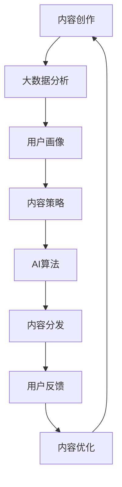

                 

# 自动化创业中的内容营销策略

## 1. 背景介绍

在数字化转型的浪潮中，创业公司面临的是前所未有的机遇与挑战。一方面，技术的进步为创新提供了强大的工具，使得业务模式与产品形态日新月异；另一方面，市场竞争的加剧也要求创业公司不断提升自身的营销能力，以实现品牌与产品的价值最大化。在这样的背景下，内容营销成为了创业公司不可或缺的重要战略之一。

内容营销指的是通过创造和分发有价值、相关且一致的内容，以吸引和留住明确定义的受众，并最终驱动受众采取某种商业行动的营销策略。这种策略不仅仅是简单地发布内容，而是通过内容策略的制定与执行，构建品牌形象、提升用户参与度，最终实现商业目标。

然而，随着市场环境的快速变化，传统的粗放型内容营销策略已经无法适应自动化创业的需求。尤其是在自动化技术、大数据分析、AI算法等技术手段的加持下，内容营销策略必须进行全面升级，才能满足创业公司快速成长、快速迭代的需要。本文将重点探讨自动化创业中内容营销的策略，力求通过系统化、数据驱动的方式，使内容营销更加精准、高效、智能。

## 2. 核心概念与联系

### 2.1 核心概念概述

- **内容营销（Content Marketing）**：通过创造和分发有价值、相关且一致的内容，吸引和留住目标受众，并最终驱动受众采取某种商业行动。
- **自动化创业（Automation Startups）**：利用自动化技术提升业务流程的效率，减少人力成本，加速产品迭代与市场推广。
- **AI算法（AI Algorithms）**：通过机器学习、深度学习等算法，自动化处理大规模数据，提取有效信息，预测用户行为，提升决策效率。
- **大数据分析（Big Data Analytics）**：通过对海量数据进行分析，挖掘数据背后的规律与趋势，为内容创作与策略制定提供依据。
- **多渠道分发（Multi-Channel Distribution）**：通过不同的传播渠道，如社交媒体、博客、电子邮件等，将内容触达目标受众。
- **用户参与度（User Engagement）**：衡量内容对用户行为的影响，包括点击率、停留时间、转化率等指标。

这些核心概念相互联系，共同构成了自动化创业中内容营销的框架。通过合理应用这些技术手段，创业公司可以更加精准地定位目标受众，优化内容策略，提升营销效果。

### 2.2 核心概念原理和架构的 Mermaid 流程图



通过这个流程图，我们可以清晰地看到内容创作、大数据分析、内容策略、AI算法、内容分发和用户反馈之间的关系。内容创作基于用户画像和内容策略，AI算法用于分析用户行为和预测趋势，大数据分析则提供全面的数据支持，而内容分发则是将内容触达目标受众的最后一环。用户反馈则是内容优化的重要依据，进一步提升内容质量与营销效果。

## 3. 核心算法原理 & 具体操作步骤

### 3.1 算法原理概述

自动化创业中的内容营销策略，主要依赖于以下核心算法：

- **用户画像（User Persona）**：通过对用户行为数据的分析，构建用户的特征画像，以便更精准地制定内容策略。
- **情感分析（Sentiment Analysis）**：通过分析用户对内容的情感反馈，了解用户的情绪与偏好，优化内容创作。
- **趋势预测（Trend Prediction）**：利用时间序列分析、文本挖掘等技术，预测行业趋势和用户需求，指导内容创作与发布。
- **内容推荐（Content Recommendation）**：通过协同过滤、矩阵分解等算法，推荐用户可能感兴趣的内容，提升用户参与度。
- **关键词优化（Keyword Optimization）**：通过SEO技术，优化内容中的关键词，提升搜索引擎的排名和内容的曝光率。

这些算法共同作用，构建起一个动态、智能、高效的内容营销体系，为自动化创业提供强有力的支持。

### 3.2 算法步骤详解

**Step 1: 数据收集与预处理**

- **用户数据收集**：通过网站分析工具（如Google Analytics）、社交媒体分析工具（如Facebook Insights）、CRM系统等，收集用户行为数据、社交媒体互动数据、交易数据等。
- **数据清洗与标准化**：对收集到的数据进行去重、过滤、清洗，标准化数据格式，确保数据质量。

**Step 2: 用户画像构建**

- **数据整合与融合**：将来自不同来源的数据整合在一起，形成一个综合的用户画像，包括基本信息、行为数据、社交网络信息等。
- **特征提取与建模**：使用机器学习算法（如K-means聚类、PCA降维等），从整合后的数据中提取用户特征，构建用户画像。

**Step 3: 内容创作与优化**

- **内容策略制定**：根据用户画像和市场趋势，制定内容策略，包括内容主题、发布频率、内容形式等。
- **内容创作与发布**：基于内容策略，进行内容创作与发布，同时利用SEO技术进行关键词优化，提升内容的曝光率。
- **内容效果分析**：通过分析用户互动数据（如点击率、停留时间、转化率等），评估内容的效果，优化内容策略。

**Step 4: 用户反馈与内容优化**

- **用户反馈收集**：通过调查问卷、用户评论、社交媒体互动等渠道，收集用户对内容的反馈。
- **内容优化**：根据用户反馈，对内容进行优化，包括调整内容形式、更新内容主题等。

### 3.3 算法优缺点

**优点：**

- **精准定位**：通过大数据分析与用户画像，能够更精准地定位目标受众，制定更加个性化的内容策略。
- **高效运营**：利用AI算法自动化处理数据，提升内容创作与分发的效率，减少人力成本。
- **数据驱动**：基于用户反馈和数据效果分析，不断优化内容策略，提升营销效果。

**缺点：**

- **数据隐私**：在数据收集与处理过程中，需要遵守数据隐私保护法规，确保用户信息的安全。
- **算法偏见**：算法可能会受到训练数据偏见的影

## 4. 数学模型和公式 & 详细讲解

### 4.1 数学模型构建

内容营销的效果评估，主要依赖于以下数学模型：

- **点击率（Click-Through Rate, CTR）**：衡量用户点击广告或文章的频率，公式为：$CTR = \frac{点击次数}{展示次数}$。
- **转化率（Conversion Rate, CR）**：衡量用户从广告或文章中采取行动（如购买、注册）的比例，公式为：$CR = \frac{转化次数}{点击次数}$。
- **用户参与度（User Engagement）**：衡量用户与内容的互动程度，包括点击率、停留时间、互动次数等。
- **内容推荐算法（Content Recommendation Algorithm）**：协同过滤（Collaborative Filtering）、矩阵分解（Matrix Factorization）等算法，用于推荐用户可能感兴趣的内容。

### 4.2 公式推导过程

以协同过滤算法为例，推导推荐系统的基本公式。协同过滤算法基于用户与物品的评分矩阵，通过计算相似度，推荐用户可能感兴趣的物品。设用户集为$U$，物品集为$I$，用户$u$对物品$i$的评分记为$R_{ui}$，设用户$u'$对物品$i$的评分记为$R_{ui'}$。则用户$u$对物品$i$的评分预测为：

$$
\hat{R}_{ui} = \sum_{u' \in U} \frac{R_{ui'}R_{ui'i}}{\sum_{j \in I} R_{uj'j}} = \frac{\sum_{u' \in U} R_{ui'}R_{ui'i}}{\sqrt{\sum_{j \in I} R_{uj'j}}\sqrt{\sum_{k \in I} R_{u'k'k}}}
$$

其中，$R_{ui'i}$表示用户$u'$对物品$i$的评分，$\sum_{j \in I} R_{uj'j}$和$\sum_{k \in I} R_{u'k'k}$分别表示用户$u'$对物品集合$I$的平均评分。

### 4.3 案例分析与讲解

以一个在线教育平台的内容营销策略为例，分析其应用效果。该平台收集了用户的行为数据，包括浏览课程、购买课程、完成课程等行为。通过数据整合与预处理，构建用户画像，制定内容策略。内容创作包括编写文章、制作视频、发布博客等，同时进行SEO优化，提升内容的曝光率。用户反馈通过课程评价、社交媒体互动等方式收集，用于优化内容。内容推荐系统基于协同过滤算法，推荐用户可能感兴趣的课程，提升用户参与度。

通过上述流程，该平台实现了内容的精准投放，提升了用户参与度与转化率，显著提高了平台的运营效率与市场竞争力。

## 5. 项目实践：代码实例和详细解释说明

### 5.1 开发环境搭建

在自动化创业中，内容营销的开发环境需要具备强大的数据处理能力与高效的算法模型训练能力。以下是推荐的开发环境搭建步骤：

1. **选择开发语言**：Python是数据科学、机器学习领域的主流开发语言，同时拥有丰富的数据处理与机器学习库。
2. **安装必要的库**：安装Pandas、NumPy、Scikit-learn、TensorFlow、PyTorch等必要的库，用于数据处理与模型训练。
3. **配置开发环境**：使用Jupyter Notebook、Google Colab等开发工具，便于数据可视化与模型调试。

### 5.2 源代码详细实现

以下是一个基于协同过滤算法的内容推荐系统的示例代码：

```python
import numpy as np
from sklearn.metrics.pairwise import cosine_similarity

# 构建用户评分矩阵
R = np.array([
    [5, 4, 0, 0],
    [4, 5, 0, 0],
    [0, 0, 3, 1],
    [0, 0, 1, 3]
])

# 计算相似度矩阵
similarity_matrix = cosine_similarity(R)

# 用户评分矩阵
user_score = np.array([5, 4, 3, 2])

# 推荐物品
recommended_items = []
for user in range(len(similarity_matrix)):
    for item in range(len(similarity_matrix[0])):
        if item != user:
            similarity_score = similarity_matrix[user][item]
            recommended_items.append((user, item, similarity_score))

# 排序推荐物品
recommended_items = sorted(recommended_items, key=lambda x: x[2], reverse=True)
```

### 5.3 代码解读与分析

上述代码实现了基于协同过滤算法的内容推荐系统。首先，构建用户评分矩阵$R$，用于表示用户对物品的评分。然后，使用余弦相似度计算用户之间的相似度矩阵。接着，根据用户评分矩阵，计算每个用户对每个物品的评分预测。最后，根据评分预测结果，推荐用户可能感兴趣的物品，并按照相似度排序。

## 6. 实际应用场景

### 6.4 未来应用展望

在未来的自动化创业中，内容营销将更加依赖于数据驱动、算法驱动的决策。以下是一些未来应用展望：

- **AI驱动的个性化内容创作**：利用自然语言生成（NLG）、生成对抗网络（GAN）等技术，实现个性化的内容创作，提升内容的吸引力与参与度。
- **多渠道内容分发与协同优化**：通过多渠道分发策略，提升内容的曝光率与互动率，同时利用算法优化分发策略，提高分发效率。
- **智能内容推荐系统**：结合用户行为数据与社交网络数据，构建智能推荐系统，提升用户参与度与转化率。
- **跨平台内容协作**：利用API接口，实现不同平台之间的内容协作，提升内容的覆盖范围与影响力。

## 7. 工具和资源推荐

### 7.1 学习资源推荐

- **《内容营销实战》**：详细介绍了内容营销的理论与实践，包括内容策略、内容创作、内容分发等。
- **《数据科学导论》**：涵盖了数据处理、数据可视化、机器学习等内容，是学习数据驱动内容营销的基础。
- **《深度学习》**：介绍深度学习的基本原理与算法，是实现内容推荐系统与个性化内容创作的重要基础。

### 7.2 开发工具推荐

- **Jupyter Notebook**：用于数据处理与模型训练，支持丰富的数据可视化与代码执行功能。
- **Google Colab**：提供免费的GPU资源，便于进行高性能的模型训练与实验。
- **PyTorch**：灵活的深度学习框架，支持动态图与静态图计算，便于模型设计与调试。
- **TensorFlow**：谷歌开发的深度学习框架，支持分布式计算与高性能模型训练。

### 7.3 相关论文推荐

- **《用户画像：从数据到行为理解》**：探讨用户画像的构建方法与实际应用。
- **《情感分析：理论与实践》**：介绍情感分析的基本原理与算法，是实现内容优化与用户行为分析的重要基础。
- **《协同过滤算法：理论与实践》**：介绍协同过滤算法的原理与实现方法，是内容推荐系统的重要基础。

## 8. 总结：未来发展趋势与挑战

### 8.1 研究成果总结

本文探讨了自动化创业中内容营销的策略，通过系统化的分析与实践，展示了数据驱动、算法驱动的内容营销体系的构建方法。通过用户画像、情感分析、趋势预测、内容推荐等技术手段，提升了内容创作的精准度与分发效率，增强了用户参与度与转化率。

### 8.2 未来发展趋势

- **数据驱动的内容创作**：利用AI技术进行数据挖掘与分析，实现个性化内容创作。
- **智能化的内容推荐系统**：通过机器学习与深度学习技术，构建智能推荐系统，提升用户参与度与转化率。
- **跨平台内容分发**：利用API接口与数据共享，实现不同平台之间的内容协作与分发优化。

### 8.3 面临的挑战

- **数据隐私保护**：在数据收集与处理过程中，需要遵守数据隐私保护法规，确保用户信息的安全。
- **算法偏见**：算法可能会受到训练数据偏见的影

### 8.4 研究展望

未来，内容营销的研究需要进一步深入，特别是在数据隐私保护、算法公平性等方面。同时，利用更多前沿技术，如自然语言生成、生成对抗网络等，提升内容的个性化与多样性，增强内容营销的效果。

## 9. 附录：常见问题与解答

**Q1：数据隐私保护如何实现？**

A: 数据隐私保护需要遵循相关法律法规，如GDPR、CCPA等。具体措施包括数据匿名化、数据加密、访问控制等。同时，可以采用差分隐私（Differential Privacy）等技术，确保在数据使用过程中不泄露用户隐私。

**Q2：如何避免算法偏见？**

A: 避免算法偏见需要从数据采集、模型训练、结果应用等环节进行全面监控与优化。可以使用公平性评估指标，如平等机会误差（Equal Opportunity Error）等，评估算法的公平性。同时，需要定期审查算法模型，确保模型输出符合公平性要求。

**Q3：数据驱动的内容创作有哪些优势？**

A: 数据驱动的内容创作能够根据用户行为数据与偏好，精准地制定内容策略，提升内容的个性化与吸引力。同时，利用AI技术进行内容优化与自动生成，提升内容创作的效率与质量。

**Q4：如何提升内容推荐系统的准确性？**

A: 提升内容推荐系统的准确性需要从数据质量、模型选择、算法优化等多个环节进行全面提升。可以使用协同过滤、矩阵分解、神经网络等算法，同时引入用户反馈与实时数据，动态调整推荐策略。

**Q5：跨平台内容协作的难点是什么？**

A: 跨平台内容协作的难点在于数据格式与接口标准的不一致，以及不同平台之间的用户行为差异。需要制定统一的数据格式与API接口标准，确保数据的一致性与可互操作性。同时，需要结合不同平台的用户行为数据，制定更加个性化的内容推荐策略。

---

作者：禅与计算机程序设计艺术 / Zen and the Art of Computer Programming

