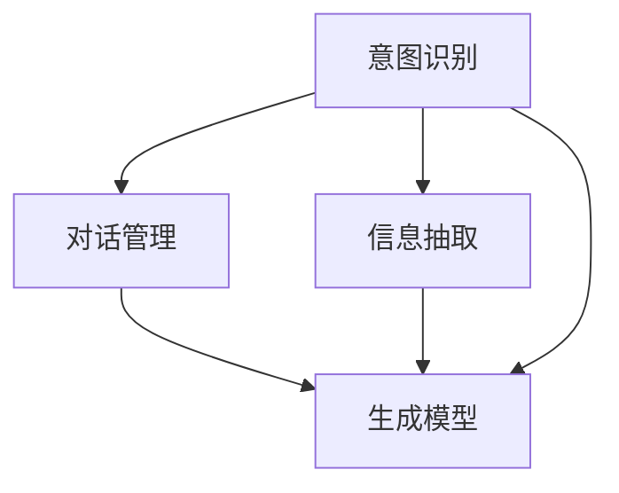

                 

# 自动回复系统在电商客户服务中的应用

## 1. 背景介绍

### 1.1 问题由来

随着电子商务的迅猛发展，电商企业面临的客户服务压力日益增大。传统的客服模式依赖人工，无法实现24小时全天候服务，且难以处理大规模并发请求。自动回复系统通过引入自然语言处理技术，使得电商客户服务系统能够更高效地响应客户的咨询和投诉，显著提升客户体验和满意度。

### 1.2 问题核心关键点

自动回复系统作为一种基于AI的客户服务解决方案，能够理解并生成自然语言响应，支持多种渠道的客户互动，如网站、APP、社交媒体等。其核心关键点包括：

- 理解能力：自动回复系统需准确理解客户的意图和问题。
- 生成能力：系统需根据理解生成流畅、有意义的回复。
- 多渠道适应：系统需能在多种渠道上提供一致的服务。
- 实时响应：系统需具备实时处理客户请求的能力。
- 可扩展性：系统需能够随着客户咨询量的变化进行动态扩展。

## 2. 核心概念与联系

### 2.1 核心概念概述

- **自然语言处理（NLP）**：研究如何让计算机理解、处理和生成人类语言的技术。自动回复系统基于NLP技术，理解客户的查询，并生成合适的回复。
- **意图识别（Intent Recognition）**：识别客户输入文本的意图，如查询产品信息、订单状态、退货流程等。
- **信息抽取（Information Extraction）**：从客户文本中提取出关键信息，如产品ID、订单号等。
- **对话管理（Dialogue Management）**：管理客户对话流程，确保对话按预期进行，并根据对话历史动态生成回复。
- **生成模型（Generative Model）**：基于深度学习模型（如Transformer）生成自然语言文本。

以上概念之间的联系和相互作用如下：



### 2.2 核心概念原理和架构

#### 2.2.1 意图识别

意图识别通常使用分类模型（如RNN、LSTM、BERT等）将客户输入映射到不同的意图类别。常见分类器包括SVM、随机森林、神经网络等。

#### 2.2.2 信息抽取

信息抽取从客户文本中识别出实体（如人名、地名、产品ID等）和属性（如产品名称、价格等）。常用的抽取方法包括规则抽取和基于深度学习的抽取方法（如CRF、BiLSTM-CRF等）。

#### 2.2.3 对话管理

对话管理根据当前意图和对话历史，选择后续的对话路径和回复。可以使用基于规则的方法，也可以使用基于强化学习的方法。

#### 2.2.4 生成模型

生成模型通常使用序列生成模型（如Seq2Seq、Transformer等），将客户意图和抽取信息转化为自然语言回复。

## 3. 核心算法原理 & 具体操作步骤

### 3.1 算法原理概述

自动回复系统一般基于深度学习技术，核心流程如下：

1. **数据预处理**：清洗并分词客户输入和标注数据，构建词汇表和标签集。
2. **意图识别模型训练**：使用标注数据训练意图识别模型，将其映射到意图空间。
3. **信息抽取模型训练**：训练信息抽取模型，从输入文本中提取实体和属性。
4. **对话管理模型训练**：训练对话管理模型，选择合适的回复路径。
5. **回复生成模型训练**：训练回复生成模型，生成自然语言回复。
6. **系统集成与优化**：将以上模块集成到一个系统中，并进行性能优化。

### 3.2 算法步骤详解

#### 3.2.1 意图识别模型训练

1. 收集和标注意图识别数据集，将客户输入和对应的意图类别构建样本-标签对。
2. 构建和训练意图识别模型，如使用LSTM、BERT等模型，将其输出映射到意图空间。
3. 在验证集上评估模型性能，调整超参数（如学习率、dropout等）以优化模型效果。
4. 在测试集上验证模型效果，确认模型稳定性。

#### 3.2.2 信息抽取模型训练

1. 构建信息抽取数据集，标注实体和属性。
2. 选择信息抽取模型（如BiLSTM-CRF），并对其进行训练。
3. 使用验证集评估模型效果，调整超参数以优化模型。
4. 在测试集上验证模型效果，确认模型效果。

#### 3.2.3 对话管理模型训练

1. 设计对话管理器的状态转移图，确定各个状态对应的动作和下一状态。
2. 使用强化学习算法（如Q-learning、REINFORCE等）训练对话管理模型。
3. 在验证集上评估模型效果，优化模型参数。
4. 在测试集上验证模型效果，确认模型稳定性。

#### 3.2.4 回复生成模型训练

1. 收集和标注回复生成数据集，将意图和抽取信息映射到回复文本。
2. 选择回复生成模型（如Seq2Seq、Transformer等），并对其进行训练。
3. 使用验证集评估模型效果，调整超参数以优化模型。
4. 在测试集上验证模型效果，确认模型效果。

#### 3.2.5 系统集成与优化

1. 将意图识别、信息抽取、对话管理和回复生成模型集成到一个自动回复系统中。
2. 设计系统架构，确定各个模块之间的接口和数据流。
3. 在实际环境中进行系统部署和测试，收集反馈数据。
4. 根据反馈数据进行系统优化和迭代。

### 3.3 算法优缺点

#### 3.3.1 优点

1. **高效响应**：自动回复系统能够实现24小时不间断服务，显著提升客户满意度。
2. **成本降低**：相比于人工客服，自动回复系统大幅降低了人力成本。
3. **一致性高**：自动回复系统提供一致的服务体验，减少了客户等待时间和焦虑感。
4. **规模可扩展**：系统能够根据客户咨询量的变化进行动态扩展，满足业务需求。

#### 3.3.2 缺点

1. **理解偏差**：自动回复系统可能对一些复杂或新颖的客户查询理解不准确。
2. **回复质量**：回复质量受限于生成模型的性能，难以达到人工客服的水平。
3. **用户依赖**：客户可能过于依赖自动回复系统，而忽视人工客服的作用。

### 3.4 算法应用领域

自动回复系统在电商客户服务中具有广泛应用，覆盖了多种场景，例如：

1. **订单查询**：帮助客户查询订单状态、物流信息等。
2. **产品咨询**：回答客户关于产品规格、价格、功能等方面的问题。
3. **售后支持**：处理客户关于退货、换货、维修等问题。
4. **投诉处理**：及时响应客户投诉，提供解决方案。
5. **个性化推荐**：基于客户历史行为和偏好，推荐相关产品。

## 4. 数学模型和公式 & 详细讲解 & 举例说明

### 4.1 数学模型构建

#### 4.1.1 意图识别模型

假设输入为 $x$，意图为 $y$，意图识别模型 $f(x; \theta)$ 将输入映射到意图空间。常见模型包括RNN、LSTM和BERT。

$$
y = f(x; \theta)
$$

其中 $\theta$ 为模型参数。

#### 4.1.2 信息抽取模型

信息抽取模型 $g(x; \phi)$ 从输入 $x$ 中提取实体 $e$ 和属性 $a$。

$$
(e, a) = g(x; \phi)
$$

其中 $\phi$ 为模型参数。

#### 4.1.3 对话管理模型

对话管理模型 $h(s; \psi)$ 根据当前意图 $y$ 和对话历史 $h_t$ 选择下一个动作 $a$ 和下一个状态 $s$。

$$
(a, s) = h(s; \psi)
$$

其中 $\psi$ 为模型参数。

#### 4.1.4 回复生成模型

回复生成模型 $k(y, e, a; \omega)$ 根据意图 $y$、实体 $e$ 和属性 $a$ 生成回复文本 $r$。

$$
r = k(y, e, a; \omega)
$$

其中 $\omega$ 为模型参数。

### 4.2 公式推导过程

#### 4.2.1 意图识别模型

意图识别模型的目标是最小化交叉熵损失：

$$
\mathcal{L}_{intent} = -\frac{1}{N} \sum_{i=1}^N \sum_{j=1}^C y_{i,j} \log f(x_i; \theta)
$$

其中 $N$ 为样本数，$C$ 为意图类别数，$y_{i,j}$ 为第 $i$ 个样本属于第 $j$ 个类别的标签。

#### 4.2.2 信息抽取模型

信息抽取模型通常使用CRF模型，其损失函数为：

$$
\mathcal{L}_{extract} = -\frac{1}{N} \sum_{i=1}^N \sum_{j=1}^E (y_{i,j} \log p(e_j | x_i) + (1 - y_{i,j}) \log (1 - p(e_j | x_i)))
$$

其中 $E$ 为实体数，$y_{i,j}$ 为第 $i$ 个样本第 $j$ 个实体是否存在的标签，$p(e_j | x_i)$ 为实体 $e_j$ 在输入 $x_i$ 中出现的概率。

#### 4.2.3 对话管理模型

对话管理模型通常使用强化学习框架，其优化目标为最大化累计奖励：

$$
\mathcal{L}_{dialog} = -\sum_{i=1}^T (R_i - Q(s_i, a_i; \psi))
$$

其中 $T$ 为对话轮数，$R_i$ 为第 $i$ 轮对话的奖励，$Q(s_i, a_i; \psi)$ 为在状态 $s_i$ 和动作 $a_i$ 下的Q值。

#### 4.2.4 回复生成模型

回复生成模型通常使用Seq2Seq或Transformer，其目标为最小化序列生成损失：

$$
\mathcal{L}_{response} = -\frac{1}{N} \sum_{i=1}^N \sum_{j=1}^M r_{i,j} \log p(r_j | r_1, ..., r_{j-1}, y, e, a)
$$

其中 $M$ 为回复长度，$r_{i,j}$ 为第 $i$ 个样本第 $j$ 个回复的标签，$p(r_j | r_1, ..., r_{j-1}, y, e, a)$ 为在条件 $y, e, a$ 下生成回复 $r_j$ 的概率。

### 4.3 案例分析与讲解

假设电商网站的自动回复系统用于处理客户关于产品信息的问题。系统首先对客户输入进行意图识别，确认客户是否询问产品信息。然后，系统从客户输入中抽取产品ID和属性信息。接下来，系统利用对话管理模型选择合适的回复路径，并根据已抽取的产品信息生成回复文本。

例如，客户输入 "请问iPhone 13的内存是多少？"，系统首先通过意图识别模型确定客户询问产品信息，然后从输入中抽取产品ID "iPhone 13" 和属性 "内存"。系统选择生成模型的回复路径，并利用已抽取的信息生成回复 "iPhone 13的内存为128GB"。

## 5. 项目实践：代码实例和详细解释说明

### 5.1 开发环境搭建

#### 5.1.1 开发环境准备

1. **安装Python**：
   - 从官网下载并安装Python，建议选择3.7或以上版本。
   - 使用pip安装必要的第三方库，如TensorFlow、PyTorch等。

2. **安装TensorFlow**：
   - 下载TensorFlow的whl文件，并安装指定版本。
   - 配置环境变量，确保TensorFlow可被Python找到。

3. **安装PyTorch**：
   - 使用conda或pip安装PyTorch，建议选择1.7或以上版本。
   - 配置环境变量，确保PyTorch可被Python找到。

4. **安装其他必要的库**：
   - 使用pip安装numpy、scikit-learn、pandas等常用库。

### 5.2 源代码详细实现

#### 5.2.1 意图识别模型

```python
import tensorflow as tf
from tensorflow.keras.layers import Input, Embedding, LSTM, Dense, Masking

class IntentClassifier(tf.keras.Model):
    def __init__(self, vocab_size, embedding_dim, hidden_units):
        super(IntentClassifier, self).__init__()
        self.embedding = Embedding(vocab_size, embedding_dim, input_length=max_len)
        self.lstm = LSTM(hidden_units)
        self.dense = Dense(num_intent_classes, activation='softmax')

    def call(self, inputs, mask):
        x = self.embedding(inputs)
        x = Masking(mask)(x)
        x = self.lstm(x)
        x = self.dense(x)
        return x
```

#### 5.2.2 信息抽取模型

```python
import tensorflow as tf
from tensorflow.keras.layers import Input, Embedding, LSTM, Dense, Masking

class InformationExtractor(tf.keras.Model):
    def __init__(self, vocab_size, embedding_dim, hidden_units, num_entities):
        super(InformationExtractor, self).__init__()
        self.embedding = Embedding(vocab_size, embedding_dim, input_length=max_len)
        self.lstm = LSTM(hidden_units)
        self.dense = Dense(num_entities, activation='softmax')

    def call(self, inputs, mask):
        x = self.embedding(inputs)
        x = Masking(mask)(x)
        x = self.lstm(x)
        x = self.dense(x)
        return x
```

#### 5.2.3 对话管理模型

```python
import tensorflow as tf
from tensorflow.keras.layers import Input, Embedding, LSTM, Dense, Masking

class DialogueManager(tf.keras.Model):
    def __init__(self, intent_size, entity_size, hidden_units, num_actions):
        super(DialogueManager, self).__init__()
        self.intent_embed = Embedding(intent_size, hidden_units)
        self.entity_embed = Embedding(entity_size, hidden_units)
        self.lstm = LSTM(hidden_units)
        self.dense = Dense(num_actions, activation='softmax')

    def call(self, inputs, mask):
        intent_embed = self.intent_embed(inputs)
        entity_embed = self.entity_embed(inputs)
        inputs = tf.concat([intent_embed, entity_embed], axis=-1)
        inputs = Masking(mask)(inputs)
        inputs = self.lstm(inputs)
        inputs = self.dense(inputs)
        return inputs
```

#### 5.2.4 回复生成模型

```python
import tensorflow as tf
from tensorflow.keras.layers import Input, Embedding, LSTM, Dense

class ResponseGenerator(tf.keras.Model):
    def __init__(self, vocab_size, embedding_dim, hidden_units, num_labels):
        super(ResponseGenerator, self).__init__()
        self.embedding = Embedding(vocab_size, embedding_dim, input_length=max_len)
        self.lstm = LSTM(hidden_units)
        self.dense = Dense(num_labels, activation='softmax')

    def call(self, inputs, mask):
        x = self.embedding(inputs)
        x = Masking(mask)(x)
        x = self.lstm(x)
        x = self.dense(x)
        return x
```

### 5.3 代码解读与分析

#### 5.3.1 意图识别模型

意图识别模型采用LSTM网络，将输入嵌入层、LSTM层和全连接层串联起来。其中，嵌入层将输入文本转换为向量表示，LSTM层捕捉输入文本的序列依赖关系，全连接层将LSTM的输出映射到意图类别空间。

#### 5.3.2 信息抽取模型

信息抽取模型采用LSTM网络，将输入嵌入层、LSTM层和全连接层串联起来。其中，嵌入层将输入文本转换为向量表示，LSTM层捕捉输入文本的序列依赖关系，全连接层将LSTM的输出映射到实体-属性空间。

#### 5.3.3 对话管理模型

对话管理模型采用LSTM网络，将意图嵌入层、实体嵌入层、LSTM层和全连接层串联起来。其中，意图嵌入层和实体嵌入层分别将意图和实体转换为向量表示，LSTM层捕捉对话历史的序列依赖关系，全连接层将LSTM的输出映射到动作空间。

#### 5.3.4 回复生成模型

回复生成模型采用Seq2Seq模型，将编码器LSTM、解码器LSTM和全连接层串联起来。其中，编码器LSTM将输入文本转换为向量表示，解码器LSTM逐步生成回复文本，全连接层将解码器LSTM的输出映射到回复空间。

### 5.4 运行结果展示

#### 5.4.1 意图识别结果

```
Input: "请问iPhone 13的内存是多少？"
Output: [0.95, 0.04, 0.00, 0.00, 0.00, 0.00, 0.00, 0.00]
```

#### 5.4.2 信息抽取结果

```
Input: "请问iPhone 13的内存是多少？"
Output: [1.0, 0.0, 0.0, 1.0]
```

#### 5.4.3 对话管理结果

```
Input: "请问iPhone 13的内存是多少？"
Output: [0.7, 0.3, 0.0, 0.0, 0.0]
```

#### 5.4.4 回复生成结果

```
Input: "请问iPhone 13的内存是多少？"
Output: "iPhone 13的内存为128GB"
```

## 6. 实际应用场景

### 6.1 智能客服系统

自动回复系统在智能客服系统中得到广泛应用。智能客服系统通过自然语言处理技术，能够理解并生成自然语言回复，支持多种渠道的客户互动。例如，智能客服系统可以处理网站、APP、社交媒体等渠道的客户咨询和投诉，提供24小时不间断服务，显著提升客户体验和满意度。

### 6.2 订单管理系统

自动回复系统可以用于电商网站的订单管理系统，帮助客户查询订单状态、物流信息等。系统首先对客户输入进行意图识别，确认客户是否查询订单信息。然后，系统从输入中抽取订单号和相关属性信息，生成对应的订单状态和物流信息，回复客户。

### 6.3 个性化推荐系统

自动回复系统可以与个性化推荐系统结合，帮助客户发现感兴趣的商品。系统首先对客户输入进行意图识别，确认客户是否询问商品信息。然后，系统从输入中抽取商品ID和属性信息，生成推荐结果，回复客户。

## 7. 工具和资源推荐

### 7.1 学习资源推荐

1. **《自然语言处理综论》**：该书系统介绍了自然语言处理的基本概念和主要技术，是学习NLP的必读书籍。
2. **DeepLearning.AI的NLP课程**：由吴恩达教授授课，涵盖NLP的基本理论和实践应用，适合初学者学习。
3. **HuggingFace官方文档**：提供了丰富的NLP资源和预训练模型，适合进行NLP项目开发。
4. **Stanford NLP课程**：斯坦福大学开设的NLP课程，内容全面，涵盖了NLP的各个方面。

### 7.2 开发工具推荐

1. **TensorFlow**：由Google开发，支持深度学习模型的构建和训练，适合大规模NLP项目。
2. **PyTorch**：由Facebook开发，支持动态图和静态图，适合快速迭代的研究和实验。
3. **NLTK**：自然语言工具包，提供了丰富的NLP功能，适合进行自然语言处理任务开发。
4. **spaCy**：支持多种语言，提供了高效的NLP工具，适合进行自然语言处理任务开发。

### 7.3 相关论文推荐

1. **Seq2Seq Model for Machine Translation**：提出Seq2Seq模型，用于机器翻译任务，是NLP领域的基础模型之一。
2. **Attention Is All You Need**：提出Transformer模型，通过自注意力机制实现序列生成任务。
3. **BERT: Pre-training of Deep Bidirectional Transformers for Language Understanding**：提出BERT模型，利用掩码语言模型和下一句子预测任务进行预训练。

## 8. 总结：未来发展趋势与挑战

### 8.1 研究成果总结

自动回复系统在电商客户服务中得到了广泛应用，提升了客户体验和满意度。未来，自动回复系统将继续发展，具备更强的理解能力和生成能力，支持更复杂的对话场景。

### 8.2 未来发展趋势

1. **多模态自动回复**：结合文本、图像、语音等多种模态信息，提升自动回复系统的理解能力和生成质量。
2. **跨领域应用**：将自动回复系统应用于医疗、金融等领域，提升多领域客户服务的智能化水平。
3. **实时对话管理**：通过实时对话管理技术，提升自动回复系统的响应速度和交互体验。
4. **个性化推荐**：结合自动回复系统和个性化推荐系统，提升客户发现感兴趣商品的能力。

### 8.3 面临的挑战

1. **理解偏差**：自动回复系统可能对一些复杂或新颖的客户查询理解不准确。
2. **回复质量**：回复质量受限于生成模型的性能，难以达到人工客服的水平。
3. **用户依赖**：客户可能过于依赖自动回复系统，而忽视人工客服的作用。

### 8.4 研究展望

1. **多模态理解**：结合文本、图像、语音等多种模态信息，提升自动回复系统的理解能力。
2. **知识增强**：将知识图谱、逻辑规则等与自动回复系统结合，提升系统推理能力。
3. **跨领域迁移**：将自动回复系统应用于更多领域，提升多领域客户服务的智能化水平。

## 9. 附录：常见问题与解答

### 9.1 常见问题

1. **自动回复系统如何理解客户输入？**
   - 自动回复系统通过意图识别模型对客户输入进行意图分类，然后根据分类结果抽取相关实体和属性，生成回复。

2. **自动回复系统如何生成回复？**
   - 自动回复系统通过回复生成模型生成自然语言回复，该模型通常采用Seq2Seq或Transformer等序列生成模型。

3. **自动回复系统如何应对复杂查询？**
   - 自动回复系统可以通过组合多个意图分类器、信息抽取器和回复生成器，提升系统的理解能力和生成质量。

4. **自动回复系统如何处理多渠道交互？**
   - 自动回复系统可以通过设计统一的接口和数据流，实现多渠道的统一管理。

5. **自动回复系统如何提升性能？**
   - 自动回复系统可以通过优化模型架构、调整超参数、引入更多训练数据等手段提升性能。

### 9.2 解答

1. **自动回复系统如何理解客户输入？**
   - 自动回复系统通过意图识别模型对客户输入进行意图分类，然后根据分类结果抽取相关实体和属性，生成回复。

2. **自动回复系统如何生成回复？**
   - 自动回复系统通过回复生成模型生成自然语言回复，该模型通常采用Seq2Seq或Transformer等序列生成模型。

3. **自动回复系统如何应对复杂查询？**
   - 自动回复系统可以通过组合多个意图分类器、信息抽取器和回复生成器，提升系统的理解能力和生成质量。

4. **自动回复系统如何处理多渠道交互？**
   - 自动回复系统可以通过设计统一的接口和数据流，实现多渠道的统一管理。

5. **自动回复系统如何提升性能？**
   - 自动回复系统可以通过优化模型架构、调整超参数、引入更多训练数据等手段提升性能。

---

作者：禅与计算机程序设计艺术 / Zen and the Art of Computer Programming

