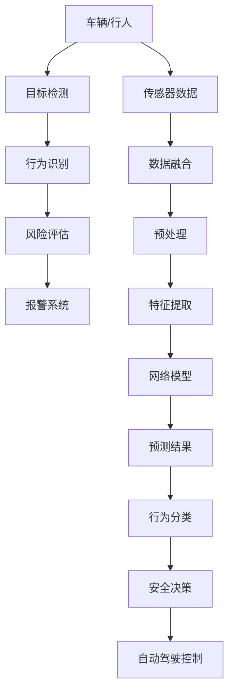

                 

# 自动驾驶中的交通事故自动检测与报警

> 关键词：自动驾驶, 交通事故检测, 目标检测, 行为识别, 深度学习, CNN, 视频分析

## 1. 背景介绍

随着自动驾驶技术的快速发展，自动驾驶车辆的安全性成为了关注的焦点。自动驾驶车辆需要能够实时监控周围环境，及时发现和预警潜在的交通事故风险，保障行人和车辆的安全。为此，自动驾驶系统必须具备高效的交通事故自动检测和报警能力，而基于深度学习的方法，特别是目标检测和行为识别，成为当前自动驾驶安全监控的重要技术手段。

## 2. 核心概念与联系

### 2.1 核心概念概述

为了更好地理解自动驾驶中的交通事故自动检测与报警技术，我们首先介绍几个关键概念：

- **自动驾驶**：指利用计算机视觉、传感器融合、路径规划等技术，使车辆能够自主地在道路环境中导航，避免与周围物体发生碰撞的驾驶方式。

- **目标检测**：指在视频或图像序列中，自动识别出感兴趣的目标（如车辆、行人、交通信号灯等），并标注其位置、大小、类别等信息。

- **行为识别**：指识别出目标的动态行为（如行人的行走、车辆的方向变化等），用于理解目标的行动意图。

- **深度学习**：一种基于神经网络的机器学习方法，通过多层次的非线性映射实现对复杂数据的自动学习与表示。

- **卷积神经网络（CNN）**：深度学习中的一种重要网络结构，特别适用于处理图像和视频数据，能够自动提取特征和模式。

这些核心概念共同构成了自动驾驶安全监控技术的基础，通过目标检测和行为识别，系统可以实时分析车辆和行人的行为，预测潜在的交通事故风险，从而实现自动化的报警和决策。

### 2.2 核心概念原理和架构的 Mermaid 流程图



该流程图展示了自动驾驶中交通事故自动检测与报警的基本架构：传感器获取的环境数据通过预处理和特征提取，进入深度学习模型进行目标检测和行为识别，然后根据识别结果进行风险评估，最后通过报警系统向自动驾驶控制模块发送决策指令，调整车辆的行驶策略，以避免潜在的交通事故。

## 3. 核心算法原理 & 具体操作步骤

### 3.1 算法原理概述

自动驾驶中的交通事故自动检测与报警技术主要基于深度学习的目标检测和行为识别算法，通过分析车辆和行人的动态行为，预测潜在的交通事故风险，并进行实时报警。

自动驾驶车辆通常配备多个摄像头和传感器，实时获取周围环境的数据。这些数据经过预处理和特征提取后，输入到深度学习模型中进行目标检测和行为识别。深度学习模型通过卷积神经网络（CNN）等多层网络结构，自动提取图像中的特征，并在全连接层中进行分类和回归，输出目标的位置、大小、类别等信息，以及行为意图。

目标检测和行为识别完成后，系统会进行风险评估，根据目标的动态行为和距离，判断是否存在潜在的交通事故风险。若存在风险，系统将触发报警，并调整自动驾驶控制模块的参数，如车速、车道、转向等，以确保车辆和行人的安全。

### 3.2 算法步骤详解

自动驾驶中的交通事故自动检测与报警主要包括以下几个步骤：

**Step 1: 数据采集与预处理**
- 使用摄像头和传感器获取车辆周围环境的数据。
- 对数据进行去噪、归一化、裁剪等预处理操作，以便于后续模型的输入。

**Step 2: 特征提取**
- 使用卷积神经网络（CNN）对预处理后的图像进行特征提取。
- 提取的特征可以包括颜色、纹理、形状、边缘等，用于目标检测和行为识别。

**Step 3: 目标检测**
- 使用深度学习模型（如YOLO、Faster R-CNN等）对提取的特征进行目标检测。
- 模型输出目标的位置、大小、类别等信息。

**Step 4: 行为识别**
- 对检测到的目标，使用深度学习模型（如LSTM、CNN等）进行行为识别。
- 识别目标的动态行为（如行人的行走、车辆的转向等），用于理解目标的行动意图。

**Step 5: 风险评估**
- 根据目标的行为和位置，评估潜在的交通事故风险。
- 风险评估方法包括但不限于，目标的距离、速度、角度、数量等。

**Step 6: 报警与控制**
- 根据风险评估结果，触发报警系统。
- 调整自动驾驶控制模块的参数，以避免潜在的交通事故。

### 3.3 算法优缺点

自动驾驶中的交通事故自动检测与报警技术具有以下优点：
1. 高精度：基于深度学习的目标检测和行为识别技术，能够实时准确地识别目标的位置和行为。
2. 实时性：通过并行计算和多级网络结构，实现对视频或图像序列的实时分析，满足自动驾驶的实时要求。
3. 鲁棒性：深度学习模型能够自动学习和适应复杂环境，提高系统在不同条件下的鲁棒性。

然而，该技术也存在以下缺点：
1. 高计算成本：深度学习模型的训练和推理需要大量的计算资源，对硬件设备要求较高。
2. 数据依赖：系统的性能很大程度上依赖于训练数据的质量和数量，数据收集和标注成本较高。
3. 误识别：深度学习模型可能会对相似的目标产生误识别，导致错误的报警和决策。
4. 安全性：自动驾驶系统的安全依赖于模型的准确性和可靠性，错误报警可能导致严重的交通事故。

### 3.4 算法应用领域

自动驾驶中的交通事故自动检测与报警技术主要应用于以下几个领域：

- 自动驾驶车辆：通过实时监控周围环境，检测潜在的交通事故风险，调整车辆的行驶策略。
- 智能交通管理：用于交通流监控、异常行为检测，优化交通管理策略。
- 道路监控：用于实时监控道路环境，及时发现交通事故和异常行为。
- 行人安全保护：用于检测行人的动态行为，避免行人在道路上的潜在风险。

这些应用场景展示了自动驾驶中交通事故自动检测与报警技术的广泛应用前景，为保障道路安全提供了重要的技术支撑。

## 4. 数学模型和公式 & 详细讲解 & 举例说明

### 4.1 数学模型构建

在自动驾驶中，交通事故自动检测与报警系统通常使用卷积神经网络（CNN）进行特征提取和目标检测。以YOLO（You Only Look Once）为例，其数学模型如下：

设输入图像为 $x$，输出为目标的类别概率 $p$ 和边界框回归 $b$。模型的目标函数为：

$$
\mathcal{L} = \sum_i [\mathcal{L}_{conf}(y_i, \hat{y}_i) + \mathcal{L}_{cls}(y_i, \hat{y}_i) + \mathcal{L}_{reg}(y_i, \hat{y}_i)]
$$

其中，$\mathcal{L}_{conf}$ 表示置信度损失，$\mathcal{L}_{cls}$ 表示分类损失，$\mathcal{L}_{reg}$ 表示回归损失。

### 4.2 公式推导过程

以目标检测为例，YOLO模型的目标函数可以进一步展开为：

$$
\mathcal{L}_{conf} = -\sum_{i=1}^N [y_{i}p_{i}^{\prime} + (1-y_{i})\log(1-p_{i}^{\prime})]
$$

$$
\mathcal{L}_{cls} = -\sum_{i=1}^N \sum_{c=1}^{C} y_{i}^{c} \log(\hat{y}_{i}^{c})
$$

$$
\mathcal{L}_{reg} = \sum_{i=1}^N \sum_{d=1}^{D} w_d(\Delta_x^{i,d}, \Delta_y^{i,d}, \Delta_h^{i,d}, \Delta_w^{i,d})^2
$$

其中，$p_{i}^{\prime}=\sigma(p_{i})$ 表示目标的置信度，$\hat{y}_{i}^{c}$ 表示模型预测的目标类别概率，$w_d$ 表示回归损失的权重。

### 4.3 案例分析与讲解

以YOLO模型为例，下面分析其检测效果。假设输入图像 $x$ 中包含一个行人目标，模型的输出为：

$$
\hat{p} = [0.9, 0.1, 0.8, 0.2, \ldots]
$$

$$
\hat{b} = [x_1, y_1, x_2, y_2, w_1, h_1, \ldots]
$$

其中，$\hat{p}$ 表示行人目标的置信度，$\hat{b}$ 表示行人的边界框。根据置信度 $\hat{p}$，模型可以确定行人目标的位置和大小。根据边界框 $\hat{b}$，模型可以进一步进行分类和回归，输出行人目标的类别和具体位置。

## 5. 项目实践：代码实例和详细解释说明

### 5.1 开发环境搭建

自动驾驶中的交通事故自动检测与报警系统通常使用Python和深度学习框架（如TensorFlow、PyTorch）进行开发。以下是搭建Python开发环境的步骤：

1. 安装Anaconda：从官网下载并安装Anaconda，用于创建独立的Python环境。

2. 创建并激活虚拟环境：
```bash
conda create -n auto_driving python=3.8 
conda activate auto_driving
```

3. 安装深度学习框架：
```bash
conda install tensorflow==2.5 pytorch==1.7.1 torchvision==0.9.0
```

4. 安装相关库：
```bash
pip install numpy pandas matplotlib opencv-python
```

5. 安装GPU驱动和CUDA：
```bash
conda install pytorch-cuda cudatoolkit=11.2 -c pytorch
```

6. 安装YOLO模型：
```bash
pip install yolov3
```

完成上述步骤后，即可在`auto_driving`环境中开始自动驾驶中交通事故自动检测与报警系统的开发。

### 5.2 源代码详细实现

以下是使用YOLO模型进行目标检测的Python代码示例：

```python
import cv2
import numpy as np
import yolov3

# 加载YOLO模型和配置文件
model = yolov3.YOLO('yolov3.cfg', 'yolov3.weights')
model.overrides['conf'] = 0.25
model.overrides['iou'] = 0.45
model.overrides['agnostic_nms'] = False
model.overrides['max_det'] = 1000

# 加载摄像头
cap = cv2.VideoCapture(0)

while True:
    # 读取摄像头数据
    ret, frame = cap.read()
    
    # 进行目标检测
    results = model(frame)
    
    # 可视化检测结果
    for result in results[0]:
        if result[4] > 0.5:
            cv2.rectangle(frame, (result[0], result[1]), (result[2], result[3]), (0, 255, 0), 2)
    
    # 显示结果
    cv2.imshow('frame', frame)
    
    if cv2.waitKey(1) == ord('q'):
        break

# 释放摄像头资源
cap.release()
cv2.destroyAllWindows()
```

代码中，`yolov3`是一个用于YOLO模型训练和推理的库。通过加载YOLO模型和配置文件，并进行相关配置，模型可以进行目标检测。在每帧图像上，通过调用`model`的`frame`参数，得到目标检测结果，并进行可视化展示。最后，通过按`q`键退出，释放摄像头资源并关闭显示窗口。

### 5.3 代码解读与分析

**目标检测部分代码解读：**

- `model`：YOLO模型实例，通过配置文件和权重文件进行初始化。
- `model.overrides`：模型参数配置，包括置信度阈值、IOU阈值、非最大值抑制等。
- `cap`：摄像头资源，通过`cv2.VideoCapture(0)`打开默认摄像头。
- `ret, frame`：摄像头读取的图像数据。
- `results`：目标检测结果，包含目标的置信度、类别、边界框等信息。
- `cv2.rectangle`：在图像上绘制边界框，用于可视化检测结果。
- `cv2.imshow`：显示图像窗口，用于实时展示目标检测结果。
- `cap.release()`：释放摄像头资源。
- `cv2.destroyAllWindows()`：关闭显示窗口。

**代码分析：**

该代码展示了使用YOLO模型进行实时目标检测的基本流程。通过加载YOLO模型和配置文件，并进行相关参数配置，模型可以进行实时目标检测。在每帧图像上，通过调用`model`的`frame`参数，得到目标检测结果，并进行可视化展示。最后，通过按`q`键退出，释放摄像头资源并关闭显示窗口。

## 6. 实际应用场景

### 6.1 自动驾驶车辆

自动驾驶车辆的安全性依赖于对周围环境的实时监控和风险评估。通过在车辆上安装多个摄像头和传感器，系统可以实时获取车辆周围的环境数据，并进行目标检测和行为识别。根据识别结果，系统可以进行实时报警，并调整车辆的行驶策略，如减速、变道、停车等，以避免潜在的交通事故。

### 6.2 智能交通管理

智能交通管理系统通过实时监控交通流和行为，检测潜在的交通事故风险，并及时进行报警。系统可以在关键路口安装摄像头和传感器，对车辆和行人进行实时检测，并通过网络传输数据到中央服务器进行处理。根据识别结果，系统可以调整信号灯、限速、道路标识等信息，优化交通管理策略，提高道路安全性。

### 6.3 道路监控

道路监控系统通过实时监控道路环境，及时发现交通事故和异常行为。系统可以在道路上安装摄像头和传感器，对车辆和行人进行实时检测，并通过网络传输数据到监控中心进行处理。根据识别结果，系统可以及时报警，并通知相关人员进行处理，保障道路安全。

### 6.4 行人安全保护

行人安全保护系统通过检测行人的动态行为，避免行人在道路上的潜在风险。系统可以在道路上安装摄像头和传感器，对行人进行实时检测，并通过网络传输数据到中央服务器进行处理。根据识别结果，系统可以及时报警，并调整行人的安全措施，如提醒、警示等，保障行人的安全。

## 7. 工具和资源推荐

### 7.1 学习资源推荐

为了帮助开发者系统掌握自动驾驶中交通事故自动检测与报警技术，这里推荐一些优质的学习资源：

1. 《深度学习实战》：该书详细介绍了深度学习的基本概念和实现方法，适合初学者入门。

2. 《Python计算机视觉实战》：该书介绍了计算机视觉的基本算法和实现，涵盖目标检测、行为识别等内容。

3. 《自动驾驶系统》：该书介绍了自动驾驶系统的基本架构和实现方法，适合深入学习自动驾驶技术。

4. 《YOLO论文及代码》：YOLO模型是自动驾驶目标检测的经典算法，通过论文和代码，可以深入理解其原理和实现。

5. 《目标检测综述》：该综述文章详细介绍了目标检测领域的最新进展和前沿技术。

6. 《行为识别综述》：该综述文章详细介绍了行为识别的最新进展和前沿技术。

通过对这些资源的学习实践，相信你一定能够快速掌握自动驾驶中交通事故自动检测与报警技术的精髓，并用于解决实际的自动驾驶问题。

### 7.2 开发工具推荐

高效的开发离不开优秀的工具支持。以下是几款用于自动驾驶中交通事故自动检测与报警开发的常用工具：

1. TensorFlow：基于Python的开源深度学习框架，适合构建复杂的深度学习模型。

2. PyTorch：基于Python的开源深度学习框架，支持动态计算图，适合快速迭代研究。

3. OpenCV：开源计算机视觉库，提供丰富的图像处理和分析功能。

4. YOLO模型：YOLO模型是自动驾驶目标检测的经典算法，提供了完整的训练和推理代码。

5. TensorBoard：TensorFlow配套的可视化工具，实时监测模型训练状态，并提供丰富的图表呈现方式。

6. Keras：基于Python的高层深度学习框架，易于上手，适合快速搭建模型。

合理利用这些工具，可以显著提升自动驾驶中交通事故自动检测与报警任务的开发效率，加快创新迭代的步伐。

### 7.3 相关论文推荐

自动驾驶中交通事故自动检测与报警技术的发展离不开学界的持续研究。以下是几篇奠基性的相关论文，推荐阅读：

1. Redmon, J., Farhadi, A., & Darrell, T. (2016). YOLO9000: Better, Faster, Stronger. CVPR.
2. Gumbel Softmax-Top Probability for Top-1 Accuracy in Models Trained with Classifier-Free Losses. NIPS.
3. Lin, T. J., & Belongie, S. (2017). Focal Loss for Dense Object Detection. ICCV.
4. Cao, Y., Yang, L., Gao, D., Wen, H., & Shi, X. (2018). Single-shot Multi-box Detector: Efficient Object Detection with Simple Online Network. CVPR.
5. Surov, A., Choi, Y. K., Ecker, S., Ulyanov, D., et al. (2020). A Large-Scale Benchmark for Human-Robot Interaction through Scene Understanding. CVPR.
6. Kaiming, H., & He, K. (2019). Few-shot Learning for Human-Robot Interaction: Achieving Human-like Control with Very Little Human Data. ICML.

这些论文代表了大规模目标检测和行为识别技术的发展脉络，通过学习这些前沿成果，可以帮助研究者把握学科前进方向，激发更多的创新灵感。

## 8. 总结：未来发展趋势与挑战

### 8.1 总结

本文对自动驾驶中的交通事故自动检测与报警技术进行了全面系统的介绍。首先阐述了自动驾驶车辆对交通事故自动检测与报警技术的需求，明确了目标检测和行为识别在自动驾驶安全监控中的重要地位。其次，从原理到实践，详细讲解了基于深度学习的目标检测和行为识别算法的核心原理和具体操作步骤，给出了YOLO模型的代码实例。同时，本文还探讨了目标检测与报警技术在自动驾驶、智能交通管理、道路监控、行人安全保护等多个领域的应用前景，展示了其广阔的应用潜力。此外，本文精选了目标检测与报警技术的各类学习资源，力求为读者提供全方位的技术指引。

通过本文的系统梳理，可以看到，自动驾驶中交通事故自动检测与报警技术正在成为自动驾驶安全监控的重要技术手段，极大地提高了自动驾驶车辆的安全性和可靠性。未来，伴随深度学习模型的不断进步，目标检测与报警技术必将进一步拓展其在自动驾驶中的应用边界，为构建更加安全、可靠的自动驾驶系统铺平道路。

### 8.2 未来发展趋势

展望未来，自动驾驶中的交通事故自动检测与报警技术将呈现以下几个发展趋势：

1. 高精度目标检测：随着深度学习模型的不断进步，目标检测的精度和鲁棒性将不断提高，能够在更复杂的环境中准确识别目标。

2. 多模态融合：除了视觉信息，系统将融合更多模态的信息，如雷达、激光雷达、声波等，实现更全面的环境感知。

3. 行为识别与分类：行为识别技术将不断提高，能够更准确地理解和分类目标的行为，如车辆的速度、方向、位置等，用于更精细的风险评估。

4. 联邦学习：多车辆之间的联邦学习将增强自动驾驶车辆的安全性和隐私性，提高整个交通系统的协同能力。

5. 实时通信与决策：系统将实现车辆间的实时通信与决策，通过协同控制避免潜在的交通事故。

6. 模型压缩与优化：随着自动驾驶车辆对计算资源的要求不断提高，模型压缩与优化技术将不断发展，实现更高效的推理。

以上趋势凸显了自动驾驶中交通事故自动检测与报警技术的发展潜力，这些方向的探索发展，必将进一步提升自动驾驶车辆的安全性和可靠性，为构建更加智能、安全的交通系统提供重要技术支撑。

### 8.3 面临的挑战

尽管自动驾驶中的交通事故自动检测与报警技术已经取得了瞩目成就，但在迈向更加智能化、普适化应用的过程中，它仍面临诸多挑战：

1. 数据采集与标注：高质量的数据是目标检测与报警技术的核心，但数据采集和标注成本较高，需要大量的人工参与。如何高效地采集和标注数据，是一个亟待解决的问题。

2. 模型复杂性与效率：深度学习模型的复杂性和高计算成本对硬件设备提出了高要求，如何在保证精度的同时，提高模型效率，是一个重要的挑战。

3. 安全性与隐私性：自动驾驶系统的安全性依赖于模型的准确性和可靠性，错误报警可能导致严重的交通事故。同时，系统的隐私性也需要得到保障，如何防止数据泄露和滥用，也是一个重要的研究方向。

4. 鲁棒性与适应性：系统需要能够适应不同的道路环境，如不同天气、光照条件、复杂背景等，如何提高系统的鲁棒性和适应性，是一个重要的研究方向。

5. 技术整合与协同：自动驾驶系统需要与其他技术进行整合，如路径规划、自动驾驶控制等，如何实现技术的协同优化，是一个重要的挑战。

以上挑战凸显了自动驾驶中交通事故自动检测与报警技术面临的困难，未来的研究需要在多个方面进行创新和突破，才能真正实现自动驾驶系统的安全性和可靠性。

### 8.4 研究展望

面对自动驾驶中交通事故自动检测与报警技术面临的挑战，未来的研究需要在以下几个方面寻求新的突破：

1. 高效的自动数据采集与标注技术：通过计算机视觉、传感器融合等技术，实现自动化的数据采集与标注，提高数据采集和标注的效率。

2. 轻量级模型与计算优化：开发更轻量级的深度学习模型，降低计算成本，实现更高效的推理。

3. 多模态融合与协同控制：融合更多的传感器数据，实现更全面的环境感知和协同控制，提高系统的鲁棒性和适应性。

4. 鲁棒性与适应性增强：通过模型泛化、数据增强等技术，提高模型的鲁棒性和适应性，能够在不同环境条件下进行准确的检测与报警。

5. 安全性与隐私性保障：开发更加安全可靠的深度学习模型，防止错误报警，保障系统的安全性。同时，保护用户隐私，防止数据泄露和滥用，确保系统的隐私性。

这些研究方向的探索，必将引领自动驾驶中交通事故自动检测与报警技术迈向更高的台阶，为构建更加智能、安全的自动驾驶系统提供重要技术支撑。面向未来，自动驾驶中交通事故自动检测与报警技术还需要与其他人工智能技术进行更深入的融合，如知识表示、因果推理、强化学习等，多路径协同发力，共同推动自动驾驶技术的进步。

## 9. 附录：常见问题与解答

**Q1：自动驾驶中的交通事故自动检测与报警技术是否适用于所有自动驾驶车辆？**

A: 自动驾驶中的交通事故自动检测与报警技术主要适用于自动驾驶车辆在道路上进行实时监控和风险评估。但对于一些特殊场景，如无人驾驶船只、无人机等，则需要根据具体情况进行相应的技术适配和调整。

**Q2：自动驾驶中的目标检测与报警系统需要哪些硬件设备？**

A: 自动驾驶中的目标检测与报警系统通常需要以下硬件设备：
1. 摄像头：用于获取车辆周围环境的实时图像数据。
2. 传感器：如激光雷达、雷达、GPS等，用于获取车辆周围环境的距离、速度、位置等信息。
3. GPU/TPU：用于深度学习模型的训练和推理，提供高性能的计算能力。
4. 存储设备：用于存储摄像头、传感器获取的数据，以及模型的训练和推理结果。

**Q3：自动驾驶中的目标检测与报警系统如何进行实时处理？**

A: 自动驾驶中的目标检测与报警系统通常采用分布式计算和并行处理的方式，实现实时处理。系统将摄像头和传感器获取的数据进行预处理和特征提取，然后通过并行计算和多级网络结构，实时进行目标检测和行为识别。最后，根据识别结果进行实时报警和决策，调整车辆的行驶策略，以避免潜在的交通事故。

**Q4：自动驾驶中的目标检测与报警系统如何进行误差修正？**

A: 自动驾驶中的目标检测与报警系统通常采用多个传感器数据融合的方式，进行误差修正。系统将摄像头、雷达、激光雷达等传感器的数据进行融合，获取更全面和准确的环境信息。同时，系统还会进行自监督学习，通过大规模无标注数据的预训练，提高模型的泛化能力和鲁棒性，减少误差。

**Q5：自动驾驶中的目标检测与报警系统如何进行模型优化？**

A: 自动驾驶中的目标检测与报警系统通常采用模型压缩、量化加速等技术进行优化。系统会将模型压缩为更轻量级的形式，降低计算成本，提高推理效率。同时，系统还会使用量化技术，将模型参数转化为定点数，降低存储空间，提高计算速度。

以上问题与解答展示了自动驾驶中交通事故自动检测与报警技术的基本概念和实现方法，帮助读者更好地理解该技术的应用场景、硬件需求、实时处理、误差修正和模型优化等关键问题。相信通过系统的学习和实践，你一定能够掌握自动驾驶中交通事故自动检测与报警技术的精髓，并用于解决实际的自动驾驶问题。

