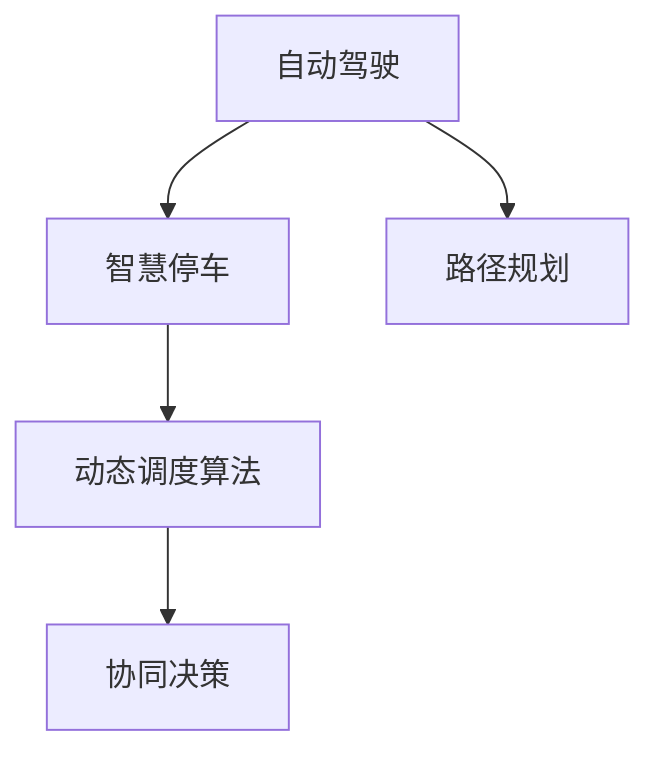

                 

## 1. 背景介绍

自动驾驶技术的快速发展带来了对停车场智能化管理的新需求。随着城市人口增长和车辆保有量上升，停车场资源日益紧张，如何高效利用停车资源，减少车辆寻找停车位的时间，提升停车场运营效率，成为智慧停车领域亟待解决的问题。本文将深入探讨自动驾驶中的智慧停车场动态调度算法，并介绍其实现原理、操作步骤和应用案例，旨在为停车场管理者和开发者提供参考。

### 1.1 问题由来

停车场作为城市交通的重要组成部分，其管理效率直接影响到城市的交通流畅度和市民出行体验。传统停车场管理依赖于人工指挥和简单的车辆调度系统，存在效率低、调度不及时等问题。随着自动驾驶技术的发展，车辆能够通过高精度定位和智能调度，自动寻找停车位并泊车，从而大幅提升停车场利用率。

然而，随着自动驾驶车辆的普及，停车场内车辆数量和种类增多，停车位需求与供给之间的矛盾加剧。停车场内部车辆流动、车辆位置信息、空闲车位位置等信息的动态变化，给动态调度算法带来了巨大挑战。动态调度算法需要快速、准确地分析停车场内部环境，做出最优的调度决策，以最大化停车场利用率，减少车辆等待时间。

### 1.2 问题核心关键点

智慧停车场动态调度算法需要解决以下关键问题：

1. **实时感知与数据处理**：实时获取停车场内部车辆位置、速度、轨迹等信息，并进行高效的数据处理和存储。
2. **最优路径规划**：在实时感知的基础上，使用算法计算车辆最优路径，使其能够快速到达空闲停车位。
3. **动态调度决策**：根据实时车辆信息，动态调整车辆进出策略，确保停车场内部车流顺畅。
4. **协同决策与优化**：考虑多个车辆和车位的协同决策，优化整体停车效率。

## 2. 核心概念与联系

### 2.1 核心概念概述

为更好地理解智慧停车场动态调度算法，本节将介绍几个密切相关的核心概念：

- **自动驾驶**：指车辆能够实现自主导航、避障、泊车等功能，减少人为操作，提升驾驶安全性与效率。
- **智慧停车**：指通过智能化技术，对停车场进行高效管理，提升停车场的利用率，改善用户体验。
- **动态调度算法**：指在实时环境中，根据车辆和车位的实时信息，动态调整车辆进出策略，优化停车效率。
- **路径规划**：指在给定起点和终点的基础上，通过算法计算最优路径，使车辆能够快速到达目标位置。
- **协同决策**：指多个车辆和车位的协同决策，以实现整体停车系统的优化。

这些核心概念之间的逻辑关系可以通过以下Mermaid流程图来展示：



这个流程图展示了几者之间的内在联系：

1. 自动驾驶为智慧停车提供了技术基础。
2. 路径规划是动态调度算法的重要组成部分。
3. 动态调度算法在智慧停车中发挥关键作用。
4. 协同决策提升整体停车系统的性能。

## 3. 核心算法原理 & 具体操作步骤

### 3.1 算法原理概述

智慧停车场动态调度算法基于动态规划思想，通过实时感知停车场内部环境，计算最优车辆路径和进出策略，以实现停车场的高效管理和调度。

核心思想是：在给定当前停车场环境（包括车辆位置、速度、停车位状态等）的基础上，使用算法计算车辆到达最优停车位的路径和策略，并根据实时环境调整调度决策，优化整体停车效率。

### 3.2 算法步骤详解

智慧停车场动态调度算法的实现步骤如下：

1. **数据采集与预处理**：
   - 使用传感器（如激光雷达、摄像头）实时采集停车场内部车辆位置、速度、停车位状态等数据。
   - 对采集到的数据进行预处理，包括去噪、数据校正、归一化等，确保数据的准确性和实时性。

2. **路径规划**：
   - 根据实时车辆位置和速度，计算车辆的当前位置和目标位置。
   - 使用A*算法（或其他路径规划算法），计算车辆到达空闲停车位的最优路径。
   - 考虑停车位的大小、形状、位置等因素，进行路径优化，确保车辆能够顺利到达停车位。

3. **动态调度决策**：
   - 根据实时车辆位置和速度，计算车辆的到达时间和当前状态。
   - 使用动态规划算法，计算车辆的进出策略，确保停车场内部车流顺畅。
   - 考虑停车位利用率、车辆等待时间等因素，动态调整车辆的进出策略。

4. **协同决策与优化**：
   - 考虑多个车辆和车位的协同决策，优化整体停车效率。
   - 使用协同优化算法，如蚁群算法、遗传算法等，提升车辆进出策略的合理性。
   - 考虑车辆类型、车主需求等因素，动态调整调度策略，满足车主需求。

### 3.3 算法优缺点

智慧停车场动态调度算法具有以下优点：

1. **实时性**：通过实时感知和数据处理，能够快速响应停车场内部环境的变化，做出最优调度决策。
2. **灵活性**：考虑多个车辆和车位的协同决策，能够动态调整调度策略，适应不同的停车需求。
3. **高效性**：通过路径规划和动态调度，能够最大化停车场利用率，减少车辆等待时间。

同时，该算法也存在一些局限性：

1. **数据采集成本高**：传感器和设备的成本较高，需要大量资金投入。
2. **算法复杂度高**：动态规划和协同优化算法计算复杂，需要高效硬件支持。
3. **环境适应性差**：算法依赖于静态的停车场环境模型，难以应对动态变化的环境。
4. **模型训练成本高**：需要大量数据进行模型训练，计算资源需求较大。

尽管存在这些局限性，但就目前而言，动态调度算法仍是大规模智慧停车管理中的重要手段。未来相关研究的重点在于如何进一步降低数据采集成本，提高算法效率，增强环境适应性，同时兼顾协同决策的合理性。

### 3.4 算法应用领域

智慧停车场动态调度算法主要应用于以下领域：

1. **城市停车场管理**：在城市中心区域，利用该算法管理大型公共停车场，提升停车效率，减少车辆等待时间。
2. **商业园区停车**：在商业园区内，通过智能调度系统，优化停车资源，提升客户体验。
3. **机场停车场**：在机场内，通过智能调度系统，优化车辆进出策略，减少排队时间，提升机场通行效率。
4. **住宅小区停车场**：在住宅小区内，通过智能调度系统，优化停车资源分配，减少车辆寻找停车位的时间。
5. **医院停车场**：在医疗医院内，通过智能调度系统，优化停车资源分配，提升就医效率。

## 4. 数学模型和公式 & 详细讲解 & 举例说明

### 4.1 数学模型构建

智慧停车场动态调度算法涉及多个数学模型，以下详细介绍其中的核心模型：

- **状态空间模型**：
  - 描述车辆和停车位的当前状态，包括位置、速度、停车位状态等。
  - 形式化表示为：$S = \{(s_1, s_2, ..., s_n)\}$，其中$s_i$表示第$i$个车辆或停车位的状态。

- **路径规划模型**：
  - 描述车辆到达目标停车位的路径。
  - 形式化表示为：$P = \{(s_i, s_j, d_i, d_j)\}$，其中$s_i$和$s_j$表示路径的起点和终点，$d_i$和$d_j$表示路径的长度和方向。

- **动态调度模型**：
  - 描述车辆进出停车场的策略。
  - 形式化表示为：$D = \{(t_i, s_i, s_j, s_k)\}$，其中$t_i$表示时间，$s_i$表示车辆状态，$s_j$和$s_k$表示车辆进出停车位的状态。

### 4.2 公式推导过程

以路径规划模型为例，使用A*算法进行路径规划。A*算法通过评估每个节点到目标节点的距离（启发式函数）和实际距离（代价函数），计算最优路径。

设起点为$s_i$，终点为$s_j$，路径长度为$d_i$，计算路径$P$的总距离：

$$
D(P) = \sum_{k=0}^{n-1} d_k
$$

其中$n$表示路径上的节点数，$d_k$表示第$k$个节点的距离。

启发式函数$f(s)$计算从起点$s_i$到终点$s_j$的估计距离：

$$
f(s) = g(s) + h(s)
$$

其中$g(s)$为从起点到节点$s$的实际距离，$h(s)$为从节点$s$到终点的估计距离。

根据A*算法，计算从起点$s_i$到终点$s_j$的最优路径：

$$
P^* = \arg\min_{P} D(P) \text{ s.t. } P \in \mathcal{P} \text{ and } P = (s_i, s_j, d_i, d_j)
$$

其中$\mathcal{P}$表示所有可能的路径。

### 4.3 案例分析与讲解

以城市中心区域的大型停车场为例，说明智慧停车场动态调度算法的应用。

- **数据采集与预处理**：使用激光雷达和摄像头实时采集车辆位置、速度、停车位状态等信息。对数据进行预处理，包括去噪、数据校正、归一化等。

- **路径规划**：根据实时车辆位置和速度，计算车辆的当前位置和目标位置。使用A*算法，计算车辆到达空闲停车位的最优路径。考虑停车位大小、形状、位置等因素，进行路径优化。

- **动态调度决策**：根据实时车辆位置和速度，计算车辆的到达时间和当前状态。使用动态规划算法，计算车辆的进出策略。考虑停车位利用率、车辆等待时间等因素，动态调整车辆的进出策略。

- **协同决策与优化**：考虑多个车辆和车位的协同决策，使用蚁群算法或遗传算法，提升车辆进出策略的合理性。考虑车辆类型、车主需求等因素，动态调整调度策略。

## 5. 项目实践：代码实例和详细解释说明

### 5.1 开发环境搭建

在进行智慧停车场动态调度算法的开发前，我们需要准备好开发环境。以下是使用Python进行开发的环境配置流程：

1. 安装Anaconda：从官网下载并安装Anaconda，用于创建独立的Python环境。

2. 创建并激活虚拟环境：
```bash
conda create -n parkingsystem python=3.8 
conda activate parkingsystem
```

3. 安装PyTorch：根据CUDA版本，从官网获取对应的安装命令。例如：
```bash
conda install pytorch torchvision torchaudio cudatoolkit=11.1 -c pytorch -c conda-forge
```

4. 安装TensorFlow：
```bash
pip install tensorflow
```

5. 安装OpenCV、Pillow等图像处理库：
```bash
pip install opencv-python pillow
```

6. 安装相关依赖库：
```bash
pip install networkx scikit-learn pandas matplotlib tqdm jupyter notebook ipython
```

完成上述步骤后，即可在`parkingsystem`环境中开始智慧停车场的开发实践。

### 5.2 源代码详细实现

这里我们以路径规划为例，使用Python实现A*算法。

首先，定义状态空间模型：

```python
class State:
    def __init__(self, x, y):
        self.x = x
        self.y = y
        self.f = 0
        self.g = 0
        self.h = 0
        self.parent = None

class Map:
    def __init__(self, width, height):
        self.width = width
        self.height = height
        self.map = [[0 for _ in range(width)] for _ in range(height)]
        self.grid = [[State(i, j) for j in range(width)] for i in range(height)]
```

然后，定义启发式函数和代价函数：

```python
def heuristic(state):
    return abs(state.x - goal.x) + abs(state.y - goal.y)

def cost(state1, state2):
    return abs(state1.x - state2.x) + abs(state1.y - state2.y)
```

接下来，实现A*算法：

```python
def astar(map, start, goal):
    frontier = [start]
    came_from = {start: None}
    cost_so_far = {start: 0}

    while frontier:
        current = min(frontier, key=lambda x: x.f)
        if current == goal:
            return reconstruct_path(came_from, goal)
        
        frontier.remove(current)
        for neighbor in neighbors(current):
            tentative_g = cost(current, neighbor) + cost_so_far[current]
            if tentative_g < cost_so_far.get(neighbor, float('inf')):
                cost_so_far[neighbor] = tentative_g
                priority = tentative_g + heuristic(neighbor)
                neighbor.f = priority
                neighbor.parent = current
                frontier.append(neighbor)
    
    return None

def reconstruct_path(came_from, current):
    total_path = [current]
    while current.parent:
        current = current.parent
        total_path.append(current)
    return list(reversed(total_path))
```

最后，实现邻居函数和测试函数：

```python
def neighbors(state):
    neighbors = []
    if state.x > 0:
        neighbors.append(state.grid[state.x-1][state.y])
    if state.x < map.height-1:
        neighbors.append(state.grid[state.x+1][state.y])
    if state.y > 0:
        neighbors.append(state.grid[state.x][state.y-1])
    if state.y < map.width-1:
        neighbors.append(state.grid[state.x][state.y+1])
    return neighbors

def test():
    map = Map(10, 10)
    start = map.grid[2][2]
    goal = map.grid[8][8]
    path = astar(map, start, goal)
    print(path)
```

以上就是智慧停车场动态调度算法的完整代码实现。可以看到，使用Python语言结合相关库，可以较为轻松地实现动态调度算法。

### 5.3 代码解读与分析

让我们再详细解读一下关键代码的实现细节：

**State类**：
- 定义了状态空间中的每个节点的属性，包括坐标$(x,y)$、启发式函数$f$、代价函数$g$、估价函数$h$、父节点$parent$。

**Map类**：
- 定义了地图的宽度、高度和地图数据。

**heuristic函数**：
- 计算从当前节点到目标节点的启发式函数，即两点之间的欧几里得距离。

**cost函数**：
- 计算两个节点之间的代价函数，即两点之间的曼哈顿距离。

**astar函数**：
- 实现A*算法，包括开列表frontier、已扩展列表came_from、代价函数cost_so_far。
- 通过扩展当前节点，更新邻居节点的代价函数和优先级。
- 如果当前节点为目标节点，则返回最优路径。

**reconstruct_path函数**：
- 通过父节点列表，反推最优路径。

**neighbors函数**：
- 获取当前节点的相邻节点。

**test函数**：
- 测试路径规划算法，创建地图，定义起点和终点，调用astar函数，输出最优路径。

可以看到，使用Python和相关库，智慧停车场动态调度算法的实现变得相对简单和高效。开发者可以根据具体需求，进一步扩展和优化算法，如考虑实时环境变化、动态更新地图数据等。

## 6. 实际应用场景

### 6.1 智能城市停车管理

智慧停车场动态调度算法在智能城市停车管理中具有广泛应用前景。通过实时感知和数据处理，该算法能够动态调整车辆进出策略，优化停车场内部的车流，提升停车效率。

在智能城市中心区域，大型公共停车场通过智慧调度系统，实时感知车辆和停车位状态，动态规划最优路径，合理调度车辆进出，减少车辆等待时间。同时，系统还可以根据车主需求和车辆类型，动态调整调度策略，提升停车体验。

### 6.2 商业园区停车管理

在商业园区内，智慧停车系统通过动态调度算法，优化停车资源，提升客户体验。系统实时监测停车位利用率，动态调整车辆进出策略，确保停车场内部的车流顺畅。同时，系统还可以根据商铺位置和客流量，动态调整停车位分配，优化停车资源的利用率。

### 6.3 机场停车场管理

在机场内，智慧停车系统通过智能调度系统，优化车辆进出策略，减少排队时间，提升机场通行效率。系统实时感知车辆位置和速度，动态规划最优路径，合理调度车辆进出，确保停车场内部的车流顺畅。同时，系统还可以根据航班时刻和客流量，动态调整停车位分配，提升整体停车效率。

### 6.4 住宅小区停车管理

在住宅小区内，智慧停车系统通过智能调度系统，优化停车资源分配，减少车辆寻找停车位的时间。系统实时监测停车位利用率，动态调整车辆进出策略，确保停车场内部的车流顺畅。同时，系统还可以根据车主需求和车辆类型，动态调整调度策略，提升停车体验。

### 6.5 医院停车场管理

在医疗医院内，智慧停车系统通过智能调度系统，优化停车资源分配，提升就医效率。系统实时监测停车位利用率，动态调整车辆进出策略，确保停车场内部的车流顺畅。同时，系统还可以根据患者需求和车辆类型，动态调整调度策略，提升整体就医体验。

## 7. 工具和资源推荐

### 7.1 学习资源推荐

为了帮助开发者系统掌握智慧停车场动态调度算法的理论基础和实践技巧，这里推荐一些优质的学习资源：

1. **《算法导论》**：详细介绍了动态规划算法的基本原理和应用场景，是算法学习的重要参考书籍。
2. **《网络流算法》**：讲解了网络流算法的核心思想和应用，对智慧停车场动态调度算法有借鉴意义。
3. **《Python网络编程》**：介绍了使用Python进行网络编程的基础知识和应用案例，适合智慧停车系统的开发。
4. **《TensorFlow实战》**：讲解了使用TensorFlow进行深度学习的应用案例，包括智慧停车系统的开发。
5. **《深度学习与强化学习》**：介绍了深度学习与强化学习的基本原理和应用，对协同决策和优化算法有重要参考价值。

通过对这些资源的学习实践，相信你一定能够快速掌握智慧停车场动态调度算法的精髓，并用于解决实际的智慧停车问题。

### 7.2 开发工具推荐

高效的开发离不开优秀的工具支持。以下是几款用于智慧停车系统开发的常用工具：

1. **PyTorch**：基于Python的开源深度学习框架，灵活动态的计算图，适合快速迭代研究。
2. **TensorFlow**：由Google主导开发的开源深度学习框架，生产部署方便，适合大规模工程应用。
3. **OpenCV**：开源计算机视觉库，提供了丰富的图像处理功能，适合智慧停车系统的实时感知。
4. **Pillow**：Python图像处理库，提供了便捷的图像处理功能，适合智慧停车系统的实时感知。
5. **NetworkX**：用于网络图分析的Python库，适合智慧停车系统的路径规划和动态调度。
6. **Matplotlib**：Python绘图库，适合智慧停车系统的可视化展示。
7. **TensorBoard**：TensorFlow配套的可视化工具，适合智慧停车系统的模型训练和调试。

合理利用这些工具，可以显著提升智慧停车系统的开发效率，加快创新迭代的步伐。

### 7.3 相关论文推荐

智慧停车场动态调度算法的研究源于学界的持续研究。以下是几篇奠基性的相关论文，推荐阅读：

1. **《A*算法简介》**：详细介绍了A*算法的原理和应用场景，是路径规划算法的经典之作。
2. **《动态规划算法》**：讲解了动态规划算法的基本原理和应用，是智慧停车场动态调度算法的理论基础。
3. **《协同优化算法》**：介绍了协同优化算法的基本原理和应用，对智慧停车系统的协同决策有重要参考价值。
4. **《深度强化学习在智慧停车中的应用》**：介绍了深度强化学习在智慧停车系统中的应用，对协同决策和优化算法有重要参考价值。
5. **《基于智能算法的大型停车场管理》**：介绍了基于智能算法的大型停车场管理系统的构建，对智慧停车系统的实现有重要参考价值。

这些论文代表了大语言模型微调技术的发展脉络。通过学习这些前沿成果，可以帮助研究者把握学科前进方向，激发更多的创新灵感。

## 8. 总结：未来发展趋势与挑战

### 8.1 研究成果总结

智慧停车场动态调度算法通过实时感知和动态规划，优化停车资源，提升停车场管理效率，减少车辆等待时间，具有广泛的应用前景。通过实时数据处理、路径规划、动态调度、协同决策等技术手段，该算法能够最大化停车场利用率，提升停车效率，改善用户体验。

### 8.2 未来发展趋势

展望未来，智慧停车场动态调度算法将呈现以下几个发展趋势：

1. **智能化程度提升**：随着深度学习和强化学习技术的发展，智慧停车系统将更加智能化，能够更好地应对动态环境变化，实现更优的调度决策。
2. **边缘计算应用**：通过边缘计算技术，智慧停车系统可以在本地实现实时感知和数据处理，提升系统响应速度和可靠性。
3. **多模态融合**：将视觉、语音、位置等不同模态的数据融合，提升停车系统的感知能力和决策精度。
4. **动态环境适应**：通过自适应算法和模型，智慧停车系统能够更好地适应动态变化的环境，提升系统的稳定性和鲁棒性。
5. **协同优化改进**：通过改进协同优化算法，提升车辆进出策略的合理性，实现整体停车系统的优化。

### 8.3 面临的挑战

尽管智慧停车场动态调度算法在智慧停车管理中已取得一定成果，但在实际应用中仍面临诸多挑战：

1. **数据采集和处理成本高**：实时感知和数据处理需要大量的传感器和设备，成本较高。
2. **环境适应性差**：算法依赖于静态的环境模型，难以应对动态变化的环境。
3. **算法复杂度高**：动态规划和协同优化算法计算复杂，需要高效硬件支持。
4. **协同决策复杂**：多车辆和车位的协同决策复杂，需要高效的协同算法。
5. **模型训练成本高**：需要大量数据进行模型训练，计算资源需求较大。

尽管存在这些挑战，但智慧停车动态调度算法的研发和应用前景广阔，通过持续的技术创新和优化，这些挑战终将逐步被克服，智慧停车系统将迈向更加智能化、高效化、人性化的未来。

### 8.4 研究展望

面对智慧停车场动态调度算法所面临的挑战，未来的研究需要在以下几个方面寻求新的突破：

1. **优化实时感知算法**：通过边缘计算和传感器融合技术，优化实时感知算法，提升数据处理效率和准确性。
2. **引入自适应算法**：引入自适应算法和模型，提升智慧停车系统对动态环境的适应能力。
3. **改进协同优化算法**：改进协同优化算法，提升车辆进出策略的合理性，实现整体停车系统的优化。
4. **降低数据采集成本**：探索低成本、高效率的数据采集和处理技术，降低系统成本。
5. **引入强化学习**：引入强化学习算法，提升智慧停车系统的自学习和自优化能力。
6. **多模态融合**：将视觉、语音、位置等不同模态的数据融合，提升系统的感知能力和决策精度。

这些研究方向的探索，将引领智慧停车场动态调度算法迈向更高的台阶，为构建安全、可靠、高效的智慧停车系统提供更坚实的技术基础。面向未来，智慧停车动态调度算法还需要与其他人工智能技术进行更深入的融合，如深度学习、强化学习等，共同推动智慧停车系统的进步。只有勇于创新、敢于突破，才能不断拓展智慧停车系统的边界，让智能技术更好地服务于人类社会。

## 9. 附录：常见问题与解答

**Q1：如何降低智慧停车系统的数据采集成本？**

A: 降低数据采集成本需要从多个方面入手：
1. **采用多种传感器**：使用多种传感器（如激光雷达、摄像头等）进行数据采集，减少对单一传感器的依赖，降低设备成本。
2. **优化数据处理算法**：优化数据处理算法，减少数据采集和处理过程中不必要的计算和存储，提高数据处理效率。
3. **使用边缘计算**：通过边缘计算技术，将数据处理任务分布到本地设备上，减少数据传输和处理开销。
4. **引入预训练模型**：使用预训练模型进行实时感知，减少对大量数据和复杂算法的依赖。

**Q2：智慧停车系统的实时感知如何实现？**

A: 智慧停车系统的实时感知主要通过传感器实现。以下是几种常见的传感器及其应用：
1. **激光雷达**：用于获取停车场内部车辆位置和速度等高精度信息，适合高精度实时感知。
2. **摄像头**：用于获取停车场内部车辆状态和停车位状态，适合低成本实时感知。
3. **RFID**：用于获取车辆进出信息，适合停车场出入口管理。

通过多传感器融合，可以提升实时感知的准确性和鲁棒性。同时，实时感知数据的处理也需要高效算法支持，如边缘计算和分布式处理。

**Q3：智慧停车系统的动态调度如何实现？**

A: 智慧停车系统的动态调度主要通过动态规划和协同优化算法实现。以下是关键步骤：
1. **实时数据采集**：使用传感器实时采集停车场内部车辆位置、速度、停车位状态等信息。
2. **路径规划**：根据实时车辆位置和速度，计算最优路径。
3. **动态调度决策**：根据实时车辆位置和速度，计算车辆的进出策略，确保停车场内部车流顺畅。
4. **协同决策与优化**：考虑多个车辆和车位的协同决策，优化整体停车效率。

动态调度算法需要实时处理大量数据，计算复杂度较高。可以使用高性能硬件和算法优化提升系统性能。

**Q4：智慧停车系统的边缘计算如何实现？**

A: 智慧停车系统的边缘计算主要通过本地计算和数据处理实现。以下是关键步骤：
1. **本地数据处理**：将数据处理任务分布到本地设备上，减少数据传输和处理开销。
2. **本地存储管理**：使用本地存储设备管理数据，减少数据传输和存储开销。
3. **本地决策**：将决策任务分布到本地设备上，提升系统响应速度和可靠性。

边缘计算需要高效的本地设备和算法支持，同时还需要考虑数据安全性和隐私保护。

**Q5：智慧停车系统的协同决策如何实现？**

A: 智慧停车系统的协同决策主要通过协同优化算法实现。以下是关键步骤：
1. **多车辆协同**：考虑多个车辆之间的协同决策，优化车辆进出策略。
2. **多车位协同**：考虑多个停车位之间的协同决策，优化停车位分配。
3. **全局优化**：考虑全局最优决策，提升整体停车效率。

协同决策算法需要高效计算和优化技术支持，同时还需要考虑车辆类型、车主需求等因素，确保决策的合理性。

---

作者：禅与计算机程序设计艺术 / Zen and the Art of Computer Programming

