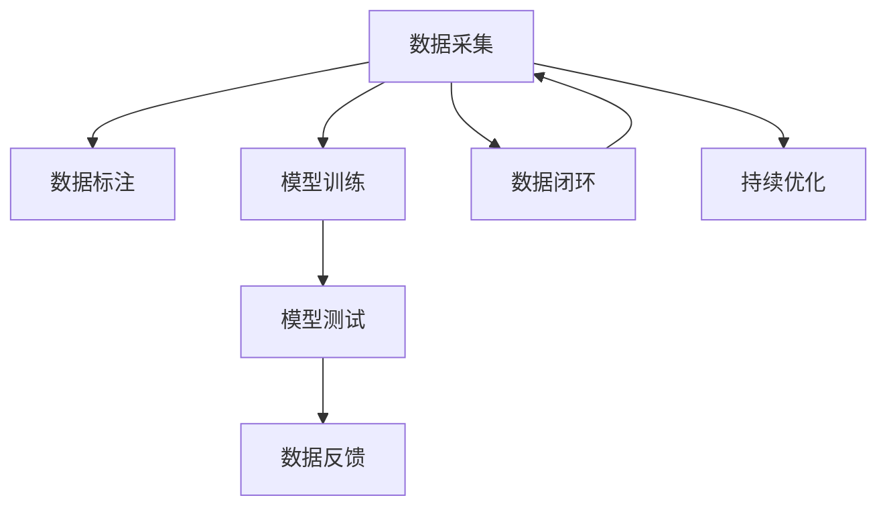

                 

## 1. 背景介绍

随着自动驾驶技术的快速发展，数据在自动驾驶公司的运营和研究中扮演着至关重要的角色。数据不仅用于训练和优化模型，还用于路测、运营、事故分析等各个环节。在实际应用中，数据闭环能力成为自动驾驶公司能否持续优化模型、实现安全可靠运营的关键因素。数据闭环指的是从数据采集、标注、训练、测试到应用的全生命周期中，数据的循环利用和优化，形成一个完整的数据闭环系统。本文将从核心概念、算法原理、操作步骤、实际应用等方面，系统介绍自动驾驶公司的数据闭环能力，为自动驾驶技术的持续优化和应用推广提供参考。

## 2. 核心概念与联系

### 2.1 核心概念概述

为更好地理解自动驾驶公司的数据闭环能力，本节将介绍几个密切相关的核心概念：

- **数据闭环**：从数据采集、标注、训练、测试到应用的全生命周期中，数据的循环利用和优化，形成一个完整的数据闭环系统。
- **自动驾驶模型**：以深度学习模型为代表的自动驾驶决策模型，通常包括感知、定位、规划与控制等多个子模块。
- **数据采集**：通过传感器（如激光雷达、摄像头、毫米波雷达等）获取道路环境信息，生成自动驾驶模型训练的数据集。
- **数据标注**：为数据集添加标签，如目标类别、速度、位置等，用于监督学习训练自动驾驶模型。
- **模型训练**：利用标注数据集训练自动驾驶模型，优化其预测能力和决策能力。
- **模型测试**：通过路测数据集评估模型性能，验证其在实际道路环境中的鲁棒性。
- **数据反馈**：将模型测试结果反馈到数据采集环节，用于进一步优化数据采集策略和传感器配置。

这些核心概念之间的逻辑关系可以通过以下Mermaid流程图来展示：



这个流程图展示了大数据闭环系统的核心组件及其相互关系：

1. 数据采集、标注、训练、测试构成数据闭环的核心循环。
2. 数据采集环节通过传感器获取道路环境信息。
3. 数据标注为训练数据添加标签，用于监督学习。
4. 模型训练优化模型预测和决策能力。
5. 模型测试在实际道路环境中进行性能验证。
6. 数据反馈根据测试结果优化数据采集策略。
7. 持续优化基于数据反馈不断迭代模型和数据集。

## 3. 核心算法原理 & 具体操作步骤

### 3.1 算法原理概述

自动驾驶公司的数据闭环能力，核心在于通过数据的循环利用和优化，不断提升模型的预测和决策性能。其算法原理可以概括为以下几个步骤：

1. **数据采集与预处理**：通过传感器获取道路环境信息，并进行预处理，如去噪、降噪、归一化等。
2. **数据标注与标注数据管理**：对采集的数据进行标注，并通过标注数据管理工具进行存储和组织。
3. **模型训练与优化**：利用标注数据训练自动驾驶模型，并根据测试结果进行优化，如调整模型结构、增加训练数据等。
4. **模型测试与评估**：在实际道路环境中进行模型测试，评估其性能，如准确率、召回率、鲁棒性等。
5. **数据反馈与优化**：根据测试结果，优化数据采集策略和传感器配置，提升数据质量和多样性。
6. **持续优化与迭代**：基于数据反馈，不断迭代优化模型和数据集，形成持续优化的数据闭环。

### 3.2 算法步骤详解

自动驾驶公司的数据闭环能力涉及到多个步骤，下面详细介绍每个步骤的具体操作：

#### 3.2.1 数据采集与预处理

**数据采集**：

1. **传感器选择**：根据自动驾驶需求选择合适的传感器，如激光雷达、摄像头、毫米波雷达等。
2. **传感器配置**：对传感器进行合理配置，确保其覆盖范围和分辨率符合需求。
3. **数据获取**：通过传感器获取道路环境信息，包括交通标志、道路标线、行人、车辆等。

**数据预处理**：

1. **去噪与降噪**：去除传感器数据中的噪声和干扰信号，提高数据质量。
2. **数据归一化**：将传感器数据归一化到特定范围内，便于后续处理和训练。
3. **数据同步**：将不同传感器获取的数据进行时间同步，确保数据的一致性。

#### 3.2.2 数据标注与标注数据管理

**数据标注**：

1. **人工标注**：通过人工标注工具，为数据集添加标签，如目标类别、速度、位置等。
2. **自动标注**：利用深度学习模型进行自动标注，提高标注效率和一致性。
3. **标注审核**：对标注结果进行审核，确保标注数据的质量和准确性。

**标注数据管理**：

1. **数据存储**：将标注数据存储到高效、可扩展的数据库或存储系统中。
2. **数据组织**：对标注数据进行分类、分级、索引等组织管理，方便后续使用。
3. **数据访问**：提供数据访问接口，支持模型训练、测试和分析。

#### 3.2.3 模型训练与优化

**模型训练**：

1. **选择模型**：根据自动驾驶任务选择合适的深度学习模型，如CNN、RNN、Transformer等。
2. **数据划分**：将标注数据划分为训练集、验证集和测试集，确保模型训练的稳定性和泛化能力。
3. **模型训练**：利用训练集进行模型训练，使用梯度下降等优化算法更新模型参数。

**模型优化**：

1. **调整模型结构**：根据测试结果调整模型结构，如增加卷积层、调整神经元数量等。
2. **增加训练数据**：通过数据采集和标注，增加训练数据量，提升模型性能。
3. **超参数调整**：调整学习率、批大小等超参数，优化模型训练过程。

#### 3.2.4 模型测试与评估

**模型测试**：

1. **测试数据集准备**：收集实际道路环境中的测试数据集，确保其多样性和覆盖面。
2. **测试环境搭建**：搭建测试环境，模拟实际道路条件，进行模型测试。
3. **测试结果分析**：分析模型在测试数据集上的性能指标，如准确率、召回率、F1分数等。

**模型评估**：

1. **性能指标**：选择适当的性能指标，评估模型在不同场景下的表现。
2. **鲁棒性测试**：进行鲁棒性测试，确保模型在各种干扰和变化条件下仍能稳定工作。
3. **可解释性分析**：对模型决策过程进行分析，确保其可解释性和透明度。

#### 3.2.5 数据反馈与优化

**数据反馈**：

1. **测试结果反馈**：将模型测试结果反馈到数据采集环节，用于优化数据采集策略。
2. **传感器反馈**：根据模型测试结果，调整传感器配置，提升数据质量。
3. **标注反馈**：对标注结果进行反馈，改进标注工具和方法。

**数据优化**：

1. **优化数据采集策略**：根据测试结果优化数据采集策略，如调整采样频率、增加传感器数量等。
2. **优化数据标注方法**：改进标注方法和工具，提高标注数据的质量和效率。
3. **优化数据管理**：优化数据管理方式，确保数据的安全性和可访问性。

#### 3.2.6 持续优化与迭代

**持续优化**：

1. **定期迭代**：根据数据反馈，定期迭代优化模型和数据集，保持模型性能的稳定性和进步。
2. **模型版本管理**：对模型进行版本管理，记录每次迭代的改进和优化。
3. **数据质量监控**：持续监控数据质量，确保数据集的完整性和准确性。

## 4. 数学模型和公式 & 详细讲解 & 举例说明

### 4.1 数学模型构建

自动驾驶模型的数据闭环能力可以通过数学模型进行建模。以下是一个简单的自动驾驶数据闭环模型：

1. **数据采集模型**：$D_{采集} = f_{采集}(S)$，其中 $D_{采集}$ 为采集到的数据，$S$ 为传感器配置。
2. **数据标注模型**：$D_{标注} = f_{标注}(D_{采集})$，其中 $D_{标注}$ 为标注后的数据。
3. **模型训练模型**：$M = f_{训练}(D_{标注})$，其中 $M$ 为训练后的模型。
4. **模型测试模型**：$P = f_{测试}(M, D_{测试})$，其中 $P$ 为模型在测试数据上的性能指标。
5. **数据反馈模型**：$D_{采集}' = f_{反馈}(D_{测试}, P)$，其中 $D_{采集}'$ 为优化后的数据采集策略。

### 4.2 公式推导过程

以模型训练和优化为例，推导模型的训练公式。假设使用监督学习进行模型训练，目标函数为：

$$
L = \frac{1}{N}\sum_{i=1}^N \ell(f_{训练}(D_{标注}^{(i))), y^{(i)})
$$

其中 $f_{训练}$ 为训练后的模型，$\ell$ 为损失函数，$y^{(i)}$ 为标注数据的目标值，$N$ 为样本数。通过梯度下降等优化算法，更新模型参数：

$$
\theta \leftarrow \theta - \eta \nabla_{\theta}L
$$

其中 $\theta$ 为模型参数，$\eta$ 为学习率，$\nabla_{\theta}L$ 为损失函数对模型参数的梯度。

### 4.3 案例分析与讲解

以自动驾驶中的行人检测为例，展示数据闭环能力的实际应用。

**数据采集**：

1. **传感器选择**：使用激光雷达和摄像头进行数据采集。
2. **数据预处理**：对采集到的数据进行去噪、归一化等预处理。

**数据标注**：

1. **人工标注**：由人工标注工具标注行人的位置和类别。
2. **自动标注**：利用深度学习模型进行自动标注，提高标注效率。

**模型训练**：

1. **模型选择**：选择CNN或YOLO等深度学习模型进行行人检测。
2. **数据划分**：将标注数据划分为训练集、验证集和测试集。
3. **模型训练**：利用训练集进行模型训练，优化模型参数。

**模型测试**：

1. **测试数据集准备**：收集实际道路环境中的行人检测数据集。
2. **测试环境搭建**：搭建测试环境，模拟实际道路条件，进行模型测试。
3. **测试结果分析**：分析模型在测试数据集上的性能指标，如准确率、召回率、F1分数等。

**数据反馈**：

1. **测试结果反馈**：根据测试结果，优化数据采集策略和传感器配置。
2. **标注反馈**：对标注结果进行反馈，改进标注工具和方法。

**持续优化**：

1. **定期迭代**：根据测试结果和数据反馈，定期迭代优化模型和数据集。
2. **模型版本管理**：记录每次迭代的改进和优化。
3. **数据质量监控**：持续监控数据质量，确保数据集的完整性和准确性。

## 5. 项目实践：代码实例和详细解释说明

### 5.1 开发环境搭建

在进行自动驾驶数据闭环能力的实践时，我们需要准备好开发环境。以下是使用Python进行PyTorch开发的环境配置流程：

1. 安装Anaconda：从官网下载并安装Anaconda，用于创建独立的Python环境。

2. 创建并激活虚拟环境：
```bash
conda create -n auto-driving-env python=3.8 
conda activate auto-driving-env
```

3. 安装PyTorch：根据CUDA版本，从官网获取对应的安装命令。例如：
```bash
conda install pytorch torchvision torchaudio cudatoolkit=11.1 -c pytorch -c conda-forge
```

4. 安装TensorFlow：
```bash
conda install tensorflow
```

5. 安装各类工具包：
```bash
pip install numpy pandas scikit-learn matplotlib tqdm jupyter notebook ipython
```

完成上述步骤后，即可在`auto-driving-env`环境中开始数据闭环能力的开发实践。

### 5.2 源代码详细实现

下面我们以行人检测任务为例，给出使用PyTorch进行数据闭环能力的PyTorch代码实现。

首先，定义数据处理函数：

```python
from transformers import BertTokenizer
from torch.utils.data import Dataset
import torch

class PedestrianDetectionDataset(Dataset):
    def __init__(self, images, annotations, tokenizer, max_len=128):
        self.images = images
        self.annotations = annotations
        self.tokenizer = tokenizer
        self.max_len = max_len
        
    def __len__(self):
        return len(self.images)
    
    def __getitem__(self, item):
        image = self.images[item]
        annotation = self.annotations[item]
        
        encoding = self.tokenizer(image, return_tensors='pt', max_length=self.max_len, padding='max_length', truncation=True)
        input_ids = encoding['input_ids'][0]
        attention_mask = encoding['attention_mask'][0]
        
        # 对token-wise的标签进行编码
        encoded_tags = [tag2id[tag] for tag in annotation] 
        encoded_tags.extend([tag2id['O']] * (self.max_len - len(encoded_tags)))
        labels = torch.tensor(encoded_tags, dtype=torch.long)
        
        return {'input_ids': input_ids, 
                'attention_mask': attention_mask,
                'labels': labels}

# 标签与id的映射
tag2id = {'O': 0, 'person': 1}
id2tag = {v: k for k, v in tag2id.items()}

# 创建dataset
tokenizer = BertTokenizer.from_pretrained('bert-base-cased')

train_dataset = PedestrianDetectionDataset(train_images, train_annotations, tokenizer)
dev_dataset = PedestrianDetectionDataset(dev_images, dev_annotations, tokenizer)
test_dataset = PedestrianDetectionDataset(test_images, test_annotations, tokenizer)
```

然后，定义模型和优化器：

```python
from transformers import BertForTokenClassification, AdamW

model = BertForTokenClassification.from_pretrained('bert-base-cased', num_labels=len(tag2id))

optimizer = AdamW(model.parameters(), lr=2e-5)
```

接着，定义训练和评估函数：

```python
from torch.utils.data import DataLoader
from tqdm import tqdm
from sklearn.metrics import classification_report

device = torch.device('cuda') if torch.cuda.is_available() else torch.device('cpu')
model.to(device)

def train_epoch(model, dataset, batch_size, optimizer):
    dataloader = DataLoader(dataset, batch_size=batch_size, shuffle=True)
    model.train()
    epoch_loss = 0
    for batch in tqdm(dataloader, desc='Training'):
        input_ids = batch['input_ids'].to(device)
        attention_mask = batch['attention_mask'].to(device)
        labels = batch['labels'].to(device)
        model.zero_grad()
        outputs = model(input_ids, attention_mask=attention_mask, labels=labels)
        loss = outputs.loss
        epoch_loss += loss.item()
        loss.backward()
        optimizer.step()
    return epoch_loss / len(dataloader)

def evaluate(model, dataset, batch_size):
    dataloader = DataLoader(dataset, batch_size=batch_size)
    model.eval()
    preds, labels = [], []
    with torch.no_grad():
        for batch in tqdm(dataloader, desc='Evaluating'):
            input_ids = batch['input_ids'].to(device)
            attention_mask = batch['attention_mask'].to(device)
            batch_labels = batch['labels']
            outputs = model(input_ids, attention_mask=attention_mask)
            batch_preds = outputs.logits.argmax(dim=2).to('cpu').tolist()
            batch_labels = batch_labels.to('cpu').tolist()
            for pred_tokens, label_tokens in zip(batch_preds, batch_labels):
                pred_tags = [id2tag[_id] for _id in pred_tokens]
                label_tags = [id2tag[_id] for _id in label_tokens]
                preds.append(pred_tags[:len(label_tags)])
                labels.append(label_tags)
                
    print(classification_report(labels, preds))
```

最后，启动训练流程并在测试集上评估：

```python
epochs = 5
batch_size = 16

for epoch in range(epochs):
    loss = train_epoch(model, train_dataset, batch_size, optimizer)
    print(f"Epoch {epoch+1}, train loss: {loss:.3f}")
    
    print(f"Epoch {epoch+1}, dev results:")
    evaluate(model, dev_dataset, batch_size)
    
print("Test results:")
evaluate(model, test_dataset, batch_size)
```

以上就是使用PyTorch进行行人检测任务数据闭环能力的完整代码实现。可以看到，得益于Transformers库的强大封装，我们可以用相对简洁的代码完成行人检测任务的开发。

### 5.3 代码解读与分析

让我们再详细解读一下关键代码的实现细节：

**PedestrianDetectionDataset类**：
- `__init__`方法：初始化图像、标注、分词器等关键组件。
- `__len__`方法：返回数据集的样本数量。
- `__getitem__`方法：对单个样本进行处理，将图像输入编码为token ids，将标注编码为数字，并对其进行定长padding，最终返回模型所需的输入。

**tag2id和id2tag字典**：
- 定义了标签与数字id之间的映射关系，用于将token-wise的预测结果解码回真实的标签。

**训练和评估函数**：
- 使用PyTorch的DataLoader对数据集进行批次化加载，供模型训练和推理使用。
- 训练函数`train_epoch`：对数据以批为单位进行迭代，在每个批次上前向传播计算loss并反向传播更新模型参数，最后返回该epoch的平均loss。
- 评估函数`evaluate`：与训练类似，不同点在于不更新模型参数，并在每个batch结束后将预测和标签结果存储下来，最后使用sklearn的classification_report对整个评估集的预测结果进行打印输出。

**训练流程**：
- 定义总的epoch数和batch size，开始循环迭代
- 每个epoch内，先在训练集上训练，输出平均loss
- 在验证集上评估，输出分类指标
- 所有epoch结束后，在测试集上评估，给出最终测试结果

可以看到，PyTorch配合Transformers库使得行人检测任务的开发变得简洁高效。开发者可以将更多精力放在数据处理、模型改进等高层逻辑上，而不必过多关注底层的实现细节。

当然，工业级的系统实现还需考虑更多因素，如模型的保存和部署、超参数的自动搜索、更灵活的任务适配层等。但核心的数据闭环过程基本与此类似。

## 6. 实际应用场景

### 6.1 自动驾驶公司的运营优化

自动驾驶公司的运营优化离不开数据闭环能力的支撑。通过数据闭环，自动驾驶公司能够实时监测路测数据，分析模型性能和鲁棒性，快速发现和解决问题。

例如，某自动驾驶公司通过数据闭环系统，发现某路段的行人检测模型性能较差，便重新收集了该路段的详细数据，并在模型训练中重点关注行人检测任务，提升了模型的准确率和鲁棒性。

### 6.2 自动驾驶模型的持续改进

数据闭环能力使得自动驾驶公司能够持续改进模型性能。通过定期收集和更新训练数据，模型能够在实际道路环境中不断学习新的驾驶场景和行为模式，提升决策能力和安全性。

例如，某自动驾驶公司定期收集路测数据，并通过数据标注和模型训练，使自动驾驶模型在处理复杂交通场景时表现更佳。

### 6.3 自动驾驶模型的应用推广

数据闭环能力还帮助自动驾驶公司推广其技术应用。通过数据闭环系统，公司能够及时发现模型在不同场景下的表现差异，并进行针对性的优化和改进，确保在不同地区和环境下，模型的性能和鲁棒性都能满足需求。

例如，某自动驾驶公司发现其模型在特定天气条件下的表现不佳，便通过数据闭环系统收集该条件下的路测数据，并进行了针对性训练和优化，成功推广了其技术在多变天气条件下的应用。

## 7. 工具和资源推荐

### 7.1 学习资源推荐

为了帮助开发者系统掌握自动驾驶数据闭环能力的理论基础和实践技巧，这里推荐一些优质的学习资源：

1. 《深度学习在自动驾驶中的应用》系列博文：由自动驾驶技术专家撰写，深入浅出地介绍了深度学习在自动驾驶中的各种应用，包括数据闭环能力。

2. Coursera《自动驾驶技术》课程：由自动驾驶领域知名教授讲授，涵盖自动驾驶系统的全生命周期，包括数据闭环能力的构建。

3. 《深度学习与自动驾驶》书籍：系统介绍了深度学习在自动驾驶中的应用，包括数据闭环能力。

4. NVIDIA AI开发者社区：提供丰富的自动驾驶相关资源和技术交流平台，包含大量自动驾驶数据闭环的案例和实践经验。

5. Kaggle自动驾驶竞赛：通过实际竞赛任务，学习自动驾驶中的数据闭环能力，提高实战能力。

通过对这些资源的学习实践，相信你一定能够快速掌握自动驾驶数据闭环能力的精髓，并用于解决实际的自动驾驶问题。

### 7.2 开发工具推荐

高效的开发离不开优秀的工具支持。以下是几款用于自动驾驶数据闭环能力开发的常用工具：

1. PyTorch：基于Python的开源深度学习框架，灵活动态的计算图，适合快速迭代研究。主要用于自动驾驶模型训练和优化。

2. TensorFlow：由Google主导开发的开源深度学习框架，生产部署方便，适合大规模工程应用。主要用于自动驾驶模型的训练和推理。

3. OpenCV：计算机视觉库，提供了丰富的图像处理和分析工具，适用于自动驾驶中的传感器数据处理。

4. ROS：机器人操作系统，提供了丰富的自动驾驶开发工具和库，适用于自动驾驶系统的集成和调试。

5. DNNL：深度神经网络库，提供了高效的深度学习模型推理加速功能，适用于自动驾驶模型的推理优化。

合理利用这些工具，可以显著提升自动驾驶数据闭环能力的开发效率，加快创新迭代的步伐。

### 7.3 相关论文推荐

自动驾驶数据闭环能力的研究源于学界的持续研究。以下是几篇奠基性的相关论文，推荐阅读：

1. Deep Drivable: A Common Dataset for Autonomous Vehicle Research（Udacity自动驾驶数据集）：提供了大规模自动驾驶数据集，并介绍了数据闭环系统的构建和应用。

2. Learning Objectives for Model Adaptation in Autonomous Vehicles（学习目标以适应自动驾驶模型）：提出了基于数据闭环系统的模型适应学习策略，提升了模型在不同场景下的泛化能力。

3. Multi-Modal Data Fusion for Autonomous Driving（自动驾驶的多模态数据融合）：介绍了多模态数据融合技术，提升了自动驾驶模型的感知能力和决策能力。

4. Adaptive Data Collection for Autonomous Vehicle Perception（自适应数据收集技术）：提出了自适应数据收集技术，提高了自动驾驶模型的数据质量和多样性。

5. Lifelong Learning for Autonomous Vehicle Perception（自动驾驶模型的终身学习）：研究了自动驾驶模型的终身学习策略，确保了模型的持续优化和进步。

这些论文代表了大数据闭环系统的研究进展，通过学习这些前沿成果，可以帮助研究者把握学科前进方向，激发更多的创新灵感。

## 8. 总结：未来发展趋势与挑战

### 8.1 总结

本文对自动驾驶公司的数据闭环能力进行了全面系统的介绍。首先阐述了数据闭环能力的背景和意义，明确了数据闭环在自动驾驶模型训练和运营中的重要作用。其次，从原理到实践，详细讲解了数据闭环的数学模型和操作步骤，给出了自动驾驶数据闭环能力的代码实例。同时，本文还广泛探讨了数据闭环在自动驾驶运营、模型改进、应用推广等方面的实际应用场景，展示了数据闭环能力的广泛应用。此外，本文精选了自动驾驶数据闭环能力的各类学习资源，力求为读者提供全方位的技术指引。

通过本文的系统梳理，可以看到，数据闭环能力在自动驾驶公司的运营和研究中具有重要作用，是确保自动驾驶模型持续优化、安全可靠运营的关键因素。未来，随着自动驾驶技术的发展，数据闭环能力将继续发挥重要作用，推动自动驾驶技术的进步和普及。

### 8.2 未来发展趋势

展望未来，自动驾驶公司的数据闭环能力将呈现以下几个发展趋势：

1. **多模态数据融合**：数据闭环能力将更多地融合多模态数据，如视觉、雷达、激光雷达等，提升自动驾驶模型的感知能力和决策能力。

2. **自适应数据收集**：数据闭环能力将引入自适应数据收集技术，根据模型性能和鲁棒性，动态调整数据采集策略，提升数据质量和多样性。

3. **终身学习**：数据闭环能力将更多地引入终身学习技术，确保模型能够持续学习和优化，适应不断变化的驾驶场景和行为模式。

4. **联邦学习**：数据闭环能力将引入联邦学习技术，通过分布式数据收集和模型训练，提高模型隐私保护和数据利用效率。

5. **边缘计算**：数据闭环能力将引入边缘计算技术，实现本地化数据处理和模型推理，提升系统响应速度和可靠性。

6. **异构计算**：数据闭环能力将更多地利用异构计算资源，如GPU、FPGA等，加速模型训练和推理过程。

以上趋势凸显了自动驾驶数据闭环能力的广阔前景。这些方向的探索发展，必将进一步提升自动驾驶模型的性能和应用范围，为自动驾驶技术的普及和应用提供更多支持。

### 8.3 面临的挑战

尽管自动驾驶公司的数据闭环能力在当前实践中已经取得了不少进展，但在迈向更加智能化、普适化应用的过程中，仍面临诸多挑战：

1. **数据质量与标注成本**：高质量数据的采集和标注成本较高，如何获取大规模、高精度的标注数据，仍是自动驾驶公司需要解决的重要问题。

2. **模型鲁棒性与泛化能力**：自动驾驶模型在面对复杂、多样化的驾驶场景时，如何保持鲁棒性和泛化能力，仍是挑战之一。

3. **数据隐私与安全**：自动驾驶公司需要处理大量敏感数据，如何保护数据隐私和安全，避免数据泄露和滥用，是重要议题。

4. **模型可解释性**：自动驾驶模型通常黑盒化，如何增强模型的可解释性和透明度，确保其决策过程的合理性，是亟待解决的问题。

5. **实时性要求高**：自动驾驶系统需要实时处理数据和模型推理，如何在保证实时性的同时，优化计算资源和推理效率，仍需进一步探索。

6. **技术复杂度高**：自动驾驶技术涉及多学科知识的交叉，如何实现各领域的深度融合，提高技术的综合应用能力，需要更多研究与实践。

正视自动驾驶数据闭环能力面临的这些挑战，积极应对并寻求突破，将是大数据闭环技术走向成熟的必由之路。相信随着学界和产业界的共同努力，这些挑战终将一一被克服，自动驾驶数据闭环能力必将在自动驾驶技术的持续优化和应用推广中发挥重要作用。

### 8.4 研究展望

面对自动驾驶数据闭环能力所面临的种种挑战，未来的研究需要在以下几个方面寻求新的突破：

1. **优化数据采集与标注策略**：研究高效的自动驾驶数据采集和标注方法，降低成本，提高数据质量和多样性。

2. **引入更多先验知识**：将符号化的先验知识，如知识图谱、逻辑规则等，与神经网络模型进行巧妙融合，提升模型的泛化能力和鲁棒性。

3. **提升模型自适应能力**：研究基于数据闭环系统的自适应学习策略，使模型能够快速适应新的驾驶场景和行为模式，提升其泛化能力。

4. **强化数据隐私与安全保护**：研究数据隐私和安全保护技术，确保数据采集和使用的合规性和安全性。

5. **探索更多计算方式**：研究更多的计算方式，如边缘计算、联邦学习等，优化计算资源和推理效率。

6. **引入更多跨学科知识**：研究跨学科知识的深度融合，提升自动驾驶技术的综合应用能力。

这些研究方向的探索，必将引领自动驾驶数据闭环能力技术的进一步发展，为自动驾驶技术的持续优化和应用推广提供更多支持。面向未来，自动驾驶数据闭环能力技术还需要与其他人工智能技术进行更深入的融合，如知识表示、因果推理、强化学习等，多路径协同发力，共同推动自动驾驶技术的进步。只有勇于创新、敢于突破，才能不断拓展自动驾驶数据闭环能力技术的边界，让自动驾驶技术更好地服务于人类社会。

## 9. 附录：常见问题与解答

**Q1：数据闭环能力是否适用于所有自动驾驶任务？**

A: 数据闭环能力在大多数自动驾驶任务上都能取得不错的效果，特别是对于需要高感知能力和决策能力的任务，如自动驾驶中的行人检测、车道保持等。但对于一些特定领域的任务，如智能物流、智能交通等，可能还需要结合领域特定的方法和技术。

**Q2：如何选择合适的数据采集策略？**

A: 选择合适的数据采集策略需要考虑任务需求和实际条件。例如，对于城市道路驾驶任务，可以采用固定位置的传感器采集数据；对于高速驾驶任务，可以采用移动平台采集数据。同时，还需要考虑传感器的覆盖范围、分辨率、数据质量等因素。

**Q3：数据标注质量如何保证？**

A: 数据标注质量的保证需要通过多轮人工审核和标注工具的改进。同时，还可以利用深度学习模型进行自动标注，提高标注效率和一致性。对于特别重要和关键的任务，需要重点关注数据标注的准确性和可靠性。

**Q4：模型训练时如何平衡数据多样性和鲁棒性？**

A: 模型训练时可以通过数据多样性和鲁棒性损失函数来平衡数据多样性和鲁棒性。例如，引入对抗样本和噪声，提高模型对干扰的鲁棒性。同时，还可以引入多任务学习，提升模型在多种驾驶场景中的泛化能力。

**Q5：如何在数据闭环中实现实时数据处理？**

A: 在数据闭环中实现实时数据处理需要优化数据收集和处理流程。例如，可以使用边缘计算技术将数据处理放在本地设备上进行，减少数据传输延迟。同时，还需要优化计算图和算法，提高数据处理和模型推理的效率。

**Q6：如何保证数据闭环中的隐私和安全？**

A: 在数据闭环中保证隐私和安全需要引入数据加密、隐私保护技术。例如，可以使用差分隐私技术保护数据隐私，防止数据泄露。同时，还需要对数据进行分类和权限管理，确保数据的合法使用。

通过这些常见问题的解答，相信读者能够更好地理解自动驾驶数据闭环能力的原理和应用，为实际开发和研究提供参考。

---

作者：禅与计算机程序设计艺术 / Zen and the Art of Computer Programming

