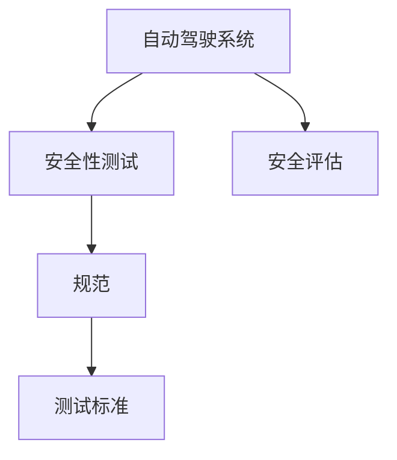
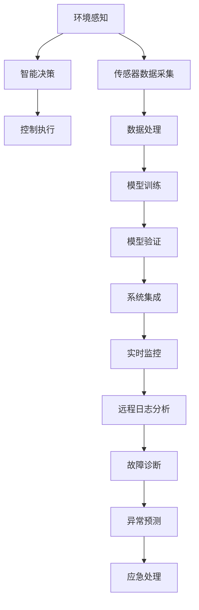

                 

# 自动驾驶行业的安全性测试标准与规范

## 1. 背景介绍

自动驾驶技术的发展已成为全球科技竞争的焦点。随着自动驾驶技术的逐渐成熟，其在道路运输、物流配送、公共交通等领域的应用前景愈发广阔。然而，自动驾驶系统的安全性问题也随之突显，成为社会各界关注的焦点。近年来，各国纷纷制定和实施了自动驾驶的安全性测试标准与规范，力图确保这一新兴技术的安全可靠。本文将系统介绍自动驾驶安全性测试标准与规范的核心概念、技术原理、操作步骤、数学模型、应用领域、未来展望以及相关工具和资源，帮助读者全面理解自动驾驶安全性测试的标准和规范体系。

## 2. 核心概念与联系

### 2.1 核心概念概述

自动驾驶安全性测试标准与规范的核心概念包括以下几点：

- **自动驾驶系统 (Autonomous Driving System, ADS)**：基于环境感知、智能决策、控制执行三大核心技术，实现车辆自主行驶的系统。
- **安全性测试 (Safety Testing)**：在自动驾驶系统开发和部署过程中，对系统的安全性、可靠性进行评估和验证的过程。
- **规范 (Regulation)**：由政府或行业组织制定的，用于指导和规范自动驾驶系统开发的强制性标准。
- **测试标准 (Testing Standards)**：为评估和验证自动驾驶系统安全性而设立的技术指标、测试方法和流程。
- **安全评估 (Safety Evaluation)**：通过系统性测试和分析，评估自动驾驶系统的安全性能，识别潜在风险和改进点。

这些概念通过以下Mermaid流程图表示其内在联系：



### 2.2 核心概念原理和架构的 Mermaid 流程图

自动驾驶安全性测试标准与规范的原理和架构可以总结如下：



## 3. 核心算法原理 & 具体操作步骤

### 3.1 算法原理概述

自动驾驶安全性测试的标准与规范，主要基于系统工程和测试工程的原则，通过系统化的方法评估自动驾驶系统的安全性。其核心原理包括：

- **模块化设计**：将自动驾驶系统划分为多个模块，独立进行设计和测试，确保每个模块的安全性。
- **分阶段测试**：从单元测试、集成测试到系统测试，逐级验证系统的安全性。
- **实时监控与日志分析**：通过实时监控系统运行状态和日志分析，及时发现和纠正异常。
- **异常预测与应急处理**：利用人工智能和大数据分析技术，预测潜在异常，并准备应急处理方案。

### 3.2 算法步骤详解

自动驾驶安全性测试的典型操作步骤如下：

1. **需求分析**：根据法规和标准，明确测试需求和目标。
2. **测试计划制定**：根据测试需求，制定详细的测试计划，包括测试方法、时间安排、资源配置等。
3. **测试环境搭建**：搭建与实际驾驶环境相似的测试环境，包括硬件设备和模拟器。
4. **测试数据准备**：收集和准备测试所需的传感器数据、地图数据、模拟场景等。
5. **系统集成与调试**：将传感器、计算单元和执行单元集成到测试环境中，并进行系统调试。
6. **测试执行**：按照测试计划，执行各项测试，包括功能测试、性能测试、安全性测试等。
7. **数据分析与报告**：对测试数据进行分析，生成测试报告，评估系统安全性。
8. **改进与验证**：根据测试报告，对系统进行改进，并重新进行测试验证。

### 3.3 算法优缺点

自动驾驶安全性测试的标准与规范具有以下优点：

- **系统化评估**：通过分阶段测试，系统地评估自动驾驶系统的安全性，减少遗漏。
- **法规保障**：政府和行业组织制定的规范，确保测试结果具有法律效力和行业共识。
- **标准统一**：统一的测试标准和方法，便于不同厂商和团队之间的协作和比较。

同时，也存在以下缺点：

- **高成本**：复杂的安全性测试需要大量的人力和资源投入。
- **测试复杂度**：自动驾驶系统的复杂性导致测试难度较大，测试过程耗时较长。
- **技术与规范更新**：随着技术的进步和法规的变化，测试标准与规范需要不断更新，增加了维护难度。

### 3.4 算法应用领域

自动驾驶安全性测试的标准与规范主要应用于以下领域：

- **自动驾驶车辆 (ADV)**：面向乘用车、商用车、物流车等不同类型的自动驾驶车辆。
- **高级驾驶辅助系统 (ADAS)**：包括车道保持、自适应巡航、盲点监测等功能。
- **智能交通系统 (ITS)**：涵盖交通信号控制、道路检测、车联网等。

## 4. 数学模型和公式 & 详细讲解 & 举例说明

### 4.1 数学模型构建

自动驾驶安全性测试的数学模型主要包括：

- **风险评估模型**：评估自动驾驶系统在各种场景下的风险，包括事故概率、伤害程度等。
- **性能评估模型**：评估系统在特定任务中的性能，如速度控制、避障能力等。
- **可靠性评估模型**：评估系统在各种条件下的可靠性，包括硬件故障、软件错误等。

### 4.2 公式推导过程

以风险评估模型为例，其推导过程如下：

设 $R$ 为事故风险，$P$ 为事故发生概率，$L$ 为事故伤害程度，则风险评估公式为：

$$ R = P \times L $$

其中，$P$ 的计算涉及多个因素，包括环境条件、车辆状态、驾驶行为等，可以建立如下的数学模型：

$$ P = f(E, V, B) $$

其中，$E$ 为环境因素，$V$ 为车辆状态，$B$ 为驾驶行为。

### 4.3 案例分析与讲解

以自动驾驶车辆在复杂城市道路中的安全性测试为例：

1. **需求分析**：明确测试目标，如评估自动驾驶车辆在城市道路中的安全性。
2. **测试环境搭建**：搭建包含行人、车辆、交通信号等多种因素的仿真环境。
3. **测试数据准备**：收集和准备环境数据、车辆数据和行为数据。
4. **系统集成与调试**：将传感器、计算单元和执行单元集成到测试环境中，并进行调试。
5. **测试执行**：在仿真环境中模拟各种城市道路场景，执行安全性测试。
6. **数据分析与报告**：分析测试数据，评估系统在各个场景下的安全性，生成测试报告。
7. **改进与验证**：根据测试报告，对系统进行改进，并重新进行测试验证。

## 5. 项目实践：代码实例和详细解释说明

### 5.1 开发环境搭建

自动驾驶安全性测试的开发环境搭建主要涉及以下几个步骤：

1. **硬件设备**：准备高性能计算设备，包括服务器、模拟器等。
2. **软件环境**：安装操作系统、测试平台、开发工具等。
3. **数据平台**：搭建数据存储和处理平台，支持传感器数据的采集、存储和处理。

### 5.2 源代码详细实现

以自动驾驶车辆在城市道路中的安全性测试为例，其代码实现如下：

```python
import os
import sys
import tensorflow as tf
import numpy as np
import cv2

# 加载传感器数据
def load_sensor_data():
    # 加载环境数据
    # 加载车辆数据
    # 加载驾驶行为数据
    pass

# 搭建测试环境
def build_test_environment():
    # 搭建仿真环境
    # 加载地图数据
    # 加载交通信号数据
    pass

# 执行测试
def execute_test():
    # 模拟城市道路场景
    # 执行安全性测试
    pass

# 分析测试数据
def analyze_test_data():
    # 分析事故概率
    # 分析事故伤害程度
    pass

# 生成测试报告
def generate_test_report():
    # 生成安全性评估报告
    pass

if __name__ == '__main__':
    # 测试环境搭建
    build_test_environment()
    # 执行测试
    execute_test()
    # 分析测试数据
    analyze_test_data()
    # 生成测试报告
    generate_test_report()
```

### 5.3 代码解读与分析

- **load_sensor_data**：负责加载传感器数据，包括环境数据、车辆数据和驾驶行为数据。
- **build_test_environment**：负责搭建测试环境，包括仿真环境和地图数据等。
- **execute_test**：负责执行测试，模拟各种城市道路场景，评估系统安全性。
- **analyze_test_data**：负责分析测试数据，计算事故概率和伤害程度。
- **generate_test_report**：负责生成测试报告，提供系统安全性评估。

## 6. 实际应用场景

### 6.1 智能交通系统

智能交通系统 (ITS) 是自动驾驶安全性测试的重要应用场景之一。通过安全性测试，评估智能交通系统的可靠性、鲁棒性和安全性，确保其在实际应用中的稳定性和安全性。例如，可以在城市道路中进行模拟测试，评估交通信号控制的准确性和效率。

### 6.2 物流配送系统

物流配送系统是自动驾驶技术的另一个重要应用场景。通过安全性测试，评估物流配送车辆在复杂道路环境中的安全性，确保其能够安全、高效地进行货物运输。例如，可以在模拟的物流园区中进行测试，评估车辆避障能力和货物装载的安全性。

### 6.3 公共交通系统

公共交通系统也是自动驾驶技术的重要应用场景。通过安全性测试，评估公共交通车辆在城市道路和交通信号中的安全性，确保其能够安全、可靠地运行。例如，可以在城市地铁和公交系统中进行测试，评估车辆的稳定性和乘客的安全性。

### 6.4 未来应用展望

未来，自动驾驶安全性测试将向以下几个方向发展：

1. **多模态测试**：结合传感器数据、摄像头图像和雷达数据等多种数据源，全面评估系统安全性。
2. **虚拟现实 (VR) 测试**：通过虚拟现实技术，模拟真实驾驶环境，提高测试的真实性和可靠性。
3. **大数据分析**：利用大数据分析技术，预测潜在异常，提高测试的精准性和效率。
4. **持续监控**：通过实时监控系统运行状态和日志分析，实现持续监控和改进。

## 7. 工具和资源推荐

### 7.1 学习资源推荐

为了帮助开发者掌握自动驾驶安全性测试的标准与规范，以下是一些优秀的学习资源：

1. **ISO 26262**：国际标准化组织制定的汽车电控系统功能安全标准。
2. **SAE J3016**：美国汽车工程师协会制定的汽车电子控制系统功能安全标准。
3. **SIL TIA**：国际技术联盟制定的电子控制系统安全完整性等级标准。
4. **Railway Safety System**：国际铁路联盟制定的铁路系统安全性测试标准。
5. **IEEE 1600**：国际电气电子工程师学会制定的航空航天系统安全性标准。

### 7.2 开发工具推荐

自动驾驶安全性测试涉及多种工具和技术，以下是一些推荐的开发工具：

1. **Simulink**：MATLAB/MathWorks开发的仿真软件，用于模拟和测试自动驾驶系统。
2. **ROS**：机器人操作系统，支持自动驾驶系统的开发和测试。
3. **TensorFlow**：Google开发的机器学习框架，用于自动驾驶系统的数据分析和模型训练。
4. **OPCUA**：开放的通用可编程应用协议，用于自动化系统的数据通信和监控。
5. **Kaggle**：数据科学竞赛平台，提供大量测试数据和模型库，方便开发和测试。

### 7.3 相关论文推荐

以下是几篇关于自动驾驶安全性测试的重要论文：

1. **"Towards Full Adoption of Autonomous Vehicles: A Review of Simulation and Testing Standards and Regulations"**：IEEE上发表的综述论文，介绍了自动驾驶测试标准与规范的现状和未来趋势。
2. **"Autonomous Vehicle Safety Assessment Using Experimental Validation and Simulation"**：JSTS上发表的文章，介绍了通过实验验证和仿真测试评估自动驾驶系统安全性的方法。
3. **"Improving the Safety of Autonomous Vehicles Using Advanced Driver Assistance Systems (ADAS)"**：IEEE上发表的论文，探讨了利用ADAS提高自动驾驶系统安全性的方法。
4. **"A Survey on Safety Assessment of Autonomous Vehicle Systems"**：ACM上发表的综述论文，介绍了自动驾驶系统安全性评估的技术和方法。

## 8. 总结：未来发展趋势与挑战

### 8.1 研究成果总结

自动驾驶安全性测试的标准与规范经过多年的发展，已经形成了一套相对完善的体系。通过系统化的测试，评估和验证自动驾驶系统的安全性，确保其在实际应用中的可靠性和稳定性。未来，随着技术的发展和法规的更新，自动驾驶安全性测试的标准与规范也将不断完善和升级。

### 8.2 未来发展趋势

未来，自动驾驶安全性测试将向以下几个方向发展：

1. **技术融合**：结合人工智能、大数据分析、物联网等前沿技术，全面提升测试的精准性和效率。
2. **法规更新**：随着技术的进步和法规的变化，自动驾驶安全性测试的标准与规范也将不断更新，以适应新的发展需求。
3. **国际合作**：通过国际合作，推动自动驾驶安全性测试的标准化，促进全球技术交流和应用。
4. **人机协同**：实现人与自动驾驶系统的协同测试，确保系统的可靠性和安全性。

### 8.3 面临的挑战

自动驾驶安全性测试虽然取得了一定进展，但也面临以下挑战：

1. **测试成本高**：复杂的安全性测试需要大量的人力和资源投入，成本较高。
2. **测试复杂度高**：自动驾驶系统的复杂性导致测试难度较大，测试过程耗时较长。
3. **法规滞后**：现有的法规和标准可能无法及时跟上技术的发展，影响测试的公正性和客观性。

### 8.4 研究展望

未来，自动驾驶安全性测试需要从以下几个方面进行研究：

1. **降低测试成本**：通过技术创新，降低测试成本，提高测试效率。
2. **简化测试流程**：通过优化测试流程，减少测试时间和资源消耗。
3. **提高测试精度**：利用先进技术，提高测试的准确性和可靠性。
4. **增强法规适应性**：及时更新法规，适应新技术的发展，确保测试的公正性和客观性。

## 9. 附录：常见问题与解答

### Q1：自动驾驶安全性测试的标准与规范是否适用于所有类型自动驾驶车辆？

A：自动驾驶安全性测试的标准与规范主要适用于ADV (Advanced Driving Automation) 和 ADAS (Advanced Driver Assistance System)，即具备一定自动驾驶功能的车辆。对于低级别自动驾驶车辆（如ACC、LDW等），可以参照相关标准进行部分测试。

### Q2：自动驾驶安全性测试的标准与规范是否只适用于传感器数据？

A：自动驾驶安全性测试不仅限于传感器数据，还包括车辆状态数据、驾驶行为数据等。需要综合考虑多个因素，进行全面评估。

### Q3：自动驾驶安全性测试的标准与规范是否只适用于实际道路测试？

A：自动驾驶安全性测试不仅限于实际道路测试，还包括模拟器测试和虚拟现实测试。模拟测试可以提供更丰富的测试场景，降低测试成本和风险。

### Q4：自动驾驶安全性测试的标准与规范是否只适用于新开发的自动驾驶系统？

A：自动驾驶安全性测试不仅限于新开发的系统，也适用于现有系统的改进和升级。需要定期进行安全性评估，及时发现和纠正潜在问题。

### Q5：自动驾驶安全性测试的标准与规范是否只适用于政府和行业组织？

A：自动驾驶安全性测试的标准与规范不仅适用于政府和行业组织，也适用于汽车制造商、自动驾驶软件开发者等。需要各方共同遵循和遵守，确保测试结果的公正性和可靠性。

## 附录：常见问题与解答

本文系统介绍了自动驾驶安全性测试的标准与规范，涵盖了其核心概念、技术原理、操作步骤、数学模型、应用领域、未来展望以及相关工具和资源。自动驾驶安全性测试是保障自动驾驶技术安全可靠的重要环节，需要在技术、法规、标准等多方面进行系统化的评估和验证。通过不断优化和创新，自动驾驶安全性测试将为自动驾驶技术的发展提供坚实的保障，推动自动驾驶技术在各个领域的广泛应用。

