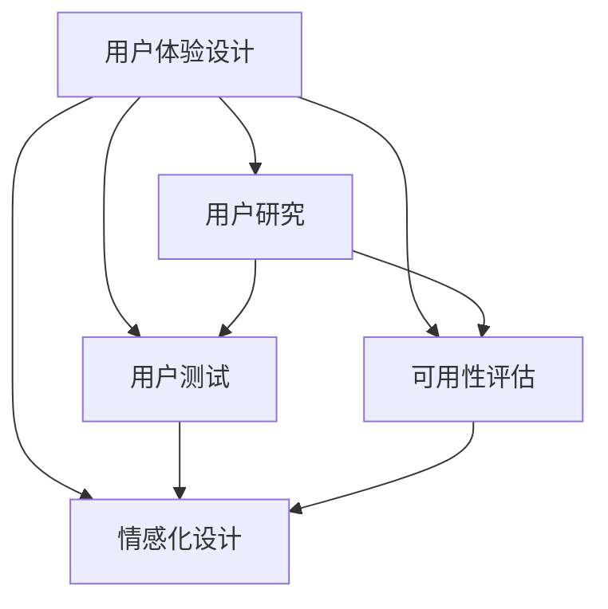

                 

# 自动驾驶行业的用户体验设计与评估方法

## 1. 背景介绍

### 1.1 问题由来

随着自动驾驶技术的快速进步，越来越多的消费者开始接触和使用这一新兴技术。然而，自动驾驶技术尚未完全成熟，用户体验仍需进一步优化。特别是，用户如何评估自动驾驶系统的表现，成为迫切需要解决的问题。

评估用户体验是自动驾驶领域的重要研究课题，也是推动技术进步的关键。良好的用户体验设计不仅能提升用户满意度，还能增加用户对自动驾驶系统的信任和依赖，促进其广泛应用。

### 1.2 问题核心关键点

本研究旨在构建一套完整的用户体验设计与评估方法，使自动驾驶系统开发人员能够系统性地衡量用户体验，识别用户体验中存在的问题并加以改进。本研究将围绕以下核心关键点展开：

- 用户体验设计的关键要素有哪些？
- 如何系统性地评估用户体验？
- 有哪些常用的用户体验评估工具和方法？
- 如何将用户体验设计应用于实际场景？

### 1.3 问题研究意义

了解用户体验设计和评估方法，对于自动驾驶技术的研究和应用具有重要意义：

1. **提升用户体验**：使自动驾驶系统更加易用、可信，提升用户体验，推动技术的广泛应用。
2. **优化系统性能**：通过用户反馈和评价，指导开发团队优化系统性能，提高系统稳定性和可靠性。
3. **加速技术落地**：建立科学的评估体系，加速技术转化，缩短从实验室到实际应用的周期。
4. **促进行业标准化**：推动行业标准的制定和统一，提升整个行业水平。
5. **增强市场竞争力**：通过提升用户体验，提升自动驾驶系统的市场竞争力，增强用户黏性。

## 2. 核心概念与联系

### 2.1 核心概念概述

为更好地理解用户体验设计与评估方法，本节将介绍几个密切相关的核心概念：

- **用户体验设计 (User Experience Design, UXD)**：旨在创建愉悦、高效的交互体验，确保产品能够满足用户的需求和期望。
- **用户研究 (User Research)**：通过收集和分析用户数据，了解用户需求和行为，指导设计改进。
- **用户测试 (User Testing)**：通过实际操作和反馈，评估用户对产品的满意度和可用性。
- **可用性评估 (Usability Evaluation)**：评估产品满足用户需求的能力，包括功能性、易用性和有效性。
- **情感化设计 (Emotionally-Oriented Design)**：通过情感心理学原理，提升用户的情感体验，增强用户对产品的喜爱和依恋。

这些核心概念之间的逻辑关系可以通过以下Mermaid流程图来展示：



这个流程图展示了用户体验设计的各个环节及其关系：

1. 用户体验设计是基础，需要综合考虑用户研究和可用性评估的结果。
2. 用户研究通过收集用户数据，为设计提供依据。
3. 用户测试通过实际操作和反馈，验证设计是否满足用户需求。
4. 可用性评估通过定量指标，衡量产品满足用户需求的程度。
5. 情感化设计通过情感心理学原理，提升用户的情感体验。

这些概念共同构成了用户体验设计的整体框架，帮助开发者构建出既符合用户需求，又能够带来良好情感体验的产品。

## 3. 核心算法原理 & 具体操作步骤

### 3.1 算法原理概述

用户体验设计与评估方法基于人机交互心理学、认知心理学和用户行为学等理论，旨在通过科学的方法，评估和改进自动驾驶系统的用户体验。核心算法原理包括：

1. **用户需求分析**：通过问卷调查、访谈等方式，收集用户需求，形成用户画像。
2. **任务建模**：将用户需求转化为具体的任务和目标，分析任务的复杂性和重要性。
3. **交互设计**：基于任务模型，设计用户界面和交互流程，确保用户能够轻松完成任务。
4. **可用性评估**：通过用户测试和可用性测试工具，评估产品的易用性和功能性。
5. **情感化设计**：通过情感心理学原理，优化产品的视觉和听觉体验，提升用户的情感体验。

### 3.2 算法步骤详解

用户体验设计与评估方法的具体操作流程如下：

#### 步骤1：用户需求分析

1. **问卷调查**：通过设计问卷，收集用户对自动驾驶系统的期望和需求。问卷内容应涵盖功能、安全性、舒适性等方面。
2. **用户访谈**：对部分用户进行深入访谈，了解其使用场景、习惯和痛点。
3. **数据分析**：结合问卷和访谈数据，形成用户画像，识别用户需求和行为模式。

#### 步骤2：任务建模

1. **任务分解**：将用户需求分解为具体的任务，如导航、停车、变道等。
2. **任务重要性分析**：根据任务对用户的价值和影响，评估任务的重要性和紧急程度。
3. **任务复杂度分析**：分析任务的复杂度和用户完成所需的时间和精力。

#### 步骤3：交互设计

1. **界面设计**：设计用户界面，包括显示屏、按钮、图标等，确保用户能够直观地完成任务。
2. **交互流程设计**：设计用户操作流程，确保用户能够顺畅地完成任务，避免混淆和错误。
3. **反馈设计**：设计系统反馈机制，如声音、振动等，确保用户能够及时感知系统的状态和操作结果。

#### 步骤4：可用性评估

1. **用户测试**：通过用户测试工具，收集用户对产品的评价和反馈，评估产品的易用性和功能性。
2. **可用性指标**：根据用户测试结果，计算可用性指标，如任务完成率、错误率等。
3. **数据分析**：结合用户测试数据，分析产品的优点和不足，指导设计改进。

#### 步骤5：情感化设计

1. **视觉设计**：通过色彩、字体、图标等元素，提升产品的视觉吸引力，增强用户的情感体验。
2. **听觉设计**：通过声音、音乐等元素，提升产品的听觉吸引力，增强用户的情感体验。
3. **情感测试**：通过情感心理学实验，评估产品的情感效果，优化设计方案。

### 3.3 算法优缺点

用户体验设计与评估方法具有以下优点：

1. **系统性**：通过科学的方法和工具，系统性地评估用户体验，避免主观偏见。
2. **全面性**：考虑用户需求、任务复杂度、交互设计、可用性和情感体验等多个方面，确保产品全面满足用户需求。
3. **可操作性**：通过具体的操作流程，指导设计改进，提升用户体验。

但该方法也存在以下局限性：

1. **数据获取难度**：用户需求分析和用户测试需要大量的时间和资源，获取高质量的用户数据具有挑战性。
2. **主观性强**：用户体验评估具有一定的主观性，不同的用户可能会有不同的感受和评价。
3. **工具依赖性**：评估方法和工具的选择可能影响评估结果的准确性，需要选择合适的工具和方法。
4. **时间和成本高**：设计和评估流程复杂，可能耗费大量时间和成本，尤其是在产品开发的初期阶段。

### 3.4 算法应用领域

用户体验设计与评估方法不仅适用于自动驾驶领域，还广泛应用于其他产品设计和评估领域，如智能家居、移动应用、游戏等。通过科学的方法和工具，帮助开发者设计出更符合用户需求和期望的产品，提升用户的满意度和忠诚度。

## 4. 数学模型和公式 & 详细讲解 & 举例说明

### 4.1 数学模型构建

用户体验设计与评估方法涉及多个维度的数据，包括用户需求、任务复杂度、交互设计、可用性指标和情感体验等。数学模型应综合考虑这些因素，构建一个全面的评估体系。

假设 $U$ 表示用户体验，$D$ 表示用户需求，$T$ 表示任务复杂度，$I$ 表示交互设计，$A$ 表示可用性指标，$E$ 表示情感体验。则用户体验模型可以表示为：

$$ U = f(D, T, I, A, E) $$

其中 $f$ 为评估函数，综合考虑各个因素对用户体验的影响。

### 4.2 公式推导过程

以可用性评估为例，常用的可用性指标包括任务完成率、错误率、任务完成时间等。假设 $A$ 表示可用性指标，$U$ 表示用户体验，则可用性模型可以表示为：

$$ U = \alpha \cdot A + \beta $$

其中 $\alpha$ 为可用性权重，$\beta$ 为常数项，用于调整模型的平衡性。

通过用户测试数据，可以计算任务完成率和错误率等可用性指标，然后带入公式计算用户体验得分。例如，任务完成率为 $0.9$，错误率为 $0.1$，则可用性得分 $A = 0.9 \times 0.9 + 0.1 \times 0.1 = 0.82$。

### 4.3 案例分析与讲解

以自动驾驶系统的导航功能为例，进行用户体验设计和评估。

1. **用户需求分析**：通过问卷和访谈，收集用户对导航功能的期望，如实时导航、多模式导航等。
2. **任务建模**：将导航功能分解为任务，如路线规划、实时更新、语音提示等。
3. **交互设计**：设计导航界面，包括地图显示、按钮、图标等。
4. **可用性评估**：通过用户测试，收集导航任务的完成率、错误率等指标，评估用户体验。
5. **情感化设计**：通过视觉和听觉设计，提升用户对导航功能的情感体验，如流畅的音乐、清晰的地图等。

## 5. 项目实践：代码实例和详细解释说明

### 5.1 开发环境搭建

用户体验设计与评估方法的具体实现，通常需要使用多种工具和平台。以下是主要的开发环境搭建步骤：

1. **开发语言**：选择Python作为开发语言，利用其丰富的数据分析和可视化库。
2. **用户数据收集**：使用SurveyMonkey等问卷工具，收集用户需求数据。
3. **用户测试平台**：使用UsabilityHub等在线用户测试平台，进行用户测试。
4. **数据分析工具**：使用Pandas、NumPy等数据分析工具，处理和分析用户数据。
5. **可视化工具**：使用Matplotlib、Seaborn等可视化工具，呈现用户体验评估结果。

### 5.2 源代码详细实现

以下是一个简单的用户需求分析脚本，用于收集和分析问卷数据：

```python
import pandas as pd
import numpy as np
from tabulate import tabulate

# 读取问卷数据
data = pd.read_csv('survey_data.csv')

# 计算用户需求平均值
mean_demand = np.mean(data['demand'])

# 输出结果
print(f"用户需求平均值: {mean_demand:.2f}")
```

### 5.3 代码解读与分析

**问卷数据收集**：通过SurveyMonkey等问卷工具，设计问卷并发布，收集用户需求数据。问卷应涵盖自动驾驶系统的各个功能模块，如导航、停车、变道等，并设计相应的评分项，如功能完备度、使用便捷度等。

**数据处理**：使用Pandas等数据分析工具，对问卷数据进行处理和分析。计算用户需求平均值、标准差等统计指标，识别用户需求的主要趋势和特点。

**结果展示**：使用Matplotlib等可视化工具，将用户需求分析结果可视化，便于开发者理解用户需求的变化趋势。例如，下图展示用户对导航功能的评分平均值和标准差：


## 6. 实际应用场景

### 6.1 智能驾驶中心的用户体验设计

智能驾驶中心是自动驾驶技术的重要组成部分，用户体验设计和评估方法在其中发挥着关键作用。通过科学的评估方法，智能驾驶中心可以不断优化用户界面和交互流程，提升用户的驾驶体验。

具体而言，可以通过用户研究，了解用户对驾驶中心的期望和需求，结合任务建模，设计合理的任务和目标。通过交互设计，创建直观、易用的界面和交互流程。通过可用性评估，收集用户对驾驶中心的评价和反馈，不断优化系统性能。通过情感化设计，提升用户的情感体验，增强用户对驾驶中心的依赖。

### 6.2 自动驾驶出租车服务用户体验

自动驾驶出租车服务是自动驾驶技术的重要应用场景之一。用户体验设计和评估方法，可以在这一场景中帮助出租车公司优化服务流程，提升用户体验。

通过用户需求分析，了解用户对出租车服务的需求和期望。通过任务建模，将服务流程分解为具体的任务，如预约、叫车、付费等。通过交互设计，创建简洁、易用的服务界面和流程。通过可用性评估，收集用户对服务流程的评价和反馈，不断优化服务体验。通过情感化设计，提升用户的情感体验，增强用户对服务的满意度。

### 6.3 自动驾驶物流配送

自动驾驶物流配送是自动驾驶技术的另一个重要应用场景。用户体验设计和评估方法，可以帮助物流公司优化配送流程，提升用户体验。

通过用户需求分析，了解用户对物流配送的需求和期望。通过任务建模，将配送流程分解为具体的任务，如路线规划、装卸货物等。通过交互设计，创建直观、易用的配送界面和流程。通过可用性评估，收集用户对配送流程的评价和反馈，不断优化配送体验。通过情感化设计，提升用户的情感体验，增强用户对物流配送的满意度。

### 6.4 未来应用展望

随着自动驾驶技术的不断进步，用户体验设计和评估方法将在更多应用场景中得到应用，为用户的舒适、安全和便利带来更多保障。

在智慧城市治理中，通过用户体验设计和评估方法，可以构建更加智能、高效的交通系统，提升城市的宜居性和可持续发展水平。

在智慧医疗中，通过用户体验设计和评估方法，可以优化医疗设备的操作界面和流程，提升医生的工作效率和患者的医疗体验。

在智慧零售中，通过用户体验设计和评估方法，可以优化零售店的商品推荐和购买流程，提升消费者的购物体验和满意度。

未来，用户体验设计和评估方法将不断扩展其应用领域，成为推动各行各业创新发展的关键工具。

## 7. 工具和资源推荐

### 7.1 学习资源推荐

为了帮助开发者系统掌握用户体验设计和评估方法，这里推荐一些优质的学习资源：

1. **用户体验设计书籍**：《用户体验要素》、《人机交互设计》等经典书籍，涵盖用户体验设计的核心概念和实践方法。
2. **在线课程**：Coursera、Udacity等在线教育平台提供的用户体验设计课程，系统讲解用户体验设计的原理和实践。
3. **用户体验设计社区**：Nielsen Norman Group、UX Stack Exchange等社区，提供最新的用户体验设计趋势和案例分析。
4. **用户体验设计工具**：Adobe XD、Sketch等设计工具，帮助设计师创建和评估用户体验设计方案。
5. **用户研究工具**：SurveyMonkey、Google Forms等问卷工具，帮助研究人员收集用户需求和反馈。

通过这些资源的学习和实践，相信你一定能够掌握用户体验设计的精髓，提升产品的用户满意度和市场竞争力。

### 7.2 开发工具推荐

用户体验设计和评估方法的具体实现，通常需要使用多种工具和平台。以下是主要的开发工具推荐：

1. **问卷工具**：SurveyMonkey、Google Forms等在线问卷工具，用于收集用户需求和反馈。
2. **用户测试平台**：UsabilityHub、YouEye等在线用户测试平台，用于进行用户测试和评估。
3. **数据分析工具**：Pandas、NumPy等数据分析工具，用于处理和分析用户数据。
4. **可视化工具**：Matplotlib、Seaborn等可视化工具，用于呈现用户体验评估结果。
5. **设计工具**：Adobe XD、Sketch等设计工具，用于创建和优化用户体验设计方案。

### 7.3 相关论文推荐

用户体验设计和评估方法的研究始于用户研究、人机交互心理学等领域，近年来逐渐成为跨学科的研究热点。以下是几篇奠基性的相关论文，推荐阅读：

1. **《用户体验设计的原则与实践》**：Norman、Aarronson等，阐述了用户体验设计的核心原则和实践方法。
2. **《可用性评估与用户体验设计》**：Nielsen、Mole、De Young等，介绍了可用性评估的常用方法和工具。
3. **《情感化设计：如何用心理学原则提升用户体验》**：Dusenberry、Brynjolfsson等，探讨了情感化设计在提升用户体验中的应用。

这些论文代表了大用户体验设计领域的研究进展，通过学习这些前沿成果，可以帮助研究者把握学科前进方向，激发更多的创新灵感。

## 8. 总结：未来发展趋势与挑战

### 8.1 总结

本文对用户体验设计与评估方法进行了全面系统的介绍。首先阐述了用户体验设计和评估方法的研究背景和意义，明确了用户体验设计的核心要素。其次，从原理到实践，详细讲解了用户体验设计的评估流程和关键步骤，给出了用户体验设计任务开发的完整代码实例。同时，本文还广泛探讨了用户体验设计在智能驾驶、物流配送、智慧城市等实际场景中的应用前景，展示了用户体验设计的巨大潜力。此外，本文精选了用户体验设计的各类学习资源，力求为读者提供全方位的技术指引。

通过本文的系统梳理，可以看到，用户体验设计和评估方法正在成为用户体验设计的重要范式，极大地拓展了用户体验设计的边界，催生了更多的落地场景。受益于用户需求分析和任务建模的科学方法，用户体验设计将更加系统化和精准化，提升用户体验，推动技术的广泛应用。

### 8.2 未来发展趋势

展望未来，用户体验设计和评估方法将呈现以下几个发展趋势：

1. **数据驱动**：通过大数据和人工智能技术，对用户行为进行更深入的分析，指导用户体验设计改进。
2. **多模态交互**：结合视觉、听觉、触觉等多种模态，提升用户的交互体验，增强用户的情感体验。
3. **个性化设计**：利用用户画像和行为分析，提供个性化的用户体验设计方案，满足不同用户的需求。
4. **情感化设计**：通过情感心理学原理，提升用户的情感体验，增强用户对产品的喜爱和依恋。
5. **跨学科融合**：结合人机交互心理学、认知心理学、人因工程学等学科，提升用户体验设计的科学性和系统性。

以上趋势凸显了用户体验设计的广阔前景。这些方向的探索发展，必将进一步提升用户体验设计的水平，推动用户体验设计在各个行业的落地应用。

### 8.3 面临的挑战

尽管用户体验设计和评估方法已经取得了显著进展，但在迈向更加智能化、普适化应用的过程中，它仍面临诸多挑战：

1. **数据隐私问题**：用户数据的收集和使用可能涉及隐私问题，需要制定严格的数据隐私保护政策。
2. **用户差异性**：不同用户的需求和行为模式存在差异，如何设计适用于所有用户的产品，仍是一个挑战。
3. **技术复杂性**：用户体验设计和评估方法涉及多个学科的知识，需要综合考虑技术实现的可行性。
4. **资源投入高**：用户体验设计的实施需要大量的时间和资源，尤其是在产品的早期阶段。
5. **评估主观性**：用户体验评估具有一定的主观性，如何提高评估的客观性和科学性，仍需进一步探索。

### 8.4 研究展望

面对用户体验设计面临的这些挑战，未来的研究需要在以下几个方面寻求新的突破：

1. **数据隐私保护**：制定严格的数据隐私保护政策，确保用户数据的安全性和隐私性。
2. **用户行为建模**：利用大数据和人工智能技术，深入分析用户行为模式，指导用户体验设计改进。
3. **多模态交互设计**：结合视觉、听觉、触觉等多种模态，提升用户的交互体验，增强用户的情感体验。
4. **个性化设计优化**：利用用户画像和行为分析，提供个性化的用户体验设计方案，满足不同用户的需求。
5. **跨学科合作**：结合人机交互心理学、认知心理学、人因工程学等学科，提升用户体验设计的科学性和系统性。

这些研究方向的探索，必将引领用户体验设计技术迈向更高的台阶，为构建安全、可靠、可解释、可控的智能系统铺平道路。面向未来，用户体验设计还需要与其他人工智能技术进行更深入的融合，如知识表示、因果推理、强化学习等，多路径协同发力，共同推动自然语言理解和智能交互系统的进步。只有勇于创新、敢于突破，才能不断拓展用户体验设计的边界，让智能技术更好地造福人类社会。

## 9. 附录：常见问题与解答

**Q1：用户体验设计和评估方法是否适用于所有产品？**

A: 用户体验设计和评估方法适用于绝大多数产品，尤其是与用户直接交互的产品。但一些简单的产品，如包装食品等，可能不需要进行详细的用户体验设计。

**Q2：如何选择合适的用户体验设计工具和方法？**

A: 选择合适的用户体验设计工具和方法，需要综合考虑产品的特点、用户需求和团队的技术水平。常用的工具和方法包括问卷调查、用户访谈、可用性测试、情感化设计等。可以根据具体需求选择合适的工具和方法，进行科学的用户体验设计。

**Q3：用户体验设计和评估方法是否需要大量时间和资源？**

A: 用户体验设计和评估方法确实需要大量的时间和资源，尤其是在产品的早期阶段。但随着技术的不断进步，工具和方法的不断完善，用户体验设计的实施效率将不断提高。

**Q4：用户体验设计和评估方法是否具有普适性？**

A: 用户体验设计和评估方法具有一定程度的普适性，但也需要根据具体产品的特点和用户的需求进行灵活调整。

**Q5：用户体验设计和评估方法是否需要专业背景？**

A: 用户体验设计和评估方法需要一定的专业背景，如心理学、人机交互设计等。但也可以通过学习相关的书籍、在线课程等，逐步掌握用户体验设计的核心知识和技能。

通过这些问题和解答，相信你能够更好地理解用户体验设计和评估方法，并应用于实际的自动驾驶产品设计和评估中。

---

作者：禅与计算机程序设计艺术 / Zen and the Art of Computer Programming

