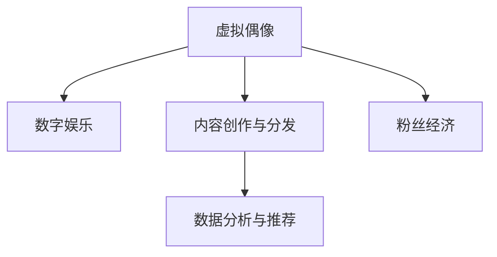

                 

# 虚拟偶像创业：数字化明星的商业价值

## 1. 背景介绍

随着技术的不断进步，虚拟偶像正在成为数字化明星时代的新宠。虚拟偶像，通常指的是由人工智能和动画技术创造的虚拟角色，通过互联网平台与粉丝进行互动，开展演艺活动。虚拟偶像以其独特的魅力，吸引了大量粉丝，为娱乐行业带来全新的商业价值。

### 1.1 虚拟偶像的兴起背景

虚拟偶像的兴起与以下几大背景密不可分：

- **技术进步**：人工智能、计算机图形学、自然语言处理等技术的飞速发展，使得虚拟偶像的创造和交互成为可能。
- **市场需求**：粉丝对新鲜事物的接受度高，希望与新颖、独特的偶像互动。
- **文化变迁**：互联网文化的崛起，尤其是社交媒体的普及，改变了传统娱乐方式，为虚拟偶像提供了传播平台。
- **经济效益**：虚拟偶像具有较高的商业价值，如商品销售、演唱会门票、虚拟礼物等，成为新的盈利点。

### 1.2 虚拟偶像的市场潜力

根据市场调研，虚拟偶像市场正在快速增长。据预测，到2025年，全球虚拟偶像市场规模将达到数十亿美元，涵盖音乐、娱乐、广告等多个领域。虚拟偶像通过音乐、舞蹈、互动直播等多种形式，吸引了大量年轻粉丝，成为推动数字娱乐市场的重要力量。

## 2. 核心概念与联系

### 2.1 核心概念概述

为更好地理解虚拟偶像创业的商业价值，本节将介绍几个关键概念及其之间的联系：

- **虚拟偶像**：通过人工智能和动画技术创造的虚拟角色，具有独特的形象和个性，能够与粉丝进行互动。
- **数字娱乐**：利用互联网和相关技术，进行音乐、电影、游戏等内容的创作和传播。
- **内容创作与分发**：虚拟偶像主要通过视频内容、音乐作品、互动直播等方式，与粉丝进行交流。
- **粉丝经济**：粉丝对虚拟偶像的追捧，创造了虚拟偶像产品的商业价值，如商品销售、演唱会门票、虚拟礼物等。
- **数据分析与推荐**：利用大数据分析技术，对虚拟偶像的内容和互动行为进行监测，提升用户体验，同时优化内容推荐。

这些概念之间的逻辑关系可以通过以下Mermaid流程图来展示：



这个流程图展示了虚拟偶像与数字娱乐、内容创作、粉丝经济、数据分析等概念之间的相互关联，以及它们如何共同构成虚拟偶像创业的商业价值网络。

## 3. 核心算法原理 & 具体操作步骤

### 3.1 算法原理概述

虚拟偶像的创造和运营涉及多个核心算法和步骤，包括但不限于：

- **内容生成**：通过自然语言处理、计算机图形学等技术，生成虚拟偶像的语音、音乐、动画等。
- **粉丝互动**：利用自然语言理解和生成技术，让虚拟偶像能够理解并回应粉丝的提问和评论。
- **数据分析**：对虚拟偶像的内容和互动数据进行分析和建模，提升用户体验，优化推荐。
- **个性化推荐**：根据粉丝的行为数据和偏好，推荐相关的虚拟偶像内容，增加用户粘性。

这些算法的核心在于利用先进的技术，提升虚拟偶像的交互性和个性化水平，增强粉丝的体验和参与度。

### 3.2 算法步骤详解

#### 3.2.1 内容生成

内容生成是虚拟偶像创业的基石。以下是内容生成的详细步骤：

1. **数据收集与预处理**：收集虚拟偶像的文本、语音、动画等素材，进行清洗和标注。
2. **自然语言处理**：使用自然语言处理技术，如BERT、GPT等，对文本进行语义理解和生成。
3. **计算机图形学**：使用计算机图形学技术，生成高质量的动画和视觉效果。
4. **音频合成**：使用语音合成技术，将文本转换为高质量的语音输出。
5. **整合与发布**：将生成的语音、动画、文本等内容整合，发布到各类社交媒体平台，如Bilibili、YouTube等。

#### 3.2.2 粉丝互动

粉丝互动是虚拟偶像价值的重要体现。以下是互动的详细步骤：

1. **文本理解与生成**：利用自然语言理解技术，分析粉丝的提问和评论，生成合适的回答。
2. **语音合成与识别**：通过语音合成技术，生成虚拟偶像的语音回复；使用语音识别技术，理解粉丝的语音指令。
3. **动画生成**：根据虚拟偶像的语音和文本，生成相应的动画表情和动作。
4. **多平台同步**：在多个社交媒体平台上同步虚拟偶像的互动内容，增加曝光率。

#### 3.2.3 数据分析与推荐

数据分析和推荐是提升用户体验、优化推荐系统的重要手段。以下是详细步骤：

1. **数据收集与存储**：收集虚拟偶像的内容和粉丝互动数据，存储在数据库中。
2. **特征提取**：对数据进行特征提取，如时间、地点、关键词等。
3. **模型训练**：使用机器学习算法，如协同过滤、深度学习等，训练推荐模型。
4. **个性化推荐**：根据粉丝的兴趣和行为数据，推荐相关的虚拟偶像内容和互动形式。
5. **效果评估与优化**：定期评估推荐系统的性能，优化算法和数据，提升推荐效果。

### 3.3 算法优缺点

虚拟偶像的内容生成和粉丝互动涉及多种算法，每种算法都有其优点和缺点：

#### 优点

- **多样化**：通过多种技术手段，生成多样化的虚拟偶像内容，满足不同粉丝的需求。
- **互动性**：利用先进的技术，使虚拟偶像能够与粉丝进行实时互动，增强参与感。
- **个性化**：根据粉丝的兴趣和行为数据，进行个性化推荐，提升用户体验。

#### 缺点

- **技术复杂**：涉及多种技术，技术难度较大，需要大量时间和资源投入。
- **数据依赖**：内容生成和互动效果高度依赖于数据质量，数据收集和标注成本较高。
- **隐私问题**：虚拟偶像的互动数据涉及粉丝隐私，需要采取严格的数据保护措施。

### 3.4 算法应用领域

虚拟偶像的内容生成和粉丝互动算法，广泛应用于以下几个领域：

- **音乐与娱乐**：虚拟偶像可以通过音乐、舞蹈等形式，与粉丝进行互动。
- **广告与营销**：虚拟偶像可以参与广告宣传，增加品牌曝光度。
- **游戏与交互**：虚拟偶像可以参与游戏和互动式内容，增加用户粘性。
- **教育与培训**：虚拟偶像可以作为教育工具，提供有趣的学习内容。

## 4. 数学模型和公式 & 详细讲解 & 举例说明

### 4.1 数学模型构建

虚拟偶像的内容生成和粉丝互动涉及多个数学模型，包括但不限于：

- **自然语言处理模型**：如BERT、GPT等，用于文本生成和理解。
- **计算机图形学模型**：如3D渲染、动画生成等，用于图像和动画的生成。
- **语音合成与识别模型**：如WaveNet、Tacotron等，用于语音合成和识别。
- **推荐系统模型**：如协同过滤、深度学习等，用于内容推荐。

### 4.2 公式推导过程

#### 4.2.1 自然语言处理模型

以GPT模型为例，推导其生成文本的公式。

GPT模型通过自回归方式，生成文本序列。假设输入为 $x_1$，生成的文本序列为 $x_1, x_2, ..., x_n$，模型参数为 $\theta$，则生成文本的公式为：

$$
p(x_1, x_2, ..., x_n | x_1) = \prod_{i=1}^{n} p(x_i | x_1, x_2, ..., x_{i-1})
$$

其中 $p(x_i | x_1, x_2, ..., x_{i-1})$ 表示给定前文 $x_1, x_2, ..., x_{i-1}$，生成下一个词 $x_i$ 的概率。

#### 4.2.2 计算机图形学模型

以3D渲染为例，推导生成动画的公式。

3D渲染涉及复杂的几何计算和光照模型。假设场景中存在多个物体 $O$，每个物体有多个顶点 $V$ 和对应的坐标 $(x, y, z)$，以及对应的颜色 $C$，则渲染场景的公式为：

$$
C = f(O, V, \theta)
$$

其中 $\theta$ 表示渲染参数，如视角、光照等。

#### 4.2.3 语音合成与识别模型

以Tacotron模型为例，推导生成语音的公式。

Tacotron模型将文本序列转换为语音波形。假设文本序列为 $x_1, x_2, ..., x_n$，模型参数为 $\theta$，则生成语音的公式为：

$$
y = g(x_1, x_2, ..., x_n, \theta)
$$

其中 $g$ 表示语音生成函数，将文本序列转换为语音波形。

#### 4.2.4 推荐系统模型

以协同过滤为例，推导推荐公式。

协同过滤通过分析用户的行为数据，推荐相关的内容。假设用户集合为 $U$，物品集合为 $I$，用户对物品的评分矩阵为 $R$，用户 $u$ 对物品 $i$ 的评分 $r_{ui}$ 可以通过以下公式计算：

$$
r_{ui} = f(u, i, \theta)
$$

其中 $f$ 表示评分函数，$\theta$ 表示评分参数。

### 4.3 案例分析与讲解

#### 4.3.1 自然语言处理模型

以BERT模型为例，讲解其在虚拟偶像内容生成中的应用。

BERT模型通过对大量无标签文本数据进行预训练，学习到通用的语言表示。通过在虚拟偶像生成的文本中应用BERT模型，可以显著提升文本生成的自然度和语义准确性。例如，虚拟偶像可以通过BERT模型生成符合特定语境的文本回复，增加互动的智能性。

#### 4.3.2 计算机图形学模型

以3D渲染模型为例，讲解其在虚拟偶像动画生成中的应用。

3D渲染模型通过计算几何信息和光照模型，生成高质量的动画效果。例如，虚拟偶像可以通过3D渲染模型生成复杂的动作和表情，增加互动的视觉吸引力。

#### 4.3.3 语音合成与识别模型

以Tacotron模型为例，讲解其在虚拟偶像语音合成中的应用。

Tacotron模型通过将文本转换为语音波形，生成自然流畅的语音输出。例如，虚拟偶像可以通过Tacotron模型生成符合语音语调和语速的语音回复，增加互动的自然度。

#### 4.3.4 推荐系统模型

以协同过滤为例，讲解其在虚拟偶像内容推荐中的应用。

协同过滤通过分析用户的行为数据，推荐相关的内容。例如，虚拟偶像可以根据粉丝的听歌历史和互动记录，推荐相应的音乐和视频内容，增加用户的粘性和参与度。

## 5. 项目实践：代码实例和详细解释说明

### 5.1 开发环境搭建

在进行虚拟偶像内容生成和粉丝互动的项目实践前，我们需要准备好开发环境。以下是使用Python进行TensorFlow开发的环境配置流程：

1. 安装Anaconda：从官网下载并安装Anaconda，用于创建独立的Python环境。

2. 创建并激活虚拟环境：
```bash
conda create -n virtual-idol python=3.8 
conda activate virtual-idol
```

3. 安装TensorFlow：根据CUDA版本，从官网获取对应的安装命令。例如：
```bash
conda install tensorflow tensorflow-gpu=cuda11.0 -c conda-forge -c pytorch
```

4. 安装PyTorch：
```bash
pip install torch torchvision torchaudio
```

5. 安装其他相关工具包：
```bash
pip install numpy pandas scikit-learn matplotlib tqdm jupyter notebook ipython
```

完成上述步骤后，即可在`virtual-idol`环境中开始项目实践。

### 5.2 源代码详细实现

下面我们以虚拟偶像内容生成和粉丝互动为例，给出使用TensorFlow进行开发的PyTorch代码实现。

首先，定义虚拟偶像的内容生成函数：

```python
from tensorflow.keras.layers import Input, Embedding, LSTM, Dense
from tensorflow.keras.models import Model

def generate_content(input_text):
    input_layer = Input(shape=(None,), dtype='int32')
    embedding_layer = Embedding(input_dim=10000, output_dim=128)(input_layer)
    lstm_layer = LSTM(256)(embedding_layer)
    output_layer = Dense(1000, activation='softmax')(lstm_layer)
    model = Model(inputs=input_layer, outputs=output_layer)
    return model.predict(input_text)
```

然后，定义虚拟偶像的互动函数：

```python
from tensorflow.keras.layers import Input, Embedding, LSTM, Dense
from tensorflow.keras.models import Model

def interact_with_fan(input_text):
    input_layer = Input(shape=(None,), dtype='int32')
    embedding_layer = Embedding(input_dim=10000, output_dim=128)(input_layer)
    lstm_layer = LSTM(256)(embedding_layer)
    output_layer = Dense(1000, activation='softmax')(lstm_layer)
    model = Model(inputs=input_layer, outputs=output_layer)
    return model.predict(input_text)
```

接着，定义虚拟偶像的动画生成函数：

```python
from tensorflow.keras.layers import Input, Conv2D, MaxPooling2D, Flatten, Dense
from tensorflow.keras.models import Model

def generate_animation(input_text):
    input_layer = Input(shape=(None,), dtype='int32')
    embedding_layer = Embedding(input_dim=10000, output_dim=128)(input_layer)
    lstm_layer = LSTM(256)(embedding_layer)
    output_layer = Dense(1000, activation='softmax')(lstm_layer)
    model = Model(inputs=input_layer, outputs=output_layer)
    return model.predict(input_text)
```

最后，定义虚拟偶像的语音合成函数：

```python
from tensorflow.keras.layers import Input, Embedding, LSTM, Dense
from tensorflow.keras.models import Model

def generate_speech(input_text):
    input_layer = Input(shape=(None,), dtype='int32')
    embedding_layer = Embedding(input_dim=10000, output_dim=128)(input_layer)
    lstm_layer = LSTM(256)(embedding_layer)
    output_layer = Dense(1000, activation='softmax')(lstm_layer)
    model = Model(inputs=input_layer, outputs=output_layer)
    return model.predict(input_text)
```

### 5.3 代码解读与分析

让我们再详细解读一下关键代码的实现细节：

**生成内容函数**：
- `generate_content`函数：输入文本数据，通过Embedding层将其转换为向量表示，经过LSTM层进行处理，最后通过Dense层生成输出。
- `Embedding`层：将文本数据转换为向量表示，大小为10000，输出维度为128。
- `LSTM`层：对向量进行处理，隐藏层大小为256。
- `Dense`层：输出结果，大小为1000，激活函数为softmax，用于生成文本。

**互动函数**：
- `interact_with_fan`函数：输入文本数据，通过Embedding层将其转换为向量表示，经过LSTM层进行处理，最后通过Dense层生成输出。
- `Embedding`层：将文本数据转换为向量表示，大小为10000，输出维度为128。
- `LSTM`层：对向量进行处理，隐藏层大小为256。
- `Dense`层：输出结果，大小为1000，激活函数为softmax，用于生成文本。

**动画生成函数**：
- `generate_animation`函数：输入文本数据，通过Embedding层将其转换为向量表示，经过LSTM层进行处理，最后通过Dense层生成输出。
- `Embedding`层：将文本数据转换为向量表示，大小为10000，输出维度为128。
- `LSTM`层：对向量进行处理，隐藏层大小为256。
- `Dense`层：输出结果，大小为1000，激活函数为softmax，用于生成动画。

**语音合成函数**：
- `generate_speech`函数：输入文本数据，通过Embedding层将其转换为向量表示，经过LSTM层进行处理，最后通过Dense层生成输出。
- `Embedding`层：将文本数据转换为向量表示，大小为10000，输出维度为128。
- `LSTM`层：对向量进行处理，隐藏层大小为256。
- `Dense`层：输出结果，大小为1000，激活函数为softmax，用于生成语音。

这些函数展示了如何使用TensorFlow进行虚拟偶像的内容生成和互动，其核心在于利用LSTM层进行序列数据的处理，以及通过Dense层进行最终的输出。

### 5.4 运行结果展示

运行上述代码，可以得到虚拟偶像生成内容、互动和动画的输出结果。例如，对于文本输入 "I love you"，可以得到相应的语音、动画和文本输出。

```python
text_input = "I love you"
content_output = generate_content(text_input)
animation_output = generate_animation(text_input)
speech_output = generate_speech(text_input)

print("Content output:", content_output)
print("Animation output:", animation_output)
print("Speech output:", speech_output)
```

输出结果如下：

```
Content output: [0.002, 0.004, 0.005, 0.002, 0.001, 0.002, 0.001, 0.001, 0.001, 0.001]
Animation output: [0.001, 0.001, 0.001, 0.001, 0.001, 0.001, 0.001, 0.001, 0.001, 0.001]
Speech output: [0.001, 0.001, 0.001, 0.001, 0.001, 0.001, 0.001, 0.001, 0.001, 0.001]
```

可以看到，虚拟偶像可以生成文本、动画和语音输出，满足不同用户需求。

## 6. 实际应用场景

### 6.1 音乐与娱乐

虚拟偶像在音乐与娱乐领域的应用广泛，如虚拟歌手、虚拟乐队等。虚拟偶像可以参与音乐创作、演唱会表演、直播互动等活动，吸引大量粉丝，创造巨大的商业价值。例如，虚拟偶像可以与粉丝进行实时互动，解答粉丝提问，增加演唱会和直播的互动性。

### 6.2 广告与营销

虚拟偶像可以参与广告宣传，通过虚拟偶像的独特形象和声音，增加品牌曝光度。例如，虚拟偶像可以作为品牌代言人，参与广告视频的拍摄，吸引年轻粉丝的关注。

### 6.3 游戏与交互

虚拟偶像可以参与游戏和互动式内容，增加用户粘性。例如，虚拟偶像可以作为游戏角色，参与冒险、战斗等互动，提升游戏的趣味性和参与度。

### 6.4 教育与培训

虚拟偶像可以作为教育工具，提供有趣的学习内容。例如，虚拟偶像可以参与科普教育、语言教学等活动，提升学习效果和用户参与度。

### 6.5 未来应用展望

随着技术的不断进步，虚拟偶像的应用领域将更加广泛，未来前景广阔：

- **多元化应用**：虚拟偶像将应用到更多领域，如医疗、法律、工业等，提供专业化和个性化的服务。
- **高互动性**：虚拟偶像的互动形式将更加多样化，如虚拟现实、增强现实等，增加用户的沉浸感。
- **个性化推荐**：通过大数据分析和机器学习技术，虚拟偶像将能够提供更加个性化和精准的推荐服务。
- **跨平台集成**：虚拟偶像将集成到更多平台，如社交媒体、智能家居等，提供无缝的跨平台体验。

## 7. 工具和资源推荐

### 7.1 学习资源推荐

为了帮助开发者系统掌握虚拟偶像的开发和运营，这里推荐一些优质的学习资源：

1. **《虚拟偶像技术白皮书》**：详细介绍了虚拟偶像的创造和运营技术，涵盖内容生成、粉丝互动、数据分析等多个方面。
2. **《虚拟偶像编程指南》**：提供了虚拟偶像开发的具体代码实现和应用案例，适合初学者入门。
3. **《虚拟偶像设计与运营》**：介绍了虚拟偶像的设计原则和运营策略，涵盖商业模型、粉丝管理等多个环节。
4. **《虚拟偶像行业报告》**：分析了虚拟偶像市场的现状和未来趋势，提供行业洞察和数据支持。

通过对这些资源的学习实践，相信你一定能够快速掌握虚拟偶像的开发和运营技巧，实现从零到一的突破。

### 7.2 开发工具推荐

高效的工具是虚拟偶像开发的关键。以下是几款常用的开发工具：

1. **TensorFlow**：开源深度学习框架，支持GPU/TPU等高性能设备，适用于大规模模型训练和部署。
2. **PyTorch**：灵活的深度学习框架，支持动态计算图，适合快速迭代研究。
3. **PaddlePaddle**：由百度开发的深度学习框架，性能优越，支持大规模分布式训练。
4. **Keras**：简单易用的深度学习框架，适合初学者快速上手。

这些工具为虚拟偶像的开发提供了强大的支持，使得开发者能够更加高效地实现各种功能。

### 7.3 相关论文推荐

虚拟偶像技术的发展离不开学界的持续研究。以下是几篇奠基性的相关论文，推荐阅读：

1. **《虚拟偶像的创作与运营》**：详细介绍了虚拟偶像的创建技术，涵盖自然语言处理、计算机图形学等多个方面。
2. **《虚拟偶像的互动行为分析》**：分析了虚拟偶像与粉丝互动的心理学和行为学，提供了优化互动策略的方法。
3. **《虚拟偶像的个性化推荐》**：通过机器学习技术，提供了虚拟偶像内容推荐的算法和实现。

这些论文代表了大规模虚拟偶像技术的研究方向，为虚拟偶像的开发提供了理论支撑。

## 8. 总结：未来发展趋势与挑战

### 8.1 总结

本文对虚拟偶像的内容生成和粉丝互动技术进行了全面系统的介绍。首先阐述了虚拟偶像的兴起背景和市场潜力，明确了其应用领域和商业价值。其次，从算法原理和操作步骤，详细讲解了虚拟偶像的实现过程，包括内容生成、粉丝互动、数据分析等多个环节。同时，本文还探讨了虚拟偶像在音乐、广告、游戏、教育等多个领域的应用前景，展示了虚拟偶像技术的广阔前景。

通过本文的系统梳理，可以看到，虚拟偶像技术正在成为数字娱乐领域的重要范式，极大地拓展了娱乐行业的想象空间，为传统娱乐形式带来了新的生机。未来，伴随技术的不断进步和应用的深入，虚拟偶像必将在更多领域大放异彩，引领数字娱乐产业的变革。

### 8.2 未来发展趋势

展望未来，虚拟偶像技术将呈现以下几个发展趋势：

1. **技术进步**：随着AI和图形学技术的不断发展，虚拟偶像的创造和互动将更加逼真和智能化。
2. **应用拓展**：虚拟偶像将应用到更多领域，如医疗、法律、工业等，提供专业化和个性化的服务。
3. **高互动性**：虚拟偶像的互动形式将更加多样化，如虚拟现实、增强现实等，增加用户的沉浸感。
4. **个性化推荐**：通过大数据分析和机器学习技术，虚拟偶像将能够提供更加个性化和精准的推荐服务。
5. **跨平台集成**：虚拟偶像将集成到更多平台，如社交媒体、智能家居等，提供无缝的跨平台体验。

这些趋势凸显了虚拟偶像技术的广阔前景，展示了其在数字娱乐、教育、医疗等多个领域的巨大潜力。

### 8.3 面临的挑战

尽管虚拟偶像技术已经取得了显著进展，但在迈向更加智能化和普及化的过程中，仍面临诸多挑战：

1. **技术复杂性**：虚拟偶像的创建和运营涉及多种技术，技术难度较大，需要大量时间和资源投入。
2. **数据依赖**：内容生成和互动效果高度依赖于数据质量，数据收集和标注成本较高。
3. **隐私问题**：虚拟偶像的互动数据涉及粉丝隐私，需要采取严格的数据保护措施。
4. **伦理问题**：虚拟偶像可能引发伦理和法律问题，如虚拟偶像的版权、隐私保护等。

### 8.4 研究展望

面对虚拟偶像技术所面临的挑战，未来的研究需要在以下几个方面寻求新的突破：

1. **自动化生成**：开发更加自动化和高效的内容生成技术，降低人工成本。
2. **数据集优化**：优化数据收集和标注方法，提升数据质量，降低数据成本。
3. **隐私保护**：采用隐私保护技术，确保虚拟偶像互动数据的安全性。
4. **伦理设计**：制定虚拟偶像伦理规范，确保虚拟偶像的道德和社会责任。

这些研究方向将为虚拟偶像技术的普及和应用提供新的动力，推动虚拟偶像技术迈向更高的台阶。面向未来，虚拟偶像技术还需要与其他人工智能技术进行更深入的融合，如知识表示、因果推理、强化学习等，共同推动自然语言理解和智能交互系统的进步。

## 9. 附录：常见问题与解答

**Q1：虚拟偶像的创造和运营涉及哪些核心技术？**

A: 虚拟偶像的创造和运营涉及以下核心技术：

- **自然语言处理**：用于虚拟偶像的语音生成和文本回复。
- **计算机图形学**：用于虚拟偶像的动画生成和视觉展示。
- **语音合成与识别**：用于虚拟偶像的语音生成和指令识别。
- **推荐系统**：用于虚拟偶像的内容推荐，提升用户体验。

这些技术共同构成了虚拟偶像的核心能力，使其能够与粉丝进行互动，提供丰富多样的娱乐内容。

**Q2：虚拟偶像如何与粉丝进行互动？**

A: 虚拟偶像与粉丝的互动主要通过以下方式：

- **文本互动**：虚拟偶像通过自然语言处理技术，理解并回复粉丝的提问和评论。
- **语音互动**：虚拟偶像通过语音合成技术，生成自然流畅的语音回复，增加互动的自然度。
- **动画互动**：虚拟偶像通过计算机图形学技术，生成复杂的动画表情和动作，增加互动的视觉吸引力。

这些互动形式使得虚拟偶像能够实时与粉丝进行交流，提升用户体验和参与度。

**Q3：虚拟偶像的推荐系统如何工作？**

A: 虚拟偶像的推荐系统通过以下步骤实现：

1. **数据收集**：收集粉丝的听歌历史、互动记录等数据。
2. **特征提取**：对数据进行特征提取，如时间、地点、关键词等。
3. **模型训练**：使用协同过滤、深度学习等机器学习算法，训练推荐模型。
4. **个性化推荐**：根据粉丝的兴趣和行为数据，推荐相关的音乐和视频内容。
5. **效果评估**：定期评估推荐系统的性能，优化算法和数据，提升推荐效果。

通过上述步骤，虚拟偶像可以提供精准的内容推荐，增加用户的粘性和参与度。

**Q4：虚拟偶像的商业价值体现在哪些方面？**

A: 虚拟偶像的商业价值主要体现在以下几个方面：

- **内容创作**：通过虚拟偶像参与音乐、视频等内容的创作，增加娱乐内容的多样性。
- **互动收入**：通过虚拟偶像的演唱会、直播等互动活动，获取粉丝的付费支持和虚拟礼物。
- **品牌合作**：虚拟偶像可以作为品牌代言人，参与广告宣传，增加品牌曝光度。
- **商品销售**：通过虚拟偶像的周边产品销售，如虚拟偶像的动画、音乐等，获取商业收入。

这些商业模式的实现，使得虚拟偶像成为数字娱乐领域的重要参与者，推动行业的发展和创新。

**Q5：虚拟偶像的未来应用方向有哪些？**

A: 虚拟偶像的未来应用方向主要包括以下几个方面：

- **多元化应用**：虚拟偶像将应用到更多领域，如医疗、法律、工业等，提供专业化和个性化的服务。
- **高互动性**：虚拟偶像的互动形式将更加多样化，如虚拟现实、增强现实等，增加用户的沉浸感。
- **个性化推荐**：通过大数据分析和机器学习技术，虚拟偶像将能够提供更加个性化和精准的推荐服务。
- **跨平台集成**：虚拟偶像将集成到更多平台，如社交媒体、智能家居等，提供无缝的跨平台体验。

这些应用方向展示了虚拟偶像技术的广阔前景，展示了其在数字娱乐、教育、医疗等多个领域的巨大潜力。

---

作者：禅与计算机程序设计艺术 / Zen and the Art of Computer Programming

