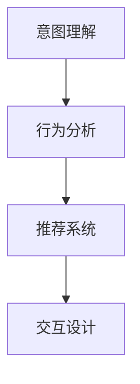

                 

## 1. 背景介绍

在过去的几十年里，电子商务的迅猛发展极大地改变了人们的生活方式。随着互联网技术、大数据、人工智能的不断进步，在线购物体验正在发生翻天覆地的变化。消费者不再仅依赖传统的搜索引擎和分类目录，而是通过更智能、更个性化的方式来发现和购买商品。虚拟导购助手（Virtual Shopping Assistant, VSA）作为这一趋势的产物，已经成为增强消费者购物体验的关键技术之一。VSA通过模拟导购员的角色，提供定制化、互动式的购物指导服务，不仅提升了用户的购物体验，也显著提高了零售商的销售效率。

### 1.1 问题由来

传统的在线购物体验依赖于搜索引擎和推荐算法，用户需要手动输入查询词，依靠搜索结果排序和推荐算法来找到符合需求的商品。但这种被动接受信息的方式无法满足用户对个性化、互动性购物体验的需求。人工智能技术的快速发展，尤其是自然语言处理（NLP）和计算机视觉（CV）技术的突破，为虚拟导购助手的实现提供了可能。虚拟导购助手可以通过分析用户的购物意图、行为和偏好，提供即时、个性化的购物建议和推荐，极大地改善了用户的购物体验。

### 1.2 问题核心关键点

虚拟导购助手的核心在于如何通过人工智能技术，实现对用户购物行为的精准理解和个性化推荐。具体来说，包括以下几个关键点：

1. **意图理解**：通过自然语言处理技术，理解用户的购物意图和需求。
2. **行为分析**：分析用户的浏览历史、购买记录等行为数据，识别用户的偏好和习惯。
3. **推荐系统**：结合用户意图、行为和商品属性，生成个性化的推荐列表。
4. **交互设计**：设计自然、流畅的用户交互界面，使用户能够轻松与虚拟助手进行对话。

### 1.3 问题研究意义

研究虚拟导购助手对于提升用户购物体验和优化零售商的销售策略具有重要意义：

1. **提升用户体验**：虚拟导购助手可以提供个性化的购物建议，减少用户的搜索时间，提高购物效率。
2. **优化销售策略**：通过分析用户行为数据，零售商可以制定更加精准的营销策略，提高销售额和客户满意度。
3. **促进电子商务发展**：虚拟导购助手的应用，促进了电子商务的智能化发展，推动了零售行业向个性化、互动化方向转型。

## 2. 核心概念与联系

### 2.1 核心概念概述

为了更好地理解虚拟导购助手的工作原理，我们首先需要明确几个核心概念：

1. **自然语言处理（NLP）**：使计算机能够理解、解释和生成人类语言的技术。
2. **计算机视觉（CV）**：使计算机能够处理、分析和理解视觉信息的领域。
3. **推荐系统**：利用用户行为数据和商品属性，生成个性化推荐的技术。
4. **用户意图理解**：通过分析用户的语言和行为，识别其购物意图和需求。
5. **行为分析**：从用户的浏览、购买等行为数据中，提取有价值的信息。
6. **交互设计**：设计用户友好的交互界面，使用户能够方便地与虚拟助手进行交流。

这些概念之间的联系可以通过以下Mermaid流程图来展示：



这个流程图展示了虚拟导购助手的工作流程：首先理解用户的意图，然后分析用户行为，接着根据用户需求和偏好生成推荐，最后通过交互设计提供个性化的购物建议。

## 3. 核心算法原理 & 具体操作步骤

### 3.1 算法原理概述

虚拟导购助手的核心算法原理是利用人工智能技术，对用户的购物意图和行为进行分析和理解，从而生成个性化的购物建议。该过程可以分为三个主要步骤：意图理解、行为分析和推荐生成。

1. **意图理解**：通过自然语言处理技术，分析用户的查询语言和行为，理解其购物需求。
2. **行为分析**：通过分析用户的浏览历史、购买记录等行为数据，识别其购物偏好和习惯。
3. **推荐生成**：结合用户意图、行为和商品属性，生成个性化的推荐列表。

### 3.2 算法步骤详解

以下我们将详细介绍虚拟导购助手的三个核心步骤。

**步骤1：意图理解**

意图理解是虚拟导购助手的第一步，也是关键的一步。通过意图理解，虚拟助手可以准确地识别用户的购物需求，提供个性化的购物建议。具体步骤如下：

1. **输入处理**：将用户的查询语言输入到自然语言处理模型中，得到词向量表示。
2. **实体识别**：使用命名实体识别技术，识别出查询中的关键实体，如商品名称、品牌等。
3. **意图分类**：将词向量输入到意图分类模型中，分类出用户的购物意图，如寻找商品、比较商品、购买商品等。

**步骤2：行为分析**

行为分析旨在通过分析用户的浏览历史和购买记录，识别其购物偏好和习惯。具体步骤如下：

1. **数据收集**：收集用户的浏览历史、购买记录、评价反馈等行为数据。
2. **特征提取**：从行为数据中提取有意义的特征，如商品类别、价格区间、购买频率等。
3. **模式识别**：使用机器学习算法，如聚类、分类等，识别用户的购物偏好和习惯。

**步骤3：推荐生成**

推荐生成是将用户的购物意图和行为分析结果与商品属性相结合，生成个性化的推荐列表。具体步骤如下：

1. **商品选择**：根据用户意图和行为分析结果，选择符合用户需求的商品。
2. **推荐排序**：使用推荐算法，如协同过滤、基于内容的推荐等，对商品进行排序。
3. **输出展示**：将排序后的商品列表展示给用户，并提供相关的商品属性和评价信息。

### 3.3 算法优缺点

虚拟导购助手具有以下优点：

1. **个性化推荐**：通过理解用户的意图和行为，提供个性化的购物建议，提高用户满意度。
2. **互动性增强**：通过自然语言处理技术，用户可以与虚拟助手进行自然、流畅的对话，提升用户体验。
3. **数据驱动**：利用用户行为数据，生成个性化的推荐，提高推荐效果。

同时，虚拟导购助手也存在一些缺点：

1. **依赖数据质量**：推荐效果依赖于用户行为数据的完整性和准确性，数据质量不佳会影响推荐效果。
2. **技术复杂**：实现虚拟导购助手需要多个技术领域的知识，技术难度较高。
3. **隐私问题**：需要收集和分析用户的浏览和购买行为数据，涉及隐私保护问题。

### 3.4 算法应用领域

虚拟导购助手在多个领域都有广泛的应用，以下是几个典型的应用场景：

1. **电商零售**：电商平台上常见的虚拟助手，如亚马逊的Alexa、淘宝的小蜜等。
2. **旅游服务**：旅游网站和应用中提供的虚拟助手，帮助用户规划旅行行程、预订酒店和机票等。
3. **金融服务**：金融应用中的虚拟助手，如支付宝的智能客服、银行的虚拟助手等。
4. **智能家居**：智能家居设备中的虚拟助手，如智能音箱、智能电视等。

## 4. 数学模型和公式 & 详细讲解 & 举例说明

### 4.1 数学模型构建

在虚拟导购助手的设计中，我们通常使用以下数学模型：

1. **意图理解模型**：使用词向量表示用户查询语言，通过意图分类模型识别用户意图。
2. **行为分析模型**：从用户行为数据中提取特征，使用分类或聚类算法识别用户偏好。
3. **推荐模型**：结合用户意图、行为和商品属性，使用推荐算法生成推荐列表。

### 4.2 公式推导过程

以意图理解模型为例，其基本流程如下：

1. **词向量表示**：将用户查询语言转换为词向量表示，使用预训练的词向量模型，如Word2Vec、GloVe等。
2. **意图分类**：将词向量输入到意图分类模型中，使用softmax函数计算每个类别的概率，选择概率最大的类别作为最终意图。

假设用户查询语言为 $x$，词向量表示为 $V_x$，意图分类模型为 $M$，意图分类后的概率向量为 $P$，则意图分类的公式为：

$$
P = \text{softmax}(M(V_x))
$$

其中，$M$ 为意图分类模型的权重矩阵，$V_x$ 为输入词向量的表示。

### 4.3 案例分析与讲解

假设一个用户在虚拟导购助手的输入界面中输入查询："我想找一件红色的连衣裙"。

1. **词向量表示**：将查询语言转换为词向量表示，假设得到向量 $V_x = [v_{'我'}, v_{'想'}, v_{'找'}, v_{'一件'}, v_{'红色的'}, v_{'连衣裙'}]$。
2. **意图分类**：将词向量输入到意图分类模型 $M$ 中，得到意图分类概率向量 $P = [p_{找}, p_{买}, p_{比价}]$，其中 $p_{找}$ 为最大的概率值。
3. **商品选择**：根据意图分类结果，选择与查询意图相关的商品，如连衣裙。
4. **推荐排序**：结合用户行为数据，生成个性化的推荐列表，并根据推荐算法对商品进行排序。

## 5. 项目实践：代码实例和详细解释说明

### 5.1 开发环境搭建

虚拟导购助手的开发环境搭建主要涉及以下几个步骤：

1. **安装Python**：下载并安装最新版本的Python，推荐使用Anaconda环境管理工具。
2. **安装依赖库**：安装虚拟导购助手开发所需的核心库，如TensorFlow、PyTorch、NLTK等。
3. **配置数据集**：准备用于意图理解、行为分析和推荐生成的数据集，包括用户查询、行为记录和商品信息等。

### 5.2 源代码详细实现

以下是虚拟导购助手的一个基本实现示例，包括意图理解、行为分析和推荐生成三个步骤：

```python
import tensorflow as tf
import numpy as np
from nltk.corpus import wordnet

# 意图理解
def intent_recognition(query):
    # 将查询语言转换为词向量表示
    word_vector = query.split()
    word_vector = [wordnet.synsets(word)[0] for word in word_vector]
    word_vector = [w.name() for w in word_vector]
    # 使用意图分类模型进行分类
    # ...
    return intent

# 行为分析
def user_behavior_analysis(user_data):
    # 从行为数据中提取特征
    # ...
    # 使用分类或聚类算法识别用户偏好
    # ...
    return user_preference

# 推荐生成
def product_recommendation(user_preference, product_data):
    # 根据用户偏好选择商品
    # ...
    # 使用推荐算法对商品进行排序
    # ...
    return recommended_products
```

### 5.3 代码解读与分析

上述代码实现了虚拟导购助手的基本逻辑，包括意图理解、行为分析和推荐生成三个主要步骤。

1. **意图理解**：将查询语言转换为词向量表示，并使用意图分类模型进行分类，返回意图类别。
2. **行为分析**：从用户行为数据中提取特征，并使用分类或聚类算法识别用户偏好，返回用户偏好。
3. **推荐生成**：根据用户偏好选择商品，并使用推荐算法对商品进行排序，返回推荐列表。

### 5.4 运行结果展示

在虚拟导购助手的实际应用中，推荐列表通常以网页、应用界面等形式展示给用户。用户可以根据推荐列表选择商品，并进行购买、评价等操作。

## 6. 实际应用场景

### 6.1 电商零售

在电商零售领域，虚拟导购助手已成为提升用户购物体验和销售效率的重要工具。例如，亚马逊的Alexa可以根据用户的查询语言，推荐相应的商品，并提供实时价格信息、用户评价等。

### 6.2 旅游服务

虚拟导购助手在旅游服务中也有广泛应用。用户可以通过语音或文字向虚拟助手咨询旅行信息，虚拟助手会提供个性化的行程建议、机票和酒店预订服务等。

### 6.3 金融服务

金融服务领域中，虚拟导购助手可以提供理财建议、账户管理、投资分析等服务。例如，支付宝的智能客服可以回答用户的查询，并提供个性化的理财产品推荐。

### 6.4 智能家居

智能家居设备中，虚拟导购助手可以提供家电控制、智能推荐等功能。例如，智能音箱可以通过语音命令，推荐电影、音乐、菜谱等信息。

## 7. 工具和资源推荐

### 7.1 学习资源推荐

为了帮助开发者系统掌握虚拟导购助手的实现技术，这里推荐一些优质的学习资源：

1. **《深度学习自然语言处理》**：斯坦福大学开设的NLP明星课程，涵盖自然语言处理的基本概念和前沿技术。
2. **《推荐系统实战》**：详细介绍推荐系统的基本原理和实现方法，并包含大量案例和实践代码。
3. **TensorFlow官方文档**：提供详细的TensorFlow库使用指南，包含大量的教程和代码示例。
4. **NLTK官方文档**：自然语言处理工具包NLTK的官方文档，包含丰富的NLP工具和示例代码。

### 7.2 开发工具推荐

虚拟导购助手的开发涉及多个技术领域的知识，选择合适的开发工具非常重要。以下是几款常用的开发工具：

1. **PyTorch**：基于Python的开源深度学习框架，适合快速迭代研究。
2. **TensorFlow**：由Google主导开发的开源深度学习框架，生产部署方便，适合大规模工程应用。
3. **NLTK**：自然语言处理工具包，提供了丰富的NLP工具和算法实现。
4. **Keras**：高级神经网络API，提供了简单易用的接口，适合初学者入门。

### 7.3 相关论文推荐

虚拟导购助手的研究涉及到自然语言处理、推荐系统等多个领域，以下是几篇具有代表性的相关论文：

1. **"Deep Collaborative Filtering Using Matrix Factorization Techniques"**：介绍协同过滤算法的原理和实现方法。
2. **"Semantic Analysis of Search Queries"**：介绍自然语言查询的语义分析技术，用于意图理解。
3. **"Adaptive Recommendations with Multi-armed Bandits"**：介绍多臂乐队算法在推荐系统中的应用，提高推荐效果。

## 8. 总结：未来发展趋势与挑战

### 8.1 总结

虚拟导购助手作为增强用户体验和优化零售商销售策略的重要技术，已经在多个领域得到了广泛应用。本文从原理到实践，详细讲解了虚拟导购助手的核心算法和操作步骤，并通过代码实例展示了其实现过程。通过本文的系统梳理，可以看到虚拟导购助手在提升用户购物体验和优化销售策略方面的巨大潜力。

### 8.2 未来发展趋势

展望未来，虚拟导购助手将呈现以下几个发展趋势：

1. **更智能的意图理解**：通过深度学习技术，进一步提升意图理解模型的准确性和泛化能力。
2. **更精准的行为分析**：结合用户数据和外部信息，提供更精准的用户行为分析和个性化推荐。
3. **跨领域应用拓展**：将虚拟导购助手的应用扩展到更多领域，如医疗、教育、金融等。
4. **增强的交互设计**：通过自然语言生成技术，提供更加自然、流畅的交互体验。
5. **联邦学习**：在保证用户隐私的前提下，实现跨机构数据共享和模型协作。

### 8.3 面临的挑战

尽管虚拟导购助手已经取得了显著的进展，但在实际应用中仍面临一些挑战：

1. **数据隐私保护**：用户在虚拟导购助手中留下的数据涉及隐私问题，如何保护用户隐私成为重要挑战。
2. **技术复杂性**：虚拟导购助手的实现涉及多个技术领域的知识，技术难度较高。
3. **推荐效果差异**：不同用户的购物需求和行为差异较大，如何提供个性化的推荐效果是一个难点。
4. **实时性要求高**：用户希望虚拟导购助手能够实时响应，这要求系统具有较高的计算和响应能力。
5. **用户体验优化**：如何设计更加自然、流畅的交互界面，提升用户的使用体验，是一个需要不断探索的问题。

### 8.4 研究展望

面对虚拟导购助手所面临的挑战，未来的研究需要在以下几个方面寻求新的突破：

1. **隐私保护技术**：研究联邦学习、差分隐私等技术，保护用户隐私的同时实现数据共享。
2. **智能意图理解**：结合深度学习技术，提升意图理解模型的准确性和泛化能力。
3. **跨领域推荐算法**：研究跨领域推荐算法，提升推荐的准确性和多样性。
4. **交互设计优化**：结合自然语言生成技术，提供更加自然、流畅的交互体验。
5. **实时响应技术**：研究高性能计算和分布式系统技术，提高虚拟导购助手的实时响应能力。

## 9. 附录：常见问题与解答

**Q1：虚拟导购助手如何理解用户的意图？**

A: 虚拟导购助手通过自然语言处理技术，将用户的查询语言转换为词向量表示，并使用意图分类模型识别用户的意图。常见的意图分类模型包括支持向量机、神经网络等。

**Q2：虚拟导购助手如何生成个性化推荐？**

A: 虚拟导购助手结合用户的意图、行为和商品属性，使用推荐算法生成个性化推荐列表。常见的推荐算法包括协同过滤、基于内容的推荐等。

**Q3：虚拟导购助手在实际应用中需要注意哪些问题？**

A: 虚拟导购助手在实际应用中需要注意隐私保护、技术复杂性、推荐效果差异、实时性要求和用户体验优化等问题。

**Q4：虚拟导购助手可以应用于哪些场景？**

A: 虚拟导购助手可以应用于电商零售、旅游服务、金融服务、智能家居等多个场景，为用户提供个性化、互动式的购物指导服务。

作者：禅与计算机程序设计艺术 / Zen and the Art of Computer Programming

