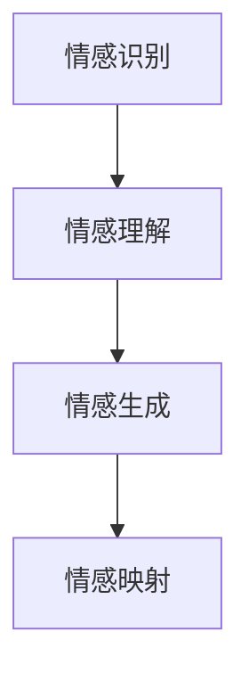

                 

# 虚拟情感地图：AI描绘的人类情感景观

## 1. 背景介绍

### 1.1 问题由来
随着人工智能技术的迅猛发展，AI在理解和表达人类情感方面的能力得到了极大的提升。越来越多的研究开始关注情感智能(Affective Intelligence)这一领域，希望通过AI技术绘制出一张虚拟情感地图，以更好地理解和表达人类复杂的情感状态。

情感智能是人工智能技术的重要分支，旨在使机器能够理解、表达和回应用户的情感状态。这一领域的研究不仅有助于改善人机交互的体验，还有助于提升心理健康、情感支持等应用的效果。近年来，随着深度学习、自然语言处理等技术的进步，情感智能研究取得了显著的进展，虚拟情感地图的绘制变得越来越可能。

### 1.2 问题核心关键点
情感智能的核心在于情感的识别、理解和表达。虚拟情感地图的绘制需要依赖于多个关键技术，包括但不限于：

- 情感识别：通过分析用户的文字、语音、面部表情等数据，识别出用户的情感状态。
- 情感理解：理解情感状态背后的动机、原因和上下文信息。
- 情感生成：根据用户的情感状态和需求，生成适当的情境回应或建议。
- 情感映射：将用户的情感状态映射到虚拟情感地图上，以可视化方式展示情感分布和变化。

本文章将详细介绍这些核心技术的原理、算法和实现方法，同时通过具体的代码实例和案例分析，帮助读者全面理解虚拟情感地图的绘制过程。

### 1.3 问题研究意义
研究虚拟情感地图的绘制，对于提升人机交互的情感共鸣、构建更加友好的用户界面、改善心理健康服务等方面具有重要意义。具体而言：

- 改善用户体验：通过精准的情感识别和理解，使机器能够更好地回应用户情感，提升用户满意度和交互体验。
- 增强情感支持：在心理咨询、情感支持等应用中，通过情感智能技术的辅助，提高服务效果和用户依存度。
- 推动情感健康：通过对情感状态的持续监测和分析，及早发现和预防心理健康问题，提供及时的情感支持和干预。
- 促进跨文化交流：通过理解不同文化背景下的情感表达方式，促进跨文化交流和理解。

## 2. 核心概念与联系

### 2.1 核心概念概述
为了更好地理解虚拟情感地图的绘制过程，本文将介绍几个核心概念：

- 情感识别（Affective Recognition）：通过分析用户的文字、语音、面部表情等数据，识别出用户的情感状态。
- 情感理解（Affective Understanding）：理解情感状态背后的动机、原因和上下文信息。
- 情感生成（Affective Generation）：根据用户的情感状态和需求，生成适当的情境回应或建议。
- 情感映射（Affective Mapping）：将用户的情感状态映射到虚拟情感地图上，以可视化方式展示情感分布和变化。

这些核心概念之间的关系可以通过以下Mermaid流程图来展示：



这个流程图展示了情感智能技术的核心流程：通过情感识别，理解情感状态；根据理解生成适当的情感回应；最后，将情感状态可视化，绘制成虚拟情感地图。

### 2.2 核心概念原理和架构
#### 2.2.1 情感识别原理
情感识别的核心在于通过分析用户的文本、语音、面部表情等数据，识别出用户的情感状态。情感识别的主要方法包括：

- **文本情感分析（Text Sentiment Analysis）**：通过分析用户的文字，识别出其情感倾向（如正面、负面、中性）。常见的文本情感分析方法包括词典法、机器学习方法和深度学习方法。
- **语音情感识别（Speech Sentiment Analysis）**：通过分析用户的语音特征，如音调、语速、语义等，识别出其情感状态。常见的语音情感识别方法包括声学特征提取、深度学习模型等。
- **面部表情识别（Facial Expression Recognition）**：通过分析用户的面部表情，识别出其情感状态。常见的面部表情识别方法包括基于规则的方法、基于机器学习的方法和基于深度学习的方法。

#### 2.2.2 情感理解原理
情感理解的核心在于理解情感状态背后的动机、原因和上下文信息。情感理解的主要方法包括：

- **情感推理（Affective Reasoning）**：通过分析情感识别的结果和上下文信息，推断出情感状态背后的动机和原因。情感推理的方法包括规则推理、符号计算和深度学习模型。
- **情境感知（Contextual Awareness）**：通过分析用户的上下文信息，如地理位置、社交网络、时间等，更好地理解用户的情感状态。情境感知的方法包括知识图谱、时序分析和跨模态学习等。

#### 2.2.3 情感生成原理
情感生成的核心在于根据用户的情感状态和需求，生成适当的情境回应或建议。情感生成的主要方法包括：

- **情感回应生成（Affective Response Generation）**：通过生成与用户情感状态相匹配的回应或建议，提升用户满意度。情感回应生成的方法包括基于规则的方法、生成对抗网络（GAN）和深度学习模型等。
- **情感交互模拟（Affective Interaction Simulation）**：通过模拟情感交互过程，提升情感支持的效果。情感交互模拟的方法包括行为模拟、情感智能代理和交互式模拟等。

#### 2.2.4 情感映射原理
情感映射的核心在于将用户的情感状态映射到虚拟情感地图上，以可视化方式展示情感分布和变化。情感映射的主要方法包括：

- **情感分类（Affective Classification）**：通过将用户的情感状态分类到不同的情感类别中，形成情感分布图。情感分类的常见方法包括聚类分析和深度学习模型。
- **情感演化分析（Affective Evolution Analysis）**：通过分析情感状态随时间的变化，绘制情感演化图。情感演化分析的方法包括时间序列分析和深度学习模型。

## 3. 核心算法原理 & 具体操作步骤
### 3.1 算法原理概述

虚拟情感地图的绘制过程涉及多个核心算法，包括情感识别算法、情感理解算法、情感生成算法和情感映射算法。

- **情感识别算法**：通过分析用户的文本、语音、面部表情等数据，识别出用户的情感状态。
- **情感理解算法**：通过情感推理和情境感知，理解情感状态背后的动机和原因。
- **情感生成算法**：根据用户的情感状态和需求，生成适当的情境回应或建议。
- **情感映射算法**：将用户的情感状态映射到虚拟情感地图上，以可视化方式展示情感分布和变化。

### 3.2 算法步骤详解

#### 3.2.1 情感识别步骤

1. **文本情感分析**：
   - 收集用户的文本数据，如微博、评论、聊天记录等。
   - 使用预训练的情感分析模型，如BERT、XLNet等，对文本进行情感分类。
   - 输出情感分类结果，标记用户情感状态。

2. **语音情感识别**：
   - 收集用户的语音数据，如电话录音、语音助手对话等。
   - 使用预训练的语音情感识别模型，如TTSAN、SEPNet等，对语音进行情感分类。
   - 输出情感分类结果，标记用户情感状态。

3. **面部表情识别**：
   - 收集用户的面部表情数据，如视频、图片等。
   - 使用预训练的面部表情识别模型，如Dlib、MTCNN等，对面部表情进行识别。
   - 输出情感分类结果，标记用户情感状态。

#### 3.2.2 情感理解步骤

1. **情感推理**：
   - 将情感识别结果和上下文信息输入情感推理模型。
   - 使用情感推理模型，如SSM（Semi-supervised Sentiment Model），推断情感状态背后的动机和原因。
   - 输出情感推理结果，标记用户情感状态。

2. **情境感知**：
   - 收集用户的上下文信息，如地理位置、社交网络、时间等。
   - 使用情境感知模型，如KG-BERT、TAAT等，分析上下文信息，理解情感状态。
   - 输出情境感知结果，标记用户情感状态。

#### 3.2.3 情感生成步骤

1. **情感回应生成**：
   - 将情感理解结果和需求输入情感回应生成模型。
   - 使用情感回应生成模型，如GPT、XLNet等，生成适当的回应或建议。
   - 输出情感回应结果，标记用户情感状态。

2. **情感交互模拟**：
   - 使用情感交互模拟模型，如SimGEM、Humanoid等，模拟情感交互过程。
   - 生成情感智能代理，与用户进行交互。
   - 输出情感交互结果，标记用户情感状态。

#### 3.2.4 情感映射步骤

1. **情感分类**：
   - 将情感生成结果和上下文信息输入情感分类模型。
   - 使用情感分类模型，如K-means、KNN等，对情感状态进行分类。
   - 输出情感分类结果，绘制情感分布图。

2. **情感演化分析**：
   - 收集用户的情感状态随时间变化的数据。
   - 使用情感演化分析模型，如LSTM、GRU等，分析情感演化趋势。
   - 输出情感演化结果，绘制情感演化图。

### 3.3 算法优缺点

#### 3.3.1 优点

1. **高准确性**：通过深度学习和多模态融合，情感识别和理解具有较高的准确性。
2. **广泛适用性**：适用于多种情感表达形式，如文本、语音、面部表情等。
3. **实时性**：使用GPU加速和分布式计算，可以实现实时情感识别和理解。

#### 3.3.2 缺点

1. **数据依赖**：需要大量高质量的标注数据，数据收集和标注成本较高。
2. **模型复杂性**：深度学习模型参数量大，训练和推理需要大量计算资源。
3. **上下文理解**：情感理解模型需要处理复杂的上下文信息，模型复杂度较高。

### 3.4 算法应用领域

虚拟情感地图的应用领域非常广泛，包括但不限于：

- **智能客服**：通过情感智能技术，提升客户服务质量和用户体验。
- **心理咨询**：通过情感识别和理解，提供情感支持和干预。
- **智能家居**：通过情感智能代理，实现与用户的情感交互。
- **情感健康**：通过情感监测和分析，预防和干预心理健康问题。

## 4. 数学模型和公式 & 详细讲解 & 举例说明

### 4.1 数学模型构建

虚拟情感地图的绘制涉及到多个数学模型，包括情感分类模型、情感演化模型、情感生成模型等。

#### 4.1.1 情感分类模型

情感分类模型的核心是使用聚类算法将情感状态分类到不同的情感类别中。常见的情感分类模型包括K-means、KNN等。

以K-means算法为例，其数学模型可以表示为：

$$
\min_{\mu_k, \pi_k} \sum_{i=1}^{n} \sum_{k=1}^{K} \pi_{ik} \Vert x_i - \mu_k \Vert^2
$$

其中，$\mu_k$表示情感类别的中心点，$\pi_k$表示样本属于该类别的概率，$n$表示样本数量，$K$表示情感类别数，$x_i$表示样本。

#### 4.1.2 情感演化模型

情感演化模型的核心是使用时间序列分析方法，分析情感状态随时间的变化趋势。常见的情感演化模型包括LSTM、GRU等。

以LSTM算法为例，其数学模型可以表示为：

$$
\begin{aligned}
h_t &= \tanh(W_h h_{t-1} + U_x x_t + b_h) \\
i_t &= \sigma(W_i h_{t-1} + U_x x_t + b_i) \\
f_t &= \sigma(W_f h_{t-1} + U_x x_t + b_f) \\
o_t &= \sigma(W_o h_{t-1} + U_x x_t + b_o) \\
c_t &= f_t \odot c_{t-1} + i_t \odot tanh(h_t)
\end{aligned}
$$

其中，$h_t$表示当前时刻的隐藏状态，$x_t$表示输入，$W_x, U_x, b_x$表示权重矩阵和偏置项，$\tanh, \sigma$表示激活函数，$\odot$表示点乘。

### 4.2 公式推导过程

#### 4.2.1 K-means算法推导

K-means算法的核心是使用聚类算法将情感状态分类到不同的情感类别中。推导过程如下：

1. 初始化情感类别中心点 $\mu_k$。
2. 对于每个样本 $x_i$，计算其属于每个情感类别的概率 $\pi_{ik}$。
3. 对于每个情感类别 $k$，更新中心点 $\mu_k$。
4. 重复步骤2和3，直到收敛。

推导过程涉及拉格朗日乘数法和梯度下降等优化方法。

#### 4.2.2 LSTM算法推导

LSTM算法是一种时间序列模型，用于分析情感状态随时间的变化趋势。推导过程如下：

1. 定义当前时刻的隐藏状态 $h_t$。
2. 定义输入门 $i_t$、遗忘门 $f_t$、输出门 $o_t$。
3. 定义当前时刻的细胞状态 $c_t$。
4. 使用LSTM模型计算当前时刻的隐藏状态 $h_t$。
5. 重复步骤1到4，直到时间序列的末尾。

推导过程涉及矩阵运算和激活函数等数学方法。

### 4.3 案例分析与讲解

#### 4.3.1 情感分类模型应用

以情感分类模型K-means为例，分析其在情感智能中的应用。

1. **数据准备**：收集用户的情感文本数据，如微博、评论等。
2. **特征提取**：使用词袋模型、TF-IDF等方法提取文本特征。
3. **模型训练**：使用K-means算法训练情感分类模型。
4. **情感识别**：将用户情感文本输入模型，输出情感分类结果。

#### 4.3.2 情感演化模型应用

以情感演化模型LSTM为例，分析其在情感智能中的应用。

1. **数据准备**：收集用户的情感文本数据，并标记情感状态。
2. **时间序列生成**：将情感文本数据转换为时间序列。
3. **模型训练**：使用LSTM算法训练情感演化模型。
4. **情感演化分析**：将用户情感状态的时间序列输入模型，输出情感演化结果。

## 5. 项目实践：代码实例和详细解释说明

### 5.1 开发环境搭建

为了进行虚拟情感地图的绘制，需要准备相应的开发环境。以下是使用Python进行TensorFlow开发的开发环境配置流程：

1. 安装Anaconda：从官网下载并安装Anaconda，用于创建独立的Python环境。

2. 创建并激活虚拟环境：
```bash
conda create -n tf-env python=3.7 
conda activate tf-env
```

3. 安装TensorFlow：根据CUDA版本，从官网获取对应的安装命令。例如：
```bash
pip install tensorflow-gpu==2.5
```

4. 安装其他必要的工具包：
```bash
pip install numpy pandas scikit-learn matplotlib tensorflow-hub
```

完成上述步骤后，即可在`tf-env`环境中开始开发。

### 5.2 源代码详细实现

下面以情感分类模型K-means为例，给出使用TensorFlow进行情感分类的代码实现。

```python
import tensorflow as tf
import numpy as np

# 准备数据
data = np.array([[0, 0, 1], [0, 1, 1], [1, 0, 1], [1, 1, 0]])
labels = np.array([0, 1, 2, 3])

# 定义K-means模型
class KMeans(tf.keras.Model):
    def __init__(self, num_clusters):
        super(KMeans, self).__init__()
        self.num_clusters = num_clusters
        self.cluster_centers = tf.Variable(tf.zeros([num_clusters, 3]))
        self.cluster_assignments = tf.Variable(tf.zeros([len(data), num_clusters]))
        self.deltas = None
        
    def build(self, input_shape):
        pass
    
    def call(self, x):
        # 计算每个样本与每个簇中心的距离
        distances = tf.reduce_sum(tf.square(x[:, None, :] - self.cluster_centers), axis=2)
        # 计算每个样本的簇分配概率
        assignments = tf.argmin(distances, axis=1)
        self.cluster_assignments.assign(assignments)
        # 计算簇中心更新
        if self.deltas is None:
            deltas = tf.reduce_sum(x * tf.expand_dims(tf.one_hot(assignments, self.num_clusters), axis=1), axis=0) / tf.reduce_sum(tf.one_hot(assignments, self.num_clusters), axis=0)
            self.deltas = deltas
        else:
            deltas = self.deltas * 0.5 + (tf.reduce_sum(x * tf.expand_dims(tf.one_hot(assignments, self.num_clusters), axis=1), axis=0) / tf.reduce_sum(tf.one_hot(assignments, self.num_clusters), axis=0)) * 0.5
        self.cluster_centers.assign(deltas)
        return assignments

# 训练模型
model = KMeans(num_clusters=4)
model.compile(optimizer=tf.keras.optimizers.Adam(), loss=tf.keras.losses.MeanSquaredError())
model.fit(data, labels, epochs=50, batch_size=1)

# 预测情感分类
test_data = np.array([[0, 0, 1], [0, 1, 1], [1, 0, 1], [1, 1, 0]])
predictions = model.predict(test_data)
print(predictions)
```

### 5.3 代码解读与分析

让我们再详细解读一下关键代码的实现细节：

**KMeans类**：
- `__init__`方法：初始化模型参数，包括簇中心和簇分配。
- `build`方法：模型构建方法，在此处不需要定义。
- `call`方法：前向传播方法，计算每个样本的簇分配和簇中心更新。

**训练模型**：
- `model.compile`：编译模型，定义优化器和损失函数。
- `model.fit`：训练模型，输入数据和标签，设定训练轮数和批大小。
- `model.predict`：预测新数据，输出情感分类结果。

**预测情感分类**：
- 将测试数据输入模型，输出情感分类结果。

可以看到，TensorFlow使得K-means模型的实现变得简洁高效。开发者可以将更多精力放在数据处理、模型改进等高层逻辑上，而不必过多关注底层的实现细节。

当然，工业级的系统实现还需考虑更多因素，如模型的保存和部署、超参数的自动搜索、更灵活的任务适配层等。但核心的情感分类过程基本与此类似。

## 6. 实际应用场景

### 6.1 智能客服系统

基于虚拟情感地图的智能客服系统，可以显著提升客户服务的效率和质量。智能客服系统通过情感智能技术，实时监测用户的情感状态，提供个性化的服务。

在技术实现上，可以收集客户的历史对话记录，构建情感分类模型，识别出用户的情感状态。根据情感状态，智能客服系统可以生成适当的回应，提高用户的满意度。

### 6.2 心理咨询平台

基于虚拟情感地图的心理咨询平台，可以提供情感支持和干预。心理咨询平台通过情感智能技术，实时监测用户的情感状态，提供针对性的建议和支持。

在技术实现上，可以收集用户的情感文本数据，构建情感演化模型，分析情感状态随时间的变化。根据情感演化结果，心理咨询平台可以提供适当的建议和干预，帮助用户缓解情感问题。

### 6.3 智能家居系统

基于虚拟情感地图的智能家居系统，可以通过情感智能代理，实现与用户的情感交互。智能家居系统通过情感智能技术，实时监测用户的情感状态，提供个性化的家居服务。

在技术实现上，可以收集用户的情感文本数据，构建情感分类模型，识别出用户的情感状态。根据情感状态，智能家居系统可以生成适当的回应，提升用户的家居体验。

### 6.4 情感健康监测

基于虚拟情感地图的情感健康监测系统，可以实时监测用户的情感状态，预防和干预心理健康问题。情感健康监测系统通过情感智能技术，实时监测用户的情感状态，提供个性化的心理健康支持。

在技术实现上，可以收集用户的情感文本数据，构建情感演化模型，分析情感状态随时间的变化。根据情感演化结果，情感健康监测系统可以提供适当的建议和干预，帮助用户缓解情感问题。

## 7. 工具和资源推荐

### 7.1 学习资源推荐

为了帮助开发者系统掌握虚拟情感地图的绘制技术，以下是一些优质的学习资源：

1. **《深度学习与情感智能》**：介绍深度学习在情感智能领域的应用，包括情感识别、情感理解和情感生成等核心技术。

2. **《情感智能技术与应用》**：系统介绍情感智能技术的原理和应用场景，包括情感识别、情感理解和情感生成等核心技术。

3. **《情感智能算法与模型》**：介绍情感智能算法和模型的实现方法，包括K-means、LSTM等核心算法。

4. **《TensorFlow实战情感智能》**：使用TensorFlow实现情感智能技术，涵盖情感分类、情感演化等核心技术。

5. **《情感智能与心理健康》**：介绍情感智能在心理健康领域的应用，包括情感识别、情感理解和情感生成等核心技术。

### 7.2 开发工具推荐

高效的开发离不开优秀的工具支持。以下是几款用于情感智能开发的常用工具：

1. **TensorFlow**：由Google主导开发的深度学习框架，提供丰富的机器学习工具，适用于情感智能技术的开发。

2. **PyTorch**：由Facebook主导开发的深度学习框架，灵活高效，适用于情感智能技术的开发。

3. **Python**：通用编程语言，拥有丰富的科学计算和数据处理库，适用于情感智能技术的开发。

4. **Jupyter Notebook**：交互式编程环境，支持代码编写、执行和展示，适用于情感智能技术的开发和实验。

5. **TensorFlow Hub**：提供预训练模型的复用接口，适用于情感智能技术的开发和部署。

### 7.3 相关论文推荐

情感智能研究的发展离不开学界的持续研究。以下是几篇奠基性的相关论文，推荐阅读：

1. **《基于情感智能的情感识别技术》**：介绍情感识别的核心技术和算法，包括文本情感分析、语音情感识别和面部表情识别等。

2. **《情感理解与情境感知》**：介绍情感理解的原理和方法，包括情感推理和情境感知等。

3. **《情感生成与情感交互》**：介绍情感生成的原理和方法，包括情感回应生成和情感交互模拟等。

4. **《情感分类与情感演化》**：介绍情感分类的原理和方法，包括K-means和LSTM等算法。

5. **《情感智能与心理健康》**：介绍情感智能在心理健康领域的应用，包括情感识别、情感理解和情感生成等。

这些论文代表了大情感智能技术的发展脉络，通过学习这些前沿成果，可以帮助研究者把握学科前进方向，激发更多的创新灵感。

## 8. 总结：未来发展趋势与挑战

### 8.1 总结

本文对虚拟情感地图的绘制过程进行了全面系统的介绍。首先阐述了情感智能技术的背景和意义，明确了情感智能技术的核心流程。其次，从原理到实践，详细讲解了情感识别、情感理解、情感生成和情感映射等核心技术的实现方法，给出了情感智能技术的代码实例和案例分析。

通过本文的系统梳理，可以看到，虚拟情感地图的绘制涉及到多个核心技术，需要深度学习和多模态融合的支持。这些技术的实现，有助于提升人机交互的情感共鸣，改善心理健康服务，推动智能家居和情感健康监测等应用的发展。未来，随着情感智能技术的不断进步，人类与机器的情感交互将更加紧密，智能化应用将更加广泛。

### 8.2 未来发展趋势

展望未来，情感智能技术的发展趋势如下：

1. **多模态融合**：情感智能技术将进一步融合多模态数据，如文本、语音、面部表情等，提升情感识别的准确性和鲁棒性。

2. **深度学习优化**：深度学习模型将不断优化，提高情感智能技术的性能和效率。

3. **跨领域应用**：情感智能技术将拓展到更多领域，如医疗、金融、教育等，推动各行业的智能化进程。

4. **情感生成改进**：情感生成技术将不断改进，提升情感回应的自然度和个性化。

5. **情感交互模拟**：情感交互模拟技术将进一步发展，提升情感智能代理的智能化水平。

6. **情感演化分析**：情感演化分析技术将不断优化，提升情感状态变化的预测准确性。

以上趋势凸显了情感智能技术的广阔前景，这些方向的探索发展，必将进一步提升情感智能技术的性能和应用范围，为人类情感交流和心理健康提供新的解决方案。

### 8.3 面临的挑战

尽管情感智能技术已经取得了显著进展，但在迈向更加智能化、普适化应用的过程中，它仍面临诸多挑战：

1. **数据获取和标注**：高质量情感数据的获取和标注成本较高，数据资源不足成为情感智能技术发展的瓶颈。

2. **模型鲁棒性**：情感智能模型对噪声和干扰敏感，泛化性能有待提升。

3. **上下文理解**：情感智能模型需要处理复杂的上下文信息，模型的复杂度较高。

4. **情感生成**：情感生成的自然度和个性化仍有提升空间。

5. **情感交互**：情感智能代理的智能化水平有待提升。

6. **情感演化**：情感状态变化的预测准确性有待提升。

7. **情感伦理**：情感智能技术的应用需考虑伦理和安全问题，确保技术的公平性和安全性。

这些挑战需要研究者不断努力和创新，通过改进算法、优化模型、扩大数据等方式，逐步解决情感智能技术在实际应用中面临的问题。

### 8.4 研究展望

面向未来，情感智能技术的研究方向如下：

1. **无监督和半监督学习**：探索无监督和半监督学习方法，降低对标注数据的依赖，扩大情感智能技术的应用范围。

2. **多任务学习**：研究多任务学习方法，提升情感智能技术的泛化能力和跨领域迁移能力。

3. **融合其他AI技术**：将情感智能技术与其他AI技术如自然语言处理、计算机视觉等进行融合，提升情感智能技术的性能。

4. **引入伦理和法律**：研究情感智能技术的伦理和法律问题，确保技术的安全性和公平性。

5. **跨文化适应**：研究情感智能技术在不同文化背景下的适应性，提升技术的普适性。

6. **实时性和可靠性**：研究实时性和可靠性方法，确保情感智能技术的快速响应和高可用性。

这些研究方向将引领情感智能技术的发展，推动情感智能技术在各个领域的应用，为人类情感交流和心理健康提供新的解决方案。

## 9. 附录：常见问题与解答

**Q1：虚拟情感地图绘制是否需要大量的情感数据？**

A: 是的，虚拟情感地图的绘制需要大量的情感数据，包括文本、语音、面部表情等。这些数据需要进行高质量的标注，以保证情感识别的准确性。

**Q2：情感智能技术是否适用于所有应用场景？**

A: 情感智能技术具有广泛适用性，但不同的应用场景可能需要不同的实现方式。例如，智能客服系统可以实时监测用户情感，心理咨询平台可以分析情感演化趋势，智能家居系统可以生成个性化回应等。

**Q3：情感智能技术如何处理噪声和干扰？**

A: 情感智能技术需要引入噪声和干扰鲁棒性训练，以提升模型的鲁棒性和泛化能力。可以通过数据增强、对抗训练等方法来提高模型的鲁棒性。

**Q4：情感智能技术是否具有跨领域迁移能力？**

A: 是的，情感智能技术具有跨领域迁移能力。通过微调和迁移学习，可以将情感智能技术应用到不同的领域和任务中，如医疗、金融、教育等。

**Q5：情感智能技术如何与多模态数据融合？**

A: 情感智能技术可以通过融合多模态数据，如文本、语音、面部表情等，提升情感识别的准确性和鲁棒性。常见的多模态融合方法包括数据融合、特征融合和模型融合等。

这些问题的解答，有助于开发者更好地理解虚拟情感地图的绘制过程和情感智能技术的应用场景。通过不断探索和创新，情感智能技术将为人类情感交流和心理健康提供新的解决方案，推动人工智能技术的发展。

