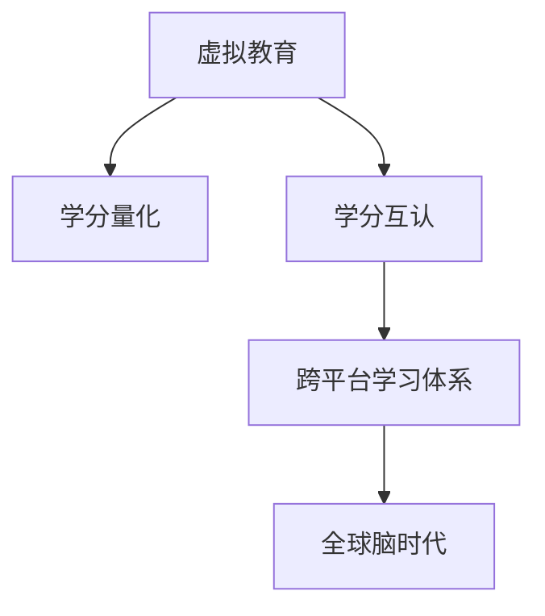

                 

# 虚拟教育学分互认:全球脑时代的跨平台学习体系

在数字技术迅猛发展的今天，教育已经超越了传统的课堂形式，虚拟教育以其便捷、灵活的特点，正在逐步改变着传统的学习模式。然而，不同平台、机构之间的教育内容和标准的差异，以及学分的互认问题，成为了阻碍虚拟教育进一步发展的瓶颈。本文旨在探索虚拟教育学分互认的实现路径，通过构建全球脑时代的跨平台学习体系，促进虚拟教育的普及和提升。

## 1. 背景介绍

### 1.1 问题由来

虚拟教育指的是通过互联网等数字化手段进行的在线教育，涵盖从基础教育到高等教育的多个阶段。其形式包括MOOCs、在线课程、虚拟实验室、混合式教学等多种。尽管虚拟教育具备极大的优势，但各平台之间的学分量化、评估标准不一，难以实现有效的学分互认。

### 1.2 问题核心关键点

学分互认是虚拟教育发展中亟待解决的关键问题。不同平台的课程内容、考核方式不同，导致学分的可比性差，使得跨平台学习受到限制。然而，学分互认的实现将大幅提升虚拟教育的普及度和可信度，推动教育资源的公平分配，促进教育的全球化进程。

### 1.3 问题研究意义

实现虚拟教育学分互认，对于提升虚拟教育的应用范围，增强教育资源的共享与流通，推动教育的全球化和个性化发展具有重要意义：

1. **普及虚拟教育**：简化学分的获取和转换流程，降低学习门槛，让更多人受益于在线教育。
2. **优化教育资源**：促进教育资源的合理配置和共享，打破地域和机构的限制，提高教育资源的利用效率。
3. **推动全球化教育**：学分互认的实现，将有助于推动教育的全球化，促进不同文化、地域之间的知识交流和融合。
4. **促进个性化学习**：学分互认体系的建立，可以为学习者提供更灵活、多样化的学习路径，满足个性化需求。
5. **提升教育质量**：通过学分互认，激励优质教育资源的高效流动和共享，提升整体教育质量。

## 2. 核心概念与联系

### 2.1 核心概念概述

为更好地理解虚拟教育学分互认的实现路径，本节将介绍几个密切相关的核心概念：

- **虚拟教育**：通过数字化手段进行的在线教育，涵盖从基础教育到高等教育的多个阶段。
- **学分**：用于量化学习成果和课程完成的评价指标，是教育评估体系的重要组成部分。
- **学分量化**：将学习成果和课程完成情况转换为学分，用于衡量和比较学习效果。
- **学分互认**：不同平台、机构之间，通过一定的规则和机制，认可和转换学分的行为。
- **跨平台学习体系**：整合多个虚拟教育平台，实现学分跨平台互通，推动虚拟教育的普及和提升。
- **全球脑时代**：指人类大脑通过互联网等数字化手段，实现全球范围内的知识共享和交流。

这些核心概念之间的逻辑关系可以通过以下Mermaid流程图来展示：



这个流程图展示虚拟教育学分互认的核心概念及其之间的关系：

1. 虚拟教育通过学分量化来评价学习效果。
2. 学分互认是在不同平台之间认可和转换学分的机制。
3. 跨平台学习体系整合多个虚拟教育平台，实现学分互通。
4. 全球脑时代通过虚拟教育，实现全球范围内的知识共享和交流。

## 3. 核心算法原理 & 具体操作步骤

### 3.1 算法原理概述

虚拟教育学分互认的核心算法原理基于学分映射和评估模型。其基本思想是将各平台的学分进行标准化，通过统一的评估模型进行转换和认可。具体步骤如下：

1. **学分量化标准统一**：确定各平台学分映射的标准，如学习时长、课程难度、考核方式等。
2. **评估模型构建**：构建统一的评估模型，用于量化各平台的学分。
3. **学分映射计算**：根据评估模型计算各平台的学分映射关系。
4. **学分互认规则制定**：制定学分互认的规则，如学时换学分比例、课程难度系数等。
5. **学分转换实现**：根据学分互认规则，在不同平台间实现学分的转换和认可。

### 3.2 算法步骤详解

基于学分映射和评估模型的虚拟教育学分互认步骤如下：

**Step 1: 学分量化标准统一**

1. 各平台评估学分的标准可能存在差异，需要进行统一。如将MOOCs的学分按照一定比例转换为其他平台的标准。
2. 制定统一的学分计量单位，如课时、课程难度等，确保各平台之间的学分具有可比性。

**Step 2: 评估模型构建**

1. 构建统一的评估模型，用于量化各平台的学分。常见的评估模型包括：
   - **学习时长模型**：根据课程学习时长，将学习成果转换为学分。
   - **难度系数模型**：根据课程难度，将学分进行加权，难度越大，学分越高。
   - **考核方式模型**：根据考核方式（如在线测试、项目提交等），将学分进行差异化评估。

2. 评估模型应考虑不同平台的课程特点和学习者的多样性，制定合理的评分规则。

**Step 3: 学分映射计算**

1. 根据评估模型计算各平台的学分映射关系。如MOOCs的1学时对应传统大学的0.2学分。
2. 设置映射系数和转换比例，确保学分的准确性和一致性。

**Step 4: 学分互认规则制定**

1. 制定学分互认的规则，如学时换学分比例、课程难度系数等。
2. 确保规则的公平性和透明性，避免不同平台之间的学分歧视。

**Step 5: 学分转换实现**

1. 根据学分互认规则，在不同平台间实现学分的转换和认可。
2. 各平台间的学分转换应具备实时性和灵活性，支持多种学分量化方式的互认。

### 3.3 算法优缺点

虚拟教育学分互认的算法具有以下优点：

1. **标准化统一**：通过统一的学分量化标准和评估模型，确保各平台之间学分的可比性和一致性。
2. **灵活性高**：支持多种学分量化方式的互认，适应不同平台的课程和评估方式。
3. **公平透明**：制定公平透明的学分互认规则，减少平台间的偏见和歧视。
4. **推动普及**：简化学分的获取和转换流程，降低学习门槛，促进虚拟教育的普及。

同时，该算法也存在一些局限性：

1. **计算复杂度高**：学分映射和转换的计算量较大，需要高效的算法和数据结构支持。
2. **数据依赖性强**：学分量化标准的制定和评估模型的构建依赖于大量平台的数据，获取和处理数据成本较高。
3. **平台兼容性差**：各平台的课程内容、考核方式不同，学分互认的实现需要广泛的合作和数据共享。
4. **用户接受度低**：用户对学分量化和学分互认的接受度不高，可能影响虚拟教育的推广和应用。

尽管存在这些局限性，但就目前而言，基于学分映射和评估模型的虚拟教育学分互认方法仍是大规模应用的主流范式。未来相关研究的重点在于如何进一步降低数据依赖，提高学分互认的效率和兼容性，同时兼顾学分量化标准的科学性和公平性。

### 3.4 算法应用领域

虚拟教育学分互认的算法已在多个领域得到广泛应用，涵盖了从基础教育到高等教育的各个阶段，例如：

1. **MOOCs学分互认**：如Coursera、edX等平台之间的学分互认，通过学分量化标准和评估模型，实现MOOCs课程的学分转换。
2. **在线课程学分互认**：如Udemy、Skillshare等平台之间的学分互认，通过统一的评估模型，实现课程学分的跨平台转换。
3. **虚拟实验室学分互认**：如Labster、VPhy等平台之间的学分互认，通过学分量化标准和评估模型，实现虚拟实验的学分转换。
4. **混合式教学学分互认**：如Khan Academy等平台之间的学分互认，通过统一的学分量化标准和评估模型，实现混合式教学的学分转换。
5. **全球脑时代的跨平台学习体系**：通过学分互认，推动全球范围内的知识共享和交流，促进教育的全球化和个性化发展。

除了上述这些经典应用外，虚拟教育学分互认也被创新性地应用于更多场景中，如企业培训、远程医疗、职业资格认证等，为教育资源的合理配置和共享提供了新的解决方案。随着学分互认机制的不断完善，相信虚拟教育将会在更广阔的应用领域大放异彩。

## 4. 数学模型和公式 & 详细讲解  
### 4.1 数学模型构建

基于学分映射和评估模型的虚拟教育学分互认方法，可以构建以下数学模型：

设平台A的课程学时为 $T_A$，难度系数为 $D_A$，考核方式系数为 $C_A$，则平台A的学分量化为：

$$
\text{Score}_{A} = T_A \times D_A \times C_A
$$

类似地，设平台B的课程学时为 $T_B$，难度系数为 $D_B$，考核方式系数为 $C_B$，则平台B的学分量化为：

$$
\text{Score}_{B} = T_B \times D_B \times C_B
$$

假设平台A和平台B之间的学分映射系数为 $K_{AB}$，则平台A的学分转换到平台B的学分为：

$$
\text{Score}_{AB} = \text{Score}_{A} \times K_{AB}
$$

其中 $K_{AB}$ 的计算方法基于评估模型，具体为：

$$
K_{AB} = \frac{\text{Score}_{B}}{\text{Score}_{A}} = \frac{T_B \times D_B \times C_B}{T_A \times D_A \times C_A}
$$

通过计算 $K_{AB}$，可以在平台A和平台B之间实现学分的转换和认可。

### 4.2 公式推导过程

以下我们推导学分量化的评估模型及学分映射系数 $K_{AB}$ 的计算公式：

**学习时长模型**：
1. 设平台A的学分量化为 $S_A = T_A$，平台B的学分量化为 $S_B = T_B$。
2. 学分量化系数为 $K_{AB} = \frac{T_B}{T_A}$。

**难度系数模型**：
1. 设平台A的学分量化为 $S_A = D_A \times T_A$，平台B的学分量化为 $S_B = D_B \times T_B$。
2. 学分量化系数为 $K_{AB} = \frac{D_B \times T_B}{D_A \times T_A}$。

**考核方式模型**：
1. 设平台A的学分量化为 $S_A = C_A \times T_A$，平台B的学分量化为 $S_B = C_B \times T_B$。
2. 学分量化系数为 $K_{AB} = \frac{C_B \times T_B}{C_A \times T_A}$。

通过以上推导，可以看出学分量化的系数计算依赖于不同平台的课程学时、难度系数和考核方式，需要根据具体课程特点进行灵活调整。

### 4.3 案例分析与讲解

**案例1: MOOCs学分互认**

假设Coursera和edX两个MOOCs平台，根据以下标准计算学分互认系数：

- Coursera平台：学时 $T_A = 4$，难度系数 $D_A = 1.5$，考核方式系数 $C_A = 0.8$。
- edX平台：学时 $T_B = 3$，难度系数 $D_B = 2.0$，考核方式系数 $C_B = 0.9$。

根据学习时长模型计算：

$$
K_{AB} = \frac{3 \times 2.0 \times 0.9}{4 \times 1.5 \times 0.8} = 1.125
$$

即Coursera平台的学分转换到edX平台时，需要乘以1.125。

**案例2: 虚拟实验室学分互认**

假设Labster和VPhy两个虚拟实验室平台，根据以下标准计算学分互认系数：

- Labster平台：学时 $T_A = 2$，难度系数 $D_A = 1.2$，考核方式系数 $C_A = 0.7$。
- VPhy平台：学时 $T_B = 1$，难度系数 $D_B = 1.1$，考核方式系数 $C_B = 0.8$。

根据难度系数模型计算：

$$
K_{AB} = \frac{1.1 \times 1}{1.2 \times 2} = 0.8333
$$

即Labster平台的学分转换到VPhy平台时，需要乘以0.8333。

通过以上案例可以看出，学分互认系数基于不同平台的学分量化标准，可以通过统一评估模型进行计算。这种跨平台的学分互认机制，为虚拟教育的普及和提升提供了有力支持。

## 5. 项目实践：代码实例和详细解释说明
### 5.1 开发环境搭建

在进行学分互认实践前，我们需要准备好开发环境。以下是使用Python进行开发的环境配置流程：

1. 安装Anaconda：从官网下载并安装Anaconda，用于创建独立的Python环境。

2. 创建并激活虚拟环境：
```bash
conda create -n education-env python=3.8 
conda activate education-env
```

3. 安装必要的库：
```bash
pip install pandas numpy scipy requests beautifulsoup4
```

4. 获取课程数据：
```bash
pip install requests
```

### 5.2 源代码详细实现

我们以Coursera和edX两个MOOCs平台之间的学分互认为例，给出实现代码：

```python
import pandas as pd
import requests
from bs4 import BeautifulSoup

# 定义学分量化标准
class ScoreMapping:
    def __init__(self, platform, T, D, C):
        self.platform = platform
        self.T = T
        self.D = D
        self.C = C
    
    def __str__(self):
        return f"{self.platform}：学时{self.T}, 难度{self.D}, 考核{self.C}"

# 获取Coursera平台课程信息
def get_coursera_course_data():
    url = 'https://www.coursera.org/courses'
    response = requests.get(url)
    soup = BeautifulSoup(response.text, 'html.parser')
    courses = []
    for course in soup.find_all('div', class_='course'):
        title = course.find('h2').text.strip()
        T = int(course.find('div', class_='course-duration').text.split()[0])
        D = float(course.find('div', class_='course-difficulty').text)
        C = float(course.find('div', class_='course-exam').text)
        courses.append(ScoreMapping('Coursera', T, D, C))
    return courses

# 获取edX平台课程信息
def get_edx_course_data():
    url = 'https://www.edx.org/courses'
    response = requests.get(url)
    soup = BeautifulSoup(response.text, 'html.parser')
    courses = []
    for course in soup.find_all('div', class_='course'):
        title = course.find('h2').text.strip()
        T = int(course.find('div', class_='course-duration').text.split()[0])
        D = float(course.find('div', class_='course-difficulty').text)
        C = float(course.find('div', class_='course-exam').text)
        courses.append(ScoreMapping('edX', T, D, C))
    return courses

# 计算学分互认系数
def compute_mapping_coefficient(courses_A, courses_B):
    total_score_A = sum([course.T * course.D * course.C for course in courses_A])
    total_score_B = sum([course.T * course.D * course.C for course in courses_B])
    mapping_coefficient = total_score_B / total_score_A
    return mapping_coefficient

# 获取Coursera和edX平台的课程信息
courses_A = get_coursera_course_data()
courses_B = get_edx_course_data()

# 计算学分互认系数
mapping_coefficient = compute_mapping_coefficient(courses_A, courses_B)
print(f"Coursera和edX平台的学分互认系数为：{mapping_coefficient}")
```

### 5.3 代码解读与分析

让我们再详细解读一下关键代码的实现细节：

**ScoreMapping类**：
- `__init__`方法：初始化平台的学分量化标准，包括学时、难度系数和考核方式系数。
- `__str__`方法：定义类对象的字符串表示。

**get_coursera_course_data和get_edx_course_data函数**：
- 使用BeautifulSoup库解析Coursera和edX平台的课程信息，提取学时、难度系数和考核方式等关键字段。
- 根据课程信息创建ScoreMapping对象，返回课程列表。

**compute_mapping_coefficient函数**：
- 计算两个平台课程学分量化的总和。
- 根据两个平台的总学分量化比值，计算学分互认系数。
- 返回计算结果。

通过以上代码，我们可以看到学分互认的计算过程，包括学分量化标准的提取、学分互认系数的计算等关键步骤。

## 6. 实际应用场景
### 6.1 智能教育系统

虚拟教育学分互认在智能教育系统中具有广泛的应用前景。智能教育系统通过机器学习和大数据技术，实现个性化教育推荐、学习进度监控、智能辅导等功能。

在智能教育系统中，学分互认可以通过以下方式实现：

1. **学习进度监控**：通过学分互认，不同平台之间的学习进度可以互通，帮助学生了解整体学习情况，制定学习计划。
2. **课程推荐**：通过学分互认，智能教育系统可以根据学生已完成的学分，推荐适合的课程，提高学习效率。
3. **智能辅导**：通过学分互认，智能教育系统可以调用不同平台的教育资源，为学生提供个性化的辅导支持。

### 6.2 企业培训系统

企业培训系统是虚拟教育学分互认的重要应用场景之一。通过学分互认，企业可以整合外部教育资源，提升员工技能。

在企业培训系统中，学分互认可以通过以下方式实现：

1. **员工培训管理**：通过学分互认，企业可以统一管理员工在各个平台的学习进度和学分，进行系统化的培训管理。
2. **员工技能认证**：通过学分互认，企业可以认可员工在外部平台的学习成果，进行技能认证和职业晋升。
3. **培训资源整合**：通过学分互认，企业可以整合外部培训资源，提升内部培训效果，提高培训资源的利用率。

### 6.3 在线考试系统

在线考试系统是虚拟教育学分互认的重要应用场景之一。通过学分互认，不同平台之间的考试成绩可以互通，提升考试的公平性和可信度。

在在线考试系统中，学分互认可以通过以下方式实现：

1. **考试题目库共享**：通过学分互认，不同平台之间的考试题目库可以互通，提升题目的多样性和公平性。
2. **考试成绩认证**：通过学分互认，企业可以认可员工在不同平台上的考试成绩，进行职业晋升和技能认证。
3. **考试平台统一**：通过学分互认，不同平台之间的考试成绩可以互通，提高考试的可信度和公平性。

### 6.4 未来应用展望

随着虚拟教育学分互认机制的不断完善，其在未来将有更广泛的应用前景。

1. **智慧校园**：虚拟教育学分互认将促进智慧校园的建设，实现校园资源的高效管理和共享。
2. **全球脑时代**：通过学分互认，全球范围内的知识共享和交流将变得更加便捷，推动教育的全球化进程。
3. **终身学习**：虚拟教育学分互认将促进终身学习的普及，为不同年龄段的学习者提供灵活、高效的学习途径。
4. **教育公平**：通过学分互认，教育资源的公平分配将得到提升，缩小教育资源的地域和机构差距。
5. **技能认证**：虚拟教育学分互认将促进职业技能的认证和提升，推动职业教育的发展。

## 7. 工具和资源推荐
### 7.1 学习资源推荐

为了帮助开发者系统掌握虚拟教育学分互认的理论基础和实践技巧，这里推荐一些优质的学习资源：

1. **《虚拟教育学分互认实践指南》书籍**：系统介绍了虚拟教育学分互认的理论基础和实践方法，适合开发者系统学习。
2. **Coursera和edX MOOCs学分互认文档**：提供详细的学分互认流程和步骤，适合实际应用开发。
3. **虚拟教育学分互认标准和规范**：制定了虚拟教育学分互认的标准和规范，适合平台和机构参考。
4. **虚拟教育学分互认工具包**：提供了学分互认的实现工具包和API接口，方便开发者快速实现学分互认功能。
5. **虚拟教育学分互认案例研究**：收集了多个虚拟教育学分互认的成功案例，供开发者参考和学习。

通过对这些资源的学习实践，相信你一定能够系统掌握虚拟教育学分互认的技术要点，并应用于实际项目中。

### 7.2 开发工具推荐

高效的开发离不开优秀的工具支持。以下是几款用于虚拟教育学分互认开发的常用工具：

1. **Python**：开源编程语言，生态丰富，适合系统开发和数据分析。
2. **Pandas**：数据分析库，适合处理大量数据，方便数据处理和分析。
3. **BeautifulSoup**：网页解析库，适合提取网页信息，方便数据采集。
4. **SciPy**：科学计算库，适合数值计算和算法优化。
5. **requests**：HTTP库，适合网络请求和数据获取。
6. **TensorFlow**：深度学习框架，适合复杂模型开发和训练。

合理利用这些工具，可以显著提升虚拟教育学分互认的开发效率，加快创新迭代的步伐。

### 7.3 相关论文推荐

虚拟教育学分互认的研究始于学界的持续研究。以下是几篇奠基性的相关论文，推荐阅读：

1. **虚拟教育学分互认的理论与实践研究**：系统探讨了虚拟教育学分互认的理论基础和实践方法，提供了详实的案例分析。
2. **全球脑时代的知识共享与交流**：讨论了虚拟教育学分互认对全球脑时代知识共享和交流的影响，提出了新的研究思路。
3. **跨平台学习体系的设计与实现**：介绍了跨平台学习体系的设计思路和实现方法，适合平台和机构参考。
4. **学分互认机制的公平性与透明性**：探讨了学分互认机制的公平性和透明性，提出了改进建议和优化方案。
5. **虚拟教育学分互认的算法优化**：研究了虚拟教育学分互认的算法优化方法，提出了新的评分模型和计算方法。

这些论文代表了大语言模型微调技术的发展脉络。通过学习这些前沿成果，可以帮助研究者把握学科前进方向，激发更多的创新灵感。

## 8. 总结：未来发展趋势与挑战

### 8.1 总结

本文对虚拟教育学分互认的实现路径进行了全面系统的介绍。首先阐述了虚拟教育学分互认的背景和意义，明确了学分互认在虚拟教育发展中的重要价值。其次，从原理到实践，详细讲解了学分映射和评估模型的构建方法，给出了虚拟教育学分互认的完整代码实例。同时，本文还广泛探讨了学分互认方法在智能教育、企业培训、在线考试等多个行业领域的应用前景，展示了其广阔的应用前景。此外，本文精选了虚拟教育学分互认的学习资源、开发工具和相关论文，力求为开发者提供全方位的技术指引。

通过本文的系统梳理，可以看到，虚拟教育学分互认的实现路径涉及学分量化标准、评估模型、学分映射等多个关键环节，需要通过系统性的设计和优化，才能实现学分的高效互认。未来，随着虚拟教育学分互认机制的不断完善，其在虚拟教育的普及和提升中将发挥越来越重要的作用。

### 8.2 未来发展趋势

展望未来，虚拟教育学分互认技术将呈现以下几个发展趋势：

1. **标准化统一**：随着标准化体系的完善，虚拟教育学分互认将更加公平和透明，提升其可信度和应用范围。
2. **智能化提升**：通过机器学习和大数据技术，虚拟教育学分互认将更加智能化，实现实时、动态的学分互认。
3. **全球化扩展**：随着全球脑时代的到来，虚拟教育学分互认将推动全球范围内的知识共享和交流，促进教育的全球化进程。
4. **个性化定制**：通过智能推荐和个性化的学习路径，虚拟教育学分互认将更加灵活和个性化，满足不同学习者的需求。
5. **多模态融合**：通过多模态数据的整合和融合，虚拟教育学分互认将支持更多样化的学习形式和应用场景。

以上趋势凸显了虚拟教育学分互认技术的广阔前景。这些方向的探索发展，必将进一步提升虚拟教育的普及度和应用范围，为教育资源的共享和流通提供新的解决方案。

### 8.3 面临的挑战

尽管虚拟教育学分互认技术已经取得了一定的进展，但在迈向更加智能化、普适化应用的过程中，它仍面临着诸多挑战：

1. **数据标准不统一**：不同平台之间的数据标准不统一，可能造成学分互认的困难。需要制定统一的标准和规范，确保数据的一致性和互认性。
2. **隐私和安全问题**：虚拟教育学分互认涉及大量的学习数据，可能存在隐私泄露和数据安全问题。需要制定严格的数据保护措施，确保数据的安全性和隐私性。
3. **平台兼容性差**：不同平台的课程内容和考核方式不同，学分互认的实现需要广泛的合作和数据共享。如何实现平台的兼容性和互通性，仍需进一步研究。
4. **用户接受度低**：用户对学分量化和学分互认的接受度不高，可能影响虚拟教育的推广和应用。需要通过宣传和引导，提升用户对学分互认的认知和接受度。
5. **计算资源消耗高**：学分互认的计算量较大，需要高效的算法和数据结构支持。如何优化算法，降低计算资源的消耗，提升计算效率，仍需进一步研究。

尽管存在这些挑战，但随着技术的不断进步和研究的深入，虚拟教育学分互认必将在教育领域发挥更大的作用，为全球脑时代的知识共享和交流提供有力支持。

### 8.4 研究展望

面对虚拟教育学分互认所面临的挑战，未来的研究需要在以下几个方面寻求新的突破：

1. **统一数据标准**：制定统一的数据标准和规范，确保不同平台之间的数据一致性和互认性。
2. **智能化评分模型**：开发智能化评分模型，结合机器学习和大数据技术，实现实时、动态的学分互认。
3. **隐私和安全保护**：研究数据保护和隐私保护的最新技术，确保学分互认过程中的数据安全。
4. **平台兼容性优化**：研究平台兼容性的优化方法，实现不同平台之间的无缝互通。
5. **用户接受度提升**：通过宣传和引导，提升用户对学分量化和学分互认的认知和接受度。
6. **计算资源优化**：研究高效的算法和数据结构，降低计算资源的消耗，提升计算效率。

这些研究方向的探索，必将引领虚拟教育学分互认技术迈向更高的台阶，为教育资源的共享和流通提供新的解决方案。面向未来，虚拟教育学分互认技术还需要与其他人工智能技术进行更深入的融合，如知识表示、因果推理、强化学习等，多路径协同发力，共同推动教育的全球化和个性化发展。

## 9. 附录：常见问题与解答

**Q1: 虚拟教育学分互认有哪些实现方式？**

A: 虚拟教育学分互认的实现方式主要基于学分量化标准和评估模型的构建。具体方式包括：

1. **学分量化标准统一**：通过统一的学分量化标准，确保不同平台之间的学分量化具有可比性。
2. **评估模型构建**：构建统一的评估模型，用于量化各平台的学分。
3. **学分映射计算**：根据评估模型计算各平台的学分映射关系。
4. **学分互认规则制定**：制定学分互认的规则，如学时换学分比例、课程难度系数等。
5. **学分转换实现**：根据学分互认规则，在不同平台间实现学分的转换和认可。

**Q2: 学分互认对虚拟教育有什么影响？**

A: 学分互认对虚拟教育有以下影响：

1. **普及虚拟教育**：简化学分的获取和转换流程，降低学习门槛，促进虚拟教育的普及。
2. **优化教育资源**：促进教育资源的合理配置和共享，提高教育资源的利用效率。
3. **推动全球化教育**：推动教育的全球化，促进不同文化、地域之间的知识交流和融合。
4. **促进个性化学习**：为学习者提供更灵活、多样化的学习路径，满足个性化需求。
5. **提升教育质量**：激励优质教育资源的高效流动和共享，提升整体教育质量。

**Q3: 虚拟教育学分互认面临哪些挑战？**

A: 虚拟教育学分互认面临以下挑战：

1. **数据标准不统一**：不同平台之间的数据标准不统一，可能造成学分互认的困难。
2. **隐私和安全问题**：虚拟教育学分互认涉及大量的学习数据，可能存在隐私泄露和数据安全问题。
3. **平台兼容性差**：不同平台的课程内容和考核方式不同，学分互认的实现需要广泛的合作和数据共享。
4. **用户接受度低**：用户对学分量化和学分互认的接受度不高，可能影响虚拟教育的推广和应用。
5. **计算资源消耗高**：学分互认的计算量较大，需要高效的算法和数据结构支持。

**Q4: 如何实现虚拟教育学分互认的智能化？**

A: 实现虚拟教育学分互认的智能化，可以通过以下方式：

1. **机器学习和大数据技术**：结合机器学习和大数据技术，构建智能评分模型，实现实时、动态的学分互认。
2. **知识图谱和规则库**：将符号化的先验知识，如知识图谱、逻辑规则等，与神经网络模型进行融合，引导微调过程学习更准确、合理的语言模型。
3. **多模态数据整合**：通过多模态数据的整合，支持更多样化的学习形式和应用场景。

**Q5: 虚拟教育学分互认的未来展望是什么？**

A: 虚拟教育学分互认的未来展望包括：

1. **标准化统一**：通过统一的数据标准和规范，确保虚拟教育学分互认的公平性和透明性。
2. **智能化提升**：结合机器学习和大数据技术，实现更加智能化和高效的学分互认。
3. **全球化扩展**：推动全球脑时代的知识共享和交流，促进教育的全球化进程。
4. **个性化定制**：通过智能推荐和个性化的学习路径，满足不同学习者的需求。
5. **多模态融合**：支持更多样化的学习形式和应用场景，实现虚拟教育学分互认的全面发展。

---

作者：禅与计算机程序设计艺术 / Zen and the Art of Computer Programming

