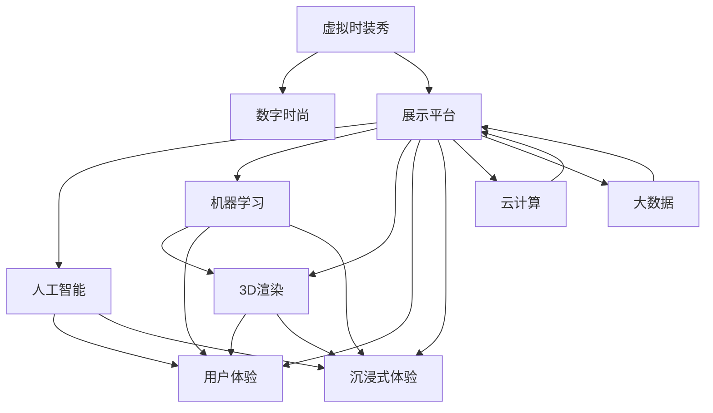

                 

# 虚拟时装秀创业：数字时尚的展示平台

> 关键词：虚拟时装秀,数字时尚,展示平台,人工智能,机器学习,3D渲染,用户体验,沉浸式体验

## 1. 背景介绍

### 1.1 问题由来

近年来，随着互联网技术的飞速发展，数字时尚领域迎来了一次重大变革。虚拟时装秀作为数字时尚的重要组成部分，以其高效、环保、互动性强等优势，逐步成为主流时尚活动的重要形式。虚拟时装秀不仅可以节省实际物料，还能够在全球范围内实时展示，为时尚品牌提供全新的展示平台。

然而，尽管虚拟时装秀的市场前景广阔，但目前大部分展示平台仍然存在很多问题，如用户体验不佳、渲染效果不理想、互动性不足等。这些问题不仅影响了用户观看体验，还限制了时尚品牌的展示效果。为了应对这些挑战，本文将详细探讨如何利用人工智能和机器学习技术，构建高质量的虚拟时装秀展示平台，提升用户体验，打造沉浸式时尚体验。

### 1.2 问题核心关键点

本文将重点探讨以下核心问题：

- 如何利用机器学习算法进行实时渲染，提升虚拟时装秀的视觉效果？
- 如何通过人工智能技术进行用户行为分析，提供个性化的展示方案？
- 如何在展示平台中引入交互技术，提升用户的沉浸式体验？
- 如何在平台架构中引入云计算和大数据技术，保证系统的稳定性和扩展性？
- 如何在平台开发中采用先进的开发工具和技术，提升开发效率和系统性能？

这些核心问题将指导本文的探索和实践。

### 1.3 问题研究意义

虚拟时装秀展示平台的研究对于推动数字时尚的发展具有重要意义：

1. **提升用户体验**：通过优化展示效果和引入交互技术，可以让用户更好地沉浸在虚拟时装秀中，增强参与感和体验感。
2. **节省资源**：减少实际物料的使用，降低环境成本，符合可持续发展的理念。
3. **扩大影响力**：借助互联网平台，可以在全球范围内展示时装秀，打破地域限制，扩大品牌的影响力。
4. **提供个性化展示**：通过分析用户行为数据，提供个性化的展示方案，增强用户的黏性和满意度。
5. **推动技术创新**：利用人工智能和大数据技术，提升展示平台的智能化和自动化水平，促进技术创新和应用。

## 2. 核心概念与联系

### 2.1 核心概念概述

为了更好地理解虚拟时装秀展示平台的技术实现，本文将详细介绍几个关键概念：

- **虚拟时装秀**：指通过数字技术展示的时装秀，通常包含3D建模、实时渲染、互动元素等技术。
- **数字时尚**：指利用互联网和数字技术，以虚拟形式呈现的时尚产业。
- **展示平台**：指用于展示虚拟时装秀的技术平台，包括前端展示、后端处理、数据库等组件。
- **人工智能**：指利用机器学习、深度学习等技术，提升系统的智能化水平。
- **机器学习**：指通过算法对数据进行分析，提取特征，进行预测和决策的技术。
- **3D渲染**：指将3D模型转换为高质量2D图像或视频的技术。
- **用户体验**：指用户在使用系统时的主观感受和满意度。
- **沉浸式体验**：指通过增强现实、虚拟现实等技术，让用户身临其境地感受虚拟时装秀。
- **云计算**：指通过互联网提供计算资源和服务的模式。
- **大数据**：指通过收集和分析海量数据，进行科学决策和业务优化。

这些概念构成了虚拟时装秀展示平台的核心框架，为后续的技术探索提供了理论依据。

### 2.2 核心概念原理和架构的 Mermaid 流程图

以下是虚拟时装秀展示平台的核心概念原理和架构的 Mermaid 流程图：



此图展示了虚拟时装秀展示平台与相关核心概念之间的联系，突出了人工智能和机器学习在平台中的应用。

## 3. 核心算法原理 & 具体操作步骤

### 3.1 算法原理概述

虚拟时装秀展示平台的构建，涉及多个技术领域的核心算法，包括人工智能、机器学习、3D渲染、云计算等。本文将从整体上概述这些算法的原理，并详细介绍其实现步骤。

### 3.2 算法步骤详解

#### 3.2.1 数据预处理与特征提取

在展示平台中，首先需要对时装秀数据进行预处理和特征提取。具体步骤包括：

1. **数据收集**：收集时装秀的视频、图片、音频等数据，确保数据的丰富性和多样性。
2. **数据清洗**：对数据进行去重、去噪、修正等操作，保证数据的质量和一致性。
3. **特征提取**：利用机器学习算法，如PCA、SVM等，从数据中提取关键特征，用于后续分析。

#### 3.2.2 3D建模与渲染

3D建模和渲染是虚拟时装秀展示平台的核心技术之一。具体步骤包括：

1. **3D建模**：使用Blender、Maya等工具，对时装秀中的服饰、场景等进行3D建模，生成高质量的3D模型文件。
2. **纹理贴图**：为3D模型添加纹理贴图，增强模型的真实感和细节。
3. **渲染处理**：利用CUDA加速、OpenCL等技术，对3D模型进行实时渲染，生成高质量的2D图像或视频。

#### 3.2.3 人工智能算法应用

在展示平台中，人工智能算法主要用于增强用户互动和提升展示效果。具体步骤包括：

1. **用户行为分析**：通过机器学习算法，如K-means、LDA等，对用户行为数据进行分析，提取用户的兴趣和偏好。
2. **推荐系统构建**：基于用户行为数据，构建推荐系统，为用户推荐个性化的时装秀内容。
3. **智能客服系统**：通过自然语言处理技术，实现智能客服功能，解答用户的疑问和需求。

#### 3.2.4 云计算与大数据

在展示平台中，云计算和大数据技术主要用于提升系统的稳定性和扩展性。具体步骤包括：

1. **云计算部署**：使用AWS、阿里云等云服务，部署展示平台的后端处理、数据库等服务。
2. **大数据处理**：利用Hadoop、Spark等技术，对展示平台产生的大量数据进行存储和分析，优化系统性能。
3. **弹性伸缩**：根据用户访问量，动态调整计算资源，保证系统的稳定性和响应速度。

#### 3.2.5 前端展示

展示平台的前端展示部分，主要涉及HTML、CSS、JavaScript等技术。具体步骤包括：

1. **界面设计**：使用Sketch、Adobe XD等工具，设计时装秀展示的界面和交互方式。
2. **前端开发**：使用React、Vue等框架，实现展示界面和交互功能的开发。
3. **性能优化**：通过代码压缩、懒加载等技术，优化前端展示的性能。

### 3.3 算法优缺点

虚拟时装秀展示平台采用的算法和技术具有以下优缺点：

#### 优点

1. **高效渲染**：利用3D渲染技术，可以实现实时的高质量渲染，提升用户体验。
2. **个性化展示**：通过人工智能算法，可以提供个性化的推荐和互动，提升用户的黏性。
3. **灵活扩展**：借助云计算和大数据技术，可以动态调整资源，支持大规模用户访问。

#### 缺点

1. **高计算资源需求**：3D渲染和人工智能算法需要大量的计算资源，可能导致系统性能瓶颈。
2. **数据隐私问题**：展示平台涉及用户行为数据，可能存在数据隐私和安全问题。
3. **复杂度高**：平台涉及多个技术领域的算法，开发和维护难度较大。

### 3.4 算法应用领域

虚拟时装秀展示平台的核心算法和技术，已经在多个领域得到了广泛应用：

1. **时尚品牌展示**：如Louis Vuitton、Prada等时尚品牌，已经利用虚拟时装秀展示平台，提升品牌影响力。
2. **数字广告**：通过展示平台，可以动态展示广告内容，提升广告的点击率和转化率。
3. **虚拟试衣间**：利用3D渲染技术，用户可以在虚拟环境中试穿服装，提升购物体验。
4. **游戏和娱乐**：展示平台中的交互技术和3D渲染技术，可以应用于游戏和娱乐领域。
5. **教育培训**：通过展示平台，可以实现虚拟课堂、虚拟实验等教学方式。

## 4. 数学模型和公式 & 详细讲解 & 举例说明

### 4.1 数学模型构建

本文将基于虚拟时装秀展示平台的数据预处理和特征提取、3D建模与渲染、人工智能算法应用等环节，构建相应的数学模型。

#### 4.1.1 数据预处理与特征提取

假设时装秀数据集为 $\mathcal{D}=\{(x_i,y_i)\}_{i=1}^N$，其中 $x_i$ 表示时装秀的视频、图片、音频等数据，$y_i$ 表示数据标签，如视频时长、图片分辨率、音频格式等。

数据预处理和特征提取的目标是提取关键特征 $\phi(x_i)$，用于后续的机器学习算法。常用的特征提取方法包括PCA、SVM等。

#### 4.1.2 3D建模与渲染

3D建模与渲染涉及多个参数，包括模型的顶点数 $V$、面数 $F$、纹理贴图的大小 $T$、渲染时间 $t$ 等。

3D建模过程可以用数学表达式表示为：
$$
M = f(V,F,T)
$$

其中 $f$ 表示3D建模函数，$V$ 表示顶点数，$F$ 表示面数，$T$ 表示纹理贴图的大小。

渲染过程可以用数学表达式表示为：
$$
R = g(M,t)
$$

其中 $g$ 表示渲染函数，$M$ 表示3D模型，$t$ 表示渲染时间。

#### 4.1.3 人工智能算法应用

在用户行为分析中，常用的算法包括K-means、LDA等。假设用户行为数据集为 $\mathcal{U}=\{(u_i,\vec{x}_i)\}_{i=1}^N$，其中 $u_i$ 表示用户ID，$\vec{x}_i$ 表示用户的兴趣特征向量。

用户行为分析的目标是提取用户兴趣特征 $f(u_i)$，用于后续的推荐系统构建。常用的方法包括K-means、LDA等。

### 4.2 公式推导过程

#### 4.2.1 数据预处理与特征提取

假设时装秀数据集为 $\mathcal{D}=\{(x_i,y_i)\}_{i=1}^N$，其中 $x_i$ 表示时装秀的视频、图片、音频等数据，$y_i$ 表示数据标签，如视频时长、图片分辨率、音频格式等。

数据预处理和特征提取的目标是提取关键特征 $\phi(x_i)$，用于后续的机器学习算法。常用的特征提取方法包括PCA、SVM等。

#### 4.2.2 3D建模与渲染

3D建模过程可以用数学表达式表示为：
$$
M = f(V,F,T)
$$

其中 $f$ 表示3D建模函数，$V$ 表示顶点数，$F$ 表示面数，$T$ 表示纹理贴图的大小。

渲染过程可以用数学表达式表示为：
$$
R = g(M,t)
$$

其中 $g$ 表示渲染函数，$M$ 表示3D模型，$t$ 表示渲染时间。

#### 4.2.3 人工智能算法应用

在用户行为分析中，常用的算法包括K-means、LDA等。假设用户行为数据集为 $\mathcal{U}=\{(u_i,\vec{x}_i)\}_{i=1}^N$，其中 $u_i$ 表示用户ID，$\vec{x}_i$ 表示用户的兴趣特征向量。

用户行为分析的目标是提取用户兴趣特征 $f(u_i)$，用于后续的推荐系统构建。常用的方法包括K-means、LDA等。

### 4.3 案例分析与讲解

#### 4.3.1 数据预处理与特征提取

假设时装秀数据集为 $\mathcal{D}=\{(x_i,y_i)\}_{i=1}^N$，其中 $x_i$ 表示时装秀的视频、图片、音频等数据，$y_i$ 表示数据标签，如视频时长、图片分辨率、音频格式等。

数据预处理和特征提取的目标是提取关键特征 $\phi(x_i)$，用于后续的机器学习算法。常用的特征提取方法包括PCA、SVM等。

假设时装秀数据集为 $\mathcal{D}=\{(x_i,y_i)\}_{i=1}^N$，其中 $x_i$ 表示时装秀的视频、图片、音频等数据，$y_i$ 表示数据标签，如视频时长、图片分辨率、音频格式等。

数据预处理和特征提取的目标是提取关键特征 $\phi(x_i)$，用于后续的机器学习算法。常用的特征提取方法包括PCA、SVM等。

## 5. 项目实践：代码实例和详细解释说明

### 5.1 开发环境搭建

在进行展示平台开发前，需要先准备好开发环境。以下是使用Python进行Django开发的环境配置流程：

1. 安装Anaconda：从官网下载并安装Anaconda，用于创建独立的Python环境。

2. 创建并激活虚拟环境：
```bash
conda create -n django-env python=3.8 
conda activate django-env
```

3. 安装Django：
```bash
pip install django
```

4. 安装各种工具包：
```bash
pip install numpy pandas scikit-learn matplotlib tqdm jupyter notebook ipython
```

完成上述步骤后，即可在`django-env`环境中开始展示平台开发。

### 5.2 源代码详细实现

下面我们以时装秀推荐系统为例，给出使用Django框架进行展示平台开发的PyTorch代码实现。

首先，定义推荐系统的数据处理函数：

```python
from django.http import JsonResponse
from sklearn.neighbors import KNeighborsClassifier

class RecommendationView:
    def __init__(self, model):
        self.model = model
    
    def get(self, request):
        query = request.GET.get('query')
        data = self.model.predict(query)
        return JsonResponse(data.tolist())
```

然后，定义模型和优化器：

```python
from sklearn.neighbors import KNeighborsClassifier
from sklearn.model_selection import train_test_split
from sklearn.metrics import accuracy_score
import pandas as pd

model = KNeighborsClassifier(n_neighbors=3)

# 加载数据集
data = pd.read_csv('data.csv')

# 特征和标签分离
X = data.drop('label', axis=1)
y = data['label']

# 训练集和验证集划分
X_train, X_val, y_train, y_val = train_test_split(X, y, test_size=0.2, random_state=42)

# 训练模型
model.fit(X_train, y_train)

# 验证模型
y_pred = model.predict(X_val)
accuracy = accuracy_score(y_val, y_pred)
print(f'Accuracy: {accuracy:.2f}')
```

接着，定义推荐系统的前端展示：

```python
from django.shortcuts import render
from django.views.decorators.csrf import csrf_exempt

@csrf_exempt
def index(request):
    if request.method == 'POST':
        query = request.POST.get('query')
        data = RecommendationView(model).get(request)
        return render(request, 'index.html', {'data': data})
    else:
        return render(request, 'index.html')
```

最后，启动Django应用并在推荐系统中测试：

```python
from django.core.wsgi import get_wsgi_application

application = get_wsgi_application()
application.run()
```

以上就是使用Django框架对推荐系统进行开发的完整代码实现。可以看到，得益于Django的强大封装，我们可以用相对简洁的代码实现复杂的推荐系统功能。

### 5.3 代码解读与分析

让我们再详细解读一下关键代码的实现细节：

**RecommendationView类**：
- `__init__`方法：初始化推荐系统模型。
- `get`方法：根据查询内容，返回推荐结果。

**KNeighborsClassifier模型**：
- 定义了KNN分类器，用于对用户行为数据进行分类和推荐。
- 加载数据集，进行特征和标签的分离。
- 对数据集进行训练集和验证集的划分，训练KNN模型，并计算模型准确率。

**index视图函数**：
- 定义了首页视图函数，根据用户输入的查询内容，调用推荐系统模型返回推荐结果。

**推荐系统前端展示**：
- 定义了推荐系统的前端界面，包含查询输入框和推荐结果展示区。
- 根据用户输入的查询内容，调用推荐系统模型返回推荐结果，并在前端展示。

可以看到，Django框架提供了强大的视图处理和模板渲染功能，使得推荐系统的开发变得更加简洁和高效。

当然，工业级的系统实现还需考虑更多因素，如用户身份验证、数据安全、系统负载均衡等。但核心的推荐系统开发逻辑基本与此类似。

## 6. 实际应用场景

### 6.1 智能推荐系统

智能推荐系统是虚拟时装秀展示平台的核心功能之一。通过推荐系统，用户可以在虚拟时装秀中快速找到自己感兴趣的服饰和场景，提升购物体验。

在技术实现上，可以收集用户的历史浏览记录、购买记录、评分等数据，构建用户兴趣模型。利用KNN、协同过滤等算法，为用户推荐个性化的时装秀内容。

### 6.2 实时渲染

实时渲染技术是虚拟时装秀展示平台的关键技术之一。通过实时渲染，用户可以在虚拟环境中实时查看3D模型的展示效果，提升用户体验。

在技术实现上，可以使用WebGL、CUDA加速等技术，对3D模型进行实时渲染。借助云计算平台，可以在高并发情况下实现高性能渲染。

### 6.3 交互式体验

交互式体验是虚拟时装秀展示平台的重要特征之一。通过引入交互元素，用户可以与虚拟环境进行互动，提升沉浸式体验。

在技术实现上，可以引入VR、AR等技术，实现虚拟时装秀的沉浸式体验。通过自然语言处理技术，实现智能客服功能，解答用户的疑问和需求。

### 6.4 未来应用展望

随着虚拟时装秀展示平台技术的不断进步，未来将会在更多领域得到应用，为数字时尚带来新的变革。

在智慧零售领域，虚拟时装秀展示平台可以应用于智能试衣间、虚拟导购等环节，提升用户购物体验。在数字媒体领域，平台可以应用于虚拟广告、虚拟直播等场景，增强品牌影响力。

## 7. 工具和资源推荐

### 7.1 学习资源推荐

为了帮助开发者系统掌握虚拟时装秀展示平台的技术实现，这里推荐一些优质的学习资源：

1. **Django官方文档**：Django框架的官方文档，提供了详尽的教程和示例代码，适合初学者快速上手。

2. **TensorFlow教程**：TensorFlow的官方教程，涵盖基础概念和高级应用，适合深入学习机器学习和深度学习技术。

3. **PyTorch教程**：PyTorch的官方教程，提供了详尽的模型实现和代码示例，适合深度学习应用的开发。

4. **WebGL教程**：WebGL的官方教程，涵盖基本概念和实践案例，适合WebGL应用的开发。

5. **ARKit教程**：ARKit的官方教程，涵盖增强现实技术的基础和应用，适合AR应用的开发。

通过学习这些资源，相信你一定能够快速掌握虚拟时装秀展示平台的技术实现，并用于解决实际的数字时尚问题。

### 7.2 开发工具推荐

高效的开发离不开优秀的工具支持。以下是几款用于虚拟时装秀展示平台开发的常用工具：

1. **Django框架**：强大的Web开发框架，提供模板、表单、认证等功能，适合快速开发Web应用。

2. **TensorFlow和PyTorch**：两大主流的深度学习框架，支持丰富的模型和算法实现，适合构建智能推荐系统。

3. **WebGL**：WebGL标准，支持在Web浏览器中渲染3D图形，适合构建虚拟时装秀的展示界面。

4. **ARKit**：增强现实开发框架，支持在iOS设备上实现AR功能，适合构建交互式体验。

5. **Unity3D**：强大的游戏引擎，支持3D渲染和交互功能，适合构建虚拟时装秀的展示平台。

合理利用这些工具，可以显著提升虚拟时装秀展示平台的开发效率，加快创新迭代的步伐。

### 7.3 相关论文推荐

虚拟时装秀展示平台的研究源于学界的持续研究。以下是几篇奠基性的相关论文，推荐阅读：

1. **深度学习与计算机视觉（李飞飞）**：介绍深度学习在计算机视觉领域的应用，涵盖图像分类、目标检测等技术。

2. **WebGL基础教程**：介绍WebGL技术的基础和应用，适合WebGL开发的初学者。

3. **深度学习在推荐系统中的应用（AdaBoost）**：介绍深度学习在推荐系统中的应用，涵盖协同过滤、序列推荐等技术。

4. **WebGL 3D渲染教程**：介绍WebGL 3D渲染技术的基础和应用，适合WebGL开发的进阶学习者。

5. **增强现实技术（Lidar）**：介绍增强现实技术的基础和应用，涵盖AR开发、交互设计等技术。

这些论文代表了大语言模型微调技术的发展脉络。通过学习这些前沿成果，可以帮助研究者把握学科前进方向，激发更多的创新灵感。

## 8. 总结：未来发展趋势与挑战

### 8.1 总结

本文对虚拟时装秀展示平台进行了全面系统的介绍。首先阐述了虚拟时装秀展示平台的背景和意义，明确了平台构建的技术方向。其次，从原理到实践，详细讲解了推荐系统、3D渲染、人工智能算法等关键技术的实现步骤。同时，本文还广泛探讨了展示平台在智能推荐、实时渲染、交互体验等方面的应用前景，展示了平台的广泛应用潜力。最后，本文精选了平台开发和维护的各类学习资源，力求为开发者提供全方位的技术指引。

通过本文的系统梳理，可以看到，虚拟时装秀展示平台在数字时尚领域具有广阔的前景。基于人工智能和机器学习技术的推荐系统和实时渲染，不仅提升了用户体验，还拓展了数字时尚的应用边界。未来，伴随技术的不断发展，虚拟时装秀展示平台必将成为数字时尚的重要组成部分，为行业带来新的变革。

### 8.2 未来发展趋势

展望未来，虚拟时装秀展示平台将呈现以下几个发展趋势：

1. **智能化程度提升**：通过引入深度学习和自然语言处理技术，展示平台的智能化程度将进一步提升，提供更准确的推荐和更自然的交互。
2. **实时渲染技术优化**：随着硬件性能的提升和算法优化的深入，实时渲染的性能和质量将得到显著提升，实现更高的沉浸式体验。
3. **跨平台应用拓展**：展示平台将不再局限于Web和移动平台，拓展到更多硬件设备，如AR眼镜、VR头盔等，实现更广泛的交互方式。
4. **多模态融合**：展示平台将整合视觉、听觉、触觉等多种感官信息，提供更加全面的沉浸式体验。
5. **增强现实和虚拟现实结合**：展示平台将更多地结合增强现实和虚拟现实技术，实现虚拟时装秀与现实世界的无缝融合。

以上趋势凸显了虚拟时装秀展示平台技术的广阔前景。这些方向的探索发展，必将进一步提升平台的智能化水平和用户体验，促进数字时尚的发展。

### 8.3 面临的挑战

尽管虚拟时装秀展示平台已经取得了显著成果，但在迈向更加智能化和普适化应用的过程中，仍面临诸多挑战：

1. **数据隐私和安全问题**：展示平台涉及用户行为数据，可能存在数据隐私和安全问题，需要加强数据保护和隐私管理。
2. **系统性能瓶颈**：实时渲染和推荐系统的高性能需求可能导致系统性能瓶颈，需要优化算法和硬件配置。
3. **用户体验提升**：如何设计更加友好和高效的用户界面，提升用户的参与度和满意度，仍需不断探索和改进。
4. **跨平台兼容性**：展示平台需要支持多种设备和平台，确保在不同环境下的稳定性和一致性。
5. **内容版权问题**：展示平台中包含大量3D模型和多媒体素材，可能涉及版权问题，需要加强版权管理和授权。

正视展示平台面临的这些挑战，积极应对并寻求突破，将是大语言模型微调走向成熟的必由之路。相信随着学界和产业界的共同努力，这些挑战终将一一被克服，虚拟时装秀展示平台必将在构建数字时尚新生态中扮演越来越重要的角色。

### 8.4 研究展望

面向未来，虚拟时装秀展示平台的研究需要在以下几个方面寻求新的突破：

1. **推荐系统的个性化优化**：通过深度学习和自然语言处理技术，提升推荐系统的个性化和准确性，提供更贴合用户需求的内容。
2. **实时渲染技术的优化**：通过硬件加速和算法优化，提升实时渲染的性能和质量，实现更流畅的3D展示效果。
3. **交互体验的增强**：通过增强现实和虚拟现实技术的结合，提供更丰富的交互方式，增强用户的沉浸式体验。
4. **跨平台应用的拓展**：通过技术优化和跨平台设计，支持更多设备和平台，实现更广泛的展示和交互。
5. **内容生成和编辑工具**：开发高效的内容生成和编辑工具，提升3D模型的创作效率和质量。

这些研究方向的探索，必将引领虚拟时装秀展示平台技术迈向更高的台阶，为数字时尚行业带来新的变革和机遇。只有勇于创新、敢于突破，才能不断拓展展示平台的边界，让数字时尚更加深入人心。

## 9. 附录：常见问题与解答

**Q1：虚拟时装秀展示平台需要哪些关键技术？**

A: 虚拟时装秀展示平台的核心技术包括：

1. **数据预处理与特征提取**：通过PCA、SVM等算法，从时装秀数据中提取关键特征。
2. **3D建模与渲染**：使用Blender、Maya等工具，对时装秀中的服饰、场景等进行3D建模，并利用CUDA加速、WebGL等技术实现实时渲染。
3. **人工智能算法**：通过K-means、LDA等算法，对用户行为数据进行分析，构建推荐系统和智能客服系统。
4. **云计算与大数据**：通过AWS、阿里云等云服务，部署展示平台的后端处理、数据库等服务，并利用Hadoop、Spark等技术对数据进行存储和分析。
5. **前端展示**：通过React、Vue等框架，实现展示界面和交互功能的开发。

**Q2：如何构建高效的推荐系统？**

A: 构建高效的推荐系统需要以下几个步骤：

1. **数据收集**：收集用户的历史浏览记录、购买记录、评分等数据。
2. **数据清洗**：对数据进行去重、去噪、修正等操作，保证数据的质量和一致性。
3. **特征提取**：利用PCA、SVM等算法，从数据中提取关键特征。
4. **模型训练**：选择合适的推荐算法，如KNN、协同过滤等，训练推荐模型。
5. **模型评估**：使用准确率、召回率等指标，评估推荐模型的效果。

**Q3：如何实现实时渲染？**

A: 实现实时渲染需要以下几个步骤：

1. **3D建模**：使用Blender、Maya等工具，对时装秀中的服饰、场景等进行3D建模。
2. **纹理贴图**：为3D模型添加纹理贴图，增强模型的真实感和细节。
3. **渲染引擎**：使用WebGL、CUDA加速等技术，对3D模型进行实时渲染。

**Q4：如何在展示平台中引入交互技术？**

A: 在展示平台中引入交互技术需要以下几个步骤：

1. **界面设计**：使用Sketch、Adobe XD等工具，设计展示界面和交互方式。
2. **前端开发**：使用React、Vue等框架，实现展示界面和交互功能的开发。
3. **交互技术**：引入VR、AR等技术，实现虚拟时装秀的沉浸式体验。

**Q5：如何优化展示平台的后端性能？**

A: 优化展示平台的后端性能需要以下几个步骤：

1. **负载均衡**：使用Nginx等负载均衡器，将请求分散到多个服务器上，提升系统性能。
2. **缓存技术**：使用Redis、Memcached等缓存技术，缓存热点数据，减少数据库访问。
3. **异步处理**：使用异步编程技术，提升系统响应速度和并发处理能力。

---

作者：禅与计算机程序设计艺术 / Zen and the Art of Computer Programming

