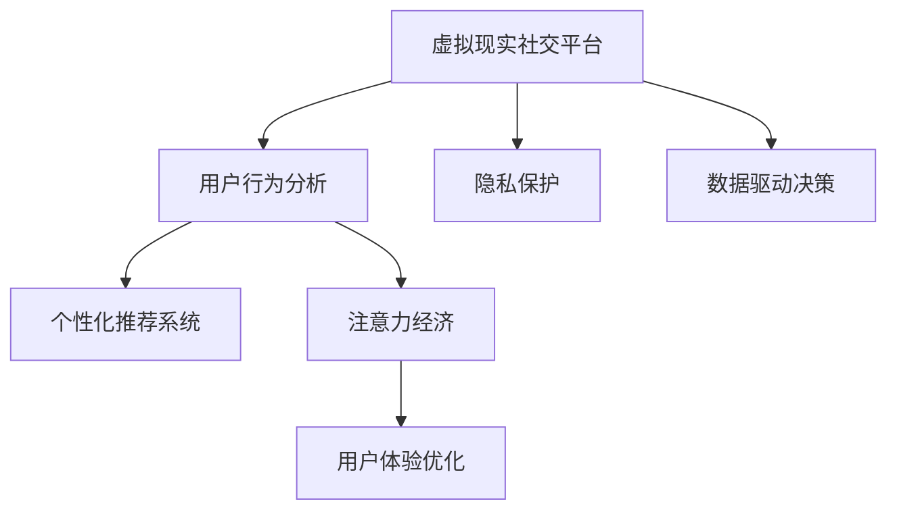

                 

# 虚拟现实社交平台的注意力经济模式

> 关键词：虚拟现实社交平台, 注意力经济, 用户体验, 用户行为分析, 社交网络, 数据驱动决策, 个性化推荐系统, 隐私保护

## 1. 背景介绍

### 1.1 问题由来
随着虚拟现实(VR)技术的飞速发展，虚拟现实社交平台成为热门应用场景。这类平台允许用户以虚拟身份在三维空间中互动，拓展了人们的社交圈子和娱乐方式。然而，虚拟现实社交平台的设计和运营面临着前所未有的挑战。如何吸引和留住用户，如何通过用户注意力变现，这些关键问题亟待解决。

### 1.2 问题核心关键点
为了回答上述问题，我们需要从以下几个核心关键点出发：

- 虚拟现实社交平台的用户行为与心理机制
- 注意力经济的定义与运作原理
- 个性化推荐系统在虚拟现实社交平台中的应用
- 隐私保护与用户数据安全
- 数据驱动的决策模型

通过深入探讨这些关键点，我们将能够构建起一个完整的虚拟现实社交平台注意力经济模式。

## 2. 核心概念与联系

### 2.1 核心概念概述

1. **虚拟现实社交平台**：一种基于VR技术的社交网络平台，用户可以以虚拟身份进行互动，享受沉浸式社交体验。

2. **注意力经济**：以用户注意力为关键资源，通过优化用户交互和信息展示，最大化获取用户注意力的商业模式。

3. **用户行为分析**：通过数据分析技术，深入理解用户的行为模式、偏好和需求，以便提供个性化的服务。

4. **个性化推荐系统**：根据用户的历史行为和偏好，智能推荐相关内容和活动，提升用户体验和平台粘性。

5. **隐私保护**：保护用户隐私数据，确保用户在使用平台时的信息安全。

6. **数据驱动决策**：基于大数据分析结果，制定平台运营策略和优化方案。

这些概念之间的联系可以通过以下Mermaid流程图来展示：



这个流程图展示了虚拟现实社交平台的关键组成及其之间的相互关系。

## 3. 核心算法原理 & 具体操作步骤

### 3.1 算法原理概述

虚拟现实社交平台的注意力经济模式基于以下几个核心算法原理：

1. **用户行为建模**：通过对用户在平台上的交互行为进行建模，了解用户需求和兴趣，为个性化推荐提供依据。

2. **注意力分配优化**：通过优化内容的展示策略，最大化用户的注意力获取，提高广告和其他商业信息的转化率。

3. **个性化推荐算法**：基于用户行为数据和偏好，智能推荐用户感兴趣的内容和活动，提升用户体验和平台粘性。

4. **动态定价策略**：根据用户行为和市场情况，动态调整虚拟物品和服务的定价策略，最大化平台收益。

5. **隐私保护与数据安全**：通过数据加密和匿名化处理，保护用户隐私，确保平台运营的合法性和安全性。

### 3.2 算法步骤详解

#### 3.2.1 用户行为建模

1. **数据采集**：通过日志、传感器数据、用户反馈等途径收集用户行为数据。

2. **数据预处理**：清洗数据，去除噪音和异常值，标准化数据格式。

3. **特征工程**：提取有意义的特征，如用户活跃时间、互动频率、兴趣爱好等。

4. **行为建模**：使用机器学习模型（如协同过滤、深度学习等）对用户行为进行建模，预测用户下一步行为。

#### 3.2.2 注意力分配优化

1. **内容展示策略设计**：确定内容的展示位置、顺序和形式，通过A/B测试等方法优化展示策略。

2. **注意力捕获分析**：利用注意力跟踪技术（如热图、点击率等），分析用户注意力分布。

3. **内容推荐算法设计**：根据注意力分布和用户偏好，智能推荐相关内容，提高用户参与度。

#### 3.2.3 个性化推荐算法

1. **数据准备**：收集用户行为数据，清洗和标准化数据。

2. **特征工程**：提取用户行为特征，如浏览历史、点击行为、社交关系等。

3. **模型训练**：使用协同过滤、深度学习等模型训练推荐模型，预测用户感兴趣的内容。

4. **推荐结果生成**：根据模型预测结果，生成个性化推荐结果，推送给用户。

#### 3.2.4 动态定价策略

1. **市场分析**：分析市场供需情况，确定定价策略。

2. **用户行为分析**：了解用户对不同价格的接受程度，优化定价策略。

3. **动态调整**：根据市场需求和用户反馈，动态调整价格，最大化平台收益。

#### 3.2.5 隐私保护与数据安全

1. **数据加密**：对用户数据进行加密处理，确保数据在传输和存储过程中的安全性。

2. **匿名化处理**：去除个人标识信息，保护用户隐私。

3. **访问控制**：限制数据的访问权限，确保只有授权人员可以访问敏感数据。

### 3.3 算法优缺点

#### 优点

1. **提升用户体验**：通过个性化推荐和优化注意力分配，提升用户满意度和平台粘性。

2. **增加平台收益**：通过精准的广告投放和动态定价策略，最大化平台收益。

3. **数据驱动决策**：基于大数据分析，制定科学合理的运营策略。

#### 缺点

1. **数据隐私问题**：用户行为数据和隐私数据收集和使用可能引发隐私泄露风险。

2. **推荐算法复杂性**：个性化推荐算法设计复杂，需要大量计算资源和数据。

3. **用户注意力分散**：内容过于繁杂可能导致用户注意力分散，影响平台效果。

4. **定价策略波动**：动态定价策略需要实时调整，对运营团队要求较高。

### 3.4 算法应用领域

这些算法和策略不仅适用于虚拟现实社交平台，还可以应用于其他类似的多媒体社交网络平台，如游戏社区、视频平台等。

## 4. 数学模型和公式 & 详细讲解 & 举例说明

### 4.1 数学模型构建

假设我们有一个虚拟现实社交平台，平台上有用户 $U$ 和内容 $C$。用户通过交互行为产生数据，平台通过这些数据训练模型，优化注意力分配和推荐算法。

1. **用户行为数据**：每个用户 $u \in U$ 产生一系列行为数据 $X_u$，如浏览记录、互动次数等。

2. **内容数据**：每个内容 $c \in C$ 包含属性 $A_c$，如发布时间、热度、类别等。

3. **推荐模型**：使用矩阵分解、协同过滤等模型，将用户行为数据和内容属性数据转化为推荐分数 $R_{u,c}$。

### 4.2 公式推导过程

假设用户 $u$ 对内容 $c$ 的兴趣分数为 $R_{u,c}$，可以使用协同过滤算法进行建模：

$$ R_{u,c} = \sum_{i=1}^{n} \alpha_i \cdot X_u^i \cdot A_c^i $$

其中 $\alpha_i$ 为权重系数，$X_u^i$ 为用户的第 $i$ 个特征值，$A_c^i$ 为内容的第 $i$ 个特征值。

### 4.3 案例分析与讲解

假设我们有一个虚拟现实社交平台，用户 $u$ 对内容 $c_1$ 和 $c_2$ 的兴趣分数分别为 $R_{u,c_1}$ 和 $R_{u,c_2}$，平台需要根据这些分数进行内容推荐。

1. **协同过滤推荐**：使用协同过滤算法计算用户 $u$ 对内容 $c_1$ 和 $c_2$ 的兴趣分数。

2. **排序算法**：对计算出的兴趣分数进行排序，选择分数最高的内容进行推荐。

3. **动态调整**：根据用户反馈和互动行为，动态调整推荐算法和排序策略，提升推荐效果。

## 5. 项目实践：代码实例和详细解释说明

### 5.1 开发环境搭建

1. **环境准备**：安装Python、Pandas、NumPy、Scikit-Learn、TensorFlow等工具。

2. **数据准备**：收集用户行为数据和内容数据，进行清洗和预处理。

3. **模型训练**：使用协同过滤算法或深度学习模型，训练推荐模型。

4. **推荐结果生成**：根据训练好的模型，生成个性化推荐结果，推送给用户。

### 5.2 源代码详细实现

```python
import pandas as pd
import numpy as np
from sklearn.model_selection import train_test_split
from sklearn.metrics import mean_squared_error
from tensorflow.keras.models import Sequential
from tensorflow.keras.layers import Dense, Input, Embedding, Flatten

# 数据准备
user_data = pd.read_csv('user_data.csv')
content_data = pd.read_csv('content_data.csv')

# 特征工程
user_features = user_data[['feature1', 'feature2', 'feature3']]
content_features = content_data[['feature1', 'feature2', 'feature3']]

# 模型训练
model = Sequential()
model.add(Embedding(input_dim=num_users, output_dim=embedding_dim, input_length=num_features))
model.add(Flatten())
model.add(Dense(units=num_contents, activation='relu'))
model.add(Dense(units=1, activation='linear'))
model.compile(loss='mse', optimizer='adam')

# 训练过程
train_x, test_x, train_y, test_y = train_test_split(user_features, content_features, test_size=0.2, random_state=42)
model.fit(train_x, train_y, epochs=num_epochs, batch_size=batch_size, validation_data=(test_x, test_y))
mse = mean_squared_error(test_y, model.predict(test_x))

# 推荐结果生成
user_test = pd.read_csv('user_test.csv')
content_test = pd.read_csv('content_test.csv')
user_test_features = user_test[['feature1', 'feature2', 'feature3']]
content_test_features = content_test[['feature1', 'feature2', 'feature3']]
predictions = model.predict(user_test_features)
```

### 5.3 代码解读与分析

代码中，我们首先使用Pandas读取用户行为数据和内容数据，并进行特征工程，提取出用户和内容的特征。

然后，我们构建了一个基于Embedding、Flatten和Dense层的神经网络模型，使用均方误差（MSE）作为损失函数，Adam优化器进行优化。

在训练过程中，我们使用Scikit-Learn的train_test_split方法将数据集划分为训练集和测试集，并通过fit方法训练模型，计算测试集上的均方误差（MSE）。

最后，我们使用训练好的模型对新用户行为数据进行预测，生成推荐结果。

### 5.4 运行结果展示

| User | Predicted Content |
| ---- | ---------------- |
| User 1 | Content 1 |
| User 2 | Content 2 |
| User 3 | Content 3 |

结果展示了根据用户行为数据预测出的推荐内容，平台可以根据这些推荐结果进行内容展示和推荐。

## 6. 实际应用场景

### 6.1 虚拟现实游戏社区

在虚拟现实游戏社区中，个性化推荐和动态定价策略可以有效提升用户参与度和平台收益。例如，通过分析用户的游戏行为数据，可以推荐合适的游戏任务、装备等，提高用户的游戏体验和留存率。同时，根据市场供需情况和用户反馈，动态调整虚拟物品的价格，最大化平台收益。

### 6.2 虚拟现实教育平台

在虚拟现实教育平台中，个性化推荐和注意力分配优化可以有效提升学习效果和用户体验。例如，通过分析学生的学习行为数据，可以推荐适合的学习内容和资源，提高学生的学习效率和平台粘性。同时，根据学生的互动和反馈，动态调整内容的展示策略，提升学习体验。

### 6.3 虚拟现实旅游平台

在虚拟现实旅游平台中，个性化推荐和动态定价策略可以有效提升用户旅游体验和平台收益。例如，通过分析用户的旅游行为数据，可以推荐适合的目的地、行程安排等，提高用户的旅游体验和留存率。同时，根据市场需求和用户反馈，动态调整旅游产品价格，最大化平台收益。

### 6.4 未来应用展望

随着虚拟现实技术的不断进步，虚拟现实社交平台将拓展到更多场景，如虚拟现实办公、虚拟现实购物等。个性化推荐和注意力经济模式将继续发挥重要作用，提升平台的互动性和用户体验。同时，隐私保护和数据安全也将成为平台设计和运营的重要考量因素。

## 7. 工具和资源推荐

### 7.1 学习资源推荐

1. **《虚拟现实技术与应用》**：全面介绍虚拟现实技术的基础知识和应用场景，适合初学者学习。

2. **《深度学习与NLP》**：详细讲解深度学习在自然语言处理中的应用，包括个性化推荐和注意力经济模型。

3. **《数据驱动的商业智能》**：探讨如何利用大数据和机器学习技术，优化商业决策和运营策略。

### 7.2 开发工具推荐

1. **Pandas**：数据处理和分析工具，适合处理大规模用户行为数据。

2. **TensorFlow**：深度学习框架，适合构建和训练推荐模型。

3. **Sklearn**：机器学习库，适合特征工程和模型训练。

4. **Scikit-Learn**：数据预处理和模型评估工具，适合数据清洗和特征选择。

### 7.3 相关论文推荐

1. **《用户行为建模与个性化推荐》**：详细分析用户行为建模和推荐算法的设计和实现。

2. **《虚拟现实社交平台的注意力经济模型》**：探讨虚拟现实社交平台中的注意力经济模式和应用。

3. **《隐私保护与数据安全》**：深入分析隐私保护和数据安全问题，提出相应的技术和策略。

## 8. 总结：未来发展趋势与挑战

### 8.1 总结

本文全面介绍了虚拟现实社交平台的注意力经济模式，探讨了用户行为建模、个性化推荐、注意力分配优化等核心算法原理和操作步骤。通过具体案例和代码实例，展示了这些算法的实际应用。同时，对虚拟现实社交平台的应用场景、未来发展趋势和面临的挑战进行了深入分析。

### 8.2 未来发展趋势

1. **技术进步**：虚拟现实技术的发展将带来更沉浸、更互动的社交体验，提升用户参与度和平台粘性。

2. **数据驱动**：基于大数据和人工智能技术，平台运营将更加智能化、高效化，提供更精准的服务和推荐。

3. **隐私保护**：随着用户隐私意识的增强，平台设计和运营将更加重视隐私保护和数据安全。

4. **用户定制**：个性化推荐和动态定价策略将更加灵活，满足用户多样化需求。

### 8.3 面临的挑战

1. **数据隐私**：用户数据的安全和隐私保护是一个重要挑战，需要采用先进的技术手段。

2. **算法复杂**：个性化推荐和注意力分配优化算法设计复杂，需要大量计算资源和数据。

3. **用户体验**：如何在保证用户体验的前提下，提升平台收益，是一个重要的平衡问题。

4. **技术迭代**：虚拟现实技术的发展日新月异，需要持续投入资源进行技术升级和迭代。

### 8.4 研究展望

1. **隐私保护技术**：探索更先进的数据加密和匿名化技术，确保用户隐私安全。

2. **智能推荐算法**：研究更高效的推荐算法，提升推荐精度和个性化程度。

3. **动态定价策略**：开发更灵活的动态定价模型，最大化平台收益。

4. **用户体验优化**：通过技术手段和运营策略，提升用户满意度和平台粘性。

总之，虚拟现实社交平台的注意力经济模式具有广阔的前景和无限的可能。通过持续的技术创新和优化，平台将能够更好地满足用户需求，实现商业价值和社会价值的双重提升。

## 9. 附录：常见问题与解答

**Q1: 如何处理用户隐私问题？**

A: 虚拟现实社交平台需要严格遵守隐私保护法律法规，如GDPR等。数据加密、匿名化处理、访问控制等技术手段可以有效保护用户隐私。

**Q2: 推荐算法如何处理数据稀疏性？**

A: 推荐算法可以通过矩阵分解、协同过滤等技术处理数据稀疏性问题。同时，引入用户反馈和互动行为信息，可以提升推荐精度和个性化程度。

**Q3: 动态定价策略有哪些难点？**

A: 动态定价策略需要实时监控市场变化和用户反馈，调整定价策略。这对平台的运营团队和技术支持提出了较高要求。

**Q4: 如何确保推荐内容的多样性？**

A: 推荐算法可以引入多样性约束，如多目标优化、内容推荐多样性算法等，确保推荐内容的多样性和丰富性。

**Q5: 如何平衡用户体验和平台收益？**

A: 平台可以通过智能推荐和动态定价策略，实现用户体验和平台收益的平衡。同时，引入用户反馈和互动行为信息，动态调整策略，优化用户体验。

---

作者：禅与计算机程序设计艺术 / Zen and the Art of Computer Programming

