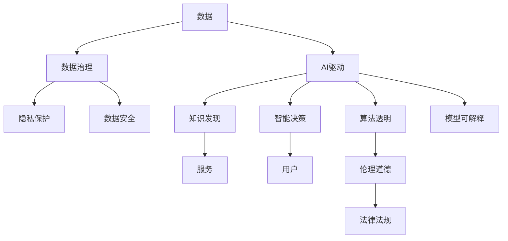

                 

# 虚拟生态系统理论：AI驱动的数字世界构建

在数字化时代，人工智能(AI)已经成为重塑人类社会和经济的关键技术之一。随着AI技术的不断演进，一个全新的数字世界正在形成，AI驱动的虚拟生态系统成为连接物理与数字世界的桥梁。本文旨在深入探讨AI驱动的虚拟生态系统的理论基础、构建原理和应用实践，为数字世界的未来发展提供新视角和解决方案。

## 1. 背景介绍

### 1.1 问题由来

随着互联网的普及和信息技术的快速发展，数字化已经渗透到社会生活的方方面面。人工智能作为数字化转型的核心驱动力，其应用场景从最初的图像识别、语音识别，扩展到自然语言处理、推荐系统、智能制造等领域。在这一过程中，AI系统通过大规模数据训练和大规模计算，逐渐具备了超越人类智能的能力，并在一些特定领域展现出显著优势。

然而，随着AI系统的广泛应用，其对社会的影响也日益凸显。例如，AI系统的决策过程缺乏透明度，可能导致决策失误甚至伦理争议。AI系统在提高效率的同时，也可能引发就业结构变化、隐私泄露等社会问题。因此，构建一个健康、可控的虚拟生态系统，成为AI技术进一步发展的重要目标。

### 1.2 问题核心关键点

虚拟生态系统的构建，涉及到多个维度的要素和环节，包括数据治理、算法透明、模型可解释、伦理道德等。构建AI驱动的虚拟生态系统，需要充分考虑以下关键点：

- **数据治理**：数据是AI系统的核心，数据的准确性、完整性、安全性直接影响系统的性能和可靠性。数据治理包括数据采集、清洗、标注、隐私保护等方面。
- **算法透明**：算法的决策过程需要透明化，使其可解释、可验证、可监督。透明化算法有助于增强公众信任，减少伦理争议。
- **模型可解释**：AI模型的输出需要具备可解释性，即能够解释模型如何得出结论，增强系统的可信度。
- **伦理道德**：AI系统在应用过程中，需要充分考虑伦理道德问题，确保技术的应用符合社会价值观和法律法规。

## 2. 核心概念与联系

### 2.1 核心概念概述

在构建AI驱动的虚拟生态系统过程中，涉及到多个核心概念：

- **虚拟生态系统**：指由AI系统、数据、用户、政策等多方元素组成的网络系统，各元素之间通过数据和算法进行交互和协同，形成一个有机的整体。
- **AI驱动**：指通过AI技术实现虚拟生态系统中的自动数据处理、知识发现、智能决策等功能。
- **数字世界**：指由虚拟生态系统构成的数字化环境，是虚拟生态系统的主要表现形式。

这些概念之间相互关联，形成一个有机整体。数据是虚拟生态系统的输入，AI系统通过算法处理数据，生成知识和服务，最终服务于用户。政策法规和社会价值观则对虚拟生态系统进行规范和指导。

### 2.2 核心概念原理和架构的 Mermaid 流程图



这个流程图展示了虚拟生态系统的各个组成要素及其相互关系。数据治理和隐私保护保证了数据的安全和合法性；AI驱动通过算法处理数据，发现知识和智能决策；服务用户是虚拟生态系统的核心目标；算法透明和模型可解释增强了系统的可信度；伦理道德和法律法规则对整个系统进行规范和指导。

## 3. 核心算法原理 & 具体操作步骤

### 3.1 算法原理概述

构建AI驱动的虚拟生态系统，涉及多个关键算法，包括数据处理算法、模型训练算法、智能决策算法等。这些算法需要协同工作，才能实现虚拟生态系统的整体功能。

数据处理算法主要包括数据清洗、特征提取、数据增强等技术，目的是从原始数据中提取有价值的信息，为后续的模型训练提供高质量的数据输入。

模型训练算法包括监督学习、无监督学习、强化学习等，目的是通过数据训练出高效的AI模型，支持虚拟生态系统的智能决策和知识发现。

智能决策算法包括分类、回归、聚类、推荐等技术，目的是将模型输出的结果转换为可操作的决策，服务于用户需求。

### 3.2 算法步骤详解

构建AI驱动的虚拟生态系统，一般包括以下几个步骤：

**Step 1: 数据治理和隐私保护**

数据治理和隐私保护是虚拟生态系统的基础。具体步骤包括：

- 数据采集：通过传感器、爬虫、API等多种方式，获取所需数据。
- 数据清洗：去除噪声、缺失值、异常值，保证数据质量。
- 数据标注：为数据添加标签和注释，便于后续处理和应用。
- 数据隐私保护：采用匿名化、加密等技术，确保数据隐私安全。

**Step 2: 数据处理和特征提取**

数据处理和特征提取是数据治理的延伸。具体步骤包括：

- 特征提取：从原始数据中提取有意义的特征，供模型训练使用。
- 数据增强：通过数据扩充和生成，丰富训练集的多样性。
- 数据标准化：对数据进行归一化、中心化等操作，提高模型的泛化能力。

**Step 3: 模型训练和智能决策**

模型训练和智能决策是虚拟生态系统的核心。具体步骤包括：

- 模型选择：选择合适的机器学习模型，如线性回归、决策树、神经网络等。
- 模型训练：使用训练集数据，训练模型参数，得到高效的AI模型。
- 智能决策：将模型应用于实际问题，输出决策结果。

**Step 4: 模型评估和优化**

模型评估和优化是确保虚拟生态系统性能的关键。具体步骤包括：

- 模型评估：使用测试集数据，评估模型性能，如准确率、召回率、F1值等。
- 模型优化：调整模型参数，优化模型结构，提高模型性能。
- 模型部署：将优化后的模型部署到实际应用中，进行实时推理和决策。

### 3.3 算法优缺点

构建AI驱动的虚拟生态系统，存在以下优缺点：

**优点**：

- 自动化高效：AI系统能够自动处理大量数据，生成高质量的决策和服务，大大提高工作效率。
- 智能化精准：AI系统通过学习数据规律，生成智能决策，减少人为干预，提高决策的精准性。
- 可扩展性强：虚拟生态系统可以通过扩展数据和算法，不断提升系统的性能和功能。

**缺点**：

- 数据依赖性强：虚拟生态系统的性能依赖于数据的质量和数量，数据不足可能导致系统性能下降。
- 模型复杂度高：构建高效AI模型需要大量的数据和计算资源，模型复杂度较高。
- 系统风险高：AI系统存在潜在的决策失误和伦理争议，需要严格的监督和管理。

### 3.4 算法应用领域

AI驱动的虚拟生态系统，已经广泛应用于多个领域，包括智能制造、智慧城市、金融科技、医疗健康等。

- **智能制造**：通过AI系统优化生产流程、预测设备故障、自动化质量检测等，提升生产效率和质量。
- **智慧城市**：通过AI系统监测交通流量、优化能源使用、提升公共安全等，提升城市治理水平。
- **金融科技**：通过AI系统进行风险评估、欺诈检测、智能投顾等，提升金融服务质量和客户体验。
- **医疗健康**：通过AI系统辅助诊断、药物研发、健康管理等，提升医疗服务的精准性和效率。

## 4. 数学模型和公式 & 详细讲解 & 举例说明

### 4.1 数学模型构建

构建AI驱动的虚拟生态系统，涉及多个数学模型。这里以线性回归模型为例，介绍其构建和应用。

线性回归模型用于处理连续型变量之间的线性关系。其数学模型为：

$$
y = \theta_0 + \theta_1 x_1 + \theta_2 x_2 + \cdots + \theta_n x_n
$$

其中，$y$为输出变量，$x_1, x_2, \cdots, x_n$为输入变量，$\theta_0, \theta_1, \theta_2, \cdots, \theta_n$为模型参数。

### 4.2 公式推导过程

线性回归模型的目标是最小化预测值与真实值之间的平方误差，即：

$$
\min_{\theta_0, \theta_1, \cdots, \theta_n} \sum_{i=1}^m (y_i - (\theta_0 + \theta_1 x_{1i} + \theta_2 x_{2i} + \cdots + \theta_n x_{ni}))^2
$$

其中，$m$为训练集样本数。

通过求解上述优化问题，可以得到模型的参数：

$$
\theta_j = \frac{\sum_{i=1}^m x_{ji}(y_i - \hat{y}_i)}{\sum_{i=1}^m x_{ji}^2} \quad (j=0,1,2,\cdots,n)
$$

其中，$\hat{y}_i = \theta_0 + \theta_1 x_{1i} + \theta_2 x_{2i} + \cdots + \theta_n x_{ni}$。

### 4.3 案例分析与讲解

以房价预测为例，介绍线性回归模型的应用。

假设已知一个地区的房屋面积$x_1$和房龄$x_2$，以及其对应的房价$y$。可以使用线性回归模型预测新房屋的价格。具体步骤如下：

1. 数据采集：获取房屋面积、房龄和房价的样本数据。
2. 数据处理：对数据进行清洗、标准化等预处理。
3. 模型训练：使用训练集数据，训练线性回归模型，得到模型参数。
4. 模型评估：使用测试集数据，评估模型性能，如均方误差。
5. 模型部署：将模型部署到实际应用中，进行房价预测。

## 5. 项目实践：代码实例和详细解释说明

### 5.1 开发环境搭建

在构建AI驱动的虚拟生态系统时，需要搭建相应的开发环境。这里以Python为例，介绍开发环境搭建步骤。

1. 安装Python：从官网下载并安装Python，选择3.x版本。
2. 安装pip：在Python环境中安装pip包管理工具。
3. 安装相关库：使用pip安装常用的AI库，如numpy、pandas、scikit-learn等。
4. 配置环境：在虚拟环境中配置开发环境，安装依赖库。

### 5.2 源代码详细实现

以线性回归模型为例，介绍其代码实现。

```python
import numpy as np
from sklearn.linear_model import LinearRegression
from sklearn.metrics import mean_squared_error

# 准备数据
X = np.array([[5, 2], [7, 4], [8, 6], [10, 8], [12, 10]])
y = np.array([1500, 2000, 2500, 3000, 3500])

# 创建模型
model = LinearRegression()

# 训练模型
model.fit(X, y)

# 预测房价
new_X = np.array([[13, 12]])
pred_y = model.predict(new_X)

# 输出预测结果
print("预测房价为：", pred_y)
```

### 5.3 代码解读与分析

上述代码实现了一个简单的线性回归模型。具体步骤如下：

1. 准备数据：使用numpy库创建输入变量和输出变量。
2. 创建模型：使用scikit-learn库创建线性回归模型。
3. 训练模型：使用训练集数据，训练线性回归模型。
4. 预测房价：使用模型对新数据进行预测。
5. 输出结果：输出预测结果。

## 6. 实际应用场景

### 6.1 智能制造

在智能制造领域，AI驱动的虚拟生态系统可以优化生产流程、提高设备利用率、降低生产成本等。具体应用包括：

- 预测设备故障：使用机器学习模型预测设备故障，提前进行维护，避免生产中断。
- 自动化质量检测：使用图像识别和计算机视觉技术，自动检测产品质量，提高检测效率和准确性。
- 供应链优化：使用AI系统优化供应链管理，提升物料采购、库存管理等环节的效率。

### 6.2 智慧城市

智慧城市是AI驱动虚拟生态系统的典型应用场景。通过AI系统，可以实现城市管理的智能化和精细化。具体应用包括：

- 智能交通管理：使用AI系统监测交通流量，优化交通信号灯控制，减少交通拥堵。
- 能源智能管理：使用AI系统优化能源使用，降低能耗和成本，提升能源利用效率。
- 公共安全监控：使用AI系统进行视频分析，提升公共安全管理水平，预防和应对突发事件。

### 6.3 金融科技

金融科技是AI驱动虚拟生态系统的另一个重要应用领域。通过AI系统，可以实现风险评估、欺诈检测、智能投顾等。具体应用包括：

- 风险评估：使用AI系统进行信用评估，预测贷款违约风险，提高贷款审批效率。
- 欺诈检测：使用AI系统检测欺诈行为，保护用户财产安全。
- 智能投顾：使用AI系统进行投资分析，提供个性化的投资建议。

### 6.4 医疗健康

AI驱动的虚拟生态系统在医疗健康领域同样具有重要应用。具体应用包括：

- 辅助诊断：使用AI系统辅助医生进行疾病诊断，提高诊断效率和准确性。
- 药物研发：使用AI系统进行药物筛选和设计，加速新药开发进程。
- 健康管理：使用AI系统进行健康监测和预警，提升用户的健康水平。

## 7. 工具和资源推荐

### 7.1 学习资源推荐

为了深入了解AI驱动虚拟生态系统的理论和实践，以下是一些推荐的学习资源：

1. 《深度学习》系列教材：由斯坦福大学开设的深度学习课程，系统介绍深度学习理论和实践。
2. 《Python数据科学手册》：全面介绍Python在数据科学中的应用，涵盖数据处理、机器学习、可视化等技术。
3. 《TensorFlow实战》：介绍TensorFlow框架的使用方法，适合动手实践和项目开发。
4. 《机器学习实战》：通过实例介绍机器学习算法，适合初学者快速入门。
5. 《Kaggle竞赛教程》：通过参加Kaggle竞赛，学习数据处理、特征工程、模型优化等技能。

### 7.2 开发工具推荐

为了高效开发AI驱动的虚拟生态系统，以下是一些推荐的开发工具：

1. Jupyter Notebook：基于web的交互式编程环境，适合数据处理和模型训练。
2. Visual Studio Code：功能强大的开发工具，支持多种编程语言和扩展。
3. PyCharm：Python IDE，提供丰富的开发工具和插件。
4. Git：版本控制系统，适合团队协作和代码管理。
5. Docker：容器化技术，方便应用部署和环境管理。

### 7.3 相关论文推荐

以下是一些关于AI驱动虚拟生态系统的经典论文，推荐阅读：

1. 《Generative Adversarial Networks》：提出生成对抗网络，推动了深度学习的发展。
2. 《A Survey on Deep Learning for Energy and Power Systems》：综述了AI技术在能源管理中的应用。
3. 《Deep Learning in Healthcare》：综述了AI技术在医疗健康中的应用。
4. 《Towards Explainable Artificial Intelligence》：讨论了AI系统可解释性的重要性。
5. 《Ethical AI》：探讨了AI系统伦理道德的构建和应用。

## 8. 总结：未来发展趋势与挑战

### 8.1 研究成果总结

构建AI驱动的虚拟生态系统，需要从数据治理、算法透明、模型可解释、伦理道德等多个维度进行全面考量。目前，相关研究已经取得了一定的进展，但仍存在诸多挑战和不足。

### 8.2 未来发展趋势

未来，AI驱动的虚拟生态系统将呈现以下发展趋势：

1. 自动化程度提高：随着AI技术的不断进步，自动化水平将进一步提高，减少人工干预，提升效率和准确性。
2. 智能化能力增强：AI系统将具备更强的学习能力和适应性，能够处理更复杂的问题，提供更精准的决策。
3. 多模态融合：AI系统将融合多模态数据，提升系统的感知和理解能力，实现跨领域、跨模态的协同工作。
4. 可解释性增强：AI系统的决策过程将更加透明和可解释，增强用户的信任和接受度。
5. 伦理道德规范：AI系统的应用将更加注重伦理道德，遵循法律法规，保障用户权益。

### 8.3 面临的挑战

构建AI驱动的虚拟生态系统，仍面临诸多挑战：

1. 数据质量问题：数据的准确性和完整性直接影响AI系统的性能，数据质量问题需持续关注和改进。
2. 模型复杂度问题：构建高效AI模型需要大量的数据和计算资源，模型复杂度较高，需优化资源利用。
3. 伦理道德问题：AI系统的决策过程可能存在伦理争议，需建立完善的伦理审查机制。
4. 安全隐私问题：AI系统涉及大量敏感数据，需严格保护数据隐私和安全，防止数据泄露和滥用。
5. 系统稳定性问题：AI系统存在潜在的决策失误和故障，需建立完善的监控和应对机制。

### 8.4 研究展望

未来，构建AI驱动的虚拟生态系统需从多个方面进行深入研究：

1. 数据治理技术：探索高效的数据采集、清洗、标注和隐私保护技术，保障数据质量和安全。
2. 智能算法设计：研究高效的机器学习算法和优化策略，提升系统的性能和效率。
3. 跨模态融合技术：探索多模态数据的融合技术，提升系统的感知和理解能力。
4. 伦理道德体系：建立完善的伦理审查和监督机制，确保AI系统的决策符合社会价值观和法律法规。
5. 安全隐私保护：研究数据加密、匿名化等技术，保障数据隐私和安全。

总之，构建AI驱动的虚拟生态系统需要从技术、伦理、安全等多个维度进行全面考量，才能实现其应有的价值和潜力。未来，随着技术的不断进步和应用的深入，虚拟生态系统将在更多领域发挥其重要作用，推动数字化社会的健康发展。

## 9. 附录：常见问题与解答

### Q1: AI驱动的虚拟生态系统与传统系统有何不同？

A: AI驱动的虚拟生态系统主要通过AI技术实现数据处理、知识发现、智能决策等功能，具有自动化高效、智能化精准等特点。相较于传统系统，AI驱动的虚拟生态系统能够处理更复杂的问题，提供更精准的决策，但也需要更多的数据和计算资源。

### Q2: 如何确保AI系统的决策透明性和可解释性？

A: 确保AI系统的决策透明性和可解释性，需要从算法设计和模型优化两个方面进行。算法设计方面，使用可解释性强的算法，如决策树、线性回归等。模型优化方面，通过可视化工具和模型解释技术，解释模型的决策过程和输出结果，增强系统的可信度。

### Q3: AI系统在应用过程中，如何避免伦理争议？

A: 避免AI系统的伦理争议，需要建立完善的伦理审查和监督机制。在模型设计和应用过程中，应考虑伦理道德问题，避免产生偏见和歧视，保障用户权益。同时，建立用户反馈机制，及时纠正和改进AI系统的决策。

### Q4: 如何提升AI系统的模型性能？

A: 提升AI系统的模型性能，可以从数据质量、算法选择、模型优化等方面进行。数据质量方面，确保数据的多样性、准确性和完整性。算法选择方面，选择合适的机器学习算法，如决策树、随机森林、深度学习等。模型优化方面，采用正则化、Dropout、Early Stopping等技术，防止过拟合，提高模型泛化能力。

### Q5: 如何在AI系统中引入伦理道德约束？

A: 引入伦理道德约束，需要从模型设计、决策过程和应用场景三个方面进行。模型设计方面，使用可解释性强的算法，确保模型决策透明。决策过程方面，建立伦理审查机制，对决策过程进行监督和评估。应用场景方面，设计合理的伦理规则和约束，避免伦理争议和滥用。

通过上述学习资源、开发工具、研究论文的介绍，相信读者能够对AI驱动的虚拟生态系统有更深入的了解和掌握。只有深入理解其原理和构建过程，才能在实际应用中发挥其最大价值，推动数字化社会的健康发展。

