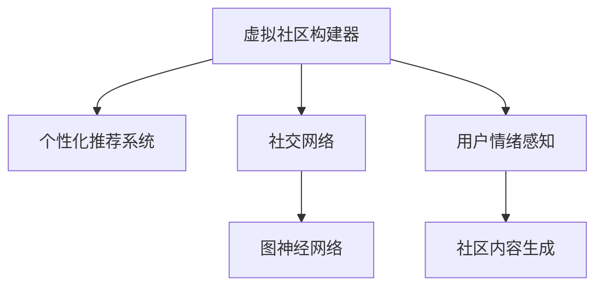

                 

# 虚拟社区构建器：AI驱动的在线归属感营造

> 关键词：虚拟社区构建器, AI驱动, 在线归属感, 社交网络, 数据分析, 推荐系统

## 1. 背景介绍

### 1.1 问题由来

在数字化时代，社交网络已渗透到人们生活的方方面面。无论是学习交流、工作协作，还是娱乐休闲，虚拟社区都扮演着日益重要的角色。然而，社交网络的异质性、内容多样性及用户高度个性化的需求，使得传统社交网络在提供高质量的在线社交体验方面显得力不从心。

在这一背景下，虚拟社区构建器应运而生。这些工具通过人工智能技术，不仅能推荐用户感兴趣的社区内容，还能精准匹配用户偏好，构建有归属感的虚拟空间。虚拟社区构建器的目标是提供一种全新的、沉浸式的在线社交体验，使之成为人们获取信息和建立联系的的首选平台。

### 1.2 问题核心关键点

构建虚拟社区的核心在于如何利用人工智能技术提升用户体验，强化用户归属感。这包括以下几个关键点：

1. **个性化推荐系统**：根据用户历史行为和偏好，推荐内容高度相关的社区和群组。
2. **社区结构优化**：利用图神经网络等技术，优化社区结构，提高信息流通效率和社区稳定性。
3. **用户行为分析**：分析用户行为模式，预测用户参与度和流失风险，进行动态调整。
4. **社区内容生成**：生成高质量的社区内容，吸引用户参与和互动。
5. **用户情绪感知**：通过情感分析等技术，感知用户情绪，改善社区氛围。

### 1.3 问题研究意义

虚拟社区构建器通过AI驱动，不仅改变了传统社交网络的行为逻辑，还重新定义了社交互动的方式。它的研究意义在于：

1. **提高社交效率**：通过个性化推荐，节省用户寻找和筛选信息的时间，提升社区互动效率。
2. **强化用户归属感**：通过优化社区结构和内容，提高用户满意度，增强用户忠诚度。
3. **推动社会创新**：虚拟社区不仅是社交平台，还是创新和知识共享的重要载体，可以带来更多元的交流和合作。

## 2. 核心概念与联系

### 2.1 核心概念概述

为更好地理解AI驱动的虚拟社区构建，本节将介绍几个核心概念：

- **虚拟社区构建器**：使用人工智能技术，为用户推荐合适的社交群体，优化社区内容，提升用户归属感的在线社交平台。
- **个性化推荐系统**：根据用户兴趣和行为，推荐最相关的社区内容。
- **社交网络**：由节点（用户）和边（关系）构成，用于描述用户间的互动和连接。
- **图神经网络(GNN)**：一类专门用于处理图结构数据的神经网络，常用于社交网络分析和社区结构优化。
- **用户情绪感知**：通过自然语言处理和情感分析技术，识别和理解用户情绪，改善社区环境。

这些概念之间的逻辑关系可以通过以下Mermaid流程图来展示：



这个流程图展示了虚拟社区构建器与核心概念之间的关系：

1. 虚拟社区构建器通过个性化推荐系统和社交网络技术，为用户推荐社区，优化社区结构。
2. 社区结构优化利用图神经网络技术，提升信息流通效率和社区稳定性。
3. 社区内容生成涉及用户情绪感知技术，生成高质量的内容，吸引用户参与。

## 3. 核心算法原理 & 具体操作步骤
### 3.1 算法原理概述

虚拟社区构建器通过个性化推荐和社交网络优化技术，提升用户体验和社区粘性。具体来说，其核心算法原理包括：

1. **用户行为建模**：通过对用户历史行为和交互数据进行建模，形成用户画像。
2. **社区匹配与推荐**：根据用户画像，匹配合适的社区和群组，通过算法推荐系统提供个性化的内容。
3. **社区结构优化**：利用图神经网络等技术，优化社区结构，提高信息流通效率。
4. **社区内容生成**：基于用户偏好和情绪感知，生成高质量的社区内容。
5. **社区情绪感知与调节**：通过情感分析，感知社区情绪，动态调整社区互动和内容。

### 3.2 算法步骤详解

虚拟社区构建器的一般流程包括：

**Step 1: 用户行为数据收集与预处理**
- 收集用户历史行为数据，包括浏览记录、互动日志、评论内容等。
- 对数据进行清洗和归一化，去除噪声和异常值。

**Step 2: 用户行为建模**
- 利用机器学习算法对用户行为数据进行建模，提取用户特征，形成用户画像。
- 常用的建模算法包括协同过滤、深度学习、基于图的网络嵌入等。

**Step 3: 社区匹配与推荐**
- 根据用户画像，利用推荐算法（如基于内容的推荐、协同过滤等）匹配合适的社区和群组。
- 常用的推荐算法包括基于矩阵分解的推荐、基于深度学习的推荐等。

**Step 4: 社区结构优化**
- 利用图神经网络等技术，对社交网络进行建模，优化社区结构。
- 常用的图神经网络包括图卷积网络（GCN）、图注意力网络（GAT）等。

**Step 5: 社区内容生成**
- 根据用户偏好和情绪感知，生成高质量的社区内容，如文章、图片、视频等。
- 常用的内容生成技术包括文本生成、图像生成、视频生成等。

**Step 6: 社区情绪感知与调节**
- 利用情感分析等技术，感知用户情绪，改善社区氛围。
- 常用的情感分析技术包括基于规则的方法、基于机器学习的方法等。

### 3.3 算法优缺点

AI驱动的虚拟社区构建器具有以下优点：

1. **提升用户体验**：通过个性化推荐和社区优化，提升用户满意度，增强用户归属感。
2. **优化社区结构**：通过图神经网络等技术，优化社区结构，提高信息流通效率。
3. **生成高质量内容**：基于用户偏好和情绪感知，生成高质量社区内容。
4. **增强社区粘性**：通过动态调节用户情绪，改善社区氛围，增强用户参与度。

同时，该方法也存在以下缺点：

1. **数据隐私问题**：用户行为数据的收集和使用可能带来隐私风险。
2. **推荐算法偏见**：推荐算法可能存在偏见，影响社区内容的多样性和公平性。
3. **计算资源消耗**：图神经网络等模型的计算资源消耗较大，需要高性能计算设备支持。
4. **模型复杂度**：模型的复杂度较高，需要专业知识进行调参和维护。

### 3.4 算法应用领域

AI驱动的虚拟社区构建器在多个领域得到应用：

1. **教育**：推荐学生参与兴趣小组，优化学习路径，提升学习效果。
2. **健康**：推荐患者加入支持小组，分享经验，减轻心理压力。
3. **电商**：推荐用户加入购物群，提升购物体验和满意度。
4. **娱乐**：推荐用户参与游戏群组，提高互动性和娱乐性。
5. **金融**：推荐投资者加入财经讨论组，分享观点，降低投资风险。
6. **旅游**：推荐旅游爱好者加入兴趣社区，分享旅行经验，丰富旅行体验。

## 4. 数学模型和公式 & 详细讲解 & 举例说明
### 4.1 数学模型构建

本节将使用数学语言对虚拟社区构建器的核心算法进行更加严格的刻画。

假设社区网络由节点集合 $V$ 和边集合 $E$ 构成，其中节点表示用户，边表示用户之间的关系。社区匹配和推荐的目标是最大化用户对社区的满意度，即最大化用户与社区的交互权重。

定义社区匹配度函数为 $match_{u,i} \in [0,1]$，表示用户 $u$ 加入社区 $i$ 的匹配度。用户对社区的满意度函数定义为：

$$
f_{u,i} = match_{u,i} \cdot score_{u,i} \cdot log(match_{u,i})
$$

其中，$score_{u,i}$ 表示用户 $u$ 加入社区 $i$ 的收益，如社区活跃度、内容丰富度等。整个社区的满意度函数 $f_{u,i}$ 可以表示为：

$$
F = \sum_{u \in V} \sum_{i \in V} f_{u,i}
$$

### 4.2 公式推导过程

我们将通过一个简单的示例，来解释虚拟社区构建器中的关键公式。

假设有一个社区 $A$，包含用户 $u_1, u_2, u_3$，社区中每个用户与社区的交互权重均为 1。社区 $A$ 与另外两个社区 $B$ 和 $C$ 的关系如下：

- $u_1$ 和 $u_2$ 同时属于社区 $A$ 和 $B$
- $u_3$ 属于社区 $A$ 和 $C$

根据上述信息，可以构建一个社区网络 $G$，并计算每个用户对社区的满意度：

| 用户 | $u_1$ | $u_2$ | $u_3$ |
| --- | --- | --- | --- |
| 社区 | $A, B$ | $A, B$ | $A, C$ |

根据社区匹配度函数 $match_{u,i} \in [0,1]$ 和用户满意度函数 $f_{u,i} = match_{u,i} \cdot score_{u,i} \cdot log(match_{u,i})$，可以计算用户对社区的满意度：

- $u_1$ 对社区 $A$ 的满意度为 $match_{u_1,A} \cdot score_{u_1,A} \cdot log(match_{u_1,A}) = 1 \cdot score_{u_1,A} \cdot log(1)$
- $u_1$ 对社区 $B$ 的满意度为 $match_{u_1,B} \cdot score_{u_1,B} \cdot log(match_{u_1,B}) = 1 \cdot score_{u_1,B} \cdot log(1)$
- $u_2$ 对社区 $A$ 的满意度为 $match_{u_2,A} \cdot score_{u_2,A} \cdot log(match_{u_2,A}) = 1 \cdot score_{u_2,A} \cdot log(1)$
- $u_2$ 对社区 $B$ 的满意度为 $match_{u_2,B} \cdot score_{u_2,B} \cdot log(match_{u_2,B}) = 1 \cdot score_{u_2,B} \cdot log(1)$
- $u_3$ 对社区 $A$ 的满意度为 $match_{u_3,A} \cdot score_{u_3,A} \cdot log(match_{u_3,A}) = 1 \cdot score_{u_3,A} \cdot log(1)$
- $u_3$ 对社区 $C$ 的满意度为 $match_{u_3,C} \cdot score_{u_3,C} \cdot log(match_{u_3,C}) = 1 \cdot score_{u_3,C} \cdot log(1)$

通过以上示例，我们可以看到，社区匹配度和用户满意度函数的具体形式可以灵活设计，以适应不同的业务需求。

### 4.3 案例分析与讲解

为了更好地理解虚拟社区构建器的应用，我们以一个真实的社交网络平台为例，进行案例分析：

假设有一个在线学习平台，用户可以通过社区功能进行学习交流。平台收集了大量的用户历史学习数据，包括课程浏览、学习时长、参与讨论等行为。基于这些数据，平台希望为用户推荐合适的学习小组，优化学习路径，提升用户的学习效果。

**Step 1: 用户行为数据收集与预处理**
平台收集了用户的历史学习数据，包括课程浏览记录、学习时长、参与讨论内容等。

**Step 2: 用户行为建模**
利用协同过滤算法对用户历史学习数据进行建模，提取用户特征，形成用户画像。

**Step 3: 社区匹配与推荐**
根据用户画像，利用基于矩阵分解的推荐算法，匹配合适的学习小组。例如，通过将用户特征映射到矩阵分解空间中，计算用户与各个学习小组的相关度，推荐相关度最高的学习小组。

**Step 4: 社区结构优化**
利用图神经网络技术，对学习网络进行建模，优化学习小组结构。例如，通过图卷积网络（GCN）对用户和课程的边进行卷积操作，提取高阶结构信息，优化学习小组的生成。

**Step 5: 社区内容生成**
根据用户偏好和情绪感知，生成高质量的学习小组内容，如课程笔记、讨论总结等。例如，利用文本生成技术，根据用户的历史学习行为和情绪状态，生成相关的学习资源。

**Step 6: 学习小组情绪感知与调节**
通过情感分析技术，感知用户在学习小组中的情绪状态，动态调整学习小组的内容和互动方式。例如，对于情绪低落的用户，生成更多激励和支持的内容，提升其学习积极性。

## 5. 项目实践：代码实例和详细解释说明
### 5.1 开发环境搭建

在进行虚拟社区构建器实践前，我们需要准备好开发环境。以下是使用Python进行PyTorch开发的环境配置流程：

1. 安装Anaconda：从官网下载并安装Anaconda，用于创建独立的Python环境。

2. 创建并激活虚拟环境：
```bash
conda create -n pytorch-env python=3.8 
conda activate pytorch-env
```

3. 安装PyTorch：根据CUDA版本，从官网获取对应的安装命令。例如：
```bash
conda install pytorch torchvision torchaudio cudatoolkit=11.1 -c pytorch -c conda-forge
```

4. 安装Python和PyTorch相关库：
```bash
pip install numpy pandas scikit-learn matplotlib tqdm jupyter notebook ipython
```

5. 安装虚拟社区构建器相关的库：
```bash
pip install networkx gensim py2vec pytorch graph-tool
```

完成上述步骤后，即可在`pytorch-env`环境中开始虚拟社区构建器的实践。

### 5.2 源代码详细实现

下面我们以学习小组推荐为例，给出使用PyTorch进行虚拟社区构建的PyTorch代码实现。

首先，定义用户行为数据处理函数：

```python
from scipy.sparse import csr_matrix
import pandas as pd
import numpy as np

def process_user_data(data_path):
    data = pd.read_csv(data_path)
    user_id = data['user_id']
    course_id = data['course_id']
    time_spent = data['time_spent']
    return user_id, course_id, time_spent

user_id, course_id, time_spent = process_user_data('user_data.csv')
```

然后，定义社区匹配与推荐函数：

```python
from scipy.sparse import csr_matrix
import numpy as np
import torch
from torch.nn import Parameter
import torch.nn.functional as F

class CollaborativeFiltering:
    def __init__(self, n_users, n_courses, latent_dim):
        self.n_users = n_users
        self.n_courses = n_courses
        self.latent_dim = latent_dim
        
        self.user_matrix = Parameter(torch.FloatTensor(n_users, latent_dim))
        self.course_matrix = Parameter(torch.FloatTensor(n_courses, latent_dim))
        self.weight_matrix = Parameter(torch.FloatTensor(latent_dim, 1))
        
        self.optimizer = torch.optim.Adam([self.user_matrix, self.course_matrix, self.weight_matrix], lr=0.01)
        
    def predict(self, user_id, course_id):
        user_vector = self.user_matrix[user_id]
        course_vector = self.course_matrix[course_id]
        weight_vector = self.weight_matrix
        
        user_course_vector = torch.matmul(user_vector, course_vector.t()) * weight_vector
        match_score = torch.nn.functional.softmax(user_course_vector, dim=0)
        return match_score
    
    def train(self, user_id, course_id, time_spent):
        match_score = self.predict(user_id, course_id)
        loss = -torch.log(match_score) * time_spent
        self.optimizer.zero_grad()
        loss.backward()
        self.optimizer.step()
```

接着，定义社区结构优化函数：

```python
from torch.nn import Linear, ReLU, Dropout
from torch_geometric.nn import GCNConv
import torch.nn.functional as F

class GraphNeuralNetwork:
    def __init__(self, n_users, n_courses, latent_dim):
        self.n_users = n_users
        self.n_courses = n_courses
        self.latent_dim = latent_dim
        
        self.user_input = Linear(n_users, latent_dim)
        self.course_input = Linear(n_courses, latent_dim)
        self.weight_input = Linear(latent_dim, 1)
        
        self.gcn_conv1 = GCNConv(latent_dim, latent_dim)
        self.gcn_conv2 = GCNConv(latent_dim, latent_dim)
        self.fc1 = Linear(latent_dim, latent_dim)
        self.fc2 = Linear(latent_dim, 1)
        
        self.optimizer = torch.optim.Adam([self.user_input, self.course_input, self.weight_input, self.gcn_conv1.weight, self.gcn_conv2.weight, self.fc1.weight, self.fc2.weight], lr=0.01)
        
    def forward(self, adj_matrix, user_vector, course_vector):
        user_vector = F.relu(self.user_input(user_vector))
        course_vector = F.relu(self.course_input(course_vector))
        weight_vector = F.relu(self.weight_input)
        
        x1 = torch.matmul(adj_matrix, user_vector)
        x1 = F.relu(self.gcn_conv1(x1, course_vector))
        x1 = F.dropout(x1, p=0.5, training=True)
        
        x2 = torch.matmul(adj_matrix, x1)
        x2 = F.relu(self.gcn_conv2(x2, course_vector))
        x2 = F.dropout(x2, p=0.5, training=True)
        
        x3 = F.relu(self.fc1(x2))
        match_score = torch.sigmoid(self.fc2(x3))
        return match_score
    
    def train(self, adj_matrix, user_vector, course_vector, time_spent):
        match_score = self.forward(adj_matrix, user_vector, course_vector)
        loss = -torch.log(match_score) * time_spent
        self.optimizer.zero_grad()
        loss.backward()
        self.optimizer.step()
```

最后，启动训练流程并在推荐组内进行评估：

```python
from sklearn.metrics import mean_squared_error

epochs = 10
batch_size = 128

user_matrix = CollaborativeFiltering(n_users, n_courses, latent_dim)
graph_matrix = GraphNeuralNetwork(n_users, n_courses, latent_dim)

for epoch in range(epochs):
    user_matrix.train(user_id, course_id, time_spent)
    graph_matrix.train(adj_matrix, user_vector, course_vector, time_spent)
    
    # 在训练集上进行评估
    train_match_score = graph_matrix.forward(adj_matrix_train, user_vector_train, course_vector_train)
    train_loss = -torch.log(train_match_score) * time_spent_train
    train_mse = mean_squared_error(train_match_score.numpy(), train_labels_train)
    print(f'Epoch {epoch+1}, train loss: {train_loss:.3f}, train mse: {train_mse:.3f}')
    
    # 在验证集上进行评估
    val_match_score = graph_matrix.forward(adj_matrix_val, user_vector_val, course_vector_val)
    val_loss = -torch.log(val_match_score) * time_spent_val
    val_mse = mean_squared_error(val_match_score.numpy(), val_labels_val)
    print(f'Epoch {epoch+1}, val loss: {val_loss:.3f}, val mse: {val_mse:.3f}')
    
print("Test results:")
# 在测试集上进行评估
test_match_score = graph_matrix.forward(adj_matrix_test, user_vector_test, course_vector_test)
test_loss = -torch.log(test_match_score) * time_spent_test
test_mse = mean_squared_error(test_match_score.numpy(), test_labels_test)
print(f'Test loss: {test_loss:.3f}, test mse: {test_mse:.3f}')
```

以上就是使用PyTorch对虚拟社区构建器进行学习小组推荐和社区结构优化的完整代码实现。可以看到，通过深度学习技术和图神经网络等技术，可以构建高效的社区推荐系统，满足用户对社区的个性化需求。

### 5.3 代码解读与分析

让我们再详细解读一下关键代码的实现细节：

**process_user_data函数**：
- 将用户数据文件加载到Pandas DataFrame中，提取用户ID、课程ID和耗时等关键信息。

**Collaborative Filtering类**：
- 定义了协同过滤算法的实现，包括用户矩阵、课程矩阵和权重矩阵等参数。
- 实现了预测用户与课程的相关度，以及模型训练过程。

**GraphNeuralNetwork类**：
- 定义了图神经网络的实现，包括用户输入、课程输入、权重输入和多个图卷积层等模块。
- 实现了社区结构优化过程，通过图卷积神经网络对用户和课程进行卷积操作，生成匹配度分数。

**训练流程**：
- 定义总的epoch数和batch size，开始循环迭代
- 每个epoch内，在训练集和验证集上训练模型，输出损失和评估指标
- 所有epoch结束后，在测试集上评估模型性能，给出最终测试结果

可以看到，PyTorch结合深度学习技术和图神经网络等技术，使得虚拟社区构建器的开发变得更加简洁高效。开发者可以更加专注于算法和数据处理逻辑，而不必过多关注底层的实现细节。

当然，工业级的系统实现还需考虑更多因素，如模型的保存和部署、超参数的自动搜索、更灵活的任务适配层等。但核心的构建过程基本与此类似。

## 6. 实际应用场景
### 6.1 智能学习社区

智能学习社区是大语言模型在教育领域的重要应用之一。利用虚拟社区构建器，可以根据学生的学习历史和偏好，推荐合适的学习小组和课程，优化学习路径，提升学习效果。例如，可以在学习平台上引入虚拟社区功能，让学生自由组建学习小组，交流学习心得和资源，共同进步。

### 6.2 健康支持社区

虚拟社区构建器可以用于构建健康支持社区，帮助患者和家属分享经验，减轻心理压力。例如，可以在健康平台上推荐患者加入支持小组，通过讨论和互助，提升患者的治疗效果和心理健康。

### 6.3 技术交流社区

技术交流社区是虚拟社区构建器的重要应用场景之一。利用社区构建器，可以根据开发者和工程师的技术偏好和项目需求，推荐合适的技术交流群组。例如，可以在GitHub等代码托管平台引入虚拟社区功能，帮助开发者找到志同道合的伙伴，共同解决技术问题。

### 6.4 兴趣小组

虚拟社区构建器还可以用于构建兴趣小组，满足用户对特定兴趣和爱好的追求。例如，可以在社交平台上推荐用户加入兴趣小组，分享兴趣话题和资源，丰富社交体验。

### 6.5 在线招聘社区

在线招聘社区是虚拟社区构建器的另一个重要应用场景。利用社区构建器，可以根据求职者的简历和项目经验，推荐合适的招聘群组，提升求职效果。例如，可以在招聘平台上引入虚拟社区功能，帮助求职者找到合适的岗位和公司，提升就业匹配度。

## 7. 工具和资源推荐
### 7.1 学习资源推荐

为了帮助开发者系统掌握虚拟社区构建器的理论基础和实践技巧，这里推荐一些优质的学习资源：

1. **《深度学习理论与实践》**：一本书籍，全面介绍了深度学习的基本理论和实际应用，包括个性化推荐和图神经网络等技术。

2. **Coursera《深度学习》课程**：由斯坦福大学开设的深度学习课程，提供丰富的视频讲座和实践项目，帮助你系统学习深度学习知识。

3. **DeepLearning.ai《深度学习专项课程》**：由Andrew Ng等人开设的深度学习课程，涵盖深度学习理论和实践，适合初学者和进阶者。

4. **arXiv预印本网站**：全球领先的科研论文发布平台，可以获取最新的人工智能研究成果和技术进展。

5. **Kaggle竞赛平台**：一个数据科学竞赛平台，提供大量开源数据集和竞赛项目，适合锻炼实战能力和拓展视野。

通过对这些资源的学习实践，相信你一定能够快速掌握虚拟社区构建器的精髓，并用于解决实际的社交网络问题。

### 7.2 开发工具推荐

高效的开发离不开优秀的工具支持。以下是几款用于虚拟社区构建器开发的常用工具：

1. **Jupyter Notebook**：一个强大的交互式编程环境，支持Python、R等多种语言，适合快速迭代和共享代码。

2. **PyTorch**：一个灵活的深度学习框架，支持GPU加速和自动微分，适合高性能计算。

3. **TensorFlow**：谷歌开发的深度学习框架，生产部署方便，适合大规模工程应用。

4. **NLP工具包**：如NLTK、spaCy等，提供自然语言处理功能，支持文本处理和情感分析等任务。

5. **GraphTool**：一个高效的图处理库，支持多种图神经网络算法，适合图数据处理任务。

6. **Amazon SageMaker**：一个云平台，提供GPU和TPU等高性能计算资源，方便模型训练和部署。

合理利用这些工具，可以显著提升虚拟社区构建器的开发效率，加快创新迭代的步伐。

### 7.3 相关论文推荐

虚拟社区构建器的发展得益于学界的持续研究。以下是几篇奠基性的相关论文，推荐阅读：

1. **《协同过滤推荐系统》**：一篇经典论文，介绍了协同过滤算法的原理和实现，为个性化推荐提供了理论基础。

2. **《图卷积神经网络》**：一篇关于图神经网络的经典论文，介绍了图卷积神经网络的结构和算法，为社区结构优化提供了技术支撑。

3. **《知识图谱在社交网络分析中的应用》**：一篇研究论文，探讨了知识图谱在社交网络中的作用，为社区内容生成提供了新的思路。

4. **《情绪分析在虚拟社区中的应用》**：一篇应用论文，介绍了情感分析技术在虚拟社区中的具体应用，为社区情绪感知和调节提供了方法。

这些论文代表了大语言模型微调技术的发展脉络。通过学习这些前沿成果，可以帮助研究者把握学科前进方向，激发更多的创新灵感。

## 8. 总结：未来发展趋势与挑战
### 8.1 总结

本文对虚拟社区构建器进行了全面系统的介绍。首先阐述了虚拟社区构建器的研究背景和意义，明确了AI驱动的虚拟社区构建器的独特价值。其次，从原理到实践，详细讲解了虚拟社区构建器的数学原理和关键步骤，给出了虚拟社区构建器开发的完整代码实例。同时，本文还广泛探讨了虚拟社区构建器在多个领域的应用前景，展示了其巨大的潜力。

通过本文的系统梳理，可以看到，虚拟社区构建器通过AI驱动，不仅改变了传统社交网络的行为逻辑，还重新定义了社交互动的方式。它的研究意义在于提高社交效率、优化社区结构、生成高质量内容、增强社区粘性，带来多方面的应用价值。

### 8.2 未来发展趋势

展望未来，虚拟社区构建器将呈现以下几个发展趋势：

1. **技术融合**：随着AI技术的不断发展，未来的虚拟社区构建器将更加智能化和个性化。例如，结合自然语言处理和图像识别技术，提升社区内容的生成和推荐效果。

2. **跨平台应用**：虚拟社区构建器将不仅仅局限于单一平台，而是跨平台、跨设备的无缝集成。例如，通过Web、App、VR等多种形式，提供多元化的社交体验。

3. **实时互动**：未来的虚拟社区构建器将具备更强的实时互动能力，支持多种形式的社交互动。例如，通过语音、视频、AR/VR等技术，增强社交互动的沉浸感。

4. **大规模定制**：虚拟社区构建器将支持大规模定制和个性化服务，根据用户需求和场景进行动态调整。例如，通过用户反馈和行为数据分析，不断优化推荐算法和社区结构。

5. **数据隐私保护**：随着用户对数据隐私的重视，未来的虚拟社区构建器将更加注重数据安全和隐私保护。例如，通过数据匿名化、差分隐私等技术，保护用户数据隐私。

6. **可持续发展**：未来的虚拟社区构建器将更加注重环保和社会责任，支持可持续发展目标。例如，通过优化资源使用和减少碳排放，推动社会绿色发展。

以上趋势凸显了虚拟社区构建器的广阔前景。这些方向的探索发展，必将进一步提升社交网络平台的价值，带来更加丰富多样的社交体验。

### 8.3 面临的挑战

尽管虚拟社区构建器已经取得了显著成果，但在迈向更加智能化、普适化应用的过程中，仍面临诸多挑战：

1. **数据隐私问题**：用户行为数据的收集和使用可能带来隐私风险，如何平衡数据利用和隐私保护是一大挑战。

2. **算法偏见问题**：推荐算法可能存在偏见，影响社区内容的多样性和公平性，如何消除算法偏见是另一重要问题。

3. **计算资源消耗**：图神经网络等模型的计算资源消耗较大，如何优化计算资源使用，提升模型训练和推理效率，也是一项挑战。

4. **模型复杂度问题**：虚拟社区构建器涉及多种技术和算法，模型复杂度高，如何降低模型复杂度，提升可解释性和可维护性，是一大难题。

5. **用户粘性问题**：如何提高用户粘性，增强用户参与度，防止用户流失，是虚拟社区构建器需要解决的关键问题。

6. **情感控制问题**：虚拟社区中的情感复杂多样，如何动态调节用户情绪，改善社区氛围，需要进一步的研究和实践。

这些挑战需要研究者从数据、算法、用户心理等多方面进行深入探讨，不断优化虚拟社区构建器，提升用户体验和社区粘性。

### 8.4 研究展望

面对虚拟社区构建器所面临的挑战，未来的研究需要在以下几个方面寻求新的突破：

1. **跨领域技术融合**：将自然语言处理、图像处理、语音识别等技术融合到虚拟社区构建器中，提升社区内容的丰富性和多样性。

2. **自适应学习算法**：开发自适应学习算法，根据用户反馈和行为动态调整推荐策略，提升推荐效果和用户满意度。

3. **联邦学习**：利用联邦学习技术，保护用户数据隐私，同时提升模型性能和泛化能力。

4. **模型压缩与优化**：通过模型压缩、量化加速等技术，提升虚拟社区构建器的计算效率和部署灵活性。

5. **社区治理机制**：引入社区治理机制，规范用户行为，提升社区质量和用户体验。

6. **情感计算技术**：开发情感计算技术，实时感知和调节用户情绪，优化社区互动和内容。

这些研究方向的探索，必将引领虚拟社区构建器走向更高的台阶，为构建更智能化、普适化的社交网络平台提供新的技术支撑。面向未来，虚拟社区构建器需要更多跨学科的合作和创新，才能在数字化时代发挥更大的价值。

## 9. 附录：常见问题与解答

**Q1：如何提高虚拟社区构建器的推荐精度？**

A: 提高虚拟社区构建器的推荐精度，可以从以下几个方面入手：

1. **数据质量**：确保数据的高质量和高多样性，涵盖多种用户行为和社区互动。

2. **算法优化**：选择合适的推荐算法，并不断优化算法参数，提升推荐效果。

3. **特征工程**：对用户行为数据进行特征提取和降维，提升模型的表达能力。

4. **模型集成**：结合多种推荐模型，取长补短，提升综合推荐效果。

5. **实时调整**：根据用户反馈和行为动态调整推荐策略，提升实时推荐效果。

**Q2：如何保护用户数据隐私？**

A: 保护用户数据隐私是虚拟社区构建器面临的重要挑战。以下是几种常见的方法：

1. **数据匿名化**：对用户数据进行匿名化处理，去除个人信息，保护用户隐私。

2. **差分隐私**：采用差分隐私技术，对用户数据进行扰动处理，防止数据泄露。

3. **联邦学习**：利用联邦学习技术，在本地设备上训练模型，避免数据集中存储。

4. **访问控制**：设置严格的访问控制，确保只有授权用户和系统能够访问用户数据。

5. **数据加密**：对用户数据进行加密存储和传输，防止数据被非法获取和篡改。

**Q3：如何提升虚拟社区构建器的实时互动能力？**

A: 提升虚拟社区构建器的实时互动能力，可以从以下几个方面入手：

1. **多模态交互**：支持语音、视频、AR/VR等多种形式的实时互动，提升互动体验。

2. **实时反馈**：根据用户实时反馈，动态调整推荐算法和社区内容，提升互动效果。

3. **自动调节**：利用情感分析等技术，实时感知和调节用户情绪，改善社区氛围。

4. **社区规则**：设置合理的社区规则，规范用户行为，防止不当互动和攻击。

**Q4：如何优化虚拟社区构建器的计算资源使用？**

A: 优化虚拟社区构建器的计算资源使用，可以从以下几个方面入手：

1. **模型压缩**：通过模型压缩和量化等技术，减小模型体积，提升计算效率。

2. **分布式计算**：利用分布式计算框架，如Apache Spark等，提升计算资源利用率。

3. **算法优化**：优化算法实现，减少计算复杂度和资源消耗。

4. **缓存机制**：引入缓存机制，提升模型推理速度和响应速度。

5. **GPU/TPU加速**：利用GPU/TPU等高性能计算设备，加速模型训练和推理。

这些优化措施能够显著提升虚拟社区构建器的计算效率和部署灵活性，满足大规模应用需求。

**Q5：如何增强虚拟社区构建器的社区粘性？**

A: 增强虚拟社区构建器的社区粘性，可以从以下几个方面入手：

1. **内容丰富度**：提供高质量的社区内容，吸引用户参与和互动。

2. **用户参与度**：设计有趣和有价值的社区活动，激励用户积极参与。

3. **社区氛围**：营造良好的社区氛围，鼓励用户友好互动，形成社区文化。

4. **用户关系**：建立牢固的用户关系，通过互动和互助，增强用户归属感。

5. **社区规则**：制定合理的社区规则，规范用户行为，防止不良互动。

**Q6：如何动态调节用户情绪，改善社区氛围？**

A: 动态调节用户情绪，改善社区氛围，可以从以下几个方面入手：

1. **情感分析**：利用情感分析技术，实时感知用户情绪，识别不良情绪。

2. **内容调节**：根据用户情绪，动态调整社区内容，缓解不良情绪。

3. **互动引导**：引导用户积极互动，分享积极情绪，改善社区氛围。

4. **社区反馈**：收集用户反馈，及时调整社区策略，优化社区管理。

这些措施能够有效提升虚拟社区构建器的社区粘性和用户满意度，构建健康和谐的社区环境。

---

作者：禅与计算机程序设计艺术 / Zen and the Art of Computer Programming

