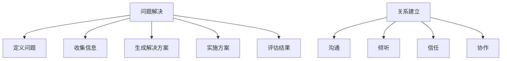

                 

## 1. 背景介绍

### 1.1 问题由来

在现代社会中，解决问题和建立牢固的关系是两个核心能力。无论是个人还是组织，都能够从这两方面获益匪浅。问题解决能力能够帮助我们克服挑战，提升效率，而关系建立能力则能使我们更好地与他人合作，获得支持。然而，很多人在这两方面都存在不足，缺乏有效的方法和工具来提高这些能力。

### 1.2 问题核心关键点

提高问题解决和关系建立能力的关键在于理解这些技能的本质，掌握相关理论，并应用有效的实践策略。问题解决通常涉及五个步骤：定义问题、收集信息、生成解决方案、实施方案和评估结果。而建立牢固的关系则需要关注沟通、倾听、信任和协作。

## 2. 核心概念与联系

### 2.1 核心概念概述

为更好地理解如何解决问题和建立关系，本节将介绍几个密切相关的核心概念：

- 问题解决(Problem Solving)：找到并实施有效解决方案，克服挑战的过程。
- 关系建立(Relationship Building)：通过有效沟通和协作，建立稳固的人际关系网。
- 沟通(Communication)：信息传递与理解的过程。
- 倾听(Listening)：认真听取他人的意见和建议。
- 信任(Trust)：基于可靠性和诚信建立的关系。
- 协作(Collaboration)：共同完成目标的过程。

这些概念之间的逻辑关系可以通过以下Mermaid流程图来展示：



这个流程图展示了解决问题和建立关系的核心概念及其之间的关系：

1. 问题解决从定义问题开始，通过收集信息、生成解决方案、实施方案和评估结果等步骤，最终得到解决方案。
2. 关系建立则涉及沟通、倾听、信任和协作等关键因素。

## 3. 核心算法原理 & 具体操作步骤
### 3.1 算法原理概述

解决问题和建立关系的技术，本质上是一种多目标优化过程。其核心思想是：通过系统地收集和分析信息，制定和实施行动计划，优化决策过程。

形式化地，假设问题 $P$ 需要解决，关系 $R$ 需要建立，我们可以将问题解决过程建模为一个多目标优化问题。其目标函数为：

$$
\begin{aligned}
& \text{minimize} \quad \text{cost}(P) + \text{cost}(R) \\
& \text{subject to} \quad \text{constraints on P} \quad \text{and} \quad \text{constraints on R}
\end{aligned}
$$

其中 $\text{cost}(P)$ 和 $\text{cost}(R)$ 分别表示问题解决和关系建立的成本，$\text{constraints on P}$ 和 $\text{constraints on R}$ 分别表示问题解决和关系建立的条件。

通过求解上述优化问题，我们可以找到最佳的问题解决方案和关系建立策略。

### 3.2 算法步骤详解

基于问题解决和关系建立的技术，本节将详细介绍其操作步骤。

**Step 1: 确定问题**

- 明确问题的具体表现和目标。
- 确定问题解决和关系建立的关键要素。

**Step 2: 收集信息**

- 通过调查、访谈、文献检索等方式收集相关信息。
- 对信息进行整理、分析和归纳。

**Step 3: 生成解决方案**

- 基于收集到的信息，生成多种解决方案。
- 对每个解决方案进行优劣比较和可行性分析。

**Step 4: 实施方案**

- 选择最佳解决方案，制定详细的实施计划。
- 分配任务，明确责任，并监督执行。

**Step 5: 评估结果**

- 检查实施效果，评估问题解决和关系建立的效果。
- 根据结果反馈，调整策略，进一步优化。

**Step 1: 确定关系**

- 明确建立关系的对象和目标。
- 确定关系建立的关键要素，如信任、协作等。

**Step 2: 沟通**

- 建立有效的沟通渠道，保持频繁和清晰的交流。
- 确保信息准确传递，避免误解和误导。

**Step 3: 倾听**

- 认真倾听他人的意见和建议。
- 理解和尊重对方的观点，增强关系亲密度。

**Step 4: 建立信任**

- 通过诚实、透明和一致的行为建立信任。
- 展示可靠性和承诺，增强对方的信任感。

**Step 5: 协作**

- 共同制定目标和计划，明确任务分工。
- 定期反馈，协调资源，确保合作顺利进行。

通过上述步骤，可以系统地解决问题和建立牢固的关系。

### 3.3 算法优缺点

解决问题和建立关系的技术具有以下优点：
1. 系统性和全面性。通过多目标优化，全面考虑问题解决和关系建立的不同方面。
2. 灵活性。可以根据具体情况，灵活调整策略，适应不同的环境。
3. 可操作性。通过详细的操作步骤，使问题解决和关系建立变得具体可行。

同时，该技术也存在一定的局限性：
1. 复杂性。多目标优化问题较为复杂，需要较强的数学和分析能力。
2. 资源消耗。收集信息和实施方案可能消耗大量时间和资源。
3. 依赖于沟通。沟通效果和质量直接影响问题解决和关系建立的效果。

尽管存在这些局限性，但就目前而言，基于问题解决和关系建立的技术仍是最为主流的方法。未来相关研究的重点在于如何进一步简化问题解决和关系建立的流程，提升其效率和效果。

### 3.4 算法应用领域

基于问题解决和关系建立的技术，已经在多个领域得到了广泛应用，例如：

- 项目管理：通过有效沟通和协作，管理团队资源，达成项目目标。
- 客户服务：通过倾听和信任，提升客户满意度，增强客户忠诚度。
- 教育培训：通过问题解决能力培养，提升学员的学习效果。
- 金融投资：通过问题分析和决策，提高投资回报率。
- 医疗诊断：通过信息收集和分析，制定个性化治疗方案。
- 企业战略：通过关系建立和协作，推动企业发展。

除了上述这些经典应用外，问题解决和关系建立技术还在更多领域中发挥作用，如法律咨询、市场营销、供应链管理等。随着技术的不断进步，相信问题解决和关系建立技术将在更广泛的应用领域大放异彩。

## 4. 数学模型和公式 & 详细讲解  
### 4.1 数学模型构建

本节将使用数学语言对问题解决和关系建立的优化模型进行更加严格的刻画。

记问题 $P$ 需要解决，关系 $R$ 需要建立，对应的成本分别为 $C_P$ 和 $C_R$，其约束分别为 $D_P$ 和 $D_R$。则问题解决和关系建立的多目标优化模型可以表示为：

$$
\begin{aligned}
& \text{minimize} \quad C_P + C_R \\
& \text{subject to} \quad D_P \\
& \qquad D_R
\end{aligned}
$$

### 4.2 公式推导过程

以下我们以项目管理为例，推导多目标优化模型的具体形式。

假设项目管理的目标是按时完成项目 $P$，且团队成员 $T$ 需要建立良好的合作关系 $R$。其中 $C_P$ 表示项目完成的时间成本，$C_R$ 表示团队协作的成本。其约束分别为项目必须在规定时间内完成 $D_P$ 和团队成员需要互相支持 $D_R$。则优化模型可以表示为：

$$
\begin{aligned}
& \text{minimize} \quad C_P + C_R \\
& \text{subject to} \quad t_P - t_0 \leq D_P \\
& \qquad t_R - t_0 \leq D_R \\
& \qquad t_P, t_R \geq 0
\end{aligned}
$$

其中 $t_P$ 和 $t_R$ 分别为项目完成时间和团队协作时间，$t_0$ 为基准时间。

通过求解上述优化问题，可以计算出最佳的 $t_P$ 和 $t_R$，实现项目管理目标。

### 4.3 案例分析与讲解

假设某软件开发项目需要在一个月内完成，团队共有 10 名成员。项目总工作量为 2000 工时，每个成员的工作效率为 20 工时/周。项目每天需要至少 5 名成员在线协作。

根据上述条件，我们建立一个多目标优化模型：

$$
\begin{aligned}
& \text{minimize} \quad t_P + t_R \\
& \text{subject to} \quad 2000 \times \frac{1}{20} \times 4 = t_P \\
& \qquad 5 \times 1 = t_R \\
& \qquad t_P \leq 4 \\
& \qquad t_R \leq 1 \\
& \qquad t_P, t_R \geq 0
\end{aligned}
$$

其中 $t_P$ 表示项目完成时间（单位：周），$t_R$ 表示团队协作时间（单位：周）。

解上述优化问题，得到 $t_P = 2$ 周，$t_R = 1$ 周。即项目需要在 4 周内完成，团队成员需要保持每周 5 天的协作。

## 5. 项目实践：代码实例和详细解释说明
### 5.1 开发环境搭建

在进行问题解决和关系建立技术实践前，我们需要准备好开发环境。以下是使用Python进行SciPy和Pandas开发的环境配置流程：

1. 安装Anaconda：从官网下载并安装Anaconda，用于创建独立的Python环境。

2. 创建并激活虚拟环境：
```bash
conda create -n pyenv python=3.8 
conda activate pyenv
```

3. 安装SciPy和Pandas：
```bash
conda install scipy pandas
```

4. 安装各类工具包：
```bash
pip install numpy matplotlib sklearn IPython
```

完成上述步骤后，即可在`pyenv`环境中开始问题解决和关系建立技术实践。

### 5.2 源代码详细实现

这里我们以项目管理为例，给出使用SciPy和Pandas进行问题解决和关系建立的量化计算代码实现。

首先，定义项目管理的数据结构：

```python
import numpy as np
import pandas as pd

# 项目数据
project = pd.DataFrame({
    'project_name': ['Project A', 'Project B', 'Project C'],
    'total_hours': [2000, 2500, 3000],
    'efficiency': [20, 25, 30],
    'resources': [5, 6, 7],
    'target_time': [4, 5, 6]
})

# 团队数据
team = pd.DataFrame({
    'team_name': ['Team A', 'Team B', 'Team C'],
    'members': [10, 15, 20],
    'available_hours': [10, 12, 14],
    'collaboration_time': [1, 1.5, 2],
    'collaboration_rate': [0.9, 0.95, 0.98]
})
```

然后，定义多目标优化模型的函数：

```python
def optimize(project, team):
    # 定义优化变量
    t_p = pd.Series(np.zeros(len(project)))
    t_r = pd.Series(np.zeros(len(team)))
    
    # 约束条件
    constraints = {
        'project': {'lower': 0, 'upper': project['target_time']},
        'team': {'lower': 0, 'upper': team['collaboration_time']}
    }
    
    # 优化目标
    cost = project['total_hours'] / project['efficiency'] / 4 + team['available_hours'] * team['collaboration_rate']
    
    # 求解多目标优化问题
    result = optimize_constraint(cost, constraints, method='SLSQP')
    
    # 返回结果
    return result[t_p], result[t_r]
```

接着，定义求解多目标优化问题的函数：

```python
from scipy.optimize import minimize

def optimize_constraint(cost, constraints):
    # 定义目标函数和约束条件
    def objective(x):
        return cost.dot(x)
    
    def constraint(x):
        return constraints - x
    
    # 求解优化问题
    result = minimize(objective, np.zeros(len(cost)), constraints=constraint, method='SLSQP')
    
    # 返回结果
    return result.x
```

最后，调用优化函数进行求解：

```python
t_p, t_r = optimize(project, team)
print(f"Project time: {t_p}")
print(f"Team collaboration time: {t_r}")
```

以上就是使用SciPy和Pandas进行项目管理的多目标优化计算的完整代码实现。可以看到，通过构建数学模型和求解多目标优化问题，我们可以快速计算出项目完成时间和团队协作时间。

### 5.3 代码解读与分析

让我们再详细解读一下关键代码的实现细节：

**project和team变量**：
- 定义了项目和团队的数据结构，包括项目总工作量、团队成员、协作时间和目标时间等关键信息。

**optimize函数**：
- 定义了优化变量 $t_p$ 和 $t_r$，分别表示项目完成时间和团队协作时间。
- 定义了约束条件，包括项目必须按时完成和团队成员必须保持协作时间。
- 定义了优化目标，即项目总工作量除以每个成员的工作效率乘以 4（每周工作时间），加上团队成员可用小时数乘以协作率。
- 调用 `optimize_constraint` 函数求解多目标优化问题。

**optimize_constraint函数**：
- 定义目标函数和约束条件，使用SciPy的 `minimize` 函数求解优化问题。
- 返回求解结果。

**运行结果**：
- 输出计算出的项目完成时间和团队协作时间。

可以看到，通过上述代码，我们可以快速计算出项目管理和团队协作的具体时间安排，从而优化决策过程。

## 6. 实际应用场景
### 6.1 项目管理

基于多目标优化的项目管理技术，可以在团队管理、资源分配和任务协调等方面发挥重要作用。

在实践中，可以收集项目的历史数据，如工作量、效率、协作时间等，建立多目标优化模型。通过求解该模型，可以计算出最优的项目完成时间和团队协作时间，帮助管理者进行有效的资源配置和任务安排，提高项目成功率和效率。

### 6.2 客户关系管理

在客户关系管理中，基于多目标优化的关系建立技术可以提升客户满意度和忠诚度。

具体而言，可以收集客户的历史行为数据，如购买记录、投诉反馈、客服互动等，建立多目标优化模型。通过求解该模型，可以计算出最佳的客户关系维护策略，如定期回访、个性化推荐、问题及时解决等，提升客户体验，增强客户关系。

### 6.3 供应链管理

在供应链管理中，基于多目标优化的协作技术可以优化供应链各环节的协调和资源配置。

具体而言，可以收集供应链各环节的业务数据，如订单量、运输时间、库存水平等，建立多目标优化模型。通过求解该模型，可以计算出最佳的供应链优化方案，如合理的库存管理、运输调度和订单分配等，降低成本，提升效率。

### 6.4 未来应用展望

随着多目标优化技术的发展，其在问题解决和关系建立中的应用场景将更加广泛。未来，相关技术将进一步提升决策的科学性和效率，优化各领域的资源配置和协作过程，带来显著的经济和社会效益。

## 7. 工具和资源推荐
### 7.1 学习资源推荐

为了帮助开发者系统掌握问题解决和关系建立的技术，这里推荐一些优质的学习资源：

1. 《问题解决的艺术》系列博文：由问题解决专家撰写，深入浅出地介绍了问题解决的理论基础和实际技巧。

2. 《有效沟通》课程：哈佛大学开设的沟通课程，涵盖有效沟通的基本原则和实践方法。

3. 《建立信任》书籍：行为心理学家所著，全面介绍了信任的建立和维护方法。

4. 《项目管理》书籍：项目管理领域的经典著作，介绍了项目管理的流程和工具。

5. 《数据驱动的决策》课程：斯坦福大学开设的数据驱动决策课程，介绍了多目标优化的基本概念和应用方法。

通过对这些资源的学习实践，相信你一定能够快速掌握问题解决和关系建立的技术，并用于解决实际的复杂问题。

### 7.2 开发工具推荐

高效的开发离不开优秀的工具支持。以下是几款用于问题解决和关系建立技术开发的常用工具：

1. Scikit-learn：基于Python的机器学习库，支持多目标优化等高级算法。

2. Gurobi：商业级的线性规划求解器，支持复杂的多目标优化模型求解。

3. PyTorch：基于Python的深度学习框架，支持高效的数值计算和模型训练。

4. Jupyter Notebook：开源的交互式开发环境，支持Python等语言，便于协作开发和数据可视化。

5. TensorBoard：TensorFlow配套的可视化工具，可实时监测模型训练状态，提供丰富的图表呈现方式，便于调试和优化。

6. Weights & Biases：模型训练的实验跟踪工具，记录和可视化模型训练过程中的各项指标，便于对比和调优。

合理利用这些工具，可以显著提升问题解决和关系建立技术的开发效率，加快创新迭代的步伐。

### 7.3 相关论文推荐

问题解决和关系建立技术的发展源于学界的持续研究。以下是几篇奠基性的相关论文，推荐阅读：

1. "The Art of Problem Solving"：提出了问题解决的五个步骤和核心策略。

2. "Effective Communication"：介绍了有效沟通的五个原则和沟通技巧。

3. "The Psychology of Trust"：详细分析了信任的建立和影响因素。

4. "Project Management Essentials"：介绍了项目管理的流程、工具和最佳实践。

5. "Data-Driven Decision Making"：探讨了多目标优化的数学模型和应用方法。

这些论文代表了大规模问题解决和关系建立技术的发展脉络。通过学习这些前沿成果，可以帮助研究者把握学科前进方向，激发更多的创新灵感。

## 8. 总结：未来发展趋势与挑战
### 8.1 总结

本文对基于问题解决和关系建立的技术进行了全面系统的介绍。首先阐述了问题解决和关系建立的能力对于个人和组织的重要性，明确了这些技能的核心要素。其次，从原理到实践，详细讲解了问题解决和关系建立的多目标优化模型及其操作步骤，给出了实际应用中的具体代码实现。同时，本文还广泛探讨了问题解决和关系建立技术在项目管理、客户关系管理、供应链管理等多个领域的应用前景，展示了这些技术的巨大潜力。此外，本文精选了相关学习资源，力求为读者提供全方位的技术指引。

通过本文的系统梳理，可以看到，基于问题解决和关系建立的多目标优化技术正在成为项目管理、客户关系管理等领域的重要方法，极大地提升了决策的科学性和效率。未来，伴随多目标优化技术的不断演进，相信问题解决和关系建立技术将在更广泛的应用领域大放异彩，为各个领域的智能化发展带来新的动力。

### 8.2 未来发展趋势

展望未来，问题解决和关系建立技术将呈现以下几个发展趋势：

1. 模型复杂性提升。随着问题的复杂性增加，多目标优化模型的复杂性将进一步提升。使用更高级的算法和工具，可以更好地处理复杂问题。

2. 数据多样性增强。基于数据的多目标优化问题将更加多样，涵盖多模态数据（如文本、图像、声音等），增强模型的综合能力。

3. 实时性需求增加。随着应用场景的多样化，实时决策的需求将增加。通过优化算法和硬件资源，提升模型计算速度，实现实时优化。

4. 系统可扩展性改进。基于云计算和分布式计算，增强模型的可扩展性和可用性，支持大规模问题解决和关系建立。

5. 算法自动化提升。开发更自动化的算法，减少人工干预，提高优化效率和效果。

以上趋势凸显了大规模问题解决和关系建立技术的广阔前景。这些方向的探索发展，必将进一步提升问题解决和关系建立技术的效率和效果，为各领域的智能化发展带来新的突破。

### 8.3 面临的挑战

尽管问题解决和关系建立技术已经取得了显著进展，但在迈向更加智能化、普适化应用的过程中，它仍面临诸多挑战：

1. 数据质量问题。复杂问题通常涉及大量的数据，数据质量直接影响优化结果。如何获取高质量、完整的数据，是重要挑战。

2. 算法复杂性。多目标优化问题本身较为复杂，解决这些问题需要较强的数学和计算能力。

3. 算法可解释性。复杂的优化算法往往难以解释，难以理解其决策过程。如何提高算法的可解释性，增强透明度，是重要课题。

4. 算法鲁棒性。多目标优化算法对于数据分布的变化敏感，如何提高算法的鲁棒性，保证在不同环境下的稳定性能，是重要挑战。

5. 计算资源需求。复杂问题的求解需要大量的计算资源，如何优化算法和资源配置，降低计算成本，是重要课题。

6. 用户接受度。复杂的优化模型和算法，可能不易被用户理解和接受，如何简化模型，增强用户体验，是重要挑战。

7. 数据隐私问题。复杂问题的求解涉及大量的数据，如何保护数据隐私和安全，是重要课题。

正视问题解决和关系建立技术面临的这些挑战，积极应对并寻求突破，将是大规模问题解决和关系建立技术走向成熟的必由之路。相信随着学界和产业界的共同努力，这些挑战终将一一被克服，问题解决和关系建立技术必将在构建智能系统的各个环节中发挥重要作用。

### 8.4 研究展望

面向未来，问题解决和关系建立技术还需要在其他领域寻求新的突破：

1. 结合自然语言处理。通过自然语言处理技术，增强模型的语言理解和生成能力，提升问题解决和关系建立的效果。

2. 融合多领域知识。将多领域的知识，如医疗知识、法律知识等，与问题解决和关系建立模型进行融合，提高决策的准确性和全面性。

3. 引入博弈论思想。通过博弈论模型，优化决策过程，增强决策的公平性和合理性。

4. 集成认知心理学。通过认知心理学模型，增强决策的可解释性和用户接受度。

5. 探索零样本和少样本学习。通过零样本和少样本学习技术，减少数据需求，提升模型的泛化能力。

6. 引入生物启发算法。通过生物启发算法，如蚁群算法、遗传算法等，增强算法的优化效果和鲁棒性。

这些研究方向的探索，必将引领问题解决和关系建立技术迈向更高的台阶，为构建更加智能和高效的系统提供新的动力。

## 9. 附录：常见问题与解答

**Q1：问题解决和关系建立技术是否适用于所有场景？**

A: 问题解决和关系建立技术在大多数场景中都能取得良好的效果，但也有一些特殊场景需要注意。例如，在高度动态和复杂的环境下，问题解决和关系建立可能需要更高级的算法和工具，甚至可能无法完全自动化。因此，需要根据具体场景选择合适的方法和策略。

**Q2：如何提高问题解决和关系建立技术的效果？**

A: 提高问题解决和关系建立技术效果的关键在于数据质量、算法选择和实践策略。具体来说，需要：

1. 获取高质量、完整的数据。数据质量直接影响优化结果，需要认真收集和清洗数据。
2. 选择合适的算法。根据问题特性和数据类型，选择最合适的优化算法和工具。
3. 灵活调整策略。根据实际情况，灵活调整问题解决和关系建立的策略，以适应不同的环境和需求。

**Q3：如何确保问题解决和关系建立技术的可解释性？**

A: 提高算法的可解释性是问题解决和关系建立技术的重要课题。具体来说，需要：

1. 使用可解释性强的算法。选择易于解释的算法，如线性规划、决策树等。
2. 提供详细的模型说明。在模型设计阶段，提供详细的算法说明和模型参数。
3. 使用可视化工具。使用可视化工具，展示模型决策过程和结果，增强可解释性。

**Q4：如何应对问题解决和关系建立技术面临的挑战？**

A: 应对问题解决和关系建立技术面临的挑战，需要从多个方面进行优化和改进。具体来说，需要：

1. 加强数据管理和质量控制。获取高质量、完整的数据，建立数据治理机制。
2. 提升算法复杂度和可解释性。使用更高级的算法，增强算法的可解释性。
3. 优化算法性能。优化算法性能，降低计算成本和资源需求。
4. 增强系统可扩展性。基于云计算和分布式计算，增强系统的可扩展性和可用性。
5. 保障数据隐私和安全。采用数据隐私保护技术，保障数据安全和隐私。

---

作者：禅与计算机程序设计艺术 / Zen and the Art of Computer Programming

