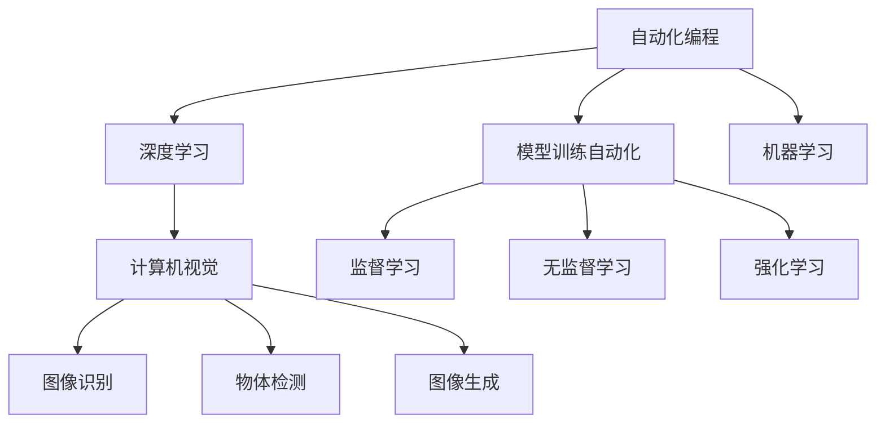

                 

# 计算领域的自动化发展趋势

> 关键词：自动化, 计算科学, 人工智能, 深度学习, 机器学习, 计算机视觉

## 1. 背景介绍

### 1.1 问题由来
随着计算技术的飞速发展，计算机科学已经从纯粹的理论研究，逐渐转向更广泛的应用领域。从早期基于手工编程的算法设计，到今天依赖大规模自动化工具的模型训练，计算科学正经历着深刻变革。

计算机科学的自动化，主要体现在两个方面：

- **编程语言的自动化**：例如，Python解释器的广泛使用，自动代码补全、代码调试等功能的普及，使得编程变得更快、更便捷。
- **模型训练的自动化**：例如，深度学习框架如TensorFlow、PyTorch的自动微分、自动调参等功能，极大地提升了模型训练的效率和精度。

本文将系统性地分析计算领域自动化的发展趋势，探索其带来的技术变革和应用场景，并展望未来可能面临的挑战和机遇。

## 2. 核心概念与联系

### 2.1 核心概念概述

为更好地理解计算领域自动化发展趋势，本节将介绍几个核心概念及其相互之间的联系：

- **自动化编程**：指利用工具自动完成编程任务，如代码自动生成、自动测试、代码优化等，减少人为工作量，提升编程效率。
- **模型训练自动化**：指利用自动化工具自动进行模型设计、参数设置、训练过程等，最大化模型性能，减少人为干预。
- **深度学习**：指一类基于多层神经网络结构的人工智能技术，通过大规模数据训练，自动学习特征表示和分类规则。
- **机器学习**：指计算机通过数据学习规律，自动优化模型性能的技术，包括监督学习、无监督学习、强化学习等。
- **计算机视觉**：指通过计算机对图像、视频等视觉数据进行理解和分析的技术，涵盖图像识别、物体检测、图像生成等。

这些概念之间的联系可以通过以下Mermaid流程图来展示：



这个流程图展示了一些关键概念及其之间的联系：

1. 自动化编程是整个自动化领域的基础，通过提高编程效率，支持其他自动化技术的应用。
2. 模型训练自动化是实现深度学习、机器学习等高级应用的重要手段。
3. 深度学习、机器学习、计算机视觉等具体技术，是自动化模型训练的主要工具。
4. 监督学习、无监督学习、强化学习等不同学习范式，为模型训练提供了不同的方法和算法。
5. 图像识别、物体检测、图像生成等计算机视觉应用，是自动化模型训练的重要应用方向。

这些概念共同构成了计算领域自动化的技术基础和应用框架。通过理解这些概念，我们可以更好地把握计算领域自动化发展的脉络。

## 3. 核心算法原理 & 具体操作步骤

### 3.1 算法原理概述

计算领域的自动化主要依赖于深度学习、机器学习等先进技术。以深度学习为例，其自动化模型训练通常包括以下几个关键步骤：

1. **数据准备**：收集和预处理训练数据，构建训练集和验证集。
2. **模型选择**：根据任务需求选择合适的深度学习模型，如卷积神经网络(CNN)、循环神经网络(RNN)、Transformer等。
3. **超参数设置**：根据经验或试验结果，设置模型的超参数，如学习率、批大小、迭代轮数等。
4. **模型训练**：利用优化算法(如SGD、Adam等)和自动微分技术，自动更新模型参数，最小化损失函数。
5. **模型评估**：在验证集上评估模型性能，如准确率、召回率、F1值等。
6. **模型调整**：根据评估结果，调整模型结构、超参数或引入正则化等技术，进一步提升模型性能。
7. **模型部署**：将训练好的模型部署到实际应用中，进行推理预测。

这些步骤的自动化，很大程度上依赖于深度学习框架提供的丰富工具和API支持。

### 3.2 算法步骤详解

以下我们将以深度学习模型的自动训练为例，详细讲解模型训练的自动化流程。

**Step 1: 数据准备**
1. 收集训练数据和验证数据。
2. 数据清洗和预处理，包括去除噪声、数据增强等。
3. 构建数据集，划分训练集和验证集。

**Step 2: 模型选择**
1. 根据任务类型选择合适的模型，如CNN用于图像分类，RNN用于序列生成，Transformer用于自然语言处理。
2. 配置模型结构，设置各层的神经元数量、激活函数、正则化技术等。

**Step 3: 超参数设置**
1. 根据经验或试验结果，设定合适的学习率、批大小、迭代轮数、优化器等。
2. 引入正则化技术，如Dropout、L2正则、Early Stopping等。

**Step 4: 模型训练**
1. 利用自动微分技术，计算损失函数的梯度。
2. 使用优化算法自动更新模型参数，最小化损失函数。
3. 周期性在验证集上评估模型性能，避免过拟合。

**Step 5: 模型评估**
1. 在验证集上评估模型性能，如准确率、召回率、F1值等。
2. 根据评估结果，调整模型结构、超参数或引入正则化技术，进一步提升模型性能。

**Step 6: 模型部署**
1. 将训练好的模型部署到实际应用中。
2. 利用模型进行推理预测，获取结果。

### 3.3 算法优缺点

自动化模型训练的优点包括：
1. 高效：利用深度学习框架的优化器、自动微分等技术，自动化训练过程可以极大地提升模型训练效率。
2. 精确：自动化训练可以精确地控制超参数，避免人为因素导致的误差。
3. 可重复性：自动化训练过程可重复性强，便于复现和对比实验结果。

同时，自动化模型训练也存在一定的缺点：
1. 依赖工具：自动化训练依赖于深度学习框架提供的工具和API，框架版本更新可能导致兼容性问题。
2. 可解释性不足：自动化的模型训练过程缺乏可解释性，难以理解模型内部工作机制。
3. 资源消耗大：大规模模型训练需要大量计算资源，如GPU、TPU等，可能面临资源不足的问题。

尽管存在这些缺点，自动化模型训练仍是深度学习应用的主流范式，通过不断优化和改进，可以克服其局限性，进一步提升模型性能和应用效果。

### 3.4 算法应用领域

自动化模型训练在计算领域已广泛应用于多个方向：

- **计算机视觉**：利用深度学习自动完成图像分类、物体检测、图像生成等任务，广泛应用于安防监控、自动驾驶、医疗影像等领域。
- **自然语言处理**：通过自动化的模型训练，实现文本分类、情感分析、机器翻译等任务，支持智能客服、智能推荐、智能问答等应用。
- **推荐系统**：利用自动化模型训练推荐算法，实现个性化推荐，应用于电商、新闻、视频等领域。
- **信号处理**：利用深度学习自动完成信号分类、信号增强等任务，广泛应用于语音识别、信号检测等领域。

除了上述应用，自动化模型训练还在其他计算领域，如金融、医疗、教育等领域得到广泛应用，推动了相关产业的数字化转型和智能化升级。

## 4. 数学模型和公式 & 详细讲解 & 举例说明

### 4.1 数学模型构建

本节将使用数学语言对自动化模型训练过程进行更加严格的刻画。

设训练数据集为 $D=\{(x_i, y_i)\}_{i=1}^N$，其中 $x_i \in \mathbb{R}^m$ 为输入向量， $y_i \in \{0,1\}$ 为输出标签。假设模型为 $M_{\theta}:\mathbb{R}^m \rightarrow \{0,1\}$，其中 $\theta$ 为模型参数。

定义模型在数据集 $D$ 上的损失函数为 $\ell(M_{\theta}, D) = -\frac{1}{N}\sum_{i=1}^N y_i\log M_{\theta}(x_i) + (1-y_i)\log (1-M_{\theta}(x_i))$，即二分类交叉熵损失函数。

自动化模型训练的目标是最小化损失函数，即找到最优参数：

$$
\theta^* = \mathop{\arg\min}_{\theta} \ell(M_{\theta}, D)
$$

在实践中，我们通常使用基于梯度的优化算法（如SGD、Adam等）来近似求解上述最优化问题。设 $\eta$ 为学习率，$\lambda$ 为正则化系数，则参数的更新公式为：

$$
\theta \leftarrow \theta - \eta \nabla_{\theta}\ell(M_{\theta}, D) - \eta\lambda\theta
$$

其中 $\nabla_{\theta}\ell(M_{\theta}, D)$ 为损失函数对参数 $\theta$ 的梯度，可通过反向传播算法高效计算。

### 4.2 公式推导过程

以下我们以二分类任务为例，推导交叉熵损失函数及其梯度的计算公式。

假设模型 $M_{\theta}$ 在输入 $x$ 上的输出为 $\hat{y}=M_{\theta}(x) \in [0,1]$，表示样本属于正类的概率。真实标签 $y \in \{0,1\}$。则二分类交叉熵损失函数定义为：

$$
\ell(M_{\theta}(x),y) = -[y\log \hat{y} + (1-y)\log (1-\hat{y})]
$$

将其代入损失函数 $\ell(M_{\theta}, D)$，得：

$$
\ell(M_{\theta}, D) = -\frac{1}{N}\sum_{i=1}^N [y_i\log M_{\theta}(x_i)+(1-y_i)\log(1-M_{\theta}(x_i))]
$$

根据链式法则，损失函数对参数 $\theta_k$ 的梯度为：

$$
\frac{\partial \ell(M_{\theta}, D)}{\partial \theta_k} = -\frac{1}{N}\sum_{i=1}^N (\frac{y_i}{M_{\theta}(x_i)}-\frac{1-y_i}{1-M_{\theta}(x_i)}) \frac{\partial M_{\theta}(x_i)}{\partial \theta_k}
$$

其中 $\frac{\partial M_{\theta}(x_i)}{\partial \theta_k}$ 可进一步递归展开，利用自动微分技术完成计算。

在得到损失函数的梯度后，即可带入参数更新公式，完成模型的迭代优化。重复上述过程直至收敛，最终得到适应数据集的最优模型参数 $\theta^*$。

## 5. 项目实践：代码实例和详细解释说明

### 5.1 开发环境搭建

在进行自动化模型训练实践前，我们需要准备好开发环境。以下是使用Python进行TensorFlow开发的环境配置流程：

1. 安装Anaconda：从官网下载并安装Anaconda，用于创建独立的Python环境。

2. 创建并激活虚拟环境：
```bash
conda create -n tf-env python=3.8 
conda activate tf-env
```

3. 安装TensorFlow：根据CUDA版本，从官网获取对应的安装命令。例如：
```bash
conda install tensorflow -c pytorch -c conda-forge
```

4. 安装TensorBoard：
```bash
pip install tensorboard
```

5. 安装各类工具包：
```bash
pip install numpy pandas scikit-learn matplotlib tqdm jupyter notebook ipython
```

完成上述步骤后，即可在`tf-env`环境中开始自动化模型训练实践。

### 5.2 源代码详细实现

下面我们以二分类任务为例，给出使用TensorFlow进行自动化模型训练的Python代码实现。

首先，定义模型和数据集：

```python
import tensorflow as tf
from tensorflow.keras import layers
from tensorflow.keras.datasets import mnist

(x_train, y_train), (x_test, y_test) = mnist.load_data()
x_train, x_test = x_train / 255.0, x_test / 255.0

model = tf.keras.models.Sequential([
    layers.Flatten(input_shape=(28, 28)),
    layers.Dense(128, activation='relu'),
    layers.Dropout(0.2),
    layers.Dense(10)
])
```

接着，定义训练和评估函数：

```python
def train(model, data, epochs, batch_size):
    model.compile(optimizer=tf.keras.optimizers.Adam(0.001), loss=tf.keras.losses.SparseCategoricalCrossentropy(), metrics=['accuracy'])
    model.fit(data['x'], data['y'], epochs=epochs, batch_size=batch_size, validation_data=(data['x_val'], data['y_val']))
    
def evaluate(model, data):
    model.evaluate(data['x'], data['y'], verbose=0)

# 数据准备
train_data = tf.data.Dataset.from_tensor_slices((x_train, y_train)).shuffle(60000).batch(64)
val_data = tf.data.Dataset.from_tensor_slices((x_val, y_val)).batch(64)

# 训练和评估
train(model, train_data, epochs=10, batch_size=64)
evaluate(model, test_data)
```

最后，启动训练流程：

```python
epochs = 10
batch_size = 64

# 训练模型
train(model, train_data, epochs, batch_size)

# 评估模型
evaluate(model, test_data)
```

以上就是使用TensorFlow进行二分类任务自动化模型训练的完整代码实现。可以看到，TensorFlow提供了丰富的API和工具，可以非常方便地进行模型训练和评估。

### 5.3 代码解读与分析

让我们再详细解读一下关键代码的实现细节：

**模型定义**：
- `Sequential`模型：通过一系列层的堆叠，构建一个顺序执行的神经网络。
- `Flatten`层：将二维的图像数据展平为一维向量。
- `Dense`层：全连接层，用于特征映射和输出。
- `Dropout`层：用于防止过拟合，随机丢弃部分神经元。

**数据准备**：
- `tf.data.Dataset`：用于数据批次化的处理，可以高效地进行数据加载和预处理。
- `shuffle`：对数据进行随机打乱，防止模型过拟合。
- `batch`：将数据分成批，每个批次的样本数指定为64。

**训练和评估函数**：
- `compile`：配置模型优化器和损失函数，指定评估指标。
- `fit`：自动完成模型训练过程，包括前向传播、反向传播、优化器更新等。
- `evaluate`：自动评估模型在验证集上的性能。

通过这些函数，TensorFlow可以高效、灵活地自动化完成模型训练和评估任务。

## 6. 实际应用场景

### 6.1 自动驾驶

在自动驾驶领域，基于深度学习模型的自动化训练，可以实现对复杂交通环境的感知、决策和控制。通过收集大量的驾驶数据，训练自动驾驶模型，可以实现自动驾驶车辆在各种道路环境下的安全行驶。

在实际应用中，可以利用自动化模型训练技术，对传感器数据进行实时处理，实现对交通标志、行人和其他车辆的精准识别，提升自动驾驶系统的智能程度和可靠性。

### 6.2 医疗影像分析

在医疗影像分析领域，深度学习模型可以通过自动化训练，实现对医学影像的自动分类、病变检测等任务。通过收集大量的医学影像数据，训练医疗影像分析模型，可以实现对多种疾病的早期诊断和病情跟踪。

在实际应用中，可以利用自动化训练技术，对患者的新影像数据进行实时分析，快速提供诊断建议，辅助医生进行疾病诊断和治疗方案制定。

### 6.3 智能推荐系统

在智能推荐系统中，基于深度学习模型的自动化训练，可以实现对用户行为数据的深度挖掘，实现个性化推荐。通过收集用户的历史行为数据，训练推荐模型，可以实现对用户兴趣的精准预测，提升推荐系统的个性化程度和用户满意度。

在实际应用中，可以利用自动化训练技术，对新的用户行为数据进行实时处理，动态调整推荐策略，实现推荐系统的不断优化和更新。

### 6.4 未来应用展望

随着深度学习技术的不断进步，自动化模型训练将有更广阔的应用前景。

1. **自动化开发平台**：未来，将出现更多的自动化开发平台，帮助开发者更高效地进行模型训练和部署。这些平台将提供更丰富的预训练模型、超参数调优工具和可视化界面，大大降低深度学习的门槛。
2. **实时训练系统**：实时训练系统将支持在大量数据源上进行在线学习，动态调整模型参数，提升模型对新数据的适应能力。
3. **边缘计算**：边缘计算将支持在设备端进行深度学习模型的训练和推理，减少数据传输和计算延迟，提升系统实时性。
4. **联邦学习**：联邦学习将支持多设备协作训练模型，保护用户隐私的同时，提升模型性能和泛化能力。

这些技术的进步，将进一步推动深度学习在更多领域的落地应用，提升人工智能系统的智能化水平和用户体验。

## 7. 工具和资源推荐

### 7.1 学习资源推荐

为了帮助开发者系统掌握自动化模型训练的理论基础和实践技巧，这里推荐一些优质的学习资源：

1. TensorFlow官方文档：提供完整的深度学习框架使用指南，包括模型训练、优化器、自动微分等技术。
2. PyTorch官方文档：提供丰富的深度学习框架API和教程，支持Python动态计算图。
3. Coursera《深度学习专项课程》：由斯坦福大学教授Andrew Ng开设，涵盖深度学习理论和实践，包括模型训练、优化算法等。
4. Udacity《深度学习基础》课程：提供深度学习基础理论和实践教程，涵盖模型训练、自动微分、正则化等技术。
5. CS231n《深度学习计算机视觉》课程：斯坦福大学开设的视觉领域经典课程，涵盖深度学习在计算机视觉中的应用。

通过对这些资源的学习实践，相信你一定能够快速掌握自动化模型训练的精髓，并用于解决实际的深度学习问题。

### 7.2 开发工具推荐

高效的开发离不开优秀的工具支持。以下是几款用于深度学习模型训练开发的常用工具：

1. TensorFlow：由Google主导开发的开源深度学习框架，支持动态图和静态图，适用于复杂模型的训练。
2. PyTorch：由Facebook开发的开源深度学习框架，支持动态图和静态图，适用于高效的研究和开发。
3. JAX：由Google开发的自动微分库，支持高阶微分、矢量化运算，适用于高效的研究和开发。
4. Scikit-learn：开源的机器学习库，支持多种算法和模型训练，适用于快速原型开发。
5. TensorBoard：TensorFlow配套的可视化工具，可实时监测模型训练状态，提供丰富的图表和日志。
6. Weights & Biases：模型训练的实验跟踪工具，记录和可视化模型训练过程中的各项指标，便于对比和调优。

合理利用这些工具，可以显著提升深度学习模型训练的开发效率，加快创新迭代的步伐。

### 7.3 相关论文推荐

深度学习模型的自动化训练涉及多个研究方向，以下是几篇奠基性的相关论文，推荐阅读：

1. "Deep Learning" by Ian Goodfellow, Yoshua Bengio, and Aaron Courville：深度学习领域的经典教材，涵盖深度学习理论和实践，包括模型训练、优化算法等。
2. "Training Deep Neural Networks on Large-Scale Data with Keras" by François Chollet：Keras框架的官方文档，介绍如何使用Keras进行深度学习模型的训练和部署。
3. "PyTorch: Tensors and Dynamic neural networks in Python with strong GPU acceleration" by Eugene Brevdo and Matthew Dean：PyTorch框架的官方文档，介绍如何使用PyTorch进行深度学习模型的训练和推理。
4. "Adaptive Moment Estimation" by Kingma and Ba：Adam优化算法的原始论文，介绍如何高效地训练深度学习模型。
5. "Batch Normalization: Accelerating Deep Network Training by Reducing Internal Covariate Shift" by Sergey Ioffe and Christian Szegedy：批量归一化技术的原始论文，介绍如何提高深度学习模型的训练速度和稳定性。

这些论文代表了大模型自动化训练的发展脉络。通过学习这些前沿成果，可以帮助研究者把握学科前进方向，激发更多的创新灵感。

## 8. 总结：未来发展趋势与挑战

### 8.1 研究成果总结

本文对自动化模型训练的发展趋势进行了系统性的分析，明确了自动化编程、深度学习、机器学习等核心概念及其相互之间的联系。通过详细的算法原理和具体操作步骤，提供了深度学习模型训练的完整代码实现。同时，本文还探讨了深度学习模型在多个实际应用场景中的落地实践，并展望了未来可能的发展趋势。

### 8.2 未来发展趋势

未来，自动化模型训练将呈现以下几个发展趋势：

1. **自动化开发平台**：更多的自动化开发平台将出现，进一步降低深度学习的门槛，提高开发效率。
2. **实时训练系统**：实时训练系统将支持在线学习，提升模型对新数据的适应能力。
3. **边缘计算**：边缘计算将支持设备端的深度学习模型训练和推理，提升系统实时性。
4. **联邦学习**：联邦学习将支持多设备协作训练模型，保护用户隐私的同时，提升模型性能和泛化能力。
5. **超参数自动化**：超参数自动化将进一步提升模型训练的自动化水平，减少人为干预。

### 8.3 面临的挑战

尽管自动化模型训练在深度学习领域取得了显著进展，但仍面临以下挑战：

1. **资源消耗大**：大规模深度学习模型训练需要大量计算资源，如GPU、TPU等，可能面临资源不足的问题。
2. **可解释性不足**：深度学习模型的内部工作机制缺乏可解释性，难以理解模型决策逻辑。
3. **数据隐私问题**：在联邦学习等分布式训练场景中，如何保护用户数据隐私，成为重要问题。

尽管存在这些挑战，通过不断的技术改进和应用探索，这些难题有望逐步被解决。

### 8.4 研究展望

未来，自动化模型训练将与更多领域的技术进行深度融合，推动人工智能系统的不断进步。

1. **知识图谱与深度学习结合**：结合知识图谱和深度学习，实现对知识表示的自动化学习，提升模型的推理能力和泛化能力。
2. **因果推断与深度学习结合**：结合因果推断和深度学习，提升模型对因果关系的理解，增强模型的可靠性和可解释性。
3. **强化学习与深度学习结合**：结合强化学习和深度学习，实现对复杂系统的自动化训练和优化，提升系统的智能程度和效率。

这些研究方向将进一步拓展深度学习的应用场景，提升人工智能系统的智能化水平和用户体验。

## 9. 附录：常见问题与解答

**Q1：什么是深度学习模型自动化训练？**

A: 深度学习模型自动化训练是指利用深度学习框架提供的自动化工具和API，自动完成模型的设计、训练和评估过程，最大程度减少人为干预，提升训练效率和模型性能。

**Q2：深度学习模型自动化训练的主要步骤包括哪些？**

A: 深度学习模型自动化训练的主要步骤包括数据准备、模型选择、超参数设置、模型训练、模型评估和模型部署等。

**Q3：深度学习框架的主要区别是什么？**

A: 深度学习框架主要有TensorFlow、PyTorch、Keras等。TensorFlow和PyTorch支持动态图和静态图，适用于复杂模型的训练；Keras提供了简单易用的API，适合快速原型开发。

**Q4：什么是超参数？**

A: 超参数是指在模型训练过程中需要手动设置的参数，如学习率、批大小、迭代轮数等。超参数的选择对模型的性能有很大影响，需要通过试验和调整来确定。

**Q5：深度学习模型自动化训练有什么优势？**

A: 深度学习模型自动化训练的优势包括：高效、精确、可重复性强。通过自动化工具和API，深度学习模型的训练过程可以高效地完成，结果具有较高的精度，并且可以重复使用，便于复现和对比实验结果。

作者：禅与计算机程序设计艺术 / Zen and the Art of Computer Programming

