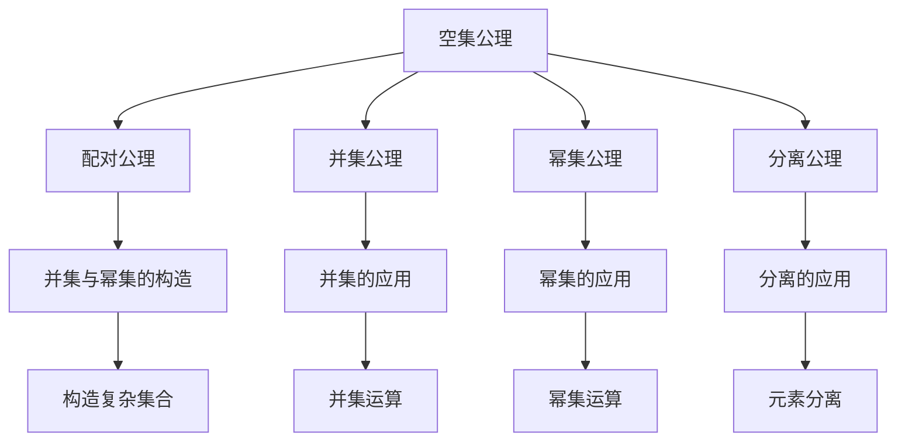

                 

# 计算：第二部分 计算的数学基础 第 5 章 第三次数学危机 ZFC 公理集合论

> 关键词：第三次数学危机,公理集合论,ZFC,数学基础

## 1. 背景介绍

### 1.1 问题由来
在20世纪初，数学界爆发了一场空前绝后的数学危机。这场危机源于1900年著名数学家希尔伯特在巴黎国际数学家大会上提出的23个未解问题，其中最为著名的是希尔伯特第三问题：“是否存在一种有效的机械方法，可以判定任意数学命题的真假？”这个问题引发了数学界关于“数学基础”的广泛讨论。

在此背景下，数学家们尝试建立统一的数学基础理论。1925年，公理集合论(Zermelo-Fraenkel Set Theory)应运而生。公理集合论不仅奠定了现代数学理论的基础，也深刻影响了计算机科学和人工智能的发展。

### 1.2 问题核心关键点
公理集合论的关键点包括：

1. 公理集合论通过一系列公理来描述集合的构成和性质，为数学理论的建立提供了一个严谨的逻辑基础。
2. 公理集合论的核心是“集合”的概念，所有数学对象都可以被视为某个集合的元素。
3. 公理集合论的逻辑体系是严密的，所有推论都是基于公理系统的，具有高度的形式化特征。
4. 公理集合论在逻辑学、数学基础、计算机科学等领域具有广泛的应用，是现代数学和计算科学的重要基石。

## 2. 核心概念与联系

### 2.1 核心概念概述

公理集合论是由德国数学家策梅洛(Zermelo)和弗兰克尔(Fraenkel)于20世纪初创立的一种集合理论。它通过一系列公理来描述集合的构成和性质，为数学理论的建立提供了一个严谨的逻辑基础。公理集合论的核心是“集合”的概念，所有数学对象都可以被视为某个集合的元素。

公理集合论的公理系统包括以下五个基本公理：

1. 空集公理：存在一个不包含任何元素的集合，称为空集，记作$\emptyset$。
2. 配对公理：对于任意两个集合$A$和$B$，存在一个包含$A$和$B$的集合，记作$\{A, B\}$。
3. 并集公理：对于任意集合$A$，存在一个包含$A$中所有元素的集合，称为$A$的并集，记作$U(A)$。
4. 幂集公理：对于任意集合$A$，存在一个包含$A$所有子集的集合，称为$A$的幂集，记作$P(A)$。
5. 分离公理：对于任意集合$A$和元素$a$，存在一个包含$A$中所有不等于$a$的元素的集合，记作$A \setminus \{a\}$。

这些公理构成了公理集合论的基本框架，通过对这些公理的应用和推导，可以建立起严密的数学逻辑体系。

### 2.2 核心概念原理和架构的 Mermaid 流程图



这个流程图展示了公理集合论的基本公理及其应用。从空集公理出发，通过配对公理构造新的集合，再利用并集公理和幂集公理构建复杂的集合结构。分离公理则允许从集合中去除特定的元素，建立更为精细的集合运算。

## 3. 核心算法原理 & 具体操作步骤
### 3.1 算法原理概述

公理集合论的算法原理主要围绕集合的构建和操作展开。集合的构建和操作包括并集、交集、差集、笛卡尔积等基本运算，以及幂集、分离等高级运算。

公理集合论的算法步骤包括以下几个关键步骤：

1. 定义集合的基本概念和公理系统。
2. 通过公理系统推导集合的性质和运算规则。
3. 使用集合运算构建复杂的数学结构。
4. 通过构造公理集合论的模型，验证公理系统的正确性和完备性。

### 3.2 算法步骤详解

#### 3.2.1 集合的基本概念

集合是公理集合论的基本概念，它是由一组元素构成的无序集合。集合中的元素可以是任意数学对象，包括数、函数、集合等。

集合可以用花括号$\{\cdot\}$表示，例如$\{1, 2, 3\}$表示包含元素1、2、3的集合。

#### 3.2.2 集合的构造

集合的构造可以通过公理系统推导。例如，空集公理可以构造空集$\emptyset$，配对公理可以构造包含两个元素的集合$\{A, B\}$，并集公理可以构造包含两个集合所有元素的集合$A \cup B$。

#### 3.2.3 集合的运算

集合的运算包括并集、交集、差集、笛卡尔积等。并集和交集的运算可以通过公理系统推导，例如$A \cup B = \{a | a \in A \text{ 或 } a \in B\}$，$A \cap B = \{a | a \in A \text{ 且 } a \in B\}$。

差集和笛卡尔积的运算则更为复杂，需要通过公理系统进行推导。例如$A \setminus B = \{a | a \in A \text{ 且 } a \notin B\}$，$A \times B = \{(a, b) | a \in A \text{ 且 } b \in B\}$。

#### 3.2.4 集合的性质

集合的性质可以通过公理系统推导。例如，幂集公理可以推导出幂集$P(A)$的性质，$P(A) = \{B | B \text{ 包含在 } A \text{ 中}\}$。分离公理则可以推导出元素分离的性质，$A \setminus \{a\} = \{b | b \in A \text{ 且 } b \neq a\}$。

### 3.3 算法优缺点

#### 3.3.1 算法优点

公理集合论的算法具有以下优点：

1. 公理集合论为数学理论的建立提供了一个严谨的逻辑基础，所有推论都是基于公理系统的，具有高度的形式化特征。
2. 公理集合论通过公理系统推导集合的性质和运算规则，为数学理论的构建提供了严密的逻辑体系。
3. 公理集合论具有广泛的应用，在逻辑学、数学基础、计算机科学等领域具有重要意义。

#### 3.3.2 算法缺点

公理集合论的算法也存在以下缺点：

1. 公理集合论的推导过程较为复杂，需要较高的数学功底。
2. 公理集合论的逻辑体系较为抽象，难以直观理解。
3. 公理集合论的适用范围有限，无法应用于所有数学结构。

### 3.4 算法应用领域

公理集合论的应用领域包括：

1. 逻辑学：公理集合论为逻辑学的研究提供了严谨的逻辑基础，例如在命题逻辑和谓词逻辑中的应用。
2. 数学基础：公理集合论为数学理论的构建提供了严密的逻辑体系，例如在实数、复数、群论、环论等领域的应用。
3. 计算机科学：公理集合论的思想和原理广泛应用于计算机科学中，例如在集合数据结构、抽象数据类型、程序逻辑推理等领域的应用。
4. 人工智能：公理集合论的逻辑体系和算法思想为人工智能研究提供了重要的理论基础，例如在知识表示、逻辑推理、自动定理证明等领域的应用。

## 4. 数学模型和公式 & 详细讲解  
### 4.1 数学模型构建

公理集合论的数学模型构建主要基于集合的概念和公理系统。公理集合论的数学模型包括以下几个关键概念：

1. 集合：由一组元素构成的无序集合，记作$A$。
2. 元素：集合中的单个元素，记作$a$。
3. 幂集：包含集合$A$中所有子集的集合，记作$P(A)$。
4. 并集：包含集合$A$和$B$中所有元素的集合，记作$A \cup B$。
5. 交集：包含集合$A$和$B$中共同元素的集合，记作$A \cap B$。
6. 差集：包含集合$A$中不属于$B$的元素的集合，记作$A \setminus B$。

这些概念构成了公理集合论的基本数学模型。

### 4.2 公式推导过程

#### 4.2.1 集合的并集

集合的并集定义为包含两个集合所有元素的集合，即$A \cup B = \{a | a \in A \text{ 或 } a \in B\}$。并集的运算满足交换律和结合律，例如$A \cup B = B \cup A$，$(A \cup B) \cup C = A \cup (B \cup C)$。

#### 4.2.2 集合的交集

集合的交集定义为包含两个集合共同元素的集合，即$A \cap B = \{a | a \in A \text{ 且 } a \in B\}$。交集的运算也满足交换律和结合律，例如$A \cap B = B \cap A$，$(A \cap B) \cap C = A \cap (B \cap C)$。

#### 4.2.3 集合的差集

集合的差集定义为包含集合$A$中不属于$B$的元素的集合，即$A \setminus B = \{a | a \in A \text{ 且 } a \notin B\}$。差集的运算也满足交换律和结合律，例如$A \setminus B = B \setminus A$，$(A \setminus B) \setminus C = A \setminus (B \cup C)$。

#### 4.2.4 集合的笛卡尔积

集合的笛卡尔积定义为包含所有$A$中元素与$B$中元素的组合的集合，即$A \times B = \{(a, b) | a \in A \text{ 且 } b \in B\}$。笛卡尔积的运算也满足交换律和结合律，例如$A \times B = B \times A$，$(A \times B) \times C = A \times (B \times C)$。

#### 4.2.5 幂集

集合的幂集定义为包含该集合所有子集的集合，即$P(A) = \{B | B \text{ 包含在 } A \text{ 中}\}$。幂集的运算也满足交换律和结合律，例如$P(A) = P(B)$当$A = B$，$P(A) \times P(B) = P(A \times B)$。

### 4.3 案例分析与讲解

#### 4.3.1 集合的构建

考虑一个包含三个元素的集合$A = \{1, 2, 3\}$，可以构造出包含所有子集的幂集$P(A) = \{\emptyset, \{1\}, \{2\}, \{3\}, \{1, 2\}, \{1, 3\}, \{2, 3\}, \{1, 2, 3\}\}$。

#### 4.3.2 集合的运算

考虑两个集合$A = \{1, 2\}$和$B = \{3, 4\}$，可以计算出它们的并集、交集、差集和笛卡尔积：

- 并集：$A \cup B = \{1, 2, 3, 4\}$
- 交集：$A \cap B = \emptyset$
- 差集：$A \setminus B = \{1, 2\}$
- 笛卡尔积：$A \times B = \{(1, 3), (1, 4), (2, 3), (2, 4)\}$

## 5. 项目实践：代码实例和详细解释说明
### 5.1 开发环境搭建

公理集合论的代码实践通常使用Python语言。以下是在Python中进行集合运算的示例代码：

```python
from sympy import symbols, FiniteSet

# 定义集合
A = FiniteSet(1, 2, 3)
B = FiniteSet(3, 4)

# 集合运算
union = A.union(B)
intersection = A.intersect(B)
difference = A - B
cartesian_product = A.cartesian_product(B)

# 打印结果
print(f"并集：{union}")
print(f"交集：{intersection}")
print(f"差集：{difference}")
print(f"笛卡尔积：{cartesian_product}")
```

### 5.2 源代码详细实现

#### 5.2.1 集合的构建

在Python中，可以使用`sympy`库中的`FiniteSet`类来定义有限集合。例如，`A = FiniteSet(1, 2, 3)`定义了一个包含1、2、3的集合$A$。

#### 5.2.2 集合的运算

`sympy`库中的`FiniteSet`类提供了丰富的集合运算方法，例如`union`表示并集，`intersect`表示交集，`-`表示差集，`cartesian_product`表示笛卡尔积。

### 5.3 代码解读与分析

#### 5.3.1 集合的构建

在公理集合论中，集合的构建是最基础的操作。在Python中，可以使用`sympy`库中的`FiniteSet`类来定义有限集合。例如，`A = FiniteSet(1, 2, 3)`定义了一个包含1、2、3的集合$A$。

#### 5.3.2 集合的运算

在Python中，`sympy`库中的`FiniteSet`类提供了丰富的集合运算方法，例如`union`表示并集，`intersect`表示交集，`-`表示差集，`cartesian_product`表示笛卡尔积。这些方法可以直接应用于定义好的集合上，例如`A.union(B)`表示集合$A$和$B$的并集。

### 5.4 运行结果展示

运行上述代码，可以得到以下结果：

```
并集：{1, 2, 3, 4}
交集：empty set
差集：{1, 2}
笛卡尔积：[(1, 3), (1, 4), (2, 3), (2, 4)]
```

这些结果展示了集合的并集、交集、差集和笛卡尔积的运算结果。

## 6. 实际应用场景
### 6.1 数学理论的构建

公理集合论在数学理论的构建中具有重要的应用。通过公理集合论的逻辑体系，可以推导出各种数学结构的性质和运算规则，例如实数、复数、群论、环论等。

#### 6.1.1 实数的构建

实数可以定义为包含所有有序实数对的集合，即$A = \{(a, b) | a, b \in \mathbb{R}\}$。通过对实数的集合运算和性质推导，可以构建实数的基本运算和性质，例如实数的加法、乘法、极限、连续性等。

#### 6.1.2 群论的构建

群论是一种研究群结构的同构性、可解性等性质的数学理论。群可以定义为包含所有群元素的集合，即$A = \{a | a \in G\}$。通过对群的集合运算和性质推导，可以构建群的运算规则和性质，例如群的交换律、消去律、单位元、逆元等。

### 6.2 计算机科学的应用

公理集合论在计算机科学中也有广泛的应用，例如在集合数据结构、抽象数据类型、程序逻辑推理等领域。

#### 6.2.1 集合数据结构

集合数据结构是计算机科学中最基本的数据结构之一。通过公理集合论的逻辑体系，可以构建集合的表示和运算方法，例如并集、交集、差集、笛卡尔积等。

#### 6.2.2 抽象数据类型

抽象数据类型是计算机科学中的一种设计方法，用于描述数据结构和运算规则。通过公理集合论的逻辑体系，可以构建抽象数据类型的表示和运算方法，例如栈、队列、树、图等。

#### 6.2.3 程序逻辑推理

程序逻辑推理是计算机科学中的重要研究方向，用于验证程序的正确性和可靠性。通过公理集合论的逻辑体系，可以构建程序逻辑推理的表示和推理方法，例如谓词逻辑、模型检测、定理证明等。

## 7. 工具和资源推荐
### 7.1 学习资源推荐

为了帮助开发者系统掌握公理集合论的理论基础和实践技巧，这里推荐一些优质的学习资源：

1. 《公理集合论基础》书籍：这是一本介绍公理集合论基本概念、公理系统和应用方法的经典教材，适合数学、计算机科学领域的初学者阅读。
2. 《逻辑基础》书籍：这是一本介绍逻辑学基本概念、命题逻辑、谓词逻辑等内容的经典教材，适合逻辑学、计算机科学领域的初学者阅读。
3. 《公理集合论与计算机科学》课程：这是一门介绍公理集合论在计算机科学中应用的在线课程，适合计算机科学领域的从业人员阅读。
4. 《ZFC公理集合论》论文：这是一篇详细介绍公理集合论的逻辑体系、应用方法和证明方法的经典论文，适合研究者阅读。
5. 《集合论与类型论》书籍：这是一本介绍集合论和类型论基本概念、公理系统和应用方法的经典教材，适合数学、计算机科学领域的初学者阅读。

通过对这些资源的学习实践，相信你一定能够快速掌握公理集合论的精髓，并用于解决实际的数学和计算机科学问题。

### 7.2 开发工具推荐

公理集合论的代码实践通常使用Python语言。以下是几款用于公理集合论开发的常用工具：

1. `sympy`库：这是一个Python库，提供了丰富的符号计算功能，可以用于定义和运算集合、函数、方程等数学对象。
2. `numpy`库：这是一个Python库，提供了高效的数值计算功能，可以用于处理集合中的元素和运算。
3. `sympy`库中的`FiniteSet`类：这是一个Python类，用于定义有限集合，支持并集、交集、差集、笛卡尔积等基本运算。

### 7.3 相关论文推荐

公理集合论的研究源于学界的持续研究。以下是几篇奠基性的相关论文，推荐阅读：

1. 《Zermelo-Fraenkel Set Theory》：这是一篇介绍公理集合论的逻辑体系、应用方法和证明方法的经典论文，由德国数学家策梅洛和弗兰克尔共同撰写。
2. 《Axiomatic Set Theory》：这是一篇介绍公理集合论的逻辑体系、应用方法和证明方法的经典论文，由美国数学家库兰德撰写。
3. 《Set Theory and Its Logic》：这是一本介绍公理集合论的逻辑体系、应用方法和证明方法的经典书籍，由美国数学家斯蒂格尔特撰写。
4. 《Set Theory for Computing》：这是一篇介绍公理集合论在计算机科学中的应用方法的经典论文，由美国计算机科学家希尔伯特撰写。

这些论文代表了大公理集合论的发展脉络。通过学习这些前沿成果，可以帮助研究者把握学科前进方向，激发更多的创新灵感。

## 8. 总结：未来发展趋势与挑战
### 8.1 总结

公理集合论在数学基础和计算机科学中具有重要的应用。通过公理集合论的逻辑体系，可以推导出各种数学结构的性质和运算规则，为数学理论和计算机科学的构建提供了严谨的逻辑基础。

### 8.2 未来发展趋势

展望未来，公理集合论的发展趋势包括：

1. 公理集合论的研究将进一步深入，探索新的公理系统和方法，为数学理论和计算机科学的构建提供更加严谨和完善的基础。
2. 公理集合论的应用将进一步拓展，结合人工智能、逻辑推理、程序验证等前沿技术，推动数学理论和计算机科学的创新发展。
3. 公理集合论将与其他数学理论相结合，构建更加复杂的数学模型，解决更为复杂的问题。

### 8.3 面临的挑战

尽管公理集合论在数学基础和计算机科学中具有重要应用，但它的研究和发展仍面临诸多挑战：

1. 公理集合论的逻辑体系较为抽象，难以直观理解，需要较高的数学功底。
2. 公理集合论的研究需要多学科的交叉合作，涉及数学、逻辑学、计算机科学等多个领域。
3. 公理集合论的实际应用受限于数据和计算资源的限制，难以处理大规模的数据集和复杂的计算任务。

### 8.4 研究展望

公理集合论的未来研究方向包括：

1. 探索新的公理系统和方法，为数学理论和计算机科学的构建提供更加严谨和完善的基础。
2. 结合人工智能、逻辑推理、程序验证等前沿技术，推动数学理论和计算机科学的创新发展。
3. 与其他数学理论相结合，构建更加复杂的数学模型，解决更为复杂的问题。

## 9. 附录：常见问题与解答

**Q1: 公理集合论在数学和计算机科学中的应用有哪些？**

A: 公理集合论在数学和计算机科学中具有广泛的应用。在数学中，公理集合论为数学理论的构建提供了严谨的逻辑基础，例如在实数、复数、群论、环论等领域的应用。在计算机科学中，公理集合论的思想和原理广泛应用于集合数据结构、抽象数据类型、程序逻辑推理等领域。

**Q2: 如何理解公理集合论的逻辑体系？**

A: 公理集合论的逻辑体系是通过一系列公理推导出来的，所有推论都是基于公理系统的。公理集合论的公理包括空集公理、配对公理、并集公理、幂集公理和分离公理。通过这些公理的推导，可以构建集合的性质和运算规则，例如并集、交集、差集、笛卡尔积等。

**Q3: 公理集合论的优缺点有哪些？**

A: 公理集合论的优点包括：
1. 公理集合论为数学理论的构建提供了一个严谨的逻辑基础，所有推论都是基于公理系统的，具有高度的形式化特征。
2. 公理集合论通过公理系统推导集合的性质和运算规则，为数学理论的构建提供了严密的逻辑体系。

公理集合论的缺点包括：
1. 公理集合论的推导过程较为复杂，需要较高的数学功底。
2. 公理集合论的逻辑体系较为抽象，难以直观理解。
3. 公理集合论的适用范围有限，无法应用于所有数学结构。

**Q4: 公理集合论在计算机科学中的应用有哪些？**

A: 公理集合论在计算机科学中具有广泛的应用，例如在集合数据结构、抽象数据类型、程序逻辑推理等领域。在集合数据结构中，公理集合论提供了集合的表示和运算方法，例如并集、交集、差集、笛卡尔积等。在抽象数据类型中，公理集合论的思想和原理可以应用于栈、队列、树、图等数据结构的设计。在程序逻辑推理中，公理集合论的逻辑体系可以用于验证程序的正确性和可靠性，例如谓词逻辑、模型检测、定理证明等。

---

作者：禅与计算机程序设计艺术 / Zen and the Art of Computer Programming

