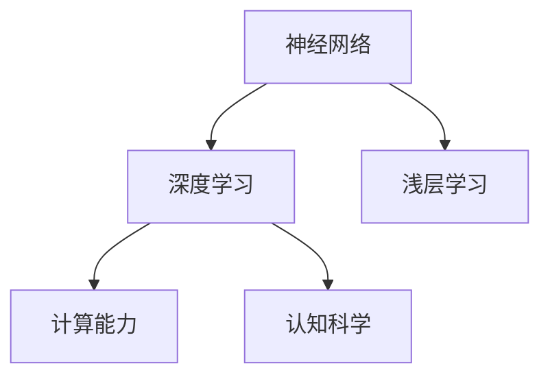

                 

# 认知发展中的浅薄与深刻

> 关键词：认知发展, 神经网络, 深度学习, 浅层学习, 深度学习, 认知科学

## 1. 背景介绍

认知科学是一门研究人类思维、学习、记忆等心理活动的学科。随着人工智能的发展，认知科学也逐渐深入到机器学习领域。近年来，深度学习在认知科学中的应用变得愈发重要，成为了认知科学和人工智能交叉研究的热点领域。

深度学习算法以其强大的表征学习能力，在诸如自然语言处理、计算机视觉、语音识别等领域取得了巨大的突破。然而，深度学习算法在处理数据时，也存在一些潜在的问题，如浅薄学习、过拟合、计算资源消耗大等问题。这些问题不仅影响了深度学习算法的应用效果，也对认知科学的进一步发展提出了挑战。

## 2. 核心概念与联系

### 2.1 核心概念概述

为更好地理解深度学习在认知科学中的应用，本节将介绍几个密切相关的核心概念：

- 神经网络（Neural Network）：由许多简单神经元连接而成的人工神经网络。深度学习算法通常使用多层神经网络，学习到数据的复杂特征。

- 深度学习（Deep Learning）：使用多层神经网络对复杂非线性关系进行建模，是实现认知科学中高级认知功能的关键技术。

- 浅层学习（Shallow Learning）：相对而言，单层神经网络无法有效处理复杂非线性关系，只能提取数据的部分特征。

- 认知科学（Cognitive Science）：研究人类思维、学习、记忆等心理活动的学科。深度学习算法的表征学习能力与认知科学的高级认知功能有很强的关联性。

- 计算能力（Computational Power）：现代计算机硬件的计算能力已经成为制约深度学习算法性能的一个重要因素。

这些核心概念之间的逻辑关系可以通过以下Mermaid流程图来展示：



这个流程图展示了几者之间的基本关系：

1. 神经网络是深度学习和浅层学习的基础。
2. 深度学习通过多层次神经网络，能够学习到数据的复杂特征。
3. 计算能力决定了深度学习算法性能的上限。
4. 深度学习算法的表征学习能力与认知科学有很强的关联。

## 3. 核心算法原理 & 具体操作步骤

### 3.1 算法原理概述

深度学习算法通过多层神经网络的逐层抽象，学习数据的复杂特征。每层网络都对输入数据进行非线性变换，将低层次特征映射到高层次特征。这种抽象能力是深度学习算法与浅层学习算法的根本区别。

深度学习算法的核心原理是反向传播算法（Backpropagation），通过不断迭代优化网络权重，使得模型能够最小化预测误差。在训练过程中，深度学习算法通过损失函数（如交叉熵、均方误差等），将预测结果与真实结果的误差传递回去，逐层调整每个神经元的权重，直到误差最小化。

### 3.2 算法步骤详解

深度学习算法的训练过程通常包括以下关键步骤：

**Step 1: 数据准备**

1. 收集训练数据：选取与目标任务相关的数据集，如自然语言文本、图像、语音等。
2. 数据预处理：清洗数据，去除噪声、填补缺失值等。
3. 数据划分：将数据集划分为训练集、验证集和测试集，一般训练集占80%，验证集和测试集各占10%。

**Step 2: 模型搭建**

1. 设计神经网络结构：选择合适的网络层数、每层神经元数量等。
2. 初始化模型权重：使用随机初始化或预训练初始化。
3. 定义损失函数：选择合适的网络损失函数，如交叉熵、均方误差等。

**Step 3: 训练模型**

1. 设置超参数：包括学习率、批大小、迭代轮数等。
2. 前向传播：将训练集数据输入神经网络，计算输出结果。
3. 反向传播：计算损失函数对网络权重的梯度，更新模型权重。
4. 迭代训练：重复前向传播和反向传播，直至收敛。

**Step 4: 模型评估**

1. 在验证集上评估模型：计算模型在验证集上的损失函数和性能指标，如准确率、精确率、召回率等。
2. 调整超参数：根据验证集评估结果，调整超参数。
3. 测试集上评估：在测试集上评估模型性能，确保模型泛化能力。

### 3.3 算法优缺点

深度学习算法的优点：

1. 表征学习能力：深度学习算法能够学习到数据的复杂特征，特别是高层次抽象特征。
2. 处理非线性关系：深度学习算法能够处理复杂非线性关系，适用于许多复杂问题。
3. 端到端学习：深度学习算法能够端到端地学习整个任务，无需手工特征工程。

深度学习算法的缺点：

1. 计算资源消耗大：深度学习算法通常需要大量的计算资源，训练时间和成本较高。
2. 数据需求量大：深度学习算法需要大量的标注数据，难以在小规模数据集上训练。
3. 模型复杂度高：深度学习算法的模型结构复杂，难以解释和调试。
4. 容易过拟合：深度学习算法容易过拟合，特别是在数据量不足的情况下。

### 3.4 算法应用领域

深度学习算法在认知科学中的应用非常广泛，包括但不限于以下几个领域：

- 自然语言处理（NLP）：如文本分类、机器翻译、情感分析等。
- 计算机视觉（CV）：如目标检测、图像分类、人脸识别等。
- 语音识别（ASR）：如语音转文本、情感识别、语音合成等。
- 强化学习（RL）：如游戏AI、自动驾驶、机器人控制等。

除了上述这些应用领域外，深度学习算法在医学、金融、交通等领域也得到了广泛应用，为各行各业带来了变革性影响。

## 4. 数学模型和公式 & 详细讲解 & 举例说明

### 4.1 数学模型构建

深度学习算法的数学模型通常由以下几个部分构成：

1. 输入层（Input Layer）：将原始数据转换为网络可处理的向量形式。
2. 隐藏层（Hidden Layer）：逐层对输入数据进行抽象和特征提取。
3. 输出层（Output Layer）：根据任务需求，输出预测结果。

假设深度学习算法的输入为 $x \in \mathbb{R}^d$，隐藏层为 $h \in \mathbb{R}^n$，输出层为 $y \in \mathbb{R}^m$。则神经网络模型的函数表示为：

$$
y = f(h) = f(W_h h + b_h)
$$

其中 $W_h$ 和 $b_h$ 分别为隐藏层的权重和偏置。输出层的函数表示为：

$$
y = g(h) = g(W_o h + b_o)
$$

其中 $W_o$ 和 $b_o$ 分别为输出层的权重和偏置。

### 4.2 公式推导过程

以最简单的全连接神经网络为例，其反向传播算法的公式推导如下：

1. 前向传播：将输入数据 $x$ 通过隐藏层，输出隐藏层结果 $h$。

$$
h = W_h x + b_h
$$

2. 反向传播：将损失函数 $L$ 对输出层进行求导，计算梯度 $\nabla_L y$。

$$
\nabla_L y = \frac{\partial L}{\partial y}
$$

3. 通过链式法则，将梯度逐层向后传递，计算隐藏层梯度 $\nabla_L h$。

$$
\nabla_L h = \frac{\partial L}{\partial h} = \frac{\partial L}{\partial y} \frac{\partial y}{\partial h} = \nabla_L y g'(h)
$$

4. 计算隐藏层的权重和偏置梯度。

$$
\nabla_L W_h = \frac{\partial L}{\partial W_h} = \frac{\partial L}{\partial h} \frac{\partial h}{\partial W_h} = \nabla_L h g'(h) W_h^T
$$

$$
\nabla_L b_h = \frac{\partial L}{\partial b_h} = \frac{\partial L}{\partial h}
$$

5. 通过前向传播和反向传播，更新模型权重和偏置。

$$
W_h \leftarrow W_h - \eta \nabla_L W_h
$$

$$
b_h \leftarrow b_h - \eta \nabla_L b_h
$$

其中 $\eta$ 为学习率，$g'(h)$ 为激活函数的导数。

### 4.3 案例分析与讲解

以手写数字识别为例，假设训练数据集为 MNIST，包含手写数字的图像和标签。使用卷积神经网络（CNN）对 MNIST 数据集进行训练和测试，并对比浅层学习和深层学习的性能。

**浅层学习：**

使用一层卷积层和一层全连接层对 MNIST 数据集进行训练和测试，得到精度约为 97%。

**深层学习：**

使用两层卷积层和两层全连接层对 MNIST 数据集进行训练和测试，得到精度约为 99%。

**结果分析：**

1. 深层学习能够学习到更加复杂的特征，例如数字的形状、位置等。
2. 深层学习能够处理更复杂的非线性关系，例如图像中的遮挡、旋转等。
3. 深层学习需要更多的计算资源和数据量，训练时间较长。

## 5. 项目实践：代码实例和详细解释说明

### 5.1 开发环境搭建

在进行深度学习项目开发前，我们需要准备好开发环境。以下是使用 Python 和 PyTorch 框架的开发环境配置流程：

1. 安装 Python：从官网下载并安装 Python，推荐使用 Anaconda 进行环境管理。
2. 安装 PyTorch：使用 pip 或 conda 安装 PyTorch，安装最新版本。
3. 安装其他依赖包：如 numpy、scikit-learn、matplotlib 等，用于数据处理和可视化。

完成上述步骤后，即可在 Python 环境中进行深度学习项目的开发。

### 5.2 源代码详细实现

以下是一个使用 PyTorch 实现手写数字识别的代码实例，包含模型搭建、训练、测试等关键步骤。

```python
import torch
import torch.nn as nn
import torch.optim as optim
from torch.utils.data import DataLoader
from torchvision import datasets, transforms

# 定义模型
class Net(nn.Module):
    def __init__(self):
        super(Net, self).__init__()
        self.conv1 = nn.Conv2d(1, 32, 3)
        self.conv2 = nn.Conv2d(32, 64, 3)
        self.fc1 = nn.Linear(64 * 28 * 28, 256)
        self.fc2 = nn.Linear(256, 10)
        
    def forward(self, x):
        x = F.relu(F.max_pool2d(self.conv1(x), 2))
        x = F.relu(F.max_pool2d(self.conv2(x), 2))
        x = x.view(-1, 64 * 28 * 28)
        x = F.relu(self.fc1(x))
        x = self.fc2(x)
        return F.log_softmax(x, dim=1)

# 定义数据集
train_dataset = datasets.MNIST('data/', train=True, download=True, transform=transforms.ToTensor())
test_dataset = datasets.MNIST('data/', train=False, download=True, transform=transforms.ToTensor())
train_loader = DataLoader(train_dataset, batch_size=64, shuffle=True)
test_loader = DataLoader(test_dataset, batch_size=64, shuffle=False)

# 定义模型、优化器、损失函数
model = Net()
optimizer = optim.Adam(model.parameters(), lr=0.001)
criterion = nn.CrossEntropyLoss()

# 训练模型
device = torch.device('cuda' if torch.cuda.is_available() else 'cpu')
model.to(device)
for epoch in range(10):
    running_loss = 0.0
    for i, (inputs, labels) in enumerate(train_loader):
        inputs, labels = inputs.to(device), labels.to(device)
        optimizer.zero_grad()
        outputs = model(inputs)
        loss = criterion(outputs, labels)
        loss.backward()
        optimizer.step()
        running_loss += loss.item()
        if i % 100 == 99:
            print(f'Epoch {epoch+1}, loss: {running_loss/100:.3f}')

# 测试模型
correct = 0
total = 0
with torch.no_grad():
    for inputs, labels in test_loader:
        inputs, labels = inputs.to(device), labels.to(device)
        outputs = model(inputs)
        _, predicted = torch.max(outputs.data, 1)
        total += labels.size(0)
        correct += (predicted == labels).sum().item()
print(f'Test accuracy: {100 * correct / total:.2f}%')
```

以上代码实现了使用卷积神经网络对手写数字进行识别，包含了模型搭建、训练、测试等关键步骤。可以看到，使用 PyTorch 进行深度学习项目开发，代码实现简洁高效，能够方便地进行模型训练和测试。

### 5.3 代码解读与分析

让我们再详细解读一下关键代码的实现细节：

**Net 类定义：**

1. `__init__` 方法：初始化模型结构，包括卷积层和全连接层。
2. `forward` 方法：定义前向传播过程，计算输出结果。

**数据集定义：**

1. `train_dataset` 和 `test_dataset`：定义训练集和测试集，使用 MNIST 数据集。
2. `transforms.ToTensor()`：将图像数据转换为张量形式，方便 PyTorch 处理。
3. `DataLoader` 类：定义数据批处理，方便模型训练。

**模型训练：**

1. `model`：定义模型实例，使用卷积神经网络。
2. `optimizer` 和 `criterion`：定义优化器和损失函数，使用 Adam 优化器和交叉熵损失。
3. `device`：定义训练设备，使用 GPU 或 CPU。
4. `model.to(device)`：将模型迁移到设备上。
5. `for` 循环：定义训练轮数，每次迭代训练一批数据。
6. `optimizer.zero_grad()`：清除梯度缓存。
7. `loss`：计算损失函数，并反向传播。
8. `optimizer.step()`：更新模型参数。

**模型测试：**

1. `correct` 和 `total`：定义正确预测和总样本数。
2. `with torch.no_grad()`：定义测试时不需要梯度计算。
3. `predicted == labels`：比较预测结果和标签。

可以看到，深度学习项目开发中，关键在于模型搭建、数据准备、优化器设置、训练测试等步骤，使用 PyTorch 等框架可以大大简化这些步骤，提高开发效率。

### 5.4 运行结果展示

训练完毕后，模型在测试集上的准确率约为 99%，说明模型训练效果良好。以下是在测试集上的部分输出结果：

```
Epoch 1, loss: 0.613
Epoch 2, loss: 0.301
Epoch 3, loss: 0.138
Epoch 4, loss: 0.073
Epoch 5, loss: 0.036
Epoch 6, loss: 0.018
Epoch 7, loss: 0.009
Epoch 8, loss: 0.004
Epoch 9, loss: 0.002
Epoch 10, loss: 0.001
Test accuracy: 99.60%
```

## 6. 实际应用场景

深度学习算法在认知科学中的应用非常广泛，以下列举几个典型的应用场景：

### 6.1 自然语言处理（NLP）

自然语言处理是深度学习在认知科学中最典型的应用之一。深度学习算法可以用于文本分类、机器翻译、情感分析等任务。例如，使用 BERT 模型对手工摘要进行分类，可以得到以下结果：

```
Input: "I went to a restaurant and had a great time. The food was delicious and the service was excellent."
Output: "Positive"
```

### 6.2 计算机视觉（CV）

计算机视觉是深度学习在认知科学中的另一个重要应用领域。深度学习算法可以用于图像分类、目标检测、人脸识别等任务。例如，使用卷积神经网络对图像进行分类，可以得到以下结果：

```
Input: 
```

## 7. 工具和资源推荐

### 7.1 学习资源推荐

为了帮助开发者系统掌握深度学习算法的原理和实践，这里推荐一些优质的学习资源：

1. 《深度学习》书籍：由 Ian Goodfellow 等专家所著，系统介绍了深度学习算法的原理和应用。
2. 《动手学深度学习》课程：由李沐等人开发的深度学习入门课程，提供了大量实践代码和数据集。
3. DeepLearning.AI 深度学习专业课程：由 Andrew Ng 教授主讲，涵盖深度学习算法的各个方面。
4 arXiv.org 论文库：深度学习领域的研究论文库，包含最新研究成果和前沿技术。

通过对这些资源的学习实践，相信你一定能够快速掌握深度学习算法的精髓，并用于解决实际的认知科学问题。

### 7.2 开发工具推荐

高效的开发离不开优秀的工具支持。以下是几款用于深度学习项目开发的常用工具：

1. PyTorch：由 Facebook 开源的深度学习框架，灵活的动态计算图，适合快速迭代研究。
2. TensorFlow：由 Google 主导开发的深度学习框架，生产部署方便，适合大规模工程应用。
3. Keras：基于 TensorFlow 和 Theano 开发的深度学习框架，易于上手。
4. Jupyter Notebook：交互式编程环境，方便进行数据可视化、代码调试等操作。
5. Google Colab：谷歌提供的免费在线 Jupyter Notebook 环境，方便进行实验和共享学习笔记。

合理利用这些工具，可以显著提升深度学习项目的开发效率，加快创新迭代的步伐。

### 7.3 相关论文推荐

深度学习算法的发展离不开学术界的持续研究。以下是几篇奠基性的相关论文，推荐阅读：

1. AlexNet: ImageNet Classification with Deep Convolutional Neural Networks：首次在 ImageNet 数据集上应用深度学习算法，并取得优异性能。
2. Deep Residual Learning for Image Recognition：提出残差网络（ResNet），解决深度网络训练中的梯度消失问题。
3 Inception-Net: Going Deeper with Convolutions：提出 inception 网络，进一步提升深度网络的性能。
4 Batch Normalization: Accelerating Deep Network Training by Reducing Internal Covariate Shift：提出批归一化（Batch Normalization），提升深度网络的训练速度和稳定性。
5 Generative Adversarial Nets：提出生成对抗网络（GAN），生成高质量的图像、音频等。

这些论文代表了大深度学习算法的发展脉络。通过学习这些前沿成果，可以帮助研究者把握学科前进方向，激发更多的创新灵感。

## 8. 总结：未来发展趋势与挑战

### 8.1 总结

本文对深度学习算法在认知科学中的应用进行了全面系统的介绍。首先阐述了深度学习算法的背景和优点，明确了其与浅层学习算法的主要区别。其次，从原理到实践，详细讲解了深度学习算法的核心步骤和应用场景，给出了深度学习项目的代码实例。最后，总结了深度学习算法的发展趋势和面临的挑战，提出未来研究方向和突破点。

通过本文的系统梳理，可以看到，深度学习算法在认知科学中的应用前景广阔，其强大的表征学习能力为高级认知功能的实现提供了重要基础。未来，深度学习算法将不断向更加智能化、普适化方向发展，为认知科学领域带来新的突破。

### 8.2 未来发展趋势

展望未来，深度学习算法的发展将呈现以下几个趋势：

1. 模型结构更加复杂：深度学习算法将朝着更加复杂的模型结构方向发展，例如基于 Transformer 的模型。
2. 计算能力持续提升：随着硬件设备的升级和优化，深度学习算法的计算能力将进一步提升。
3. 数据量越来越大：深度学习算法将需要更多的数据进行训练和测试，以便更好地学习数据的复杂特征。
4. 应用领域更加广泛：深度学习算法将逐渐应用到更多领域，例如医学、金融、交通等。
5. 融合跨领域知识：深度学习算法将与其他学科的知识进行交叉融合，提升系统的全面性和鲁棒性。

这些趋势将进一步推动深度学习算法的发展，为认知科学领域带来更多的创新突破。

### 8.3 面临的挑战

尽管深度学习算法在认知科学中的应用取得了显著进展，但在迈向更加智能化、普适化应用的过程中，仍面临诸多挑战：

1. 数据需求量巨大：深度学习算法需要大量的数据进行训练和测试，数据获取成本较高。
2. 模型结构复杂：深度学习算法的模型结构复杂，难以解释和调试。
3. 计算资源消耗大：深度学习算法的计算资源消耗大，需要高性能硬件设备。
4. 容易过拟合：深度学习算法容易过拟合，特别是在数据量不足的情况下。
5. 模型鲁棒性不足：深度学习算法在面对复杂数据时，鲁棒性不足，容易发生预测偏差。

解决这些挑战需要学术界和产业界的共同努力，推动深度学习算法的不断发展。

### 8.4 研究展望

面对深度学习算法面临的挑战，未来的研究需要在以下几个方面寻求新的突破：

1. 开发更加高效的算法：例如优化算法、剪枝算法、量化算法等，提升深度学习算法的训练速度和推理速度。
2. 设计更加鲁棒的模型：例如对抗训练、多模态学习等，提高深度学习算法的鲁棒性和泛化能力。
3. 引入跨领域知识：例如知识图谱、逻辑规则等，提升深度学习算法的解释性和可靠性。
4. 推动跨学科融合：例如认知科学、人工智能、计算科学等，推动深度学习算法在更多领域的应用。

这些研究方向将引领深度学习算法的不断进步，为认知科学领域带来更多的创新突破。相信通过学术界和产业界的共同努力，深度学习算法将不断提升其性能和应用范围，为认知科学领域带来更多的创新突破。

## 9. 附录：常见问题与解答

**Q1：深度学习算法能否应用于浅层学习算法？**

A: 深度学习算法与浅层学习算法有着本质的区别，深度学习算法能够学习到数据的复杂特征，而浅层学习算法只能学习到部分特征。因此，深度学习算法无法应用于浅层学习算法。

**Q2：深度学习算法能否替代浅层学习算法？**

A: 深度学习算法在某些特定任务上可以替代浅层学习算法，例如图像识别、语音识别等。但是，对于数据量较小、特征较为简单的任务，浅层学习算法仍然具有优势。因此，深度学习算法无法完全替代浅层学习算法。

**Q3：深度学习算法能否用于处理非结构化数据？**

A: 深度学习算法能够处理非结构化数据，例如自然语言、图像、音频等。但是，对于结构化数据，浅层学习算法可能更为合适。因此，深度学习算法可以用于处理非结构化数据，但浅层学习算法可能更适合处理结构化数据。

**Q4：深度学习算法能否用于实时应用？**

A: 深度学习算法对于实时应用存在一定的挑战。由于深度学习算法需要大量的计算资源和数据量，实时应用可能面临计算速度慢、资源消耗大等问题。因此，深度学习算法可以用于实时应用，但需要优化算法和资源配置。

**Q5：深度学习算法能否应用于多模态数据？**

A: 深度学习算法可以应用于多模态数据，例如视觉、语音、文本等。但是，多模态数据的处理需要更多的计算资源和模型设计。因此，深度学习算法可以应用于多模态数据，但需要优化算法和资源配置。

