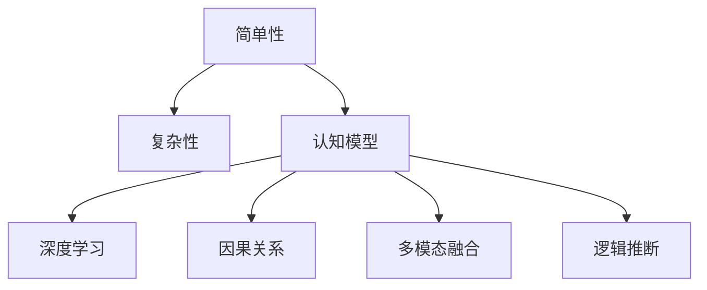

                 

# 认知发展中的浅薄简单阶段

## 1. 背景介绍

### 1.1 问题由来
在人类历史长河中，认知发展一直是一个永恒的主题。从早期的直观感知，到后来的逻辑推理、抽象思维，再到现代的深度学习和人工智能，认知能力在不断进步。然而，随着技术的发展，我们逐渐发现，这种进步似乎在某些方面遭遇了“瓶颈”。传统的认知模型，如逻辑主义、理性主义、联想主义等，在处理复杂问题时，往往显得力不从心。特别是在处理大规模数据、复杂关系和逻辑推断时，传统认知模型的简单性已经无法满足实际需求。

这种“瓶颈”现象，在人工智能领域尤为明显。当前的人工智能技术，虽然在某些领域取得了显著进展，但在处理复杂的因果关系、多模态信息融合、深度学习中的“黑箱”问题等方面，仍存在很大挑战。这促使我们重新审视认知发展的过程，尤其是其“简单性”与“复杂性”之间的关系。

### 1.2 问题核心关键点
在认知发展中，“简单性”与“复杂性”是一对重要的矛盾关系。传统认知模型往往追求“简单性”，试图通过简约的理论来解释复杂的认知过程。但这种简单性，有时会导致模型过于“浅薄”，无法准确处理实际问题。

要解决这一问题，需要在保持“简单性”的同时，加入更多的“复杂性”。即通过引入更高级的抽象概念和结构，提高模型的表达能力。然而，这种复杂性的引入，需要基于对认知过程的深刻理解，以及对现有理论框架的创新性思考。

## 2. 核心概念与联系

### 2.1 核心概念概述

为了更好地理解认知发展中的简单性和复杂性，本节将介绍几个密切相关的核心概念：

- **简单性(Simplicity)**：指认知模型或算法的基本结构和要素。在认知科学中，简单性通常指最小化内部参数，以避免过拟合和复杂性。
- **复杂性(Complexity)**：指认知模型或算法能够处理的复杂度和多样性。在认知科学中，复杂性通常指模型在处理复杂问题时的表现和能力。
- **认知模型(Cognitive Model)**：指描述人类认知过程的数学或计算模型。认知模型通常包括感知、记忆、思维等基本要素，并可通过计算和推理来模拟人类认知行为。
- **深度学习(Deep Learning)**：指通过多层神经网络进行学习的方法。深度学习模型通常具有较高的复杂性，可以处理大规模数据和高维度特征，但有时也面临“黑箱”问题，难以解释其内部决策过程。
- **因果关系(Causality)**：指事物之间的因果联系。在认知科学中，因果关系是理解复杂现象的重要工具。深度学习中的因果关系研究，旨在提升模型对因果关系的理解能力。
- **多模态融合(Multimodal Fusion)**：指将不同模态的数据（如视觉、听觉、文本等）进行融合，以提升模型的表达能力。多模态融合是解决复杂问题的重要手段，但同时也增加了模型的复杂性。
- **逻辑推断(Logic Inference)**：指通过逻辑规则进行推理和判断的过程。逻辑推断是认知科学中的基础能力，也是人工智能的重要任务之一。

这些核心概念之间的逻辑关系可以通过以下Mermaid流程图来展示：



这个流程图展示了一些核心概念及其之间的关系：

1. 简单性和复杂性是一对矛盾关系，认知模型需要在二者之间寻找平衡。
2. 深度学习模型具有较高的复杂性，可以处理大规模数据和高维度特征。
3. 因果关系和多模态融合是深度学习的重要应用方向，但也增加了模型的复杂性。
4. 逻辑推断是认知模型的基础能力，也是人工智能的重要任务。

## 3. 核心算法原理 & 具体操作步骤
### 3.1 算法原理概述

在认知发展中，简单性和复杂性之间的关系可以通过以下算法原理来解释：

**基本原则**：认知模型需要在简单性和复杂性之间寻找平衡。过于简单的模型，无法处理复杂的问题；过于复杂的模型，又容易过拟合，难以泛化。

**目标函数**：认知模型的目标函数通常包含两个部分：

1. **简单性**：通过最小化内部参数，避免过拟合，提高模型的泛化能力。
2. **复杂性**：通过引入更多的抽象概念和结构，提升模型的表达能力和推理能力。

**优化策略**：为了平衡简单性和复杂性，可以采用以下优化策略：

1. **正则化(Regularization)**：通过引入L1或L2正则化，避免参数过多，减少过拟合。
2. **模块化(Modularity)**：通过模块化的设计，提高模型的可解释性和可维护性。
3. **自监督学习(Self-supervised Learning)**：通过无监督的预训练，提高模型的表达能力和泛化能力。
4. **因果推理(Causal Reasoning)**：通过因果关系的学习，提升模型的解释性和推理能力。
5. **多模态融合(Multimodal Fusion)**：通过将不同模态的数据进行融合，提升模型的表达能力和泛化能力。

### 3.2 算法步骤详解

基于上述算法原理，认知模型的一般流程如下：

**Step 1: 模型设计**

- 确定认知模型的基本结构，包括输入、输出和中间层。
- 选择合适的正则化方法，如L1、L2正则化。
- 确定模块化的设计方案，如层级结构、组合结构等。
- 引入自监督学习任务，如掩码语言模型、自回归语言模型等。

**Step 2: 模型训练**

- 使用监督数据集进行训练，调整模型参数，最小化目标函数。
- 使用未标记数据进行预训练，提升模型的表达能力。
- 应用正则化技术，避免过拟合。
- 使用因果推理和多模态融合技术，提升模型的复杂性。

**Step 3: 模型评估**

- 使用验证集评估模型的泛化能力，调整模型参数。
- 使用测试集评估模型的最终性能，确保模型的泛化能力和鲁棒性。

**Step 4: 模型应用**

- 将训练好的模型应用于实际问题中，进行推理和预测。
- 通过解释性分析，理解模型的内部决策过程。

### 3.3 算法优缺点

基于上述算法原理和操作步骤，认知模型具有以下优点：

1. **泛化能力强**：通过自监督学习和正则化技术，模型能够在未标记数据上进行有效的预训练，提高泛化能力。
2. **推理能力强**：通过引入因果关系和多模态融合技术，模型能够处理复杂的因果关系和多模态信息，提升推理能力。
3. **模块化设计**：通过模块化的设计，模型具有更好的可解释性和可维护性。
4. **灵活性高**：通过灵活的架构设计，模型能够适应各种复杂的实际问题。

同时，该算法也存在一些缺点：

1. **计算复杂度高**：由于引入了更多的抽象概念和结构，模型的计算复杂度较高，需要大量计算资源。
2. **解释性差**：深度学习中的“黑箱”问题，使得模型难以解释其内部决策过程。
3. **泛化性不足**：过度复杂的模型容易过拟合，泛化能力下降。
4. **学习成本高**：设计和训练复杂模型需要较高的专业知识和技术储备，学习成本较高。

### 3.4 算法应用领域

认知模型在多个领域都有广泛的应用，例如：

- **自然语言处理(NLP)**：通过引入因果推理和多模态融合技术，认知模型可以处理复杂的语义关系和语境信息，提升文本理解能力。
- **计算机视觉(CV)**：通过引入多模态融合和因果推理，认知模型可以处理复杂的视觉关系和背景信息，提升图像理解能力。
- **机器人控制(Robotics)**：通过引入模块化和因果推理，认知模型可以处理复杂的环境交互和任务规划，提升机器人控制能力。
- **智能推荐系统(Recommendation Systems)**：通过引入多模态融合和因果推理，认知模型可以处理复杂的用户行为和推荐逻辑，提升推荐系统的效果。
- **智能决策支持系统(Decision Support Systems)**：通过引入因果推理和多模态融合，认知模型可以处理复杂的数据和逻辑推断，提升决策支持系统的准确性和可靠性。

## 4. 数学模型和公式 & 详细讲解  
### 4.1 数学模型构建

本节将使用数学语言对认知模型的一般流程进行更加严格的刻画。

假设认知模型为 $M_{\theta}$，其中 $\theta$ 为模型的内部参数。模型通过输入 $x$ 计算输出 $y$，即 $y = M_{\theta}(x)$。认知模型的目标函数为：

$$
L(\theta) = \frac{1}{N}\sum_{i=1}^N (y_i - M_{\theta}(x_i))^2
$$

其中 $N$ 为样本数量，$(x_i, y_i)$ 为第 $i$ 个样本的输入和输出。目标函数最小化的是模型预测值与真实值之间的平方误差。

### 4.2 公式推导过程

在认知模型的训练过程中，目标函数可以进一步分解为两部分：

$$
L(\theta) = L_{s}(\theta) + L_{u}(\theta)
$$

其中 $L_s(\theta)$ 为简单性目标函数，最小化内部参数，避免过拟合；$L_u(\theta)$ 为复杂性目标函数，提升模型的表达能力和推理能力。

**简单性目标函数**：

$$
L_s(\theta) = \frac{1}{2}\|\theta\|^2
$$

其中 $\|\theta\|$ 为参数 $\theta$ 的范数，即参数向量的大小。$L_s(\theta)$ 是正则化的L2范数，用于最小化模型参数的大小，避免过拟合。

**复杂性目标函数**：

$$
L_u(\theta) = \frac{1}{N}\sum_{i=1}^N \max(0, 1 - |y_i - M_{\theta}(x_i)|)
$$

其中 $|y_i - M_{\theta}(x_i)|$ 为模型预测值与真实值之间的误差。$L_u(\theta)$ 是因果推理和多模态融合的目标函数，通过引入最大误差函数，提升模型的复杂性和推理能力。

### 4.3 案例分析与讲解

以自然语言处理中的文本分类任务为例，进行认知模型的应用分析。

假设模型输入为文本 $x$，输出为分类标签 $y$。在训练过程中，首先进行自监督预训练，例如使用掩码语言模型进行预训练。然后，使用带有标签的文本数据进行有监督训练，最小化目标函数：

$$
L(\theta) = L_s(\theta) + L_u(\theta) + L_c(\theta)
$$

其中 $L_c(\theta)$ 为分类目标函数，最小化模型预测值与真实标签之间的误差。通过平衡简单性和复杂性，最终得到训练好的模型，可以应用于各种文本分类任务。

## 5. 项目实践：代码实例和详细解释说明
### 5.1 开发环境搭建

在进行认知模型实践前，我们需要准备好开发环境。以下是使用Python进行TensorFlow开发的环境配置流程：

1. 安装Anaconda：从官网下载并安装Anaconda，用于创建独立的Python环境。

2. 创建并激活虚拟环境：
```bash
conda create -n tf-env python=3.8 
conda activate tf-env
```

3. 安装TensorFlow：根据CUDA版本，从官网获取对应的安装命令。例如：
```bash
conda install tensorflow-gpu -c pytorch -c conda-forge
```

4. 安装各类工具包：
```bash
pip install numpy pandas scikit-learn matplotlib tqdm jupyter notebook ipython
```

完成上述步骤后，即可在`tf-env`环境中开始认知模型的实践。

### 5.2 源代码详细实现

这里我们以文本分类任务为例，给出使用TensorFlow构建认知模型的PyTorch代码实现。

首先，定义模型结构：

```python
import tensorflow as tf

# 定义多层感知机模型
class MLP(tf.keras.Model):
    def __init__(self, input_size, output_size):
        super(MLP, self).__init__()
        self.fc1 = tf.keras.layers.Dense(128, activation='relu')
        self.fc2 = tf.keras.layers.Dense(output_size)
    
    def call(self, inputs):
        x = self.fc1(inputs)
        x = self.fc2(x)
        return x
```

然后，定义损失函数和优化器：

```python
# 定义损失函数
def loss_fn(outputs, labels):
    return tf.reduce_mean(tf.square(outputs - labels))

# 定义优化器
optimizer = tf.keras.optimizers.Adam(learning_rate=0.001)
```

接着，定义训练和评估函数：

```python
# 定义训练函数
def train_step(inputs, labels):
    with tf.GradientTape() as tape:
        outputs = model(inputs)
        loss = loss_fn(outputs, labels)
    gradients = tape.gradient(loss, model.trainable_variables)
    optimizer.apply_gradients(zip(gradients, model.trainable_variables))
    return loss

# 定义评估函数
def evaluate(inputs, labels):
    outputs = model(inputs)
    return tf.reduce_mean(tf.square(outputs - labels))
```

最后，启动训练流程：

```python
# 加载数据集
(x_train, y_train), (x_test, y_test) = tf.keras.datasets.mnist.load_data()
x_train = x_train.reshape(-1, 784).astype('float32') / 255
x_test = x_test.reshape(-1, 784).astype('float32') / 255

# 定义模型和损失函数
model = MLP(input_size=784, output_size=10)
loss_fn = loss_fn

# 定义优化器和评估指标
optimizer = tf.keras.optimizers.Adam(learning_rate=0.001)
loss_meter = tf.keras.metrics.Mean()

# 训练模型
for epoch in range(10):
    for i in range(len(x_train)):
        loss = train_step(x_train[i], y_train[i])
        loss_meter.update_state(loss)
    print(f'Epoch {epoch+1}, loss: {loss_meter.result().numpy()}')

# 评估模型
print(f'Test loss: {evaluate(x_test, y_test).numpy()}')
```

以上就是使用TensorFlow构建认知模型的完整代码实现。可以看到，通过TensorFlow的高级API，我们能够快速实现一个多层感知机模型，并利用优化器、损失函数等工具进行模型训练和评估。

### 5.3 代码解读与分析

让我们再详细解读一下关键代码的实现细节：

**MLP类**：
- `__init__`方法：初始化模型参数，包括两个全连接层。
- `call`方法：定义模型的前向传播过程。

**loss_fn函数**：
- 定义损失函数，计算预测值与真实标签之间的均方误差。

**train_step函数**：
- 使用梯度 tape 记录模型损失，计算梯度，并使用 Adam 优化器更新模型参数。

**evaluate函数**：
- 计算模型在测试集上的均方误差。

**训练流程**：
- 加载MNIST数据集，进行预处理。
- 定义模型和损失函数。
- 定义优化器和评估指标。
- 训练模型，每轮训练记录损失，并输出测试集损失。

可以看到，TensorFlow提供的高层API使得构建和训练认知模型变得简单高效。开发者只需关注模型结构和训练过程，其余细节由TensorFlow自动处理。

## 6. 实际应用场景
### 6.1 智能推荐系统

在智能推荐系统中，认知模型可以处理用户行为数据和商品特征，通过多模态融合和因果推理，提升推荐系统的个性化和精准度。

具体而言，可以收集用户浏览、点击、购买等行为数据，并结合商品标题、描述、图片等文本和视觉信息，构建一个多模态的认知模型。通过预训练和微调，模型可以学习到用户兴趣和商品特征之间的关系，并进行因果推断，动态生成个性化的推荐结果。

### 6.2 金融舆情监测

金融领域需要实时监测市场舆情，以应对市场波动和风险。认知模型可以处理大量的金融新闻、评论和报告，通过多模态融合和因果推理，提取关键信息和情感倾向，预测市场变化。

在实际应用中，可以使用爬虫工具采集金融领域的文本数据，并进行多模态融合和因果推理。通过预训练和微调，认知模型可以学习到市场舆情的变化规律，并进行因果推断，提前预警市场风险，帮助金融机构做出明智的投资决策。

### 6.3 机器人控制

在机器人控制领域，认知模型可以处理复杂的环境信息和任务需求，通过模块化和因果推理，实现高效的路径规划和任务执行。

例如，在智能制造中，机器人需要根据任务需求和环境变化，进行路径规划和任务执行。通过构建一个认知模型，机器人可以理解任务需求和环境信息，并进行因果推断，动态调整路径和执行计划，提高生产效率和精度。

## 7. 工具和资源推荐
### 7.1 学习资源推荐

为了帮助开发者系统掌握认知模型理论基础和实践技巧，这里推荐一些优质的学习资源：

1. 《深度学习基础》课程：由吴恩达教授主讲的Coursera课程，系统讲解深度学习的核心概念和算法。

2. 《认知计算》课程：麻省理工学院开设的在线课程，涵盖认知科学的多个方面，包括认知模型、多模态融合、因果推理等。

3. 《深度学习与认知科学》书籍：由多位专家合著，深入浅出地讲解深度学习在认知科学中的应用。

4. Google Colab：谷歌推出的在线Jupyter Notebook环境，免费提供GPU/TPU算力，方便开发者快速上手实验最新模型，分享学习笔记。

5. HuggingFace官方文档：深度学习模型的高级API，提供丰富的预训练模型和微调样例，适合快速迭代研究。

通过对这些资源的学习实践，相信你一定能够快速掌握认知模型理论基础和实践技巧，并用于解决实际的认知问题。

### 7.2 开发工具推荐

高效的开发离不开优秀的工具支持。以下是几款用于认知模型开发的常用工具：

1. TensorFlow：由Google主导开发的开源深度学习框架，生产部署方便，适合大规模工程应用。

2. PyTorch：基于Python的开源深度学习框架，灵活动态的计算图，适合快速迭代研究。

3. JAX：Google开发的自动微分库，支持高效的向量操作和分布式计算，适合大规模模型训练。

4. Weights & Biases：模型训练的实验跟踪工具，可以记录和可视化模型训练过程中的各项指标，方便对比和调优。

5. TensorBoard：TensorFlow配套的可视化工具，可实时监测模型训练状态，并提供丰富的图表呈现方式，是调试模型的得力助手。

合理利用这些工具，可以显著提升认知模型开发效率，加快创新迭代的步伐。

### 7.3 相关论文推荐

认知模型和深度学习的发展源于学界的持续研究。以下是几篇奠基性的相关论文，推荐阅读：

1. Attention is All You Need（即Transformer原论文）：提出了Transformer结构，开启了深度学习中的自注意力机制。

2. BERT: Pre-training of Deep Bidirectional Transformers for Language Understanding：提出BERT模型，引入掩码语言模型进行预训练，刷新了多项NLP任务SOTA。

3. VQ-VAE: Vector Quantized Variational Autoencoders：提出VQ-VAE模型，通过向量量化和变分自编码器实现图像生成和推理。

4. Transformer-XL: Attentions are All you Need: Improving Auto-Regressive Models with Relational Attention：提出Transformer-XL模型，解决长序列推理问题。

5. Human-Complementary AI: Principle and Survey：综述论文，总结了人类与AI互补的未来发展方向，探讨了认知模型在AI中的应用。

这些论文代表了大模型理论和实践的发展脉络。通过学习这些前沿成果，可以帮助研究者把握学科前进方向，激发更多的创新灵感。

## 8. 总结：未来发展趋势与挑战

### 8.1 总结

本文对认知模型及其在简单性和复杂性之间的平衡进行了全面系统的介绍。首先阐述了认知模型在人类认知发展中的重要地位，明确了简单性和复杂性在模型设计中的矛盾关系。其次，从原理到实践，详细讲解了认知模型的数学模型和操作步骤，给出了认知模型开发和应用的完整代码实例。同时，本文还广泛探讨了认知模型在多个行业领域的应用前景，展示了认知模型技术的巨大潜力。此外，本文精选了认知模型学习的各类资源，力求为读者提供全方位的技术指引。

通过本文的系统梳理，可以看到，认知模型在简单性和复杂性之间寻求平衡，能够处理复杂的问题，提升模型的泛化能力和推理能力。未来，伴随认知模型和深度学习技术的不断演进，认知模型必将在更多领域得到应用，为人类认知智能的进化带来深远影响。

### 8.2 未来发展趋势

展望未来，认知模型技术将呈现以下几个发展趋势：

1. **多模态融合**：随着传感器和智能设备的普及，多模态数据（如视觉、听觉、文本等）的融合将成为认知模型的重要方向。通过多模态融合，认知模型能够处理更复杂、更丰富的信息，提升推理能力和泛化能力。

2. **因果推理**：深度学习中的因果关系研究正在不断进步，通过因果推理，认知模型能够更好地理解复杂现象的因果关系，提升模型的解释性和可靠性。

3. **模型可解释性**：认知模型中的“黑箱”问题一直是研究热点。未来，将通过引入可解释性方法，如注意力机制、可视化分析等，增强认知模型的解释性和可理解性。

4. **自动化学习**：自动化学习是认知模型的重要发展方向。未来，通过强化学习、迁移学习等自动化学习方法，认知模型能够更好地适应不同的任务和环境。

5. **跨领域应用**：认知模型将在更多领域得到应用，如医疗、金融、教育、机器人等，为各行业带来变革性影响。

6. **知识驱动**：未来的认知模型将更加依赖于知识库和规则库等外部知识，通过知识驱动的方法，提升模型的表达能力和推理能力。

以上趋势凸显了认知模型技术的广阔前景。这些方向的探索发展，将进一步提升认知模型的性能和应用范围，为人类认知智能的进化带来深远影响。

### 8.3 面临的挑战

尽管认知模型技术已经取得了瞩目成就，但在迈向更加智能化、普适化应用的过程中，仍面临诸多挑战：

1. **数据依赖**：认知模型需要大量的标注数据进行训练，数据获取和标注成本较高。如何在数据稀缺的情况下训练出高质量的认知模型，是一个重要课题。

2. **模型复杂性**：过于复杂的模型容易过拟合，泛化能力下降。如何平衡简单性和复杂性，是认知模型技术面临的重大挑战。

3. **计算资源**：认知模型的计算复杂度较高，需要大量的计算资源进行训练和推理。如何在资源受限的情况下优化模型性能，是一个重要课题。

4. **可解释性**：深度学习中的“黑箱”问题，使得认知模型难以解释其内部决策过程。如何提高模型的可解释性和可理解性，是一个重要课题。

5. **安全性**：认知模型中的因果关系和多模态融合技术，可能导致模型输出具有误导性、歧视性，给实际应用带来安全隐患。如何确保模型的安全性，是一个重要课题。

6. **知识整合**：现有的认知模型往往局限于任务内数据，难以灵活吸收和运用更广泛的先验知识。如何让认知模型更好地与外部知识库、规则库等专家知识结合，是一个重要课题。

正视认知模型面临的这些挑战，积极应对并寻求突破，将是大模型技术走向成熟的必由之路。相信随着学界和产业界的共同努力，这些挑战终将一一被克服，认知模型必将在构建人机协同的智能时代中扮演越来越重要的角色。

### 8.4 未来突破

面对认知模型面临的种种挑战，未来的研究需要在以下几个方面寻求新的突破：

1. **无监督学习**：摆脱对大量标注数据的依赖，利用自监督学习、主动学习等无监督学习方法，最大限度利用非结构化数据，实现更加灵活高效的认知模型。

2. **知识表示**：通过知识表示方法，如符号化表示、语义网络等，增强认知模型的表达能力和推理能力。

3. **多代理学习**：通过多代理学习，将认知模型与多个智能代理协同工作，提升模型的多样性和鲁棒性。

4. **分布式训练**：通过分布式训练，加速模型训练过程，提高模型的泛化能力和鲁棒性。

5. **跨领域迁移**：通过跨领域迁移学习方法，使认知模型能够在不同领域之间进行知识迁移，提高模型的通用性和可移植性。

6. **自动化学习**：通过自动化学习方法，如强化学习、迁移学习等，提升认知模型的学习和推理能力。

这些研究方向的探索，必将引领认知模型技术迈向更高的台阶，为构建安全、可靠、可解释、可控的智能系统铺平道路。面向未来，认知模型技术还需要与其他人工智能技术进行更深入的融合，如知识表示、因果推理、强化学习等，多路径协同发力，共同推动认知智能系统的进步。只有勇于创新、敢于突破，才能不断拓展认知模型的边界，让智能技术更好地造福人类社会。

## 9. 附录：常见问题与解答

**Q1：认知模型与传统认知模型的区别是什么？**

A: 传统认知模型如逻辑主义、理性主义、联想主义等，通常追求简约的理论，试图通过简单的规则和逻辑来解释复杂的认知过程。而认知模型，则更多地依赖于深度学习等高级技术，通过多模态融合、因果推理等手段，处理复杂的认知问题。认知模型的目标函数包含简单性和复杂性两个部分，通过平衡这两者，提升模型的泛化能力和推理能力。

**Q2：认知模型中，如何处理数据依赖问题？**

A: 数据依赖是认知模型的一个重要挑战。为了降低数据依赖，可以采用以下方法：
1. 利用自监督学习、主动学习等无监督学习方法，从非结构化数据中提取有用的信息。
2. 引入外部知识库和规则库，通过知识驱动的方法，增强模型的表达能力和推理能力。
3. 通过多模态融合技术，处理不同模态的数据，提高模型的泛化能力。

**Q3：认知模型中的“黑箱”问题如何解决？**

A: 认知模型中的“黑箱”问题，使得模型难以解释其内部决策过程。为了解决这一问题，可以采用以下方法：
1. 引入可解释性方法，如注意力机制、可视化分析等，增强模型的可解释性和可理解性。
2. 利用多代理学习，将认知模型与多个智能代理协同工作，提高模型的多样性和鲁棒性。
3. 通过跨领域迁移学习方法，使模型在不同领域之间进行知识迁移，提高模型的可解释性。

**Q4：认知模型如何平衡简单性和复杂性？**

A: 认知模型需要在简单性和复杂性之间寻找平衡，可以通过以下方法：
1. 引入正则化技术，如L1、L2正则化，避免模型过拟合，提升泛化能力。
2. 引入模块化设计，将模型分成多个模块，提高模型的可解释性和可维护性。
3. 通过自监督学习和多模态融合技术，提升模型的表达能力和推理能力，平衡简单性和复杂性。

**Q5：认知模型在实际应用中需要注意哪些问题？**

A: 将认知模型应用于实际问题，还需要考虑以下问题：
1. 数据预处理：对数据进行清洗、归一化等预处理，提高数据质量。
2. 模型裁剪和量化：通过模型裁剪和量化，减小模型尺寸，提高推理速度和效率。
3. 安全性保障：通过加密、脱敏等措施，保障数据和模型的安全性。
4. 多代理协同：通过多代理协同工作，提高模型的多样性和鲁棒性。
5. 自动化学习：通过自动化学习，提高模型的学习和推理能力。

这些问题是认知模型在实际应用中需要注意的重要方面，需要通过合理的策略进行解决。

---

作者：禅与计算机程序设计艺术 / Zen and the Art of Computer Programming

