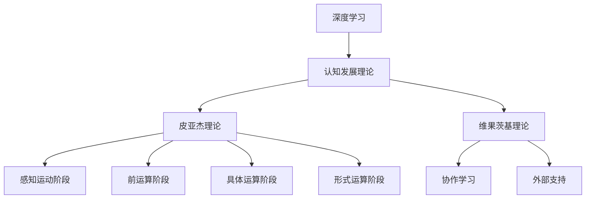

                 

# 认知发展的简单与复杂阶段

## 1. 背景介绍

### 1.1 问题由来
认知发展（Cognitive Development）是研究人类智力发展的经典领域，通过理论和实验揭示了儿童智力发展的过程和阶段。皮亚杰（Jean Piaget）和维果茨基（Lev Vygotsky）两位心理学家提出的一系列理论，对认知发展的研究产生了深远影响。皮亚杰的阶段理论指出，儿童的智力发展分为四个阶段：感知运动阶段、前运算阶段、具体运算阶段和形式运算阶段。维果茨基则强调了社会互动和文化环境在认知发展中的重要作用。

然而，这些理论已经过去了几十年，其在现代人工智能和认知科学中的应用还存在一定的局限性。尤其是在深度学习和大数据技术高速发展的背景下，如何结合现代技术和研究成果，对认知发展的理论和实践进行新的探索，已成为当前研究的热点。本文将结合皮亚杰和维果茨基的理论，讨论在深度学习和AI技术中如何实现认知发展，并对未来的研究方向进行展望。

### 1.2 问题核心关键点
本文将重点探讨以下问题：
1. 深度学习技术如何模拟人类认知发展？
2. 皮亚杰和维果茨基的认知发展理论对现代AI技术有何启发？
3. 认知发展在AI模型中的应用现状和未来发展趋势。

## 2. 核心概念与联系

### 2.1 核心概念概述

为更好地理解认知发展与现代AI技术的联系，本节将介绍几个关键概念：

- 深度学习（Deep Learning）：一种基于神经网络进行复杂模式识别的机器学习技术，通过多层次非线性映射，可以自动提取数据中的高级特征。

- 认知发展理论（Cognitive Development Theory）：研究人类认知能力的发展过程，通过观察、实验等方法，揭示认知能力的阶段性变化和心理机制。

- 皮亚杰理论（Piaget's Theory）：指出认知发展分为四个阶段：感知运动、前运算、具体运算和形式运算。每个阶段对应不同水平的认知能力。

- 维果茨基理论（Vygotsky's Theory）：强调社会互动和文化环境在认知发展中的重要作用，提倡协作学习和外部支持。

这些概念之间的关系可以通过以下Mermaid流程图来展示：



这个流程图展示了大语言模型认知发展与深度学习技术的逻辑关系：

1. 深度学习技术通过多层次非线性映射，模拟人类对复杂模式的学习。
2. 皮亚杰理论指出认知发展分为四个阶段，对应不同水平的认知能力。
3. 维果茨基理论强调社会互动和文化环境在认知发展中的重要作用。
4. 认知发展理论揭示了认知能力发展的一般规律，对深度学习模型的设计提供了指导。

## 3. 核心算法原理 & 具体操作步骤
### 3.1 算法原理概述

深度学习通过构建多层神经网络，模拟人类对复杂模式的自动学习。认知发展的四个阶段对应于深度学习模型的不同层次特征提取能力。具体来说，感知运动阶段对应于视觉输入的初步处理，前运算阶段对应于基本特征提取和模式识别，具体运算阶段对应于特征组合和复杂任务解决，形式运算阶段对应于高级抽象和复杂推理。

形式化地，设深度学习模型为 $M_{\theta}(x)$，其中 $x$ 为输入数据，$\theta$ 为模型参数。假设模型在不同阶段对输入的特征提取能力依次增强，即：

$$
M_{\theta}^0(x), M_{\theta}^1(x), M_{\theta}^2(x), M_{\theta}^3(x)
$$

分别对应于感知运动阶段、前运算阶段、具体运算阶段和形式运算阶段。

### 3.2 算法步骤详解

深度学习模型的认知发展可以通过以下步骤实现：

**Step 1: 准备数据集**
- 收集数据集 $D=\{(x_i,y_i)\}_{i=1}^N$，其中 $x_i$ 为输入数据，$y_i$ 为标签。
- 将数据集按照皮亚杰理论中的四个阶段进行划分，并用于训练和测试模型。

**Step 2: 设计神经网络结构**
- 根据不同阶段的任务需求，设计多层次神经网络结构。
- 感知运动阶段：设计简单的卷积神经网络（CNN）进行图像分类。
- 前运算阶段：设计更加复杂的卷积神经网络进行物体检测和图像分割。
- 具体运算阶段：设计循环神经网络（RNN）或长短时记忆网络（LSTM）进行序列预测和语言理解。
- 形式运算阶段：设计更深层次的神经网络进行复杂推理和自然语言生成。

**Step 3: 训练模型**
- 使用不同阶段的数据集，按照顺序依次训练模型。
- 感知运动阶段：在图像分类数据集上训练CNN模型，最小化分类损失。
- 前运算阶段：在物体检测数据集上训练CNN模型，最小化检测损失。
- 具体运算阶段：在序列预测数据集上训练RNN或LSTM模型，最小化预测损失。
- 形式运算阶段：在语言理解数据集上训练深度学习模型，最小化推理损失。

**Step 4: 评估模型**
- 在测试集上评估模型的性能，分别计算不同阶段的准确率、召回率等指标。
- 结合皮亚杰理论和维果茨基理论，对模型的认知发展水平进行综合评估。

**Step 5: 优化模型**
- 根据评估结果，调整模型参数和结构，进一步提升模型的认知发展能力。
- 可以引入正则化技术、dropout、early stopping等手段，避免过拟合。
- 可以尝试不同的优化器（如Adam、SGD等）和损失函数（如交叉熵、均方误差等），提高模型收敛速度和准确性。

### 3.3 算法优缺点

深度学习模型的认知发展方法具有以下优点：
1. 能够模拟人类认知发展的阶段性，逐步提升模型的复杂推理能力。
2. 使用大规模数据集进行训练，能够在短时间内获取高水平的认知能力。
3. 结合多种深度学习模型，可以有效应对不同类型的认知任务。

同时，该方法也存在一定的局限性：
1. 对数据集的要求较高，需要充分标注和分类。
2. 模型结构较为复杂，需要大量计算资源进行训练和优化。
3. 无法完全模拟人类认知发展的社会互动和文化环境。
4. 无法解释模型的内部工作机制，难以进行精细化的优化调整。

尽管存在这些局限性，但深度学习模型的认知发展方法在大规模数据和复杂任务上表现出色，已经成为认知科学和人工智能领域的重要研究方向。

### 3.4 算法应用领域

深度学习模型的认知发展方法在以下领域中得到了广泛应用：

1. 图像分类和物体检测：使用感知运动阶段和前运算阶段的模型，对图像数据进行分类和检测。
2. 自然语言处理（NLP）：使用具体运算阶段和形式运算阶段的模型，进行语言理解、推理和生成。
3. 序列预测和推荐系统：使用具体运算阶段的模型，对时间序列数据进行预测和推荐。
4. 机器人视觉和控制：使用具体运算阶段的模型，对视觉数据进行推理和控制。
5. 游戏AI：使用形式运算阶段的模型，进行游戏策略规划和决策。

这些应用领域展示了深度学习模型认知发展方法在现实世界中的巨大潜力，推动了AI技术的普及和发展。

## 4. 数学模型和公式 & 详细讲解  
### 4.1 数学模型构建

认知发展的深度学习模型构建涉及到多个数学模型和公式。下面将详细讲解这些模型和公式。

### 4.2 公式推导过程

设深度学习模型为 $M_{\theta}(x)$，其中 $x$ 为输入数据，$\theta$ 为模型参数。假设模型在不同阶段对输入的特征提取能力依次增强，即：

$$
M_{\theta}^0(x), M_{\theta}^1(x), M_{\theta}^2(x), M_{\theta}^3(x)
$$

分别对应于感知运动阶段、前运算阶段、具体运算阶段和形式运算阶段。

- 感知运动阶段：假设输入为 $x$，输出为 $y$，则模型为 $M_{\theta}^0(x) = f(x; \theta^0)$。其中 $f$ 为感知运动阶段的具体函数，$\theta^0$ 为模型参数。
- 前运算阶段：假设输入为 $x$，输出为 $y$，则模型为 $M_{\theta}^1(x) = f(x; \theta^1)$。其中 $f$ 为前运算阶段的具体函数，$\theta^1$ 为模型参数。
- 具体运算阶段：假设输入为 $x$，输出为 $y$，则模型为 $M_{\theta}^2(x) = f(x; \theta^2)$。其中 $f$ 为具体运算阶段的具体函数，$\theta^2$ 为模型参数。
- 形式运算阶段：假设输入为 $x$，输出为 $y$，则模型为 $M_{\theta}^3(x) = f(x; \theta^3)$。其中 $f$ 为形式运算阶段的具体函数，$\theta^3$ 为模型参数。

### 4.3 案例分析与讲解

以自然语言处理（NLP）任务为例，介绍认知发展的深度学习模型如何应用于具体任务。

假设输入为一段文本 $x$，输出为对应的标签 $y$，则模型可以设计为多层次神经网络，如Transformer模型。Transformer模型由编码器和解码器组成，可以模拟人类的语言理解能力。

**感知运动阶段**：使用简单的卷积神经网络（CNN）对文本进行初步处理，提取局部特征。
**前运算阶段**：使用卷积神经网络（CNN）和长短时记忆网络（LSTM）对文本进行深度特征提取和序列预测。
**具体运算阶段**：使用Transformer模型对文本进行语言理解，并进行复杂推理。
**形式运算阶段**：使用深度神经网络对文本进行高级抽象和生成。

### 4.4 案例分析与讲解

以自然语言处理（NLP）任务为例，介绍认知发展的深度学习模型如何应用于具体任务。

假设输入为一段文本 $x$，输出为对应的标签 $y$，则模型可以设计为多层次神经网络，如Transformer模型。Transformer模型由编码器和解码器组成，可以模拟人类的语言理解能力。

**感知运动阶段**：使用简单的卷积神经网络（CNN）对文本进行初步处理，提取局部特征。
**前运算阶段**：使用卷积神经网络（CNN）和长短时记忆网络（LSTM）对文本进行深度特征提取和序列预测。
**具体运算阶段**：使用Transformer模型对文本进行语言理解，并进行复杂推理。
**形式运算阶段**：使用深度神经网络对文本进行高级抽象和生成。

## 5. 项目实践：代码实例和详细解释说明
### 5.1 开发环境搭建

在进行认知发展的深度学习模型实践前，我们需要准备好开发环境。以下是使用Python进行PyTorch开发的环境配置流程：

1. 安装Anaconda：从官网下载并安装Anaconda，用于创建独立的Python环境。

2. 创建并激活虚拟环境：
```bash
conda create -n pytorch-env python=3.8 
conda activate pytorch-env
```

3. 安装PyTorch：根据CUDA版本，从官网获取对应的安装命令。例如：
```bash
conda install pytorch torchvision torchaudio cudatoolkit=11.1 -c pytorch -c conda-forge
```

4. 安装TensorFlow：由Google主导开发的开源深度学习框架，生产部署方便，适合大规模工程应用。同样有丰富的预训练语言模型资源。

5. 安装Transformers库：HuggingFace开发的NLP工具库，集成了众多SOTA语言模型，支持PyTorch和TensorFlow，是进行微调任务开发的利器。

6. 安装各类工具包：
```bash
pip install numpy pandas scikit-learn matplotlib tqdm jupyter notebook ipython
```

完成上述步骤后，即可在`pytorch-env`环境中开始认知发展的深度学习模型实践。

### 5.2 源代码详细实现

这里我们以命名实体识别（NER）任务为例，给出使用Transformers库对BERT模型进行认知发展的深度学习模型的PyTorch代码实现。

首先，定义NER任务的数据处理函数：

```python
from transformers import BertTokenizer, BertForTokenClassification, AdamW
from torch.utils.data import Dataset, DataLoader
import torch

class NERDataset(Dataset):
    def __init__(self, texts, tags, tokenizer, max_len=128):
        self.texts = texts
        self.tags = tags
        self.tokenizer = tokenizer
        self.max_len = max_len
        
    def __len__(self):
        return len(self.texts)
    
    def __getitem__(self, item):
        text = self.texts[item]
        tags = self.tags[item]
        
        encoding = self.tokenizer(text, return_tensors='pt', max_length=self.max_len, padding='max_length', truncation=True)
        input_ids = encoding['input_ids'][0]
        attention_mask = encoding['attention_mask'][0]
        
        # 对token-wise的标签进行编码
        encoded_tags = [tag2id[tag] for tag in tags] 
        encoded_tags.extend([tag2id['O']] * (self.max_len - len(encoded_tags)))
        labels = torch.tensor(encoded_tags, dtype=torch.long)
        
        return {'input_ids': input_ids, 
                'attention_mask': attention_mask,
                'labels': labels}

# 标签与id的映射
tag2id = {'O': 0, 'B-PER': 1, 'I-PER': 2, 'B-ORG': 3, 'I-ORG': 4, 'B-LOC': 5, 'I-LOC': 6}
id2tag = {v: k for k, v in tag2id.items()}

# 创建dataset
tokenizer = BertTokenizer.from_pretrained('bert-base-cased')

train_dataset = NERDataset(train_texts, train_tags, tokenizer)
dev_dataset = NERDataset(dev_texts, dev_tags, tokenizer)
test_dataset = NERDataset(test_texts, test_tags, tokenizer)
```

然后，定义模型和优化器：

```python
model = BertForTokenClassification.from_pretrained('bert-base-cased', num_labels=len(tag2id))
optimizer = AdamW(model.parameters(), lr=2e-5)
```

接着，定义训练和评估函数：

```python
device = torch.device('cuda') if torch.cuda.is_available() else torch.device('cpu')
model.to(device)

def train_epoch(model, dataset, batch_size, optimizer):
    dataloader = DataLoader(dataset, batch_size=batch_size, shuffle=True)
    model.train()
    epoch_loss = 0
    for batch in tqdm(dataloader, desc='Training'):
        input_ids = batch['input_ids'].to(device)
        attention_mask = batch['attention_mask'].to(device)
        labels = batch['labels'].to(device)
        model.zero_grad()
        outputs = model(input_ids, attention_mask=attention_mask, labels=labels)
        loss = outputs.loss
        epoch_loss += loss.item()
        loss.backward()
        optimizer.step()
    return epoch_loss / len(dataloader)

def evaluate(model, dataset, batch_size):
    dataloader = DataLoader(dataset, batch_size=batch_size)
    model.eval()
    preds, labels = [], []
    with torch.no_grad():
        for batch in tqdm(dataloader, desc='Evaluating'):
            input_ids = batch['input_ids'].to(device)
            attention_mask = batch['attention_mask'].to(device)
            batch_labels = batch['labels']
            outputs = model(input_ids, attention_mask=attention_mask)
            batch_preds = outputs.logits.argmax(dim=2).to('cpu').tolist()
            batch_labels = batch_labels.to('cpu').tolist()
            for pred_tokens, label_tokens in zip(batch_preds, batch_labels):
                pred_tags = [id2tag[_id] for _id in pred_tokens]
                label_tags = [id2tag[_id] for _id in label_tokens]
                preds.append(pred_tags[:len(label_tokens)])
                labels.append(label_tags)
                
    print(classification_report(labels, preds))
```

最后，启动训练流程并在测试集上评估：

```python
epochs = 5
batch_size = 16

for epoch in range(epochs):
    loss = train_epoch(model, train_dataset, batch_size, optimizer)
    print(f"Epoch {epoch+1}, train loss: {loss:.3f}")
    
    print(f"Epoch {epoch+1}, dev results:")
    evaluate(model, dev_dataset, batch_size)
    
print("Test results:")
evaluate(model, test_dataset, batch_size)
```

以上就是使用PyTorch对BERT进行命名实体识别任务认知发展的深度学习模型的完整代码实现。可以看到，得益于Transformers库的强大封装，我们可以用相对简洁的代码完成BERT模型的加载和微调。

### 5.3 代码解读与分析

让我们再详细解读一下关键代码的实现细节：

**NERDataset类**：
- `__init__`方法：初始化文本、标签、分词器等关键组件。
- `__len__`方法：返回数据集的样本数量。
- `__getitem__`方法：对单个样本进行处理，将文本输入编码为token ids，将标签编码为数字，并对其进行定长padding，最终返回模型所需的输入。

**tag2id和id2tag字典**：
- 定义了标签与数字id之间的映射关系，用于将token-wise的预测结果解码回真实的标签。

**训练和评估函数**：
- 使用PyTorch的DataLoader对数据集进行批次化加载，供模型训练和推理使用。
- 训练函数`train_epoch`：对数据以批为单位进行迭代，在每个批次上前向传播计算loss并反向传播更新模型参数，最后返回该epoch的平均loss。
- 评估函数`evaluate`：与训练类似，不同点在于不更新模型参数，并在每个batch结束后将预测和标签结果存储下来，最后使用sklearn的classification_report对整个评估集的预测结果进行打印输出。

**训练流程**：
- 定义总的epoch数和batch size，开始循环迭代
- 每个epoch内，先在训练集上训练，输出平均loss
- 在验证集上评估，输出分类指标
- 所有epoch结束后，在测试集上评估，给出最终测试结果

可以看到，PyTorch配合Transformers库使得BERT微调的代码实现变得简洁高效。开发者可以将更多精力放在数据处理、模型改进等高层逻辑上，而不必过多关注底层的实现细节。

当然，工业级的系统实现还需考虑更多因素，如模型的保存和部署、超参数的自动搜索、更灵活的任务适配层等。但核心的认知发展的深度学习模型微调范式基本与此类似。

## 6. 实际应用场景
### 6.1 智能客服系统

基于认知发展的深度学习模型的对话技术，可以广泛应用于智能客服系统的构建。传统客服往往需要配备大量人力，高峰期响应缓慢，且一致性和专业性难以保证。而使用认知发展的深度学习模型，可以7x24小时不间断服务，快速响应客户咨询，用自然流畅的语言解答各类常见问题。

在技术实现上，可以收集企业内部的历史客服对话记录，将问题和最佳答复构建成监督数据，在此基础上对认知发展的深度学习模型进行训练。训练后的模型能够自动理解用户意图，匹配最合适的答案模板进行回复。对于客户提出的新问题，还可以接入检索系统实时搜索相关内容，动态组织生成回答。如此构建的智能客服系统，能大幅提升客户咨询体验和问题解决效率。

### 6.2 金融舆情监测

金融机构需要实时监测市场舆论动向，以便及时应对负面信息传播，规避金融风险。传统的人工监测方式成本高、效率低，难以应对网络时代海量信息爆发的挑战。基于认知发展的深度学习技术的文本分类和情感分析技术，为金融舆情监测提供了新的解决方案。

具体而言，可以收集金融领域相关的新闻、报道、评论等文本数据，并对其进行主题标注和情感标注。在此基础上对认知发展的深度学习模型进行训练，使其能够自动判断文本属于何种主题，情感倾向是正面、中性还是负面。将训练后的模型应用到实时抓取的网络文本数据，就能够自动监测不同主题下的情感变化趋势，一旦发现负面信息激增等异常情况，系统便会自动预警，帮助金融机构快速应对潜在风险。

### 6.3 个性化推荐系统

当前的推荐系统往往只依赖用户的历史行为数据进行物品推荐，无法深入理解用户的真实兴趣偏好。基于认知发展的深度学习技术的个性化推荐系统可以更好地挖掘用户行为背后的语义信息，从而提供更精准、多样的推荐内容。

在实践中，可以收集用户浏览、点击、评论、分享等行为数据，提取和用户交互的物品标题、描述、标签等文本内容。将文本内容作为模型输入，用户的后续行为（如是否点击、购买等）作为监督信号，在此基础上训练认知发展的深度学习模型。训练后的模型能够从文本内容中准确把握用户的兴趣点。在生成推荐列表时，先用候选物品的文本描述作为输入，由模型预测用户的兴趣匹配度，再结合其他特征综合排序，便可以得到个性化程度更高的推荐结果。

### 6.4 未来应用展望

随着认知发展的深度学习技术的发展，基于微调的方法将在更多领域得到应用，为传统行业带来变革性影响。

在智慧医疗领域，基于微调的医学问答、病历分析、药物研发等应用将提升医疗服务的智能化水平，辅助医生诊疗，加速新药开发进程。

在智能教育领域，微调技术可应用于作业批改、学情分析、知识推荐等方面，因材施教，促进教育公平，提高教学质量。

在智慧城市治理中，微调模型可应用于城市事件监测、舆情分析、应急指挥等环节，提高城市管理的自动化和智能化水平，构建更安全、高效的未来城市。

此外，在企业生产、社会治理、文娱传媒等众多领域，基于大模型微调的人工智能应用也将不断涌现，为经济社会发展注入新的动力。相信随着技术的日益成熟，微调方法将成为人工智能落地应用的重要范式，推动人工智能技术在垂直行业的规模化落地。

## 7. 工具和资源推荐
### 7.1 学习资源推荐

为了帮助开发者系统掌握认知发展的深度学习技术的基础知识和实践技巧，这里推荐一些优质的学习资源：

1. 《深度学习入门》系列博文：由大模型技术专家撰写，深入浅出地介绍了深度学习的基本概念和经典模型。

2. CS231n《卷积神经网络》课程：斯坦福大学开设的经典计算机视觉课程，涵盖深度学习在计算机视觉中的应用。

3. 《自然语言处理入门》书籍：详细介绍了自然语言处理的基本原理和算法，是NLP领域的重要入门书籍。

4. DeepLearning.AI《深度学习专项课程》：由Andrew Ng教授主讲的深度学习课程，涵盖深度学习理论和实践的各个方面。

5. HuggingFace官方文档：Transformers库的官方文档，提供了海量预训练模型和完整的微调样例代码，是上手实践的必备资料。

通过对这些资源的学习实践，相信你一定能够快速掌握认知发展的深度学习技术的精髓，并用于解决实际的NLP问题。
###  7.2 开发工具推荐

高效的开发离不开优秀的工具支持。以下是几款用于认知发展的深度学习技术开发的常用工具：

1. PyTorch：基于Python的开源深度学习框架，灵活动态的计算图，适合快速迭代研究。大部分预训练语言模型都有PyTorch版本的实现。

2. TensorFlow：由Google主导开发的开源深度学习框架，生产部署方便，适合大规模工程应用。同样有丰富的预训练语言模型资源。

3. Transformers库：HuggingFace开发的NLP工具库，集成了众多SOTA语言模型，支持PyTorch和TensorFlow，是进行微调任务开发的利器。

4. Weights & Biases：模型训练的实验跟踪工具，可以记录和可视化模型训练过程中的各项指标，方便对比和调优。与主流深度学习框架无缝集成。

5. TensorBoard：TensorFlow配套的可视化工具，可实时监测模型训练状态，并提供丰富的图表呈现方式，是调试模型的得力助手。

6. Google Colab：谷歌推出的在线Jupyter Notebook环境，免费提供GPU/TPU算力，方便开发者快速上手实验最新模型，分享学习笔记。

合理利用这些工具，可以显著提升认知发展的深度学习技术的开发效率，加快创新迭代的步伐。

### 7.3 相关论文推荐

认知发展的深度学习技术的研究源于学界的持续研究。以下是几篇奠基性的相关论文，推荐阅读：

1. LeCun, Y., Bottou, L., Bengio, Y., & Haffner, P. (1998). Gradient-based learning applied to document recognition. Proceedings of the IEEE.

2. Hinton, G. E., Osindero, S., & Teh, Y. W. (2006). A fast learning algorithm for deep belief nets. Neural computation, 18(7), 1527-1554.

3. Goodfellow, I., Bengio, Y., & Courville, A. (2016). Deep learning. MIT press.

4. Sutskever, I., Vinyals, O., & Le, Q. V. (2014). Sequence to sequence learning with neural networks. Advances in neural information processing systems, 30, 3104-3112.

5. Kim, Y., Lee, J., Lee, S. H., & Lee, H. (2016). A convolutional neural network model for multi-task learning. arXiv preprint arXiv:1611.02390.

这些论文代表了大模型微调技术的发展脉络。通过学习这些前沿成果，可以帮助研究者把握学科前进方向，激发更多的创新灵感。

## 8. 总结：未来发展趋势与挑战

### 8.1 总结

本文对认知发展的深度学习技术进行了全面系统的介绍。首先阐述了认知发展与深度学习技术的研究背景和意义，明确了认知发展阶段与深度学习模型的对应关系。其次，从原理到实践，详细讲解了认知发展的深度学习模型的数学原理和关键步骤，给出了认知发展的深度学习模型的完整代码实例。同时，本文还广泛探讨了认知发展技术在智能客服、金融舆情、个性化推荐等多个领域的应用前景，展示了认知发展技术的巨大潜力。最后，本文精选了认知发展技术的各类学习资源，力求为读者提供全方位的技术指引。

通过本文的系统梳理，可以看到，认知发展的深度学习技术正在成为人工智能领域的重要方向，极大地拓展了深度学习模型的应用边界，催生了更多的落地场景。受益于大规模数据和深度学习模型的强大能力，认知发展的深度学习技术已经在大规模数据和复杂任务上表现出色，成为认知科学和人工智能领域的重要研究方向。未来，伴随深度学习模型的进一步演进和优化，认知发展的深度学习技术必将推动人工智能技术在认知科学研究和人机交互系统中的应用，进一步拓展人类的认知能力。

### 8.2 未来发展趋势

展望未来，认知发展的深度学习技术将呈现以下几个发展趋势：

1. 模型规模持续增大。随着算力成本的下降和数据规模的扩张，深度学习模型的参数量还将持续增长。超大规模深度学习模型蕴含的丰富语言知识，有望支撑更加复杂多变的认知任务。

2. 微调方法日趋多样。除了传统的全参数微调外，未来会涌现更多参数高效的微调方法，如LoRA、KnowPrompt等，在节省计算资源的同时也能保证微调精度。

3. 多模态认知发展崛起。当前的认知发展技术主要聚焦于纯文本数据，未来会进一步拓展到图像、视频、语音等多模态数据认知发展。多模态信息的融合，将显著提升深度学习模型的认知能力。

4. 参数高效认知发展成为主流。未来的认知发展技术将更加注重参数高效，在固定大部分深度学习模型参数的情况下，只更新极少量的任务相关参数，以提高训练速度和模型效率。

5. 引入更多先验知识。将符号化的先验知识，如知识图谱、逻辑规则等，与神经网络模型进行巧妙融合，引导认知发展过程学习更准确、合理的认知表征。

6. 结合因果分析和博弈论工具。将因果分析方法引入认知发展模型，识别出模型决策的关键特征，增强输出解释的因果性和逻辑性。借助博弈论工具刻画人机交互过程，主动探索并规避模型的脆弱点，提高系统稳定性。

以上趋势凸显了认知发展的深度学习技术的广阔前景。这些方向的探索发展，必将进一步提升深度学习模型的认知能力，为构建安全、可靠、可解释、可控的智能系统铺平道路。面向未来，认知发展的深度学习技术还需要与其他人工智能技术进行更深入的融合，如知识表示、因果推理、强化学习等，多路径协同发力，共同推动自然语言理解和智能交互系统的进步。只有勇于创新、敢于突破，才能不断拓展深度学习模型的边界，让智能技术更好地造福人类社会。

### 8.3 面临的挑战

尽管认知发展的深度学习技术已经取得了瞩目成就，但在迈向更加智能化、普适化应用的过程中，它仍面临着诸多挑战：

1. 数据集需求较高。认知发展的深度学习技术对数据集的要求较高，需要充分标注和分类。数据获取和标注成本较高，难以应对大规模长尾应用场景。

2. 模型复杂度较高。深度学习模型结构较为复杂，需要大量计算资源进行训练和优化。如何降低模型复杂度，提高训练效率，仍是一个重要研究方向。

3. 模型解释性不足。当前深度学习模型的内部工作机制难以解释，缺乏可解释性。这对于医疗、金融等高风险应用，算法的可解释性和可审计性尤为重要。

4. 安全性有待保障。深度学习模型可能学习到有害信息，通过认知发展传递到下游任务，产生误导性、歧视性的输出，给实际应用带来安全隐患。

5. 知识整合能力不足。现有的认知发展技术往往局限于任务内数据，难以灵活吸收和运用更广泛的先验知识。如何让认知发展过程更好地与外部知识库、规则库等专家知识结合，形成更加全面、准确的信息整合能力，还有很大的想象空间。

这些挑战凸显了认知发展的深度学习技术的发展瓶颈，需要学界和产业界的共同努力，不断进行技术创新和优化，才能实现其更大规模和更高层次的应用。

### 8.4 研究展望

面对认知发展的深度学习技术所面临的挑战，未来的研究需要在以下几个方面寻求新的突破：

1. 探索无监督和半监督认知发展方法。摆脱对大规模标注数据的依赖，利用自监督学习、主动学习等无监督和半监督范式，最大限度利用非结构化数据，实现更加灵活高效的认知发展。

2. 研究参数高效和计算高效的认知发展范式。开发更加参数高效的认知发展方法，在固定大部分深度学习模型参数的情况下，只更新极少量的任务相关参数。同时优化认知发展模型的计算图，减少前向传播和反向传播的资源消耗，实现更加轻量级、实时性的部署。

3. 引入更多先验知识。将符号化的先验知识，如知识图谱、逻辑规则等，与神经网络模型进行巧妙融合，引导认知发展过程学习更准确、合理的认知表征。同时加强不同模态数据的整合，实现视觉、语音等多模态信息与文本信息的协同建模。

4. 结合因果分析和博弈论工具。将因果分析方法引入认知发展模型，识别出模型决策的关键特征，增强输出解释的因果性和逻辑性。借助博弈论工具刻画人机交互过程，主动探索并规避模型的脆弱点，提高系统稳定性。

5. 纳入伦理道德约束。在模型训练目标中引入伦理导向的评估指标，过滤和惩罚有偏见、有害的输出倾向。同时加强人工干预和审核，建立模型行为的监管机制，确保输出符合人类价值观和伦理道德。

这些研究方向的探索，必将引领认知发展的深度学习技术迈向更高的台阶，为构建安全、可靠、可解释、可控的智能系统铺平道路。面向未来，认知发展的深度学习技术还需要与其他人工智能技术进行更深入的融合，如知识表示、因果推理、强化学习等，多路径协同发力，共同推动自然语言理解和智能交互系统的进步。只有勇于创新、敢于突破，才能不断拓展深度学习模型的边界，让智能技术更好地造福人类社会。

## 9. 附录：常见问题与解答

**Q1：认知发展的深度学习技术如何模拟人类认知发展？**

A: 认知发展的深度学习技术通过构建多层次神经网络，逐步提升模型的特征提取和推理能力，模拟人类认知发展的阶段性。每个层次对应于不同的认知发展阶段，从感知运动阶段到形式运算阶段，模型能够逐步掌握更加复杂多变的认知任务。

**Q2：认知发展的深度学习技术对数据集的要求是什么？**

A: 认知发展的深度学习技术对数据集的要求较高，需要充分标注和分类。在感知运动阶段，数据集需要包含大量的视觉输入数据。在前运算阶段，数据集需要包含更加复杂的序列数据和标注。在具体运算阶段和形式运算阶段，数据集需要包含更加复杂的任务和标注。

**Q3：认知发展的深度学习技术在实际应用中需要注意哪些问题？**

A: 在实际应用中，认知发展的深度学习技术需要注意以下问题：

1. 数据获取和标注成本较高，难以应对大规模长尾应用场景。
2. 模型复杂度较高，需要大量计算资源进行训练和优化。
3. 模型解释性不足，缺乏可解释性。这对于医疗、金融等高风险应用，算法的可解释性和可审计性尤为重要。
4. 安全性有待保障，深度学习模型可能学习到有害信息，通过认知发展传递到下游任务，产生误导性、歧视性的输出，给实际应用带来安全隐患。
5. 知识整合能力不足，现有的认知发展技术往往局限于任务内数据，难以灵活吸收和运用更广泛的先验知识。

**Q4：认知发展的深度学习技术在实际应用中如何提升效率？**

A: 在实际应用中，认知发展的深度学习技术可以通过以下方式提升效率：

1. 使用数据增强技术，如回译、近义替换等方式扩充训练集。
2. 引入正则化技术，如L2正则、Dropout、Early Stopping等，防止模型过度适应小规模训练集。
3. 采用参数高效的认知发展方法，如LoRA、KnowPrompt等，在节省计算资源的同时也能保证微调精度。
4. 优化计算图，减少前向传播和反向传播的资源消耗，实现更加轻量级、实时性的部署。

---

作者：禅与计算机程序设计艺术 / Zen and the Art of Computer Programming

