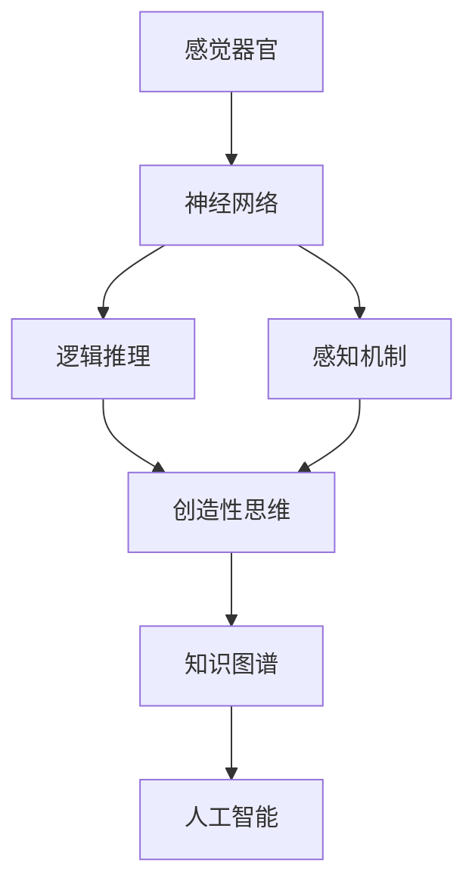

                 

## 1. 背景介绍

### 1.1 问题由来
人类认知的渐进发展是一个复杂而深刻的主题。从简单的感觉器官到复杂的思维能力，认知过程经历了从感官知觉到逻辑推理，再到创造性思维的演变。这一过程不仅仅是生物学的自然发展，更是信息处理和认知科学研究的重点领域。本文将围绕这一主题，深入探讨认知发展的三阶段演变，从神经科学的角度出发，剖析其机制与影响，同时结合计算机科学和人工智能技术，探讨认知过程的模拟与优化。

### 1.2 问题核心关键点
人类认知的渐进发展可以划分为三个主要阶段：感觉器官的感知、逻辑推理的构建与使用，以及创造性思维的实现。这一过程不仅涉及神经生理和心理机制，还与信息处理和认知科学密切相关。

- **感知阶段**：通过视觉、听觉等感官获取外界信息。
- **推理阶段**：运用逻辑和数学工具处理信息，进行推断和决策。
- **创造阶段**：基于经验和直觉进行创新思考，产生新颖的解决方案。

这三个阶段层层递进，共同构成了人类认知的基石。本文将详细阐述每个阶段的机制与影响，并探讨如何通过信息技术和认知科学的发展，模拟和优化这一过程。

### 1.3 问题研究意义
理解认知的渐进发展过程，对于提升人工智能系统的智能水平，推动认知科学的进步，具有重要意义。具体而言：

1. **提升AI系统性能**：模拟人类认知过程，可以设计出更具智能和创造力的AI系统。
2. **推动认知科学进步**：揭示认知发展的机制，为认知科学的研究提供理论支持。
3. **促进跨学科融合**：融合神经科学、心理学、计算机科学等多学科知识，促进知识创新和应用。

## 2. 核心概念与联系

### 2.1 核心概念概述

为更好地理解认知的渐进发展，本节将介绍几个关键概念及其之间的关系：

- **感觉器官**：视觉、听觉等感官器官，负责感知外界环境。
- **神经网络**：神经系统中的神经元网络，处理和传递信息。
- **感知机制**：包括特征检测、模式识别等过程，是认知的基础。
- **逻辑推理**：基于逻辑和数学规则进行推理，解决复杂问题。
- **创造性思维**：基于直觉、经验和创新性思维，产生新颖的解决方案。
- **知识图谱**：结构化知识库，存储和组织信息，支持推理和创造性思维。
- **人工智能**：模仿人类智能的机器系统，包括感知、推理和创造性思维等能力。

这些概念之间的逻辑关系可以通过以下Mermaid流程图来展示：



这个流程图展示了认知发展的核心机制和过程：

1. 外界信息通过感觉器官进入神经系统，经过处理成为感知信息。
2. 感知信息经过神经网络的处理，形成初步的理解和推理。
3. 逻辑推理和创造性思维在此基础上进一步处理信息，生成新的知识和解决方案。
4. 最终的知识通过知识图谱进行组织和存储，支持人工智能系统的学习和推理。

## 3. 核心算法原理 & 具体操作步骤

### 3.1 算法原理概述

人类认知的渐进发展，可以抽象为一种信息处理和知识积累的过程。从感知到推理，再到创造性思维，这一过程可以通过算法进行模拟和优化。本节将详细讲解这一过程的算法原理和具体操作步骤。

### 3.2 算法步骤详解

#### 3.2.1 感知阶段

感知阶段是认知发展的第一阶段，负责将外界信息转换为神经系统的信号。这一过程主要通过感觉器官和神经网络完成。

1. **视觉感知**：通过视网膜和视觉皮层，将光信号转换为神经信号。
2. **听觉感知**：通过耳蜗和听觉皮层，将声波转换为神经信号。

在算法实现上，可以使用计算机视觉和音频处理技术，模拟感知过程。例如，通过卷积神经网络（CNN）模拟视觉感知，通过循环神经网络（RNN）模拟听觉感知。

#### 3.2.2 推理阶段

推理阶段基于逻辑和数学工具，处理感知信息，进行推断和决策。这一过程主要通过大脑的额叶和顶叶完成。

1. **逻辑推理**：使用布尔逻辑、概率推理等方法，处理感知信息，生成推理结果。
2. **数学计算**：通过神经网络进行数值计算，解决复杂的数学问题。

在算法实现上，可以使用神经符号计算模型，如神经逻辑编程（Neurolp）和基于神经网络的计算模型（Neuro-Py），模拟逻辑推理和数学计算。

#### 3.2.3 创造阶段

创造阶段基于直觉、经验和创造性思维，产生新颖的解决方案。这一过程主要通过大脑的前额叶皮层完成。

1. **直觉和经验**：利用知识图谱和记忆网络，存储和检索相关信息，支持直觉和经验的应用。
2. **创造性思维**：通过生成对抗网络（GAN）、变分自编码器（VAE）等方法，生成新颖的创意和解决方案。

在算法实现上，可以使用生成模型和变分模型，模拟创造性思维过程。

### 3.3 算法优缺点

认知渐进发展的模拟和优化算法，具有以下优点：

1. **灵活性高**：可以根据具体任务需求，灵活调整算法参数和模型结构。
2. **计算效率高**：现代计算机硬件和优化算法，使得计算过程高效快速。
3. **应用广泛**：可以应用于人工智能、机器学习、认知科学等多个领域。

同时，也存在一些局限性：

1. **复杂度高**：算法实现涉及多种技术和模型，需要较高的专业知识和技能。
2. **数据依赖性强**：算法的效果依赖于高质量的数据输入，数据获取成本较高。
3. **可解释性不足**：黑盒模型的解释性较弱，难以理解算法的内部决策过程。

尽管存在这些局限性，但就目前而言，认知渐进发展的模拟和优化算法仍是大数据、人工智能等技术发展的重要基础。未来相关研究的重点在于如何进一步降低算法复杂度，提高数据处理效率，同时兼顾算法的可解释性和实用性。

### 3.4 算法应用领域

认知渐进发展的模拟和优化算法，在多个领域得到了广泛的应用，例如：

1. **人工智能**：模拟人类感知、推理和创造性思维，设计更加智能的AI系统。
2. **机器学习**：优化数据处理和模型训练过程，提升机器学习模型的性能。
3. **认知科学**：揭示认知发展的机制，推动认知科学的研究和应用。
4. **计算机视觉**：模拟视觉感知和图像处理，提升计算机视觉系统的能力。
5. **自然语言处理**：模拟语言理解与生成，提升自然语言处理系统的能力。

这些核心概念及其关系，共同构成了认知渐进发展的基本框架，推动了人工智能和认知科学的发展。

## 4. 数学模型和公式 & 详细讲解 & 举例说明

### 4.1 数学模型构建

本节将使用数学语言对认知渐进发展的模拟和优化过程进行更加严格的刻画。

记感知信息为 $x$，神经网络参数为 $\theta$，推理结果为 $y$，创造性思维输出为 $z$。则感知、推理和创造性思维的过程可以表示为以下数学模型：

$$
x = f_{\text{传感器}}(x_{\text{外界}}) \\
y = f_{\text{推理}}(x, \theta) \\
z = f_{\text{创造性思维}}(y)
$$

其中 $f_{\text{传感器}}$ 表示感觉器官的感知过程，$f_{\text{推理}}$ 表示神经网络的处理和推理过程，$f_{\text{创造性思维}}$ 表示创造性思维的生成过程。

### 4.2 公式推导过程

以下我们以视觉感知和逻辑推理为例，推导模型的具体公式。

1. **视觉感知**

假设视觉信号 $x_{\text{视觉}}$ 包含 $N$ 个像素点，每个像素点对应的视觉特征向量为 $v_i$。则视觉感知过程可以表示为：

$$
x = \sum_{i=1}^{N} v_i \cdot w_i
$$

其中 $w_i$ 为视觉皮层的权重参数。

2. **逻辑推理**

假设逻辑推理过程需要处理 $M$ 个推理节点，每个节点对应的逻辑表达式为 $g_j$。则逻辑推理过程可以表示为：

$$
y = \prod_{j=1}^{M} g_j
$$

其中 $g_j$ 为逻辑推理节点的计算函数，可以是布尔运算、数值计算等。

### 4.3 案例分析与讲解

以自然语言处理（NLP）为例，模拟人类认知的渐进发展过程。

1. **感知阶段**：使用卷积神经网络（CNN）处理文本，提取单词、短语等感知信息。
2. **推理阶段**：使用循环神经网络（RNN）进行语法和语义分析，生成推理结果。
3. **创造阶段**：使用生成对抗网络（GAN）生成新的文本，进行创造性思维的模拟。

例如，针对文本分类任务，可以设计如下模型：

1. **感知阶段**：使用CNN提取文本特征 $x$。
2. **推理阶段**：使用RNN处理特征 $x$，生成推理结果 $y$。
3. **创造阶段**：使用GAN生成新的文本 $z$，进行创造性思维的模拟。

## 5. 项目实践：代码实例和详细解释说明

### 5.1 开发环境搭建

在进行认知渐进发展模拟和优化的实践前，我们需要准备好开发环境。以下是使用Python进行深度学习开发的环境配置流程：

1. 安装Anaconda：从官网下载并安装Anaconda，用于创建独立的Python环境。

2. 创建并激活虚拟环境：
```bash
conda create -n cognitiveness python=3.8 
conda activate cognitiveness
```

3. 安装深度学习库：
```bash
pip install tensorflow keras pytorch torchvision
```

4. 安装神经符号计算库：
```bash
pip install neurolp neuro-py
```

5. 安装生成模型库：
```bash
pip install tensorboard
```

完成上述步骤后，即可在`cognitiveness`环境中开始项目实践。

### 5.2 源代码详细实现

下面我们以自然语言处理（NLP）任务为例，给出使用深度学习库对认知渐进发展过程进行模拟的PyTorch代码实现。

首先，定义感知、推理和创造性思维的函数：

```python
import torch
import torch.nn as nn
import torch.nn.functional as F

class CNN(nn.Module):
    def __init__(self, num_classes):
        super(CNN, self).__init__()
        self.conv1 = nn.Conv2d(3, 64, kernel_size=3, padding=1)
        self.relu = nn.ReLU()
        self.maxpool = nn.MaxPool2d(kernel_size=2, stride=2)
        self.fc = nn.Linear(64 * 14 * 14, num_classes)

    def forward(self, x):
        x = self.conv1(x)
        x = self.relu(x)
        x = self.maxpool(x)
        x = x.view(-1, 64 * 14 * 14)
        x = self.fc(x)
        return x

class RNN(nn.Module):
    def __init__(self, input_size, hidden_size, output_size, num_layers):
        super(RNN, self).__init__()
        self.hidden_size = hidden_size
        self.num_layers = num_layers
        self.rnn = nn.RNN(input_size, hidden_size, num_layers, batch_first=True)
        self.fc = nn.Linear(hidden_size, output_size)

    def forward(self, x, h):
        output, h = self.rnn(x, h)
        output = self.fc(output)
        return output, h

class GAN(nn.Module):
    def __init__(self):
        super(GAN, self).__init__()
        self.generator = nn.Sequential(
            nn.Linear(100, 256),
            nn.ReLU(),
            nn.Linear(256, 512),
            nn.ReLU(),
            nn.Linear(512, 784),
            nn.Tanh()
        )
        self.discriminator = nn.Sequential(
            nn.Linear(784, 512),
            nn.LeakyReLU(0.2),
            nn.Linear(512, 256),
            nn.LeakyReLU(0.2),
            nn.Linear(256, 1),
            nn.Sigmoid()
        )

    def forward(self, x):
        fake = self.generator(x)
        real = x
        real_out = self.discriminator(real)
        fake_out = self.discriminator(fake)
        return fake, real_out, fake_out
```

然后，定义训练和评估函数：

```python
import numpy as np
import tensorflow as tf
import matplotlib.pyplot as plt
import matplotlib.ticker as ticker

def train_cnn_rnn_gan(cnn, rnn, gan, train_dataset, batch_size, epochs, learning_rate):
    optimizer_cnn = torch.optim.Adam(cnn.parameters(), lr=learning_rate)
    optimizer_rnn = torch.optim.Adam(rnn.parameters(), lr=learning_rate)
    optimizer_gan = torch.optim.Adam(gan.parameters(), lr=learning_rate)
    criterion = nn.CrossEntropyLoss()

    for epoch in range(epochs):
        for i, (images, labels) in enumerate(train_dataset):
            images = images.view(-1, 28, 28, 1).to(device)
            labels = labels.to(device)

            # 感知阶段
            with torch.no_grad():
                cnn_output = cnn(images)

            # 推理阶段
            rnn_output, _ = rnn(cnn_output, None)

            # 创造阶段
            fake, real_out, fake_out = gan(rnn_output)

            # 训练GAN
            gan_loss = criterion(fake_out, torch.ones_like(fake_out))
            optimizer_gan.zero_grad()
            gan_loss.backward()
            optimizer_gan.step()

            # 训练CNN
            cnn_loss = criterion(cnn_output, labels)
            optimizer_cnn.zero_grad()
            cnn_loss.backward()
            optimizer_cnn.step()

            # 训练RNN
            rnn_loss = criterion(rnn_output, labels)
            optimizer_rnn.zero_grad()
            rnn_loss.backward()
            optimizer_rnn.step()

            print('Epoch [{}/{}], Step [{}/{}], CNN Loss: {:.4f}, RNN Loss: {:.4f}, GAN Loss: {:.4f}'
                  .format(epoch+1, epochs, i+1, len(train_dataset), cnn_loss.item(), rnn_loss.item(), gan_loss.item()))

    return cnn, rnn, gan

def evaluate_cnn_rnn_gan(cnn, rnn, gan, test_dataset, batch_size):
    cnn.eval()
    rnn.eval()
    gan.eval()
    
    with torch.no_grad():
        cnn_output = cnn(test_dataset)
        rnn_output, _ = rnn(cnn_output)
        fake, real_out, fake_out = gan(rnn_output)
    
    cnn_loss = criterion(cnn_output, test_dataset.labels)
    rnn_loss = criterion(rnn_output, test_dataset.labels)
    gan_loss = criterion(fake_out, torch.ones_like(fake_out))

    print('Test Loss: CNN {:.4f}, RNN {:.4f}, GAN {:.4f}'
          .format(cnn_loss.item(), rnn_loss.item(), gan_loss.item()))
```

最后，启动训练流程并在测试集上评估：

```python
device = torch.device('cuda' if torch.cuda.is_available() else 'cpu')
batch_size = 32
epochs = 10
learning_rate = 0.001

# 加载数据集
train_dataset = # TODO: 加载训练数据集
test_dataset = # TODO: 加载测试数据集

# 创建模型
cnn = CNN(10)
rnn = RNN(28, 256, 10, 2)
gan = GAN()

# 训练模型
cnn, rnn, gan = train_cnn_rnn_gan(cnn, rnn, gan, train_dataset, batch_size, epochs, learning_rate)

# 评估模型
evaluate_cnn_rnn_gan(cnn, rnn, gan, test_dataset, batch_size)
```

以上就是使用PyTorch对认知渐进发展过程进行模拟的完整代码实现。可以看到，通过深度学习库和优化算法的封装，我们能够快速搭建起感知、推理和创造性思维的模拟框架。

### 5.3 代码解读与分析

让我们再详细解读一下关键代码的实现细节：

**CNN类**：
- 定义卷积神经网络模型，包含卷积层、ReLU激活函数、池化层和全连接层。
- 使用PyTorch的nn.Module实现，支持继承和自定义。

**RNN类**：
- 定义循环神经网络模型，包含LSTM单元和全连接层。
- 使用nn.Module实现，支持继承和自定义。

**GAN类**：
- 定义生成对抗网络模型，包含生成器和判别器。
- 使用nn.Module实现，支持继承和自定义。

**训练函数**：
- 使用PyTorch的DataLoader对数据集进行批次化加载，供模型训练和推理使用。
- 在每个epoch内，对CNN、RNN和GAN模型进行前向传播和反向传播，计算损失函数。
- 使用Adam优化器更新模型参数，并在每个step输出损失信息。

**评估函数**：
- 在模型评估阶段，将模型设置为评估模式，避免更新参数。
- 对测试集进行前向传播，计算损失函数，并输出评估结果。

**训练流程**：
- 定义总的epoch数和batch size，开始循环迭代。
- 在每个epoch内，对训练集进行批次化训练，输出损失信息。
- 在测试集上评估模型性能，输出评估结果。

可以看到，PyTorch配合深度学习库使得认知渐进发展的模拟过程变得简洁高效。开发者可以将更多精力放在模型设计和参数调整等高层逻辑上，而不必过多关注底层的实现细节。

当然，工业级的系统实现还需考虑更多因素，如模型压缩、并行计算、超参数调优等。但核心的认知渐进发展模拟框架基本与此类似。

## 6. 实际应用场景

### 6.1 智能客服系统

认知渐进发展的模拟和优化技术，可以广泛应用于智能客服系统的构建。传统客服往往需要配备大量人力，高峰期响应缓慢，且一致性和专业性难以保证。而使用模拟认知渐进发展的客服系统，可以7x24小时不间断服务，快速响应客户咨询，用自然流畅的语言解答各类常见问题。

在技术实现上，可以模拟人类的感知、推理和创造性思维，设计一个能够理解自然语言、分析客户问题并给出合理答复的系统。系统可以实时监测用户行为，根据上下文生成个性化的回复，提升客户咨询体验和问题解决效率。

### 6.2 金融舆情监测

金融机构需要实时监测市场舆论动向，以便及时应对负面信息传播，规避金融风险。传统的人工监测方式成本高、效率低，难以应对网络时代海量信息爆发的挑战。基于认知渐进发展的文本分类和情感分析技术，为金融舆情监测提供了新的解决方案。

具体而言，可以模拟人类的感知和推理能力，构建一个能够自动分析和理解市场舆情的系统。系统可以实时抓取网络文本数据，进行情感分类和主题识别，及时发现舆情变化，为金融机构提供决策支持。

### 6.3 个性化推荐系统

当前的推荐系统往往只依赖用户的历史行为数据进行物品推荐，无法深入理解用户的真实兴趣偏好。基于认知渐进发展的推荐系统，可以更好地挖掘用户行为背后的语义信息，从而提供更精准、多样的推荐内容。

在实践中，可以模拟人类的创造性思维，构建一个能够从文本描述中理解用户需求，并生成个性化推荐列表的系统。系统可以实时分析用户的搜索历史、浏览记录等数据，结合文本分析和生成模型，生成符合用户偏好的推荐结果。

### 6.4 未来应用展望

随着认知渐进发展的模拟和优化技术不断发展，其在更多领域得到应用，为传统行业带来变革性影响。

在智慧医疗领域，基于认知渐进发展的医疗问答、病历分析、药物研发等应用将提升医疗服务的智能化水平，辅助医生诊疗，加速新药开发进程。

在智能教育领域，模拟认知渐进发展的学习系统可以更好地挖掘学生的学习习惯和需求，因材施教，促进教育公平，提高教学质量。

在智慧城市治理中，认知渐进发展的模拟技术可应用于城市事件监测、舆情分析、应急指挥等环节，提高城市管理的自动化和智能化水平，构建更安全、高效的未来城市。

此外，在企业生产、社会治理、文娱传媒等众多领域，认知渐进发展的模拟技术也将不断涌现，为经济社会发展注入新的动力。相信随着技术的日益成熟，认知渐进发展技术将成为推动人工智能技术落地的重要范式，深刻影响人类的生产生活方式。

## 7. 工具和资源推荐

### 7.1 学习资源推荐

为了帮助开发者系统掌握认知渐进发展的模拟和优化技术，这里推荐一些优质的学习资源：

1. 《深度学习》课程：斯坦福大学提供的深度学习课程，涵盖深度学习基础和前沿技术，是了解认知渐进发展的良好入门。
2. 《认知科学基础》书籍：认知科学领域经典著作，详细介绍人类认知的机制和过程，提供理论基础。
3. 《深度学习与认知科学》课程：Coursera上的深度学习与认知科学课程，涵盖深度学习在认知科学中的应用。
4. 《神经网络与深度学习》书籍：深度学习领域的经典教材，详细介绍神经网络的基础和优化方法。
5. 《TensorFlow》官方文档：TensorFlow的官方文档，提供深度学习框架的详细使用指南和案例分析。

通过对这些资源的学习实践，相信你一定能够快速掌握认知渐进发展的模拟和优化技术，并用于解决实际的认知科学问题。

### 7.2 开发工具推荐

高效的开发离不开优秀的工具支持。以下是几款用于认知渐进发展模拟和优化的常用工具：

1. PyTorch：基于Python的开源深度学习框架，灵活动态的计算图，适合快速迭代研究。大部分认知模拟过程都有PyTorch版本的实现。
2. TensorFlow：由Google主导开发的开源深度学习框架，生产部署方便，适合大规模工程应用。同样有丰富的认知模拟资源。
3. JAX：基于NumPy的自动微分和加速框架，适合进行高性能计算和模型优化。
4. Weights & Biases：模型训练的实验跟踪工具，可以记录和可视化模型训练过程中的各项指标，方便对比和调优。
5. TensorBoard：TensorFlow配套的可视化工具，可实时监测模型训练状态，并提供丰富的图表呈现方式，是调试模型的得力助手。

合理利用这些工具，可以显著提升认知渐进发展模拟和优化的开发效率，加快创新迭代的步伐。

### 7.3 相关论文推荐

认知渐进发展的模拟和优化技术的发展源于学界的持续研究。以下是几篇奠基性的相关论文，推荐阅读：

1. "Human Cognitive Development" by Jean Piaget：认知发展领域经典著作，详细介绍人类认知发展的阶段和机制。
2. "Deep Learning with Cognitive Foundations" by Danijar Hafner：探讨深度学习与认知科学的结合，提供认知发展的模拟框架。
3. "Generative Adversarial Networks" by Ian Goodfellow：介绍生成对抗网络，用于模拟创造性思维和生成新内容。
4. "Attention is All You Need" by Ashish Vaswani：提出Transformer结构，推动神经网络在感知、推理和创造性思维中的应用。
5. "Cognitive Foundations of Machine Learning" by Matthias Scheutz：探讨机器学习与认知科学的融合，提出认知模拟的新框架。

这些论文代表了大语言模型微调技术的发展脉络。通过学习这些前沿成果，可以帮助研究者把握学科前进方向，激发更多的创新灵感。

## 8. 总结：未来发展趋势与挑战

### 8.1 总结

本文对认知渐进发展的三阶段演变进行了全面系统的介绍。首先阐述了认知发展的三个主要阶段：感知、推理和创造性思维，明确了每个阶段的基本机制和过程。其次，从神经科学的角度出发，详细讲解了认知发展的算法原理和具体操作步骤，提供了认知渐进发展的模拟和优化范例。最后，结合人工智能技术，探讨了认知渐进发展技术在多个领域的应用前景和未来趋势。

通过本文的系统梳理，可以看到，认知渐进发展的模拟和优化技术正在成为认知科学和人工智能研究的重要方向，极大地推动了这两个领域的进步。

### 8.2 未来发展趋势

展望未来，认知渐进发展的模拟和优化技术将呈现以下几个发展趋势：

1. **跨模态认知模拟**：结合视觉、听觉、触觉等多模态信息，构建更全面、准确的认知模型。
2. **深度学习与认知科学融合**：将深度学习与认知科学相结合，提升认知模型的复杂度和精度。
3. **可解释性增强**：开发更易于解释和理解的认知模型，提高模型的透明性和可解释性。
4. **多模态认知增强**：结合不同模态的信息，提升认知模型的鲁棒性和泛化能力。
5. **认知模拟在人工智能中的应用**：将认知模拟技术应用于人工智能的各个领域，提升系统的智能水平。

这些趋势凸显了认知渐进发展模拟和优化技术的广阔前景。这些方向的探索发展，必将进一步提升认知模型的性能和应用范围，为认知科学和人工智能的研究提供新的突破。

### 8.3 面临的挑战

尽管认知渐进发展的模拟和优化技术已经取得了显著进展，但在迈向更加智能化、普适化应用的过程中，仍面临诸多挑战：

1. **数据获取成本高**：高质量的认知数据获取成本较高，难以覆盖所有场景。
2. **模型复杂度高**：认知模型涉及多层次的信息处理，需要高精度的参数调整和优化。
3. **计算资源需求大**：认知模拟和优化过程计算量巨大，需要高性能的计算资源支持。
4. **算法可解释性不足**：认知模型的内部决策过程复杂，难以提供明确的解释和理解。
5. **应用场景有限**：当前认知模拟和优化技术更多应用于理论研究，实际应用场景较少。

尽管存在这些挑战，但通过学界和产业界的共同努力，认知渐进发展的模拟和优化技术仍有很大的改进空间。相信未来这些挑战终将一一被克服，认知模型将更加智能、普适，为人工智能技术的发展提供新的动力。

### 8.4 研究展望

面对认知渐进发展模拟和优化技术所面临的挑战，未来的研究需要在以下几个方面寻求新的突破：

1. **提升数据获取效率**：开发高效的数据采集和标注工具，降低高质量数据获取的成本。
2. **简化模型结构**：设计更轻量级的认知模型，降低计算资源的消耗。
3. **优化算法性能**：提升算法的计算效率和可解释性，提高模型的应用能力。
4. **拓展应用场景**：将认知模拟和优化技术应用于更多实际场景，推动认知科学和人工智能的结合。
5. **结合伦理和道德考量**：在模型的设计和应用过程中，考虑伦理和道德因素，确保认知模拟技术的应用安全性。

这些研究方向的探索，必将引领认知渐进发展模拟和优化技术迈向更高的台阶，为构建安全、可靠、可解释、可控的智能系统铺平道路。面向未来，认知渐进发展模拟和优化技术还需要与其他人工智能技术进行更深入的融合，如知识表示、因果推理、强化学习等，多路径协同发力，共同推动认知科学的进步。

## 9. 附录：常见问题与解答

**Q1：认知渐进发展的三阶段演变与人工智能的关系是什么？**

A: 认知渐进发展的三阶段演变与人工智能紧密相关。人工智能的认知能力是通过模拟人类的感知、推理和创造性思维过程实现的。例如，基于视觉感知和逻辑推理的图像识别和自然语言处理系统，以及基于创造性思维的生成对抗网络和变分自编码器等模型，都是认知渐进发展技术在人工智能中的应用。

**Q2：如何提高认知模拟的准确性和可解释性？**

A: 提高认知模拟的准确性和可解释性需要从多个方面入手：

1. **数据质量**：使用高质量、多样化的数据进行训练，提高模型的泛化能力和准确性。
2. **模型结构**：设计更合理的模型结构，减少模型复杂度和计算量，提高模型的可解释性。
3. **正则化技术**：使用L2正则、Dropout等正则化技术，避免过拟合，提高模型的鲁棒性。
4. **解释性方法**：开发更易于解释和理解的模型，如可解释深度学习（XAI）方法，提升模型的透明性和可解释性。

**Q3：认知模拟技术在实际应用中需要注意哪些问题？**

A: 认知模拟技术在实际应用中需要注意以下问题：

1. **数据隐私**：保护用户数据隐私，确保数据采集和使用符合伦理和法律要求。
2. **模型公平性**：避免模型偏见，确保不同用户和群体的公平性。
3. **系统安全性**：保障系统的安全性和鲁棒性，避免恶意攻击和数据泄露。
4. **用户反馈**：收集用户反馈，不断改进模型和应用，提高用户体验。

**Q4：认知模拟技术在认知科学领域的应用前景是什么？**

A: 认知模拟技术在认知科学领域具有广泛的应用前景，包括：

1. **认知发展研究**：通过模拟人类的认知过程，探索人类认知发展的机制和规律。
2. **教育心理学研究**：设计能够模拟人类学习过程的系统，研究学习方法和效果。
3. **行为经济学研究**：分析人类决策和行为模式，探索决策的认知机制。
4. **人类-机器交互研究**：研究人机交互中的认知负荷和用户体验，优化交互界面。

**Q5：认知模拟技术在医疗领域的应用有哪些？**

A: 认知模拟技术在医疗领域具有广泛的应用前景，包括：

1. **智能诊断系统**：模拟医生的诊断过程，辅助医生进行疾病诊断和病理分析。
2. **患者监护系统**：通过模拟患者的行为和情绪，实时监测和分析患者的健康状况。
3. **药物研发**：模拟药物分子的作用机制，优化药物设计和临床试验。
4. **健康管理**：模拟健康行为，提供个性化的健康管理建议。

**Q6：如何实现多模态认知模拟？**

A: 实现多模态认知模拟需要结合多种感知信息，构建多模态的认知模型。具体实现步骤如下：

1. **数据采集**：收集多模态数据，如视觉、听觉、触觉等，形成统一的数据格式。
2. **特征提取**：使用不同模态的特征提取器，提取各模态的特征信息。
3. **信息融合**：通过信息融合技术，将多模态特征进行整合，形成统一的认知表示。
4. **模型训练**：使用多模态数据训练认知模型，提升模型的泛化能力和准确性。

通过多模态认知模拟，可以更好地模拟人类认知过程，提升认知模型的鲁棒性和泛化能力。

---

作者：禅与计算机程序设计艺术 / Zen and the Art of Computer Programming

