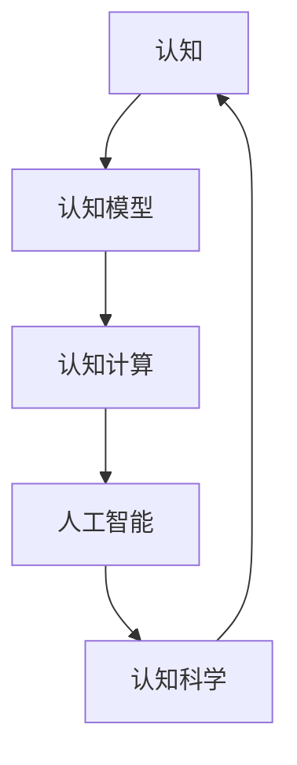

                 

# 认知的形式化：人工智能是人类智能的体外延伸

> 关键词：人工智能,认知形式化,认知模型,人工智能技术,认知科学

## 1. 背景介绍

### 1.1 问题由来

人工智能（Artificial Intelligence, AI）自诞生以来，始终围绕着模拟人类智能这一目标不断演进。然而，人类智能是复杂且多层次的，其认知能力远远超越了目前机器的计算能力。因此，如何通过形式化认知模型将人类智能的某些方面形式化，使其能够被机器理解和模拟，成为当前人工智能研究的核心问题。

在过去几十年中，人工智能领域发展出众多理论和方法，力图将复杂的认知过程形式化，并通过计算模型来模拟。这些方法包括符号主义、连接主义、行为主义等，每种模型都试图从不同角度捕捉人类智能的某些特征。尽管如此，这些方法在形式化复杂认知过程时都面临着难以克服的挑战。

随着认知科学、神经科学、计算理论等交叉学科的发展，新一代认知模型开始出现，通过综合运用不同理论和方法，更加逼真地模拟人类认知过程。本文将深入探讨认知的形式化，尤其是利用人工智能技术模拟人类认知的最新进展，以及其对未来科技发展的潜在影响。

### 1.2 问题核心关键点

在研究认知的形式化过程中，需要重点关注以下几个核心关键点：

- **认知的形式化**：如何将人类智能的认知过程转化为计算模型，并使用计算机能够理解的语言来描述。
- **认知模型构建**：如何设计计算模型，使其能够捕捉人类认知的关键特征，如感知、记忆、推理、情感等。
- **认知与人工智能的结合**：如何将认知模型与人工智能技术结合，提升机器的认知能力，实现智能系统的自动化和智能化。
- **认知科学基础**：认知模型的设计需要以认知科学的研究成果为基础，借鉴神经科学、心理学等学科的知识。
- **计算复杂性**：认知模型的计算复杂度，以及如何在保持模型简洁性的同时，实现足够的认知能力。

## 2. 核心概念与联系

### 2.1 核心概念概述

在进行认知形式化研究时，以下几个关键概念需要充分理解：

- **认知（Cognition）**：指人类对信息进行感知、记忆、推理、决策等心理过程。
- **人工智能（AI）**：指通过计算机程序实现智能行为的技术，包括感知、推理、学习、决策等。
- **认知模型（Cognitive Model）**：指用于模拟人类认知过程的计算模型，如神经网络、符号逻辑、贝叶斯网络等。
- **认知计算（Cognitive Computing）**：指使用认知模型和人工智能技术，实现认知过程的计算化。
- **认知科学（Cognitive Science）**：研究人类认知过程及其机制的跨学科领域，包括心理学、神经科学、计算机科学等。

这些概念之间的关系可以通过以下Mermaid流程图来展示：



这个流程图展示了一系列关键概念之间的联系：

- 认知是人类智能的核心，可以通过计算模型进行形式化。
- 认知模型是用于模拟认知过程的计算工具。
- 认知计算是利用认知模型实现认知过程计算化的过程。
- 人工智能是实现认知计算的关键技术手段。
- 认知科学为认知模型的设计提供了理论基础。

## 3. 核心算法原理 & 具体操作步骤

### 3.1 算法原理概述

认知的形式化涉及将人类认知过程转化为计算模型，并使用计算机能够理解的语言来描述。这一过程通常包括以下步骤：

1. **认知过程识别**：识别出人类认知过程中的关键组件，如感知、记忆、推理等。
2. **模型选择**：选择合适的计算模型，如神经网络、符号逻辑等，用于模拟这些认知过程。
3. **模型训练**：使用标注数据训练模型，使其能够捕捉认知过程的规律。
4. **模型评估**：通过评估指标（如准确率、召回率、推理能力等）评估模型的性能。
5. **模型应用**：将训练好的模型应用于实际任务，提升智能系统的认知能力。

### 3.2 算法步骤详解

以下将详细讲解认知形式化的主要步骤：

**Step 1: 认知过程识别**

首先需要明确人类认知过程中包含哪些关键组件，以及这些组件如何相互作用。例如，认知过程可能包括：

- **感知**：人类通过感官获取外部信息，如视觉、听觉等。
- **记忆**：人类通过神经系统存储和检索信息，如短期记忆、长期记忆等。
- **推理**：人类通过逻辑思维推导新信息，如因果推理、类比推理等。
- **决策**：人类基于推理结果做出选择，如基于规则的决策、优化决策等。

这些组件可以进一步细分，例如，视觉感知可以包括特征提取、物体识别等。通过这样的细分，可以更全面地理解认知过程。

**Step 2: 模型选择**

选择合适的计算模型是认知形式化的关键。目前常用的计算模型包括：

- **符号逻辑**：通过符号操作模拟人类的逻辑推理。
- **神经网络**：通过神经元之间的连接模拟人类的感知和记忆。
- **贝叶斯网络**：通过概率图模型模拟人类对不确定性的推理。
- **规划算法**：通过搜索和优化模拟人类制定决策的过程。

模型选择需要考虑模型的计算复杂度、可解释性、通用性等因素。

**Step 3: 模型训练**

选择合适的计算模型后，需要对其进行训练。训练通常包括以下步骤：

- **数据准备**：收集标注数据，确保数据的多样性和代表性。
- **模型初始化**：将模型初始化为随机状态，或使用预训练模型作为起点。
- **模型训练**：使用标注数据训练模型，通过优化算法调整模型参数。
- **模型验证**：在验证集上评估模型性能，避免过拟合。

常见的优化算法包括梯度下降、随机梯度下降、Adam等。

**Step 4: 模型评估**

模型训练完成后，需要对模型进行评估。评估通常包括以下步骤：

- **指标选择**：选择适合评估指标，如准确率、召回率、F1-score等。
- **数据划分**：将数据划分为训练集、验证集、测试集。
- **模型测试**：在测试集上评估模型性能，判断模型是否达到预期效果。

**Step 5: 模型应用**

训练好的模型可以应用于实际任务。例如，可以将视觉感知模型用于图像识别，将推理模型用于自然语言处理，将决策模型用于自动规划等。

### 3.3 算法优缺点

认知形式化的主要优点包括：

- **可解释性**：认知模型可以提供模型决策的详细解释，帮助理解智能系统的行为。
- **可重用性**：经过训练的认知模型可以应用于多个相似任务，提高开发效率。
- **适应性**：认知模型可以适应不同的数据分布和任务需求。

然而，认知形式化也存在一些缺点：

- **计算复杂度**：复杂认知过程的计算复杂度较高，需要大量计算资源。
- **模型复杂性**：复杂的认知模型难以理解和调试，需要专业知识。
- **数据依赖性**：模型的性能高度依赖于数据的质量和数量，数据获取成本较高。

### 3.4 算法应用领域

认知形式化在多个领域中有着广泛的应用，包括：

- **自然语言处理（NLP）**：利用认知模型实现自然语言理解和生成，如机器翻译、文本摘要等。
- **计算机视觉（CV）**：利用认知模型实现图像识别、目标检测等。
- **机器人学**：利用认知模型实现机器人感知和决策，提升机器人智能化水平。
- **自动驾驶**：利用认知模型实现环境感知和路径规划，提升自动驾驶系统的安全性。
- **医疗诊断**：利用认知模型实现医学影像分析和病理学诊断，提高诊断准确率。

## 4. 数学模型和公式 & 详细讲解 & 举例说明

### 4.1 数学模型构建

本节将使用数学语言对认知形式化的过程进行更加严格的刻画。

记认知模型为 $M$，其输入为 $x$，输出为 $y$。认知过程可以用数学函数 $f$ 描述，即 $y = f(x)$。对于认知模型的训练，可以定义经验风险最小化问题：

$$
\min_{M} \frac{1}{N} \sum_{i=1}^N \ell(M(x_i), y_i)
$$

其中 $N$ 为样本数，$\ell$ 为损失函数，衡量模型预测输出与真实标签之间的差异。

### 4.2 公式推导过程

以下我们以神经网络为例，推导其训练过程和常见损失函数的推导。

假设神经网络包含 $n$ 个神经元，每个神经元 $i$ 的输入为 $z_i = \sum_{j=1}^m w_{ij} x_j + b_i$，激活函数为 $a_i = \sigma(z_i)$。对于二分类任务，常见的损失函数包括交叉熵损失函数：

$$
\ell(y, \hat{y}) = -y \log \hat{y} - (1-y) \log (1-\hat{y})
$$

将其代入经验风险公式，得：

$$
\mathcal{L}(M) = -\frac{1}{N} \sum_{i=1}^N \ell(M(x_i), y_i)
$$

其中 $M(x_i)$ 为神经网络对输入 $x_i$ 的输出，$\hat{y}$ 为模型预测输出。

神经网络的训练目标是最小化经验风险，即：

$$
\min_{M} \mathcal{L}(M)
$$

使用梯度下降等优化算法，对损失函数求导，更新模型参数 $w, b$，得到模型更新公式：

$$
w \leftarrow w - \eta \nabla_{w}\mathcal{L}(w)
$$

其中 $\eta$ 为学习率，$\nabla_{w}\mathcal{L}(w)$ 为损失函数对参数 $w$ 的梯度。

### 4.3 案例分析与讲解

以自然语言处理中的机器翻译为例，说明认知形式化的具体应用。

假设输入为英文句子 $x$，输出为目标语言句子 $y$，模型 $M$ 将 $x$ 转换为 $y$。通过选择适当的神经网络结构和参数，可以训练出有效的翻译模型。例如，使用 seq2seq 模型，结合注意力机制，可以显著提高翻译质量。

## 5. 项目实践：代码实例和详细解释说明

### 5.1 开发环境搭建

在进行认知形式化实践前，我们需要准备好开发环境。以下是使用Python进行TensorFlow开发的环境配置流程：

1. 安装Anaconda：从官网下载并安装Anaconda，用于创建独立的Python环境。

2. 创建并激活虚拟环境：
```bash
conda create -n tf-env python=3.8 
conda activate tf-env
```

3. 安装TensorFlow：根据CUDA版本，从官网获取对应的安装命令。例如：
```bash
pip install tensorflow
```

4. 安装Keras和TensorFlow官方API：
```bash
pip install keras tensorflow
```

5. 安装各类工具包：
```bash
pip install numpy pandas scikit-learn matplotlib tqdm jupyter notebook ipython
```

完成上述步骤后，即可在`tf-env`环境中开始认知形式化的实践。

### 5.2 源代码详细实现

下面我们以认知模型在机器翻译中的应用为例，给出使用TensorFlow进行神经网络模型训练的PyTorch代码实现。

首先，定义神经网络的结构：

```python
from tensorflow.keras.models import Sequential
from tensorflow.keras.layers import Embedding, LSTM, Dense

# 定义神经网络模型
model = Sequential()
model.add(Embedding(input_dim=vocab_size, output_dim=embedding_dim, input_length=max_length))
model.add(LSTM(units=hidden_units))
model.add(Dense(units=output_dim, activation='softmax'))
```

然后，准备训练数据和标签：

```python
# 准备训练数据和标签
train_data = ...
train_labels = ...
```

接着，定义训练函数：

```python
from tensorflow.keras.optimizers import RMSprop
from tensorflow.keras.metrics import Accuracy

# 定义优化器和评估指标
optimizer = RMSprop(lr=0.001)
metrics = [Accuracy()]

# 定义训练函数
def train_epoch(model, data, labels, batch_size, optimizer, metrics):
    for i in range(epochs):
        for j in range(0, len(data), batch_size):
            x_batch = data[j:j+batch_size]
            y_batch = labels[j:j+batch_size]
            model.compile(optimizer=optimizer, loss='categorical_crossentropy', metrics=metrics)
            model.fit(x_batch, y_batch, epochs=1, batch_size=batch_size)
```

最后，启动训练流程并在测试集上评估：

```python
# 训练神经网络模型
train_epoch(model, train_data, train_labels, batch_size, optimizer, metrics)

# 在测试集上评估模型性能
test_data = ...
test_labels = ...
test_loss, test_acc = model.evaluate(test_data, test_labels, verbose=0)
print('Test loss:', test_loss)
print('Test accuracy:', test_acc)
```

以上就是使用TensorFlow进行神经网络模型训练的完整代码实现。可以看到，TensorFlow提供了丰富的API和工具，可以方便地构建和训练复杂的神经网络模型。

### 5.3 代码解读与分析

让我们再详细解读一下关键代码的实现细节：

**Sequential模型**：
- 定义一个包含嵌入层、LSTM层和输出层的神经网络结构。

**Embedding层**：
- 将输入的单词向量映射为高维空间中的向量，以便神经网络能够更好地学习。

**LSTM层**：
- 使用LSTM层处理序列数据，通过记忆细胞捕捉输入序列中的长期依赖关系。

**Dense层**：
- 输出层采用softmax激活函数，用于多分类任务。

**优化器（RMSprop）**：
- 使用RMSprop优化器，调整模型参数，最小化损失函数。

**评估指标（Accuracy）**：
- 使用Accuracy作为模型的评估指标，衡量模型的准确率。

**训练函数（train_epoch）**：
- 在每个epoch内，将训练数据划分为若干批次进行迭代训练。
- 使用fit方法进行模型训练，记录训练过程中的损失和准确率。
- 在每个epoch结束后，输出训练和测试过程中的性能指标。

可以看到，TensorFlow提供了完善的API和工具，使得神经网络模型的训练和评估变得相对简单和高效。开发者可以将更多精力放在模型架构设计、数据处理等高层逻辑上，而不必过多关注底层的实现细节。

当然，工业级的系统实现还需考虑更多因素，如模型的保存和部署、超参数的自动搜索、更灵活的任务适配层等。但核心的认知形式化训练流程基本与此类似。

## 6. 实际应用场景

### 6.1 智能客服系统

基于认知形式化的智能客服系统，可以更准确地理解用户意图，提供更个性化的服务。通过认知模型对自然语言进行理解和分析，智能客服系统能够自动回答用户咨询，提供解决方案，从而提升用户体验和满意度。

在技术实现上，可以构建基于深度学习模型的认知模型，使用语言模型（如LSTM、Transformer等）对用户输入的自然语言进行编码，提取关键信息，再通过分类器或推理器输出结果。例如，使用序列标注模型（如CRF）进行意图识别，使用生成模型（如Seq2Seq）生成回复。

### 6.2 金融舆情监测

金融舆情监测系统利用认知形式化技术，实时监测市场舆情变化，预警潜在的金融风险。通过认知模型对新闻、报道、评论等文本数据进行情感分析，识别出市场情绪的正面、中性或负面倾向，从而及时采取应对措施。

在技术实现上，可以构建情感分析模型，使用卷积神经网络（CNN）或循环神经网络（RNN）对文本进行情感标注，输出情感极性。例如，使用BERT等预训练模型进行情感分析，使用Attention机制捕捉关键情感信息。

### 6.3 个性化推荐系统

个性化推荐系统利用认知形式化技术，精准捕捉用户兴趣，提供定制化推荐内容。通过认知模型对用户行为数据（如浏览、点击、评分等）进行分析和建模，预测用户对不同物品的兴趣，从而生成个性化推荐列表。

在技术实现上，可以构建推荐模型，使用协同过滤、内容推荐等算法，结合用户的属性信息和行为数据，生成推荐结果。例如，使用深度学习模型（如DNN、RNN）对用户行为进行建模，结合知识图谱进行推荐优化。

### 6.4 未来应用展望

随着认知形式化技术的不断发展，其在多个领域的应用前景广阔，未来将可能带来以下突破：

- **多模态融合**：结合视觉、听觉、触觉等多模态数据，提升认知模型的感知能力。
- **跨领域迁移**：将认知模型应用于不同领域，如医疗、教育、物流等，提升跨领域迁移能力。
- **动态适应**：通过在线学习和增量学习，使认知模型能够动态适应数据分布的变化，保持持续进步。
- **高效推理**：优化模型结构，提高推理速度和效率，实现实时决策。
- **人机协同**：结合认知模型和人工干预，实现人机协同工作，提升系统的灵活性和可靠性。

## 7. 工具和资源推荐

### 7.1 学习资源推荐

为了帮助开发者系统掌握认知形式化的理论基础和实践技巧，这里推荐一些优质的学习资源：

1. 《深度学习》（Ian Goodfellow）：全面介绍了深度学习的理论基础和实践方法，包括认知形式化的经典案例。
2. 《认知计算》（Marco F. Battaglia）：系统介绍了认知计算的理论和方法，结合最新研究成果进行讲解。
3. 《神经网络与深度学习》（Michael Nielsen）：通俗易懂地介绍了神经网络和深度学习的原理，适合初学者入门。
4. 《人工智能：现代方法》（Russell & Norvig）：全面介绍人工智能的理论和方法，包括认知形式化的相关章节。
5. 《机器学习》（周志华）：系统讲解机器学习的基本概念和算法，适合深入理解认知形式化的数学原理。

通过对这些资源的学习实践，相信你一定能够快速掌握认知形式化的精髓，并用于解决实际的智能系统问题。

### 7.2 开发工具推荐

高效的开发离不开优秀的工具支持。以下是几款用于认知形式化开发的常用工具：

1. TensorFlow：基于Python的开源深度学习框架，提供丰富的API和工具，适合构建复杂模型。
2. PyTorch：基于Python的开源深度学习框架，灵活的计算图，适合快速迭代研究。
3. Keras：高级API封装，易于使用，适合快速原型设计和实验。
4. Jupyter Notebook：交互式开发环境，方便快速编写和调试代码。
5. TensorBoard：可视化工具，用于实时监测模型训练状态和性能。

合理利用这些工具，可以显著提升认知形式化任务的开发效率，加快创新迭代的步伐。

### 7.3 相关论文推荐

认知形式化在认知科学和人工智能领域的研究论文众多，以下是几篇具有代表性的论文，推荐阅读：

1. 《深度学习：认知功能建模的新范式》（Deep Learning: A New Paradigm for Cognitive Function Modeling）：介绍了深度学习在认知建模中的应用，提出了基于深度学习的认知模型。
2. 《基于深度学习的认知模型：理论、算法与实现》（Deep Learning for Cognitive Models: Theory, Algorithms, and Implementations）：系统介绍了深度学习在认知建模中的应用，包括模型的构建、训练和评估。
3. 《认知计算：理论、方法与应用》（Cognitive Computing: Theory, Methods and Applications）：系统介绍了认知计算的理论和方法，包括认知模型的设计与应用。
4. 《认知计算：一种新的计算范式》（Cognitive Computing: A New Paradigm of Computation）：提出了认知计算的概念，讨论了其理论基础和应用前景。
5. 《认知计算与认知科学》（Cognitive Computing and Cognitive Science）：探讨了认知计算与认知科学的结合，提出了认知计算的新方法。

这些论文代表了认知形式化研究的前沿成果，通过学习这些前沿成果，可以帮助研究者把握学科前进方向，激发更多的创新灵感。

## 8. 总结：未来发展趋势与挑战

### 8.1 总结

本文对认知形式化的过程进行了全面系统的介绍。首先阐述了认知形式化的研究背景和意义，明确了认知形式化在模拟人类认知过程中的独特价值。其次，从原理到实践，详细讲解了认知形式化的数学原理和关键步骤，给出了认知形式化任务开发的完整代码实例。同时，本文还广泛探讨了认知形式化技术在智能客服、金融舆情、个性化推荐等多个领域的应用前景，展示了认知形式化技术的巨大潜力。此外，本文精选了认知形式化的各类学习资源，力求为读者提供全方位的技术指引。

通过本文的系统梳理，可以看到，认知形式化技术正在成为认知科学和人工智能研究的重要范式，极大地拓展了认知建模和智能系统的应用边界，催生了更多的落地场景。受益于认知科学和神经科学的深入研究，认知形式化模型在精度和解释性方面取得了长足进步，为认知计算的实际应用提供了坚实基础。未来，伴随认知形式化技术的进一步发展和普及，智能系统将具备更强的认知能力，人工智能技术将在更广阔的领域带来深刻变革。

### 8.2 未来发展趋势

展望未来，认知形式化技术将呈现以下几个发展趋势：

- **多模态认知融合**：结合视觉、听觉、触觉等多模态数据，提升认知模型的感知能力。
- **跨领域迁移能力**：通过迁移学习，使认知模型具备更强的跨领域适应能力。
- **实时动态适应**：通过在线学习和增量学习，使认知模型能够动态适应数据分布的变化，保持持续进步。
- **高效推理和决策**：优化模型结构，提高推理速度和效率，实现实时决策。
- **人机协同工作**：结合认知模型和人工干预，实现人机协同工作，提升系统的灵活性和可靠性。

以上趋势凸显了认知形式化技术的广阔前景。这些方向的探索发展，必将进一步提升智能系统的认知能力，为构建智能决策支持系统和智能交互系统铺平道路。相信随着认知科学和人工智能技术的不断进步，认知形式化技术将在构建智能决策支持系统和智能交互系统中发挥越来越重要的作用。

### 8.3 面临的挑战

尽管认知形式化技术已经取得了显著进展，但在迈向更加智能化、普适化应用的过程中，它仍面临诸多挑战：

- **计算复杂度**：复杂认知过程的计算复杂度较高，需要大量计算资源。如何优化模型结构，提高计算效率，是一个重要的研究方向。
- **数据依赖性**：模型的性能高度依赖于数据的质量和数量，数据获取成本较高。如何通过迁移学习、主动学习等方法，减少对数据的依赖，是一个需要解决的问题。
- **模型可解释性**：复杂的认知模型难以理解和调试，需要专业知识。如何提高模型的可解释性，增强用户对系统的信任和接受度，是一个重要的研究方向。
- **跨领域应用**：认知模型在不同领域的应用效果差异较大，如何设计通用的认知模型，提升跨领域适用性，是一个需要解决的问题。
- **伦理与安全**：认知模型可能存在偏见和歧视，如何构建公平、安全的认知模型，是一个需要解决的问题。

正视认知形式化面临的这些挑战，积极应对并寻求突破，将是大规模认知建模技术走向成熟的必由之路。相信随着学界和产业界的共同努力，这些挑战终将一一被克服，认知形式化技术必将在构建智能决策支持系统和智能交互系统中扮演越来越重要的角色。

### 8.4 研究展望

面对认知形式化面临的挑战，未来的研究需要在以下几个方面寻求新的突破：

- **模型简化与优化**：探索更加简洁、高效的模型结构，提高计算效率和推理速度。
- **迁移学习与自监督学习**：开发更加通用的认知模型，通过迁移学习和自监督学习，减少对标注数据的依赖。
- **模型解释与可视化**：开发可解释的认知模型，通过可视化工具，增强模型的透明度和可理解性。
- **多模态认知融合**：探索多模态数据融合的认知模型，提高模型的感知能力和鲁棒性。
- **跨领域应用**：设计通用的认知模型，提升跨领域适应能力，推动认知建模技术在更广泛领域的应用。

这些研究方向的探索，必将引领认知形式化技术迈向更高的台阶，为构建智能决策支持系统和智能交互系统提供坚实的基础。面向未来，认知形式化技术还需要与其他人工智能技术进行更深入的融合，如知识表示、因果推理、强化学习等，多路径协同发力，共同推动认知科学和人工智能技术的进步。

## 9. 附录：常见问题与解答

**Q1：认知形式化是否只适用于神经网络模型？**

A: 认知形式化不仅限于神经网络模型。除了神经网络，还有符号逻辑模型、贝叶斯网络等，都可以用于模拟人类认知过程。不同的模型有着各自的优缺点，需要根据具体任务选择合适的方法。

**Q2：认知形式化在实际应用中是否需要大量的标注数据？**

A: 认知形式化的性能高度依赖于数据的质量和数量。然而，通过迁移学习、主动学习等方法，可以显著减少对标注数据的依赖。例如，通过迁移学习，使用大规模预训练模型作为初始化参数，可以减少标注数据需求。

**Q3：认知形式化是否需要深入理解认知科学的基础理论？**

A: 认知形式化需要一定的认知科学基础理论，但并不需要全面掌握。通过学习相关课程、阅读经典论文，可以了解认知过程的基本原理，结合实际任务进行认知模型的设计和优化。

**Q4：如何构建认知形式化的智能系统？**

A: 构建认知形式化的智能系统需要经过以下几个步骤：
1. 确定任务需求和认知组件。
2. 选择合适的计算模型，设计模型结构。
3. 收集和标注数据，进行模型训练。
4. 评估模型性能，优化模型参数。
5. 将训练好的模型应用于实际任务，进行实时推理和决策。

**Q5：认知形式化是否适合解决所有智能系统问题？**

A: 认知形式化可以应用于很多智能系统问题，但并不是所有问题都适合使用认知形式化方法。例如，对于一些需要高实时性的任务，认知形式化可能不适用。需要根据具体任务需求选择合适的方法。

总之，认知形式化技术正在成为认知科学和人工智能研究的重要范式，其发展前景广阔。通过不断探索和创新，认知形式化技术必将在构建智能决策支持系统和智能交互系统中发挥越来越重要的作用。

