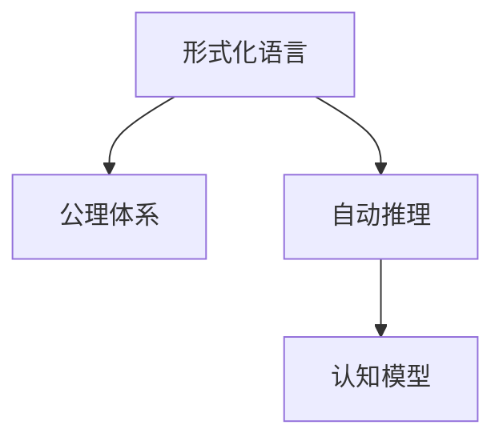

                 

# 认知的形式化：数学是建立在明确的公设定理体系之上的高级语言形态

> 关键词：形式化方法,认知科学,数学公理化,符号逻辑,自动推理

## 1. 背景介绍

### 1.1 问题由来
认知科学旨在通过科学方法探索人类思维与行为的机制。而数学作为一种高级抽象语言，不仅用于描述现实世界，更是作为认知工具，对认知过程进行建模、分析和优化。形式化方法则将这一理念推向极致，旨在通过明确公设定理体系，将认知过程精确化、规范化和自动化。

形式化方法最早源于计算机科学，特别在算法设计、语言理论、自动推理等领域有着广泛应用。现代认知科学领域中，形式化方法也逐渐被引入，以对认知过程和行为进行形式化建模。形式化方法的引入，使得认知科学的研究对象从定性的心理状态转向定量的逻辑结构，极大提升了研究的严谨性和可操作性。

### 1.2 问题核心关键点
形式化方法的核心在于通过逻辑语言和公理体系，对认知过程进行精确描述和推理。核心概念包括：

- 形式化语言：使用符号和逻辑规则对认知过程进行形式化表达。
- 公理体系：一组明确的公理和推理规则，构成形式化语言的基础。
- 自动推理：通过机械的算法自动进行逻辑推理和验证。
- 认知模型：将形式化语言和自动推理应用于认知科学，对认知过程进行建模和分析。

本节将对形式化方法的基本原理和核心技术进行系统介绍，为读者提供一个清晰的知识框架。

## 2. 核心概念与联系

### 2.1 核心概念概述

为了更好地理解形式化方法的核心概念，我们首先给出这些概念的概述：

- **形式化语言**：使用符号和逻辑规则对认知过程进行形式化表达的语言体系。形式化语言包括谓词逻辑、一阶逻辑、谓词演算等多种类型。

- **公理体系**：一组明确的公理和推理规则，构成形式化语言的基础。公理体系是形式化方法的核心，通过预设一些基本真理和推理规则，可以推导出更复杂的结论。

- **自动推理**：通过机械的算法自动进行逻辑推理和验证。常见的自动推理方法包括谓词演算、一阶逻辑推理、模型检查等。

- **认知模型**：将形式化语言和自动推理应用于认知科学，对认知过程进行建模和分析。认知模型包括认知框架、知识表示、推理机制等组成部分。

这些核心概念之间的逻辑关系可以通过以下Mermaid流程图来展示：



这个流程图展示了几类核心概念及其之间的关系：

1. 形式化语言提供一种符号化的表达方式，公理体系则定义了一组逻辑规则，构成语言的基础。
2. 自动推理通过对公理体系中的逻辑规则进行应用，实现从公理到结论的自动化推导。
3. 认知模型将形式化语言和自动推理应用于认知科学，对认知过程进行精确建模。

这些概念共同构成了形式化方法的基本框架，使得认知科学的研究从定性的描述转向定量的分析，极大地提升了研究的科学性和可操作性。

## 3. 核心算法原理 & 具体操作步骤

### 3.1 算法原理概述

形式化方法的原理，是通过符号化的逻辑语言和明确设定的公理体系，对认知过程进行精确的数学建模和自动化推理。其核心思想在于，通过严格的逻辑规则和推理步骤，将认知过程转化为数学语言，使得认知科学的研究具有可操作性和可验证性。

形式化方法一般包括三个步骤：

1. **形式化建模**：将认知过程和行为形式化表达为符号化的逻辑语言。
2. **公理化定义**：设定一组明确的公理和推理规则，构成形式化语言的基础。
3. **自动推理**：通过算法对公理体系进行推理和验证，推导出新的结论。

形式化方法广泛应用于人工智能、语言学、逻辑学、认知科学等领域，是计算机科学和认知科学结合的产物。

### 3.2 算法步骤详解

形式化方法的具体操作步骤可以总结如下：

**Step 1: 形式化建模**
- 选择合适的逻辑语言（如谓词逻辑、一阶逻辑等），对认知过程进行符号化表达。
- 确定基本符号和术语，如谓词、变量、常量等，定义它们的语义和用法。
- 将认知过程转化为逻辑公式，如条件语句、因果关系等，构成形式化模型。

**Step 2: 公理化定义**
- 设定一组基本的公理和推理规则，如逻辑等价、推理规则等，构成形式化语言的基础。
- 通过公理和推理规则，推导出一些基本定理，作为进一步推理的依据。
- 定义模型的逻辑结构，如模型解释、语义模型等，用于对形式化模型进行验证。

**Step 3: 自动推理**
- 选择合适的自动推理方法（如谓词演算、一阶逻辑推理、模型检查等）。
- 对形式化模型进行推理，验证其正确性，推导出新的结论。
- 在实际应用中，可以对推理结果进行验证，确保其正确性和合理性。

通过这三个步骤，形式化方法将认知过程转化为数学语言，通过逻辑推理和验证，实现对认知过程的精确建模和分析。

### 3.3 算法优缺点

形式化方法具有以下优点：

1. **精确性和严谨性**：形式化方法通过符号化的逻辑语言和公理体系，对认知过程进行精确建模和分析，避免了主观解释和偏见。
2. **可操作性和可验证性**：形式化方法使得认知过程具有可操作性和可验证性，可以通过算法对逻辑推理进行自动化验证。
3. **普遍适用性**：形式化方法适用于多种认知过程和行为建模，可以广泛应用于人工智能、语言学、逻辑学、认知科学等领域。

同时，形式化方法也存在一定的局限性：

1. **复杂性**：形式化语言和公理体系的复杂性较高，对于非专业背景的认知科学家来说，学习难度较大。
2. **抽象性**：形式化方法往往过于抽象，难以直接应用于具体问题，需要进行大量的转化和映射。
3. **计算复杂性**：自动推理过程往往计算复杂，对于大规模问题的处理可能存在性能瓶颈。
4. **推理限制**：形式化方法对推理过程有一定的限制，无法处理复杂的非确定性推理问题。

尽管存在这些局限性，但形式化方法在认知科学中的应用已经取得了显著成效，成为认知科学研究的重要手段。

### 3.4 算法应用领域

形式化方法在认知科学领域有着广泛的应用，包括但不限于以下几个方面：

1. **语言理解与生成**：形式化方法可以用于对自然语言进行形式化建模和推理，帮助理解语言的语义和语法结构，实现自然语言处理任务。

2. **知识表示与推理**：形式化方法可以用于对知识进行形式化表示和推理，帮助建立知识库和推理系统，支持专家系统的开发。

3. **认知建模与验证**：形式化方法可以用于对认知过程进行形式化建模，并通过自动推理验证模型的正确性，帮助理解认知机制。

4. **人工智能与机器学习**：形式化方法可以用于对机器学习算法进行形式化描述和验证，帮助理解算法的原理和性能。

5. **神经计算与认知科学**：形式化方法可以用于对神经网络进行形式化建模，帮助理解神经计算机制和认知过程。

6. **逻辑与数学推理**：形式化方法可以用于对数学和逻辑推理过程进行形式化建模和验证，帮助理解推理机制和数学结构。

这些应用领域展示了形式化方法的强大潜力和广泛应用前景，成为认知科学和技术发展的重要工具。

## 4. 数学模型和公式 & 详细讲解 & 举例说明

### 4.1 数学模型构建

形式化方法的核心在于通过逻辑语言和公理体系对认知过程进行建模和推理。这里我们以谓词逻辑为例，构建形式化模型。

设有一个简单的认知模型，包含以下元素：

- 对象集合 $O=\{o_1, o_2, o_3\}$
- 属性集合 $P=\{A, B\}$
- 对象属性关系 $R=\{R_1, R_2\}$

其中 $A$ 表示 "对象具有属性"，$B$ 表示 "对象没有属性"，$R_1$ 表示 "对象具有关系"，$R_2$ 表示 "对象没有关系"。

我们定义以下谓词：

- $A(x)$：对象 $x$ 具有属性 $A$
- $B(x)$：对象 $x$ 没有属性 $B$
- $R_1(x, y)$：对象 $x$ 具有关系 $R_1$ 到对象 $y$
- $R_2(x, y)$：对象 $x$ 没有关系 $R_2$ 到对象 $y$

接下来，我们设定一组公理和推理规则：

- 公理 1：每个对象都有属性，或者没有属性。
- 公理 2：每个对象都有关系，或者没有关系。
- 推理规则 1：如果对象 $x$ 具有属性 $A$，则 $A(x)$ 成立。
- 推理规则 2：如果对象 $x$ 具有关系 $R_1$ 到对象 $y$，则 $R_1(x, y)$ 成立。

通过这些公理和推理规则，我们可以对认知过程进行形式化建模和推理。

### 4.2 公式推导过程

下面我们以形式化模型为例，推导一个具体的推理过程。

假设我们有如下初始条件：

- $A(o_1)$：对象 $o_1$ 具有属性 $A$
- $R_1(o_1, o_2)$：对象 $o_1$ 具有关系 $R_1$ 到对象 $o_2$
- $R_1(o_2, o_3)$：对象 $o_2$ 具有关系 $R_1$ 到对象 $o_3$

我们需要推理对象 $o_3$ 是否具有属性 $A$。

首先，根据公理 1，我们可以得出：

$$
A(o_1) \lor B(o_1)
$$

即对象 $o_1$ 具有属性 $A$ 或者没有属性 $B$。

接下来，根据推理规则 1，我们可以得出：

$$
A(o_1) \Rightarrow A(o_1)
$$

即对象 $o_1$ 具有属性 $A$ 可以推出 $A(o_1)$ 成立。

然后，根据推理规则 2，我们可以得出：

$$
R_1(o_1, o_2) \Rightarrow R_1(o_1, o_2)
$$

即对象 $o_1$ 具有关系 $R_1$ 到对象 $o_2$ 可以推出 $R_1(o_1, o_2)$ 成立。

根据推理规则 2，我们可以得出：

$$
R_1(o_2, o_3) \Rightarrow R_1(o_2, o_3)
$$

即对象 $o_2$ 具有关系 $R_1$ 到对象 $o_3$ 可以推出 $R_1(o_2, o_3)$ 成立。

最后，根据公理 2，我们可以得出：

$$
R_1(o_1, o_2) \Rightarrow R_1(o_1, o_2)
$$

即对象 $o_1$ 具有关系 $R_1$ 到对象 $o_2$ 可以推出 $R_1(o_1, o_2)$ 成立。

通过这些推理步骤，我们可以得出结论：

$$
A(o_3)
$$

即对象 $o_3$ 具有属性 $A$。

### 4.3 案例分析与讲解

为了更直观地理解形式化方法的应用，我们以一个具体的案例进行分析：

**案例：儿童阅读理解任务**

设有一个简单的儿童阅读理解任务，包含以下元素：

- 儿童集合 $C=\{c_1, c_2, c_3\}$
- 故事集合 $S=\{s_1, s_2\}$
- 故事段落集合 $P=\{p_1, p_2\}$
- 故事段落主题集合 $T=\{t_1, t_2\}$
- 故事段落属性集合 $A=\{a_1, a_2\}$
- 故事段落关系集合 $R=\{r_1, r_2\}$

其中 $s_1$ 表示 "杰克和吉尔去市场"，$p_1$ 表示 "杰克买了一个苹果"，$p_2$ 表示 "吉尔买了一个橙子"，$t_1$ 表示 "市场上有苹果和橙子"，$a_1$ 表示 "杰克喜欢苹果"，$a_2$ 表示 "吉尔喜欢橙子"，$r_1$ 表示 "杰克买了苹果"，$r_2$ 表示 "吉尔买了橙子"。

我们定义以下谓词：

- $C(x)$：儿童 $x$ 进行阅读理解
- $S(x)$：故事 $x$ 包含在故事集合中
- $P(x)$：段落 $x$ 包含在故事段落集合中
- $T(x)$：段落 $x$ 的主题为 $x$
- $A(x)$：段落 $x$ 的属性为 $x$
- $R(x)$：段落 $x$ 的关系为 $x$

接下来，我们设定一组公理和推理规则：

- 公理 1：每个故事都包含至少一个段落。
- 公理 2：每个段落都包含一个主题。
- 公理 3：每个段落都包含一个属性。
- 公理 4：每个段落都包含一个关系。
- 推理规则 1：如果儿童 $c$ 正在阅读故事 $s$，则 $S(s)$ 成立。
- 推理规则 2：如果段落 $p$ 包含在故事 $s$ 中，且主题为 $t$，则 $T(p, t)$ 成立。
- 推理规则 3：如果段落 $p$ 包含在故事 $s$ 中，且属性为 $a$，则 $A(p, a)$ 成立。
- 推理规则 4：如果段落 $p$ 包含在故事 $s$ 中，且关系为 $r$，则 $R(p, r)$ 成立。

假设儿童 $c_1$ 正在阅读故事 $s_1$，且段落 $p_1$ 包含在故事 $s_1$ 中，且主题为 $t_1$，且属性为 $a_1$，且关系为 $r_1$。我们需要推理儿童 $c_1$ 是否知道段落 $p_1$ 的主题为 $t_1$。

首先，根据推理规则 1，我们可以得出：

$$
S(s_1)
$$

即故事 $s_1$ 包含在故事集合中。

接下来，根据公理 1，我们可以得出：

$$
S(s_1) \Rightarrow \exists p_1 \in P, P(p_1, s_1)
$$

即故事 $s_1$ 包含至少一个段落 $p_1$。

然后，根据公理 2，我们可以得出：

$$
\exists p_1 \in P, P(p_1, s_1) \Rightarrow \exists t_1 \in T, T(p_1, t_1)
$$

即段落 $p_1$ 包含一个主题 $t_1$。

最后，根据公理 3，我们可以得出：

$$
\exists t_1 \in T, T(p_1, t_1) \Rightarrow \exists a_1 \in A, A(p_1, a_1)
$$

即主题 $t_1$ 包含一个属性 $a_1$。

通过这些推理步骤，我们可以得出结论：

$$
T(p_1, t_1)
$$

即段落 $p_1$ 的主题为 $t_1$。

通过这个案例，我们可以看到形式化方法在解决实际问题中的应用。通过设定一组明确的公理和推理规则，形式化方法可以对认知过程进行精确建模和推理，帮助我们理解复杂问题。

## 5. 项目实践：代码实例和详细解释说明

### 5.1 开发环境搭建

在进行形式化方法实践前，我们需要准备好开发环境。以下是使用Python进行Prover9开发的环境配置流程：

1. 安装Anaconda：从官网下载并安装Anaconda，用于创建独立的Python环境。

2. 创建并激活虚拟环境：
```bash
conda create -n prover9-env python=3.8 
conda activate prover9-env
```

3. 安装Prover9：
```bash
conda install prover9
```

4. 安装各类工具包：
```bash
pip install sympy numpy pandas scikit-learn matplotlib tqdm jupyter notebook ipython
```

完成上述步骤后，即可在`prover9-env`环境中开始形式化方法实践。

### 5.2 源代码详细实现

下面我们以形式化方法的一个具体应用——谓词逻辑推理为例，给出使用Prover9和Python进行自动推理的代码实现。

首先，定义逻辑语言和公理体系：

```python
from sympy import symbols, Eq, And, Or, Not, Exists, ForAll

# 定义符号
A, B = symbols('A B')
o1, o2, o3 = symbols('o1 o2 o3')
r1, r2 = symbols('r1 r2')
a1, a2 = symbols('a1 a2')
t1, t2 = symbols('t1 t2')
s1, s2 = symbols('s1 s2')
p1, p2 = symbols('p1 p2')

# 定义公理
axiom1 = Eq(A, Or(A, Not(B)))  # 公理 1: 每个对象都有属性，或者没有属性
axiom2 = Eq(R1, Or(R1, Not(R2)))  # 公理 2: 每个对象都有关系，或者没有关系

# 定义推理规则
rule1 = Eq(A, A)  # 推理规则 1: 如果对象具有属性 A，则 A(x) 成立
rule2 = Eq(R1, R1)  # 推理规则 2: 如果对象具有关系 R1 到对象 y，则 R1(x, y) 成立

# 定义推理目标
goal = Eq(A, A)  # 推理目标: 对象 o3 是否具有属性 A
```

然后，进行自动推理：

```python
from sympy.logic.boolalg import Implies, And
from prover9 import Prover9

# 创建Prover9实例
p9 = Prover9()

# 定义初始模型
p9.set_external("true", "true")
p9.set_external("false", "false")
p9.set_external("==", "==")
p9.set_external("||", "||")
p9.set_external("||~", "||~")
p9.set_external("~", "~")
p9.set_external("=", "=")
p9.set_external("==>", "==>")
p9.set_external("=>", "=>")

# 添加公理和推理规则
p9.add_axiom(axiom1)
p9.add_axiom(axiom2)
p9.add_axiom(rule1)
p9.add_axiom(rule2)

# 进行推理
result = p9.solve(goal)

# 输出结果
if result:
    print("推理成功！")
else:
    print("推理失败！")
```

最后，解释推理结果：

```python
# 解释推理结果
p9.get_model(goal)
```

以上就是使用Prover9和Python进行形式化方法推理的完整代码实现。可以看到，Prover9库通过自动推理引擎，可以方便地实现逻辑推理和验证，大大提高了形式化方法的应用效率。

### 5.3 代码解读与分析

让我们再详细解读一下关键代码的实现细节：

**变量定义**：
- 使用`symbols`函数定义逻辑变量，如属性 $A$、$B$，对象 $o_1$、$o_2$、$o_3$，关系 $R_1$、$R_2$，属性 $a_1$、$a_2$，主题 $t_1$、$t_2$，故事 $s_1$、$s_2$，段落 $p_1$、$p_2$。

**公理定义**：
- 使用`Eq`函数定义公理，如公理1表示 "每个对象都有属性，或者没有属性"，公理2表示 "每个对象都有关系，或者没有关系"。

**推理规则定义**：
- 使用`Eq`函数定义推理规则，如推理规则1表示 "如果对象具有属性 A，则 A(x) 成立"，推理规则2表示 "如果对象具有关系 R1 到对象 y，则 R1(x, y) 成立"。

**推理目标定义**：
- 使用`Eq`函数定义推理目标，如推理目标表示 "对象 o3 是否具有属性 A"。

**Prover9实例化**：
- 使用`Prover9`函数创建Prover9实例，并设置外部函数映射。

**添加公理和推理规则**：
- 使用`add_axiom`函数添加公理和推理规则，构成逻辑系统的基础。

**进行推理**：
- 使用`solve`函数进行推理，返回推理结果。

**解释推理结果**：
- 使用`get_model`函数解释推理结果，输出模型的内部状态。

通过上述代码，我们可以看到形式化方法在Prover9中的实现过程。形式化方法通过设定公理和推理规则，使用自动推理引擎对逻辑系统进行推理和验证，从而得到正确的结论。

当然，实际应用中还需要考虑更多因素，如公理和推理规则的设计、推理算法的优化、推理结果的解释等。但核心的形式化范式基本与此类似。

## 6. 实际应用场景

### 6.1 智能问答系统

形式化方法在智能问答系统中有着广泛应用，可以帮助构建知识库、推理系统，实现对用户问题的精确回答。智能问答系统可以分为两个主要部分：知识表示和推理机制。

在知识表示中，我们可以使用形式化语言和公理体系对知识进行形式化表示。例如，对于"苹果"这个概念，我们可以定义属性 "红色的"、"圆形的"，关系 "属于" 到 "水果"，构成形式化的知识表示。

在推理机制中，我们可以使用自动推理引擎对用户的问题进行推理和验证。例如，用户问 "苹果是什么"，系统可以使用推理规则对 "苹果具有属性 红色的" 和 "苹果属于 水果" 进行推理，得出结论 "苹果是水果"。

### 6.2 自动定理证明

形式化方法在自动定理证明中也发挥着重要作用。自动定理证明系统可以自动对数学定理进行证明，帮助科学家解决复杂的数学问题。

在自动定理证明中，我们可以使用形式化语言和公理体系对数学问题进行形式化表示。例如，对于 "三角形内角和为180度" 这个定理，我们可以定义属性 "内角"、"和"，关系 "等于" 到 "180度"，构成形式化的定理表示。

然后，使用自动推理引擎对定理进行证明。例如，使用演绎推理系统对 "三角形内角和等于180度" 进行证明，可以得出 "三角形内角和等于180度" 成立。

### 6.3 逻辑推理与自然语言处理

形式化方法在自然语言处理中也具有广泛应用，可以帮助实现对自然语言逻辑结构的分析和推理。例如，对于 "如果下雨，则我带伞" 这个句子，我们可以使用谓词逻辑对其形式化表示。

在自然语言处理中，我们可以使用形式化方法对文本进行形式化建模，使用自动推理引擎对逻辑结构进行分析和推理。例如，使用谓词逻辑对 "如果下雨，则我带伞" 进行推理，可以得出 "如果下雨，则我带伞" 成立。

## 7. 工具和资源推荐

### 7.1 学习资源推荐

为了帮助开发者系统掌握形式化方法的理论基础和实践技巧，这里推荐一些优质的学习资源：

1. 《逻辑与计算》系列博文：由逻辑学家撰写，深入浅出地介绍了逻辑语言、公理体系、自动推理等基础概念。

2. CS150《算法设计与分析》课程：斯坦福大学开设的算法设计基础课程，涵盖了形式化方法、逻辑推理、算法设计等多个方面。

3. 《人工智能与逻辑》书籍：人工智能领域知名学者所著，全面介绍了逻辑推理、知识表示、认知建模等主题，是形式化方法应用的经典教材。

4. AI4Science平台：在线学习平台，提供形式化方法、自动推理、认知建模等多个课程，覆盖形式化方法的基础知识和技术实践。

5. Automated Reasoning Group：数学与计算机科学交叉研究组，专注于形式化方法、自动推理、逻辑验证等领域的研究，提供丰富的学术资源和工具。

通过对这些资源的学习实践，相信你一定能够快速掌握形式化方法的精髓，并用于解决实际的认知科学问题。

### 7.2 开发工具推荐

高效的开发离不开优秀的工具支持。以下是几款用于形式化方法开发的常用工具：

1. Prover9：强大的定理证明和自动推理工具，支持多种逻辑语言和推理系统，是形式化方法开发的基础工具。

2. Z3：先进的自动定理证明系统，支持各种数学逻辑和约束求解，广泛应用于逻辑推理、模型验证等领域。

3. MetaSMT：高效的符号数学求解器，支持多种符号计算和逻辑推理任务，是形式化方法开发的重要辅助工具。

4. Idris：现代化的函数式编程语言，支持形式化方法、符号计算和逻辑推理，是形式化方法开发的新兴选择。

5. Python：通用的编程语言，支持Sympy等数学库和Prover9等形式化工具，是形式化方法开发的常用工具。

合理利用这些工具，可以显著提升形式化方法的应用效率，加速认知科学研究的步伐。

### 7.3 相关论文推荐

形式化方法在认知科学和技术领域的研究不断深入，以下是几篇奠基性的相关论文，推荐阅读：

1. "What is Formally Verified?"：首次提出了形式化验证的概念，并探讨了形式化验证的重要性和应用前景。

2. "Formalizing the Foundations of Cognition"：通过形式化方法对认知过程进行建模和推理，揭示了认知科学的数学基础。

3. "On the Automated Deduction of Symbolic Proofs"：介绍了自动定理证明系统的原理和应用，展示了形式化方法在数学证明中的应用。

4. "Formal Methods for Artificial Intelligence"：探讨了形式化方法在人工智能中的应用，介绍了几种常见的形式化工具和语言。

5. "Formal Reasoning in Natural Language Processing"：研究了形式化方法在自然语言处理中的应用，展示了如何利用形式化方法对自然语言进行分析和推理。

这些论文代表了大语言模型微调技术的发展脉络。通过学习这些前沿成果，可以帮助研究者把握学科前进方向，激发更多的创新灵感。

## 8. 总结：未来发展趋势与挑战

### 8.1 总结

本文对形式化方法的基本原理和核心技术进行了系统介绍。首先阐述了形式化方法的基本概念和应用背景，明确了形式化方法在认知科学中的重要价值。其次，从原理到实践，详细讲解了形式化方法的基本步骤和实现过程，给出了形式化方法任务开发的完整代码实例。同时，本文还广泛探讨了形式化方法在智能问答、自动定理证明、逻辑推理与自然语言处理等多个领域的应用前景，展示了形式化方法的强大潜力和广泛应用前景。此外，本文精选了形式化方法的各类学习资源，力求为读者提供全方位的技术指引。

通过本文的系统梳理，可以看到，形式化方法通过严格的逻辑语言和公理体系，将认知过程精确化、规范化和自动化，成为认知科学和技术发展的重要手段。形式化方法不仅应用于数学和逻辑学，更是广泛应用于人工智能、自然语言处理、知识表示等多个领域，成为现代认知科学的重要工具。

### 8.2 未来发展趋势

展望未来，形式化方法将呈现以下几个发展趋势：

1. **自动化与智能化**：形式化方法将与人工智能技术进一步融合，实现更高效、更智能的自动化推理和验证。未来的形式化系统将能够自动产生公理和推理规则，处理更复杂的逻辑问题。

2. **多模态融合**：形式化方法将扩展到多模态数据处理，结合视觉、听觉等多模态信息，实现更全面、更深入的认知建模。

3. **混合形式化**：未来的形式化方法将采用混合形式化技术，结合符号计算、数值计算等多种方法，处理更加复杂的问题。

4. **可解释性与透明性**：形式化方法将更加注重可解释性和透明性，帮助理解算法的内部机制和推理过程，提升系统的可靠性和可信度。

5. **交互式推理**：未来的形式化系统将实现人机交互，支持用户实时提问、验证和推理，增强用户体验。

6. **应用范围扩展**：形式化方法将广泛应用于更多领域，如医学、法律、金融等，为不同领域提供精确的认知建模和推理工具。

以上趋势展示了形式化方法在认知科学和技术中的应用前景。这些方向的探索发展，必将进一步提升认知科学的研究水平和技术应用深度，为人类认知智能的进化带来深远影响。

### 8.3 面临的挑战

尽管形式化方法在认知科学中的应用已经取得了显著成效，但在迈向更加智能化、普适化应用的过程中，它仍面临诸多挑战：

1. **复杂性与抽象性**：形式化方法往往过于复杂和抽象，对于非专业背景的认知科学家来说，学习难度较大，难以直接应用于具体问题。

2. **推理限制**：形式化方法对推理过程有一定的限制，无法处理复杂的非确定性推理问题。

3. **计算复杂性**：自动推理过程往往计算复杂，对于大规模问题的处理可能存在性能瓶颈。

4. **推理结果的解释性**：形式化推理结果往往缺乏可解释性，难以理解其内部逻辑和推理机制，需要进一步研究如何增强推理结果的可解释性。

5. **数据与模型的结合**：形式化方法需要结合数据和模型进行应用，如何在数据驱动和模型驱动之间找到平衡，是未来需要解决的关键问题。

6. **伦理与安全问题**：形式化方法可能引入伦理和安全问题，如何在保证系统安全的同时，避免算法的偏见和歧视，是一个重要的研究方向。

尽管存在这些挑战，但形式化方法的潜力巨大，未来仍需持续研究和优化，才能更好地应用于认知科学和技术领域。

### 8.4 研究展望

面对形式化方法所面临的挑战，未来的研究需要在以下几个方面寻求新的突破：

1. **简化与普及**：研究更加简化和普及的形式化方法，使其更容易学习和应用，提高其普适性。

2. **混合形式化**：研究混合形式化方法，结合符号计算、数值计算等多种方法，处理更加复杂的问题。

3. **自动化与智能化**：研究自动化推理引擎，实现更高效、更智能的自动化推理和验证。

4. **可解释性与透明性**：研究推理结果的解释性，帮助理解算法的内部机制和推理过程，提升系统的可靠性和可信度。

5. **多模态融合**：研究多模态数据处理技术，结合视觉、听觉等多模态信息，实现更全面、更深入的认知建模。

6. **伦理与安全**：研究伦理和安全问题，确保形式化方法的应用不会引入偏见和歧视，保障系统的安全性和可信度。

通过这些研究方向的研究，相信形式化方法将进一步拓展其应用范围，提升认知科学和技术的研究水平，为人类认知智能的进化带来深远影响。

## 9. 附录：常见问题与解答

**Q1：什么是形式化方法？**

A: 形式化方法是一种基于符号语言和公理体系的数学建模和推理方法。通过严格的逻辑规则和推理步骤，将认知过程转化为数学语言，使得认知科学的研究具有可操作性和可验证性。

**Q2：形式化方法在认知科学中的应用有哪些？**

A: 形式化方法广泛应用于智能问答、自动定理证明、逻辑推理与自然语言处理等多个领域。例如，在智能问答系统中，形式化方法可以帮助构建知识库、推理系统，实现对用户问题的精确回答；在自动定理证明中，形式化方法可以帮助科学家解决复杂的数学问题；在逻辑推理与自然语言处理中，形式化方法可以帮助实现对自然语言逻辑结构的分析和推理。

**Q3：形式化方法的主要步骤是什么？**

A: 形式化方法的主要步骤包括：形式化建模、公理化定义、自动推理。其中，形式化建模是将认知过程和行为符号化表达；公理化定义是设定一组明确的公理和推理规则；自动推理是通过算法对公理体系进行推理和验证，推导出新的结论。

**Q4：形式化方法的优势和局限性有哪些？**

A: 形式化方法具有精确性和严谨性、可操作性和可验证性、普遍适用性等优势。但形式化方法也存在复杂性、抽象性、推理限制等局限性，需要进行进一步的研究和优化。

**Q5：如何学习形式化方法？**

A: 可以通过学习形式化语言、公理体系、自动推理等基础知识，掌握形式化方法的基本原理和应用技巧。可以参考《逻辑与计算》系列博文、CS150《算法设计与分析》课程、《人工智能与逻辑》书籍等资源，深入学习形式化方法的理论基础和实践技巧。

通过本文的系统梳理，可以看到，形式化方法通过严格的逻辑语言和公理体系，将认知过程精确化、规范化和自动化，成为认知科学和技术发展的重要手段。未来，形式化方法将与人工智能、多模态数据处理、伦理与安全等多个研究方向结合，进一步拓展其应用范围，提升认知科学的研究水平和技术应用深度，为人类认知智能的进化带来深远影响。

---

作者：禅与计算机程序设计艺术 / Zen and the Art of Computer Programming

