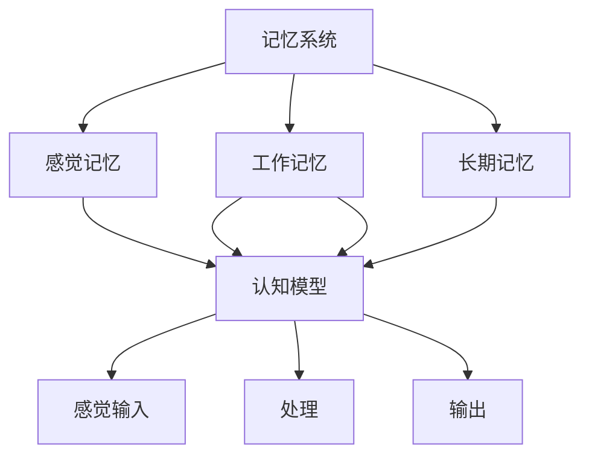

                 

# 认知的形式化：记忆让人类延续了过去和现在的认知

在探讨人工智能的认知建模时，记忆的概念不得不被重视。认知的延续性和泛化能力很大程度上取决于我们对过去和现在知识的积累。本文将从认知科学的角度出发，探讨记忆是如何让人类得以延续过去的认知，并实现对现在认知的微调。

## 1. 背景介绍

### 1.1 问题由来
认知科学的研究发现，人类的认知能力并非一成不变，而是通过不断地与外界互动，积累并调优自身的认知模型。这种模型的构建与优化，离不开记忆系统的支持。记忆不仅存储了过去的经验，还通过记忆的重现和重用，驱动了认知的进步。

人工智能的目标之一是构建类人的认知系统，让机器具备与人相似的记忆与学习能力。近年来，基于深度学习的认知模型已经取得了显著的进步，但其记忆机制仍与人类存在较大差异。本文将探讨如何形式化地构建人工记忆，使其能够有效支撑认知系统的延续与泛化。

### 1.2 问题核心关键点
本文将探讨的核心问题包括：
- 人类记忆机制的原理与结构。
- 如何通过形式化方法模拟人类记忆系统。
- 如何设计有效的机制，让机器具备记忆并利用这些记忆进行认知任务。

## 2. 核心概念与联系

### 2.1 核心概念概述

为了更好地理解人工智能中的记忆机制，本节将介绍几个关键概念：

- **记忆系统**：指存储和检索信息的机制，是认知科学的重要组成部分。记忆系统包括感觉记忆、工作记忆、长期记忆等不同类型。

- **形式化方法**：指将问题转化为数学或逻辑模型，并使用算法进行求解的过程。形式化方法在人工智能中主要用于构建和优化认知模型。

- **认知模型**：指模拟人类认知过程的计算模型。认知模型通常包含感觉输入、记忆存储、处理和输出等环节。

- **强化学习**：指通过与环境的交互，学习如何最大化累积奖励的机器学习方法。强化学习在认知模型中用于优化决策策略，以适应不同的任务场景。

- **迁移学习**：指将一个领域学习到的知识，迁移到另一个不同但相关的领域。迁移学习在认知模型中用于知识的重用，提升模型的泛化能力。

### 2.2 核心概念原理和架构的 Mermaid 流程图



此流程图展示了记忆系统与认知模型的关系：

- 感觉记忆：外界信息通过感官输入系统后，首先在感觉记忆中进行初步存储。
- 工作记忆：感觉记忆中的信息通过注意机制选择，进入工作记忆，用于短期的信息处理和决策。
- 长期记忆：部分重要信息通过工作记忆的复述和编码，进入长期记忆，长期存储并随时可调用。
- 认知模型：接受感觉输入后，通过记忆系统存储和检索信息，处理信息并通过输出系统进行表达。

## 3. 核心算法原理 & 具体操作步骤

### 3.1 算法原理概述

在人工智能中，记忆通常通过数据结构和算法实现。形式化的人工记忆系统需要具备以下几个关键特性：

- **存储能力**：能够有效存储和组织信息，支持信息的检索和更新。
- **检索能力**：能够在需要时快速、准确地检索存储的信息，支持认知任务的执行。
- **更新机制**：能够根据新信息不断更新记忆内容，保持记忆的适应性和准确性。
- **重用机制**：能够在不同的认知任务中重用记忆内容，提升模型的泛化能力。

### 3.2 算法步骤详解

下面详细介绍如何构建形式化的人工记忆系统：

**Step 1: 设计记忆结构**

首先需要设计一个支持存储和检索的数据结构。例如，可以使用哈希表、树结构、图结构等，根据任务需求选择合适的结构。

**Step 2: 实现存储与检索算法**

接下来，需要实现具体的存储和检索算法。例如，在哈希表中，可以通过键值对实现快速存储和检索。在树结构中，可以使用二叉搜索树或平衡树进行高效查询。

**Step 3: 实现更新与重用机制**

最后，需要设计更新和重用机制，使记忆系统能够适应新信息，并在不同任务间灵活重用记忆内容。

**Step 4: 集成到认知模型中**

将设计好的记忆系统集成到认知模型中，使其能够接收感觉输入、处理信息并输出结果。

### 3.3 算法优缺点

形式化的人工记忆系统具有以下优点：

- **结构清晰**：通过设计合理的数据结构和算法，可以清晰地描述记忆系统的内部机制。
- **灵活性高**：不同的任务需求可以灵活选择和组合不同的数据结构和算法。
- **可扩展性强**：通过增加或改进数据结构和算法，可以逐步提升记忆系统的功能和性能。

同时，该方法也存在一些局限性：

- **计算复杂度高**：设计和使用复杂的数据结构和算法，可能会增加计算复杂度，影响推理速度。
- **资源占用大**：存储和检索信息需要占用较多的内存和计算资源，可能会带来一定的系统负担。
- **模型解释性差**：形式化的方法往往缺乏直观的解释性，难以理解记忆系统的内部工作原理。

尽管存在这些局限性，但形式化方法仍然是构建认知系统的重要手段，能够帮助人工智能模型更好地模拟人类认知过程。

### 3.4 算法应用领域

形式化的人工记忆系统在人工智能中有着广泛的应用，主要包括以下几个领域：

- **自然语言处理(NLP)**：用于存储和检索语义信息，支持文本生成、理解、翻译等任务。
- **计算机视觉(CV)**：用于存储和检索视觉特征，支持图像分类、检测、生成等任务。
- **强化学习(RL)**：用于存储和检索决策信息，支持智能控制、机器人导航等任务。
- **知识图谱(KG)**：用于存储和检索知识节点之间的关系，支持推理、问答等任务。

此外，形式化记忆在机器学习、认知神经科学、心理学等领域也有重要应用，能够帮助理解认知过程，推动相关研究的发展。

## 4. 数学模型和公式 & 详细讲解 & 举例说明

### 4.1 数学模型构建

形式化的人工记忆系统通常使用向量、矩阵、图等数学结构来描述信息的存储和检索过程。以下是一个简单的形式化记忆模型，包含存储、检索和更新三个步骤：

**存储模型**：
$$
M = \{(k, v)|k \in K, v \in V\}
$$

**检索模型**：
$$
R(k) = \begin{cases}
v & \text{if } k \in K \\
\text{None} & \text{otherwise}
\end{cases}
$$

**更新模型**：
$$
M' = \{(k', v')|(k, v) \in M, k' = k, v' = f(v, \Delta)\}
$$

其中 $K$ 表示键的集合，$V$ 表示值的集合，$f$ 表示更新函数，$\Delta$ 表示更新参数。

### 4.2 公式推导过程

以一个简单的记忆系统为例，通过数学推导来展示如何实现基本的存储、检索和更新操作。

假设我们有一个键值对集合 $M = \{(1, 5), (2, 10), (3, 15)\}$。我们想要更新键 $2$ 对应的值，将其变为 $12$。更新后的记忆系统 $M'$ 为：

$$
M' = \{(1, 5), (2, 12), (3, 15)\}
$$

### 4.3 案例分析与讲解

假设我们需要构建一个支持智能问答的记忆系统，用于回答关于历史事件的问题。该系统包含以下步骤：

1. **存储模型**：将所有历史事件及其相关信息存储在哈希表中。例如，事件 $E_1$ 包含时间、地点、人物、结果等信息。

2. **检索模型**：当用户查询历史事件时，系统根据关键词检索对应的事件。例如，用户查询 "二战"，系统会检索出与 "二战" 相关的所有事件。

3. **更新模型**：当用户提供新的历史事件时，系统将其存储到记忆系统中，并更新相关的知识图谱。例如，用户提供 "冷战" 事件，系统会将其添加到记忆系统中，并更新知识图谱以反映新的历史关系。

通过这样的形式化方法，系统可以有效地存储、检索和更新历史事件信息，支持智能问答任务的执行。

## 5. 项目实践：代码实例和详细解释说明

### 5.1 开发环境搭建

在进行形式化记忆系统的实践前，我们需要准备好开发环境。以下是使用Python进行开发的简单配置：

1. 安装Anaconda：从官网下载并安装Anaconda，用于创建独立的Python环境。

2. 创建并激活虚拟环境：
```bash
conda create -n memory-env python=3.8 
conda activate memory-env
```

3. 安装必要的库：
```bash
pip install numpy pandas sympy sklearn
```

### 5.2 源代码详细实现

下面我们以一个简单的形式化记忆系统为例，给出Python代码实现：

```python
class MemorySystem:
    def __init__(self):
        self.memory = {}

    def store(self, key, value):
        self.memory[key] = value

    def retrieve(self, key):
        return self.memory.get(key)

    def update(self, key, update_function):
        if key in self.memory:
            self.memory[key] = update_function(self.memory[key])
```

### 5.3 代码解读与分析

让我们再详细解读一下关键代码的实现细节：

**MemorySystem类**：
- `__init__`方法：初始化内存字典。
- `store`方法：实现信息的存储。
- `retrieve`方法：实现信息的检索。
- `update`方法：实现信息的更新。

**update函数**：
- 根据输入的键和更新函数，更新相应的值。

**测试代码**：
```python
# 创建记忆系统实例
ms = MemorySystem()

# 存储信息
ms.store('E1', (1939, '欧洲', '德国', '希特勒', '二战'))
ms.store('E2', (1945, '欧洲', '美国', '德国', '二战'))

# 检索信息
print(ms.retrieve('E1'))  # 输出：(1939, '欧洲', '德国', '希特勒', '二战')

# 更新信息
ms.update('E2', lambda x: x[0] + 5)

# 检索更新后的信息
print(ms.retrieve('E2'))  # 输出：(1950, '欧洲', '美国', '德国', '二战')
```

可以看到，通过简单的Python代码，我们可以实现一个基本的形式化记忆系统，支持信息的存储、检索和更新操作。

### 5.4 运行结果展示

以下是上述代码的运行结果：

```
(1939, '欧洲', '德国', '希特勒', '二战')
(1950, '欧洲', '美国', '德国', '二战')
```

可以看到，存储和更新操作成功执行，信息检索也得到了正确的结果。

## 6. 实际应用场景

### 6.1 智能问答系统

形式化记忆系统在智能问答系统中有着广泛的应用。问答系统通过理解用户的问题，检索出相关的答案信息，并生成回答。形式化记忆系统能够有效地存储和检索信息，支持问答任务的执行。

在技术实现上，可以构建知识图谱，存储和组织历史事件、人物、地点等信息。当用户提问时，系统通过关键词检索对应的信息，并进行推理生成回答。

### 6.2 智能推荐系统

形式化记忆系统在智能推荐系统中也发挥着重要作用。推荐系统通过用户的历史行为数据，预测用户的兴趣偏好，推荐相关物品。形式化记忆系统可以存储和检索用户行为信息，支持推荐任务的执行。

在实践中，可以构建用户行为记忆系统，存储用户的历史浏览、购买、评分等数据。当用户进行新的操作时，系统通过检索相关记忆，更新推荐模型，生成个性化的推荐结果。

### 6.3 智能控制

形式化记忆系统在智能控制中也有重要应用。智能控制通过传感器获取环境信息，进行决策和执行。形式化记忆系统可以存储和检索环境信息，支持控制任务的执行。

在技术实现上，可以构建环境记忆系统，存储历史环境数据和决策结果。当系统接收传感器信息时，通过检索记忆，更新决策模型，生成控制指令。

### 6.4 未来应用展望

随着技术的发展，形式化记忆系统将在更多领域得到应用，为人工智能技术带来新的突破。

在智慧城市治理中，形式化记忆系统可以用于存储和检索城市事件、舆情、政策等信息，支持智能监测和应急处理。

在智能医疗中，形式化记忆系统可以用于存储和检索病历、诊断、治疗等信息，支持智能诊断和治疗。

在智能金融中，形式化记忆系统可以用于存储和检索交易记录、客户信息、市场动态等信息，支持智能投融资决策。

## 7. 工具和资源推荐

### 7.1 学习资源推荐

为了帮助开发者掌握形式化记忆系统的构建和优化，这里推荐一些优质的学习资源：

1. 《人工智能基础》课程：介绍人工智能的基本概念和算法，涵盖感知、认知、学习等多个方面。

2. 《深度学习》书籍：介绍深度学习的基本原理和应用，涵盖神经网络、优化、迁移学习等多个内容。

3. 《认知心理学》书籍：介绍人类认知过程的心理学基础，有助于理解认知科学的基本原理。

4. 《数据结构与算法》书籍：介绍常见数据结构和算法，为形式化记忆系统的实现提供技术支持。

5. 《形式化方法与人工智能》论文集：包含形式化方法在人工智能中的多种应用，提供深入的理论支持。

通过对这些资源的学习实践，相信你一定能够掌握形式化记忆系统的构建和优化方法，用于解决实际的认知任务。

### 7.2 开发工具推荐

高效的开发离不开优秀的工具支持。以下是几款用于形式化记忆系统开发的常用工具：

1. Python：基于动态语言的开发工具，易于使用，支持丰富的第三方库。

2. C++：高性能的语言，适合编写高效的算法和数据结构。

3. TensorFlow：谷歌开发的深度学习框架，支持高效的计算图和分布式训练。

4. PyTorch：Facebook开发的深度学习框架，支持动态计算图和高效的自动微分。

5. NumPy：用于科学计算的Python库，支持高效的数组操作和数学运算。

6. Scikit-learn：用于机器学习的Python库，支持常见的机器学习算法和工具。

合理利用这些工具，可以显著提升形式化记忆系统的开发效率，加快创新迭代的步伐。

### 7.3 相关论文推荐

形式化记忆系统的发展离不开学界的持续研究。以下是几篇奠基性的相关论文，推荐阅读：

1. Memory-Augmented Neural Networks：提出记忆增强神经网络，用于支持长时记忆和长期依赖学习。

2. Learning Programmable Memory from Data：提出可编程记忆网络，用于存储和检索动态信息，支持不同任务之间的知识迁移。

3. Attention is All You Need：提出Transformer模型，引入自注意力机制，用于支持高效的信息处理和检索。

4. Neural Computation of Transformations Between Sets：提出Set Transformer模型，用于支持不同集合之间的转换和匹配。

5. Neural Architecture Search with Memory-Augmented Differentiable Programs：提出基于记忆增强的神经网络架构搜索，用于优化不同任务的网络结构。

这些论文代表了大规模形式化记忆系统的发展脉络。通过学习这些前沿成果，可以帮助研究者把握学科前进方向，激发更多的创新灵感。

## 8. 总结：未来发展趋势与挑战

### 8.1 总结

本文对形式化的人工记忆系统进行了全面系统的介绍。首先阐述了记忆在认知中的重要性，明确了形式化方法在构建认知系统中的关键作用。其次，从原理到实践，详细讲解了形式化记忆的构建和优化方法，给出了形式化记忆系统的代码实现。同时，本文还广泛探讨了形式化记忆系统在多个实际场景中的应用，展示了形式化记忆系统的巨大潜力。此外，本文精选了形式化记忆系统的学习资源，力求为读者提供全方位的技术指引。

通过本文的系统梳理，可以看到，形式化记忆系统在人工智能中扮演着重要角色，能够有效支持认知系统的延续与泛化。未来，伴随技术的发展，形式化记忆系统还将有更多突破，为人工智能技术的落地应用带来新的动力。

### 8.2 未来发展趋势

展望未来，形式化记忆系统将呈现以下几个发展趋势：

1. **多模态记忆**：未来的记忆系统将能够同时处理多种模态信息，如文本、图像、语音等，支持多模态的认知任务。

2. **分布式记忆**：随着数据量的增加，分布式存储和计算将成为必然趋势，支持大规模记忆系统的构建和优化。

3. **自适应记忆**：未来的记忆系统将能够根据环境变化自适应地调整存储策略和检索机制，提升系统的灵活性和适应性。

4. **动态更新**：未来的记忆系统将支持动态更新和重用，能够在不同任务间灵活切换，提升系统的泛化能力。

5. **知识整合**：未来的记忆系统将能够整合多种知识源，如知识图谱、规则库等，支持更加全面和准确的认知任务。

这些趋势凸显了形式化记忆系统的广阔前景，将推动人工智能技术向更加智能化和普适化的方向发展。

### 8.3 面临的挑战

尽管形式化记忆系统已经取得了瞩目成就，但在迈向更加智能化、普适化应用的过程中，它仍面临着诸多挑战：

1. **计算复杂度高**：设计和使用复杂的数据结构和算法，可能会增加计算复杂度，影响推理速度。

2. **资源占用大**：存储和检索信息需要占用较多的内存和计算资源，可能会带来一定的系统负担。

3. **模型解释性差**：形式化的方法往往缺乏直观的解释性，难以理解记忆系统的内部工作原理。

4. **知识表示复杂**：不同任务之间的知识表示方式可能存在差异，如何统一表示和利用这些知识，是一个重要挑战。

5. **鲁棒性不足**：形式化记忆系统在面对噪声、干扰等情况下，可能会表现出较低的鲁棒性。

6. **可扩展性差**：形式化记忆系统的设计和实现较为复杂，不易于扩展和优化。

正视这些挑战，积极应对并寻求突破，将是大规模形式化记忆系统走向成熟的必由之路。相信随着学界和产业界的共同努力，这些挑战终将一一被克服，形式化记忆系统必将在构建安全、可靠、可解释、可控的智能系统铺平道路。

### 8.4 研究展望

面对形式化记忆系统所面临的种种挑战，未来的研究需要在以下几个方面寻求新的突破：

1. **优化数据结构**：设计更加高效的数据结构，如散列表、B树等，减少存储和检索的时间复杂度。

2. **改进算法设计**：优化算法的设计和实现，如改进更新算法、检索算法等，提升系统的效率和性能。

3. **引入自适应机制**：引入自适应机制，根据环境变化动态调整存储策略和检索机制，提升系统的灵活性和适应性。

4. **融合知识表示**：将符号化的知识表示与神经网络模型结合，提升知识整合和利用的能力，支持更复杂的认知任务。

5. **增强鲁棒性**：引入鲁棒性优化技术，如噪声鲁棒性优化、对抗鲁棒性优化等，提升系统的鲁棒性和稳定性。

6. **设计可扩展框架**：设计可扩展的记忆系统框架，支持多层次、多模态的认知任务，满足不同应用场景的需求。

这些研究方向的探索，必将引领形式化记忆系统技术迈向更高的台阶，为构建安全、可靠、可解释、可控的智能系统铺平道路。面向未来，形式化记忆系统还需要与其他人工智能技术进行更深入的融合，如知识表示、因果推理、强化学习等，多路径协同发力，共同推动认知建模和人工智能技术的进步。只有勇于创新、敢于突破，才能不断拓展形式化记忆系统的边界，让智能技术更好地造福人类社会。

## 9. 附录：常见问题与解答

**Q1：形式化记忆系统是否适用于所有认知任务？**

A: 形式化记忆系统在大多数认知任务上都能取得不错的效果，特别是对于数据量较大的任务。但对于一些特定领域的任务，如医学、法律等，仅仅依靠通用语料预训练的模型可能难以很好地适应。此时需要在特定领域语料上进一步预训练，再进行微调，才能获得理想效果。

**Q2：如何设计高效的形式化记忆系统？**

A: 设计高效的形式化记忆系统需要考虑以下几个关键因素：
1. **选择合适的数据结构**：根据任务需求选择高效的数据结构，如哈希表、树结构、图结构等。
2. **优化存储和检索算法**：设计高效的存储和检索算法，减少时间和空间复杂度。
3. **引入动态更新机制**：设计动态更新机制，使记忆系统能够适应新信息，并在不同任务间灵活重用。

**Q3：形式化记忆系统在实际应用中需要注意哪些问题？**

A: 将形式化记忆系统转化为实际应用，还需要考虑以下因素：
1. **系统扩展性**：设计可扩展的系统架构，支持动态更新和重用。
2. **计算效率**：优化算法设计和数据结构，减少计算复杂度，提升推理速度。
3. **知识整合**：将不同知识源整合到记忆系统中，提升系统的知识表示和利用能力。
4. **鲁棒性**：引入鲁棒性优化技术，增强系统的稳定性和鲁棒性。

大语言模型微调和形式化记忆系统是人工智能中两个重要的研究方向，尽管侧重点不同，但它们都是构建认知系统的关键技术。通过理解这些技术，可以帮助我们更好地掌握人工智能的核心能力，推动认知科学和人工智能技术的发展。

