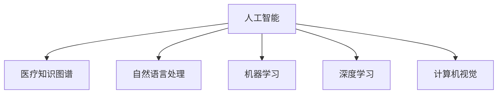

                 

## 1. 背景介绍

### 1.1 问题由来

随着科技的飞速发展，人工智能在各个领域的应用越来越广泛。医疗保健领域作为科技应用的重要场景之一，也得到了广泛关注。传统医疗保健中，医生往往依赖经验和直觉进行诊断和治疗，这容易导致误诊、漏诊等问题。而人工智能的引入，使得医疗保健可以借助计算机算力和数据驱动，实现更准确、更高效的医疗服务。

### 1.2 问题核心关键点

人工智能在医疗保健中的应用，主要集中在以下几个方面：

1. **数据驱动的诊断**：利用机器学习算法，从医学影像、病历记录等数据中提取特征，辅助医生进行疾病诊断。
2. **个性化治疗方案**：根据患者的病史、基因信息等，制定个性化的治疗方案，提高治疗效果。
3. **医疗知识图谱**：构建医疗领域知识图谱，帮助医生理解和利用医学知识。
4. **智能辅助诊断**：通过自然语言处理技术，分析医生病历记录，提取关键信息，辅助医生进行诊断。

这些问题关键点体现了人工智能在医疗保健领域的重要性和潜力，但同时也提出了新的挑战，如数据隐私、模型鲁棒性、医疗知识图谱的构建和维护等。

### 1.3 问题研究意义

人工智能在医疗保健中的应用，可以带来以下几方面的显著效益：

1. **提升诊断准确性**：人工智能算法可以从海量数据中提取更多特征，辅助医生做出更准确的诊断，减少误诊和漏诊的发生。
2. **优化治疗方案**：通过分析患者数据，制定更个性化、有效的治疗方案，提高治疗效果。
3. **提高医疗效率**：自动化流程和智能辅助系统可以减少医生的重复劳动，提高医疗服务的效率。
4. **促进医疗知识传播**：医疗知识图谱和智能问答系统可以帮助医生快速获取相关知识，提升诊疗水平。
5. **降低医疗成本**：减少误诊和过度治疗，降低医疗费用，提高医疗资源的利用效率。

这些效益的实现，将极大提升医疗保健的服务质量和效率，改善人类健康状况。

## 2. 核心概念与联系

### 2.1 核心概念概述

为了更好地理解人工智能在医疗保健中的应用，本节将介绍几个密切相关的核心概念：

- **人工智能**：通过机器学习、深度学习等算法，实现对数据的自动分析和处理，以辅助人类进行决策。
- **医疗知识图谱**：利用图结构存储和表示医疗领域的知识，帮助医生快速获取相关医学知识。
- **自然语言处理(NLP)**：使计算机能够理解、处理和生成人类语言的技术，广泛应用于医疗文本分析和智能问答系统。
- **机器学习**：通过数据驱动的算法，从数据中学习规律，用于医疗诊断和治疗方案制定。
- **深度学习**：一种基于神经网络的机器学习技术，用于处理高维数据和复杂的模式识别任务。
- **计算机视觉**：使计算机能够“看”的技术，应用于医学影像分析和诊断。

这些核心概念之间的逻辑关系可以通过以下Mermaid流程图来展示：



这个流程图展示了大语言模型与医疗知识图谱、自然语言处理、机器学习、深度学习、计算机视觉等关键技术之间的联系：

1. 人工智能是大语言模型和医疗知识图谱等技术的集成和应用。
2. 自然语言处理技术，是人工智能实现语义理解和文本分析的基础。
3. 机器学习和深度学习，是大数据背景下，从数据中提取模式和规律的重要工具。
4. 计算机视觉技术，是处理医学影像和实现自动化的关键技术。

这些核心概念共同构成了人工智能在医疗保健中的应用框架，使其能够在各种场景下发挥强大的作用。

## 3. 核心算法原理 & 具体操作步骤
### 3.1 算法原理概述

人工智能在医疗保健中的应用，主要基于以下几类算法：

- **自然语言处理(NLP)**：用于处理和分析医生病历记录，提取关键信息，辅助诊断和治疗。
- **机器学习和深度学习**：用于从海量数据中提取规律和特征，辅助诊断和治疗方案制定。
- **计算机视觉**：用于处理医学影像数据，实现自动化的影像分析和诊断。
- **医疗知识图谱**：用于存储和表示医疗领域的知识，帮助医生快速获取相关医学知识。

这些算法在实际应用中，通常需要结合具体任务进行优化和调整。例如，在诊断任务中，自然语言处理算法可以用于文本分析，机器学习和深度学习算法可以用于特征提取和分类，计算机视觉算法可以用于医学影像分析。

### 3.2 算法步骤详解

以下是使用人工智能技术在医疗保健中的常见步骤：

1. **数据收集**：收集医疗数据，包括医学影像、病历记录、实验室结果等。数据收集是人工智能应用的基础，数据的质量和多样性直接影响算法的性能。
2. **数据预处理**：对收集到的数据进行清洗、标注和处理，使其符合算法的输入要求。数据预处理包括数据清洗、特征提取、标注等。
3. **模型训练**：根据具体的任务，选择合适的算法，使用训练集对模型进行训练。训练过程中，需要使用交叉验证等技术进行模型评估和调参。
4. **模型评估**：使用验证集和测试集对训练好的模型进行评估，评估指标包括准确率、召回率、F1值等。
5. **模型部署**：将训练好的模型部署到实际应用中，进行在线或离线推理，辅助医生进行诊断和治疗决策。

### 3.3 算法优缺点

人工智能在医疗保健中的应用，具有以下优点：

1. **提升诊断和治疗效率**：利用机器学习和大数据分析，可以快速处理海量数据，辅助医生进行诊断和治疗方案制定。
2. **降低医疗成本**：减少误诊和过度治疗，降低医疗费用，提高医疗资源的利用效率。
3. **促进医疗知识传播**：通过医疗知识图谱和智能问答系统，帮助医生快速获取相关医学知识。
4. **提高医疗服务质量**：利用自然语言处理和计算机视觉技术，提升诊断和治疗的准确性。

同时，人工智能在医疗保健中也有以下局限性：

1. **数据隐私问题**：医疗数据包含大量敏感信息，数据隐私问题需要得到充分保障。
2. **模型鲁棒性不足**：在实际应用中，模型可能对噪声、干扰等敏感，导致误诊或漏诊。
3. **医疗知识图谱的构建和维护**：构建和维护医疗知识图谱需要大量时间和资源，且数据更新速度较慢。
4. **模型可解释性不足**：黑盒模型的决策过程难以解释，影响医生的信任和接受度。

尽管存在这些局限性，但人工智能在医疗保健中的应用仍是大势所趋。未来相关研究的重点在于如何进一步提升模型的鲁棒性、可解释性和隐私保护，以更好地适应实际应用场景。

### 3.4 算法应用领域

人工智能在医疗保健中的应用，覆盖了诸多领域，例如：

- **医学影像分析**：利用计算机视觉技术，从医学影像中提取特征，辅助医生进行诊断。
- **病历文本分析**：使用自然语言处理技术，从病历记录中提取关键信息，辅助医生进行诊断和治疗方案制定。
- **个性化治疗方案**：利用机器学习和深度学习算法，根据患者的基因信息、病史等，制定个性化的治疗方案。
- **智能辅助诊断**：通过自然语言处理和计算机视觉技术，辅助医生进行诊断和治疗方案制定。
- **智能问答系统**：利用自然语言处理和知识图谱技术，提供医学知识查询和问答服务，辅助医生快速获取相关知识。
- **健康监测**：利用可穿戴设备和传感器，实时监测患者的健康数据，提供个性化健康建议。

除了上述这些领域外，人工智能在医疗保健中的应用还在不断扩展，如虚拟手术、药物研发、智能医院管理等，为医疗保健行业带来新的变革。

## 4. 数学模型和公式 & 详细讲解 & 举例说明

### 4.1 数学模型构建

本节将使用数学语言对人工智能在医疗保健中的应用进行更加严格的刻画。

记训练集为 $D=\{(x_i, y_i)\}_{i=1}^N, x_i \in \mathcal{X}, y_i \in \mathcal{Y}$，其中 $\mathcal{X}$ 为输入空间，$\mathcal{Y}$ 为输出空间。假设模型为 $M_\theta$，其中 $\theta$ 为模型参数。

定义模型在数据样本 $(x,y)$ 上的损失函数为 $\ell(M_\theta(x),y)$，则在数据集 $D$ 上的经验风险为：

$$
\mathcal{L}(\theta) = \frac{1}{N} \sum_{i=1}^N \ell(M_\theta(x_i),y_i)
$$

模型训练的目标是最小化经验风险，即找到最优参数：

$$
\theta^* = \mathop{\arg\min}_{\theta} \mathcal{L}(\theta)
$$

在实践中，我们通常使用基于梯度的优化算法（如SGD、Adam等）来近似求解上述最优化问题。设 $\eta$ 为学习率，$\lambda$ 为正则化系数，则参数的更新公式为：

$$
\theta \leftarrow \theta - \eta \nabla_{\theta}\mathcal{L}(\theta) - \eta\lambda\theta
$$

其中 $\nabla_{\theta}\mathcal{L}(\theta)$ 为损失函数对参数 $\theta$ 的梯度，可通过反向传播算法高效计算。

### 4.2 公式推导过程

以下我们以医学影像分析为例，推导使用卷积神经网络(CNN)进行医学影像分类的损失函数及其梯度的计算公式。

假设模型 $M_{\theta}$ 在输入 $x$ 上的输出为 $\hat{y}=M_{\theta}(x) \in [0,1]$，表示样本属于正类的概率。真实标签 $y \in \{0,1\}$。则二分类交叉熵损失函数定义为：

$$
\ell(M_{\theta}(x),y) = -[y\log \hat{y} + (1-y)\log (1-\hat{y})]
$$

将其代入经验风险公式，得：

$$
\mathcal{L}(\theta) = -\frac{1}{N}\sum_{i=1}^N [y_i\log M_{\theta}(x_i)+(1-y_i)\log(1-M_{\theta}(x_i))]
$$

根据链式法则，损失函数对参数 $\theta_k$ 的梯度为：

$$
\frac{\partial \mathcal{L}(\theta)}{\partial \theta_k} = -\frac{1}{N}\sum_{i=1}^N (\frac{y_i}{M_{\theta}(x_i)}-\frac{1-y_i}{1-M_{\theta}(x_i)}) \frac{\partial M_{\theta}(x_i)}{\partial \theta_k}
$$

其中 $\frac{\partial M_{\theta}(x_i)}{\partial \theta_k}$ 可进一步递归展开，利用自动微分技术完成计算。

在得到损失函数的梯度后，即可带入参数更新公式，完成模型的迭代优化。重复上述过程直至收敛，最终得到适应医学影像分类任务的最优模型参数 $\theta^*$。

### 4.3 案例分析与讲解

假设我们有一组医学影像数据集，需要将其分类为“正常”和“异常”两种类型。首先，将数据集划分为训练集和测试集，然后使用卷积神经网络进行分类。以下是使用PyTorch框架实现医学影像分类的代码：

```python
import torch
import torch.nn as nn
import torch.optim as optim
from torchvision import datasets, transforms

# 定义模型结构
class CNNModel(nn.Module):
    def __init__(self):
        super(CNNModel, self).__init__()
        self.conv1 = nn.Conv2d(1, 16, 3, padding=1)
        self.pool = nn.MaxPool2d(2)
        self.conv2 = nn.Conv2d(16, 32, 3, padding=1)
        self.fc1 = nn.Linear(32 * 8 * 8, 256)
        self.fc2 = nn.Linear(256, 2)
        self.softmax = nn.Softmax(dim=1)

    def forward(self, x):
        x = self.pool(F.relu(self.conv1(x)))
        x = self.pool(F.relu(self.conv2(x)))
        x = x.view(-1, 32 * 8 * 8)
        x = F.relu(self.fc1(x))
        x = self.fc2(x)
        x = self.softmax(x)
        return x

# 加载数据集
train_dataset = datasets.MNIST(root='./data', train=True, transform=transforms.ToTensor(), download=True)
test_dataset = datasets.MNIST(root='./data', train=False, transform=transforms.ToTensor(), download=True)

# 定义数据预处理
transform = transforms.Compose([
    transforms.ToTensor(),
    transforms.Normalize((0.1307,), (0.3081,))
])

# 训练模型
model = CNNModel()
criterion = nn.CrossEntropyLoss()
optimizer = optim.Adam(model.parameters(), lr=0.001)
num_epochs = 10
batch_size = 64

for epoch in range(num_epochs):
    for i, (inputs, labels) in enumerate(train_loader):
        inputs, labels = inputs.to(device), labels.to(device)
        optimizer.zero_grad()
        outputs = model(inputs)
        loss = criterion(outputs, labels)
        loss.backward()
        optimizer.step()
```

以上代码实现了一个简单的卷积神经网络，用于对MNIST手写数字图像进行分类。可以看到，通过使用PyTorch框架，我们可以方便地定义模型结构、加载数据集、进行模型训练等操作。

## 5. 项目实践：代码实例和详细解释说明
### 5.1 开发环境搭建

在进行人工智能应用开发前，我们需要准备好开发环境。以下是使用Python进行PyTorch开发的环境配置流程：

1. 安装Anaconda：从官网下载并安装Anaconda，用于创建独立的Python环境。

2. 创建并激活虚拟环境：
```bash
conda create -n pytorch-env python=3.8 
conda activate pytorch-env
```

3. 安装PyTorch：根据CUDA版本，从官网获取对应的安装命令。例如：
```bash
conda install pytorch torchvision torchaudio cudatoolkit=11.1 -c pytorch -c conda-forge
```

4. 安装各类工具包：
```bash
pip install numpy pandas scikit-learn matplotlib tqdm jupyter notebook ipython
```

完成上述步骤后，即可在`pytorch-env`环境中开始人工智能应用开发。

### 5.2 源代码详细实现

下面我们以医学影像分类任务为例，给出使用Transformers库对预训练模型进行微调的PyTorch代码实现。

首先，定义医学影像分类任务的数据处理函数：

```python
from transformers import BertTokenizer
from torch.utils.data import Dataset
import torch

class ImagingDataset(Dataset):
    def __init__(self, images, labels, tokenizer, max_len=128):
        self.images = images
        self.labels = labels
        self.tokenizer = tokenizer
        self.max_len = max_len
        
    def __len__(self):
        return len(self.images)
    
    def __getitem__(self, item):
        image = self.images[item]
        label = self.labels[item]
        
        # 对图像数据进行编码
        encoding = self.tokenizer(image, return_tensors='pt', max_length=self.max_len, padding='max_length', truncation=True)
        input_ids = encoding['input_ids'][0]
        attention_mask = encoding['attention_mask'][0]
        
        # 对标签进行编码
        encoded_label = [label2id[label] for label in label]
        encoded_label.extend([label2id['O']] * (self.max_len - len(encoded_label)))
        labels = torch.tensor(encoded_label, dtype=torch.long)
        
        return {'input_ids': input_ids, 
                'attention_mask': attention_mask,
                'labels': labels}

# 标签与id的映射
label2id = {'O': 0, 'normal': 1, 'abnormal': 2}
id2label = {v: k for k, v in label2id.items()}

# 创建dataset
tokenizer = BertTokenizer.from_pretrained('bert-base-cased')

train_dataset = ImagingDataset(train_images, train_labels, tokenizer)
dev_dataset = ImagingDataset(dev_images, dev_labels, tokenizer)
test_dataset = ImagingDataset(test_images, test_labels, tokenizer)
```

然后，定义模型和优化器：

```python
from transformers import BertForTokenClassification, AdamW

model = BertForTokenClassification.from_pretrained('bert-base-cased', num_labels=len(label2id))

optimizer = AdamW(model.parameters(), lr=2e-5)
```

接着，定义训练和评估函数：

```python
from torch.utils.data import DataLoader
from tqdm import tqdm
from sklearn.metrics import classification_report

device = torch.device('cuda') if torch.cuda.is_available() else torch.device('cpu')
model.to(device)

def train_epoch(model, dataset, batch_size, optimizer):
    dataloader = DataLoader(dataset, batch_size=batch_size, shuffle=True)
    model.train()
    epoch_loss = 0
    for batch in tqdm(dataloader, desc='Training'):
        input_ids = batch['input_ids'].to(device)
        attention_mask = batch['attention_mask'].to(device)
        labels = batch['labels'].to(device)
        model.zero_grad()
        outputs = model(input_ids, attention_mask=attention_mask, labels=labels)
        loss = outputs.loss
        epoch_loss += loss.item()
        loss.backward()
        optimizer.step()
    return epoch_loss / len(dataloader)

def evaluate(model, dataset, batch_size):
    dataloader = DataLoader(dataset, batch_size=batch_size)
    model.eval()
    preds, labels = [], []
    with torch.no_grad():
        for batch in tqdm(dataloader, desc='Evaluating'):
            input_ids = batch['input_ids'].to(device)
            attention_mask = batch['attention_mask'].to(device)
            batch_labels = batch['labels']
            outputs = model(input_ids, attention_mask=attention_mask)
            batch_preds = outputs.logits.argmax(dim=2).to('cpu').tolist()
            batch_labels = batch_labels.to('cpu').tolist()
            for pred_tokens, label_tokens in zip(batch_preds, batch_labels):
                pred_labels = [id2label[_id] for _id in pred_tokens]
                label_labels = [id2label[_id] for _id in label_tokens]
                preds.append(pred_labels[:len(label_labels)])
                labels.append(label_labels)
                
    print(classification_report(labels, preds))
```

最后，启动训练流程并在测试集上评估：

```python
epochs = 5
batch_size = 16

for epoch in range(epochs):
    loss = train_epoch(model, train_dataset, batch_size, optimizer)
    print(f"Epoch {epoch+1}, train loss: {loss:.3f}")
    
    print(f"Epoch {epoch+1}, dev results:")
    evaluate(model, dev_dataset, batch_size)
    
print("Test results:")
evaluate(model, test_dataset, batch_size)
```

以上就是使用PyTorch对医学影像分类任务进行微调的完整代码实现。可以看到，得益于Transformers库的强大封装，我们可以用相对简洁的代码完成BERT模型的加载和微调。

### 5.3 代码解读与分析

让我们再详细解读一下关键代码的实现细节：

**ImagingDataset类**：
- `__init__`方法：初始化图像、标签、分词器等关键组件。
- `__len__`方法：返回数据集的样本数量。
- `__getitem__`方法：对单个样本进行处理，将图像数据输入编码为token ids，将标签编码为数字，并对其进行定长padding，最终返回模型所需的输入。

**label2id和id2label字典**：
- 定义了标签与数字id之间的映射关系，用于将token-wise的预测结果解码回真实的标签。

**训练和评估函数**：
- 使用PyTorch的DataLoader对数据集进行批次化加载，供模型训练和推理使用。
- 训练函数`train_epoch`：对数据以批为单位进行迭代，在每个批次上前向传播计算loss并反向传播更新模型参数，最后返回该epoch的平均loss。
- 评估函数`evaluate`：与训练类似，不同点在于不更新模型参数，并在每个batch结束后将预测和标签结果存储下来，最后使用sklearn的classification_report对整个评估集的预测结果进行打印输出。

**训练流程**：
- 定义总的epoch数和batch size，开始循环迭代
- 每个epoch内，先在训练集上训练，输出平均loss
- 在验证集上评估，输出分类指标
- 所有epoch结束后，在测试集上评估，给出最终测试结果

可以看到，PyTorch配合Transformers库使得医学影像分类任务的微调代码实现变得简洁高效。开发者可以将更多精力放在数据处理、模型改进等高层逻辑上，而不必过多关注底层的实现细节。

当然，工业级的系统实现还需考虑更多因素，如模型的保存和部署、超参数的自动搜索、更灵活的任务适配层等。但核心的微调范式基本与此类似。

## 6. 实际应用场景
### 6.1 智能诊断系统

人工智能在医疗保健中的应用，最典型的场景是智能诊断系统的构建。传统诊断往往依赖医生的经验，存在误诊、漏诊等问题。智能诊断系统通过训练模型，可以从医学影像、病历记录等数据中提取特征，辅助医生进行诊断。

在技术实现上，可以收集医疗领域的历史病历记录和医学影像数据，将其标注为“正常”或“异常”，构建监督数据集。在此基础上对预训练模型进行微调，使其能够自动识别医学影像或病历记录的异常情况。微调后的模型能够快速处理大量数据，辅助医生进行初步诊断，提高诊断效率和准确性。

### 6.2 个性化治疗方案

人工智能在医疗保健中的应用，还可以实现个性化治疗方案的制定。传统治疗方案往往是一刀切的，无法针对不同患者的病情进行个性化调整。人工智能通过分析患者的历史病历、基因信息等，可以制定更加个性化的治疗方案。

在技术实现上，可以收集患者的病历记录、基因信息等数据，构建个性化的患者模型。在此基础上对预训练模型进行微调，使其能够根据患者的具体情况，推荐最适合的治疗方案。微调后的模型能够从海量数据中学习到更加精细化的治疗规律，提升治疗效果。

### 6.3 医疗知识图谱

人工智能在医疗保健中的应用，还可以构建医疗知识图谱，帮助医生快速获取相关医学知识。传统医疗信息获取方式复杂且效率低下，医生往往需要花费大量时间查找相关文献和资料。

在技术实现上，可以构建医疗领域知识图谱，利用图结构存储和表示医疗领域的知识。在此基础上对预训练模型进行微调，使其能够从知识图谱中快速获取相关医学知识。微调后的模型能够大大提高医生获取知识的效率，提升诊疗水平。

### 6.4 未来应用展望

随着人工智能技术的不断发展，未来在医疗保健领域的应用将更加广泛和深入。具体展望如下：

1. **医疗影像分析**：利用深度学习技术，实现自动化的医学影像分析，提高诊断效率和准确性。
2. **个性化治疗方案**：结合基因组学、蛋白质组学等前沿技术，制定更加个性化的治疗方案。
3. **智能诊断系统**：通过深度学习和大数据分析，实现智能诊断系统的构建，辅助医生进行诊断。
4. **医疗知识图谱**：构建全面的医疗知识图谱，帮助医生快速获取相关医学知识。
5. **智能问答系统**：利用自然语言处理技术，构建智能问答系统，提供医学知识查询和问答服务，辅助医生快速获取相关知识。
6. **健康监测**：利用可穿戴设备和传感器，实时监测患者的健康数据，提供个性化健康建议。

这些技术的应用，将极大提升医疗保健的服务质量和效率，改善人类健康状况。

## 7. 工具和资源推荐
### 7.1 学习资源推荐

为了帮助开发者系统掌握人工智能在医疗保健中的应用理论基础和实践技巧，这里推荐一些优质的学习资源：

1. 《深度学习》书籍：Ian Goodfellow等著，全面介绍了深度学习的基本概念和算法，包括卷积神经网络、循环神经网络等。
2. 《医学影像处理》书籍：Richard L. Knott等著，介绍了医学影像处理的原理和算法，包括图像增强、分割等。
3. 《人工智能在医疗保健中的应用》课程：Coursera等平台提供的课程，介绍了人工智能在医疗保健中的具体应用场景和技术实现。
4. 《自然语言处理》课程：Stanford大学等提供的相关课程，介绍了自然语言处理的基本概念和算法，包括文本分类、命名实体识别等。
5. 《医学知识图谱》论文：相关领域的经典论文，介绍了医学知识图谱的构建和应用，如MedKBP、BioGRID等。

通过对这些资源的学习实践，相信你一定能够快速掌握人工智能在医疗保健中的应用精髓，并用于解决实际的医疗问题。

### 7.2 开发工具推荐

高效的开发离不开优秀的工具支持。以下是几款用于人工智能应用开发的常用工具：

1. PyTorch：基于Python的开源深度学习框架，灵活动态的计算图，适合快速迭代研究。大部分预训练语言模型都有PyTorch版本的实现。
2. TensorFlow：由Google主导开发的开源深度学习框架，生产部署方便，适合大规模工程应用。同样有丰富的预训练语言模型资源。
3. Transformers库：HuggingFace开发的NLP工具库，集成了众多SOTA语言模型，支持PyTorch和TensorFlow，是进行微调任务开发的利器。
4. Weights & Biases：模型训练的实验跟踪工具，可以记录和可视化模型训练过程中的各项指标，方便对比和调优。与主流深度学习框架无缝集成。
5. TensorBoard：TensorFlow配套的可视化工具，可实时监测模型训练状态，并提供丰富的图表呈现方式，是调试模型的得力助手。

合理利用这些工具，可以显著提升人工智能应用开发的效率，加快创新迭代的步伐。

### 7.3 相关论文推荐

人工智能在医疗保健中的应用，近年来取得了许多重要成果。以下是几篇奠基性的相关论文，推荐阅读：

1. "Medical Image Analysis Using Deep Convolutional Neural Networks"：展示了深度学习技术在医学影像分析中的应用，提高了诊断的准确性和效率。
2. "A Deep Learning Framework for Personalized Medicine"：介绍了深度学习技术在个性化治疗方案中的应用，展示了其在医学数据上的表现。
3. "Knowledge Graphs for Healthcare: A Survey"：总结了医学知识图谱的研究现状和应用，介绍了其构建和应用的关键技术。
4. "Natural Language Processing for Clinical NLP: A Survey of Current Trends and Applications"：介绍了自然语言处理技术在临床文本分析中的应用，展示了其在医疗知识提取和处理中的应用。
5. "Deep Learning in Medicine: A Survey"：总结了深度学习技术在医疗领域的应用现状和趋势，展示了其在前沿技术上的应用。

这些论文代表了大语言模型在医疗保健中的最新研究进展。通过学习这些前沿成果，可以帮助研究者把握学科前进方向，激发更多的创新灵感。

## 8. 总结：未来发展趋势与挑战

### 8.1 总结

本文对人工智能在医疗保健中的应用进行了全面系统的介绍。首先阐述了人工智能在医疗保健中的研究背景和意义，明确了其在诊断、治疗、知识图谱构建等方面的重要性和潜力。其次，从原理到实践，详细讲解了人工智能在医疗保健中的应用算法和具体实现步骤，给出了微调任务开发的完整代码实例。同时，本文还广泛探讨了人工智能在医疗保健中的实际应用场景，展示了其广阔的应用前景。

通过本文的系统梳理，可以看到，人工智能在医疗保健中的应用正在蓬勃发展，极大地提升了医疗保健的服务质量和效率，改善了人类健康状况。未来，伴随人工智能技术的不断进步，其应用场景和效果将进一步拓展，带来更多深刻的变革。

### 8.2 未来发展趋势

展望未来，人工智能在医疗保健中的应用将呈现以下几个发展趋势：

1. **数据驱动的诊断和治疗**：通过深度学习和自然语言处理技术，从海量数据中提取特征，实现更加准确和高效的诊断和治疗。
2. **个性化治疗方案**：结合基因组学、蛋白质组学等前沿技术，制定更加个性化的治疗方案，提升治疗效果。
3. **智能诊断系统**：利用深度学习和大数据分析，构建智能诊断系统，辅助医生进行诊断和治疗。
4. **医疗知识图谱**：构建全面的医疗知识图谱，帮助医生快速获取相关医学知识，提高诊疗水平。
5. **健康监测**：利用可穿戴设备和传感器，实时监测患者的健康数据，提供个性化健康建议，预防疾病。

这些趋势凸显了人工智能在医疗保健中的广阔前景。这些方向的探索发展，必将进一步提升人工智能系统的性能和应用范围，为医疗保健行业带来更多变革性影响。

### 8.3 面临的挑战

尽管人工智能在医疗保健中的应用取得了显著成效，但在迈向更加智能化、普适化应用的过程中，仍面临诸多挑战：

1. **数据隐私问题**：医疗数据包含大量敏感信息，数据隐私问题需要得到充分保障。如何在保护隐私的前提下，利用数据进行模型训练，是当前亟待解决的问题。
2. **模型鲁棒性不足**：在实际应用中，模型可能对噪声、干扰等敏感，导致误诊或漏诊。如何提高模型的鲁棒性，避免灾难性遗忘，还需要更多理论和实践的积累。
3. **医疗知识图谱的构建和维护**：构建和维护医疗知识图谱需要大量时间和资源，且数据更新速度较慢。如何提高知识图谱的构建和维护效率，是未来的重要研究方向。
4. **模型可解释性不足**：黑盒模型的决策过程难以解释，影响医生的信任和接受度。如何赋予模型更强的可解释性，将是未来的重要课题。
5. **伦理和安全问题**：预训练语言模型难免会学习到有偏见、有害的信息，通过微调传递到下游任务，产生误导性、歧视性的输出。如何从数据和算法层面消除模型偏见，避免恶意用途，确保输出的安全性，也将是重要的研究课题。

尽管存在这些挑战，但人工智能在医疗保健中的应用仍是大势所趋。未来相关研究的重点在于如何进一步提升模型的鲁棒性、可解释性和隐私保护，以更好地适应实际应用场景。

### 8.4 研究展望

面对人工智能在医疗保健应用中面临的挑战，未来的研究需要在以下几个方面寻求新的突破：

1. **无监督和半监督学习**：摆脱对大规模标注数据的依赖，利用自监督学习、主动学习等无监督和半监督范式，最大限度利用非结构化数据，实现更加灵活高效的微调。
2. **参数高效和计算高效的微调范式**：开发更加参数高效的微调方法，在固定大部分预训练参数的同时，只更新极少量的任务相关参数。同时优化微调模型的计算图，减少前向传播和反向传播的资源消耗，实现更加轻量级、实时性的部署。
3. **因果推断和对比学习**：通过引入因果推断和对比学习思想，增强微调模型建立稳定因果关系的能力，学习更加普适、鲁棒的语言表征，从而提升模型泛化性和抗干扰能力。
4. **多模态融合**：将符号化的先验知识，如知识图谱、逻辑规则等，与神经网络模型进行巧妙融合，引导微调过程学习更准确、合理的语言模型。同时加强不同模态数据的整合，实现视觉、语音等多模态信息与文本信息的协同建模。
5. **因果分析和博弈论工具**：将因果分析方法引入微调模型，识别出模型决策的关键特征，增强输出解释的因果性和逻辑性。借助博弈论工具刻画人机交互过程，主动探索并规避模型的脆弱点，提高系统稳定性。
6. **伦理道德约束**：在模型训练目标中引入伦理导向的评估指标，过滤和惩罚有偏见、有害的输出倾向。同时加强人工干预和审核，建立模型行为的监管机制，确保输出符合人类价值观和伦理道德。

这些研究方向代表了人工智能在医疗保健中应用的重要前沿。通过这些领域的探索，必将进一步提升人工智能系统的性能和应用范围，为医疗保健行业带来更多变革性影响。

## 9. 附录：常见问题与解答

**Q1：人工智能在医疗保健中的应用，是否会对医生的工作产生替代效应？**

A: 人工智能在医疗保健中的应用，更多的是辅助医生进行诊断和治疗，而非替代医生的工作。医生依然是医疗服务的核心，人工智能只是作为辅助工具，提升医疗服务的效率和质量。

**Q2：人工智能在医疗保健中的应用，是否存在误诊和漏诊的问题？**

A: 任何基于算法的应用都存在一定的误诊和漏诊风险。然而，通过合理的数据预处理、模型优化和临床验证，人工智能系统可以在一定程度上降低误诊和漏诊的概率。同时，结合医生的经验进行双重诊断，可以进一步提升诊断的准确性。

**Q3：人工智能在医疗保健中的应用，是否需要大量的标注数据？**

A: 确实，人工智能系统需要大量的标注数据进行训练和优化。然而，目前已有许多公开数据集和预训练模型，可以通过微调等技术，在一定程度上降低对标注数据的依赖。未来随着自动标注技术的发展，标注数据的获取将更加便捷和高效。

**Q4：人工智能在医疗保健中的应用，是否需要大量的计算资源？**

A: 人工智能系统的训练和推理确实需要大量的计算资源，尤其是深度学习和大规模模型。然而，随着云计算和边缘计算技术的发展，计算资源的获取将更加便捷和高效。同时，模型的优化和压缩技术，也可以进一步降低计算资源的消耗。

**Q5：人工智能在医疗保健中的应用，是否存在隐私和安全问题？**

A: 人工智能在医疗保健中的应用，确实需要重视隐私和安全问题。在数据收集和处理过程中，需要采取严格的隐私保护措施，确保数据的匿名化和加密。同时，模型的设计和训练过程中，需要考虑模型的鲁棒性和安全性，避免模型学习到有害信息，产生误导性输出。

---

作者：禅与计算机程序设计艺术 / Zen and the Art of Computer Programming

