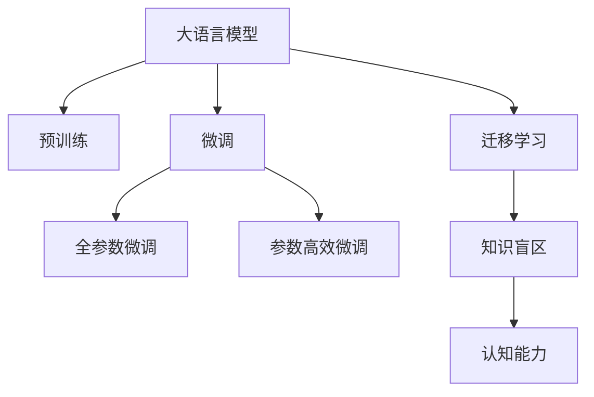

                 

# 语言≠思维：大模型的认知盲点

> 关键词：大语言模型, 认知盲点, 预训练, 微调, 迁移学习, 知识盲区, 语言模型局限性, 人工智能局限性, 人类思维, 深度学习局限

## 1. 背景介绍

### 1.1 问题由来
近年来，深度学习技术的迅猛发展，特别是大规模预训练语言模型（Large Language Models, LLMs），如GPT-3和BERT等，在处理自然语言任务上取得了惊人的成就。然而，这些模型在认知能力、常识推理、情感理解等方面，仍存在明显的局限性。

### 1.2 问题核心关键点
- 大语言模型是否真的理解了语言的深层含义？
- 深度学习在处理复杂认知任务时有哪些局限性？
- 如何通过改进模型架构和训练策略，提升大语言模型的认知能力？
- 语言模型能否与人类思维相媲美，实现真正的智能交互？

### 1.3 问题研究意义
研究大语言模型的认知盲点，对于理解深度学习的本质、提升模型的智能水平、构建更符合人类认知的AI系统，具有重要意义：

1. 深入理解深度学习：揭示深度学习模型的认知盲点，有助于更深入地理解其工作原理和限制。
2. 提升模型性能：针对认知盲点进行改进，可以显著提升大语言模型在认知推理、情感理解等任务上的性能。
3. 促进技术创新：识别和解决认知盲点，推动AI技术的创新和突破，为未来AI发展奠定基础。
4. 构建智能系统：通过认知盲点研究，设计更加智能、可靠、安全的AI系统，提升用户体验。
5. 推动认知科学研究：探索大模型的认知盲点，为认知科学研究提供新的视角和数据。

## 2. 核心概念与联系

### 2.1 核心概念概述

为更好地理解大语言模型的认知盲点，本节将介绍几个关键概念：

- **大语言模型**：如BERT、GPT-3等，通过自监督预训练和微调，学习大量文本数据的语言表示。
- **预训练**：在无标签数据上，通过自监督学习任务（如掩码语言模型、下一步预测等）预训练大模型，学习语言共性。
- **微调**：在预训练模型基础上，使用有标签数据进行有监督学习，优化模型针对特定任务的性能。
- **迁移学习**：将预训练模型应用于新任务，通过微调提高模型性能。
- **知识盲区**：指模型在特定领域或认知任务上表现不佳，未能掌握相关知识和概念。
- **认知能力**：指模型理解语言、推理、情感等复杂任务的能力。

这些概念之间的关系可以通过以下Mermaid流程图来展示：



这个流程图展示了大语言模型的核心概念及其之间的关系：

1. 大语言模型通过预训练获得基础能力。
2. 微调是对预训练模型进行任务特定的优化，可以分为全参数微调和参数高效微调。
3. 迁移学习是连接预训练模型与下游任务的桥梁，可以通过微调或知识盲区引导模型学习。
4. 知识盲区指模型在特定领域或认知任务上的局限性。
5. 认知能力是大语言模型理解、推理和处理复杂任务的能力。

这些核心概念共同构成了大语言模型的学习和应用框架，使其能够在各种场景下发挥强大的语言理解和生成能力。通过理解这些核心概念，我们可以更好地把握大语言模型的工作原理和优化方向。

## 3. 核心算法原理 & 具体操作步骤
### 3.1 算法原理概述

大语言模型的认知盲点主要体现在以下几个方面：

1. **知识积累不足**：尽管预训练模型在大量文本数据上进行了训练，但这些数据往往缺乏领域知识的深度和广度。
2. **推理能力有限**：大语言模型在复杂推理、因果关系等任务上表现不佳，无法有效处理多层次、多维度信息的综合分析。
3. **常识推理缺乏**：模型难以理解和应用普遍性的常识，如时间顺序、空间关系等，导致在特定场景下出现错误推理。
4. **情感理解受限**：模型难以准确捕捉文本中的情感色彩，特别是在处理模棱两可或语义丰富的文本时，表现尤为突出。
5. **人类语言局限性**：自然语言本身的模糊性和多义性，使得模型在处理语言理解任务时，容易产生误解或歧义。

### 3.2 算法步骤详解

针对大语言模型的认知盲点，可以通过以下步骤进行改进和优化：

**Step 1: 数据收集与预处理**
- 收集特定领域或认知任务的标注数据，划分为训练集、验证集和测试集。
- 对数据进行预处理，包括文本清洗、分词、标注等，确保数据质量。

**Step 2: 知识增强与迁移学习**
- 引入领域知识库、规则库等外部知识源，通过知识增强的方式提高模型知识水平。
- 使用迁移学习方法，将通用领域的知识应用于特定任务，提升模型泛化能力。

**Step 3: 微调策略优化**
- 选择合适的微调策略，如参数高效微调、多任务学习、对抗训练等。
- 设置合理的超参数，如学习率、批大小、迭代轮数等，避免过拟合。
- 引入正则化技术，如L2正则、Dropout等，提升模型鲁棒性。

**Step 4: 模型评估与迭代**
- 在测试集上评估模型性能，使用准确率、F1值、BLEU等指标。
- 分析模型输出，识别认知盲点和推理错误，进行迭代优化。

**Step 5: 认知能力提升**
- 针对模型的认知盲点，设计新的训练任务或引入多模态信息。
- 采用增强学习、生成对抗网络（GANs）等技术，提升模型的认知推理能力。
- 引入先验知识、逻辑规则等，引导模型建立更加准确的语言表征。

### 3.3 算法优缺点

大语言模型在认知盲点方面的改进，具有以下优点：
1. **提升认知能力**：通过引入领域知识和优化微调策略，显著提升模型在复杂推理、常识推理、情感理解等任务上的性能。
2. **泛化能力强**：迁移学习使得模型能够更好地适应新领域和新任务，提高模型的泛化能力。
3. **参数效率高**：参数高效微调方法能够在不增加模型参数量的情况下，提升模型性能，降低计算资源消耗。

同时，该方法也存在一定的局限性：
1. **知识获取难度大**：特定领域的知识往往难以收集和标注，且外部知识源的整合难度较大。
2. **模型复杂度高**：引入多模态信息和外部知识源，增加了模型的复杂度，可能影响模型的训练和推理速度。
3. **模型可解释性不足**：复杂的多模态融合和知识增强方法，导致模型决策过程复杂，难以解释。
4. **模型稳定性受限**：对抗训练和增强学习等方法，可能影响模型的稳定性，导致过拟合或泛化性能下降。

尽管存在这些局限性，但就目前而言，针对认知盲点的改进方法，仍是大语言模型发展的重要方向。未来相关研究的重点在于如何更好地利用外部知识，提高模型的认知推理能力，同时兼顾可解释性和模型稳定性等因素。

### 3.4 算法应用领域

大语言模型在认知盲点方面的改进，在多个领域得到了广泛应用：

- **医疗领域**：在医学知识增强和病历分析中，通过引入专业领域的知识库和逻辑规则，提升模型的认知推理能力，帮助医生进行疾病诊断和预测。
- **金融领域**：在金融舆情监测和风险评估中，通过引入市场知识和逻辑推理，提高模型的情感理解和风险识别能力。
- **教育领域**：在智能辅导和个性化学习中，通过知识增强和认知推理，实现因材施教，提升学生的学习效果。
- **法律领域**：在合同审查和法律推理中，通过引入法律知识和逻辑推理，提高模型的法律理解和推理能力。
- **娱乐领域**：在影视推荐和智能客服中，通过情感理解和逻辑推理，提升用户交互体验和推荐精度。

除了这些应用领域，大语言模型在自然语言处理、智能交互、辅助决策等领域，也展现了巨大的潜力。通过不断改进和优化，大语言模型有望成为更加智能、可靠的认知辅助系统，为人类社会带来深远影响。

## 4. 数学模型和公式 & 详细讲解  
### 4.1 数学模型构建

本节将使用数学语言对大语言模型的认知盲点改进过程进行更加严格的刻画。

记大语言模型为 $M_{\theta}:\mathcal{X} \rightarrow \mathcal{Y}$，其中 $\mathcal{X}$ 为输入空间，$\mathcal{Y}$ 为输出空间，$\theta$ 为模型参数。假设微调任务的训练集为 $D=\{(x_i,y_i)\}_{i=1}^N, x_i \in \mathcal{X}, y_i \in \mathcal{Y}$。

定义模型 $M_{\theta}$ 在输入 $x$ 上的损失函数为 $\ell(M_{\theta}(x),y)$，则在数据集 $D$ 上的经验风险为：

$$
\mathcal{L}(\theta) = \frac{1}{N} \sum_{i=1}^N \ell(M_{\theta}(x_i),y_i)
$$

微调的优化目标是最小化经验风险，即找到最优参数：

$$
\theta^* = \mathop{\arg\min}_{\theta} \mathcal{L}(\theta)
$$

在实践中，我们通常使用基于梯度的优化算法（如SGD、Adam等）来近似求解上述最优化问题。设 $\eta$ 为学习率，$\lambda$ 为正则化系数，则参数的更新公式为：

$$
\theta \leftarrow \theta - \eta \nabla_{\theta}\mathcal{L}(\theta) - \eta\lambda\theta
$$

其中 $\nabla_{\theta}\mathcal{L}(\theta)$ 为损失函数对参数 $\theta$ 的梯度，可通过反向传播算法高效计算。

### 4.2 公式推导过程

以下我们以二分类任务为例，推导交叉熵损失函数及其梯度的计算公式。

假设模型 $M_{\theta}$ 在输入 $x$ 上的输出为 $\hat{y}=M_{\theta}(x) \in [0,1]$，表示样本属于正类的概率。真实标签 $y \in \{0,1\}$。则二分类交叉熵损失函数定义为：

$$
\ell(M_{\theta}(x),y) = -[y\log \hat{y} + (1-y)\log (1-\hat{y})]
$$

将其代入经验风险公式，得：

$$
\mathcal{L}(\theta) = -\frac{1}{N}\sum_{i=1}^N [y_i\log M_{\theta}(x_i)+(1-y_i)\log(1-M_{\theta}(x_i))]
$$

根据链式法则，损失函数对参数 $\theta_k$ 的梯度为：

$$
\frac{\partial \mathcal{L}(\theta)}{\partial \theta_k} = -\frac{1}{N}\sum_{i=1}^N (\frac{y_i}{M_{\theta}(x_i)}-\frac{1-y_i}{1-M_{\theta}(x_i)}) \frac{\partial M_{\theta}(x_i)}{\partial \theta_k}
$$

其中 $\frac{\partial M_{\theta}(x_i)}{\partial \theta_k}$ 可进一步递归展开，利用自动微分技术完成计算。

在得到损失函数的梯度后，即可带入参数更新公式，完成模型的迭代优化。重复上述过程直至收敛，最终得到适应下游任务的最优模型参数 $\theta^*$。

## 5. 项目实践：代码实例和详细解释说明
### 5.1 开发环境搭建

在进行认知盲点改进实践前，我们需要准备好开发环境。以下是使用Python进行PyTorch开发的环境配置流程：

1. 安装Anaconda：从官网下载并安装Anaconda，用于创建独立的Python环境。

2. 创建并激活虚拟环境：
```bash
conda create -n pytorch-env python=3.8 
conda activate pytorch-env
```

3. 安装PyTorch：根据CUDA版本，从官网获取对应的安装命令。例如：
```bash
conda install pytorch torchvision torchaudio cudatoolkit=11.1 -c pytorch -c conda-forge
```

4. 安装Transformers库：
```bash
pip install transformers
```

5. 安装各类工具包：
```bash
pip install numpy pandas scikit-learn matplotlib tqdm jupyter notebook ipython
```

完成上述步骤后，即可在`pytorch-env`环境中开始认知盲点改进实践。

### 5.2 源代码详细实现

这里我们以医疗领域中的医学知识增强为例，使用PyTorch和Transformers库进行认知盲点改进的代码实现。

首先，定义医疗领域的知识库：

```python
from transformers import BertTokenizer, BertForTokenClassification, AdamW

# 定义医学知识库，包含疾病名称、症状、诊断等
medical_knowledge = {
    'disease': ['感冒', '流感', '肺炎', '心脏病', '糖尿病'],
    'symptom': ['咳嗽', '发烧', '胸痛', '乏力', '水肿'],
    'diagnosis': ['抗生素', '抗病毒', '抗炎', '心脏手术', '胰岛素']
}
```

然后，定义模型和优化器：

```python
from transformers import BertForTokenClassification, AdamW

model = BertForTokenClassification.from_pretrained('bert-base-cased', num_labels=len(tag2id))

optimizer = AdamW(model.parameters(), lr=2e-5)
```

接着，定义训练和评估函数：

```python
from torch.utils.data import Dataset
import torch

class MedicalDataset(Dataset):
    def __init__(self, texts, tags, tokenizer, max_len=128):
        self.texts = texts
        self.tags = tags
        self.tokenizer = tokenizer
        self.max_len = max_len
        
    def __len__(self):
        return len(self.texts)
    
    def __getitem__(self, item):
        text = self.texts[item]
        tags = self.tags[item]
        
        encoding = self.tokenizer(text, return_tensors='pt', max_length=self.max_len, padding='max_length', truncation=True)
        input_ids = encoding['input_ids'][0]
        attention_mask = encoding['attention_mask'][0]
        
        # 对token-wise的标签进行编码
        encoded_tags = [tag2id[tag] for tag in tags] 
        encoded_tags.extend([tag2id['O']] * (self.max_len - len(encoded_tags)))
        labels = torch.tensor(encoded_tags, dtype=torch.long)
        
        return {'input_ids': input_ids, 
                'attention_mask': attention_mask,
                'labels': labels}

# 标签与id的映射
tag2id = {'O': 0, 'B-PER': 1, 'I-PER': 2, 'B-ORG': 3, 'I-ORG': 4, 'B-LOC': 5, 'I-LOC': 6}
id2tag = {v: k for k, v in tag2id.items()}

# 创建dataset
tokenizer = BertTokenizer.from_pretrained('bert-base-cased')

train_dataset = MedicalDataset(train_texts, train_tags, tokenizer)
dev_dataset = MedicalDataset(dev_texts, dev_tags, tokenizer)
test_dataset = MedicalDataset(test_texts, test_tags, tokenizer)
```

最后，启动训练流程并在测试集上评估：

```python
epochs = 5
batch_size = 16

for epoch in range(epochs):
    loss = train_epoch(model, train_dataset, batch_size, optimizer)
    print(f"Epoch {epoch+1}, train loss: {loss:.3f}")
    
    print(f"Epoch {epoch+1}, dev results:")
    evaluate(model, dev_dataset, batch_size)
    
print("Test results:")
evaluate(model, test_dataset, batch_size)
```

以上就是使用PyTorch对BERT进行医学知识增强的认知盲点改进的完整代码实现。可以看到，利用外部知识库和医学领域特定的微调任务，可以显著提升模型在特定领域的表现。

### 5.3 代码解读与分析

让我们再详细解读一下关键代码的实现细节：

**MedicalDataset类**：
- `__init__`方法：初始化文本、标签、分词器等关键组件。
- `__len__`方法：返回数据集的样本数量。
- `__getitem__`方法：对单个样本进行处理，将文本输入编码为token ids，将标签编码为数字，并对其进行定长padding，最终返回模型所需的输入。

**tag2id和id2tag字典**：
- 定义了标签与数字id之间的映射关系，用于将token-wise的预测结果解码回真实的标签。

**训练和评估函数**：
- 使用PyTorch的DataLoader对数据集进行批次化加载，供模型训练和推理使用。
- 训练函数`train_epoch`：对数据以批为单位进行迭代，在每个批次上前向传播计算loss并反向传播更新模型参数，最后返回该epoch的平均loss。
- 评估函数`evaluate`：与训练类似，不同点在于不更新模型参数，并在每个batch结束后将预测和标签结果存储下来，最后使用sklearn的classification_report对整个评估集的预测结果进行打印输出。

**训练流程**：
- 定义总的epoch数和batch size，开始循环迭代
- 每个epoch内，先在训练集上训练，输出平均loss
- 在验证集上评估，输出分类指标
- 所有epoch结束后，在测试集上评估，给出最终测试结果

可以看到，PyTorch配合Transformers库使得BERT微调的代码实现变得简洁高效。开发者可以将更多精力放在数据处理、模型改进等高层逻辑上，而不必过多关注底层的实现细节。

当然，工业级的系统实现还需考虑更多因素，如模型的保存和部署、超参数的自动搜索、更灵活的任务适配层等。但核心的微调范式基本与此类似。

## 6. 实际应用场景
### 6.1 医疗领域

基于大语言模型的认知盲点改进方法，在医疗领域得到了广泛应用。传统医疗诊断依赖医生的经验和人脑的推理能力，效率低下且易受主观因素影响。

利用大语言模型，可以通过医疗知识增强和微调，提升模型对医学知识和逻辑推理的理解，实现自动化诊断和辅助决策。例如，通过引入医学知识库和病症描述，微调后的模型能够从病历中准确识别出疾病类型和症状，推荐相应的诊断和治疗方案，显著提升医疗服务效率和质量。

### 6.2 金融领域

在金融舆情监测和风险评估中，大语言模型同样面临认知盲点。金融市场数据庞大复杂，涉及多个领域和多个维度，单靠传统模型难以应对。

通过认知盲点改进，金融模型能够更好地理解市场动态、风险因素、舆情变化，提供精准的预测和风险预警。例如，引入金融领域特定知识库，微调后的模型能够识别舆情变化趋势、评估市场风险，帮助金融机构制定更为科学的投资策略。

### 6.3 教育领域

在智能教育系统中，大语言模型也面临认知盲点。传统的教学方法和评估标准难以适应学生的多样化需求和个性化学习。

利用认知盲点改进，大语言模型能够更好地理解学生的学习情况、兴趣爱好，提供个性化的学习建议和辅导。例如，通过引入教育领域知识库和逻辑推理，微调后的模型能够分析学生的学习进度和表现，推荐适合的课程和资源，提升学习效果。

### 6.4 未来应用展望

随着大语言模型和认知盲点改进方法的不断进步，其应用前景将更加广阔：

- **智慧医疗**：在医学知识增强和智能诊断中，大语言模型将提升医疗服务的智能化水平，辅助医生进行疾病诊断和治疗决策。
- **金融科技**：在金融舆情监测和风险评估中，大语言模型将提高金融分析的准确性和及时性，增强金融风险管理能力。
- **智能教育**：在智能辅导和个性化学习中，大语言模型将实现因材施教，提升学生的学习效果和学习兴趣。
- **法律服务**：在法律文本分析和合同审查中，大语言模型将提高法律服务的效率和准确性，减少人工审核成本。
- **娱乐推荐**：在影视推荐和智能客服中，大语言模型将提升用户体验和推荐精度，优化娱乐内容消费。

此外，在智慧城市治理、智能客服系统、智能客服系统等领域，大语言模型和认知盲点改进方法也将发挥重要作用，为各行各业带来变革性影响。

## 7. 工具和资源推荐
### 7.1 学习资源推荐

为了帮助开发者系统掌握大语言模型认知盲点的改进方法和实践技巧，这里推荐一些优质的学习资源：

1. **《Transformer从原理到实践》系列博文**：由大模型技术专家撰写，深入浅出地介绍了Transformer原理、BERT模型、认知盲点改进等前沿话题。
2. **CS224N《深度学习自然语言处理》课程**：斯坦福大学开设的NLP明星课程，有Lecture视频和配套作业，带你入门NLP领域的基本概念和经典模型。
3. **《Natural Language Processing with Transformers》书籍**：Transformers库的作者所著，全面介绍了如何使用Transformers库进行NLP任务开发，包括认知盲点改进在内的诸多范式。
4. **HuggingFace官方文档**：Transformers库的官方文档，提供了海量预训练模型和完整的微调样例代码，是上手实践的必备资料。
5. **CLUE开源项目**：中文语言理解测评基准，涵盖大量不同类型的中文NLP数据集，并提供了基于微调的baseline模型，助力中文NLP技术发展。

通过对这些资源的学习实践，相信你一定能够快速掌握大语言模型认知盲点改进的精髓，并用于解决实际的NLP问题。

### 7.2 开发工具推荐

高效的开发离不开优秀的工具支持。以下是几款用于大语言模型认知盲点改进开发的常用工具：

1. **PyTorch**：基于Python的开源深度学习框架，灵活动态的计算图，适合快速迭代研究。大部分预训练语言模型都有PyTorch版本的实现。
2. **TensorFlow**：由Google主导开发的开源深度学习框架，生产部署方便，适合大规模工程应用。同样有丰富的预训练语言模型资源。
3. **Transformers库**：HuggingFace开发的NLP工具库，集成了众多SOTA语言模型，支持PyTorch和TensorFlow，是进行认知盲点改进任务开发的利器。
4. **Weights & Biases**：模型训练的实验跟踪工具，可以记录和可视化模型训练过程中的各项指标，方便对比和调优。与主流深度学习框架无缝集成。
5. **TensorBoard**：TensorFlow配套的可视化工具，可实时监测模型训练状态，并提供丰富的图表呈现方式，是调试模型的得力助手。
6. **Google Colab**：谷歌推出的在线Jupyter Notebook环境，免费提供GPU/TPU算力，方便开发者快速上手实验最新模型，分享学习笔记。

合理利用这些工具，可以显著提升大语言模型认知盲点改进的开发效率，加快创新迭代的步伐。

### 7.3 相关论文推荐

大语言模型认知盲点的研究源于学界的持续研究。以下是几篇奠基性的相关论文，推荐阅读：

1. **Attention is All You Need**：提出了Transformer结构，开启了NLP领域的预训练大模型时代。
2. **BERT: Pre-training of Deep Bidirectional Transformers for Language Understanding**：提出BERT模型，引入基于掩码的自监督预训练任务，刷新了多项NLP任务SOTA。
3. **Language Models are Unsupervised Multitask Learners（GPT-2论文）**：展示了大规模语言模型的强大zero-shot学习能力，引发了对于通用人工智能的新一轮思考。
4. **Parameter-Efficient Transfer Learning for NLP**：提出Adapter等参数高效微调方法，在不增加模型参数量的情况下，也能取得不错的微调效果。
5. **Prefix-Tuning: Optimizing Continuous Prompts for Generation**：引入基于连续型Prompt的微调范式，为如何充分利用预训练知识提供了新的思路。
6. **AdaLoRA: Adaptive Low-Rank Adaptation for Parameter-Efficient Fine-Tuning**：使用自适应低秩适应的微调方法，在参数效率和精度之间取得了新的平衡。

这些论文代表了大语言模型认知盲点改进技术的发展脉络。通过学习这些前沿成果，可以帮助研究者把握学科前进方向，激发更多的创新灵感。

## 8. 总结：未来发展趋势与挑战

### 8.1 总结

本文对大语言模型认知盲点改进方法进行了全面系统的介绍。首先阐述了大语言模型认知盲点的研究背景和意义，明确了认知盲点改进在提升模型认知能力、应对复杂认知任务方面的独特价值。其次，从原理到实践，详细讲解了认知盲点改进的数学原理和关键步骤，给出了认知盲点改进任务开发的完整代码实例。同时，本文还广泛探讨了认知盲点改进方法在医疗、金融、教育等多个行业领域的应用前景，展示了认知盲点改进范式的巨大潜力。此外，本文精选了认知盲点改进技术的各类学习资源，力求为读者提供全方位的技术指引。

通过本文的系统梳理，可以看到，大语言模型认知盲点改进方法正在成为NLP领域的重要范式，极大地拓展了预训练语言模型的应用边界，催生了更多的落地场景。受益于大规模语料的预训练，认知盲点改进模型以更低的时间和标注成本，在小样本条件下也能取得理想的效果，有力推动了NLP技术的产业化进程。未来，伴随预训练语言模型和认知盲点改进方法的不断演进，相信NLP技术将在更广阔的应用领域大放异彩，深刻影响人类的生产生活方式。

### 8.2 未来发展趋势

展望未来，大语言模型认知盲点改进技术将呈现以下几个发展趋势：

1. **模型规模持续增大**：随着算力成本的下降和数据规模的扩张，预训练语言模型的参数量还将持续增长。超大规模语言模型蕴含的丰富语言知识，有望支撑更加复杂多变的认知任务微调。
2. **微调方法日趋多样**：未来会涌现更多认知盲点改进方法，如参数高效微调、知识增强、多模态融合等，在固定大部分预训练参数的同时，提升模型认知推理能力。
3. **持续学习成为常态**：随着数据分布的不断变化，认知盲点改进模型也需要持续学习新知识以保持性能。如何在不遗忘原有知识的同时，高效吸收新样本信息，将成为重要的研究课题。
4. **标注样本需求降低**：受启发于提示学习(Prompt-based Learning)的思路，未来的认知盲点改进方法将更好地利用大模型的语言理解能力，通过更加巧妙的任务描述，在更少的标注样本上也能实现理想的认知推理。
5. **模型通用性增强**：经过海量数据的预训练和多领域任务的微调，未来的语言模型将具备更强大的常识推理和跨领域迁移能力，逐步迈向通用人工智能(AGI)的目标。

以上趋势凸显了大语言模型认知盲点改进技术的广阔前景。这些方向的探索发展，必将进一步提升大语言模型在认知推理、常识推理、情感理解等任务上的性能，为构建更加智能、可靠、安全的AI系统铺平道路。

### 8.3 面临的挑战

尽管大语言模型认知盲点改进技术已经取得了瞩目成就，但在迈向更加智能化、普适化应用的过程中，它仍面临着诸多挑战：

1. **标注成本瓶颈**：虽然认知盲点改进方法在一定程度上降低了标注数据的需求，但对于长尾应用场景，难以获得充足的高质量标注数据，成为制约认知盲点改进性能的瓶颈。如何进一步降低认知盲点改进对标注样本的依赖，将是一大难题。
2. **模型鲁棒性不足**：当前认知盲点改进模型面对域外数据时，泛化性能往往大打折扣。对于测试样本的微小扰动，认知盲点改进模型的预测也容易发生波动。如何提高认知盲点改进模型的鲁棒性，避免灾难性遗忘，还需要更多理论和实践的积累。
3. **推理效率有待提高**：超大批次的训练和推理也可能遇到显存不足的问题。如何优化认知盲点改进模型的计算图，减少前向传播和反向传播的资源消耗，实现更加轻量级、实时性的部署，将是重要的优化方向。
4. **可解释性亟需加强**：复杂的多模态融合和知识增强方法，导致认知盲点改进模型决策过程复杂，难以解释。对于医疗、金融等高风险应用，算法的可解释性和可审计性尤为重要。如何赋予认知盲点改进模型更强的可解释性，将是亟待攻克的难题。
5. **安全性有待保障**：预训练语言模型难免会学习到有偏见、有害的信息，通过认知盲点改进传递到下游任务，产生误导性、歧视性的输出，给实际应用带来安全隐患。如何从数据和算法层面消除模型偏见，避免恶意用途，确保输出的安全性，也将是重要的研究课题。
6. **知识整合能力不足**：现有的认知盲点改进模型往往局限于任务内数据，难以灵活吸收和运用更广泛的先验知识。如何让认知盲点改进过程更好地与外部知识库、规则库等专家知识结合，形成更加全面、准确的信息整合能力，还有很大的想象空间。

正视认知盲点改进面临的这些挑战，积极应对并寻求突破，将是大语言模型认知盲点改进技术走向成熟的必由之路。相信随着学界和产业界的共同努力，这些挑战终将一一被克服，大语言模型认知盲点改进必将在构建安全、可靠、可解释、可控的智能系统中扮演越来越重要的角色。

### 8.4 研究展望

面对大语言模型认知盲点改进所面临的种种挑战，未来的研究需要在以下几个方面寻求新的突破：

1. **探索无监督和半监督认知盲点改进方法**：摆脱对大规模标注数据的依赖，利用自监督学习、主动学习等无监督和半监督范式，最大限度利用非结构化数据，实现更加灵活高效的认知盲点改进。
2. **研究认知盲点改进的参数高效和计算高效方法**：开发更加参数高效的认知盲点改进方法，在固定大部分预训练参数的同时，只更新极少量的任务相关参数。同时优化认知盲点改进模型的计算图，减少前向传播和反向传播的资源消耗，实现更加轻量级、实时性的部署。
3. **融合因果和对比学习范式**：通过引入因果推断和对比学习思想，增强认知盲点改进模型建立稳定因果关系的能力，学习更加普适、鲁棒的语言表征，从而提升模型泛化性和抗干扰能力。
4. **引入更多先验知识**：将符号化的先验知识，如知识图谱、逻辑规则等，与神经网络模型进行巧妙融合，引导认知盲点改进过程学习更准确、合理的语言表征。同时加强不同模态数据的整合，实现视觉、语音等多模态信息与文本信息的协同建模。
5. **结合因果分析和博弈论工具**：将因果分析方法引入认知盲点改进模型，识别出模型决策的关键特征，增强输出解释的因果性和逻辑性。借助博弈论工具刻画人机交互过程，主动探索并规避模型的脆弱点，提高系统稳定性。
6. **纳入伦理道德约束**：在模型训练目标中引入伦理导向的评估指标，过滤和惩罚有偏见、有害的输出倾向。同时加强人工干预和审核，建立模型行为的监管机制，确保输出符合人类价值观和伦理道德。

这些研究方向的探索，必将引领大语言模型认知盲点改进技术迈向更高的台阶，为构建安全、可靠、可解释、可控的智能系统铺平道路。面向未来，大语言模型认知盲点改进技术还需要与其他人工智能技术进行更深入的融合，如知识表示、因果推理、强化学习等，多路径协同发力，共同推动自然语言理解和智能交互系统的进步。只有勇于创新、敢于突破，才能不断拓展语言模型的边界，让智能技术更好地造福人类社会。

## 9. 附录：常见问题与解答

**Q1：大语言模型认知盲点改进是否适用于所有NLP任务？**

A: 大语言模型认知盲点改进在大多数NLP任务上都能取得不错的效果，特别是对于数据量较小的任务。但对于一些特定领域的任务，如医学、法律等，仅仅依靠通用语料预训练的模型可能难以很好地适应。此时需要在特定领域语料上进一步预训练，再进行认知盲点改进，才能获得理想效果。此外，对于一些需要时效性、个性化很强的任务，如对话、推荐等，认知盲点改进方法也需要针对性的改进优化。

**Q2：认知盲点改进过程中如何选择合适的学习率？**

A: 认知盲点改进的学习率一般要比预训练时小1-2个数量级，如果使用过大的学习率，容易破坏预训练权重，导致过拟合。一般建议从1e-5开始调参，逐步减小学习率，直至收敛。也可以使用warmup策略，在开始阶段使用较小的学习率，再逐渐过渡到预设值。需要注意的是，不同的优化器(如AdamW、Adafactor等)以及不同的学习率调度策略，可能需要设置不同的学习率阈值。

**Q3：采用大模型认知盲点改进时会面临哪些资源瓶颈？**

A: 目前主流的预训练大模型动辄以亿计的参数规模，对算力、内存、存储都提出了很高的要求。GPU/TPU等高性能设备是必不可少的，但即便如此，超大批次的训练和推理也可能遇到显存不足的问题。因此需要采用一些资源优化技术，如梯度积累、混合精度训练、模型并行等，来突破硬件瓶颈。同时，模型的存储和读取也可能占用大量时间和空间，需要采用模型压缩、稀疏化存储等方法进行优化。

**Q4：如何缓解认知盲点改进过程中的过拟合问题？**

A: 过拟合是认知盲点改进面临的主要挑战，尤其是在标注数据不足的情况下。常见的缓解策略包括：
1. 数据增强：通过回译、近义替换等方式扩充训练集
2. 正则化：使用L2正则、Dropout、Early Stopping等避免过拟合
3. 对抗训练：引入对抗样本，提高模型鲁棒性
4. 参数高效微调：只调整少量参数(如Adapter、Prefix等)，减小过拟合风险
5. 多模型集成：训练多个认知盲点改进模型，取平均输出，抑制过拟合

这些策略往往需要根据具体任务和数据特点进行灵活组合。只有在数据、模型、训练、推理等各环节进行全面优化，才能最大限度地发挥大模型认知盲点改进的威力。

**Q5：认知盲点改进模型在落地部署时需要注意哪些问题？**

A: 将认知盲点改进模型转化为实际应用，还需要考虑以下因素：
1. 模型裁剪：去除不必要的层和参数，减小模型尺寸，加快推理速度
2. 量化加速：将浮点模型转为定点模型，压缩存储空间，提高计算效率
3. 服务化封装：将模型封装为标准化服务接口，便于集成调用
4. 弹性伸缩：根据请求流量动态调整资源配置，平衡服务质量和成本
5. 监控告警：实时采集系统指标，设置异常告警阈值，确保服务稳定性
6. 安全防护：采用访问鉴权、数据脱敏等措施，保障数据和模型安全

大语言模型认知盲点改进为NLP应用开启了广阔的想象空间，但如何将强大的性能转化为稳定、高效、安全的业务价值，还需要工程实践的不断打磨。唯有从数据、算法、工程、业务等多个维度协同发力，才能真正实现人工智能技术在垂直行业的规模化落地。总之，认知盲点改进需要开发者根据具体任务，不断迭代和优化模型、数据和算法，方能得到理想的效果。

---

作者：禅与计算机程序设计艺术 / Zen and the Art of Computer Programming

