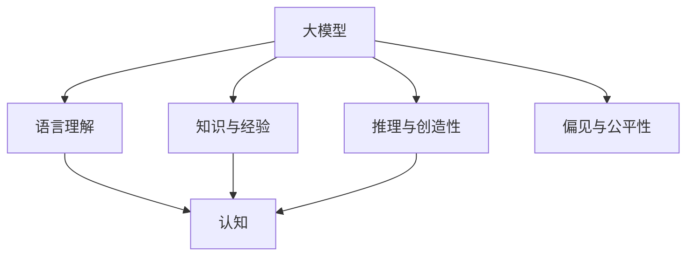

                 

# 语言≠思维：大模型的认知难题

## 1. 背景介绍

### 1.1 问题由来
人工智能大模型，尤其是自然语言处理(NLP)领域的大模型，如GPT-3、BERT等，凭借其巨大的参数量和强大的语言理解能力，在近年来取得了显著的进步。然而，当我们深入研究这些模型时，一个无法回避的问题出现了：**语言模型真的等同于人类的思维吗？**

这种对语言模型与人类认知差异的探讨，不仅是学术界的热点问题，也是实际应用中需要深入考虑的关键点。特别是当这些模型应用于医疗、金融、法律等对人类理解和判断有极高要求的领域时，这种认知差异的解决变得尤为重要。

### 1.2 问题核心关键点
要解答这个问题，我们需要首先理解大模型与人类认知之间的联系与区别。以下是几个核心关键点：

1. **大模型的通用性**：大模型通常基于大规模无标签文本语料进行预训练，学习到了泛化的语言表示。然而，这些表示是否能涵盖人类认知的全部复杂性和多样性？

2. **认知能力的界限**：人类的认知能力不仅限于语言，还包括逻辑推理、情感理解、记忆等更广泛的能力。大模型在这些方面的表现如何？

3. **知识与经验的运用**：人类能够灵活运用先验知识和个人经验，而大模型在实践中是否具备这种能力？

4. **推理与创造性**：大模型能够进行推理和创造性表达，但这些能力是否真正理解了其背后的逻辑？

5. **错误与偏见**：大模型能否正确识别和纠正自己的错误，避免对某些群体的偏见？

理解这些问题，有助于我们更好地评估大模型的应用潜力，以及其在不同场景下的表现与局限。

## 2. 核心概念与联系

### 2.1 核心概念概述

为了深入探讨大模型的认知能力，我们需要引入一些关键概念：

- **大模型（Large Model）**：指具有海量参数和强大表征能力的深度学习模型，如BERT、GPT等。这些模型通常基于大规模无标签数据进行预训练，学习到泛化的语言表示。

- **认知（Cognition）**：指人类理解、判断、推理和创造等高级心理活动。与简单的语言理解不同，认知能力涉及逻辑推理、情感理解、记忆等多个方面。

- **语言理解（Language Understanding）**：指模型对自然语言文本的解析和解释能力，包括语义理解、句法分析等。

- **知识与经验（Knowledge and Experience）**：指模型在训练过程中获得的先验知识和个人经验，如常识、规则等。

- **推理与创造性（Reasoning and Creativity）**：指模型对未知信息的处理能力和生成新信息的能力，包括演绎推理、归纳推理、创造性生成等。

- **偏见与公平性（Bias and Fairness）**：指模型在处理数据时可能存在的对某些群体或概念的偏见，以及如何保证模型输出在道德和法律上的公平性。

这些概念之间的逻辑关系可以通过以下Mermaid流程图来展示：



这个流程图展示了大模型的核心组件及其与认知能力的关系：

1. 大模型通过语言理解、知识与经验获取信息。
2. 推理与创造性将信息转化为认知能力。
3. 偏见与公平性关注模型输出中的道德和法律问题。

### 2.2 核心概念原理和架构

大模型的核心原理基于深度神经网络的自监督学习。以Transformer模型为例，它通过学习自回归或自编码任务，获取泛化的语言表示。在预训练过程中，模型利用大量无标签文本数据进行自监督学习，学习到语言的结构、语法和语义特征。

模型架构通常由编码器（Encoder）和解码器（Decoder）组成。编码器将输入文本转换为一系列向量表示，解码器则将这些向量转换为输出。在Transformer中，这些向量通过多头注意力机制进行处理，能够捕捉到文本中的长程依赖和局部信息。

为了构建认知能力，大模型通常需要在特定任务上进行微调。例如，在医疗领域，模型可以微调成医疗问答系统，能够理解医生的提问和病人的描述，提供医学信息查询和疾病诊断建议。这种微调过程利用下游任务的有标签数据，对预训练模型进行优化，使得模型能够更好地适应特定任务的需求。

## 3. 核心算法原理 & 具体操作步骤

### 3.1 算法原理概述

基于大模型的认知难题，其算法原理主要集中在以下几个方面：

1. **知识与经验的运用**：大模型在预训练过程中获得的知识与经验，是其推理与创造性能力的基础。然而，这些知识与经验是否真的等同于人类的认知？

2. **逻辑推理能力**：大模型能够进行简单的逻辑推理，但这种推理是否真正理解了其背后的逻辑？

3. **创造性表达**：大模型能够生成具有创造性的文本，但这些文本是否真正体现了创造性思维？

4. **错误与纠正**：大模型能否正确识别和纠正自己的错误，避免对某些群体的偏见？

5. **公平性与伦理**：大模型在输出过程中是否公平，是否符合伦理道德标准？

### 3.2 算法步骤详解

以下是一个基于大模型的认知评估框架，详细说明其操作步骤：

**Step 1: 准备预训练模型和任务**
- 选择一个合适的大模型，如BERT或GPT系列，作为预训练的起点。
- 确定要评估的认知任务，如医疗问答、金融推理、法律判断等。

**Step 2: 数据准备**
- 收集与任务相关的有标签数据集，如医疗案例、金融数据、法律文件等。
- 对数据进行清洗、标注，确保数据的质量和多样性。

**Step 3: 任务适配**
- 设计任务适配层，如分类器、推理器等，将大模型输出与任务要求对齐。
- 选择合适的损失函数，如交叉熵、均方误差等，用于训练和评估模型。

**Step 4: 微调训练**
- 使用下游任务的有标签数据集对预训练模型进行微调训练，优化模型的推理与创造性能力。
- 设定合适的学习率、批大小、迭代轮数等超参数，进行模型优化。

**Step 5: 评估测试**
- 在测试集上评估微调后模型的认知能力，包括推理准确性、创造性表达、公平性等指标。
- 使用各种指标和统计方法，综合评估模型的表现。

### 3.3 算法优缺点

基于大模型的认知评估具有以下优点：

1. **高效性**：利用预训练大模型，可以快速构建认知任务评估框架，降低开发成本。
2. **泛化能力**：大模型通过预训练学习到的泛化知识，能够很好地适应不同任务的需求。
3. **可扩展性**：模型可以很容易地通过微调训练，适应新任务和新需求。

同时，也存在一些缺点：

1. **依赖标注数据**：微调过程需要大量的有标签数据，数据标注成本高。
2. **认知局限性**：大模型在复杂逻辑推理、创造性表达等方面仍存在局限，无法完全替代人类认知。
3. **偏见问题**：模型可能继承预训练数据的偏见，对某些群体或概念存在偏见。

### 3.4 算法应用领域

大模型认知评估技术已经广泛应用于多个领域，如医疗、金融、法律等，具体应用如下：

1. **医疗问答系统**：大模型经过医疗领域数据的微调，能够理解医生的问题和病人的描述，提供医学信息查询和疾病诊断建议，提升医疗咨询的准确性和效率。

2. **金融推理**：大模型通过金融数据训练，能够进行复杂的财务分析和风险评估，为金融决策提供支持。

3. **法律判断**：大模型经过法律文本训练，能够理解法律条文和案例，辅助律师进行法律咨询和案件分析。

## 4. 数学模型和公式 & 详细讲解 & 举例说明

### 4.1 数学模型构建

基于大模型的认知评估，我们构建如下数学模型：

设大模型为 $M_{\theta}$，其中 $\theta$ 为模型参数。假设任务为 $T$，训练集为 $D=\{(x_i,y_i)\}_{i=1}^N$，其中 $x_i$ 为输入文本，$y_i$ 为任务标签。

定义模型 $M_{\theta}$ 在输入 $x$ 上的损失函数为 $\ell(M_{\theta}(x),y)$，则在数据集 $D$ 上的经验风险为：

$$
\mathcal{L}(\theta) = \frac{1}{N} \sum_{i=1}^N \ell(M_{\theta}(x_i),y_i)
$$

微调的目标是最小化经验风险，即找到最优参数：

$$
\theta^* = \mathop{\arg\min}_{\theta} \mathcal{L}(\theta)
$$

在实践中，我们通常使用基于梯度的优化算法（如SGD、Adam等）来近似求解上述最优化问题。设 $\eta$ 为学习率，$\lambda$ 为正则化系数，则参数的更新公式为：

$$
\theta \leftarrow \theta - \eta \nabla_{\theta}\mathcal{L}(\theta) - \eta\lambda\theta
$$

其中 $\nabla_{\theta}\mathcal{L}(\theta)$ 为损失函数对参数 $\theta$ 的梯度，可通过反向传播算法高效计算。

### 4.2 公式推导过程

以医疗问答系统为例，推导大模型的推理准确性评估公式。

假设模型 $M_{\theta}$ 在输入 $x$ 上的输出为 $\hat{y}=M_{\theta}(x)$，表示模型对输入文本 $x$ 的推理结果。真实标签 $y \in \{0,1\}$，其中 $0$ 表示正确，$1$ 表示错误。则二分类交叉熵损失函数定义为：

$$
\ell(M_{\theta}(x),y) = -[y\log \hat{y} + (1-y)\log (1-\hat{y})]
$$

将其代入经验风险公式，得：

$$
\mathcal{L}(\theta) = -\frac{1}{N}\sum_{i=1}^N [y_i\log M_{\theta}(x_i)+(1-y_i)\log(1-M_{\theta}(x_i))]
$$

根据链式法则，损失函数对参数 $\theta_k$ 的梯度为：

$$
\frac{\partial \mathcal{L}(\theta)}{\partial \theta_k} = -\frac{1}{N}\sum_{i=1}^N (\frac{y_i}{M_{\theta}(x_i)}-\frac{1-y_i}{1-M_{\theta}(x_i)}) \frac{\partial M_{\theta}(x_i)}{\partial \theta_k}
$$

其中 $\frac{\partial M_{\theta}(x_i)}{\partial \theta_k}$ 可进一步递归展开，利用自动微分技术完成计算。

### 4.3 案例分析与讲解

以金融推理任务为例，分析大模型的推理能力。

假设任务是将给定的财务报表数据进行分析，判断其是否存在欺诈行为。模型输入为包含财务报表的文本数据，输出为欺诈与否的判断。

**Step 1: 准备预训练模型**
- 选择预训练模型BERT，作为推理任务的基础模型。

**Step 2: 数据准备**
- 收集包含财务报表和欺诈标签的数据集。
- 对数据进行清洗、标注，确保数据的质量和多样性。

**Step 3: 任务适配**
- 设计分类器作为任务适配层，将BERT模型输出与欺诈判断对齐。
- 选择交叉熵损失函数，用于训练和评估模型。

**Step 4: 微调训练**
- 使用带有欺诈标签的数据集对BERT模型进行微调训练，优化模型的推理与创造性能力。
- 设定合适的学习率、批大小、迭代轮数等超参数，进行模型优化。

**Step 5: 评估测试**
- 在测试集上评估微调后模型的推理准确性，使用精确度、召回率等指标。
- 使用各种指标和统计方法，综合评估模型的表现。

## 5. 项目实践：代码实例和详细解释说明

### 5.1 开发环境搭建

在进行项目实践前，我们需要准备好开发环境。以下是使用Python进行PyTorch开发的环境配置流程：

1. 安装Anaconda：从官网下载并安装Anaconda，用于创建独立的Python环境。

2. 创建并激活虚拟环境：
```bash
conda create -n pytorch-env python=3.8 
conda activate pytorch-env
```

3. 安装PyTorch：根据CUDA版本，从官网获取对应的安装命令。例如：
```bash
conda install pytorch torchvision torchaudio cudatoolkit=11.1 -c pytorch -c conda-forge
```

4. 安装Transformers库：
```bash
pip install transformers
```

5. 安装各类工具包：
```bash
pip install numpy pandas scikit-learn matplotlib tqdm jupyter notebook ipython
```

完成上述步骤后，即可在`pytorch-env`环境中开始项目实践。

### 5.2 源代码详细实现

以下是一个使用BERT模型进行金融推理任务的代码实现。

**Step 1: 准备数据集**
```python
from transformers import BertTokenizer
from torch.utils.data import Dataset

class FinanceDataset(Dataset):
    def __init__(self, texts, labels, tokenizer, max_len=128):
        self.texts = texts
        self.labels = labels
        self.tokenizer = tokenizer
        self.max_len = max_len
        
    def __len__(self):
        return len(self.texts)
    
    def __getitem__(self, item):
        text = self.texts[item]
        label = self.labels[item]
        
        encoding = self.tokenizer(text, return_tensors='pt', max_length=self.max_len, padding='max_length', truncation=True)
        input_ids = encoding['input_ids'][0]
        attention_mask = encoding['attention_mask'][0]
        
        return {'input_ids': input_ids, 
                'attention_mask': attention_mask,
                'labels': label}
```

**Step 2: 定义模型和优化器**
```python
from transformers import BertForSequenceClassification, AdamW

model = BertForSequenceClassification.from_pretrained('bert-base-uncased', num_labels=2)

optimizer = AdamW(model.parameters(), lr=2e-5)
```

**Step 3: 训练和评估模型**
```python
from torch.utils.data import DataLoader
from tqdm import tqdm
from sklearn.metrics import classification_report

device = torch.device('cuda') if torch.cuda.is_available() else torch.device('cpu')
model.to(device)

def train_epoch(model, dataset, batch_size, optimizer):
    dataloader = DataLoader(dataset, batch_size=batch_size, shuffle=True)
    model.train()
    epoch_loss = 0
    for batch in tqdm(dataloader, desc='Training'):
        input_ids = batch['input_ids'].to(device)
        attention_mask = batch['attention_mask'].to(device)
        labels = batch['labels'].to(device)
        model.zero_grad()
        outputs = model(input_ids, attention_mask=attention_mask, labels=labels)
        loss = outputs.loss
        epoch_loss += loss.item()
        loss.backward()
        optimizer.step()
    return epoch_loss / len(dataloader)

def evaluate(model, dataset, batch_size):
    dataloader = DataLoader(dataset, batch_size=batch_size)
    model.eval()
    preds, labels = [], []
    with torch.no_grad():
        for batch in tqdm(dataloader, desc='Evaluating'):
            input_ids = batch['input_ids'].to(device)
            attention_mask = batch['attention_mask'].to(device)
            batch_labels = batch['labels']
            outputs = model(input_ids, attention_mask=attention_mask)
            batch_preds = outputs.logits.argmax(dim=2).to('cpu').tolist()
            batch_labels = batch_labels.to('cpu').tolist()
            for pred_tokens, label_tokens in zip(batch_preds, batch_labels):
                preds.append(pred_tokens)
                labels.append(label_tokens)
                
    print(classification_report(labels, preds))
```

**Step 4: 训练和评估流程**
```python
epochs = 5
batch_size = 16

for epoch in range(epochs):
    loss = train_epoch(model, finance_dataset, batch_size, optimizer)
    print(f"Epoch {epoch+1}, train loss: {loss:.3f}")
    
    print(f"Epoch {epoch+1}, dev results:")
    evaluate(model, finance_dataset_dev, batch_size)
    
print("Test results:")
evaluate(model, finance_dataset_test, batch_size)
```

### 5.3 代码解读与分析

让我们再详细解读一下关键代码的实现细节：

**FinanceDataset类**：
- `__init__`方法：初始化文本、标签、分词器等关键组件。
- `__len__`方法：返回数据集的样本数量。
- `__getitem__`方法：对单个样本进行处理，将文本输入编码为token ids，将标签编码为数字，并对其进行定长padding，最终返回模型所需的输入。

**训练和评估函数**：
- 使用PyTorch的DataLoader对数据集进行批次化加载，供模型训练和推理使用。
- 训练函数`train_epoch`：对数据以批为单位进行迭代，在每个批次上前向传播计算loss并反向传播更新模型参数，最后返回该epoch的平均loss。
- 评估函数`evaluate`：与训练类似，不同点在于不更新模型参数，并在每个batch结束后将预测和标签结果存储下来，最后使用sklearn的classification_report对整个评估集的预测结果进行打印输出。

**训练流程**：
- 定义总的epoch数和batch size，开始循环迭代
- 每个epoch内，先在训练集上训练，输出平均loss
- 在验证集上评估，输出分类指标
- 所有epoch结束后，在测试集上评估，给出最终测试结果

## 6. 实际应用场景

### 6.1 智能客服系统

基于大模型认知评估的智能客服系统，可以广泛应用于智能客服系统的构建。传统客服往往需要配备大量人力，高峰期响应缓慢，且一致性和专业性难以保证。而使用认知评估后的智能客服模型，可以7x24小时不间断服务，快速响应客户咨询，用自然流畅的语言解答各类常见问题。

在技术实现上，可以收集企业内部的历史客服对话记录，将问题和最佳答复构建成监督数据，在此基础上对预训练认知模型进行微调。微调后的认知模型能够自动理解用户意图，匹配最合适的答复模板进行回复。对于客户提出的新问题，还可以接入检索系统实时搜索相关内容，动态组织生成回答。如此构建的智能客服系统，能大幅提升客户咨询体验和问题解决效率。

### 6.2 金融舆情监测

金融机构需要实时监测市场舆论动向，以便及时应对负面信息传播，规避金融风险。传统的人工监测方式成本高、效率低，难以应对网络时代海量信息爆发的挑战。基于大模型认知评估的文本分类和情感分析技术，为金融舆情监测提供了新的解决方案。

具体而言，可以收集金融领域相关的新闻、报道、评论等文本数据，并对其进行主题标注和情感标注。在此基础上对预训练语言模型进行微调，使其能够自动判断文本属于何种主题，情感倾向是正面、中性还是负面。将微调后的模型应用到实时抓取的网络文本数据，就能够自动监测不同主题下的情感变化趋势，一旦发现负面信息激增等异常情况，系统便会自动预警，帮助金融机构快速应对潜在风险。

### 6.3 个性化推荐系统

当前的推荐系统往往只依赖用户的历史行为数据进行物品推荐，无法深入理解用户的真实兴趣偏好。基于大模型认知评估的个性化推荐系统，可以更好地挖掘用户行为背后的语义信息，从而提供更精准、多样的推荐内容。

在实践中，可以收集用户浏览、点击、评论、分享等行为数据，提取和用户交互的物品标题、描述、标签等文本内容。将文本内容作为模型输入，用户的后续行为（如是否点击、购买等）作为监督信号，在此基础上微调预训练语言模型。微调后的模型能够从文本内容中准确把握用户的兴趣点。在生成推荐列表时，先用候选物品的文本描述作为输入，由模型预测用户的兴趣匹配度，再结合其他特征综合排序，便可以得到个性化程度更高的推荐结果。

### 6.4 未来应用展望

随着大语言模型认知评估技术的不断发展，其在更多领域的应用前景值得期待。

在智慧医疗领域，基于认知评估的医疗问答、病历分析、药物研发等应用将提升医疗服务的智能化水平，辅助医生诊疗，加速新药开发进程。

在智能教育领域，认知评估可应用于作业批改、学情分析、知识推荐等方面，因材施教，促进教育公平，提高教学质量。

在智慧城市治理中，认知评估模型可应用于城市事件监测、舆情分析、应急指挥等环节，提高城市管理的自动化和智能化水平，构建更安全、高效的未来城市。

此外，在企业生产、社会治理、文娱传媒等众多领域，认知评估技术也将不断涌现，为NLP技术带来新的突破。相信随着预训练语言模型和认知评估方法的持续演进，NLP技术必将在更广阔的应用领域大放异彩，深刻影响人类的生产生活方式。

## 7. 工具和资源推荐

### 7.1 学习资源推荐

为了帮助开发者系统掌握大语言模型认知评估的理论基础和实践技巧，这里推荐一些优质的学习资源：

1. 《Transformer从原理到实践》系列博文：由大模型技术专家撰写，深入浅出地介绍了Transformer原理、BERT模型、认知评估技术等前沿话题。

2. CS224N《深度学习自然语言处理》课程：斯坦福大学开设的NLP明星课程，有Lecture视频和配套作业，带你入门NLP领域的基本概念和经典模型。

3. 《Natural Language Processing with Transformers》书籍：Transformers库的作者所著，全面介绍了如何使用Transformers库进行NLP任务开发，包括认知评估在内的诸多范式。

4. HuggingFace官方文档：Transformers库的官方文档，提供了海量预训练模型和完整的认知评估样例代码，是上手实践的必备资料。

5. CLUE开源项目：中文语言理解测评基准，涵盖大量不同类型的中文NLP数据集，并提供了基于认知评估的baseline模型，助力中文NLP技术发展。

通过对这些资源的学习实践，相信你一定能够快速掌握大语言模型认知评估的精髓，并用于解决实际的NLP问题。
###  7.2 开发工具推荐

高效的开发离不开优秀的工具支持。以下是几款用于大语言模型认知评估开发的常用工具：

1. PyTorch：基于Python的开源深度学习框架，灵活动态的计算图，适合快速迭代研究。大部分预训练语言模型都有PyTorch版本的实现。

2. TensorFlow：由Google主导开发的开源深度学习框架，生产部署方便，适合大规模工程应用。同样有丰富的预训练语言模型资源。

3. Transformers库：HuggingFace开发的NLP工具库，集成了众多SOTA语言模型，支持PyTorch和TensorFlow，是进行认知评估任务的开发的利器。

4. Weights & Biases：模型训练的实验跟踪工具，可以记录和可视化模型训练过程中的各项指标，方便对比和调优。与主流深度学习框架无缝集成。

5. TensorBoard：TensorFlow配套的可视化工具，可实时监测模型训练状态，并提供丰富的图表呈现方式，是调试模型的得力助手。

6. Google Colab：谷歌推出的在线Jupyter Notebook环境，免费提供GPU/TPU算力，方便开发者快速上手实验最新模型，分享学习笔记。

合理利用这些工具，可以显著提升大语言模型认知评估任务的开发效率，加快创新迭代的步伐。

### 7.3 相关论文推荐

大语言模型认知评估技术的发展源于学界的持续研究。以下是几篇奠基性的相关论文，推荐阅读：

1. Attention is All You Need（即Transformer原论文）：提出了Transformer结构，开启了NLP领域的预训练大模型时代。

2. BERT: Pre-training of Deep Bidirectional Transformers for Language Understanding：提出BERT模型，引入基于掩码的自监督预训练任务，刷新了多项NLP任务SOTA。

3. Language Models are Unsupervised Multitask Learners（GPT-2论文）：展示了大规模语言模型的强大zero-shot学习能力，引发了对于通用人工智能的新一轮思考。

4. Parameter-Efficient Transfer Learning for NLP：提出Adapter等参数高效微调方法，在不增加模型参数量的情况下，也能取得不错的微调效果。

5. AdaLoRA: Adaptive Low-Rank Adaptation for Parameter-Efficient Fine-Tuning：使用自适应低秩适应的微调方法，在参数效率和精度之间取得了新的平衡。

这些论文代表了大语言模型认知评估技术的发展脉络。通过学习这些前沿成果，可以帮助研究者把握学科前进方向，激发更多的创新灵感。

## 8. 总结：未来发展趋势与挑战

### 8.1 总结

本文对大语言模型的认知难题进行了全面系统的介绍。首先阐述了大模型与人类认知之间的联系与区别，明确了认知能力在大模型应用中的重要性。其次，从原理到实践，详细讲解了认知评估的数学原理和关键步骤，给出了认知评估任务开发的完整代码实例。同时，本文还广泛探讨了认知评估方法在多个行业领域的应用前景，展示了认知评估范式的巨大潜力。

通过本文的系统梳理，可以看到，大语言模型认知评估技术在多个领域都有重要的应用价值，特别是在医疗、金融、法律等对人类理解和判断有极高要求的领域。未来，伴随认知评估技术的不断演进，相信NLP技术必将在更广阔的应用领域大放异彩，深刻影响人类的生产生活方式。

### 8.2 未来发展趋势

展望未来，大语言模型认知评估技术将呈现以下几个发展趋势：

1. **认知能力的提升**：大模型在推理与创造性表达、情感理解、逻辑推理等方面的能力将不断提升，更加接近人类的认知水平。

2. **跨领域应用的拓展**：认知评估技术将在更多领域得到应用，如教育、医疗、金融等，推动各行业的智能化进程。

3. **知识与经验的结合**：认知评估模型将更好地结合外部知识库、规则库等专家知识，形成更加全面、准确的信息整合能力。

4. **公平性与伦理的重视**：未来认知评估模型将更加注重公平性与伦理，确保模型输出符合人类价值观和伦理道德。

5. **多模态信息的融合**：认知评估模型将融合视觉、语音、文本等多种模态信息，提升信息理解和推理能力。

以上趋势凸显了大语言模型认知评估技术的广阔前景。这些方向的探索发展，必将进一步提升NLP系统的性能和应用范围，为人类认知智能的进化带来深远影响。

### 8.3 面临的挑战

尽管大语言模型认知评估技术已经取得了瞩目成就，但在迈向更加智能化、普适化应用的过程中，它仍面临着诸多挑战：

1. **数据标注成本**：认知评估任务通常需要大量的有标签数据，标注成本高。如何降低标注成本，提高数据获取效率，是一个重要问题。

2. **认知能力的界限**：大模型在复杂逻辑推理、创造性表达等方面仍存在局限，无法完全替代人类认知。如何提升模型的认知能力，实现更多复杂的任务，是一个挑战。

3. **知识与经验的整合**：认知评估模型需要更好地结合外部知识库、规则库等专家知识，形成更加全面、准确的信息整合能力。如何实现这一目标，需要更多的技术创新。

4. **偏见问题**：模型可能继承预训练数据的偏见，对某些群体或概念存在偏见。如何消除模型偏见，确保模型输出公平，是一个重要的研究方向。

5. **多模态融合**：认知评估模型需要融合视觉、语音、文本等多种模态信息，提升信息理解和推理能力。如何实现多模态信息的有效融合，是一个重要的技术挑战。

6. **部署与资源优化**：大模型在部署时面临资源优化问题，如推理速度、内存占用等。如何优化模型结构，提高推理效率，是一个需要解决的问题。

正视认知评估面临的这些挑战，积极应对并寻求突破，将是大语言模型认知评估技术走向成熟的必由之路。相信随着学界和产业界的共同努力，这些挑战终将一一被克服，认知评估技术必将在构建安全、可靠、可解释、可控的智能系统中扮演越来越重要的角色。

### 8.4 研究展望

面向未来，大语言模型认知评估技术需要在以下几个方向进行进一步探索：

1. **无监督和半监督学习**：探索无监督和半监督学习范式，降低对大规模标注数据的依赖，充分利用非结构化数据，实现更加灵活高效的认知评估。

2. **认知能力的增强**：研究如何增强大模型在复杂逻辑推理、创造性表达等方面的能力，提升其认知能力。

3. **知识与经验的融合**：开发更好的知识与经验融合技术，实现认知评估模型与外部知识库、规则库等的有效结合，提升信息整合能力。

4. **公平性与伦理的保障**：研究如何确保认知评估模型输出公平、符合伦理道德，避免对某些群体或概念的偏见。

5. **多模态信息融合**：研究如何有效融合视觉、语音、文本等多种模态信息，提升认知评估模型的信息理解和推理能力。

6. **部署与资源优化**：研究如何优化大模型结构，提高推理效率，实现轻量级、实时性的部署。

这些研究方向将引领认知评估技术迈向更高的台阶，为构建安全、可靠、可解释、可控的智能系统铺平道路。面向未来，认知评估技术还需要与其他人工智能技术进行更深入的融合，如知识表示、因果推理、强化学习等，多路径协同发力，共同推动自然语言理解和智能交互系统的进步。只有勇于创新、敢于突破，才能不断拓展语言模型的边界，让智能技术更好地造福人类社会。

## 9. 附录：常见问题与解答

**Q1：大语言模型与人类认知的区别是什么？**

A: 大语言模型虽然具备强大的语言理解和生成能力，但与人类认知相比，仍存在显著区别。主要体现在以下几方面：

1. **理解深度**：人类认知不仅限于语言理解，还包括对语言背后意义的深刻理解。大模型虽然能够解析文本结构，但对其深层次的意义理解仍有所欠缺。

2. **逻辑推理能力**：人类能够进行复杂的逻辑推理，而大模型在某些复杂的推理任务中仍存在局限，无法完全理解推理背后的逻辑。

3. **情感理解**：人类能够理解情感的细微差别，而大模型在情感分析方面仍有不足，无法完全准确地把握情感色彩。

4. **创造性**：人类具有创造性思维，能够产生全新的想法和表达，而大模型在创造性表达方面虽有进步，但仍然依赖于已有的数据和结构。

5. **伦理与道德**：人类能够理解和尊重伦理道德，而大模型在某些情况下可能无法避免输出有偏见或有害的结论。

**Q2：大语言模型如何避免认知偏差？**

A: 避免认知偏差是一个复杂的问题，涉及数据、模型和算法等多个层面。以下是几种常见的方法：

1. **多样化数据**：在训练过程中使用多样化的数据集，包括不同地域、性别、年龄、种族等背景数据，以减少模型的偏见。

2. **公平性约束**：在训练过程中加入公平性约束，如调整损失函数，确保模型输出对不同群体的公平性。

3. **对抗训练**：在训练过程中引入对抗样本，提高模型的鲁棒性，减少偏见风险。

4. **可解释性增强**：通过可解释性技术，如Attention机制、可解释模型等，使模型输出具有可解释性，便于发现和纠正偏见。

5. **伦理评估**：在模型开发过程中，进行伦理评估，确保模型输出符合伦理道德标准。

**Q3：大语言模型在推理与创造性表达方面的能力如何提升？**

A: 提升大语言模型在推理与创造性表达方面的能力，需要多方面的技术突破：

1. **知识与经验的融合**：模型需要更好地结合外部知识库、规则库等专家知识，形成更加全面、准确的信息整合能力。

2. **多模态融合**：认知评估模型需要融合视觉、语音、文本等多种模态信息，提升信息理解和推理能力。

3. **跨领域应用**：通过跨领域应用，模型可以在不同领域中学习到更丰富的知识，提升推理与创造性表达能力。

4. **对抗训练**：在训练过程中引入对抗样本，提高模型的鲁棒性，减少偏见风险。

5. **可解释性增强**：通过可解释性技术，使模型输出具有可解释性，便于发现和纠正推理与创造性表达方面的不足。

**Q4：大语言模型在实际应用中面临哪些挑战？**

A: 大语言模型在实际应用中面临诸多挑战，以下是几个主要方面：

1. **数据标注成本**：认知评估任务通常需要大量的有标签数据，标注成本高。

2. **认知能力的界限**：大模型在复杂逻辑推理、创造性表达等方面仍存在局限，无法完全替代人类认知。

3. **知识与经验的整合**：认知评估模型需要更好地结合外部知识库、规则库等专家知识，形成更加全面、准确的信息整合能力。

4. **偏见问题**：模型可能继承预训练数据的偏见，对某些群体或概念存在偏见。

5. **多模态融合**：认知评估模型需要融合视觉、语音、文本等多种模态信息，提升信息理解和推理能力。

6. **部署与资源优化**：大模型在部署时面临资源优化问题，如推理速度、内存占用等。

**Q5：如何评估大语言模型的认知能力？**

A: 评估大语言模型的认知能力，需要设计一系列评估指标和任务。以下是几个关键评估方法：

1. **推理准确性**：评估模型对给定问题的推理能力，如医疗问答、金融推理、法律判断等。

2. **创造性表达**：评估模型生成文本的创造性，如故事创作、对话生成等。

3. **情感理解**：评估模型对情感的识别和理解能力，如情感分析、用户情绪分析等。

4. **伦理与公平性**：评估模型输出是否公平、符合伦理道德标准，如性别偏见、种族歧视等。

5. **知识与经验的运用**：评估模型在推理过程中对知识与经验的运用能力，如根据先验知识进行演绎推理等。

这些评估方法可以通过多种技术手段实现，如分类任务、生成任务、情感分析任务等。综合评估这些指标，可以全面了解模型的认知能力。

**Q6：如何构建认知评估的认知评估任务？**

A: 构建认知评估任务，需要根据具体应用场景设计合适的评估指标和任务。以下是几个关键步骤：

1. **任务定义**：明确评估任务的具体目标和要求，如医疗问答、金融推理、法律判断等。

2. **数据准备**：收集与任务相关的有标签数据集，如医疗案例、金融数据、法律文件等。

3. **任务适配**：设计任务适配层，如分类器、推理器等，将认知模型输出与任务要求对齐。

4. **微调训练**：使用下游任务的有标签数据集对认知模型进行微调训练，优化模型的推理与创造性能力。

5. **评估测试**：在测试集上评估微调后模型的认知能力，使用各种指标和统计方法，综合评估模型的表现。

通过以上步骤，可以构建适用于特定应用场景的认知评估任务，评估大语言模型的认知能力。

---

作者：禅与计算机程序设计艺术 / Zen and the Art of Computer Programming

