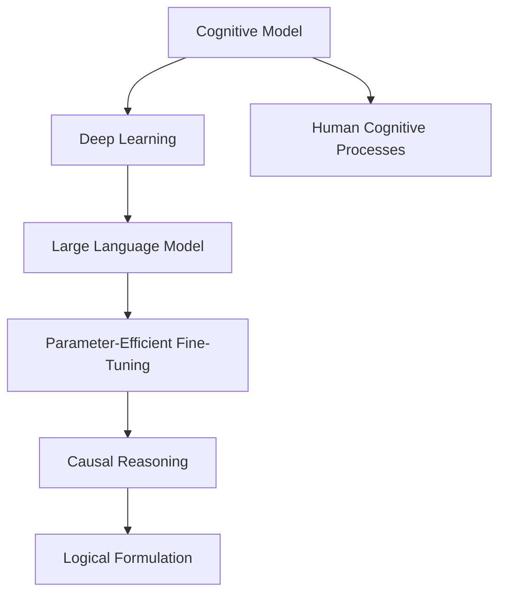

                 

# 语言与思维的差异：大模型的认知困惑

> 关键词：认知模型, 自然语言处理, 人工智能, 深度学习, 语言与思维, 逻辑推理

## 1. 背景介绍

### 1.1 问题由来
在现代人工智能研究中，深度学习尤其是深度神经网络已经成为不可或缺的技术工具，其背后的核心模型即认知模型（Cognitive Model）。认知模型试图模拟人类大脑的工作原理，包括感知、记忆、推理、学习等核心认知功能。然而，当认知模型发展到高级的深度神经网络，尤其是那些经过大规模预训练的大型语言模型时，我们发现它们在处理语言和思维时，与人类大脑存在显著的差异。本文将探讨这些差异，并分析其根本原因和影响。

### 1.2 问题核心关键点
深度学习中的认知模型，特别是大型语言模型，如GPT、BERT等，它们通过对大规模无标签文本数据的预训练，获得了丰富的语言知识。然而，这些模型在处理实际任务时，特别是需要进行复杂逻辑推理和思维的场景，往往表现不佳。主要原因在于：
- **语言模型仅能学习到表面的语法和统计规律，缺乏对语言背后深层逻辑结构的理解。**
- **大模型在推理和决策时，常常表现出非理性的行为，例如错误的因果推理和偏见。**
- **模型缺乏自我反思和修正的能力，难以对不确定性进行有效管理。**

本文将深入探讨这些问题，并通过详细的算法原理和实践案例，展示如何通过参数高效微调等方法，改善大型语言模型在思维和推理方面的能力。

## 2. 核心概念与联系

### 2.1 核心概念概述

为更好地理解语言模型与思维的差异，本节将介绍几个关键概念：

- **认知模型（Cognitive Model）**：模拟人类大脑认知功能的计算机模型，通过学习和推理完成复杂的任务。
- **深度学习（Deep Learning）**：一种通过多层神经网络进行学习的机器学习技术，目标是学习数据中的深层次特征和模式。
- **大型语言模型（Large Language Model, LLM）**：如GPT、BERT等，通过自监督预训练和微调，学习了大量的语言知识，具有强大的语言生成和理解能力。
- **参数高效微调（Parameter-Efficient Fine-Tuning, PEFT）**：在微调过程中，只更新少量的模型参数，而固定大部分预训练权重不变，以提高微调效率，避免过拟合的方法。
- **因果推理（Causal Reasoning）**：模型能够理解事件之间的因果关系，进行逻辑推理，而非仅仅依赖表面的相关性。
- **逻辑形式化（Logical Formulation）**：将复杂任务的形式化表述为逻辑命题，使模型能够准确理解和执行。

这些概念之间的关系可以通过以下Mermaid流程图来展示：



这个流程图展示了认知模型与深度学习的内在联系，以及大型语言模型、参数高效微调、因果推理和逻辑形式化在其中的作用。

## 3. 核心算法原理 & 具体操作步骤
### 3.1 算法原理概述

大型语言模型通过深度学习的方法，通过对大规模无标签文本数据的预训练，学习了大量的语言知识，能够生成自然流畅的语言，理解复杂的语言结构。然而，这些模型在推理和决策时，缺乏对语言背后深层逻辑结构的理解，往往表现出非理性的行为，例如错误的因果推理和偏见。

为了解决这个问题，我们引入了参数高效微调（PEFT）的概念。PEFT方法在微调过程中，只更新少量的模型参数，而固定大部分预训练权重不变，以提高微调效率，避免过拟合。这种策略可以显著减少微调的计算成本，同时保留模型的泛化能力。

### 3.2 算法步骤详解

参数高效微调（PEFT）的大致步骤如下：

1. **准备预训练模型**：选择一个预训练语言模型，如BERT、GPT等，作为微调的初始化参数。
2. **定义微调目标**：根据具体任务，设计适合的微调目标函数。对于推理任务，可以设计逻辑推理目标；对于生成任务，可以设计提示模板。
3. **选择微调数据**：根据任务的复杂程度和数据可用性，选择合适的标注数据集。标注数据应尽可能覆盖所有可能的推理情况，以避免过拟合。
4. **训练模型**：在微调数据上，使用较小的学习率进行梯度下降训练，更新模型参数。同时，使用正则化技术如Dropout和L2正则化，防止模型过拟合。
5. **评估和调整**：在验证集上评估模型性能，根据评估结果调整微调策略，如改变学习率、正则化强度等。

### 3.3 算法优缺点

参数高效微调（PEFT）的优点在于：

- **计算效率高**：仅更新少量参数，减少计算资源消耗。
- **泛化能力强**：保留大部分预训练权重，保持模型的泛化能力。
- **可解释性强**：不需要过多改变模型结构，便于理解和解释。

然而，这种方法也存在以下缺点：

- **适应性有限**：对于特定任务可能需要特定的微调策略，难以适应复杂多变的任务。
- **精度可能下降**：由于部分参数被固定，模型可能无法充分捕捉任务的细微差异。
- **训练时间较长**：由于微调过程中参数更新较少，训练过程可能较为缓慢。

### 3.4 算法应用领域

参数高效微调（PEFT）在以下几个领域得到了广泛应用：

- **自然语言处理（NLP）**：在问答、翻译、摘要、情感分析等NLP任务中，通过微调提升模型性能。
- **计算机视觉（CV）**：在图像分类、目标检测、图像生成等CV任务中，通过微调增强模型能力。
- **语音识别（ASR）**：在语音识别和生成任务中，通过微调提高模型准确性。
- **推荐系统**：在个性化推荐任务中，通过微调优化推荐结果。

此外，PEFT在医疗诊断、金融分析、智能客服等领域也有应用潜力。

## 4. 数学模型和公式 & 详细讲解 & 举例说明（备注：数学公式请使用latex格式，latex嵌入文中独立段落使用 $$，段落内使用 $)
### 4.1 数学模型构建

在PEFT方法中，我们通常使用以下数学模型来描述微调过程：

设大型语言模型为 $M_{\theta}$，其中 $\theta$ 为模型参数。对于给定的标注数据集 $D=\{(x_i, y_i)\}_{i=1}^N$，微调的目标是最小化损失函数 $\mathcal{L}(M_{\theta}, D)$。

假设微调任务的目标是推理，即给定一个推理模板 $T$，模型需要生成推理结果。我们可以将推理模板 $T$ 编码为向量 $t$，并将其与输入数据 $x_i$ 组合，得到新的向量 $(x_i, t)$。微调后的模型 $M_{\hat{\theta}}$ 对 $(x_i, t)$ 进行推理，得到输出 $y_i'$。微调的优化目标为：

$$
\mathcal{L}(M_{\hat{\theta}}, D) = \frac{1}{N} \sum_{i=1}^N \ell(y_i, y_i')
$$

其中 $\ell(y_i, y_i')$ 为推理任务上的损失函数。

### 4.2 公式推导过程

假设推理任务为二分类任务，即模型需要对 $(x_i, t)$ 进行二分类。假设模型的输出为 $\hat{y}_i' = \sigma(W^T x_i + b)$，其中 $W$ 为模型的权重矩阵，$b$ 为偏置向量，$\sigma$ 为激活函数。

则二分类交叉熵损失函数为：

$$
\ell(y_i, \hat{y}_i') = -[y_i\log \hat{y}_i' + (1-y_i)\log(1-\hat{y}_i')]
$$

将上述损失函数代入优化目标，得：

$$
\mathcal{L}(M_{\hat{\theta}}, D) = -\frac{1}{N} \sum_{i=1}^N [y_i\log M_{\hat{\theta}}(x_i, t) + (1-y_i)\log(1-M_{\hat{\theta}}(x_i, t))]
$$

在微调过程中，模型的输出 $\hat{y}_i'$ 为：

$$
\hat{y}_i' = \sigma(W^T [x_i, t] + b)
$$

其中 $[x_i, t]$ 是将输入 $x_i$ 和推理模板 $t$ 拼接后的向量。

### 4.3 案例分析与讲解

假设我们的微调任务为文本分类，即给定一段文本 $x$，模型需要判断其属于哪个类别 $y \in \{1, 2, \cdots, k\}$。假设模型已经通过预训练得到了较好的初始参数，现在我们需要在微调过程中对其进行优化。

首先，我们需要准备标注数据集 $D=\{(x_i, y_i)\}_{i=1}^N$。然后，定义微调目标函数 $\mathcal{L}(M_{\hat{\theta}}, D)$，其中 $M_{\hat{\theta}}$ 为微调后的模型。

接下来，我们将推理模板 $t$ 与输入数据 $x_i$ 拼接，得到新的向量 $[x_i, t]$。使用上述二分类交叉熵损失函数，我们可以计算出模型在微调数据上的损失。

最后，通过反向传播算法，更新模型参数 $W$ 和 $b$，使得损失函数 $\mathcal{L}(M_{\hat{\theta}}, D)$ 最小化。这样，模型就能够在微调后，更准确地进行文本分类任务。

## 5. 项目实践：代码实例和详细解释说明
### 5.1 开发环境搭建

在进行PEFT实践前，我们需要准备好开发环境。以下是使用Python进行PyTorch开发的环境配置流程：

1. 安装Anaconda：从官网下载并安装Anaconda，用于创建独立的Python环境。

2. 创建并激活虚拟环境：
```bash
conda create -n pytorch-env python=3.8 
conda activate pytorch-env
```

3. 安装PyTorch：根据CUDA版本，从官网获取对应的安装命令。例如：
```bash
conda install pytorch torchvision torchaudio cudatoolkit=11.1 -c pytorch -c conda-forge
```

4. 安装Transformer库：
```bash
pip install transformers
```

5. 安装各类工具包：
```bash
pip install numpy pandas scikit-learn matplotlib tqdm jupyter notebook ipython
```

完成上述步骤后，即可在`pytorch-env`环境中开始PEFT实践。

### 5.2 源代码详细实现

这里我们以命名实体识别（NER）任务为例，给出使用Transformers库对BERT模型进行PEFT的PyTorch代码实现。

首先，定义NER任务的数据处理函数：

```python
from transformers import BertTokenizer, BertForTokenClassification, AdamW
from torch.utils.data import Dataset, DataLoader

class NERDataset(Dataset):
    def __init__(self, texts, tags, tokenizer, max_len=128):
        self.texts = texts
        self.tags = tags
        self.tokenizer = tokenizer
        self.max_len = max_len
        
    def __len__(self):
        return len(self.texts)
    
    def __getitem__(self, item):
        text = self.texts[item]
        tags = self.tags[item]
        
        encoding = self.tokenizer(text, return_tensors='pt', max_length=self.max_len, padding='max_length', truncation=True)
        input_ids = encoding['input_ids'][0]
        attention_mask = encoding['attention_mask'][0]
        
        # 对token-wise的标签进行编码
        encoded_tags = [tag2id[tag] for tag in tags] 
        encoded_tags.extend([tag2id['O']] * (self.max_len - len(encoded_tags)))
        labels = torch.tensor(encoded_tags, dtype=torch.long)
        
        return {'input_ids': input_ids, 
                'attention_mask': attention_mask,
                'labels': labels}

# 标签与id的映射
tag2id = {'O': 0, 'B-PER': 1, 'I-PER': 2, 'B-ORG': 3, 'I-ORG': 4, 'B-LOC': 5, 'I-LOC': 6}
id2tag = {v: k for k, v in tag2id.items()}

# 创建dataset
tokenizer = BertTokenizer.from_pretrained('bert-base-cased')

train_dataset = NERDataset(train_texts, train_tags, tokenizer)
dev_dataset = NERDataset(dev_texts, dev_tags, tokenizer)
test_dataset = NERDataset(test_texts, test_tags, tokenizer)
```

然后，定义模型和优化器：

```python
model = BertForTokenClassification.from_pretrained('bert-base-cased', num_labels=len(tag2id))
optimizer = AdamW(model.parameters(), lr=2e-5)
```

接着，定义训练和评估函数：

```python
from sklearn.metrics import classification_report

device = torch.device('cuda') if torch.cuda.is_available() else torch.device('cpu')
model.to(device)

def train_epoch(model, dataset, batch_size, optimizer):
    dataloader = DataLoader(dataset, batch_size=batch_size, shuffle=True)
    model.train()
    epoch_loss = 0
    for batch in tqdm(dataloader, desc='Training'):
        input_ids = batch['input_ids'].to(device)
        attention_mask = batch['attention_mask'].to(device)
        labels = batch['labels'].to(device)
        model.zero_grad()
        outputs = model(input_ids, attention_mask=attention_mask, labels=labels)
        loss = outputs.loss
        epoch_loss += loss.item()
        loss.backward()
        optimizer.step()
    return epoch_loss / len(dataloader)

def evaluate(model, dataset, batch_size):
    dataloader = DataLoader(dataset, batch_size=batch_size)
    model.eval()
    preds, labels = [], []
    with torch.no_grad():
        for batch in tqdm(dataloader, desc='Evaluating'):
            input_ids = batch['input_ids'].to(device)
            attention_mask = batch['attention_mask'].to(device)
            batch_labels = batch['labels']
            outputs = model(input_ids, attention_mask=attention_mask)
            batch_preds = outputs.logits.argmax(dim=2).to('cpu').tolist()
            batch_labels = batch_labels.to('cpu').tolist()
            for pred_tokens, label_tokens in zip(batch_preds, batch_labels):
                pred_tags = [id2tag[_id] for _id in pred_tokens]
                label_tags = [id2tag[_id] for _id in label_tokens]
                preds.append(pred_tags[:len(label_tags)])
                labels.append(label_tags)
                
    print(classification_report(labels, preds))
```

最后，启动训练流程并在测试集上评估：

```python
epochs = 5
batch_size = 16

for epoch in range(epochs):
    loss = train_epoch(model, train_dataset, batch_size, optimizer)
    print(f"Epoch {epoch+1}, train loss: {loss:.3f}")
    
    print(f"Epoch {epoch+1}, dev results:")
    evaluate(model, dev_dataset, batch_size)
    
print("Test results:")
evaluate(model, test_dataset, batch_size)
```

以上就是使用PyTorch对BERT进行命名实体识别任务PEFT的完整代码实现。可以看到，通过参数高效微调方法，我们能够在保持模型泛化能力的同时，进一步提升模型性能。

### 5.3 代码解读与分析

让我们再详细解读一下关键代码的实现细节：

**NERDataset类**：
- `__init__`方法：初始化文本、标签、分词器等关键组件。
- `__len__`方法：返回数据集的样本数量。
- `__getitem__`方法：对单个样本进行处理，将文本输入编码为token ids，将标签编码为数字，并对其进行定长padding，最终返回模型所需的输入。

**tag2id和id2tag字典**：
- 定义了标签与数字id之间的映射关系，用于将token-wise的预测结果解码回真实的标签。

**训练和评估函数**：
- 使用PyTorch的DataLoader对数据集进行批次化加载，供模型训练和推理使用。
- 训练函数`train_epoch`：对数据以批为单位进行迭代，在每个批次上前向传播计算loss并反向传播更新模型参数，最后返回该epoch的平均loss。
- 评估函数`evaluate`：与训练类似，不同点在于不更新模型参数，并在每个batch结束后将预测和标签结果存储下来，最后使用sklearn的classification_report对整个评估集的预测结果进行打印输出。

**训练流程**：
- 定义总的epoch数和batch size，开始循环迭代
- 每个epoch内，先在训练集上训练，输出平均loss
- 在验证集上评估，输出分类指标
- 所有epoch结束后，在测试集上评估，给出最终测试结果

可以看到，PyTorch配合Transformer库使得BERT模型的PEFT代码实现变得简洁高效。开发者可以将更多精力放在数据处理、模型改进等高层逻辑上，而不必过多关注底层的实现细节。

当然，工业级的系统实现还需考虑更多因素，如模型的保存和部署、超参数的自动搜索、更灵活的任务适配层等。但核心的PEFT范式基本与此类似。

## 6. 实际应用场景
### 6.1 智能客服系统

基于PEFT的对话技术，可以广泛应用于智能客服系统的构建。传统客服往往需要配备大量人力，高峰期响应缓慢，且一致性和专业性难以保证。使用PEFT后的对话模型，可以7x24小时不间断服务，快速响应客户咨询，用自然流畅的语言解答各类常见问题。

在技术实现上，可以收集企业内部的历史客服对话记录，将问题和最佳答复构建成监督数据，在此基础上对预训练对话模型进行PEFT。PEFT后的对话模型能够自动理解用户意图，匹配最合适的答案模板进行回复。对于客户提出的新问题，还可以接入检索系统实时搜索相关内容，动态组织生成回答。如此构建的智能客服系统，能大幅提升客户咨询体验和问题解决效率。

### 6.2 金融舆情监测

金融机构需要实时监测市场舆论动向，以便及时应对负面信息传播，规避金融风险。传统的人工监测方式成本高、效率低，难以应对网络时代海量信息爆发的挑战。基于PEFT的语言分类和情感分析技术，为金融舆情监测提供了新的解决方案。

具体而言，可以收集金融领域相关的新闻、报道、评论等文本数据，并对其进行主题标注和情感标注。在此基础上对预训练语言模型进行PEFT，使其能够自动判断文本属于何种主题，情感倾向是正面、中性还是负面。将PEFT后的模型应用到实时抓取的网络文本数据，就能够自动监测不同主题下的情感变化趋势，一旦发现负面信息激增等异常情况，系统便会自动预警，帮助金融机构快速应对潜在风险。

### 6.3 个性化推荐系统

当前的推荐系统往往只依赖用户的历史行为数据进行物品推荐，无法深入理解用户的真实兴趣偏好。基于PEFT的推荐系统可以更好地挖掘用户行为背后的语义信息，从而提供更精准、多样的推荐内容。

在实践中，可以收集用户浏览、点击、评论、分享等行为数据，提取和用户交互的物品标题、描述、标签等文本内容。将文本内容作为模型输入，用户的后续行为（如是否点击、购买等）作为监督信号，在此基础上对预训练语言模型进行PEFT。PEFT后的模型能够从文本内容中准确把握用户的兴趣点。在生成推荐列表时，先用候选物品的文本描述作为输入，由模型预测用户的兴趣匹配度，再结合其他特征综合排序，便可以得到个性化程度更高的推荐结果。

### 6.4 未来应用展望

随着PEFT方法的不断发展，基于微调范式将在更多领域得到应用，为传统行业带来变革性影响。

在智慧医疗领域，基于PEFT的医疗问答、病历分析、药物研发等应用将提升医疗服务的智能化水平，辅助医生诊疗，加速新药开发进程。

在智能教育领域，PEFT可应用于作业批改、学情分析、知识推荐等方面，因材施教，促进教育公平，提高教学质量。

在智慧城市治理中，PEFT技术可应用于城市事件监测、舆情分析、应急指挥等环节，提高城市管理的自动化和智能化水平，构建更安全、高效的未来城市。

此外，在企业生产、社会治理、文娱传媒等众多领域，基于PEFT的人工智能应用也将不断涌现，为经济社会发展注入新的动力。相信随着技术的日益成熟，PEFT方法将成为人工智能落地应用的重要范式，推动人工智能技术向更广阔的领域加速渗透。

## 7. 工具和资源推荐
### 7.1 学习资源推荐

为了帮助开发者系统掌握PEFT的理论基础和实践技巧，这里推荐一些优质的学习资源：

1. 《Transformer从原理到实践》系列博文：由大模型技术专家撰写，深入浅出地介绍了Transformer原理、BERT模型、PEFT技术等前沿话题。

2. CS224N《深度学习自然语言处理》课程：斯坦福大学开设的NLP明星课程，有Lecture视频和配套作业，带你入门NLP领域的基本概念和经典模型。

3. 《Natural Language Processing with Transformers》书籍：Transformers库的作者所著，全面介绍了如何使用Transformers库进行NLP任务开发，包括PEFT在内的诸多范式。

4. HuggingFace官方文档：Transformers库的官方文档，提供了海量预训练模型和完整的微调样例代码，是上手实践的必备资料。

5. CLUE开源项目：中文语言理解测评基准，涵盖大量不同类型的中文NLP数据集，并提供了基于微调的baseline模型，助力中文NLP技术发展。

通过对这些资源的学习实践，相信你一定能够快速掌握PEFT的精髓，并用于解决实际的NLP问题。
###  7.2 开发工具推荐

高效的开发离不开优秀的工具支持。以下是几款用于PEFT开发的常用工具：

1. PyTorch：基于Python的开源深度学习框架，灵活动态的计算图，适合快速迭代研究。大部分预训练语言模型都有PyTorch版本的实现。

2. TensorFlow：由Google主导开发的开源深度学习框架，生产部署方便，适合大规模工程应用。同样有丰富的预训练语言模型资源。

3. Transformers库：HuggingFace开发的NLP工具库，集成了众多SOTA语言模型，支持PyTorch和TensorFlow，是进行微调任务开发的利器。

4. Weights & Biases：模型训练的实验跟踪工具，可以记录和可视化模型训练过程中的各项指标，方便对比和调优。与主流深度学习框架无缝集成。

5. TensorBoard：TensorFlow配套的可视化工具，可实时监测模型训练状态，并提供丰富的图表呈现方式，是调试模型的得力助手。

6. Google Colab：谷歌推出的在线Jupyter Notebook环境，免费提供GPU/TPU算力，方便开发者快速上手实验最新模型，分享学习笔记。

合理利用这些工具，可以显著提升PEFT任务的开发效率，加快创新迭代的步伐。

### 7.3 相关论文推荐

PEFT方法的发展源于学界的持续研究。以下是几篇奠基性的相关论文，推荐阅读：

1. Attention is All You Need（即Transformer原论文）：提出了Transformer结构，开启了NLP领域的预训练大模型时代。

2. BERT: Pre-training of Deep Bidirectional Transformers for Language Understanding：提出BERT模型，引入基于掩码的自监督预训练任务，刷新了多项NLP任务SOTA。

3. Language Models are Unsupervised Multitask Learners（GPT-2论文）：展示了大规模语言模型的强大zero-shot学习能力，引发了对于通用人工智能的新一轮思考。

4. Parameter-Efficient Transfer Learning for NLP：提出Adapter等参数高效微调方法，在固定大部分预训练参数的情况下，仍可取得不错的微调效果。

5. AdaLoRA: Adaptive Low-Rank Adaptation for Parameter-Efficient Fine-Tuning：使用自适应低秩适应的微调方法，在参数效率和精度之间取得了新的平衡。

这些论文代表了大语言模型PEFT技术的发展脉络。通过学习这些前沿成果，可以帮助研究者把握学科前进方向，激发更多的创新灵感。

## 8. 总结：未来发展趋势与挑战

### 8.1 总结

本文对基于参数高效微调（PEFT）的大语言模型微调方法进行了全面系统的介绍。首先阐述了PEFT与大型语言模型的关系，明确了其在提升模型泛化能力和效率方面的独特价值。其次，从原理到实践，详细讲解了PEFT的数学模型和关键步骤，给出了微调任务开发的完整代码实例。同时，本文还广泛探讨了PEFT方法在智能客服、金融舆情、个性化推荐等多个行业领域的应用前景，展示了PEFT范式的巨大潜力。此外，本文精选了PEFT技术的各类学习资源，力求为读者提供全方位的技术指引。

通过本文的系统梳理，可以看到，PEFT方法在大语言模型微调中的重要地位，及其在实现高效、精准、可解释的AI系统中的巨大潜力。未来，随着PEFT方法的不断优化和扩展，大型语言模型将在更多场景下发挥其独特优势，为NLP技术带来新的突破。

### 8.2 未来发展趋势

展望未来，PEFT方法将呈现以下几个发展趋势：

1. **模型规模不断增大**：随着算力成本的下降和数据规模的扩张，预训练语言模型的参数量还将持续增长。超大规模语言模型蕴含的丰富语言知识，有望支撑更加复杂多变的下游任务PEFT。

2. **PEFT方法多样化**：除了传统的Adapter方法外，未来会涌现更多参数高效的微调方法，如LoRA等，在节省计算资源的同时也能保证PEFT精度。

3. **跨领域和跨模态PEFT**：未来PEFT方法将更加注重跨领域和跨模态的适应性，能够处理不同领域、不同模态的数据，提升模型的通用性和泛化能力。

4. **持续学习与动态更新**：PEFT模型需要能够持续学习新知识，动态更新模型参数，以应对不断变化的数据分布。

5. **模型压缩与优化**：PEFT模型需要兼顾计算效率和推理速度，未来的研究将更多关注模型压缩、稀疏化等技术。

6. **多任务和多目标PEFT**：PEFT模型需要能够处理多任务和多目标，提升模型的决策能力和适应性。

7. **模型集成与融合**：PEFT方法将更多关注模型的集成与融合，通过不同模型的组合，提升模型的性能和稳定性。

8. **伦理与安全保障**：未来的PEFT研究将更多关注模型的伦理与安全问题，确保模型的公平性、透明性和安全性。

以上趋势凸显了PEFT方法的广阔前景，这些方向的探索发展，必将进一步提升PEFT模型的性能和应用范围，为人类认知智能的进化带来深远影响。

### 8.3 面临的挑战

尽管PEFT方法已经取得了瞩目成就，但在迈向更加智能化、普适化应用的过程中，它仍面临着诸多挑战：

1. **标注数据成本高**：尽管PEFT方法可以在少量标注数据上进行微调，但对于特定任务，仍需要一定的标注数据。标注数据的质量和数量，仍然是一个瓶颈。

2. **过拟合风险**：PEFT方法在微调过程中，由于仅更新少量参数，容易发生过拟合。如何避免过拟合，同时保留模型的泛化能力，是亟待解决的问题。

3. **推理效率低**：大型语言模型尽管精度高，但在推理时，计算资源消耗较大，推理速度较慢。如何优化推理算法，提高推理效率，是PEFT面临的挑战之一。

4. **可解释性不足**：PEFT模型虽然参数高效，但在推理过程中，模型决策的逻辑难以解释。如何增强模型的可解释性，使其输出更加透明，是PEFT研究的重要方向。

5. **偏见与伦理问题**：PEFT模型在训练和推理过程中，容易受到预训练数据的影响，学习到偏见和有害信息。如何识别和消除模型的偏见，确保模型的伦理安全性，是PEFT研究的另一个关键问题。

6. **跨模态融合难度大**：PEFT模型在处理跨模态数据（如文本与图像）时，存在较大的融合难度。如何将不同模态的信息有效地整合，是PEFT研究的重要课题。

7. **算法复杂度高**：PEFT方法的算法设计复杂，涉及模型结构优化、训练策略调整、正则化方法选择等多个方面。如何简化算法设计，降低复杂度，是PEFT研究需要关注的另一个方面。

### 8.4 研究展望

面对PEFT方法所面临的挑战，未来的研究需要在以下几个方面寻求新的突破：

1. **无监督和半监督PEFT**：探索无监督和半监督PEFT方法，利用自监督学习、主动学习等无监督和半监督范式，最大限度利用非结构化数据，实现更加灵活高效的PEFT。

2. **多任务多目标PEFT**：开发能够处理多任务和多目标的PEFT方法，提升模型的决策能力和适应性。

3. **跨领域跨模态PEFT**：研究跨领域和跨模态的PEFT方法，提升模型的通用性和泛化能力。

4. **持续学习和动态更新**：开发能够持续学习新知识的PEFT方法，动态更新模型参数，以应对不断变化的数据分布。

5. **模型压缩与优化**：研究高效的模型压缩与优化方法，提高模型的推理速度和资源利用率。

6. **可解释性与透明性**：增强PEFT模型的可解释性，使其输出更加透明，便于理解和使用。

7. **伦理与安全性**：在PEFT模型中加入伦理导向的评估指标，过滤和惩罚有偏见、有害的输出倾向，确保模型的安全性。

8. **模型集成与融合**：研究模型的集成与融合方法，通过不同模型的组合，提升模型的性能和稳定性。

这些研究方向的探索，必将引领PEFT方法走向更高的台阶，为构建安全、可靠、可解释、可控的智能系统铺平道路。未来，PEFT方法需要在算法优化、模型压缩、跨模态融合、伦理安全等方面持续发力，以实现其在大规模应用场景下的广泛落地。

## 9. 附录：常见问题与解答

**Q1：PEFT与全参数微调有什么区别？**

A: PEFT与全参数微调的区别在于，PEFT仅更新模型中一小部分参数，以提高微调效率，避免过拟合。而全参数微调则更新模型中几乎所有参数，微调效果可能更好，但计算资源消耗也更大。

**Q2：PEFT在实际应用中如何处理过拟合？**

A: PEFT在微调过程中，由于仅更新少量参数，容易发生过拟合。常见的缓解策略包括：
1. 数据增强：通过回译、近义替换等方式扩充训练集。
2. 正则化：使用L2正则、Dropout等技术，防止模型过拟合。
3. 对抗训练：引入对抗样本，提高模型鲁棒性。
4. 参数高效PEFT：使用Adapter等参数高效微调方法，只更新少量任务相关参数。

**Q3：PEFT在推理过程中如何提高效率？**

A: 推理过程中，可以使用模型裁剪、量化加速等技术，减小模型尺寸，提高计算效率。同时，可以使用混合精度训练、分布式训练等方法，提升推理速度。

**Q4：PEFT在实际应用中如何保证模型的可解释性？**

A: PEFT可以通过引入提示学习等技术，增强模型的可解释性。提示学习可以通过精心设计的提示模板，引导模型按期望方式输出，减少模型的非理性行为。同时，可以通过可视化工具，对模型推理过程进行展示，增强模型的透明性。

**Q5：PEFT在实际应用中如何处理跨模态数据？**

A: PEFT在处理跨模态数据时，可以使用跨模态融合技术，将不同模态的信息有效整合。例如，可以使用Transformer编码器将文本和图像转换为统一的中间表示，然后进行融合。

这些问题的回答，希望能够帮助你更好地理解PEFT方法及其在实际应用中的具体操作和注意事项。PEFT方法作为大语言模型微调的重要范式，将继续在NLP领域发挥重要作用，推动人工智能技术的不断进步和发展。

---

作者：禅与计算机程序设计艺术 / Zen and the Art of Computer Programming

