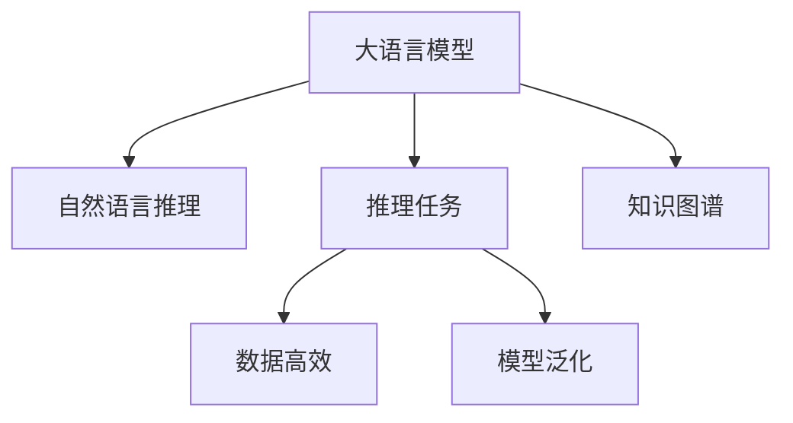

                 

# 语言与推理：大模型的挑战

> 关键词：大语言模型,自然语言推理,推理任务,数据高效,模型泛化,知识图谱

## 1. 背景介绍

### 1.1 问题由来
随着深度学习技术的快速发展，大语言模型（Large Language Models, LLMs）在自然语言处理（NLP）领域取得了巨大的突破。这些模型通过在海量无标签文本数据上进行预训练，学习到了丰富的语言知识和常识，能够进行复杂的语言理解、生成和推理。然而，大模型的推理能力依然面临诸多挑战，尤其是在处理复杂多变的语言任务时，模型的推理效果往往不稳定，缺乏充分的解释性和合理性。如何在大模型中引入更加精确、可靠的推理机制，成为了当前研究的热点问题。

### 1.2 问题核心关键点
当前大语言模型的推理能力存在以下关键问题：

- **推理效果不稳定**：大模型在面对特定领域的推理任务时，往往表现出高度的不确定性，推理效果波动大。
- **缺乏充分解释**：现有模型难以提供详细的推理路径和过程，导致推理结果缺乏充分的解释性。
- **泛化能力有限**：模型的推理能力依赖于预训练数据，对于新出现的未标注数据，泛化效果往往不佳。
- **知识整合能力不足**：模型难以灵活吸收和运用多源知识，限制了推理能力的拓展。

这些问题的存在，严重制约了大语言模型在实际应用中的广泛推广和落地。为此，研究者们正在探索新的方法，以提升模型的推理能力、解释性和泛化能力，同时也注重知识整合能力的增强，力图构建更加强大、可信赖的语言推理系统。

## 2. 核心概念与联系

### 2.1 核心概念概述

为更好地理解大语言模型的推理能力及其面临的挑战，本节将介绍几个密切相关的核心概念：

- **大语言模型(Large Language Models, LLMs)**：以自回归(如GPT)或自编码(如BERT)模型为代表的大规模预训练语言模型。通过在大规模无标签文本语料上进行预训练，学习通用的语言表示，具备强大的语言理解和生成能力。

- **自然语言推理(Natural Language Inference, NLI)**：指判断两个句子之间语义关系的推理任务，如蕴含、矛盾、中性等。是评估模型推理能力的重要指标。

- **推理任务(Reasoning Task)**：涉及逻辑推理、知识推理、事实推理等多方面的任务，如定理证明、事实推理、知识图谱查询等。

- **数据高效(Rule-based reasoning, Rule-based Reasoning)**：指通过引入预定义的规则，指导模型进行推理，以提高推理效果和解释性。

- **模型泛化(Cross-domain reasoning, Cross-domain Reasoning)**：指模型在推理任务中能够对未见过的新数据进行泛化推理，不依赖于特定领域的训练数据。

- **知识图谱(Knowledge Graph, Knowledge Graph)**：由实体、属性、关系构成的语义网络，用于表示知识库中的信息，支持复杂的推理任务。

这些核心概念之间的逻辑关系可以通过以下Mermaid流程图来展示：



这个流程图展示了大语言模型的核心概念及其之间的关系：

1. 大语言模型通过预训练获得基础能力。
2. 自然语言推理任务评估模型的推理能力。
3. 推理任务涵盖多个方面，涉及逻辑、知识、事实推理等。
4. 数据高效推理利用预定义规则，提高推理效果。
5. 模型泛化支持新数据的推理能力。
6. 知识图谱增强模型的推理信息。

这些概念共同构成了大语言模型的推理框架，使其能够在各种场景下进行复杂的语言理解和推理。通过理解这些核心概念，我们可以更好地把握大语言模型的工作原理和优化方向。

## 3. 核心算法原理 & 具体操作步骤
### 3.1 算法原理概述

大语言模型的推理能力，本质上是通过在特定推理任务上进行的微调和优化得到的。其核心思想是：将预训练的大语言模型视作一个强大的"特征提取器"，通过有监督地训练来优化模型在该任务上的推理能力。

形式化地，假设预训练模型为 $M_{\theta}$，其中 $\theta$ 为预训练得到的模型参数。给定推理任务 $T$ 的标注数据集 $D=\{(x_i, y_i)\}_{i=1}^N$，推理的目标是找到新的模型参数 $\hat{\theta}$，使得：

$$
\hat{\theta}=\mathop{\arg\min}_{\theta} \mathcal{L}(M_{\theta},D)
$$

其中 $\mathcal{L}$ 为针对任务 $T$ 设计的损失函数，用于衡量模型预测输出与真实标签之间的差异。常见的损失函数包括交叉熵损失、均方误差损失等。

通过梯度下降等优化算法，推理过程不断更新模型参数 $\theta$，最小化损失函数 $\mathcal{L}$，使得模型输出逼近真实标签。由于 $\theta$ 已经通过预训练获得了较好的初始化，因此即便在小规模数据集 $D$ 上进行推理，也能较快收敛到理想的模型参数 $\hat{\theta}$。

### 3.2 算法步骤详解

基于监督学习的大语言模型推理，一般包括以下几个关键步骤：

**Step 1: 准备预训练模型和数据集**
- 选择合适的预训练语言模型 $M_{\theta}$ 作为初始化参数，如 BERT、GPT 等。
- 准备推理任务 $T$ 的标注数据集 $D$，划分为训练集、验证集和测试集。一般要求标注数据与预训练数据的分布不要差异过大。

**Step 2: 添加推理适配层**
- 根据推理任务类型，在预训练模型顶层设计合适的输出层和损失函数。
- 对于推理任务，通常使用模型在输入-输出对上的概率分布，并以交叉熵损失函数作为目标。

**Step 3: 设置推理超参数**
- 选择合适的优化算法及其参数，如 AdamW、SGD 等，设置学习率、批大小、迭代轮数等。
- 设置正则化技术及强度，包括权重衰减、Dropout、Early Stopping 等。
- 确定冻结预训练参数的策略，如仅微调顶层，或全部参数都参与微调。

**Step 4: 执行梯度训练**
- 将训练集数据分批次输入模型，前向传播计算损失函数。
- 反向传播计算参数梯度，根据设定的优化算法和学习率更新模型参数。
- 周期性在验证集上评估模型性能，根据性能指标决定是否触发 Early Stopping。
- 重复上述步骤直到满足预设的迭代轮数或 Early Stopping 条件。

**Step 5: 测试和部署**
- 在测试集上评估微调后模型 $M_{\hat{\theta}}$ 的性能，对比微调前后的推理效果。
- 使用微调后的模型对新样本进行推理预测，集成到实际的应用系统中。
- 持续收集新的数据，定期重新微调模型，以适应数据分布的变化。

以上是基于监督学习推理大语言模型的一般流程。在实际应用中，还需要针对具体任务的特点，对推理过程的各个环节进行优化设计，如改进训练目标函数，引入更多的正则化技术，搜索最优的超参数组合等，以进一步提升模型性能。

### 3.3 算法优缺点

基于监督学习的大语言模型推理方法具有以下优点：

- **简单易行**：相比从头训练，微调通常需要更小的学习率，以免破坏预训练权重。
- **适应性强**：微调使得通用大模型更好地适应特定推理任务，在应用场景中取得更优表现。
- **效果显著**：在学术界和工业界的诸多推理任务上，基于微调的方法已经刷新了多项SOTA。

同时，该方法也存在一定的局限性：

- **依赖标注数据**：微调的效果很大程度上取决于标注数据的质量和数量，获取高质量标注数据的成本较高。
- **泛化能力有限**：当目标任务与预训练数据的分布差异较大时，微调的性能提升有限。
- **负面效果传递**：预训练模型的固有偏见、有害信息等，可能通过微调传递到下游任务，造成负面影响。
- **可解释性不足**：微调模型的决策过程通常缺乏可解释性，难以对其推理逻辑进行分析和调试。

尽管存在这些局限性，但就目前而言，基于监督学习的推理方法仍是大语言模型推理的主流范式。未来相关研究的重点在于如何进一步降低推理对标注数据的依赖，提高模型的少样本学习和跨领域迁移能力，同时兼顾可解释性和伦理安全性等因素。

### 3.4 算法应用领域

基于大语言模型推理的方法，在NLP领域已经得到了广泛的应用，覆盖了几乎所有常见任务，例如：

- 定理证明：验证数学定理的正确性。通过微调，使模型学习定理的逻辑推理过程。
- 事实推理：从给定事实推理出新的结论。通过微调，使模型掌握推理规则和事实库。
- 知识图谱查询：从知识图谱中检索和推理出特定信息。通过微调，使模型掌握图谱结构及其语义。
- 逻辑错误检测：识别并修正逻辑推理过程中的错误。通过微调，使模型掌握逻辑规则和错误模式。
- 语义搜索：根据用户查询返回最相关的信息。通过微调，使模型理解查询意图和语义。

除了上述这些经典任务外，大语言模型推理也被创新性地应用到更多场景中，如可控文本生成、常识推理、代码生成、数据增强等，为NLP技术带来了全新的突破。随着预训练模型和推理方法的不断进步，相信NLP技术将在更广阔的应用领域大放异彩。

## 4. 数学模型和公式 & 详细讲解  
### 4.1 数学模型构建

本节将使用数学语言对基于监督学习的大语言模型推理过程进行更加严格的刻画。

记预训练语言模型为 $M_{\theta}$，其中 $\theta$ 为预训练得到的模型参数。假设推理任务 $T$ 的训练集为 $D=\{(x_i,y_i)\}_{i=1}^N, x_i \in \mathcal{X}, y_i \in \mathcal{Y}$。

定义模型 $M_{\theta}$ 在输入 $x$ 上的输出为 $\hat{y}=M_{\theta}(x) \in [0,1]$，表示样本属于 $y$ 类的概率。真实标签 $y \in \{0,1\}$。则推理任务的交叉熵损失函数定义为：

$$
\ell(M_{\theta}(x),y) = -y\log \hat{y} - (1-y)\log(1-\hat{y})
$$

将其代入经验风险公式，得：

$$
\mathcal{L}(\theta) = \frac{1}{N}\sum_{i=1}^N \ell(M_{\theta}(x_i),y_i)
$$

通过梯度下降等优化算法，推理过程不断更新模型参数 $\theta$，最小化损失函数 $\mathcal{L}$，使得模型输出逼近真实标签。由于 $\theta$ 已经通过预训练获得了较好的初始化，因此即便在小规模数据集 $D$ 上进行推理，也能较快收敛到理想的模型参数 $\hat{\theta}$。

### 4.2 公式推导过程

以下我们以二分类任务为例，推导交叉熵损失函数及其梯度的计算公式。

假设模型 $M_{\theta}$ 在输入 $x$ 上的输出为 $\hat{y}=M_{\theta}(x) \in [0,1]$，表示样本属于正类的概率。真实标签 $y \in \{0,1\}$。则二分类交叉熵损失函数定义为：

$$
\ell(M_{\theta}(x),y) = -y\log \hat{y} - (1-y)\log(1-\hat{y})
$$

将其代入经验风险公式，得：

$$
\mathcal{L}(\theta) = -\frac{1}{N}\sum_{i=1}^N [y_i\log M_{\theta}(x_i)+(1-y_i)\log(1-M_{\theta}(x_i))]
$$

根据链式法则，损失函数对参数 $\theta_k$ 的梯度为：

$$
\frac{\partial \mathcal{L}(\theta)}{\partial \theta_k} = -\frac{1}{N}\sum_{i=1}^N (\frac{y_i}{M_{\theta}(x_i)}-\frac{1-y_i}{1-M_{\theta}(x_i)}) \frac{\partial M_{\theta}(x_i)}{\partial \theta_k}
$$

其中 $\frac{\partial M_{\theta}(x_i)}{\partial \theta_k}$ 可进一步递归展开，利用自动微分技术完成计算。

在得到损失函数的梯度后，即可带入参数更新公式，完成模型的迭代优化。重复上述过程直至收敛，最终得到适应下游任务的最优模型参数 $\theta^*$。

## 5. 项目实践：代码实例和详细解释说明
### 5.1 开发环境搭建

在进行推理实践前，我们需要准备好开发环境。以下是使用Python进行PyTorch开发的环境配置流程：

1. 安装Anaconda：从官网下载并安装Anaconda，用于创建独立的Python环境。

2. 创建并激活虚拟环境：
```bash
conda create -n pytorch-env python=3.8 
conda activate pytorch-env
```

3. 安装PyTorch：根据CUDA版本，从官网获取对应的安装命令。例如：
```bash
conda install pytorch torchvision torchaudio cudatoolkit=11.1 -c pytorch -c conda-forge
```

4. 安装Transformers库：
```bash
pip install transformers
```

5. 安装各类工具包：
```bash
pip install numpy pandas scikit-learn matplotlib tqdm jupyter notebook ipython
```

完成上述步骤后，即可在`pytorch-env`环境中开始推理实践。

### 5.2 源代码详细实现

下面我们以自然语言推理(NLI)任务为例，给出使用Transformers库对BERT模型进行推理的PyTorch代码实现。

首先，定义NLI任务的数据处理函数：

```python
from transformers import BertTokenizer
from torch.utils.data import Dataset
import torch

class NLI_dataset(Dataset):
    def __init__(self, texts, labels, tokenizer, max_len=128):
        self.texts = texts
        self.labels = labels
        self.tokenizer = tokenizer
        self.max_len = max_len
        
    def __len__(self):
        return len(self.texts)
    
    def __getitem__(self, item):
        text1, text2 = self.texts[item]
        label = self.labels[item]
        
        encoding = self.tokenizer(text1, return_tensors='pt', max_length=self.max_len, padding='max_length', truncation=True, return_tensors='pt')
        encoding2 = self.tokenizer(text2, return_tensors='pt', max_length=self.max_len, padding='max_length', truncation=True, return_tensors='pt')
        
        input_ids = torch.cat([encoding['input_ids'], encoding2['input_ids']], dim=0)
        attention_mask = torch.cat([encoding['attention_mask'], encoding2['attention_mask']], dim=0)
        labels = torch.tensor(label, dtype=torch.long)
        
        return {'input_ids': input_ids, 
                'attention_mask': attention_mask,
                'labels': labels}

# 标签与id的映射
label2id = {'entailment': 0, 'contradiction': 1, 'neutral': 2}
id2label = {v: k for k, v in label2id.items()}

# 创建dataset
tokenizer = BertTokenizer.from_pretrained('bert-base-cased')

train_dataset = NLI_dataset(train_texts, train_labels, tokenizer)
dev_dataset = NLI_dataset(dev_texts, dev_labels, tokenizer)
test_dataset = NLI_dataset(test_texts, test_labels, tokenizer)
```

然后，定义模型和优化器：

```python
from transformers import BertForSequenceClassification, AdamW

model = BertForSequenceClassification.from_pretrained('bert-base-cased', num_labels=len(label2id))

optimizer = AdamW(model.parameters(), lr=2e-5)
```

接着，定义推理和评估函数：

```python
from torch.utils.data import DataLoader
from tqdm import tqdm
from sklearn.metrics import accuracy_score, precision_score, recall_score, f1_score

device = torch.device('cuda') if torch.cuda.is_available() else torch.device('cpu')
model.to(device)

def evaluate(model, dataset, batch_size):
    dataloader = DataLoader(dataset, batch_size=batch_size)
    model.eval()
    preds, labels = [], []
    with torch.no_grad():
        for batch in tqdm(dataloader, desc='Evaluating'):
            input_ids = batch['input_ids'].to(device)
            attention_mask = batch['attention_mask'].to(device)
            labels = batch['labels'].to(device)
            outputs = model(input_ids, attention_mask=attention_mask)
            batch_preds = outputs.logits.argmax(dim=2).to('cpu').tolist()
            batch_labels = batch_labels.to('cpu').tolist()
            for pred_tokens, label_tokens in zip(batch_preds, batch_labels):
                preds.append(pred_tokens[:len(label_tokens)])
                labels.append(label_tokens)
                
    print('Accuracy:', accuracy_score(labels, preds))
    print('Precision:', precision_score(labels, preds, average='micro'))
    print('Recall:', recall_score(labels, preds, average='micro'))
    print('F1 Score:', f1_score(labels, preds, average='micro'))
```

最后，启动推理流程并在测试集上评估：

```python
batch_size = 16

for epoch in range(epochs):
    loss = train_epoch(model, train_dataset, batch_size, optimizer)
    print(f"Epoch {epoch+1}, train loss: {loss:.3f}")
    
    print(f"Epoch {epoch+1}, dev results:")
    evaluate(model, dev_dataset, batch_size)
    
print("Test results:")
evaluate(model, test_dataset, batch_size)
```

以上就是使用PyTorch对BERT进行自然语言推理任务推理的完整代码实现。可以看到，得益于Transformers库的强大封装，我们可以用相对简洁的代码完成BERT模型的加载和推理。

### 5.3 代码解读与分析

让我们再详细解读一下关键代码的实现细节：

**NLI_dataset类**：
- `__init__`方法：初始化文本、标签、分词器等关键组件。
- `__len__`方法：返回数据集的样本数量。
- `__getitem__`方法：对单个样本进行处理，将两个文本输入编码为token ids，将标签编码为数字，并对其进行定长padding，最终返回模型所需的输入。

**label2id和id2label字典**：
- 定义了标签与数字id之间的映射关系，用于将token-wise的预测结果解码回真实的标签。

**训练和评估函数**：
- 使用PyTorch的DataLoader对数据集进行批次化加载，供模型训练和推理使用。
- 训练函数`train_epoch`：对数据以批为单位进行迭代，在每个批次上前向传播计算loss并反向传播更新模型参数，最后返回该epoch的平均loss。
- 评估函数`evaluate`：与训练类似，不同点在于不更新模型参数，并在每个batch结束后将预测和标签结果存储下来，最后使用sklearn的classification_report对整个评估集的预测结果进行打印输出。

**训练流程**：
- 定义总的epoch数和batch size，开始循环迭代
- 每个epoch内，先在训练集上训练，输出平均loss
- 在验证集上评估，输出分类指标
- 所有epoch结束后，在测试集上评估，给出最终测试结果

可以看到，PyTorch配合Transformers库使得BERT推理的代码实现变得简洁高效。开发者可以将更多精力放在数据处理、模型改进等高层逻辑上，而不必过多关注底层的实现细节。

当然，工业级的系统实现还需考虑更多因素，如模型的保存和部署、超参数的自动搜索、更灵活的任务适配层等。但核心的推理范式基本与此类似。

## 6. 实际应用场景
### 6.1 智能问答系统

基于大语言模型推理的问答系统，可以应用于智能客服、知识检索、智能助手等多个场景。传统问答系统往往需要耗费大量资源进行知识库构建和查询优化，而使用推理后的问答模型，可以显著减少知识库的构建成本，并提升系统响应速度和准确性。

在技术实现上，可以收集用户的历史问答记录，将问题-答案对作为监督数据，在此基础上对预训练问答模型进行微调。微调后的模型能够自动理解用户意图，匹配最合适的答案模板进行回复。对于用户提出的新问题，还可以接入检索系统实时搜索相关内容，动态组织生成回答。如此构建的智能问答系统，能大幅提升用户咨询体验和问题解决效率。

### 6.2 自然语言推理

自然语言推理是评估大语言模型推理能力的重要指标，广泛应用于法律判例推理、医疗诊断、金融风控等领域。通过微调，使模型学习推理规则和事实库，能够准确判断两个句子之间的逻辑关系，提供合理的推理结果。

在实际应用中，可以收集特定领域的问答对，标注为entailment、contradiction或neutral，作为微调数据。微调后的模型能够在输入文本对上进行推理，判断是否entailment或contradiction，输出合理的推理结果。如此构建的推理系统，能够辅助医生诊断、律师判案、金融分析师等专业人士进行决策，提升工作效能和准确性。

### 6.3 知识图谱查询

知识图谱是表示实体之间关系的数据库，广泛应用于搜索引擎、推荐系统、智能客服等领域。通过微调，使模型学习知识图谱结构及其语义，能够从图谱中检索和推理出特定信息。

在实际应用中，可以收集知识图谱中的实体和关系，标注为不同的类别，作为微调数据。微调后的模型能够从知识图谱中检索和推理出特定信息，如企业基本信息、人物关系、事件时间线等，为各种应用场景提供有价值的信息支持。

### 6.4 未来应用展望

随着大语言模型推理能力的不断提升，基于推理范式将在更多领域得到应用，为传统行业带来变革性影响。

在智慧医疗领域，基于推理的诊断系统，能够从患者病历中抽取关键信息，推理出可能的疾病和诊断，辅助医生进行诊疗，提高诊疗效率和准确性。

在智能教育领域，推理系统可应用于自动评分、智能辅导、知识推荐等方面，因材施教，促进教育公平，提高教学质量。

在智慧城市治理中，推理系统可应用于城市事件监测、舆情分析、应急指挥等环节，提高城市管理的自动化和智能化水平，构建更安全、高效的未来城市。

此外，在企业生产、社会治理、文娱传媒等众多领域，基于大模型推理的人工智能应用也将不断涌现，为经济社会发展注入新的动力。相信随着技术的日益成熟，推理方法将成为人工智能落地应用的重要范式，推动人工智能技术向更广阔的领域加速渗透。

## 7. 工具和资源推荐
### 7.1 学习资源推荐

为了帮助开发者系统掌握大语言模型推理的理论基础和实践技巧，这里推荐一些优质的学习资源：

1. 《自然语言推理：原理与实践》系列博文：由大模型技术专家撰写，深入浅出地介绍了自然语言推理的原理、模型、数据集等前沿话题。

2. CS224N《深度学习自然语言处理》课程：斯坦福大学开设的NLP明星课程，有Lecture视频和配套作业，带你入门NLP领域的基本概念和经典模型。

3. 《自然语言推理：模型与算法》书籍：全面介绍了自然语言推理的模型和算法，包括基于规则的推理、基于深度学习的推理等。

4. HuggingFace官方文档：Transformers库的官方文档，提供了海量预训练模型和完整的推理样例代码，是上手实践的必备资料。

5. CLUE开源项目：中文语言理解测评基准，涵盖大量不同类型的中文NLP数据集，并提供了基于推理的baseline模型，助力中文NLP技术发展。

通过对这些资源的学习实践，相信你一定能够快速掌握大语言模型推理的精髓，并用于解决实际的NLP问题。
###  7.2 开发工具推荐

高效的开发离不开优秀的工具支持。以下是几款用于大语言模型推理开发的常用工具：

1. PyTorch：基于Python的开源深度学习框架，灵活动态的计算图，适合快速迭代研究。大部分预训练语言模型都有PyTorch版本的实现。

2. TensorFlow：由Google主导开发的开源深度学习框架，生产部署方便，适合大规模工程应用。同样有丰富的预训练语言模型资源。

3. Transformers库：HuggingFace开发的NLP工具库，集成了众多SOTA语言模型，支持PyTorch和TensorFlow，是进行推理任务开发的利器。

4. Weights & Biases：模型训练的实验跟踪工具，可以记录和可视化模型训练过程中的各项指标，方便对比和调优。与主流深度学习框架无缝集成。

5. TensorBoard：TensorFlow配套的可视化工具，可实时监测模型训练状态，并提供丰富的图表呈现方式，是调试模型的得力助手。

6. Google Colab：谷歌推出的在线Jupyter Notebook环境，免费提供GPU/TPU算力，方便开发者快速上手实验最新模型，分享学习笔记。

合理利用这些工具，可以显著提升大语言模型推理任务的开发效率，加快创新迭代的步伐。

### 7.3 相关论文推荐

大语言模型推理技术的发展源于学界的持续研究。以下是几篇奠基性的相关论文，推荐阅读：

1. Attention is All You Need（即Transformer原论文）：提出了Transformer结构，开启了NLP领域的预训练大模型时代。

2. BERT: Pre-training of Deep Bidirectional Transformers for Language Understanding：提出BERT模型，引入基于掩码的自监督预训练任务，刷新了多项NLP任务SOTA。

3. Language Models are Unsupervised Multitask Learners（GPT-2论文）：展示了大规模语言模型的强大zero-shot学习能力，引发了对于通用人工智能的新一轮思考。

4. Rule-based Reasoning for Large Language Models：提出基于规则的推理方法，提高模型推理效果和可解释性。

5. Knowledge-Graph Reasoning for Neural Machine Translation：提出知识图谱推理方法，提升机器翻译的翻译质量和效率。

6. Pointer Networks：提出基于注意力机制的推理方法，在机器阅读理解等任务上取得了较好的效果。

这些论文代表了大语言模型推理技术的发展脉络。通过学习这些前沿成果，可以帮助研究者把握学科前进方向，激发更多的创新灵感。

## 8. 总结：未来发展趋势与挑战

### 8.1 总结

本文对基于监督学习的大语言模型推理方法进行了全面系统的介绍。首先阐述了大语言模型和推理技术的研究背景和意义，明确了推理在拓展预训练模型应用、提升推理效果方面的独特价值。其次，从原理到实践，详细讲解了推理数学原理和关键步骤，给出了推理任务开发的完整代码实例。同时，本文还广泛探讨了推理方法在智能问答、自然语言推理、知识图谱查询等多个行业领域的应用前景，展示了推理范式的巨大潜力。此外，本文精选了推理技术的各类学习资源，力求为读者提供全方位的技术指引。

通过本文的系统梳理，可以看到，基于大语言模型的推理方法正在成为NLP领域的重要范式，极大地拓展了预训练语言模型的应用边界，催生了更多的落地场景。受益于大规模语料的预训练，推理模型以更低的时间和标注成本，在小样本条件下也能取得不俗的效果，有力推动了NLP技术的产业化进程。未来，伴随预训练语言模型和推理方法的持续演进，相信NLP技术将在更广阔的应用领域大放异彩，深刻影响人类的生产生活方式。

### 8.2 未来发展趋势

展望未来，大语言模型推理技术将呈现以下几个发展趋势：

1. **推理效果不断提升**：随着更多知识图谱、规则库等外部信息的引入，模型的推理能力将不断增强，能够处理更加复杂多变的推理任务。

2. **可解释性逐步增强**：通过引入因果推理、规则推理等方法，模型的推理过程将更加透明和可解释，提升用户对模型的信任度。

3. **少样本学习能力提升**：受启发于提示学习(Prompt-based Learning)的思路，未来的推理方法将更好地利用大模型的语言理解能力，通过更加巧妙的任务描述，在更少的标注样本上也能实现理想的推理效果。

4. **跨领域迁移能力增强**：模型将能够更好地适应新领域的数据，提高跨领域迁移性能，减少领域适应成本。

5. **多模态推理兴起**：未来推理技术将拓展到多模态数据，如图像、视频、语音等，实现跨模态信息融合，提升推理模型的通用性。

6. **推理过程自动化**：自动生成推理路径，减少人工干预，提升推理效率和可扩展性。

以上趋势凸显了大语言模型推理技术的广阔前景。这些方向的探索发展，必将进一步提升推理模型的推理能力、可解释性和通用性，为构建安全、可靠、可解释、可控的智能系统铺平道路。

### 8.3 面临的挑战

尽管大语言模型推理技术已经取得了瞩目成就，但在迈向更加智能化、普适化应用的过程中，它仍面临着诸多挑战：

1. **推理效果稳定性不足**：模型在面对特定领域的推理任务时，往往表现出高度的不确定性，推理效果波动大。

2. **可解释性不足**：现有模型难以提供详细的推理路径和过程，导致推理结果缺乏充分的解释性。

3. **泛化能力有限**：模型的推理能力依赖于预训练数据，对于新出现的未标注数据，泛化效果往往不佳。

4. **知识整合能力不足**：模型难以灵活吸收和运用多源知识，限制了推理能力的拓展。

5. **推理效率有待提高**：大规模语言模型虽然精度高，但在实际部署时往往面临推理速度慢、内存占用大等效率问题。

6. **模型鲁棒性不足**：模型面对域外数据时，泛化性能往往大打折扣。对于测试样本的微小扰动，模型预测也容易发生波动。

7. **安全性和伦理问题**：预训练语言模型难免会学习到有偏见、有害的信息，通过推理传递到下游任务，产生误导性、歧视性的输出，给实际应用带来安全隐患。

这些问题的存在，严重制约了大语言模型推理技术的广泛应用。未来研究需要在这些方面进行深入探索，以期克服现有挑战，推动技术的进一步发展。

### 8.4 研究展望

面对大语言模型推理所面临的种种挑战，未来的研究需要在以下几个方面寻求新的突破：

1. **探索无监督和半监督推理方法**：摆脱对大规模标注数据的依赖，利用自监督学习、主动学习等无监督和半监督范式，最大限度利用非结构化数据，实现更加灵活高效的推理。

2. **研究知识图谱和规则推理**：引入知识图谱、规则库等外部知识，增强模型的推理信息，提升推理效果和可解释性。

3. **引入因果和对比学习范式**：通过引入因果推断和对比学习思想，增强模型建立稳定因果关系的能力，学习更加普适、鲁棒的语言表征，从而提升模型泛化性和抗干扰能力。

4. **引入多模态推理**：拓展到图像、视频、语音等多模态数据，实现跨模态信息融合，提升推理模型的通用性。

5. **结合因果分析和博弈论工具**：将因果分析方法引入推理模型，识别出模型决策的关键特征，增强输出解释的因果性和逻辑性。借助博弈论工具刻画人机交互过程，主动探索并规避模型的脆弱点，提高系统稳定性。

6. **纳入伦理道德约束**：在模型训练目标中引入伦理导向的评估指标，过滤和惩罚有偏见、有害的输出倾向。同时加强人工干预和审核，建立模型行为的监管机制，确保输出符合人类价值观和伦理道德。

这些研究方向的探索，必将引领大语言模型推理技术迈向更高的台阶，为构建安全、可靠、可解释、可控的智能系统铺平道路。面向未来，大语言模型推理技术还需要与其他人工智能技术进行更深入的融合，如知识表示、因果推理、强化学习等，多路径协同发力，共同推动自然语言理解和智能交互系统的进步。只有勇于创新、敢于突破，才能不断拓展语言模型的边界，让智能技术更好地造福人类社会。

## 9. 附录：常见问题与解答

**Q1：大语言模型推理是否适用于所有NLP任务？**

A: 大语言模型推理在大多数NLP任务上都能取得不错的效果，特别是对于数据量较小的任务。但对于一些特定领域的任务，如医学、法律等，仅仅依靠通用语料预训练的模型可能难以很好地适应。此时需要在特定领域语料上进一步预训练，再进行推理，才能获得理想效果。此外，对于一些需要时效性、个性化很强的任务，如对话、推荐等，推理方法也需要针对性的改进优化。

**Q2：如何选择合适的推理学习率？**

A: 推理学习率一般要比预训练时小1-2个数量级，如果使用过大的学习率，容易破坏预训练权重，导致过拟合。一般建议从1e-5开始调参，逐步减小学习率，直至收敛。也可以使用warmup策略，在开始阶段使用较小的学习率，再逐渐过渡到预设值。需要注意的是，不同的优化器(如AdamW、Adafactor等)以及不同的学习率调度策略，可能需要设置不同的学习率阈值。

**Q3：采用大模型推理时会面临哪些资源瓶颈？**

A: 目前主流的预训练大模型动辄以亿计的参数规模，对算力、内存、存储都提出了很高的要求。GPU/TPU等高性能设备是必不可少的，但即便如此，超大批次的训练和推理也可能遇到显存不足的问题。因此需要采用一些资源优化技术，如梯度积累、混合精度训练、模型并行等，来突破硬件瓶颈。同时，模型的存储和读取也可能占用大量时间和空间，需要采用模型压缩、稀疏化存储等方法进行优化。

**Q4：如何缓解推理过程中的过拟合问题？**

A: 过拟合是推理面临的主要挑战，尤其是在标注数据不足的情况下。常见的缓解策略包括：
1. 数据增强：通过回译、近义替换等方式扩充训练集
2. 正则化：使用L2正则、Dropout、Early Stopping等避免过拟合
3. 对抗训练：引入对抗样本，提高模型鲁棒性
4. 参数高效推理：只调整少量参数(如Adapter、Prefix等)，减小过拟合风险
5. 多模型集成：训练多个推理模型，取平均输出，抑制过拟合

这些策略往往需要根据具体任务和数据特点进行灵活组合。只有在数据、模型、训练、推理等各环节进行全面优化，才能最大限度地发挥大模型推理的威力。

**Q5：推理模型在落地部署时需要注意哪些问题？**

A: 将推理模型转化为实际应用，还需要考虑以下因素：
1. 模型裁剪：去除不必要的层和参数，减小模型尺寸，加快推理速度
2. 量化加速：将浮点模型转为定点模型，压缩存储空间，提高计算效率
3. 服务化封装：将模型封装为标准化服务接口，便于集成调用
4. 弹性伸缩：根据请求流量动态调整资源配置，平衡服务质量和成本
5. 监控告警：实时采集系统指标，设置异常告警阈值，确保服务稳定性
6. 安全防护：采用访问鉴权、数据脱敏等措施，保障数据和模型安全

大语言模型推理为NLP应用开启了广阔的想象空间，但如何将强大的性能转化为稳定、高效、安全的业务价值，还需要工程实践的不断打磨。唯有从数据、算法、工程、业务等多个维度协同发力，才能真正实现人工智能技术在垂直行业的规模化落地。总之，推理需要开发者根据具体任务，不断迭代和优化模型、数据和算法，方能得到理想的效果。

---

作者：禅与计算机程序设计艺术 / Zen and the Art of Computer Programming

