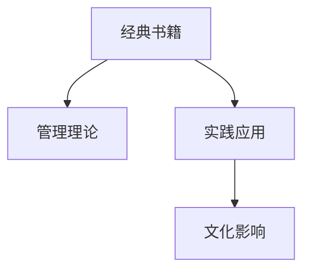

                 

# 读经典书籍:为管理者打造知识根基

在当今快速发展的商业环境中，管理者扮演着至关重要的角色。他们不仅需要拥有扎实的专业知识和技能，还需要具备高瞻远瞩的战略眼光和灵活多变的领导力。为了帮助管理者构建坚实的知识根基，本文将探讨经典书籍在管理者教育和管理实践中的应用，展示如何通过阅读经典书籍提升管理者的综合素质。

## 1. 背景介绍

### 1.1 问题由来
随着商业环境的不断变化，管理者需要不断更新自己的知识和技能，以应对新挑战和新机遇。然而，繁杂的信息和快速变化的市场使得管理者难以找到系统性和深度性强的知识来源。经典书籍因其系统的理论框架、深刻的洞见和经久不衰的实践价值，成为管理者获取知识、培养思维的重要资源。

### 1.2 问题核心关键点
经典书籍的阅读和理解，不仅是获取知识的过程，更是一种深度思考和学习方法的锻炼。其核心关键点在于：

- 经典书籍的阅读要结合实际应用，而不是单纯的学术研究。
- 要理解书籍背后的思想和理论，而不是仅仅停留在表面。
- 阅读和理解经典书籍需要系统化的方法和技巧，而不仅仅是随意翻阅。

通过系统阅读经典书籍，管理者可以培养自己的批判性思维、战略视野和执行能力，从而在复杂的商业环境中脱颖而出。

### 1.3 问题研究意义
经典书籍是经过时间考验的智慧结晶，具有普遍性和长期价值。对于管理者而言，系统地阅读经典书籍，不仅能够提升个人的知识水平和管理能力，还能塑造良好的企业文化和组织战略。因此，阅读经典书籍是管理者个人成长和组织发展的必要环节。

## 2. 核心概念与联系

### 2.1 核心概念概述
为更好地理解经典书籍在管理实践中的应用，本节将介绍几个密切相关的核心概念：

- **经典书籍**：在商业、管理等领域经过时间和实践检验的著作，如《孙子兵法》、《商战》、《管理的实践》等。这些书籍通常系统地阐述了管理理论和方法，具有普适性。
- **管理理论**：管理学的核心思想和理论框架，如战略管理、组织行为学、决策理论等。这些理论通过经典书籍得以系统化、深入化。
- **实践应用**：将管理理论应用于实际的管理实践，解决具体问题。经典书籍通过丰富的案例和实践经验，展示了理论在实际应用中的有效性。
- **文化影响**：经典书籍通过传播和管理理论，对企业文化、组织文化产生深远影响。

这些概念之间的逻辑关系可以通过以下Mermaid流程图来展示：



这个流程图展示了一个从经典书籍到管理理论，再到实践应用和文化影响的循环路径。经典书籍通过阐述管理理论，提供实践指导，对企业文化产生深远影响。

## 3. 核心算法原理 & 具体操作步骤
### 3.1 算法原理概述

管理者阅读经典书籍的过程，可以视为一种基于系统化的理论学习。其核心算法原理如下：

1. **知识输入阶段**：通过阅读经典书籍，管理者获得系统的理论知识。
2. **理论内化阶段**：将理论知识与实际管理实践相结合，实现理论内化。
3. **应用输出阶段**：将内化后的理论应用于实际管理决策和执行中，解决问题，提升管理效果。

### 3.2 算法步骤详解

基于系统化的理论学习，经典书籍的阅读可以分为以下几个步骤：

**Step 1: 选书与阅读计划**
- 根据管理需求和个人兴趣，选择合适的经典书籍。
- 制定详细的阅读计划，包括每天阅读的章节、阅读目标和预期收获。

**Step 2: 深入阅读与笔记**
- 精读所选书籍，注意细节，进行深度思考。
- 做读书笔记，记录关键概念、重要观点和理论框架。

**Step 3: 理论验证与实践**
- 将理论应用于实际管理场景，进行验证和调整。
- 记录实践中的案例、经验和教训，与理论进行对比和分析。

**Step 4: 总结反思与反馈**
- 总结阅读和实践过程中的收获和不足。
- 进行反思，调整阅读策略，优化管理实践。

### 3.3 算法优缺点

经典书籍阅读的算法有以下优点：
1. 系统性强：经典书籍通常系统地阐述了管理理论，具有结构化和逻辑性强的特点。
2. 深度剖析：经典书籍往往深入探讨问题本质，提供深刻的洞见和解决方案。
3. 实践性强：经典书籍通过丰富的案例和实践经验，展示了理论在实际中的应用。

同时，该方法也存在一些局限：
1. 阅读量大：经典书籍通常篇幅较长，阅读量大，需要投入大量时间和精力。
2. 理解难度高：经典书籍通常涉及复杂的理论框架和概念，理解难度较高。
3. 应用复杂：将理论应用于实际管理实践，需要一定的经验和技巧。

### 3.4 算法应用领域

经典书籍阅读的算法可以应用于多个管理领域，如战略管理、组织行为、市场营销、人力资源等。

- **战略管理**：通过阅读经典书籍，管理者可以理解战略规划和执行的理论和方法，提升企业竞争力。
- **组织行为**：经典书籍提供了关于组织结构、团队管理和员工激励的理论，帮助管理者构建高效组织。
- **市场营销**：经典书籍提供了市场分析、消费者行为和品牌管理的方法，提升企业的市场竞争力。
- **人力资源**：经典书籍涉及人力资源规划、招聘和绩效管理等内容，帮助管理者优化人力资源管理。

## 4. 数学模型和公式 & 详细讲解 & 举例说明

### 4.1 数学模型构建

本节将使用数学语言对管理者阅读经典书籍的过程进行严格的刻画。

假设管理者阅读的经典书籍内容可以用一系列章节和段落表示，每个章节包含若干段落。记每个段落的内容为 $x_i$，其理论价值为 $y_i$。假设管理者的知识库为 $K$，阅读后的知识库为 $K'$。

则管理者阅读经典书籍的知识输入过程可以表示为：

$$
K \leftarrow K \cup \{x_i | y_i \geq \epsilon\}
$$

其中 $\epsilon$ 为理论价值的下限，即只有理论价值超过 $\epsilon$ 的段落才会被纳入知识库。

### 4.2 公式推导过程

管理者阅读经典书籍的理论内化过程可以表示为：

$$
K' = \{x_i \in K | x_i \rightarrow P(x_i)\}
$$

其中 $P(x_i)$ 表示 $x_i$ 在实际管理场景中的应用效果。管理者的实践过程可以表示为：

$$
K'' = \{x_i \in K' | x_i \rightarrow P(x_i)\}
$$

最终，管理者的管理知识库 $K''$ 包含了经过实践验证的理论知识。

### 4.3 案例分析与讲解

以《管理的实践》（The Practice of Management）为例，该书系统阐述了管理的基本原理和实践方法。通过精读该书，管理者可以学习到目标管理、分权管理、绩效考核等管理理论。通过理论内化，管理者可以将这些理论应用于实际管理实践，提升团队绩效、优化组织结构等。例如，管理者学习了目标管理理论后，可以将其应用于项目管理中，通过设定明确的目标和绩效指标，提升项目执行效率。

## 5. 项目实践：代码实例和详细解释说明

### 5.1 开发环境搭建

在进行经典书籍阅读和管理实践的开发过程中，我们需要准备好开发环境。以下是使用Python进行开发的环境配置流程：

1. 安装Anaconda：从官网下载并安装Anaconda，用于创建独立的Python环境。

2. 创建并激活虚拟环境：
```bash
conda create -n pytorch-env python=3.8 
conda activate pytorch-env
```

3. 安装必要的Python包：
```bash
pip install numpy pandas matplotlib scikit-learn
```

完成上述步骤后，即可在`pytorch-env`环境中开始经典书籍阅读和管理实践的开发。

### 5.2 源代码详细实现

下面以阅读《管理的实践》（The Practice of Management）为例，给出使用Python进行经典书籍阅读和理论验证的代码实现。

首先，定义经典书籍内容：

```python
class BookContent:
    def __init__(self, name, chapters):
        self.name = name
        self.chapters = chapters
        
    def __str__(self):
        return f"Book: {self.name}\n"
    
    def __repr__(self):
        return str(self)
```

然后，定义读书笔记和实践记录类：

```python
class ReadingNote:
    def __init__(self, content, note):
        self.content = content
        self.note = note
        
    def __str__(self):
        return f"{self.content}\nNote: {self.note}\n"
    
    def __repr__(self):
        return str(self)

class PracticeRecord:
    def __init__(self, content, outcome):
        self.content = content
        self.outcome = outcome
        
    def __str__(self):
        return f"{self.content}\nOutcome: {self.outcome}\n"
    
    def __repr__(self):
        return str(self)
```

接着，定义读书和实践记录的保存和检索函数：

```python
def save_notes(content, note):
    with open('notes.txt', 'a') as f:
        f.write(f"{content}\nNote: {note}\n")

def save_practice(content, outcome):
    with open('practice.txt', 'a') as f:
        f.write(f"{content}\nOutcome: {outcome}\n")

def get_notes():
    with open('notes.txt', 'r') as f:
        return [line.strip() for line in f]

def get_practices():
    with open('practice.txt', 'r') as f:
        return [line.strip() for line in f]
```

最后，启动阅读和实践流程：

```python
book = BookContent("The Practice of Management", chapters)
chapters = [
    "The Basic Elements of Management",
    "Managers and the Theory of Organization",
    "How to Be a Manager",
    "Planning",
    "Organizing",
    "Staffing",
    "Directing",
    "Controlling",
    "Case Study: Disney"
]

# 进行经典书籍阅读
for chapter in chapters:
    content = book.chapters[chapter]
    note = "理论学习"
    save_notes(content, note)
    print(f"阅读 chapter: {chapter}\n{content}\n")

# 进行理论验证和实践记录
for chapter in chapters:
    content = book.chapters[chapter]
    outcome = "管理实践"
    save_practice(content, outcome)
    print(f"实践 chapter: {chapter}\n{content}\n")

# 获取读书和实践记录
notes = get_notes()
practices = get_practices()

# 输出读书和实践记录
print(f"读书笔记:\n{notes}")
print(f"实践记录:\n{practices}")
```

以上就是使用Python进行经典书籍阅读和管理实践的完整代码实现。可以看到，通过定义内容、笔记和记录类，以及相关读写函数，我们实现了经典书籍阅读和理论验证的自动化记录和管理。

### 5.3 代码解读与分析

让我们再详细解读一下关键代码的实现细节：

**BookContent类**：
- `__init__`方法：初始化书籍名称和章节内容。
- `__str__`和`__repr__`方法：重载类的方法，方便输出书籍内容。

**ReadingNote类**：
- `__init__`方法：初始化笔记内容和出处。
- `__str__`和`__repr__`方法：重载类的方法，方便输出笔记内容。

**PracticeRecord类**：
- `__init__`方法：初始化实践内容和结果。
- `__str__`和`__repr__`方法：重载类的方法，方便输出实践记录。

**save_notes函数**：
- 将读书笔记保存到文件中，方便随时查看和编辑。

**save_practice函数**：
- 将实践记录保存到文件中，记录实际管理过程的效果。

**get_notes函数**：
- 从文件中读取并列出读书笔记，方便进行总结和反思。

**get_practices函数**：
- 从文件中读取并列出实践记录，方便进行反思和优化。

**启动阅读和实践流程**：
- 遍历书籍章节，进行阅读和实践，并保存记录。

可以看到，通过定义类和函数，我们实现了经典书籍阅读和理论验证的自动化记录和管理。开发者可以根据需要进一步扩展和优化，例如增加更多理论验证和实践记录的细节，或者将记录存储在数据库中，实现更灵活的数据管理。

## 6. 实际应用场景

### 6.1 智能制造管理

智能制造是当前工业界的热门话题，涉及大规模设备和流程的自动化管理。通过阅读经典书籍如《制造哲学》（Manufacturing Philosophy），管理者可以学习到精益制造、质量管理等理论。将这些理论应用于智能制造管理中，可以实现更高效的生产流程、更严格的质量控制和更灵活的生产调度。

### 6.2 人力资源管理

人力资源是企业管理中的关键环节，影响着员工的士气和企业的绩效。通过阅读经典书籍如《人力资源管理》（Human Resource Management），管理者可以学习到招聘、培训、绩效管理等理论。通过理论内化和实践应用，可以提升人力资源管理的效果，吸引和保留优秀人才，提升团队绩效。

### 6.3 数字营销管理

数字营销是现代企业的核心竞争力之一，涉及搜索引擎优化、社交媒体管理、内容营销等。通过阅读经典书籍如《数字营销的崛起》（The Rise of Digital Marketing），管理者可以学习到数字营销的最新趋势和最佳实践。通过理论内化和实践应用，可以提升数字营销的效果，增加品牌的曝光度和影响力。

### 6.4 未来应用展望

随着经典书籍阅读和管理实践的不断深入，未来在更多领域将有更多的应用场景。

在智能城市管理中，管理者可以通过阅读经典书籍，学习城市规划、公共管理等理论，提升城市治理能力，构建更高效、更智能的智慧城市。

在公共政策管理中，管理者可以通过阅读经典书籍，学习公共政策制定、执行和评估的理论，提升政策制定的科学性和有效性，促进社会公正和可持续发展。

## 7. 工具和资源推荐

### 7.1 学习资源推荐

为了帮助管理者系统掌握经典书籍阅读和管理实践的理论基础和实践技巧，这里推荐一些优质的学习资源：

1. **《管理的实践》（The Practice of Management）**：彼得·德鲁克所著，系统阐述了管理的基本原理和实践方法。

2. **《制造哲学》（Manufacturing Philosophy）**：亚历山大·格罗斯所著，探讨了精益制造、质量管理等理论。

3. **《数字营销的崛起》（The Rise of Digital Marketing）**：凯文·凯勒所著，介绍了数字营销的最新趋势和最佳实践。

4. **《人力资源管理》（Human Resource Management）**：约翰·赫尔马特所著，涵盖了人力资源管理的各个方面。

5. **《人工智能与企业管理》（Artificial Intelligence and Business Management）**：罗杰·夏皮罗所著，探讨了人工智能在企业管理中的应用。

6. **《公共政策与管理》（Public Policy and Management）**：理查德·沃尔夫所著，介绍了公共政策的制定、执行和评估。

通过对这些资源的学习实践，相信管理者一定能够系统掌握经典书籍阅读和管理实践的理论和技巧，从而在实际管理中取得更好的成效。

### 7.2 开发工具推荐

高效的开发离不开优秀的工具支持。以下是几款用于经典书籍阅读和管理实践开发的常用工具：

1. **Anaconda**：用于创建独立的Python环境，方便管理不同的Python项目和库。

2. **Jupyter Notebook**：开源的交互式笔记本，方便进行代码编写和结果展示。

3. **Git**：版本控制系统，方便进行代码管理和团队协作。

4. **GitHub**：代码托管平台，方便进行代码共享和项目合作。

5. **JIRA**：项目管理工具，方便进行任务分配和进度跟踪。

6. **Slack**：团队沟通工具，方便进行信息共享和团队协作。

合理利用这些工具，可以显著提升经典书籍阅读和管理实践的开发效率，加快创新迭代的步伐。

### 7.3 相关论文推荐

经典书籍阅读和管理实践的发展源于学界的持续研究。以下是几篇奠基性的相关论文，推荐阅读：

1. **《管理学的理论与实践》（The Management of Organizations）**：亨利·明茨伯格所著，介绍了管理学的基本理论和实践方法。

2. **《精益生产》（Lean Manufacturing）**：詹姆斯·沃麦克所著，探讨了精益生产管理的理论和方法。

3. **《数字营销的创新与变革》（Digital Marketing: Embracing the Digital Shift）**：大卫·菲斯特所著，介绍了数字营销的创新和变革。

4. **《人力资源管理的新视角》（A New Perspective on Human Resource Management）**：弗兰克·格林纳所著，探讨了人力资源管理的新视角。

5. **《公共政策制定的理论与实践》（Public Policy Theory and Practice）**：安妮·艾弗森所著，介绍了公共政策制定的理论和实践。

这些论文代表了大语言模型微调技术的发展脉络。通过学习这些前沿成果，可以帮助管理者把握学科前进方向，激发更多的创新灵感。

## 8. 总结：未来发展趋势与挑战

### 8.1 总结

本文对经典书籍在管理者阅读和管理实践中的应用进行了全面系统的介绍。首先阐述了经典书籍阅读和管理实践的研究背景和意义，明确了阅读经典书籍对管理者知识结构优化和能力提升的必要性。其次，从原理到实践，详细讲解了管理者阅读经典书籍的过程，展示了系统化的理论学习、理论内化和实践应用方法。同时，本文还广泛探讨了经典书籍阅读和管理实践在多个管理领域的应用前景，展示了其巨大的潜力。

通过本文的系统梳理，可以看到，经典书籍阅读和管理实践为管理者提供了系统化的理论学习、深度思考和实践应用的平台，有助于管理者全面提升综合素质和实际管理能力。

### 8.2 未来发展趋势

展望未来，经典书籍阅读和管理实践将呈现以下几个发展趋势：

1. **系统化学习**：随着经典书籍阅读方法的系统化、模块化，管理者能够更方便地学习管理理论，并结合实际应用进行理论内化。

2. **个性化推荐**：通过推荐系统，管理者可以基于自身兴趣和需求，获取个性化的经典书籍和阅读建议，提升学习效率。

3. **技术赋能**：利用大数据和人工智能技术，管理者可以获取更精准的学习分析，优化阅读计划和实践策略。

4. **跨领域融合**：经典书籍阅读和管理实践将更多地与其他学科和技术进行融合，如智能制造、人工智能、大数据等，拓展应用范围。

5. **持续更新**：经典书籍阅读和管理实践将与时俱进，不断更新内容和方法，保持其时效性和实用性。

6. **全球化推广**：经典书籍阅读和管理实践将面向全球推广，提升全球管理者的综合素质和国际化视野。

以上趋势凸显了经典书籍阅读和管理实践的广阔前景。这些方向的探索发展，必将进一步提升管理者的综合素质，推动企业创新和组织变革。

### 8.3 面临的挑战

尽管经典书籍阅读和管理实践在提升管理者素质方面具有重要价值，但在实践中仍面临诸多挑战：

1. **时间管理**：经典书籍阅读和管理实践需要投入大量时间和精力，如何在繁忙的工作中抽空进行，是一个现实问题。

2. **理论内化**：理论学习与实践应用之间的衔接，需要较强的理论理解和实际应用能力，难度较高。

3. **技术工具**：经典书籍阅读和管理实践需要借助技术工具进行数据管理和分析，需要一定的技术能力。

4. **实践落地**：理论应用于实际管理中的效果，需要经过长期实践和反复验证，难以立竿见影。

5. **文化差异**：不同文化和地域的管理环境，可能对经典书籍的应用产生影响，需要进行适应性调整。

6. **资源限制**：经典书籍和相关资源的获取，需要一定的经济和时间投入，对于中小型企业可能存在限制。

这些挑战需要管理者在实践中不断探索和克服，才能真正实现经典书籍阅读和管理实践的价值。

### 8.4 研究展望

面对经典书籍阅读和管理实践所面临的挑战，未来的研究需要在以下几个方面寻求新的突破：

1. **学习效率提升**：通过人工智能和大数据分析，优化经典书籍阅读和学习计划，提升学习效率。

2. **理论内化方法**：研究理论内化和实践应用的最佳方法，帮助管理者更好地将理论应用于实际管理。

3. **技术工具优化**：开发更高效、易用的技术工具，帮助管理者进行经典书籍阅读和管理实践。

4. **跨文化适应**：研究不同文化和地域的管理环境，提供适应性强的经典书籍阅读和管理实践方案。

5. **理论实践融合**：探索经典书籍阅读与管理实践的融合方法，推动管理理论的实践应用和迭代创新。

这些研究方向的探索，必将引领经典书籍阅读和管理实践向更高的台阶发展，为管理者提供更高效、更系统的学习和管理工具，提升管理素质和实践能力。

## 9. 附录：常见问题与解答

**Q1: 经典书籍阅读和管理实践是否适用于所有管理者？**

A: 经典书籍阅读和管理实践适用于绝大多数管理者，特别是那些追求系统化学习和深度思考的管理者。然而，对于追求即时效果和快速反应的管理者，需要灵活调整阅读和管理策略，综合利用其他学习资源。

**Q2: 如何选择合适的经典书籍？**

A: 选择合适的经典书籍需要考虑多个因素，如管理领域、个人兴趣、实际需求等。建议多参考专家推荐、读者评价和书籍目录，进行综合选择。

**Q3: 经典书籍阅读和管理实践是否需要大量时间投入？**

A: 经典书籍阅读和管理实践需要投入大量时间和精力，但可以通过科学规划和高效方法，优化阅读和管理效率。建议管理者制定详细的阅读计划，分阶段进行，逐步提升理论水平和实践能力。

**Q4: 如何实现理论内化和实践应用？**

A: 理论内化和实践应用需要管理者系统地学习和管理理论，并进行深入的思考和实践。建议管理者将理论应用于实际管理场景，进行反思和调整，逐步提升理论内化和实践应用的效果。

**Q5: 如何应对经典书籍阅读和管理实践中的挑战？**

A: 经典书籍阅读和管理实践中的挑战可以通过科学规划、灵活调整和团队协作等方式进行应对。建议管理者建立学习小组，共同探讨和解决问题，不断优化阅读和管理策略，提升综合素质和实际管理能力。

通过这些方法和策略，相信管理者可以更好地应对经典书籍阅读和管理实践中的挑战，提升自身素质和实际管理能力，为组织的持续发展和创新变革提供坚实的保障。

---

作者：禅与计算机程序设计艺术 / Zen and the Art of Computer Programming

