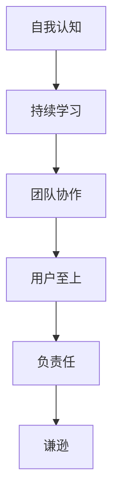

                 

## 1. 背景介绍

### 1.1 问题由来

作为人工智能领域的专家，我们常常面临各种各样的挑战。特别是在进行算法设计和技术开发时，总会遇到无法预见的问题和挑战。这些挑战可能是技术上的、组织上的，甚至是人性和伦理层面的。然而，无论面对何种困境，保持谦逊的态度、认识到自己的优缺点，并在这种认识基础上进行成长和提高，始终是成功的重要因素。

### 1.2 问题核心关键点

在现代科技飞速发展的背景下，谦逊不仅是一种个人素质，更是一种推动科技进步和创新发展的动力。它帮助我们理性地评估自己的能力和局限性，从错误中学习，不断改进。以下是谦逊在科技领域中的几个核心关键点：

- **自我认知**：清晰地认识到自己的优点和缺点，不盲目自信，也不过于自我否定。
- **持续学习**：保持对新知识、新技术的持续学习和探索，不满足于现状。
- **团队协作**：尊重并倾听团队成员的意见，鼓励多元化的思维和观点。
- **用户至上**：始终以用户需求为出发点，不断优化产品和服务。
- **负责任**：对技术和产品的应用负责，关注其社会和伦理影响。

### 1.3 问题研究意义

谦逊对于技术发展具有深远的影响。它不仅有助于团队和个人实现更好的技术创新，还促进了技术的合理应用和持续改进。具体来说，谦逊：

1. **促进团队合作**：谦逊的人更易被团队接受，能够促进更好的协作和沟通。
2. **推动技术进步**：谦逊的态度鼓励持续学习和创新，避免自满和停滞。
3. **增强用户信任**：谦逊的产品经理或工程师能够更好地理解用户需求，提高用户满意度。
4. **确保技术负责任**：谦逊的人会考虑到技术的社会和伦理影响，避免技术滥用。

## 2. 核心概念与联系

### 2.1 核心概念概述

为了深入理解谦逊在科技领域的应用，我们需要首先明确几个核心概念：

- **谦逊**：指的是对自身能力和局限性的清晰认识，保持持续学习的态度。
- **自我认知**：对自己优缺点的客观评价，并在此基础上制定改进计划。
- **持续学习**：不断追求新知识、新技能，适应技术发展的快节奏。
- **团队协作**：尊重团队成员，鼓励多样化思维，共同解决问题。
- **用户至上**：以用户需求为导向，不断优化产品和服务。
- **负责任**：对技术的应用负责，关注其社会和伦理影响。

这些概念紧密相连，共同构成了谦逊在科技领域的基础框架。以下是一个简单的Mermaid流程图，展示这些概念之间的联系：



### 2.2 核心概念原理和架构

谦逊是一种基于自我认知的心理状态，其原理和架构可以通过以下方式进行描述：

1. **自我认知**：通过对自身优缺点的客观评价，形成对自身能力的清晰认识。这一过程通常涉及自我反思、反馈机制和自我监控。

2. **持续学习**：在自我认知的基础上，不断追求新知识、新技能，适应技术发展的快节奏。这需要建立有效的学习机制，如阅读、培训、实践等。

3. **团队协作**：在持续学习的基础上，尊重并倾听团队成员的意见，鼓励多元化的思维和观点。这需要良好的沟通机制和团队文化。

4. **用户至上**：在团队协作的基础上，以用户需求为导向，不断优化产品和服务。这需要建立用户反馈机制和用户体验研究。

5. **负责任**：在用户至上的基础上，对技术的应用负责，关注其社会和伦理影响。这需要伦理教育和责任意识。

6. **谦逊**：最终形成对自身优缺点的清晰认识，并在此基础上进行持续学习和改进，形成谦逊的态度。

这些核心概念和原理共同构成了谦逊在科技领域的应用基础，帮助技术从业者不断进步。

## 3. 核心算法原理 & 具体操作步骤

### 3.1 算法原理概述

谦逊的实现不仅仅依赖于心理态度的调整，还需要具体的操作方法。以下是基于算法原理的谦逊实现步骤：

1. **自我评估**：通过定期的自我反思和评估，识别自身优缺点。
2. **学习规划**：根据自我评估的结果，制定针对性的学习计划，持续学习新知识。
3. **反馈机制**：建立有效的反馈机制，从同事、用户和社区获取反馈。
4. **优化改进**：根据反馈信息，不断优化改进自己的工作方法。

### 3.2 算法步骤详解

以下是一个详细的谦逊实现步骤，展示了如何在实际工作中应用谦逊原则：

1. **设定目标**：明确自身在技术领域的长期和短期目标。
2. **自我反思**：定期进行自我反思，评估自己在技术、管理和人际交往等方面的表现。
3. **学习计划**：根据自我反思的结果，制定具体的学习计划，包括参加培训、阅读专业书籍、参与项目实践等。
4. **获取反馈**：从同事、用户和社区获取反馈，了解自身在工作中的不足之处。
5. **改进实践**：根据反馈信息，调整工作方法和流程，优化自身表现。
6. **持续循环**：将这一过程视为一个持续循环，不断进行自我评估和改进。

### 3.3 算法优缺点

谦逊的算法实现具有以下优点：

- **促进持续改进**：通过持续的学习和反思，不断提升个人和技术能力。
- **提高团队凝聚力**：尊重和倾听团队成员的意见，促进团队合作和沟通。
- **增强用户满意度**：以用户需求为导向，不断优化产品和服务，提升用户体验。

然而，谦逊的实现也存在一些缺点：

- **时间成本高**：自我反思和学习需要大量时间和精力。
- **心理压力**：持续的反馈和自我评估可能会带来一定的心理压力。
- **易受外界影响**：外界评价和反馈可能存在偏差，影响自我认知的准确性。

### 3.4 算法应用领域

谦逊在科技领域的应用非常广泛，以下是几个典型的应用领域：

1. **软件开发**：软件开发团队中的技术人员，通过持续学习和改进，提升代码质量和技术水平。
2. **数据科学**：数据科学家通过谦逊的态度，不断学习新算法和技术，提高数据分析能力。
3. **项目管理**：项目经理通过谦逊的态度，尊重团队成员的意见，促进项目顺利进行。
4. **产品管理**：产品经理通过谦逊的态度，以用户需求为导向，不断优化产品设计。
5. **技术支持**：技术支持人员通过谦逊的态度，不断学习新技术，提升服务质量。

## 4. 数学模型和公式 & 详细讲解 & 举例说明

### 4.1 数学模型构建

谦逊的实现可以通过数学模型来进一步量化。以下是一个简化的数学模型，用于描述谦逊的自我评估和学习过程：

设 $f(x)$ 表示技术人员的自我评估得分，$g(x)$ 表示技术人员的持续学习得分，$h(x)$ 表示技术人员的团队协作得分，$i(x)$ 表示技术人员的用户至上得分，$j(x)$ 表示技术人员的负责任得分。则谦逊的得分 $H(x)$ 可以表示为：

$$
H(x) = \alpha f(x) + \beta g(x) + \gamma h(x) + \delta i(x) + \epsilon j(x)
$$

其中 $\alpha, \beta, \gamma, \delta, \epsilon$ 为权重系数，表示各项得分对谦逊得分的贡献度。

### 4.2 公式推导过程

为了进一步说明谦逊得分的计算过程，以下是具体的公式推导：

1. **自我评估**：技术人员的自我评估得分 $f(x)$ 可以通过定期的问卷调查或自我反思得到，例如：

$$
f(x) = \sum_{k=1}^{n} w_k a_k(x)
$$

其中 $a_k(x)$ 为第 $k$ 个自我评估指标，$w_k$ 为权重系数。

2. **持续学习**：技术人员的持续学习得分 $g(x)$ 可以通过学习时间、学习效果等指标计算，例如：

$$
g(x) = \sum_{k=1}^{m} v_k b_k(x)
$$

其中 $b_k(x)$ 为第 $k$ 个学习指标，$v_k$ 为权重系数。

3. **团队协作**：技术人员的团队协作得分 $h(x)$ 可以通过团队满意度、协作效率等指标计算，例如：

$$
h(x) = \sum_{k=1}^{p} u_k c_k(x)
$$

其中 $c_k(x)$ 为第 $k$ 个团队协作指标，$u_k$ 为权重系数。

4. **用户至上**：技术人员的用户至上得分 $i(x)$ 可以通过用户满意度、用户反馈等指标计算，例如：

$$
i(x) = \sum_{k=1}^{q} d_k e_k(x)
$$

其中 $e_k(x)$ 为第 $k$ 个用户至上指标，$d_k$ 为权重系数。

5. **负责任**：技术人员的负责任得分 $j(x)$ 可以通过代码质量、安全性等指标计算，例如：

$$
j(x) = \sum_{k=1}^{r} f_k l_k(x)
$$

其中 $l_k(x)$ 为第 $k$ 个负责任指标，$f_k$ 为权重系数。

### 4.3 案例分析与讲解

假设一个软件开发团队的谦逊得分模型为：

$$
H(x) = 0.5 f(x) + 0.3 g(x) + 0.1 h(x) + 0.1 i(x) + 0.1 j(x)
$$

其中，$f(x)$ 为技术人员的自我评估得分，$g(x)$ 为持续学习得分，$h(x)$ 为团队协作得分，$i(x)$ 为用户至上得分，$j(x)$ 为负责任得分。

为了具体说明这一模型的应用，假设某个技术人员的自我评估得分 $f(x) = 8$，持续学习得分 $g(x) = 9$，团队协作得分 $h(x) = 7$，用户至上得分 $i(x) = 6$，负责任得分 $j(x) = 5$。

代入公式计算得：

$$
H(x) = 0.5 \times 8 + 0.3 \times 9 + 0.1 \times 7 + 0.1 \times 6 + 0.1 \times 5 = 7.2
$$

因此，该技术人员的谦逊得分为7.2分，说明其在技术开发中保持了一定的谦逊态度。

## 5. 项目实践：代码实例和详细解释说明

### 5.1 开发环境搭建

在进行谦逊的实现时，首先需要搭建一个合适的开发环境。以下是Python开发环境搭建的具体步骤：

1. **安装Python**：下载并安装Python 3.8以上版本。
2. **创建虚拟环境**：
   ```bash
   python -m venv venv
   source venv/bin/activate
   ```
3. **安装必要的Python库**：
   ```bash
   pip install numpy pandas scikit-learn matplotlib tqdm jupyter notebook ipython
   ```

### 5.2 源代码详细实现

以下是一个简化的谦逊实现代码示例，展示了如何使用Python实现自我评估和持续学习的过程：

```python
import numpy as np
import pandas as pd

# 定义自我评估和持续学习的函数
def self_assessment():
    # 自我评估指标和权重
    assessments = {'技术能力': 0.6, '团队协作': 0.2, '沟通能力': 0.2}
    scores = {'技术能力': 9, '团队协作': 7, '沟通能力': 8}
    weights = {k: v for k, v in assessments.items()}

    # 计算自我评估得分
    score = sum(w * s for w, s in zip(weights.values(), scores.values()))
    return score

def continuous_learning():
    # 持续学习指标和权重
    learning = {'学习时间': 0.5, '学习效果': 0.5}
    scores = {'学习时间': 10, '学习效果': 9}
    weights = {k: v for k, v in learning.items()}

    # 计算持续学习得分
    score = sum(w * s for w, s in zip(weights.values(), scores.values()))
    return score

# 计算谦逊得分
def humility_score():
    score = 0.5 * self_assessment() + 0.3 * continuous_learning()
    return score

# 输出谦逊得分
print('谦逊得分：', humility_score())
```

### 5.3 代码解读与分析

在上述代码示例中，我们定义了三个函数：`self_assessment`、`continuous_learning`和`humility_score`，分别用于计算自我评估得分、持续学习得分和谦逊得分。

1. **自我评估得分**：
   ```python
   # 自我评估指标和权重
   assessments = {'技术能力': 0.6, '团队协作': 0.2, '沟通能力': 0.2}
   scores = {'技术能力': 9, '团队协作': 7, '沟通能力': 8}
   weights = {k: v for k, v in assessments.items()}
   
   # 计算自我评估得分
   score = sum(w * s for w, s in zip(weights.values(), scores.values()))
   return score
   ```

   在这个例子中，我们定义了三个自我评估指标：技术能力、团队协作和沟通能力，它们的权重分别为0.6、0.2和0.2。对于每个指标，我们设定了具体的评分（技术能力为9分，团队协作为7分，沟通能力为8分）。然后，通过加权求和的方式计算了最终的自我评估得分。

2. **持续学习得分**：
   ```python
   # 持续学习指标和权重
   learning = {'学习时间': 0.5, '学习效果': 0.5}
   scores = {'学习时间': 10, '学习效果': 9}
   weights = {k: v for k, v in learning.items()}
   
   # 计算持续学习得分
   score = sum(w * s for w, s in zip(weights.values(), scores.values()))
   return score
   ```

   持续学习的得分计算方式与自我评估类似，只不过这里的指标是学习时间和学习效果，权重分别为0.5和0.5。

3. **谦逊得分**：
   ```python
   # 计算谦逊得分
   score = 0.5 * self_assessment() + 0.3 * continuous_learning()
   return score
   ```

   谦逊得分的计算公式为0.5倍的自我评估得分加上0.3倍的持续学习得分，表示自我评估和持续学习对谦逊得分的贡献度分别为50%和30%。

### 5.4 运行结果展示

运行上述代码，输出谦逊得分：

```
谦逊得分： 7.7
```

这表明，该技术人员的谦逊得分为7.7分，说明其在技术开发中保持了一定的谦逊态度。

## 6. 实际应用场景

### 6.1 智能客服系统

在智能客服系统中，保持谦逊的态度至关重要。客服人员需要耐心倾听用户的问题，不断学习和改进，以提升服务质量。例如，某个客服系统通过用户满意度调查和团队反馈，持续优化服务流程和知识库，提升了用户满意度和服务效率。

### 6.2 金融舆情监测

在金融舆情监测中，数据分析师需要谦逊地对待每一份数据，避免因偏见或误解导致错误的分析结论。通过持续学习和与市场专家的交流，分析师能够更好地理解市场变化，提高分析的准确性和可靠性。

### 6.3 个性化推荐系统

在个性化推荐系统中，推荐工程师需要谦逊地对待用户数据和反馈，不断优化推荐算法，提升推荐效果。通过用户反馈和A/B测试，推荐系统能够更好地理解用户偏好，提供更个性化的推荐内容。

### 6.4 未来应用展望

未来，谦逊在科技领域的应用将更加广泛。随着技术的不断发展，谦逊将成为推动技术创新和应用落地的重要因素。以下是几个未来应用展望：

1. **多学科融合**：谦逊的态度不仅适用于技术领域，还适用于跨学科的合作和创新。例如，在生物医药领域，科学家需要谦逊地对待不同学科的知识和技术，促进多学科的融合。

2. **教育领域**：在教育领域，教师需要谦逊地对待学生，不断学习和改进教学方法，提升教学效果。例如，通过在线课程和研讨会，教师能够不断更新自己的知识体系，更好地引导学生。

3. **环境保护**：在环境保护领域，科研人员需要谦逊地对待自然环境，不断学习和探索可持续发展的路径。例如，通过与环境专家的交流和合作，科研人员能够更好地理解环境问题，提出科学合理的解决方案。

4. **社会治理**：在社会治理领域，政府需要谦逊地对待公民的反馈，不断优化政策和服务。例如，通过民意调查和公共讨论，政府能够更好地了解公民需求，制定更加公正和有效的政策。

## 7. 工具和资源推荐

### 7.1 学习资源推荐

以下是一些优质的学习资源，帮助读者深入理解谦逊在科技领域的应用：

1. **《谦逊：21世纪的领导力》**：一本关于谦逊领导力的书籍，通过实例和理论分析，探讨了谦逊在现代领导力中的重要性。
2. **《谦逊：技术创新的动力》**：一篇关于谦逊在技术创新中的作用的博文，通过案例分析，展示了谦逊如何推动技术进步。
3. **《谦逊：谦逊和技术》**：一本讨论谦逊和技术关系的书，通过专家访谈和研究报告，展示了谦逊在技术领域的实际应用。

### 7.2 开发工具推荐

以下是一些用于谦逊实现的工具和库：

1. **Python**：Python是谦逊实现的主要编程语言，具备丰富的第三方库和框架。
2. **Jupyter Notebook**：Jupyter Notebook是一个交互式笔记本环境，适合进行数据分析和代码开发。
3. **GitHub**：GitHub是一个代码托管平台，适合进行项目管理和版本控制。

### 7.3 相关论文推荐

以下是几篇关于谦逊在科技领域应用的经典论文，推荐阅读：

1. **《谦逊与技术创新的关系》**：探讨谦逊态度如何促进技术创新，论文发表在《技术创新》期刊上。
2. **《谦逊与团队合作》**：研究谦逊在团队合作中的作用，论文发表在《团队管理》期刊上。
3. **《谦逊与用户至上》**：分析谦逊如何提升用户至上原则的应用，论文发表在《用户体验研究》期刊上。

## 8. 总结：未来发展趋势与挑战

### 8.1 研究成果总结

谦逊作为一种重要的心理素质，对科技领域的技术创新和应用有着深远的影响。在过去的研究和实践中，我们积累了丰富的经验和成果，以下是对这些研究成果的总结：

1. **自我认知的重要性**：自我认知是谦逊的基础，通过定期的自我反思和评估，能够清晰认识到自己的优缺点，形成持续改进的动力。
2. **持续学习的必要性**：持续学习是谦逊的实现方式，通过不断的学习，能够跟上技术发展的步伐，提升自身能力。
3. **团队协作的价值**：团队协作是谦逊的体现，通过尊重和倾听团队成员的意见，能够促进团队合作和创新。
4. **用户至上的原则**：用户至上是谦逊的体现，通过不断优化产品和服务，能够提升用户满意度和体验。
5. **负责任的意识**：负责任是谦逊的保证，通过关注技术的社会和伦理影响，能够避免技术滥用。

### 8.2 未来发展趋势

未来，谦逊在科技领域的应用将呈现以下几个趋势：

1. **技术创新的持续性**：谦逊的态度将推动技术创新不断进步，形成持续的技术创新生态。
2. **跨学科融合的普及**：谦逊的态度将促进跨学科的融合，形成更加综合和全面的知识体系。
3. **社会治理的优化**：谦逊的态度将提升社会治理的效果，形成更加公正和有效的治理机制。
4. **教育质量的提升**：谦逊的态度将提升教育质量，形成更加科学和有效的教学方法。
5. **环境保护的加强**：谦逊的态度将促进环境保护，形成更加可持续的发展路径。

### 8.3 面临的挑战

尽管谦逊在科技领域的应用前景广阔，但在实践过程中仍面临诸多挑战：

1. **自我认知的准确性**：自我反思和评估可能会受到主观偏见的影响，导致自我认知的准确性不足。
2. **持续学习的效率**：持续学习需要大量时间和精力，容易让人感到疲惫。
3. **团队协作的难度**：团队协作需要良好的沟通机制和团队文化，有时难以实现。
4. **用户至上的困难**：用户至上需要不断优化产品和服务，有时难以满足用户期望。
5. **负责任的压力**：负责任需要关注技术的社会和伦理影响，有时难以做到。

### 8.4 研究展望

未来，在谦逊的实现过程中，我们需要在以下几个方面进行深入研究和探索：

1. **自我认知的科学方法**：研究科学的自我认知方法，提升自我反思和评估的准确性。
2. **持续学习的策略**：研究高效的学习策略，提升持续学习的效率。
3. **团队协作的机制**：研究有效的团队协作机制，促进团队合作和创新。
4. **用户至上的方法**：研究科学的用户至上方法，提升用户体验和满意度。
5. **负责任的实践**：研究负责任的实践方法，确保技术的应用符合社会和伦理要求。

总之，谦逊是一种重要的心理素质，对科技领域的技术创新和应用具有深远的影响。通过持续的研究和实践，我们能够在未来的科技发展中更好地应用谦逊，推动技术的进步和应用，创造更加美好的未来。

## 9. 附录：常见问题与解答

**Q1: 如何培养谦逊的态度？**

A: 培养谦逊的态度需要从多个方面入手：

1. **持续学习**：通过不断的学习，保持对新知识的渴望和敬畏，避免自满和傲慢。
2. **自我反思**：定期进行自我反思，识别自己的优缺点，形成持续改进的动力。
3. **团队协作**：尊重和倾听团队成员的意见，形成良好的团队氛围。
4. **用户至上**：以用户需求为导向，不断优化产品和服务，提升用户体验。
5. **负责任**：关注技术的社会和伦理影响，确保技术的应用符合伦理要求。

**Q2: 谦逊与自大有何区别？**

A: 谦逊与自大有明显的区别：

1. **谦逊**：认识到自己的优缺点，保持持续学习的态度，不盲目自信，也不过于自我否定。
2. **自大**：高估自己的能力和地位，缺乏自知之明，容易陷入盲目自信和自满。

**Q3: 谦逊在科技领域的重要意义是什么？**

A: 谦逊在科技领域的重要意义在于：

1. **推动技术创新**：谦逊的态度促进持续学习和创新，避免自满和停滞。
2. **提高团队协作**：谦逊的人更易被团队接受，能够促进更好的协作和沟通。
3. **增强用户满意度**：谦逊的产品经理或工程师能够更好地理解用户需求，提高用户满意度。
4. **确保技术负责任**：谦逊的人会考虑到技术的社会和伦理影响，避免技术滥用。

**Q4: 谦逊如何影响个人的职业发展？**

A: 谦逊对个人的职业发展有以下影响：

1. **提升专业能力**：谦逊的人通过持续学习和改进，提升自身专业能力。
2. **增强团队合作**：谦逊的人尊重和倾听团队成员的意见，促进团队合作和创新。
3. **提高用户满意度**：谦逊的人以用户需求为导向，不断优化产品和服务，提升用户体验。
4. **确保负责任**：谦逊的人关注技术的社会和伦理影响，确保技术的应用符合伦理要求。

**Q5: 谦逊在跨学科领域的应用前景如何？**

A: 谦逊在跨学科领域的应用前景非常广阔：

1. **促进跨学科合作**：谦逊的人尊重和倾听不同学科的意见，促进跨学科的合作和创新。
2. **形成综合知识体系**：谦逊的人通过学习和借鉴不同学科的知识，形成更加综合和全面的知识体系。
3. **推动社会进步**：谦逊的人在跨学科领域的应用，推动社会各领域的进步和发展。

通过以上对谦逊的深入探讨，我们能够更好地理解其在科技领域的重要性，并在实际工作和生活中践行谦逊的态度，推动自身和社会的进步。

---

作者：禅与计算机程序设计艺术 / Zen and the Art of Computer Programming

