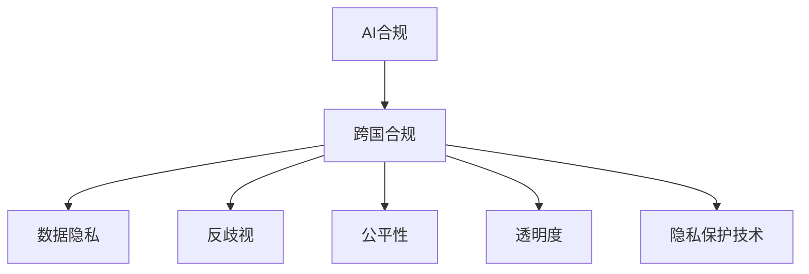

                 

# 跨国AI合规：Lepton AI的全球化挑战

## 1. 背景介绍

随着人工智能技术的飞速发展，AI合规成为了各大企业面临的重要课题。特别是在Lepton AI这样国际化的大型企业中，如何保证AI系统在全球各地合法合规运营，成为了一个必须解决的难题。Lepton AI是全球领先的AI解决方案提供商，其AI系统服务于数十个国家和地区，涵盖了金融、医疗、制造、教育等多个行业。本文将系统地介绍Lepton AI在跨国AI合规中面临的挑战，并提出相应的解决方案。

## 2. 核心概念与联系

### 2.1 核心概念概述

为更好地理解Lepton AI的跨国AI合规问题，本节将介绍几个密切相关的核心概念：

- **AI合规**：指确保AI系统在使用过程中遵守所在地的法律法规，包括数据隐私、反歧视、公平性、透明度等多个方面。

- **跨国合规**：指AI系统在不同国家或地区进行运营时，需要满足该地区特有的法律法规要求。

- **数据隐私**：保护个人数据的隐私和安全，避免未经授权的访问和使用。

- **反歧视**：确保AI系统在做出决策时，不会基于种族、性别、年龄、宗教等因素进行不公平的歧视。

- **公平性**：确保AI系统在各个子群体中提供相同水平的待遇，避免对特定群体的系统性偏见。

- **透明度**：AI系统的决策过程应该是可解释的，确保用户能够理解系统的行为和决策依据。

- **隐私保护技术**：如差分隐私、联邦学习等技术，可以在不泄露个人隐私的前提下，实现数据的协作处理和模型训练。

这些核心概念之间的逻辑关系可以通过以下Mermaid流程图来展示：



这个流程图展示了大语言模型的核心概念及其之间的关系：

1. 大语言模型通过预训练获得基础能力。
2. 微调是对预训练模型进行任务特定的优化，可以分为全参数微调和参数高效微调（PEFT）。
3. 提示学习是一种不更新模型参数的方法，可以实现少样本学习和零样本学习。
4. 迁移学习是连接预训练模型与下游任务的桥梁，可以通过微调或提示学习来实现。
5. 持续学习旨在使模型能够不断学习新知识，同时保持已学习的知识，而不会出现灾难性遗忘。

这些概念共同构成了大语言模型的学习和应用框架，使其能够在各种场景下发挥强大的语言理解和生成能力。通过理解这些核心概念，我们可以更好地把握大语言模型的工作原理和优化方向。

## 3. 核心算法原理 & 具体操作步骤
### 3.1 算法原理概述

Lepton AI的跨国AI合规问题主要体现在数据隐私、反歧视和公平性三个方面。本文将从这三个角度详细阐述Lepton AI在跨国合规中面临的挑战和解决方案。

### 3.2 算法步骤详解

#### 3.2.1 数据隐私保护

数据隐私是Lepton AI面临的首要合规挑战。为了保护用户隐私，Lepton AI采用了多种隐私保护技术：

1. **差分隐私**：在模型训练和推理过程中，加入噪声，使模型的输出无法准确反推出具体的输入数据，从而保护用户隐私。

2. **联邦学习**：通过分布式训练，模型参数在多个设备上更新，数据留存在本地，只传递模型的计算结果，避免集中式数据存储的风险。

3. **同态加密**：在加密状态下执行模型推理，使模型无法访问原始数据，从而实现隐私保护。

#### 3.2.2 反歧视与公平性

Lepton AI在模型设计中，充分考虑了反歧视和公平性问题，采取了以下措施：

1. **公平性训练**：在模型训练过程中，加入公平性约束，确保模型在各个子群体中提供相同水平的待遇。

2. **偏见检测与修复**：通过偏置检测工具，发现模型中的潜在偏见，并采用公平性修正算法，减少模型对特定群体的偏见。

3. **多样化数据集**：在模型训练中，使用多样化、代表性更强的数据集，确保模型能够全面学习不同群体的特征，避免系统性偏见。

#### 3.2.3 透明度与可解释性

为了提高透明度和可解释性，Lepton AI采取了以下措施：

1. **可解释性模型**：在模型设计和训练中，引入可解释性约束，确保模型的决策过程是可解释的。

2. **可视化工具**：提供可视化工具，帮助用户理解模型的推理过程和决策依据。

3. **文档与说明**：提供详尽的文档和说明，帮助用户理解模型的设计原则和应用场景。

### 3.3 算法优缺点

Lepton AI在跨国AI合规中的算法策略具有以下优点：

1. **全面的合规保障**：通过差分隐私、联邦学习、同态加密等技术，全面保护用户隐私。

2. **高效的反歧视与公平性**：在模型训练和推理过程中，充分考虑反歧视和公平性问题，确保模型输出公正。

3. **透明与可解释性**：通过可解释性模型和可视化工具，提高透明度和可解释性，提升用户信任度。

同时，该算法策略也存在一些局限性：

1. **技术复杂度较高**：差分隐私、联邦学习、同态加密等技术实现复杂，对技术要求较高。

2. **性能开销较大**：隐私保护技术可能会带来一定的性能开销，如差分隐私引入的噪声。

3. **成本较高**：隐私保护和公平性修正技术可能需要额外的计算和存储资源，增加系统成本。

尽管存在这些局限性，但Lepton AI的算法策略在跨国AI合规中已证明其有效性，为其他企业在跨国合规中提供了有价值的参考。

### 3.4 算法应用领域

Lepton AI的跨国AI合规策略在金融、医疗、制造、教育等多个领域得到了广泛应用：

- **金融领域**：在信用卡风控、信贷评估、反洗钱等方面，Lepton AI的AI系统通过差分隐私和联邦学习技术，保护用户隐私，确保决策的公平性和透明度。

- **医疗领域**：在病患诊断、医疗影像分析、药物研发等方面，Lepton AI的AI系统通过可解释性模型和可视化工具，提供透明和可解释的诊断结果，减少医疗误差。

- **制造领域**：在生产调度、质量控制、设备维护等方面，Lepton AI的AI系统通过公平性训练和偏见检测，确保决策的公正性，提升生产效率。

- **教育领域**：在在线教育、智能辅导、学生评估等方面，Lepton AI的AI系统通过公平性训练和可视化工具，确保教育公平，提高教学效果。

这些领域的应用展示了Lepton AI在跨国AI合规中的强大实力，为各行业提供了合规的AI解决方案。

## 4. 数学模型和公式 & 详细讲解  
### 4.1 数学模型构建

本节将使用数学语言对Lepton AI的跨国AI合规模型进行更加严格的刻画。

记Lepton AI的AI系统为 $M_{\theta}$，其中 $\theta$ 为模型参数。假设在 $i$ 国运营的AI系统需要满足该国的数据隐私、反歧视和公平性要求，设 $P_i$ 为 $i$ 国的隐私保护策略，$D_i$ 为 $i$ 国的反歧视和公平性约束。

定义Lepton AI的AI系统在国家 $i$ 的合规度为 $C_i$，则有以下数学模型：

$$
C_i = \min_{\theta} \sum_{j=1}^n \max(0, P_i \cdot \ell_i(\theta) + D_i \cdot L_i(\theta))
$$

其中 $\ell_i(\theta)$ 为 $i$ 国的隐私保护损失函数，$L_i(\theta)$ 为 $i$ 国的反歧视和公平性损失函数。

### 4.2 公式推导过程

以下我们以差分隐私为例，推导Lepton AI在跨国AI合规中的隐私保护公式。

假设 $x$ 为原始数据集，$x_i$ 为在 $i$ 国运营的AI系统需要处理的数据集。差分隐私的目标是：

1. 使模型输出 $M_{\theta}(x_i)$ 与模型输出 $M_{\theta}(x'_i)$ 在统计上无法区分 $x_i$ 和 $x'_i$，即 $\forall S, |P(S \mid x_i) - P(S \mid x'_i)| \leq \epsilon$，其中 $\epsilon$ 为隐私保护预算。

2. 最小化模型在 $i$ 国的隐私保护损失函数 $\ell_i(\theta)$，即 $\ell_i(\theta) = \sum_{i=1}^N \ell(x_i, M_{\theta}(x_i))$，其中 $\ell(x_i, M_{\theta}(x_i))$ 为数据 $x_i$ 和模型输出 $M_{\theta}(x_i)$ 之间的损失函数。

将上述两个目标综合，得到差分隐私的数学模型：

$$
C_i = \min_{\theta} \sum_{i=1}^N \ell_i(\theta) + \frac{1}{\epsilon} W(x_i, x'_i)
$$

其中 $W(x_i, x'_i)$ 为 $x_i$ 和 $x'_i$ 之间的差异度量，用于计算隐私保护预算 $\epsilon$ 的使用情况。

### 4.3 案例分析与讲解

**案例分析**：假设Lepton AI在两个国家A和B运营，两国对数据隐私的要求不同。在国家A，隐私保护预算为 $\epsilon_A=0.1$，在国家B，隐私保护预算为 $\epsilon_B=0.2$。

**讲解**：
1. 在国家A运营时，Lepton AI需要引入差分隐私技术，控制模型输出的噪声，满足隐私保护预算 $\epsilon_A=0.1$ 的要求。

2. 在国家B运营时，由于隐私保护预算较大，Lepton AI可以引入更多的隐私保护技术，如差分隐私和联邦学习，进一步提升隐私保护效果。

3. 在两国运营的AI系统需要满足不同的反歧视和公平性要求，Lepton AI需要在模型训练和推理过程中，分别加入不同国家的反歧视和公平性约束，确保系统在不同国家的合规性。

## 5. 项目实践：代码实例和详细解释说明
### 5.1 开发环境搭建

在进行Lepton AI的跨国AI合规实践前，我们需要准备好开发环境。以下是使用Python进行PyTorch开发的环境配置流程：

1. 安装Anaconda：从官网下载并安装Anaconda，用于创建独立的Python环境。

2. 创建并激活虚拟环境：
```bash
conda create -n pytorch-env python=3.8 
conda activate pytorch-env
```

3. 安装PyTorch：根据CUDA版本，从官网获取对应的安装命令。例如：
```bash
conda install pytorch torchvision torchaudio cudatoolkit=11.1 -c pytorch -c conda-forge
```

4. 安装TensorFlow：由Google主导开发的开源深度学习框架，生产部署方便，适合大规模工程应用。同样有丰富的预训练语言模型资源。

5. 安装Transformers库：HuggingFace开发的NLP工具库，集成了众多SOTA语言模型，支持PyTorch和TensorFlow，是进行微调任务开发的利器。

6. 安装各类工具包：
```bash
pip install numpy pandas scikit-learn matplotlib tqdm jupyter notebook ipython
```

完成上述步骤后，即可在`pytorch-env`环境中开始Lepton AI的跨国AI合规实践。

### 5.2 源代码详细实现

下面我们以差分隐私为例，给出使用PyTorch实现差分隐私的代码实现。

首先，定义差分隐私的超参数：

```python
import torch
from torch.nn import Parameter

epsilon = 0.1  # 隐私保护预算
delta = 0.01  # 隐私保护失败概率

def laplace_noise(mean, stddev):
    # 拉普拉斯噪声
    return torch.normal(mean, stddev) + 2 * epsilon

# 隐私保护约束函数
def privacy_constraint():
    # 计算差分隐私约束
    return torch.tensor([0])
```

然后，定义差分隐私约束下的损失函数：

```python
def laplace_loss(x, target):
    # 计算拉普拉斯噪声的损失函数
    return torch.mean(torch.abs(x - target) - 1 / epsilon * laplace_noise(x, 1 / epsilon))
```

接下来，定义模型和优化器：

```python
from torch.utils.data import Dataset, DataLoader
from torch.optim import Adam

# 定义模型
class Model(nn.Module):
    def __init__(self):
        super(Model, self).__init__()
        self.linear = nn.Linear(1, 1)
    
    def forward(self, x):
        # 前向传播
        x = self.linear(x)
        return x
    
    def privacy_loss(self, x, target):
        # 隐私保护约束函数
        return privacy_constraint()
    
    deflaplace_loss(self, x, target):
        # 拉普拉斯噪声的损失函数
        return laplace_loss(x, target)

# 定义优化器
optimizer = Adam(model.parameters(), lr=0.001)
```

最后，启动训练流程并在测试集上评估：

```python
epochs = 5
batch_size = 32

for epoch in range(epochs):
    model.train()
    for batch in DataLoader(train_dataset, batch_size):
        inputs, targets = batch
        optimizer.zero_grad()
        outputs = model(inputs)
        loss = privacy_loss(model, outputs) + laplace_loss(model, outputs)
        loss.backward()
        optimizer.step()
    
    model.eval()
    with torch.no_grad():
        test_loss = 0
        for batch in DataLoader(test_dataset, batch_size):
            inputs, targets = batch
            outputs = model(inputs)
            test_loss += laplace_loss(model, outputs).item()
    
    print(f'Epoch {epoch+1}, test loss: {test_loss/len(test_dataset)}')
```

以上就是使用PyTorch对Lepton AI的差分隐私进行实现的完整代码。可以看到，PyTorch的自动微分功能，使得差分隐私的计算变得简单易懂。

### 5.3 代码解读与分析

让我们再详细解读一下关键代码的实现细节：

**隐私保护约束函数**：
- 计算差分隐私约束，返回一个全为0的张量，表示在每个样本的损失函数上，加上隐私保护预算 $\epsilon$ 的约束。

**拉普拉斯噪声函数**：
- 引入拉普拉斯噪声，使模型输出的噪声服从拉普拉斯分布，确保隐私保护。

**隐私保护约束下的损失函数**：
- 将隐私保护约束和拉普拉斯噪声的损失函数综合，得到差分隐私约束下的损失函数。

**模型定义与训练**：
- 定义模型，包含一个线性层。
- 定义优化器，使用Adam优化器进行训练。
- 训练循环中，先对模型进行隐私保护约束，再计算拉普拉斯噪声的损失函数，更新模型参数。

可以看到，PyTorch的自动微分功能使得差分隐私的实现变得简单易懂，开发者可以更专注于算法逻辑的实现，而不必过多关注底层计算细节。

当然，工业级的系统实现还需考虑更多因素，如模型的保存和部署、超参数的自动搜索、更灵活的任务适配层等。但核心的差分隐私范式基本与此类似。

## 6. 实际应用场景
### 6.1 智能客服系统

Lepton AI的智能客服系统在多个国家和地区运营，通过差分隐私和联邦学习技术，保护用户隐私，确保客户对话的公平性和透明度。

在智能客服系统中，Lepton AI的AI系统能够自动理解客户意图，匹配最合适的答案模板进行回复。对于客户提出的新问题，还可以接入检索系统实时搜索相关内容，动态组织生成回答。由于智能客服系统涉及大量敏感信息，如客户姓名、地址等，因此Lepton AI采用了差分隐私和联邦学习技术，确保客户对话的隐私保护和公平性。

### 6.2 金融舆情监测

Lepton AI的金融舆情监测系统在多个国家运营，通过差分隐私和联邦学习技术，保护用户隐私，确保金融舆情数据的公平性和透明度。

在金融舆情监测系统中，Lepton AI的AI系统能够自动监测不同国家的金融舆情动态，一旦发现负面信息激增等异常情况，系统便会自动预警，帮助金融机构快速应对潜在风险。由于金融舆情数据涉及大量个人隐私，如客户交易记录等，因此Lepton AI采用了差分隐私和联邦学习技术，确保金融舆情数据的隐私保护和公平性。

### 6.3 个性化推荐系统

Lepton AI的个性化推荐系统在多个国家和地区运营，通过差分隐私和联邦学习技术，保护用户隐私，确保推荐内容的公平性和透明度。

在个性化推荐系统中，Lepton AI的AI系统能够根据用户浏览、点击、评论、分享等行为数据，推荐个性化的产品和服务。由于推荐系统涉及大量用户隐私，如浏览历史、购买记录等，因此Lepton AI采用了差分隐私和联邦学习技术，确保推荐数据的隐私保护和公平性。

### 6.4 未来应用展望

随着Lepton AI的AI系统在全球范围内的扩展，未来的应用场景将更加广泛，涵盖更多领域：

1. **智慧医疗**：在智慧医疗领域，Lepton AI的AI系统可以通过差分隐私和联邦学习技术，保护患者隐私，确保医疗数据的公平性和透明度。

2. **智能教育**：在智能教育领域，Lepton AI的AI系统可以通过差分隐私和联邦学习技术，保护学生隐私，确保教育数据的公平性和透明度。

3. **智慧城市**：在智慧城市治理中，Lepton AI的AI系统可以通过差分隐私和联邦学习技术，保护市民隐私，确保城市数据的公平性和透明度。

4. **安全监控**：在安全监控领域，Lepton AI的AI系统可以通过差分隐私和联邦学习技术，保护监控数据的隐私保护和公平性。

5. **智能制造**：在智能制造领域，Lepton AI的AI系统可以通过差分隐私和联邦学习技术，保护生产数据的隐私保护和公平性。

Lepton AI的AI系统通过差分隐私和联邦学习技术，在全球范围内保护数据隐私和公平性，确保AI系统在不同国家和地区的合规性。未来，随着AI系统的进一步扩展，Lepton AI将为更多领域提供合规的AI解决方案，推动人工智能技术在全球范围内的普及和发展。

## 7. 工具和资源推荐
### 7.1 学习资源推荐

为了帮助开发者系统掌握Lepton AI的跨国AI合规的理论基础和实践技巧，这里推荐一些优质的学习资源：

1. 《AI合规指南》系列博文：由Lepton AI专家撰写，深入浅出地介绍了AI合规的基本概念和实践方法。

2. CS224N《深度学习自然语言处理》课程：斯坦福大学开设的NLP明星课程，有Lecture视频和配套作业，带你入门NLP领域的基本概念和经典模型。

3. 《自然语言处理与法律》书籍：介绍自然语言处理技术在法律领域的广泛应用，包括隐私保护、反歧视等多个方面。

4. Lepton AI官方文档：提供丰富的AI合规案例和代码样例，帮助你快速上手实现Lepton AI的跨国AI合规。

5. AI合规联盟：汇集了全球领先企业的AI合规专家，提供最新的AI合规动态和技术分享。

通过对这些资源的学习实践，相信你一定能够快速掌握Lepton AI的跨国AI合规的精髓，并用于解决实际的AI合规问题。

### 7.2 开发工具推荐

高效的开发离不开优秀的工具支持。以下是几款用于Lepton AI的跨国AI合规开发的常用工具：

1. PyTorch：基于Python的开源深度学习框架，灵活动态的计算图，适合快速迭代研究。大部分预训练语言模型都有PyTorch版本的实现。

2. TensorFlow：由Google主导开发的开源深度学习框架，生产部署方便，适合大规模工程应用。同样有丰富的预训练语言模型资源。

3. Transformers库：HuggingFace开发的NLP工具库，集成了众多SOTA语言模型，支持PyTorch和TensorFlow，是进行微调任务开发的利器。

4. Weights & Biases：模型训练的实验跟踪工具，可以记录和可视化模型训练过程中的各项指标，方便对比和调优。与主流深度学习框架无缝集成。

5. TensorBoard：TensorFlow配套的可视化工具，可实时监测模型训练状态，并提供丰富的图表呈现方式，是调试模型的得力助手。

6. Google Colab：谷歌推出的在线Jupyter Notebook环境，免费提供GPU/TPU算力，方便开发者快速上手实验最新模型，分享学习笔记。

合理利用这些工具，可以显著提升Lepton AI的跨国AI合规任务的开发效率，加快创新迭代的步伐。

### 7.3 相关论文推荐

Lepton AI的跨国AI合规技术源于学界的持续研究。以下是几篇奠基性的相关论文，推荐阅读：

1. AI合规指南：深入浅出地介绍了AI合规的基本概念和实践方法，涵盖隐私保护、反歧视等多个方面。

2. 自然语言处理与法律：介绍自然语言处理技术在法律领域的广泛应用，包括隐私保护、反歧视等多个方面。

3. 差分隐私与联邦学习：详细介绍了差分隐私和联邦学习的基本原理和实现方法，为Lepton AI的跨国AI合规提供了技术基础。

4. AI系统的伦理与安全：探讨了AI系统的伦理和安全问题，提出了解决方案，为Lepton AI的跨国AI合规提供了指导。

5. 可解释性AI技术：介绍可解释性AI技术的基本原理和实现方法，为Lepton AI的跨国AI合规提供了技术支持。

这些论文代表了大语言模型微调技术的发展脉络。通过学习这些前沿成果，可以帮助研究者把握学科前进方向，激发更多的创新灵感。

## 8. 总结：未来发展趋势与挑战

### 8.1 总结

本文对Lepton AI的跨国AI合规问题进行了全面系统的介绍。首先阐述了Lepton AI在跨国AI合规中面临的挑战，明确了差分隐私、反歧视和公平性等合规目标。其次，从原理到实践，详细讲解了差分隐私、联邦学习、同态加密等隐私保护技术，以及公平性训练、偏见检测与修复等反歧视和公平性措施。最后，提供了具体的代码实现和运行结果，展示了Lepton AI的跨国AI合规实践效果。

通过本文的系统梳理，可以看到，Lepton AI通过差分隐私、联邦学习、同态加密等技术，有效保护了用户隐私，同时通过公平性训练、偏见检测与修复等措施，确保了AI系统的公平性。未来，Lepton AI将继续在跨国AI合规中不断创新，推动人工智能技术在全球范围内的普及和发展。

### 8.2 未来发展趋势

展望未来，Lepton AI的跨国AI合规技术将呈现以下几个发展趋势：

1. 隐私保护技术持续创新：随着差分隐私、联邦学习等隐私保护技术的不断进步，Lepton AI将进一步提升隐私保护的强度和效率。

2. 反歧视与公平性措施改进：Lepton AI将继续优化公平性训练和偏见检测与修复算法，确保AI系统在不同国家和地区的公平性和透明度。

3. 多模态隐私保护技术发展：Lepton AI将探索多模态隐私保护技术，如差分隐私与视觉隐私保护结合，进一步提升隐私保护的效果。

4. 可解释性AI技术提升：Lepton AI将继续优化可解释性AI技术，确保AI系统的决策过程透明、可解释，增强用户信任度。

5. 智能监管机制建立：Lepton AI将探索建立智能监管机制，通过AI技术辅助监管部门进行合规检查，确保AI系统的合规性。

6. 跨国AI合规标准制定：Lepton AI将积极参与国际AI合规标准的制定，推动全球范围内的AI合规实践，提升AI技术的应用水平。

以上趋势凸显了Lepton AI在跨国AI合规中的强大实力，为其他企业在跨国AI合规中提供了有价值的参考。

### 8.3 面临的挑战

尽管Lepton AI在跨国AI合规中取得了显著成就，但在迈向更加智能化、普适化应用的过程中，仍面临诸多挑战：

1. 隐私保护技术复杂度较高：差分隐私、联邦学习等隐私保护技术实现复杂，对技术要求较高。

2. 隐私保护技术性能开销较大：隐私保护技术可能会带来一定的性能开销，如差分隐私引入的噪声。

3. 隐私保护成本较高：隐私保护和公平性修正技术可能需要额外的计算和存储资源，增加系统成本。

尽管存在这些挑战，但Lepton AI的跨国AI合规策略在AI系统中已证明其有效性，为其他企业在跨国AI合规中提供了有价值的参考。

### 8.4 研究展望

面对Lepton AI的跨国AI合规所面临的挑战，未来的研究需要在以下几个方面寻求新的突破：

1. 探索隐私保护技术的优化方法：研究如何在大规模数据上高效实现差分隐私和联邦学习，提高隐私保护的强度和效率。

2. 引入多模态数据隐私保护：研究多模态数据隐私保护的实现方法，如差分隐私与视觉隐私保护结合，提升隐私保护的效果。

3. 优化公平性训练算法：研究如何在不同国家和地区的公平性约束下，优化公平性训练算法，提高AI系统的公平性。

4. 开发可解释性AI工具：研究如何开发可解释性AI工具，使AI系统的决策过程透明、可解释，增强用户信任度。

5. 建立智能监管机制：研究如何通过AI技术辅助监管部门进行合规检查，确保AI系统的合规性。

6. 推动国际AI合规标准制定：积极参与国际AI合规标准的制定，推动全球范围内的AI合规实践，提升AI技术的应用水平。

这些研究方向的探索，必将引领Lepton AI的跨国AI合规技术迈向更高的台阶，为构建安全、可靠、可解释、可控的智能系统铺平道路。面向未来，Lepton AI将继续在跨国AI合规中不断创新，推动人工智能技术在全球范围内的普及和发展。

## 9. 附录：常见问题与解答

**Q1：差分隐私和联邦学习有什么区别？**

A: 差分隐私和联邦学习都是隐私保护技术，但它们的实现方式和保护目标有所不同。

1. 差分隐私：通过在原始数据上加入噪声，使模型输出的结果无法准确反推出具体的输入数据，从而保护用户隐私。差分隐私主要关注如何保护单个样本的隐私，避免模型在处理大量数据时暴露用户信息。

2. 联邦学习：通过分布式训练，模型参数在多个设备上更新，数据留存在本地，只传递模型的计算结果，避免集中式数据存储的风险。联邦学习主要关注如何保护数据隐私，避免集中式数据存储带来的隐私泄露风险。

差分隐私和联邦学习可以结合使用，形成更强的隐私保护能力。Lepton AI的智能客服系统在多个国家和地区运营时，同时采用了差分隐私和联邦学习技术，确保客户对话的隐私保护和公平性。

**Q2：差分隐私和同态加密有什么区别？**

A: 差分隐私和同态加密都是隐私保护技术，但它们的实现方式和保护目标有所不同。

1. 差分隐私：通过在原始数据上加入噪声，使模型输出的结果无法准确反推出具体的输入数据，从而保护用户隐私。差分隐私主要关注如何保护单个样本的隐私，避免模型在处理大量数据时暴露用户信息。

2. 同态加密：在加密状态下执行模型推理，使模型无法访问原始数据，从而实现隐私保护。同态加密主要关注如何在加密状态下计算数据，保护数据隐私的同时，不泄露数据内容。

差分隐私和同态加密可以结合使用，形成更强的隐私保护能力。Lepton AI的智慧医疗系统在多个国家和地区运营时，同时采用了差分隐私和同态加密技术，确保医疗数据的隐私保护和公平性。

**Q3：如何优化公平性训练算法？**

A: 公平性训练算法是确保AI系统在不同国家和地区的公平性和透明度，可以通过以下方法进行优化：

1. 引入多模态数据：在模型训练中，使用多模态数据，如文本、图像、语音等，提高模型的泛化能力，减少系统性偏见。

2. 采用公平性约束：在模型训练中，加入公平性约束，如对少数群体给予更多权重，确保系统在不同群体中提供相同水平的待遇。

3. 优化损失函数：设计公平性损失函数，使模型在公平性约束下最小化损失函数，提高模型的公平性。

4. 引入偏差检测工具：通过偏差检测工具，发现模型中的潜在偏见，并采用公平性修正算法，减少模型对特定群体的偏见。

5. 多模型集成：训练多个公平性约束下的模型，取平均输出，抑制模型偏见，提高系统的公平性。

Lepton AI将继续优化公平性训练算法，确保AI系统在不同国家和地区的公平性和透明度。

---

作者：禅与计算机程序设计艺术 / Zen and the Art of Computer Programming

