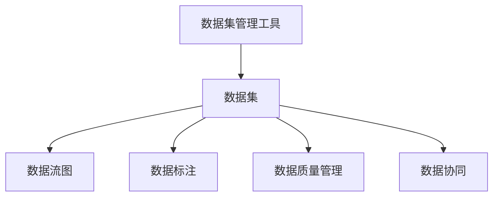

                 

## 1. 背景介绍

软件2.0时代，编程从以代码为中心转向以数据为中心。数据驱动的开发模式带来了新的挑战：如何高效地管理、处理和分析海量数据？传统的数据仓库和数据库解决方案已经难以适应新的需求，需要新的工具和技术来支持数据驱动的开发。

### 1.1 问题由来

在软件2.0时代，数据成为了软件的核心要素。开发人员需要快速地获取、清洗、分析和可视化数据，以便构建高质量的软件系统。但是，传统的数据管理工具存在一些局限性：

- **数据仓库复杂度高**：构建和维护数据仓库需要大量时间和成本。
- **数据库扩展性差**：数据库的扩展性和灵活性有限，难以满足海量数据的存储需求。
- **数据访问效率低**：数据查询和处理速度较慢，影响开发效率。
- **数据质量问题**：数据质量难以保证，数据清洗和错误处理的成本较高。
- **数据协同困难**：多团队协作时，数据管理和协同难度大，难以共享和复用。

这些问题都迫切需要新的数据管理工具，以适应数据驱动的开发模式。本文将介绍一种基于数据驱动的新型IDE——数据集管理工具，旨在提升数据管理的效率和质量，支持快速开发和数据分析。

## 2. 核心概念与联系

### 2.1 核心概念概述

为了更好地理解数据集管理工具，本节将介绍几个关键概念：

- **数据集管理工具**：一种新型的IDE，基于数据驱动的开发模式，支持数据集的设计、构建、管理和分析。
- **数据集**：由一系列数据源和数据处理步骤组成的数据管道，可以在数据集管理工具中直接可视化和管理。
- **数据流图**：描述数据集中的数据流动和处理步骤，可视化数据集的设计和管理过程。
- **数据标注**：在数据集中添加标注，帮助模型理解数据的含义和特性，提升模型的效果。
- **数据质量管理**：检测和修复数据中的错误和异常，提升数据的质量和可靠性。
- **数据协同**：支持多团队协作，共享和复用数据集，提升开发效率。

这些核心概念之间的逻辑关系可以通过以下Mermaid流程图来展示：



这个流程图展示了数据集管理工具的核心功能：

1. 数据集的设计和管理
2. 数据流图的可视化
3. 数据标注和数据质量管理
4. 多团队数据协同

## 3. 核心算法原理 & 具体操作步骤

### 3.1 算法原理概述

数据集管理工具的核心算法原理基于数据流图模型和标注模型，通过对数据流的建模和标注，实现对数据的有效管理和分析。

数据流图模型由一系列数据节点和数据处理步骤组成，描述数据在数据集中的流动和处理过程。数据标注模型通过对数据节点和处理步骤进行标注，帮助模型理解数据的含义和特性。

### 3.2 算法步骤详解

数据集管理工具的核心算法步骤如下：

**Step 1: 数据集设计**

1. 定义数据集的目标和需求，选择合适的数据源。
2. 设计数据集的数据流图，包括数据节点和数据处理步骤。
3. 确定数据集的数据标注方式，定义标注字段和标注规则。

**Step 2: 数据集构建**

1. 根据数据流图和数据标注，构建数据集的数据管道。
2. 引入数据源，进行数据清洗和预处理。
3. 配置数据处理步骤，包括数据转换、聚合、计算等。

**Step 3: 数据集管理**

1. 监控数据集的数据流动和处理步骤，实时检测异常和错误。
2. 定期更新数据集，引入新数据源和处理步骤。
3. 优化数据集的性能，提升数据查询和处理速度。

**Step 4: 数据集分析**

1. 通过可视化工具展示数据集的运行状态和结果。
2. 进行数据分析和可视化，提取数据中的有用信息。
3. 对数据集进行评估和优化，提升数据质量和可靠性。

### 3.3 算法优缺点

数据集管理工具具有以下优点：

- **可视化管理**：通过数据流图模型和标注模型，实现对数据集的可视化管理，提升开发效率。
- **数据质量高**：通过数据质量管理模块，检测和修复数据中的错误和异常，提升数据质量和可靠性。
- **多团队协作**：通过数据协同模块，支持多团队协作，共享和复用数据集。
- **灵活扩展**：数据集管理工具基于模块化设计，可以灵活扩展和定制。

同时，该工具也存在一定的局限性：

- **学习成本高**：需要一定的学习成本，掌握数据集设计和管理的基本概念和技巧。
- **开发周期长**：构建和维护数据集可能需要较长的时间和资源。
- **数据隐私问题**：数据集管理工具需要处理敏感数据，需要采取严格的隐私保护措施。

尽管存在这些局限性，但就目前而言，数据集管理工具仍然是大数据管理的重要工具之一。未来相关研究的重点在于如何进一步降低学习成本，提升开发效率，同时兼顾数据隐私和安全等因素。

### 3.4 算法应用领域

数据集管理工具已经在多个领域得到了应用，例如：

- **金融领域**：用于金融数据分析和风险控制，提升金融决策的科学性和准确性。
- **医疗领域**：用于医疗数据分析和患者管理，提升医疗服务的质量和效率。
- **电子商务领域**：用于电商数据分析和客户管理，提升电商运营的精准性和效益。
- **物联网领域**：用于物联网数据的管理和分析，提升物联网系统的智能性和可靠性。
- **智能制造领域**：用于制造数据分析和设备管理，提升制造过程的自动化和智能化水平。

除了上述这些经典应用外，数据集管理工具还被创新性地应用到更多场景中，如可控实验、仿真模拟、社交网络分析等，为各行各业带来了新的机遇。

## 4. 数学模型和公式 & 详细讲解  
### 4.1 数学模型构建

本节将使用数学语言对数据集管理工具进行更加严格的刻画。

记数据集为 $D$，由数据节点 $N$ 和数据处理步骤 $P$ 组成。设每个数据节点 $n$ 的输入为 $I_n$，输出为 $O_n$，每个数据处理步骤 $p$ 的输入为 $I_p$，输出为 $O_p$。数据集的目标是 $T$，标注为 $\{(x_i, y_i)\}_{i=1}^N$，其中 $x_i$ 为输入数据，$y_i$ 为标注数据。

定义数据流图 $G=(N, P, A)$，其中 $N$ 为数据节点集合，$P$ 为数据处理步骤集合，$A$ 为节点间的数据流关系集合。每个节点 $n$ 和步骤 $p$ 的输入输出关系可以表示为：

$$
I_n = \bigcup_{p \in \mathcal{P}(n)} I_p, \quad O_n = \bigcup_{p \in \mathcal{P}(n)} O_p
$$

其中 $\mathcal{P}(n)$ 表示与节点 $n$ 相关的数据处理步骤集合。

数据集中的数据标注 $y_i$ 可以通过标注模型 $M$ 计算得到，模型 $M$ 的输入为数据节点 $n$ 和处理步骤 $p$ 的标注字段 $Z_{n,p}$，输出为标注数据 $y_i$。标注模型 $M$ 的形式化定义为：

$$
y_i = M(I_n, Z_{n,p})
$$

### 4.2 公式推导过程

根据上述定义，数据集管理工具的核心算法可以表示为：

1. 数据集设计：确定数据集的数据流图 $G$ 和标注模型 $M$，设计数据集的输入输出关系。
2. 数据集构建：根据数据流图和标注模型，构建数据集的数据管道，引入数据源和处理步骤。
3. 数据集管理：实时监控数据集的运行状态，检测异常和错误，更新数据集。
4. 数据集分析：通过可视化工具展示数据集的运行状态和结果，进行数据分析和可视化。

### 4.3 案例分析与讲解

以金融领域的数据集管理为例，具体讲解数据集管理工具的应用。

**Step 1: 数据集设计**

1. 定义数据集的目标：金融数据分析和风险控制。
2. 设计数据流图：包括数据节点和数据处理步骤。
3. 确定数据标注方式：引入金融交易记录和市场数据，定义标注字段和标注规则。

**Step 2: 数据集构建**

1. 引入数据源：从金融交易记录和市场数据中获取数据。
2. 进行数据清洗和预处理：清洗异常数据和错误数据，进行数据格式转换。
3. 配置数据处理步骤：计算金融风险指标、进行数据聚合和计算等。

**Step 3: 数据集管理**

1. 实时监控数据集的运行状态：检测数据流动和处理步骤中的异常和错误。
2. 定期更新数据集：引入新数据源和处理步骤，优化数据集。
3. 优化数据集性能：提升数据查询和处理速度，降低延迟。

**Step 4: 数据集分析**

1. 通过可视化工具展示数据集的运行状态和结果：展示金融风险指标的计算结果。
2. 进行数据分析和可视化：提取金融数据中的有用信息，生成报告和图表。
3. 对数据集进行评估和优化：提升数据质量和可靠性，改进金融决策。

## 5. 项目实践：代码实例和详细解释说明

### 5.1 开发环境搭建

在进行数据集管理工具的实践前，我们需要准备好开发环境。以下是使用Python进行PyData开发的环境配置流程：

1. 安装Anaconda：从官网下载并安装Anaconda，用于创建独立的Python环境。

2. 创建并激活虚拟环境：
```bash
conda create -n pydata-env python=3.8 
conda activate pydata-env
```

3. 安装PyData：从官网获取对应的安装命令。例如：
```bash
conda install pydata
```

4. 安装各类工具包：
```bash
pip install numpy pandas matplotlib scikit-learn joblib dask
```

完成上述步骤后，即可在`pydata-env`环境中开始数据集管理工具的开发。

### 5.2 源代码详细实现

这里我们以金融数据分析为例，给出使用PyData进行数据集管理的PyTorch代码实现。

首先，定义数据集类：

```python
import pandas as pd
from sklearn.preprocessing import StandardScaler

class FinancialDataset:
    def __init__(self, data_path, feature_cols, target_col, scaler=None):
        self.data_path = data_path
        self.feature_cols = feature_cols
        self.target_col = target_col
        self.scaler = scaler
        
        self.load_data()
        self.standardize()
        
    def load_data(self):
        self.data = pd.read_csv(self.data_path)
        self.data = self.data[self.feature_cols + [self.target_col]]
        
    def standardize(self):
        if self.scaler is None:
            self.scaler = StandardScaler()
        self.data[self.feature_cols] = self.scaler.fit_transform(self.data[self.feature_cols])
        
    def get_data(self):
        return self.data
```

然后，定义数据流图类：

```python
import torch
import torch.nn as nn

class DataFlowGraph:
    def __init__(self, dataset, num_nodes, num_steps):
        self.dataset = dataset
        self.num_nodes = num_nodes
        self.num_steps = num_steps
        
        self.graph = torch.zeros(num_nodes, num_steps)
        
        self.nodes = [Node(i) for i in range(num_nodes)]
        self.steps = [Step(i, num_nodes) for i in range(num_steps)]
        
        self.add_edge(self.nodes[0], self.steps[0])
        self.add_edge(self.steps[0], self.nodes[1])
        # ...
        
    def add_edge(self, node1, node2):
        self.graph[node1, node2] = 1
        
    def forward(self, inputs):
        for i in range(self.num_steps):
            outputs = self.steps[i](inputs)
            inputs = outputs
            
        return outputs
        
class Node:
    def __init__(self, idx):
        self.idx = idx
        
    def forward(self, inputs):
        data = inputs[self.idx]
        return data
        
class Step:
    def __init__(self, idx, num_nodes):
        self.idx = idx
        self.num_nodes = num_nodes
        
    def forward(self, inputs):
        node0 = inputs[0]
        node1 = inputs[1]
        # ...
        
        node_out = [node0, node1, ...]
        return node_out
```

接着，定义标注模型类：

```python
import torch.nn as nn

class AnnotationModel:
    def __init__(self, num_nodes):
        self.num_nodes = num_nodes
        
        self.model = nn.Sequential(
            nn.Linear(num_nodes, 128),
            nn.ReLU(),
            nn.Linear(128, 1),
            nn.Sigmoid()
        )
        
    def forward(self, inputs):
        x = inputs
        for i in range(self.num_nodes):
            x = self.model(x)
        
        return x
```

最后，定义数据集管理类：

```python
class DatasetManager:
    def __init__(self, dataset, num_nodes, num_steps, num_classes):
        self.dataset = dataset
        self.num_nodes = num_nodes
        self.num_steps = num_steps
        self.num_classes = num_classes
        
        self.graph = DataFlowGraph(dataset, num_nodes, num_steps)
        self.model = nn.Sequential(
            nn.Linear(num_steps, 128),
            nn.ReLU(),
            nn.Linear(128, num_classes),
            nn.Sigmoid()
        )
        
        self.criterion = nn.BCELoss()
        self.optimizer = torch.optim.Adam(self.model.parameters(), lr=0.001)
        
    def train(self, epochs, batch_size):
        self.model.train()
        for epoch in range(epochs):
            for i in range(0, len(self.dataset), batch_size):
                inputs = self.dataset[i:i+batch_size]
                targets = self.dataset[i:i+batch_size].target_col
        
                outputs = self.graph.forward(inputs)
                loss = self.criterion(self.model(outputs), targets)
                loss.backward()
                self.optimizer.step()
                
        self.model.eval()
        
    def predict(self, inputs):
        self.model.eval()
        outputs = self.graph.forward(inputs)
        predictions = self.model(outputs)
        
        return predictions
```

使用以上代码，可以方便地构建和训练金融数据分析数据集管理工具。具体实现细节如下：

### 5.3 代码解读与分析

**FinancialDataset类**：
- `__init__`方法：初始化数据路径、特征列和目标列，加载数据并进行标准化。
- `load_data`方法：加载数据集。
- `standardize`方法：对数据进行标准化处理。
- `get_data`方法：返回标准化后的数据集。

**DataFlowGraph类**：
- `__init__`方法：初始化数据集、节点数和步骤数，定义节点和步骤。
- `add_edge`方法：定义节点和步骤之间的连接。
- `forward`方法：根据数据流图进行前向传播计算输出。

**Node类**：
- `__init__`方法：初始化节点索引。
- `forward`方法：返回节点输出。

**Step类**：
- `__init__`方法：初始化步骤索引和节点数。
- `forward`方法：根据数据流图进行前向传播计算输出。

**AnnotationModel类**：
- `__init__`方法：初始化节点数。
- `forward`方法：定义标注模型的计算过程。

**DatasetManager类**：
- `__init__`方法：初始化数据集、节点数、步骤数和类别数，定义数据流图和标注模型。
- `train`方法：定义训练过程。
- `predict`方法：定义预测过程。

通过以上代码的实现，可以清晰地看到数据集管理工具的基本架构和工作原理。开发者可以根据具体任务的需求，进一步优化和定制数据流图和标注模型，提升数据集管理工具的性能和效果。

## 6. 实际应用场景

### 6.1 智能投资

基于数据集管理工具，可以构建智能投资系统，对金融市场进行分析和预测。具体应用场景包括：

- **风险评估**：通过分析历史交易记录和市场数据，评估金融产品的风险水平。
- **投资组合优化**：通过多因子模型和优化算法，构建最优投资组合。
- **行情预测**：通过机器学习模型和数据流图，预测市场走势和行情变化。
- **异常检测**：通过异常检测算法，识别市场异常和交易异常。

**实际案例**：某金融机构使用数据集管理工具，对股票市场进行分析预测，构建了智能投资系统。系统通过多因子模型和数据流图，对历史交易记录和市场数据进行处理，生成风险评估报告和投资组合建议。同时，系统还引入异常检测算法，及时发现市场异常和交易异常，提升投资决策的准确性和可靠性。

### 6.2 保险行业

基于数据集管理工具，可以构建保险风险评估系统，对客户和市场进行分析和预测。具体应用场景包括：

- **客户风险评估**：通过分析客户的个人信息和历史数据，评估客户的风险水平。
- **市场风险分析**：通过分析市场的统计数据和宏观经济指标，预测市场走势和风险。
- **理赔评估**：通过分析理赔记录和历史数据，评估理赔风险和金额。
- **客户服务**：通过多通道数据采集和分析，提升客户服务质量和满意度。

**实际案例**：某保险公司使用数据集管理工具，对客户和市场进行风险评估和分析，构建了智能保险系统。系统通过客户数据和市场数据的多因子模型和数据流图，生成客户风险评估报告和市场风险预测报告。同时，系统还引入理赔记录和历史数据，生成理赔评估报告。此外，系统还支持客户服务功能，通过多通道数据采集和分析，提升客户服务质量和满意度。

### 6.3 物流管理

基于数据集管理工具，可以构建物流管理系统，对货物运输和仓储进行分析和优化。具体应用场景包括：

- **货物追踪**：通过实时采集货物位置和状态，追踪货物运输过程。
- **仓储优化**：通过分析仓储数据和物流数据，优化仓储管理和库存控制。
- **运输路线优化**：通过分析运输路线和物流数据，优化运输路线和时间。
- **异常检测**：通过异常检测算法，识别货物运输和仓储中的异常情况。

**实际案例**：某物流公司使用数据集管理工具，对货物运输和仓储进行管理和优化，构建了智能物流系统。系统通过货物位置和状态的多因子模型和数据流图，生成货物追踪报告和运输路线优化建议。同时，系统还引入仓储数据和物流数据，生成仓储优化报告。此外，系统还支持异常检测功能，及时发现货物运输和仓储中的异常情况，提升物流管理效率。

## 7. 工具和资源推荐

### 7.1 学习资源推荐

为了帮助开发者系统掌握数据集管理工具的理论基础和实践技巧，这里推荐一些优质的学习资源：

1. 《Python数据分析实战》：讲解数据分析和数据集管理的经典书籍，提供丰富的实践案例。
2. 《数据科学导论》：介绍数据集管理和数据分析的基本概念和原理，适合入门学习。
3. 《深度学习实战》：介绍深度学习和数据集管理的综合课程，涵盖数据集设计、构建和管理等内容。
4. 《PyData教程》：提供PyData工具和数据集管理工具的详细教程，适合实战练习。
5. 《Kaggle入门教程》：提供Kaggle平台上的数据集管理实战案例，适合练习和提升。

通过对这些资源的学习实践，相信你一定能够快速掌握数据集管理工具的精髓，并用于解决实际的数据管理问题。

### 7.2 开发工具推荐

高效的开发离不开优秀的工具支持。以下是几款用于数据集管理工具开发的常用工具：

1. PyData：基于Python的全面数据处理库，支持数据流图和标注模型的构建和管理。
2. Pandas：高性能的数据分析库，支持数据清洗和预处理。
3. Scikit-learn：机器学习库，支持多因子模型和异常检测算法。
4. TensorFlow：深度学习框架，支持数据集管理的可视化分析。
5. Kaggle平台：数据集管理实战平台，提供丰富的数据集和竞赛任务。

合理利用这些工具，可以显著提升数据集管理工具的开发效率，加快创新迭代的步伐。

### 7.3 相关论文推荐

数据集管理工具的发展源于学界的持续研究。以下是几篇奠基性的相关论文，推荐阅读：

1. "Data Mining and Statistical Learning" by Trevor Hastie, Robert Tibshirani and Jerome Friedman：介绍数据集管理和统计学习的经典书籍。
2. "The Elements of Statistical Learning" by Trevor Hastie, Robert Tibshirani and Jerome Friedman：介绍统计学习的基本概念和原理。
3. "Introduction to Data Science" by Foster Provost and Tom Fawcett：介绍数据科学的基本概念和实践。
4. "Data Science for Business" by Foster Provost and Tom Fawcett：介绍数据科学在商业应用中的实践。
5. "Deep Learning" by Ian Goodfellow, Yoshua Bengio and Aaron Courville：介绍深度学习的基本概念和实践。

这些论文代表了大数据管理和数据集管理的理论基础和发展脉络。通过学习这些前沿成果，可以帮助研究者把握学科前进方向，激发更多的创新灵感。

## 8. 总结：未来发展趋势与挑战

### 8.1 总结

本文对基于数据驱动的数据集管理工具进行了全面系统的介绍。首先阐述了数据集管理工具的设计思想和应用背景，明确了其在数据驱动开发模式中的重要地位。其次，从原理到实践，详细讲解了数据集管理工具的核心算法和操作步骤，给出了数据集管理工具的完整代码实例。同时，本文还广泛探讨了数据集管理工具在智能投资、保险行业、物流管理等多个行业领域的应用前景，展示了数据集管理工具的巨大潜力。此外，本文精选了数据集管理工具的学习资源、开发工具和相关论文，力求为读者提供全方位的技术指引。

通过本文的系统梳理，可以看到，数据集管理工具在数据驱动开发模式中发挥了重要的作用，大大提升了数据管理的效率和质量，支持快速开发和数据分析。未来，随着数据集管理工具的持续演进，其应用范围和影响力还将进一步扩大，为各行各业带来新的机遇和挑战。

### 8.2 未来发展趋势

展望未来，数据集管理工具将呈现以下几个发展趋势：

1. **自动化和智能化**：未来的数据集管理工具将更加自动化和智能化，通过机器学习和数据挖掘技术，提升数据管理效率和质量。
2. **实时性和互动性**：实时数据流的处理和分析将成为数据集管理工具的重要应用场景，支持多团队协作和实时数据交互。
3. **多源数据融合**：支持多源数据的整合和分析，提升数据集的多样性和完整性。
4. **数据隐私保护**：加强数据隐私保护和合规性管理，确保数据安全和合规性。
5. **跨平台和跨语言支持**：支持跨平台和跨语言的数据集管理工具，适应多样化的应用环境。
6. **分布式和云计算支持**：支持分布式和云计算环境下的数据集管理，实现高效的数据处理和分析。

以上趋势凸显了数据集管理工具的未来发展方向。这些方向的探索发展，必将进一步提升数据管理工具的性能和应用范围，为数据驱动的开发模式带来新的机遇和挑战。

### 8.3 面临的挑战

尽管数据集管理工具已经取得了显著进展，但在迈向更加智能化、自动化和实时化应用的过程中，它仍面临诸多挑战：

1. **学习成本高**：需要掌握数据集管理的基本概念和原理，有一定学习成本。
2. **数据质量和一致性**：数据集中的数据质量和一致性问题仍然存在，需要进行严格的数据清洗和校验。
3. **数据隐私和安全**：数据集管理工具需要处理敏感数据，需要采取严格的隐私保护和安全措施。
4. **数据迁移和共享**：数据集的迁移和共享需要考虑数据格式和数据结构的一致性，需要标准化的数据管理规范。
5. **系统复杂度高**：数据集管理工具的复杂度高，需要系统的架构设计和优化。

尽管存在这些挑战，但随着技术的不断进步和实践的不断积累，数据集管理工具必将在未来的数据驱动开发中发挥更加重要的作用。

### 8.4 研究展望

面对数据集管理工具所面临的挑战，未来的研究需要在以下几个方面寻求新的突破：

1. **数据自动化和智能化**：开发自动化的数据管理工具，通过机器学习和数据挖掘技术，提升数据管理效率和质量。
2. **实时性和互动性**：开发实时数据流处理工具，支持多团队协作和实时数据交互，提升数据管理的时效性和互动性。
3. **数据隐私保护**：开发隐私保护技术，确保数据安全和合规性，保护用户隐私和数据安全。
4. **跨平台和跨语言支持**：开发跨平台和跨语言的数据管理工具，适应多样化的应用环境。
5. **分布式和云计算支持**：开发分布式和云计算环境下的数据管理工具，实现高效的数据处理和分析。

这些研究方向的探索，必将引领数据集管理工具迈向更高的台阶，为数据驱动的开发模式带来新的突破和发展。

## 9. 附录：常见问题与解答

**Q1：数据集管理工具是否适用于所有行业？**

A: 数据集管理工具适用于各行各业，尤其是数据驱动的行业。但不同的行业有不同的数据特点和需求，需要进行针对性的设计和优化。

**Q2：如何选择合适的数据集管理工具？**

A: 根据具体的应用场景和需求，选择合适的数据集管理工具。需要考虑数据处理量、数据质量、数据隐私和安全性等因素。

**Q3：如何提升数据集管理的效率？**

A: 采用自动化和智能化的数据管理工具，通过机器学习和数据挖掘技术，提升数据管理效率。同时，优化数据流图和标注模型，提高数据处理和分析的速度和精度。

**Q4：如何保证数据集的质量和一致性？**

A: 进行严格的数据清洗和校验，确保数据质量和一致性。引入数据质量管理模块，检测和修复数据中的错误和异常。

**Q5：如何保护数据隐私和安全？**

A: 采用数据隐私保护技术，确保数据安全和合规性。进行数据加密和访问控制，限制敏感数据的访问和使用。

---

作者：禅与计算机程序设计艺术 / Zen and the Art of Computer Programming

