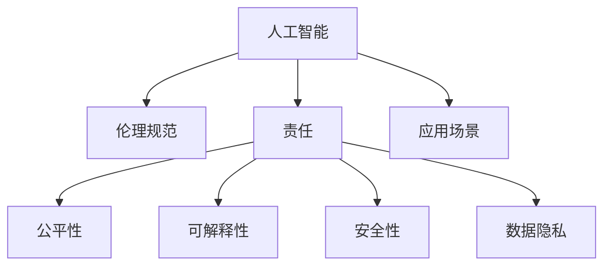

                 

# 软件 2.0 的伦理规范：人工智能的责任

> 关键词：人工智能, 伦理规范, 责任, 公平性, 可解释性, 安全性, 数据隐私

## 1. 背景介绍

### 1.1 问题由来
在经历了第一次工业革命以机械化为标志的“软件 1.0”时代，以及以数据和算法驱动为特征的“软件 2.0”时代后，人工智能(AI)技术的迅猛发展正在以前所未有的方式影响着我们的社会。AI 在医疗、金融、教育、娱乐等各个领域的应用，已经带来了显著的经济和社会效益，也暴露出一系列伦理和责任问题。

人工智能的发展，使得机器在越来越多的决策和行动中扮演关键角色。由此引发的伦理责任问题，特别是数据隐私、偏见、可解释性和安全等，已经成为制约其健康发展的关键因素。因此，构建一套科学、合理、全面的伦理规范体系，不仅是学术界和工业界的基本任务，也是实现AI技术可持续发展的必要条件。

### 1.2 问题核心关键点
本文旨在探索和阐述“软件 2.0”时代的伦理规范，特别是人工智能的责任问题。在探讨过程中，我们将围绕以下几个核心问题展开：

- AI 技术在实际应用中扮演的角色及其伦理责任。
- 数据隐私和数据使用的伦理规范。
- AI 系统决策过程的可解释性和公平性问题。
- AI 系统的安全性和鲁棒性要求。

这些核心问题贯穿于AI技术应用的全过程，深刻影响着技术伦理与规范的构建。因此，通过深入分析这些问题，可以为构建全面、合理的AI伦理规范提供理论依据。

## 2. 核心概念与联系

### 2.1 核心概念概述

为更好地理解人工智能的责任和伦理规范问题，本节将介绍几个密切相关的核心概念：

- **人工智能(AI)**：指由计算机程序和算法构成的模拟人类智能的计算技术。AI 包括机器学习、深度学习、自然语言处理等诸多子领域。
- **伦理规范(Ethical Norms)**：指在社会生活和职业活动中应当遵循的道德标准和行为准则，旨在促进公正、正义、自由和福祉。
- **责任(Responsibility)**：指个体或组织对于其行为所产生的结果所承担的义务和后果，包括道德责任、法律责任和职业责任等。
- **公平性(Fairness)**：指在社会和经济活动中，对于不同个体和群体之间的待遇公正、机会均等的追求。
- **可解释性(Explainability)**：指AI系统决策过程的透明性和可理解性，能够清楚解释其行为的原因和逻辑。
- **安全性(Security)**：指AI系统在处理数据和进行决策时的安全性和鲁棒性，避免因数据泄露、算法偏见等导致的安全隐患。
- **数据隐私(Data Privacy)**：指个人、组织和政府对其数据的控制权和保护措施，确保数据不被滥用。

这些核心概念之间的逻辑关系可以通过以下Mermaid流程图来展示：



这个流程图展示了许多核心概念及其之间的关系：

1. 人工智能技术在实际应用场景中扮演关键角色。
2. 人工智能的责任问题贯穿于伦理规范的各个方面。
3. 公平性、可解释性、安全性和数据隐私等是确保责任实现的必要条件。

这些概念共同构成了人工智能技术的伦理规范框架，为其在社会中的健康应用提供了基础。

## 3. 核心算法原理 & 具体操作步骤
### 3.1 算法原理概述

人工智能的伦理规范和责任问题，主要涉及以下几个关键环节：

1. **数据采集与处理**：AI 系统的决策依据通常是大量数据，如何获取和使用这些数据，是否侵犯了数据隐私，是伦理规范的重要议题。
2. **模型训练与优化**：AI 模型在数据上的训练过程，会受到偏见、数据不平衡等问题的影响，如何保证模型公平性和可解释性，是伦理规范的核心要求。
3. **系统部署与应用**：AI 系统在实际应用中的决策过程，是否能够透明解释，是否存在安全漏洞，是伦理规范的重点考量。

基于这些关键环节，本节将深入探讨AI 技术的伦理责任问题。

### 3.2 算法步骤详解

人工智能的伦理责任问题，涉及数据、模型和应用三个层面，下面我们将从这三个方面详细介绍操作步骤：

**Step 1: 数据采集与处理**
- **数据来源合法性**：确保数据采集和处理过程遵循相关法律法规，尊重个人隐私权。
- **数据质量控制**：对数据进行去重、去噪、标注等处理，确保数据的质量和代表性。
- **数据安全性**：采用数据加密、匿名化等措施，防止数据泄露和滥用。

**Step 2: 模型训练与优化**
- **偏见识别与修正**：在模型训练过程中，识别并修正数据集中的偏见，确保模型公平性。
- **可解释性建模**：使用可解释性算法，如决策树、LIME等，提高模型的可解释性。
- **鲁棒性评估**：通过对抗训练、鲁棒性测试等方法，提升模型的鲁棒性和安全性。

**Step 3: 系统部署与应用**
- **透明解释机制**：建立透明解释机制，清晰说明系统决策逻辑和依据。
- **安全与合规审计**：定期进行安全与合规审计，确保系统符合伦理规范和法律法规。
- **用户反馈与改进**：建立用户反馈机制，根据用户反馈不断优化系统。

### 3.3 算法优缺点

人工智能的伦理责任问题，涉及数据、模型和应用三个层面，下面我们将从这三个方面详细介绍操作步骤：

**优点**
- **促进公平性**：通过识别和修正数据偏见，确保模型的公平性，减少对弱势群体的歧视。
- **增强可解释性**：通过可解释性建模，提高模型的透明度，增强用户信任。
- **提升安全性**：通过鲁棒性评估和安全审计，确保系统的安全性和稳定性。

**缺点**
- **数据隐私问题**：数据采集和使用过程中，可能侵犯个人隐私权，引发伦理争议。
- **模型偏见难以消除**：尽管在模型训练中采取了一些公平性措施，但完全消除偏见仍具有挑战性。
- **可解释性限制**：复杂的深度学习模型，其决策过程难以全面解释，可能会引发用户不信任。
- **安全漏洞风险**：AI 系统的复杂性增加了安全漏洞的风险，需要投入更多资源进行防护。

尽管存在这些局限性，但通过合理设计和不断改进，可以最大限度地降低这些风险，提升AI系统的伦理性和可信赖度。

### 3.4 算法应用领域

人工智能的伦理责任问题，涉及多个领域，下面我们将详细介绍其主要应用场景：

**医疗领域**
- **数据隐私保护**：确保患者隐私数据的安全，防止数据滥用和泄露。
- **模型公平性**：医疗决策应公平对待所有患者，避免因种族、性别、年龄等特征导致的不公平。
- **可解释性要求**：医疗AI系统的决策应透明可解释，确保患者和医生的信任。

**金融领域**
- **数据安全**：确保金融数据的安全，防止数据泄露和滥用。
- **公平借贷**：金融决策应公平对待所有客户，避免因种族、性别、收入等因素导致的不公平。
- **可解释性**：金融AI系统的决策应透明可解释，确保用户和监管机构信任。

**教育领域**
- **数据隐私**：确保学生隐私数据的安全，防止数据滥用和泄露。
- **公平性**：教育资源分配应公平对待所有学生，避免因种族、性别、经济背景等因素导致的不公平。
- **可解释性**：教育AI系统的决策应透明可解释，确保教师和学生的信任。

## 4. 数学模型和公式 & 详细讲解  
### 4.1 数学模型构建

为了更好地理解人工智能的伦理责任问题，本节将使用数学语言对关键模型进行描述。

记AI系统的输入数据为 $\textbf{x} \in \mathbb{R}^n$，输出结果为 $\textbf{y} \in \mathbb{R}^m$。模型的训练过程可以表示为：

$$
\min_{\theta} \frac{1}{N} \sum_{i=1}^N \ell(y_i, f_{\theta}(x_i))
$$

其中，$f_{\theta}(x)$ 表示输入 $x$ 通过模型 $f$ 输出的结果，$\ell$ 表示损失函数，$\theta$ 表示模型参数。

### 4.2 公式推导过程

假设模型的输出结果 $y$ 为二分类问题，$y_i \in \{0,1\}$，输入 $x_i$ 为高维向量，$f_{\theta}(x)$ 为线性分类器。则二分类交叉熵损失函数为：

$$
\ell(y_i, f_{\theta}(x_i)) = -[y_i\log f_{\theta}(x_i) + (1-y_i)\log (1-f_{\theta}(x_i))]
$$

最小化交叉熵损失函数，可以表示为：

$$
\min_{\theta} \frac{1}{N} \sum_{i=1}^N -[y_i\log f_{\theta}(x_i) + (1-y_i)\log (1-f_{\theta}(x_i))]
$$

### 4.3 案例分析与讲解

以医疗领域的疾病诊断为例，其数学模型可以表示为：

$$
\min_{\theta} \frac{1}{N} \sum_{i=1}^N \ell(y_i, f_{\theta}(x_i))
$$

其中，$x_i$ 表示患者病历数据，$y_i$ 表示疾病标签（0/1表示未患病/患病），$f_{\theta}(x)$ 表示基于深度神经网络的诊断模型，$\ell$ 表示交叉熵损失函数，$\theta$ 表示模型参数。

在训练过程中，通过最小化损失函数，优化模型参数 $\theta$，使得模型能够准确预测患者的疾病状态。由于医疗数据具有高度敏感性和隐私性，因此需要在数据采集和处理过程中，遵循数据隐私保护和伦理规范，确保患者隐私权的保护。

## 5. 项目实践：代码实例和详细解释说明
### 5.1 开发环境搭建

在进行AI系统的开发和部署过程中，需要建立合适的开发环境。以下是一些关键步骤：

1. **选择开发框架**：如TensorFlow、PyTorch等，根据实际需求选择最合适的框架。
2. **配置计算资源**：确保有足够的计算资源（如GPU、TPU）支持模型的训练和推理。
3. **设置代码版本控制**：如Git，便于代码版本管理和团队协作。
4. **安装依赖包**：确保所有依赖包都已安装，包括第三方库和工具。

### 5.2 源代码详细实现

以医疗领域的疾病诊断系统为例，下面给出使用PyTorch框架进行模型训练的代码实现：

```python
import torch
import torch.nn as nn
import torch.optim as optim
from torch.utils.data import DataLoader, Dataset
from torchvision import datasets, transforms

# 定义模型结构
class DiagnosisModel(nn.Module):
    def __init__(self):
        super(DiagnosisModel, self).__init__()
        self.fc1 = nn.Linear(100, 50)
        self.fc2 = nn.Linear(50, 1)
        self.sigmoid = nn.Sigmoid()
    
    def forward(self, x):
        x = self.fc1(x)
        x = self.fc2(x)
        return self.sigmoid(x)

# 加载数据集
train_dataset = datasets.MNIST('data/', train=True, download=True, transform=transforms.ToTensor())
test_dataset = datasets.MNIST('data/', train=False, transform=transforms.ToTensor())

# 分割训练集和验证集
train_loader = DataLoader(train_dataset, batch_size=64, shuffle=True)
test_loader = DataLoader(test_dataset, batch_size=64, shuffle=False)

# 定义模型
model = DiagnosisModel()

# 定义损失函数和优化器
criterion = nn.BCELoss()
optimizer = optim.SGD(model.parameters(), lr=0.01, momentum=0.9)

# 定义训练过程
def train_epoch(model, data_loader, optimizer, criterion, num_epochs):
    for epoch in range(num_epochs):
        for batch_idx, (data, target) in enumerate(data_loader):
            optimizer.zero_grad()
            output = model(data)
            loss = criterion(output, target)
            loss.backward()
            optimizer.step()
            if (batch_idx+1) % 100 == 0:
                print(f'Epoch [{epoch+1}/{num_epochs}], Step [{batch_idx+1}/{len(data_loader)}], Loss: {loss.item():.6f}')

# 训练模型
train_epoch(model, train_loader, optimizer, criterion, 10)
```

### 5.3 代码解读与分析

代码实现中，我们首先定义了诊断模型的结构，使用了两个全连接层和一个Sigmoid激活函数，用于输出疾病概率。然后加载了MNIST数据集，将其分割为训练集和测试集，并使用DataLoader进行批次处理。最后，定义了损失函数、优化器和训练过程。

在训练过程中，我们使用了交叉熵损失函数和随机梯度下降优化器。通过不断地迭代训练，模型能够逐步学习输入数据与输出标签之间的关系，优化其参数，从而提高预测准确率。

## 6. 实际应用场景
### 6.1 医疗领域

在医疗领域，AI系统的伦理责任问题尤为重要。AI系统在疾病诊断、治疗方案推荐、医疗影像分析等方面具有显著优势，但也面临数据隐私、模型偏见和可解释性等挑战。

**数据隐私保护**
医疗数据具有高度敏感性，需要在数据采集和处理过程中严格遵循数据隐私保护规范。如HIPAA法规要求，医疗数据必须经过匿名化处理，并且只能在授权范围内使用。

**模型公平性**
医疗决策应公平对待所有患者，避免因种族、性别、年龄等因素导致的不公平。AI系统在疾病预测和治疗方案推荐过程中，应充分考虑不同群体的特殊需求和风险。

**可解释性要求**
医疗AI系统的决策应透明可解释，确保患者和医生的信任。医生需要理解AI系统的诊断依据和决策过程，以便在必要时进行干预或质疑。

### 6.2 金融领域

金融领域的AI系统，如信用评分、投资组合优化、欺诈检测等，对社会的公平性和安全性具有重要影响。AI系统在金融决策过程中，应遵循伦理规范，避免因数据偏见和算法漏洞导致的不公平和安全隐患。

**数据安全**
金融数据具有高度敏感性，需要在数据采集和处理过程中严格遵循数据安全规范。如GDPR法规要求，金融机构必须采取措施保护客户数据，防止数据泄露和滥用。

**公平性**
金融决策应公平对待所有客户，避免因种族、性别、收入等因素导致的不公平。AI系统在信用评分和投资组合优化过程中，应充分考虑不同客户群体的特殊需求和风险。

**可解释性**
金融AI系统的决策应透明可解释，确保用户和监管机构信任。监管机构需要理解AI系统的决策依据和逻辑，以便进行合规审计和风险管理。

## 7. 工具和资源推荐
### 7.1 学习资源推荐

为了帮助开发者系统掌握AI系统的伦理规范和责任问题，这里推荐一些优质的学习资源：

1. **《人工智能伦理》（Ethics in Artificial Intelligence）**：这是一本系统介绍人工智能伦理问题的书籍，涵盖了数据隐私、算法偏见、可解释性等核心议题。

2. **《公平机器学习》（Fairness in Machine Learning）**：介绍了机器学习中的公平性问题，并提供了实现公平性算法的技术手段。

3. **《深度学习入门》（Deep Learning）**：深度学习领域的经典入门书籍，详细介绍了深度学习的基本概念和技术原理。

4. **《可解释的人工智能》（Explainable AI）**：介绍了可解释性在AI系统中的应用，帮助开发者提高模型的透明度和可信度。

5. **《机器学习实战》（Machine Learning in Action）**：一本实战指南，提供了大量机器学习项目开发的案例和代码实现。

通过学习这些资源，相信你一定能够系统掌握AI系统的伦理规范和责任问题，并用于解决实际的AI应用问题。

### 7.2 开发工具推荐

高效的开发离不开优秀的工具支持。以下是几款用于AI系统开发的常用工具：

1. **TensorFlow**：谷歌开发的深度学习框架，具有强大的计算图能力和分布式训练功能，支持大规模模型训练。

2. **PyTorch**：Facebook开发的深度学习框架，灵活性和可扩展性强，适合科研和实际应用开发。

3. **Jupyter Notebook**：交互式编程环境，便于开发者进行代码调试和数据可视化。

4. **Scikit-learn**：数据科学和机器学习库，提供简单易用的机器学习算法和工具。

5. **Keras**：基于TensorFlow和Theano的高级神经网络API，简化了深度学习模型的构建和训练过程。

合理利用这些工具，可以显著提升AI系统的开发效率，加快创新迭代的步伐。

### 7.3 相关论文推荐

AI系统的伦理责任问题，涉及数据隐私、模型公平性、可解释性等多个方面，以下是几篇奠基性的相关论文，推荐阅读：

1. **《数据隐私保护》（Data Privacy Protection）**：介绍数据隐私保护的基本概念和实现方法。

2. **《公平机器学习算法》（Fair Machine Learning Algorithms）**：提出和分析了实现公平性算法的技术手段。

3. **《可解释性AI》（Explainable AI）**：介绍了可解释性在AI系统中的应用，并提供了实现方法。

4. **《AI系统中的伦理和法律问题》（Ethical and Legal Issues in AI Systems）**：探讨了AI系统在伦理和法律方面的挑战和应对措施。

这些论文代表了大数据和AI技术伦理规范的研究脉络，通过学习这些前沿成果，可以帮助研究者把握学科前进方向，激发更多的创新灵感。

## 8. 总结：未来发展趋势与挑战
### 8.1 研究成果总结

本文对AI系统的伦理规范和责任问题进行了系统探讨，主要围绕数据隐私、模型公平性、可解释性和安全性等核心议题展开。通过深入分析这些问题的内涵和解决途径，可以为构建全面、合理的AI伦理规范提供理论依据。

### 8.2 未来发展趋势

未来，AI系统的伦理规范和责任问题将呈现以下几个发展趋势：

1. **数据隐私保护技术创新**：随着数据量的增加和数据类型的多样化，数据隐私保护技术将不断创新，以适应更复杂的数据应用场景。

2. **模型公平性优化**：通过更科学的数据处理和模型训练方法，实现更公平、更公正的AI系统。

3. **可解释性模型设计**：设计和开发更多可解释性强的AI模型，提高系统的透明度和可信度。

4. **安全性提升**：通过增强模型的鲁棒性和安全性，确保AI系统在实际应用中的稳定性和可靠性。

5. **跨领域伦理规范整合**：在不同领域中推广和整合AI系统的伦理规范，形成统一的伦理标准和责任体系。

这些趋势凸显了AI系统的伦理责任问题的重要性和紧迫性，需要全社会共同努力，推动AI技术在更广泛的领域中健康发展。

### 8.3 面临的挑战

尽管AI系统的伦理规范和责任问题正在受到越来越多的关注，但在实际应用中仍面临诸多挑战：

1. **数据隐私保护**：数据采集和处理过程中，如何确保数据隐私权，避免数据泄露和滥用，是伦理规范面临的重大挑战。

2. **模型偏见和公平性**：AI系统在训练和应用过程中，如何避免和消除数据偏见，确保模型公平性，仍然是一个长期困扰的问题。

3. **可解释性限制**：复杂AI模型的决策过程难以全面解释，导致用户不信任，需要进一步研究提高模型的透明度。

4. **安全性风险**：AI系统的复杂性和多样性增加了安全漏洞的风险，需要投入更多资源进行防护。

5. **跨领域伦理规范整合**：不同领域中的伦理规范差异较大，如何统一和整合，形成一致的伦理标准和责任体系，是一个复杂的任务。

### 8.4 研究展望

面对这些挑战，未来的研究需要在以下几个方面寻求新的突破：

1. **隐私保护技术创新**：开发新的隐私保护算法和技术，如差分隐私、同态加密等，以适应更复杂的数据应用场景。

2. **公平性优化算法**：设计和应用更科学的公平性优化算法，减少数据偏见，确保模型公平性。

3. **可解释性模型设计**：设计和开发更多可解释性强的AI模型，提高系统的透明度和可信度。

4. **鲁棒性增强**：通过对抗训练、鲁棒性测试等方法，增强模型的鲁棒性和安全性。

5. **跨领域伦理规范整合**：在不同领域中推广和整合AI系统的伦理规范，形成统一的伦理标准和责任体系。

这些研究方向将为AI系统的伦理责任问题提供新的解决方案，推动AI技术在更广泛的领域中健康发展。

## 9. 附录：常见问题与解答

**Q1：AI系统的伦理规范和责任问题如何理解？**

A: AI系统的伦理规范和责任问题，是指在AI系统设计、开发、应用和维护过程中，需要遵循的道德标准和行为准则，以确保系统的公平性、可解释性和安全性。AI系统应尊重用户隐私权，避免数据滥用和偏见，确保决策过程透明可解释，防止安全漏洞和安全隐患。

**Q2：AI系统的伦理规范和责任问题如何实施？**

A: 实施AI系统的伦理规范和责任问题，需要从数据隐私保护、模型公平性、可解释性和安全性等方面进行全面考虑。具体措施包括：

- 数据采集和处理过程中，严格遵循数据隐私保护规范，确保数据安全和匿名化处理。
- 模型训练过程中，识别和修正数据集中的偏见，确保模型公平性。
- 决策过程中，提高模型的透明度和可解释性，确保用户信任。
- 系统部署与应用过程中，定期进行安全与合规审计，确保系统符合伦理规范和法律法规。

**Q3：AI系统的伦理规范和责任问题面临的主要挑战是什么？**

A: AI系统的伦理规范和责任问题面临的主要挑战包括：

- 数据隐私保护：如何确保数据隐私权，避免数据泄露和滥用。
- 模型偏见和公平性：如何避免和消除数据偏见，确保模型公平性。
- 可解释性限制：如何提高模型的透明度和可信度。
- 安全性风险：如何增强模型的鲁棒性和安全性，防止安全漏洞和安全隐患。
- 跨领域伦理规范整合：如何统一和整合不同领域中的伦理规范，形成一致的伦理标准和责任体系。

**Q4：AI系统的伦理规范和责任问题如何持续改进？**

A: AI系统的伦理规范和责任问题是一个持续改进的过程，需要全社会共同努力：

- 不断创新隐私保护技术，开发新的隐私保护算法和方法。
- 设计和应用更科学的公平性优化算法，减少数据偏见。
- 开发更多可解释性强的AI模型，提高系统的透明度和可信度。
- 通过对抗训练、鲁棒性测试等方法，增强模型的鲁棒性和安全性。
- 在不同领域中推广和整合AI系统的伦理规范，形成统一的伦理标准和责任体系。

通过不断探索和改进，可以最大限度地降低AI系统的伦理责任问题，推动AI技术在更广泛的领域中健康发展。

---

作者：禅与计算机程序设计艺术 / Zen and the Art of Computer Programming

