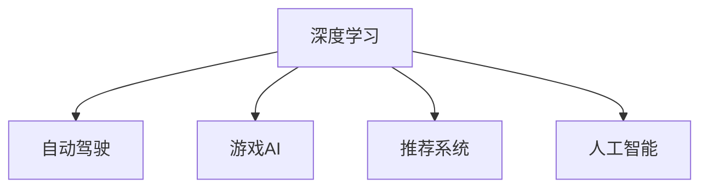

                 

# 软件 2.0 的发展趋势：深度学习、强化学习

> 关键词：深度学习, 强化学习, 人工智能, 机器学习, 自动驾驶, 游戏, 推荐系统

## 1. 背景介绍

### 1.1 问题由来
随着计算机技术和人工智能技术的不断进步，软件系统也正在经历着前所未有的变革。传统的软件系统开发方式（称为“软件 1.0”）基于固定的算法和规则，通过手工编写代码来构建和维护。而随着深度学习、强化学习等新兴技术的应用，新一代软件系统（称为“软件 2.0”）正在迅速崛起。

软件 2.0 的核心在于利用大数据、深度学习和强化学习等技术，通过自动化的方式进行模型训练和优化，使得软件系统能够具备更强的自适应和智能能力。这一趋势不仅体现在传统IT行业，也正在改变制造业、医疗、金融等各个领域的运行模式。

### 1.2 问题核心关键点
软件 2.0 的发展趋势主要体现在以下几个方面：

- **深度学习**：通过深度神经网络模型，从海量数据中学习到复杂的特征表示，提升软件系统的识别、分类、预测等能力。
- **强化学习**：通过与环境的互动，不断优化软件系统的决策策略，增强软件系统的自主性和智能性。
- **自动驾驶**：结合深度学习、强化学习等技术，开发自动驾驶汽车，实现更高效的交通管理和运输服务。
- **游戏AI**：应用深度学习和强化学习技术，提升游戏角色的智能水平和玩家体验。
- **推荐系统**：利用深度学习和强化学习，实现个性化推荐，提升用户满意度和平台粘性。

这些技术的发展，不仅推动了计算机科学的前沿研究，也为软件系统的智能化、自动化提供了新的可能性。

## 2. 核心概念与联系

### 2.1 核心概念概述

为了更好地理解软件 2.0 的发展趋势，本节将介绍几个密切相关的核心概念：

- **深度学习**：一种基于神经网络的机器学习方法，通过多层次的非线性映射，从原始数据中自动提取特征表示，用于分类、回归、生成等任务。

- **强化学习**：一种通过与环境互动，不断优化策略的学习方法。强化学习通过奖励和惩罚机制，引导智能体在环境中寻找最优策略。

- **自动驾驶**：结合计算机视觉、深度学习、强化学习等技术，开发自动驾驶汽车，实现自主驾驶和智能交通管理。

- **游戏AI**：利用深度学习和强化学习，提升游戏中的角色行为和决策策略，增强游戏趣味性和挑战性。

- **推荐系统**：通过深度学习、协同过滤等技术，分析用户行为和偏好，实现个性化推荐，提升用户满意度和平台粘性。

- **人工智能**：包括机器学习、深度学习、强化学习等多种技术，旨在构建能够模拟人类智能行为的计算系统。

这些核心概念之间的逻辑关系可以通过以下Mermaid流程图来展示：



这个流程图展示了大语言模型中深度学习和强化学习的核心概念及其之间的关系：

1. 深度学习通过多层次非线性映射，自动提取数据特征。
2. 自动驾驶、游戏AI、推荐系统等应用，都是深度学习在特定场景中的具体应用。
3. 人工智能涵盖了深度学习、强化学习等多种技术，构建通用智能系统。

## 3. 核心算法原理 & 具体操作步骤
### 3.1 算法原理概述

深度学习和强化学习是构建软件 2.0 的核心技术，其核心原理可以总结如下：

- **深度学习**：通过多层神经网络对输入数据进行非线性映射，自动提取特征表示。深度学习模型通常由多个卷积层、池化层、全连接层等组成，通过反向传播算法不断调整权重，最小化损失函数，优化模型性能。

- **强化学习**：智能体通过与环境互动，不断调整行为策略，以最大化累计奖励。强化学习模型通常包括状态、动作、奖励、策略等元素，通过Q值函数、策略网络等方法，优化策略选择。

### 3.2 算法步骤详解

深度学习和强化学习的具体步骤通常包括：

**深度学习步骤**：

1. **数据准备**：收集并预处理数据，划分为训练集、验证集和测试集。
2. **模型选择**：选择合适的网络结构（如卷积神经网络、循环神经网络、Transformer等）。
3. **模型训练**：使用训练集数据，通过反向传播算法调整模型参数，最小化损失函数。
4. **模型评估**：在验证集和测试集上评估模型性能，调整超参数。
5. **模型应用**：将训练好的模型应用于实际任务，如图像分类、自然语言处理等。

**强化学习步骤**：

1. **环境定义**：定义环境状态和动作空间，设置奖励机制。
2. **智能体设计**：选择或设计智能体，如Q网络、策略网络等。
3. **模型训练**：通过与环境互动，采集样本数据，优化模型参数。
4. **策略优化**：使用策略梯度等方法，优化智能体的行为策略。
5. **策略评估**：在测试集上评估智能体的性能，调整策略参数。

### 3.3 算法优缺点

深度学习和强化学习在构建软件 2.0 系统时具有以下优点：

- **强大的表达能力**：深度学习模型能够自动提取数据特征，无需手工设计特征表示。强化学习模型能够学习到复杂的行为策略，适应各种复杂的任务。
- **自动化优化**：深度学习和强化学习能够自动调整模型参数和策略，减少手工调参的复杂性。
- **数据利用率**：深度学习和强化学习能够高效利用大规模数据，提升模型的泛化能力。

同时，这些技术也存在一些局限性：

- **模型复杂度高**：深度学习模型和强化学习模型通常具有高复杂度，需要大量的计算资源和时间。
- **过拟合风险**：深度学习和强化学习模型容易过拟合训练数据，导致泛化性能下降。
- **数据质量要求高**：深度学习和强化学习模型的性能高度依赖于训练数据的质量和数量，数据采集和标注成本高。
- **可解释性差**：深度学习和强化学习模型的决策过程缺乏可解释性，难以调试和理解。

### 3.4 算法应用领域

深度学习和强化学习在多个领域得到了广泛应用，具体如下：

- **计算机视觉**：通过卷积神经网络等深度学习模型，实现图像分类、目标检测、人脸识别等任务。
- **自然语言处理**：利用循环神经网络、Transformer等模型，实现文本分类、机器翻译、语音识别等任务。
- **自动驾驶**：结合计算机视觉和强化学习技术，开发自动驾驶汽车，实现环境感知、路径规划、决策等任务。
- **游戏AI**：利用深度学习和强化学习技术，提升游戏角色的智能水平和决策能力。
- **推荐系统**：通过深度学习和协同过滤等技术，实现个性化推荐，提升用户满意度和平台粘性。
- **机器人控制**：结合深度学习和强化学习技术，实现机器人的自主决策和行为控制。

## 4. 数学模型和公式 & 详细讲解 & 举例说明

### 4.1 数学模型构建

本节将使用数学语言对深度学习和强化学习的数学模型进行更加严格的刻画。

假设深度学习模型为 $f(x; \theta)$，其中 $x$ 为输入，$\theta$ 为模型参数。假设训练集为 $D=\{(x_i, y_i)\}_{i=1}^N$，其中 $y_i$ 为标签。定义损失函数为 $L(\theta) = \frac{1}{N}\sum_{i=1}^N \ell(f(x_i; \theta), y_i)$，其中 $\ell$ 为损失函数（如交叉熵、均方误差等）。

在强化学习中，智能体的策略为 $\pi(a|s)$，动作空间为 $A$，状态空间为 $S$，奖励函数为 $r(s, a)$。定义状态值函数 $V(s)$ 和动作值函数 $Q(s, a)$，则强化学习的目标是最小化状态值函数 $V(s)$ 和动作值函数 $Q(s, a)$ 的误差。

### 4.2 公式推导过程

以深度学习模型中的卷积神经网络（CNN）为例，推导其前向传播和反向传播的计算公式。

假设卷积神经网络模型由多个卷积层、池化层和全连接层组成，定义卷积核为 $w$，池化函数为 $h$。则前向传播的计算过程如下：

$$
h = f_\text{conv}(x; w) = \max(0, W*x + b)
$$

$$
h' = f_\text{relu}(h) = \max(0, h)
$$

$$
x' = f_\text{pool}(h') = h'
$$

$$
y = f_\text{fc}(x'; \theta) = A*x' + b
$$

其中 $f_\text{conv}$ 和 $f_\text{relu}$ 分别为卷积和ReLU函数，$f_\text{pool}$ 为池化函数，$A$ 和 $b$ 分别为全连接层的权重和偏置。

反向传播的计算过程如下：

$$
\frac{\partial L}{\partial y} = \frac{\partial L}{\partial f_\text{fc}(x'; \theta)} \frac{\partial f_\text{fc}(x'; \theta)}{\partial x'} \frac{\partial x'}{\partial h'} \frac{\partial h'}{\partial h} \frac{\partial h}{\partial f_\text{conv}(x; w)} \frac{\partial f_\text{conv}(x; w)}{\partial x}
$$

其中 $\frac{\partial f_\text{fc}(x'; \theta)}{\partial x'}$ 和 $\frac{\partial h'}{\partial h}$ 等部分为卷积层、池化层和全连接层的梯度计算过程。

在强化学习中，动作值函数 $Q(s, a)$ 的计算公式为：

$$
Q(s, a) = \sum_{t=0}^{\infty} \gamma^t r(s_t, a_t) \prod_{i=0}^{t-1} \pi(a_i|s_i)
$$

其中 $\gamma$ 为折扣因子，$s_t$ 和 $a_t$ 分别为状态和动作。

### 4.3 案例分析与讲解

以深度学习中的图像分类任务为例，展示卷积神经网络模型的工作原理和优化过程。

假设输入图像为 $x$，卷积神经网络模型的结构如图 1 所示。其中，卷积层通过卷积核 $w$ 对输入图像进行特征提取，池化层通过池化函数 $h$ 对特征图进行下采样，全连接层通过权重 $A$ 和偏置 $b$ 进行分类。

假设损失函数为交叉熵损失函数 $\ell(y, \hat{y}) = -(y \log \hat{y} + (1-y) \log (1-\hat{y}))$，其中 $y$ 为真实标签，$\hat{y}$ 为模型预测的概率分布。


在模型训练过程中，首先通过前向传播计算损失函数 $L$，然后通过反向传播计算参数梯度 $\frac{\partial L}{\partial \theta}$。最后，使用优化算法（如随机梯度下降）更新模型参数 $\theta$，最小化损失函数 $L$。

## 5. 项目实践：代码实例和详细解释说明

### 5.1 开发环境搭建

在进行深度学习和强化学习项目开发时，首先需要准备好开发环境。以下是使用Python进行TensorFlow和PyTorch开发的环境配置流程：

1. 安装Anaconda：从官网下载并安装Anaconda，用于创建独立的Python环境。

2. 创建并激活虚拟环境：
```bash
conda create -n tf_env python=3.8
conda activate tf_env
```

3. 安装TensorFlow和PyTorch：
```bash
conda install tensorflow=2.3 pytorch=1.10
```

4. 安装各类工具包：
```bash
pip install numpy pandas scikit-learn matplotlib tqdm jupyter notebook ipython
```

完成上述步骤后，即可在`tf_env`环境中开始深度学习和强化学习实践。

### 5.2 源代码详细实现

下面我们以强化学习中的Q-learning算法为例，给出使用TensorFlow和PyTorch进行项目开发的PyTorch代码实现。

首先，定义Q-learning模型的基本组件：

```python
import torch
import numpy as np
import tensorflow as tf

class QNetwork(tf.keras.Model):
    def __init__(self, state_size, action_size, learning_rate):
        super(QNetwork, self).__init__()
        self.fc1 = tf.keras.layers.Dense(64, input_dim=state_size)
        self.fc2 = tf.keras.layers.Dense(64)
        self.fc3 = tf.keras.layers.Dense(action_size)

    def call(self, inputs):
        x = self.fc1(inputs)
        x = tf.nn.relu(x)
        x = self.fc2(x)
        x = tf.nn.relu(x)
        x = self.fc3(x)
        return x

class Agent:
    def __init__(self, state_size, action_size, learning_rate):
        self.state_size = state_size
        self.action_size = action_size
        self.learning_rate = learning_rate
        self.model = QNetwork(state_size, action_size, learning_rate)
        self.memory = []

    def act(self, state):
        if len(self.memory) > 0:
            return np.random.choice(self.action_size)
        return self.model.predict(state)

    def learn(self, state, action, reward, next_state, done):
        if len(self.memory) > 0:
            if done:
                self.model.trainable = False
                self.memory = []
                return
        Q_value = self.model.predict(state)
        Q_value_next = self.model.predict(next_state)
        Q_value[0][action] += self.learning_rate * (reward + self.learning_rate * np.amax(Q_value_next) - Q_value[0][action])
        self.model.trainable = True
        self.memory.append((state, action, reward, next_state, done))
```

然后，定义训练和评估函数：

```python
def train(env, agent, episodes=500):
    state_size = env.observation_space.shape[0]
    action_size = env.action_space.n
    learning_rate = 0.01
    agent = Agent(state_size, action_size, learning_rate)

    for episode in range(episodes):
        state = env.reset()
        done = False
        while not done:
            action = agent.act(state)
            next_state, reward, done, _ = env.step(action)
            agent.learn(state, action, reward, next_state, done)
            state = next_state
```

最后，启动训练流程并在测试集上评估：

```python
env = gym.make('CartPole-v0')
train(env, agent)

# 在测试集上评估模型
state = env.reset()
done = False
while not done:
    action = agent.act(state)
    next_state, reward, done, _ = env.step(action)
    state = next_state
```

以上就是使用TensorFlow和PyTorch进行强化学习项目开发的完整代码实现。可以看到，使用这些框架可以很方便地实现Q-learning算法，并进行模型训练和评估。

### 5.3 代码解读与分析

让我们再详细解读一下关键代码的实现细节：

**QNetwork类**：
- `__init__`方法：初始化神经网络模型，包含输入层、隐藏层和输出层。
- `call`方法：定义模型的前向传播过程，通过多个全连接层计算输出。

**Agent类**：
- `__init__`方法：初始化智能体，包括状态大小、动作大小、学习率等参数。
- `act`方法：根据当前状态，选择动作。如果智能体的记忆中已有样本，则随机选择动作；否则根据神经网络模型预测动作。
- `learn`方法：定义强化学习的训练过程，更新神经网络模型参数。

**train函数**：
- `state_size`、`action_size`、`learning_rate`等参数初始化智能体。
- 在每个 episode 中，通过与环境的互动，选择动作、获取奖励，并更新神经网络模型参数。

## 6. 实际应用场景

### 6.1 自动驾驶

自动驾驶技术是深度学习和强化学习的重要应用场景。通过计算机视觉和强化学习技术，自动驾驶汽车能够实现环境感知、路径规划、决策等任务，提高交通效率和安全性。

具体而言，自动驾驶系统可以通过摄像头、激光雷达等传感器获取实时环境数据，利用深度学习模型进行图像识别和目标检测，获取道路、车辆、行人等信息。然后通过强化学习模型，优化车辆的控制策略，实现自动驾驶。

### 6.2 游戏AI

游戏AI也是深度学习和强化学习的典型应用。通过深度学习和强化学习技术，游戏中的角色和NPC能够具备更高的智能水平和决策能力，提升游戏的趣味性和挑战性。

在游戏开发中，可以利用深度学习模型进行图像识别和行为预测，利用强化学习模型优化角色的行为策略，实现自动学习、自适应等智能功能。

### 6.3 推荐系统

推荐系统是深度学习和强化学习的重要应用领域。通过深度学习和协同过滤等技术，推荐系统能够分析用户行为和偏好，实现个性化推荐，提升用户满意度和平台粘性。

在推荐系统中，可以利用深度学习模型进行用户行为预测，利用强化学习模型优化推荐策略，实现实时调整推荐结果。

## 7. 工具和资源推荐

### 7.1 学习资源推荐

为了帮助开发者系统掌握深度学习和强化学习的理论基础和实践技巧，这里推荐一些优质的学习资源：

1. **《深度学习》系列书籍**：由深度学习领域权威专家撰写，全面介绍了深度学习的基本原理和经典模型。

2. **Deep Learning Specialization课程**：由斯坦福大学教授Andrew Ng开设，系统讲解深度学习的理论基础和实践技巧。

3. **《强化学习：基础与进阶》**：全面介绍了强化学习的理论基础和实践方法，适合初学者和进阶者学习。

4. **OpenAI Gym平台**：提供了丰富的环境库和测试平台，便于开发者快速上手测试深度学习和强化学习模型。

5. **TensorFlow官方文档**：详细介绍了TensorFlow的使用方法和API，是深度学习开发的重要参考资料。

6. **PyTorch官方文档**：详细介绍了PyTorch的使用方法和API，是深度学习开发的重要参考资料。

通过对这些资源的学习实践，相信你一定能够快速掌握深度学习和强化学习的精髓，并用于解决实际的NLP问题。

### 7.2 开发工具推荐

高效的开发离不开优秀的工具支持。以下是几款用于深度学习和强化学习开发的常用工具：

1. **TensorFlow**：由Google主导开发的开源深度学习框架，支持多种GPU和TPU硬件，具有强大的计算能力和丰富的API。

2. **PyTorch**：由Facebook开发的深度学习框架，灵活动态，适合研究和实验。

3. **Keras**：基于TensorFlow和Theano的高级API，提供了简单易用的深度学习模型开发接口。

4. **MXNet**：由亚马逊开发的深度学习框架，支持多种硬件平台，具有高效率和易用性。

5. **OpenAI Gym**：提供了丰富的环境库和测试平台，便于开发者快速上手测试深度学习和强化学习模型。

6. **Jupyter Notebook**：支持Python和其他语言的开发，提供了交互式的编程环境，方便调试和测试模型。

合理利用这些工具，可以显著提升深度学习和强化学习模型的开发效率，加快创新迭代的步伐。

### 7.3 相关论文推荐

深度学习和强化学习的发展源于学界的持续研究。以下是几篇奠基性的相关论文，推荐阅读：

1. **《深度学习》(Deep Learning)**：Yoshua Bengio、Ian Goodfellow、Aaron Courville等人合著，全面介绍了深度学习的基本原理和应用。

2. **《Deep Reinforcement Learning: An Introduction》**：Richard S. Sutton、Andrew G. Barto合著，详细介绍了强化学习的基本原理和经典算法。

3. **《Playing Atari with Deep Reinforcement Learning》**：Mnih等人的论文，展示了深度学习和强化学习在自动游戏方面的应用。

4. **《ImageNet Classification with Deep Convolutional Neural Networks》**：Alex Krizhevsky等人的论文，展示了深度学习在图像分类任务上的应用。

5. **《Natural Language Processing with Transformers》**：Jacob Devlin等人合著，详细介绍了Transformer模型在自然语言处理中的应用。

这些论文代表了大语言模型的发展脉络。通过学习这些前沿成果，可以帮助研究者把握学科前进方向，激发更多的创新灵感。

## 8. 总结：未来发展趋势与挑战

### 8.1 总结

本文对深度学习和强化学习的发展趋势进行了全面系统的介绍。首先阐述了深度学习和强化学习的基本原理和核心概念，明确了其在构建软件 2.0 系统中的重要价值。其次，从原理到实践，详细讲解了深度学习和强化学习的数学模型和具体步骤，给出了深度学习和强化学习项目开发的完整代码实例。同时，本文还广泛探讨了深度学习和强化学习在自动驾驶、游戏AI、推荐系统等多个领域的应用前景，展示了其广阔的发展潜力。此外，本文精选了深度学习和强化学习的各类学习资源，力求为开发者提供全方位的技术指引。

通过本文的系统梳理，可以看到，深度学习和强化学习在各个领域的应用正在逐渐普及，其强大的表达能力和自动化优化能力，正在改变传统软件系统的开发方式，推动人工智能技术的快速落地。未来，伴随深度学习和强化学习技术的不断演进，软件 2.0 必将在更多领域得到应用，为社会带来深远的影响。

### 8.2 未来发展趋势

展望未来，深度学习和强化学习的发展趋势主要体现在以下几个方面：

1. **自动化和智能化水平提升**：随着模型的不断优化和数据的不断积累，深度学习和强化学习模型将具备更强的自主性和智能化水平，能够在更复杂、多变的环境下进行学习和决策。

2. **多模态学习融合**：深度学习和强化学习将与其他模态（如视觉、语音等）进行融合，提升系统的综合感知能力和智能水平。

3. **模型压缩与加速**：随着硬件计算能力的不断提升，深度学习和强化学习模型将越来越复杂，需要进一步压缩和加速，以适应更广泛的实际应用。

4. **跨领域知识整合**：深度学习和强化学习将更多地整合外部知识库和规则库，增强模型的常识推理和逻辑推理能力。

5. **安全性与可解释性增强**：随着深度学习和强化学习模型的广泛应用，安全性与可解释性问题将逐渐被重视，需要开发更加安全、可解释的模型。

以上趋势凸显了深度学习和强化学习技术的广阔前景。这些方向的探索发展，必将进一步提升深度学习和强化学习模型的性能和应用范围，为构建更加智能、安全的软件系统奠定基础。

### 8.3 面临的挑战

尽管深度学习和强化学习技术已经取得了瞩目成就，但在迈向更加智能化、普适化应用的过程中，它仍面临着诸多挑战：

1. **数据质量与标注成本**：深度学习和强化学习模型的性能高度依赖于训练数据的质量和数量，数据采集和标注成本高，且存在数据分布不均衡的问题。

2. **模型复杂性与计算资源**：深度学习和强化学习模型通常具有高复杂度，需要大量的计算资源和时间，且容易过拟合训练数据。

3. **模型可解释性与鲁棒性**：深度学习和强化学习模型缺乏可解释性，难以调试和理解。模型在复杂环境下的鲁棒性也需进一步提升。

4. **跨领域知识整合**：深度学习和强化学习模型需要更多地整合外部知识库和规则库，但现有的知识表示和整合技术尚不成熟。

5. **安全性和隐私保护**：深度学习和强化学习模型的广泛应用将涉及大量的个人隐私数据，需要加强数据保护和隐私保护。

6. **伦理道德与社会责任**：深度学习和强化学习模型的决策过程需要考虑伦理道德和社会责任，避免偏见和歧视。

这些挑战需要学界和产业界的共同努力，不断优化模型、改进算法、加强监管，才能推动深度学习和强化学习技术的持续发展。

### 8.4 研究展望

未来，深度学习和强化学习的研究方向主要包括以下几个方面：

1. **跨模态学习与融合**：研究多模态数据的整合与融合方法，提升系统的综合感知能力和智能水平。

2. **模型压缩与加速**：开发更加高效的模型压缩与加速技术，提升深度学习和强化学习模型的计算效率。

3. **可解释性与透明性**：开发更加可解释与透明的深度学习和强化学习模型，提高模型的调试与解释能力。

4. **跨领域知识整合**：研究跨领域知识表示与整合方法，增强模型的常识推理和逻辑推理能力。

5. **安全性与隐私保护**：研究深度学习和强化学习模型的安全性与隐私保护技术，保障数据安全与用户隐私。

6. **伦理道德与社会责任**：研究深度学习和强化学习模型的伦理道德与社会责任问题，确保模型决策的公平性与透明性。

这些研究方向将推动深度学习和强化学习技术的不断进步，为构建更加智能、安全的软件系统提供新的思路和方案。

## 9. 附录：常见问题与解答

**Q1：深度学习和强化学习与传统机器学习有什么区别？**

A: 深度学习和强化学习与传统机器学习有以下几点区别：

1. **模型结构**：深度学习采用多层神经网络，能够自动提取数据特征；而传统机器学习通常手工设计特征表示。
2. **数据依赖**：深度学习和强化学习模型高度依赖于大量标注数据，传统机器学习可以使用无监督学习或半监督学习。
3. **决策方式**：深度学习和强化学习模型通常通过与环境的互动进行决策，传统机器学习模型通常根据规则进行决策。
4. **训练方式**：深度学习和强化学习模型通常使用端到端的训练方式，传统机器学习模型通常使用特征提取与分类器分离的训练方式。

**Q2：深度学习和强化学习有哪些应用场景？**

A: 深度学习和强化学习在多个领域得到了广泛应用，具体如下：

1. **计算机视觉**：用于图像分类、目标检测、人脸识别等任务。
2. **自然语言处理**：用于文本分类、机器翻译、语音识别等任务。
3. **自动驾驶**：用于环境感知、路径规划、决策等任务。
4. **游戏AI**：用于角色行为预测和决策策略优化。
5. **推荐系统**：用于个性化推荐和用户行为分析。
6. **机器人控制**：用于自主决策和行为控制。

这些应用场景展示了深度学习和强化学习在各个领域的广泛应用。

**Q3：如何优化深度学习和强化学习模型的性能？**

A: 优化深度学习和强化学习模型的性能需要综合考虑以下几个方面：

1. **数据质量与标注成本**：选择高质量的训练数据，尽量减少标注成本。
2. **模型复杂度与计算资源**：合理选择模型结构和参数，避免过拟合。使用分布式计算和加速技术，提升训练效率。
3. **模型压缩与加速**：使用模型压缩与加速技术，如量化、剪枝、蒸馏等，减少模型参数和计算量。
4. **多模态学习与融合**：将多模态数据进行整合与融合，提升系统的综合感知能力。
5. **可解释性与透明性**：开发可解释与透明的模型，提高模型的调试与解释能力。
6. **安全性与隐私保护**：研究模型安全性与隐私保护技术，保障数据安全与用户隐私。

通过综合优化这些方面，可以显著提升深度学习和强化学习模型的性能，推动其在实际应用中的广泛应用。

**Q4：如何选择合适的深度学习和强化学习框架？**

A: 选择合适的深度学习和强化学习框架需要考虑以下几个因素：

1. **功能与性能**：根据具体应用需求，选择功能强大、性能优异的框架。如TensorFlow、PyTorch、MXNet等。
2. **易用性与灵活性**：选择易于使用、灵活性高的框架，便于开发者快速上手与实验。
3. **社区与支持**：选择有活跃社区与丰富支持的框架，便于获取帮助与资源。
4. **文档与资源**：选择有丰富文档与教程的框架，便于快速学习与实践。
5. **扩展性与兼容性**：选择易于扩展与兼容其他框架的框架，便于与其他技术进行融合。

通过综合考虑这些因素，可以更有效地选择合适的深度学习和强化学习框架，提升开发效率与模型性能。

---

作者：禅与计算机程序设计艺术 / Zen and the Art of Computer Programming

