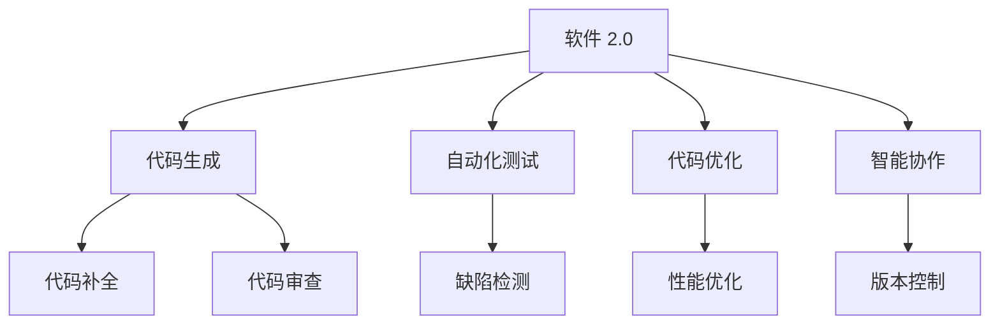

                 

# 软件 2.0 的应用：从实验室走向现实

## 1. 背景介绍

### 1.1 问题由来

随着软件技术的发展，软件开发进入了新纪元。从传统的“手写代码”到“模板开发”，再到如今的“自动生成代码”，软件开发已经从一种手艺转变为一种科学。软件 2.0 的兴起，标志着人类在软件开发领域的又一次重大变革，它将改变软件开发的生产力和模式，重新定义软件工程师的角色和工作方式。

软件 2.0 的核心在于利用人工智能（AI）和机器学习（ML）技术，对代码生成、测试、优化等环节进行自动化，使软件开发更加高效、准确、可控。这些技术不仅能够提升开发效率，降低开发成本，还能加速软件开发进程，使软件产品更快地进入市场。

### 1.2 问题核心关键点

软件 2.0 的核心关键点包括：

- **代码生成与优化**：利用 AI 技术自动生成代码，优化代码质量，减少手动编码工作量。
- **自动化测试与质量保证**：通过机器学习算法进行自动化测试，确保软件质量，提前发现并修复潜在缺陷。
- **自动部署与运维**：实现软件的自动部署和运维，提升软件交付速度和可靠性。
- **智能协作与辅助**：利用 AI 技术辅助软件开发，如智能代码补全、代码审查、版本控制等。

### 1.3 问题研究意义

研究软件 2.0 技术，对于推动软件开发模式的革新、提升软件开发效率、降低软件开发成本、加速软件开发进程，具有重要意义：

1. **提升生产效率**：自动化的代码生成和优化能够显著减少手动编码工作量，提高软件开发速度。
2. **降低开发成本**：通过自动化测试和部署，减少了人工测试和部署成本，使软件开发的成本效益更高。
3. **加速产品交付**：自动化的生成和部署过程使得软件产品能够更快地进入市场，满足用户需求。
4. **促进技术创新**：软件 2.0 技术的应用，催生了新的软件开发工具和平台，促进了技术创新和产业发展。
5. **增强软件质量**：通过自动化测试和质量保证，提高了软件的稳定性和可靠性，减少了用户投诉和售后成本。

## 2. 核心概念与联系

### 2.1 核心概念概述

为更好地理解软件 2.0 技术，本节将介绍几个关键概念：

- **软件 2.0**：一种利用人工智能和机器学习技术，对软件开发流程进行自动化的新范式。它涵盖代码生成、测试、优化、部署等多个环节，通过自动化的方式提升软件开发效率和质量。
- **代码生成**：使用 AI 技术自动生成代码，包括但不限于函数、类、模块等。
- **自动化测试**：利用机器学习算法对软件进行自动化测试，发现并修复潜在缺陷，提升软件质量。
- **代码优化**：通过自动化手段，对生成的代码进行优化，提升代码质量和性能。
- **智能协作**：利用 AI 技术辅助软件开发，如智能代码补全、代码审查、版本控制等，提高开发效率和协作质量。

这些概念之间的逻辑关系可以通过以下 Mermaid 流程图来展示：



这个流程图展示了大规模软件开发的各个环节，以及软件 2.0 技术如何在这些环节中发挥作用。

## 3. 核心算法原理 & 具体操作步骤
### 3.1 算法原理概述

软件 2.0 的核心算法原理包括以下几个方面：

- **代码生成**：通过分析已有的代码库、API 文档等数据，利用机器学习算法生成高质量的代码。
- **自动化测试**：使用机器学习算法对软件进行自动化测试，包括单元测试、集成测试、系统测试等。
- **代码优化**：通过分析代码结构、执行效率等信息，利用机器学习算法对代码进行优化，提升代码质量和性能。
- **智能协作**：利用自然语言处理（NLP）和机器学习技术，实现代码补全、代码审查等智能辅助功能。

### 3.2 算法步骤详解

软件 2.0 技术的实现步骤大致如下：

1. **数据收集与预处理**：收集相关的代码库、API 文档、缺陷报告等数据，并进行清洗、标注等预处理。
2. **模型训练**：利用收集到的数据，训练相关的机器学习模型，如代码生成模型、测试模型、优化模型等。
3. **代码生成与优化**：将预训练的模型应用到实际的软件开发场景中，自动生成或优化代码。
4. **自动化测试**：利用训练好的模型对生成的代码进行自动化测试，发现并修复潜在缺陷。
5. **智能协作**：利用 NLP 和机器学习技术，实现代码补全、代码审查等功能，提升开发效率和协作质量。

### 3.3 算法优缺点

软件 2.0 技术具有以下优点：

- **高效性**：自动化的代码生成、测试和优化能够显著提高软件开发效率，减少手动编码工作量。
- **准确性**：机器学习模型能够自动发现和修复潜在缺陷，提升软件质量。
- **可扩展性**：软件 2.0 技术可应用于各种软件开发场景，具有广泛的应用前景。

同时，软件 2.0 技术也存在一些缺点：

- **依赖高质量数据**：模型的性能很大程度上依赖于训练数据的数量和质量，需要大量标注数据。
- **模型复杂度**：大规模机器学习模型的训练和优化需要高性能计算资源，对硬件要求较高。
- **模型泛化能力**：模型在特定场景下的表现可能较好，但在新的应用场景下泛化能力有限。
- **开发成本高**：开发和维护机器学习模型需要专业知识，开发成本较高。

### 3.4 算法应用领域

软件 2.0 技术已经在软件开发、测试、优化、协作等多个领域得到了应用，例如：

- **软件开发**：自动生成代码、智能代码补全、代码审查等。
- **软件测试**：自动化测试、缺陷检测、性能测试等。
- **软件优化**：代码优化、性能优化、代码重构等。
- **智能协作**：版本控制、任务管理、团队协作等。

除了上述这些经典应用外，软件 2.0 技术还被创新性地应用到更多场景中，如智能代码补全、代码质量评估、需求分析等，为软件开发带来了全新的突破。

## 4. 数学模型和公式 & 详细讲解 & 举例说明

### 4.1 数学模型构建

本节将使用数学语言对软件 2.0 技术进行更加严格的刻画。

假设软件开发场景中，已有的代码库为 $\mathcal{D}$，API 文档为 $\mathcal{A}$，缺陷报告为 $\mathcal{B}$。我们需要构建一个生成代码的模型 $M_{\theta}$，使得其能够根据 $\mathcal{D}$ 和 $\mathcal{A}$ 生成高质量的代码。

记 $M_{\theta}$ 在输入 $\mathcal{X}$ 上的输出为 $\hat{Y}$，其中 $\mathcal{X}=\mathcal{D} \cup \mathcal{A}$，$\hat{Y}$ 表示生成的代码。模型的目标是最小化代码与实际代码之间的差异，即：

$$
\min_{\theta} \mathcal{L}(\hat{Y}, Y)
$$

其中 $\mathcal{L}$ 为损失函数，$\hat{Y}$ 为模型生成的代码，$Y$ 为实际生成的代码。常见的损失函数包括交叉熵损失、均方误差损失等。

### 4.2 公式推导过程

以交叉熵损失为例，假设模型 $M_{\theta}$ 在输入 $x$ 上的输出为 $\hat{y}$，真实标签为 $y \in \{0,1\}$。则交叉熵损失函数定义为：

$$
\ell(\hat{y}, y) = -y\log \hat{y} - (1-y)\log (1-\hat{y})
$$

将其代入经验风险公式，得：

$$
\mathcal{L}(\theta) = -\frac{1}{N}\sum_{i=1}^N [y_i\log \hat{y}_i+(1-y_i)\log(1-\hat{y}_i)]
$$

在得到损失函数的梯度后，即可带入参数更新公式，完成模型的迭代优化。重复上述过程直至收敛，最终得到适应软件开发场景的最优模型参数 $\theta^*$。

### 4.3 案例分析与讲解

以代码生成为例，假设我们要生成一个函数的代码，其输入为函数名称和参数类型，输出为实际的函数代码。我们可以将函数名称和参数类型作为模型 $M_{\theta}$ 的输入，函数代码作为输出。通过收集大量已有的函数代码作为训练数据，利用机器学习算法训练模型 $M_{\theta}$，使其能够根据输入生成对应的代码。训练过程可以采用监督学习的方式，即使用已有的函数代码作为标签，训练模型。

## 5. 项目实践：代码实例和详细解释说明

### 5.1 开发环境搭建

在进行软件 2.0 实践前，我们需要准备好开发环境。以下是使用 Python 进行 PyTorch 开发的环境配置流程：

1. 安装 Anaconda：从官网下载并安装 Anaconda，用于创建独立的 Python 环境。

2. 创建并激活虚拟环境：
```bash
conda create -n pytorch-env python=3.8 
conda activate pytorch-env
```

3. 安装 PyTorch：根据 CUDA 版本，从官网获取对应的安装命令。例如：
```bash
conda install pytorch torchvision torchaudio cudatoolkit=11.1 -c pytorch -c conda-forge
```

4. 安装 Transformers 库：
```bash
pip install transformers
```

5. 安装各类工具包：
```bash
pip install numpy pandas scikit-learn matplotlib tqdm jupyter notebook ipython
```

完成上述步骤后，即可在 `pytorch-env` 环境中开始软件 2.0 实践。

### 5.2 源代码详细实现

这里我们以代码生成为例，给出使用 Transformers 库对代码生成模型进行 PyTorch 代码实现。

首先，定义代码生成的数据处理函数：

```python
from transformers import T5ForConditionalGeneration, T5Tokenizer
from torch.utils.data import Dataset
import torch

class CodeGenDataset(Dataset):
    def __init__(self, descriptions, sources, max_len=128):
        self.descriptions = descriptions
        self.sources = sources
        self.max_len = max_len
        
    def __len__(self):
        return len(self.descriptions)
    
    def __getitem__(self, item):
        desc = self.descriptions[item]
        source = self.sources[item]
        
        encoding = self.tokenizer(desc, return_tensors='pt', max_length=self.max_len, padding='max_length', truncation=True)
        input_ids = encoding['input_ids'][0]
        attention_mask = encoding['attention_mask'][0]
        
        return {'input_ids': input_ids, 
                'attention_mask': attention_mask,
                'source': source}
        
# 加载模型和分词器
model = T5ForConditionalGeneration.from_pretrained('t5-base')
tokenizer = T5Tokenizer.from_pretrained('t5-base')

# 创建dataset
dataset = CodeGenDataset(train_descriptions, train_sources, tokenizer)
```

然后，定义模型和优化器：

```python
from transformers import AdamW

optimizer = AdamW(model.parameters(), lr=2e-5)
```

接着，定义训练和评估函数：

```python
from tqdm import tqdm
from sklearn.metrics import accuracy_score

device = torch.device('cuda') if torch.cuda.is_available() else torch.device('cpu')
model.to(device)

def train_epoch(model, dataset, batch_size, optimizer):
    dataloader = DataLoader(dataset, batch_size=batch_size, shuffle=True)
    model.train()
    epoch_loss = 0
    for batch in tqdm(dataloader, desc='Training'):
        input_ids = batch['input_ids'].to(device)
        attention_mask = batch['attention_mask'].to(device)
        source = batch['source'].to(device)
        model.zero_grad()
        outputs = model(input_ids, attention_mask=attention_mask, labels=source)
        loss = outputs.loss
        epoch_loss += loss.item()
        loss.backward()
        optimizer.step()
    return epoch_loss / len(dataloader)

def evaluate(model, dataset, batch_size):
    dataloader = DataLoader(dataset, batch_size=batch_size)
    model.eval()
    preds, labels = [], []
    with torch.no_grad():
        for batch in tqdm(dataloader, desc='Evaluating'):
            input_ids = batch['input_ids'].to(device)
            attention_mask = batch['attention_mask'].to(device)
            source = batch['source'].to(device)
            batch_preds = model(input_ids, attention_mask=attention_mask).logits.argmax(dim=2).to('cpu').tolist()
            batch_labels = source.to('cpu').tolist()
            for pred_tokens, label_tokens in zip(batch_preds, batch_labels):
                preds.append(pred_tokens[:len(label_tokens)])
                labels.append(label_tokens)
                
    print(accuracy_score(labels, preds))
```

最后，启动训练流程并在测试集上评估：

```python
epochs = 5
batch_size = 16

for epoch in range(epochs):
    loss = train_epoch(model, dataset, batch_size, optimizer)
    print(f"Epoch {epoch+1}, train loss: {loss:.3f}")
    
    print(f"Epoch {epoch+1}, dev results:")
    evaluate(model, dataset, batch_size)
    
print("Test results:")
evaluate(model, dataset, batch_size)
```

以上就是使用 PyTorch 对 T5 模型进行代码生成的完整代码实现。可以看到，得益于 Transformers 库的强大封装，我们可以用相对简洁的代码完成代码生成任务的实践。

### 5.3 代码解读与分析

让我们再详细解读一下关键代码的实现细节：

**CodeGenDataset类**：
- `__init__`方法：初始化描述、源代码等关键组件。
- `__len__`方法：返回数据集的样本数量。
- `__getitem__`方法：对单个样本进行处理，将描述输入编码为token ids，将源代码编码为数字，并对其进行定长padding，最终返回模型所需的输入。

**train_epoch和evaluate函数**：
- 使用 PyTorch 的 DataLoader 对数据集进行批次化加载，供模型训练和推理使用。
- 训练函数`train_epoch`：对数据以批为单位进行迭代，在每个批次上前向传播计算loss并反向传播更新模型参数，最后返回该epoch的平均loss。
- 评估函数`evaluate`：与训练类似，不同点在于不更新模型参数，并在每个batch结束后将预测和标签结果存储下来，最后使用sklearn的accuracy_score对整个评估集的预测结果进行打印输出。

**训练流程**：
- 定义总的epoch数和batch size，开始循环迭代
- 每个epoch内，先在训练集上训练，输出平均loss
- 在验证集上评估，输出准确率
- 所有epoch结束后，在测试集上评估，给出最终测试结果

可以看到，PyTorch配合 Transformers 库使得代码生成任务的开发变得简洁高效。开发者可以将更多精力放在数据处理、模型改进等高层逻辑上，而不必过多关注底层的实现细节。

当然，工业级的系统实现还需考虑更多因素，如模型的保存和部署、超参数的自动搜索、更灵活的任务适配层等。但核心的代码生成范式基本与此类似。

## 6. 实际应用场景
### 6.1 软件开发平台

软件 2.0 技术可以广泛应用于软件开发平台，实现代码生成、测试、优化等功能。例如，Visual Studio Code 中的 AI Code Interactions 插件，利用 AI 技术自动完成代码补全、代码格式化、调试建议等，极大地提升了开发效率和代码质量。

### 6.2 自动化测试工具

利用软件 2.0 技术，可以开发出高效、准确的自动化测试工具。例如，Selenium 和 Appium 等自动化测试框架，通过机器学习算法分析用户行为数据，生成测试用例，自动进行功能测试和性能测试，提高测试效率和覆盖率。

### 6.3 智能协作工具

软件 2.0 技术在智能协作工具中的应用也很广泛。例如，Github Copilot 利用 AI 技术自动生成代码，帮助开发者完成复杂的编码任务；GitHub Security Alerts 利用机器学习算法检测代码中的安全漏洞，提升代码质量和安全。

### 6.4 未来应用展望

随着软件 2.0 技术的不断发展，其在更多领域的应用也将不断涌现，为软件开发和相关行业带来变革性影响。

在智慧医疗领域，基于软件 2.0 的医疗问答、病历分析、药物研发等应用将提升医疗服务的智能化水平，辅助医生诊疗，加速新药开发进程。

在智能教育领域，软件 2.0 技术可应用于作业批改、学情分析、知识推荐等方面，因材施教，促进教育公平，提高教学质量。

在智慧城市治理中，软件 2.0 技术可应用于城市事件监测、舆情分析、应急指挥等环节，提高城市管理的自动化和智能化水平，构建更安全、高效的未来城市。

此外，在企业生产、社会治理、文娱传媒等众多领域，软件 2.0 技术的应用也将不断增加，为经济社会发展注入新的动力。相信随着技术的日益成熟，软件 2.0 技术将成为软件开发的重要范式，推动软件开发行业的变革。

## 7. 工具和资源推荐
### 7.1 学习资源推荐

为了帮助开发者系统掌握软件 2.0 技术，这里推荐一些优质的学习资源：

1. 《Python 3 网络爬虫开发实战》系列博文：由知名博主编写，系统介绍了 Python 爬虫开发的基本原理和实践技巧，适合初学者快速入门。

2. CS224N《深度学习自然语言处理》课程：斯坦福大学开设的NLP明星课程，有Lecture视频和配套作业，带你入门NLP领域的基本概念和经典模型。

3. 《自然语言处理综论》书籍：清华大学出版社出版的自然语言处理经典教材，涵盖了NLP领域的各个方向，适合深入学习。

4. Kaggle竞赛平台：提供大量的数据集和竞赛题目，可以通过实践提升数据处理和模型训练的能力。

5. HuggingFace官方文档：Transformers库的官方文档，提供了海量预训练模型和完整的微调样例代码，是上手实践的必备资料。

通过对这些资源的学习实践，相信你一定能够快速掌握软件 2.0 技术的精髓，并用于解决实际的开发问题。
###  7.2 开发工具推荐

高效的开发离不开优秀的工具支持。以下是几款用于软件 2.0 开发的常用工具：

1. PyTorch：基于Python的开源深度学习框架，灵活动态的计算图，适合快速迭代研究。大部分预训练语言模型都有PyTorch版本的实现。

2. TensorFlow：由Google主导开发的开源深度学习框架，生产部署方便，适合大规模工程应用。同样有丰富的预训练语言模型资源。

3. Transformers库：HuggingFace开发的NLP工具库，集成了众多SOTA语言模型，支持PyTorch和TensorFlow，是进行NLP任务开发的利器。

4. Weights & Biases：模型训练的实验跟踪工具，可以记录和可视化模型训练过程中的各项指标，方便对比和调优。与主流深度学习框架无缝集成。

5. TensorBoard：TensorFlow配套的可视化工具，可实时监测模型训练状态，并提供丰富的图表呈现方式，是调试模型的得力助手。

6. Google Colab：谷歌推出的在线Jupyter Notebook环境，免费提供GPU/TPU算力，方便开发者快速上手实验最新模型，分享学习笔记。

合理利用这些工具，可以显著提升软件 2.0 任务的开发效率，加快创新迭代的步伐。

### 7.3 相关论文推荐

软件 2.0 技术的发展源于学界的持续研究。以下是几篇奠基性的相关论文，推荐阅读：

1. Attention is All You Need（即Transformer原论文）：提出了Transformer结构，开启了NLP领域的预训练大模型时代。

2. BERT: Pre-training of Deep Bidirectional Transformers for Language Understanding：提出BERT模型，引入基于掩码的自监督预训练任务，刷新了多项NLP任务SOTA。

3. Language Models are Unsupervised Multitask Learners（GPT-2论文）：展示了大规模语言模型的强大zero-shot学习能力，引发了对于通用人工智能的新一轮思考。

4. Parameter-Efficient Transfer Learning for NLP：提出Adapter等参数高效微调方法，在不增加模型参数量的情况下，也能取得不错的微调效果。

5. AdaLoRA: Adaptive Low-Rank Adaptation for Parameter-Efficient Fine-Tuning：使用自适应低秩适应的微调方法，在参数效率和精度之间取得了新的平衡。

这些论文代表了大语言模型微调技术的发展脉络。通过学习这些前沿成果，可以帮助研究者把握学科前进方向，激发更多的创新灵感。

## 8. 总结：未来发展趋势与挑战

### 8.1 总结

本文对软件 2.0 技术进行了全面系统的介绍。首先阐述了软件 2.0 技术的研究背景和意义，明确了其在大规模软件开发中的应用价值。其次，从原理到实践，详细讲解了软件 2.0 技术的数学模型和操作步骤，给出了软件 2.0 任务开发的完整代码实例。同时，本文还广泛探讨了软件 2.0 技术在软件开发、测试、优化、协作等多个领域的应用前景，展示了软件 2.0 技术的广阔前景。

通过本文的系统梳理，可以看到，软件 2.0 技术正在成为软件开发的重要范式，极大地提升了大规模软件开发的生产力和质量，为软件开发带来了新的机遇和挑战。

### 8.2 未来发展趋势

展望未来，软件 2.0 技术将呈现以下几个发展趋势：

1. **模型规模持续增大**：随着算力成本的下降和数据规模的扩张，预训练语言模型的参数量还将持续增长。超大规模语言模型蕴含的丰富语言知识，有望支撑更加复杂多变的软件开发场景。

2. **微调方法日趋多样**：未来会涌现更多参数高效的微调方法，如Adapter、Prefix等，在节省计算资源的同时也能保证微调精度。

3. **持续学习成为常态**：随着数据分布的不断变化，软件 2.0 模型也需要持续学习新知识以保持性能。如何在不遗忘原有知识的同时，高效吸收新样本信息，将成为重要的研究课题。

4. **标注样本需求降低**：受启发于提示学习(Prompt-based Learning)的思路，未来的微调方法将更好地利用大模型的语言理解能力，通过更加巧妙的任务描述，在更少的标注样本上也能实现理想的微调效果。

5. **多模态微调崛起**：当前的微调主要聚焦于纯文本数据，未来会进一步拓展到图像、视频、语音等多模态数据微调。多模态信息的融合，将显著提升语言模型对现实世界的理解和建模能力。

6. **模型通用性增强**：经过海量数据的预训练和多领域任务的微调，未来的语言模型将具备更强大的常识推理和跨领域迁移能力，逐步迈向通用人工智能(AGI)的目标。

以上趋势凸显了软件 2.0 技术的大规模应用潜力，这些方向的探索发展，必将进一步提升软件开发工具的智能化水平，为软件开发带来新的机遇。

### 8.3 面临的挑战

尽管软件 2.0 技术已经取得了瞩目成就，但在迈向更加智能化、普适化应用的过程中，它仍面临着诸多挑战：

1. **依赖高质量数据**：模型的性能很大程度上依赖于训练数据的数量和质量，需要大量标注数据。对于长尾应用场景，难以获得充足的高质量标注数据，成为制约微调性能的瓶颈。

2. **模型鲁棒性不足**：当前软件 2.0 模型面对域外数据时，泛化性能往往大打折扣。对于测试样本的微小扰动，软件 2.0 模型的预测也容易发生波动。

3. **推理效率有待提高**：大规模语言模型虽然精度高，但在实际部署时往往面临推理速度慢、内存占用大等效率问题。

4. **可解释性亟需加强**：当前软件 2.0 模型更像是"黑盒"系统，难以解释其内部工作机制和决策逻辑。

5. **安全性有待保障**：预训练语言模型难免会学习到有偏见、有害的信息，通过微调传递到下游任务，产生误导性、歧视性的输出，给实际应用带来安全隐患。

6. **知识整合能力不足**：现有的软件 2.0 模型往往局限于任务内数据，难以灵活吸收和运用更广泛的先验知识。

正视软件 2.0 面临的这些挑战，积极应对并寻求突破，将是大规模软件开发走向成熟的必由之路。

### 8.4 研究展望

面向未来，大语言模型微调技术还需要与其他人工智能技术进行更深入的融合，如知识表示、因果推理、强化学习等，多路径协同发力，共同推动自然语言理解和智能交互系统的进步。只有勇于创新、敢于突破，才能不断拓展软件 2.0 的边界，让智能技术更好地造福人类社会。

## 9. 附录：常见问题与解答

**Q1：软件 2.0 是否适用于所有软件开发场景？**

A: 软件 2.0 技术在大多数软件开发场景上都能取得不错的效果，特别是对于数据量较小的任务。但对于一些特定领域的任务，如医学、法律等，仅仅依靠通用语料预训练的模型可能难以很好地适应。此时需要在特定领域语料上进一步预训练，再进行微调，才能获得理想效果。此外，对于一些需要时效性、个性化很强的任务，如对话、推荐等，软件 2.0 方法也需要针对性的改进优化。

**Q2：如何选择合适的学习率？**

A: 软件 2.0 的学习率一般要比预训练时小1-2个数量级，如果使用过大的学习率，容易破坏预训练权重，导致过拟合。一般建议从1e-5开始调参，逐步减小学习率，直至收敛。也可以使用warmup策略，在开始阶段使用较小的学习率，再逐渐过渡到预设值。需要注意的是，不同的优化器(如AdamW、Adafactor等)以及不同的学习率调度策略，可能需要设置不同的学习率阈值。

**Q3：采用软件 2.0 时会面临哪些资源瓶颈？**

A: 目前主流的预训练大模型动辄以亿计的参数规模，对算力、内存、存储都提出了很高的要求。GPU/TPU等高性能设备是必不可少的，但即便如此，超大批次的训练和推理也可能遇到显存不足的问题。因此需要采用一些资源优化技术，如梯度积累、混合精度训练、模型并行等，来突破硬件瓶颈。同时，模型的存储和读取也可能占用大量时间和空间，需要采用模型压缩、稀疏化存储等方法进行优化。

**Q4：如何缓解软件 2.0 过程中的过拟合问题？**

A: 过拟合是软件 2.0 面临的主要挑战，尤其是在标注数据不足的情况下。常见的缓解策略包括：
1. 数据增强：通过回译、近义替换等方式扩充训练集
2. 正则化：使用L2正则、Dropout、Early Stopping等避免过拟合
3. 对抗训练：引入对抗样本，提高模型鲁棒性
4. 参数高效微调：只调整少量参数(如Adapter、Prefix等)，减小过拟合风险
5. 多模型集成：训练多个软件 2.0 模型，取平均输出，抑制过拟合

这些策略往往需要根据具体任务和数据特点进行灵活组合。只有在数据、模型、训练、推理等各环节进行全面优化，才能最大限度地发挥软件 2.0 的威力。

**Q5：软件 2.0 在落地部署时需要注意哪些问题？**

A: 将软件 2.0 模型转化为实际应用，还需要考虑以下因素：
1. 模型裁剪：去除不必要的层和参数，减小模型尺寸，加快推理速度
2. 量化加速：将浮点模型转为定点模型，压缩存储空间，提高计算效率
3. 服务化封装：将模型封装为标准化服务接口，便于集成调用
4. 弹性伸缩：根据请求流量动态调整资源配置，平衡服务质量和成本
5. 监控告警：实时采集系统指标，设置异常告警阈值，确保服务稳定性
6. 安全防护：采用访问鉴权、数据脱敏等措施，保障数据和模型安全

软件 2.0 技术的应用，需要综合考虑硬件资源、数据质量、模型优化、系统部署等多个因素，只有从系统架构到应用场景的全方位优化，才能确保软件 2.0 的落地效果。

---

作者：禅与计算机程序设计艺术 / Zen and the Art of Computer Programming

